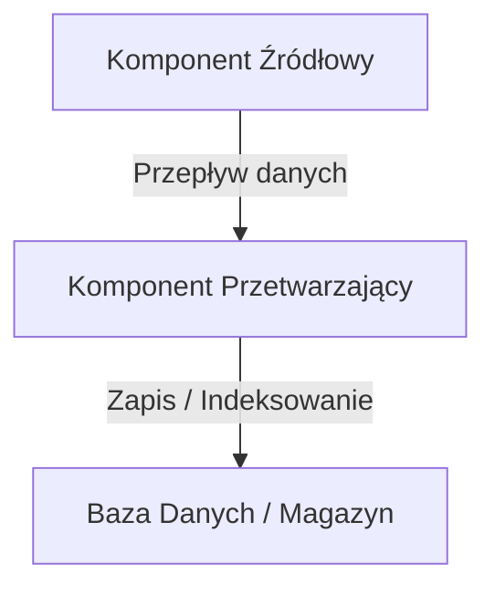

# Tytuł Artykułu: Pełna Nazwa

Krótkie wprowadzenie nakreślające cel technologii, kontekst biznesowy oraz architektoniczny.

---

## Spis Treści
1. [Wprowadzenie i Architektura Systemowa](#1-wprowadzenie-i-architektura-systemowa)
2. [Mechanizmy Niskopoziomowe i Cykl Życia](#2-mechanizmy-niskopoziomowe-i-cykl-życia)
3. [Dobre Praktyki i Przykłady Kodu](#3-dobre-praktyki-i-przykłady-kodu)
4. [Pytania Rekrutacyjne z Odpowiedziami (FAQ Interview)](#4-pytania-rekrutacyjne-z-odpowiedziami-faq-interview)
5. [Tablica Szybkiej Powtórki (Cheat-Sheet)](#5-tablica-szybkiej-powtórki-cheat-sheet)

---

## 1. Wprowadzenie i Architektura Systemowa



---

## 2. Mechanizmy Niskopoziomowe i Cykl Życia

Szczegółowa analiza działania struktur w pamięci, wątkowości, komunikacji sieciowej lub optymalizacji I/O.

---

## 3. Dobre Praktyki i Przykłady Kodu

```typescript
// Przykładowy kod ilustrujący dobre praktyki
export function exampleFunction(): void {
  // Implementacja
}
```

---

## 4. Pytania Rekrutacyjne z Odpowiedziami (FAQ Interview)

### Q1: [Pytanie Mid]
**Odpowiedź:**
Szczegółowa odpowiedź techniczna wyjaśniająca mechanizm działania pod maską.

### Q2: [Pytanie Senior/Lead]
**Odpowiedź:**
Głęboka analiza z uwzględnieniem kompromisów architektonicznych (trade-offs) i optymalizacji.

### Q3: Scenariusz Awaryjny (Troubleshooting)
**Problem:** Opis incydentu produkcyjnego.
**Diagnoza i Rozwiązanie:** Krok po kroku działania naprawcze.

---

## 5. Tablica Szybkiej Powtórki (Cheat-Sheet)

| Zagadnienie | Słowa Kluczowe do Użycia na Rozmowie |
| :--- | :--- |
| **Koncepcja A** | Słowo klucz 1, słowo klucz 2 |
| **Koncepcja B** | Słowo klucz 3, słowo klucz 4 |
