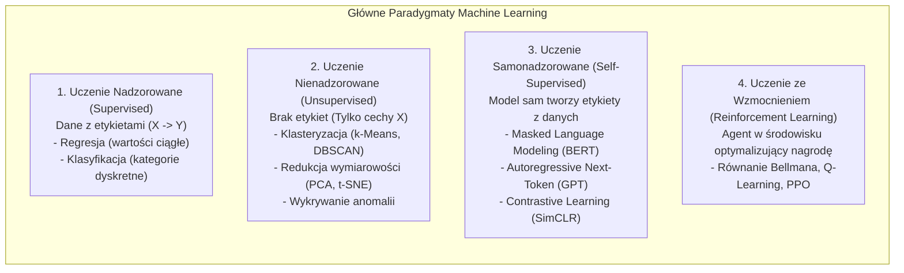
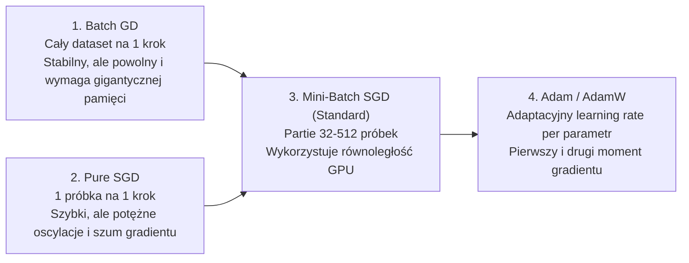
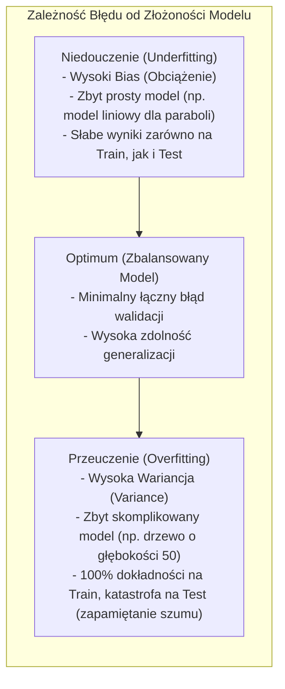
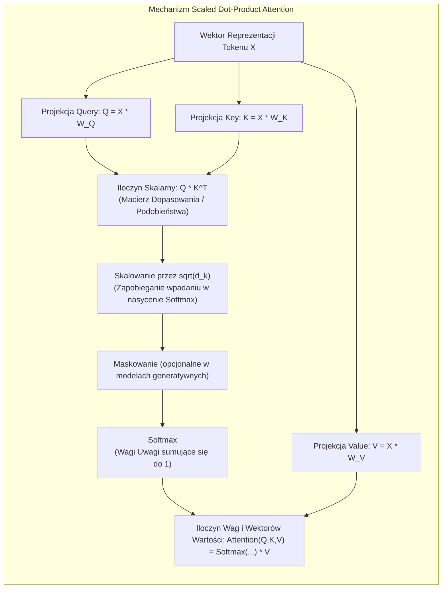
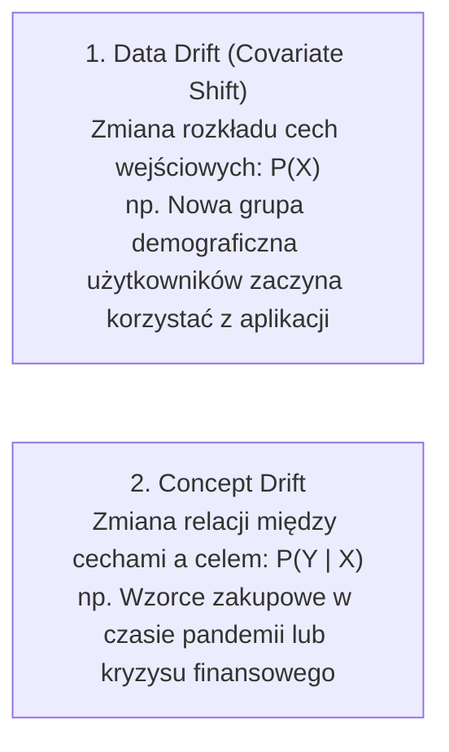
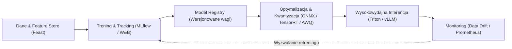

# Machine Learning: Fundamenty Matematyczne, Algorytmy, Deep Learning i Pytania Rekrutacyjne

Kompleksowe kompendium inżynierskie poświęcone **uczeniu maszynowemu (Machine Learning)** oraz **uczeniu głębokiemu (Deep Learning)**. Artykuł szczegółowo analizuje fundamenty matematyczne (rachunek różniczkowy wielu zmiennych, optymalizację wypukłą i stochastyczną), mechanikę algorytmów klasycznych (drzewa decyzyjne, lasy losowe, gradient boosting), propagację wsteczną w sieciach neuronowych, architekturę Transformerów i mechanizm *Self-Attention*, metryki ewaluacyjne, praktykę MLOps oraz obszerny zestaw pytań rekrutacyjnych i realnych scenariuszy awaryjnych (od poziomu Mid po Staff ML Engineera / AI Architecta).

---

## Spis Treści
1. [Taksonomia i Paradygmaty Uczenia Maszynowego](#1-taksonomia-i-paradygmaty-uczenia-maszynowego)
   - Formalna definicja uczenia (Zadanie $T$, Doświadczenie $E$, Miara jakości $P$)
   - Uczenie Nadzorowane (Supervised Learning: Regresja vs Klasyfikacja)
   - Uczenie Nienadzorowane (Unsupervised Learning: Klasteryzacja, PCA, UMAP)
   - Uczenie ze Wzmocnieniem (Reinforcement Learning) i Uczenie Samonadzorowane (Self-Supervised)
2. [Fundamenty Matematyczne i Teoria Generalizacji](#2-fundamenty-matematyczne-i-teoria-generalizacji)
   - Funkcje straty: MSE, MAE, Binary Cross-Entropy, Categorical Cross-Entropy, Focal Loss
   - Optymalizacja wzdłuż gradientu: Batch GD, SGD, Momentum, RMSprop oraz **Adam / AdamW**
   - Kompromis Obciążenia i Wariancji (**Bias-Variance Tradeoff**)
   - Techniki regularyzacji: L1 (Lasso), L2 (Ridge / Weight Decay), Dropout, Early Stopping
3. [Klasyczne Algorytmy Machine Learning (Mechanika i Złożoność)](#3-klasyczne-algorytmy-machine-learning-mechanika-i-złożoność)
   - Regresja Liniowa (Równanie Normalne vs GD) i Regresja Logistyczna (Sigmoid, Log-Odds)
   - Drzewa Decyzyjne: Entropia, Przyrost Informacji (Information Gain) i Indeks Giniego
   - Metody Zespołowe (Ensemble Learning):
     - **Bagging:** Random Forest (losowe próbkowanie cech i obserwacji)
     - **Boosting:** AdaBoost, Gradient Boosting Machines (GBM), **XGBoost, LightGBM, CatBoost**
   - Support Vector Machines (SVM) i Kernel Trick w przestrzeni Hilberta
4. [Deep Learning i Nowoczesne Architektury Sieciowe](#4-deep-learning-i-nowoczesne-architektury-sieciowe)
   - Perceptron Wielowarstwowy (MLP) i Backpropagation (Reguła łańcuchowa)
   - Problem zanikającego i eksplodującego gradientu (Vanishing / Exploding Gradients)
   - Funkcje aktywacji: Sigmoid, Tanh, ReLU, LeakyReLU, GELU, Swish
   - Inicjalizacja wag (He / Xavier) oraz techniki normalizacji (Batch Normalization vs Layer Normalization)
   - Sieci splotowe (CNN, ResNet i połączenia rezydualne)
   - **Architektura Transformer:** Mechanizm Self-Attention ($Q, K, V$), Scaled Dot-Product, Multi-Head Attention
5. [Ewaluacja Modeli i Metryki Jakości](#5-ewaluacja-modeli-i-metryki-jakości)
   - Macierz Pomyłek (Confusion Matrix): TP, FP, TN, FN
   - Precision, Recall, F1-Score, Krzywe ROC-AUC i PR-AUC przy niezbalansowanych klasach
   - Metryki regresji: MAE, RMSE, MAPE, $R^2$
   - Monitorowanie dryfu w produkcji: Data Drift vs Concept Drift
6. [Inżynieria MLOps (Od Eksperymentu do Produkcji)](#6-inżynieria-mlops-od-eksperymentu-do-produkcji)
   - Cykl życia modelu i śledzenie eksperymentów (MLflow, Weights & Biases)
   - Serwowanie modeli (Triton Inference Server, vLLM, TorchServe)
   - Techniki kwantyzacji i optymalizacji inferencji (FP16, INT8, INT4, AWQ, TensorRT, ONNX)
7. [Pytania Rekrutacyjne z Odpowiedziami (FAQ Interview)](#7-pytania-rekrutacyjne-z-odpowiedziami-faq-interview)
   - Pytania Podstawowe i Średniozaawansowane (Mid)
   - Pytania Zaawansowane i Architektoniczne (Senior / Staff ML Engineer)
   - Scenariusze Awaryjne i Live-fire Troubleshooting
8. [Tablica Szybkiej Powtórki (Cheat-Sheet)](#8-tablica-szybkiej-powtórki-cheat-sheet)

---

## 1. Taksonomia i Paradygmaty Uczenia Maszynowego

Zgodnie z klasyczną definicją **Toma Mitchella (1997)**:
> Program komputerowy uczy się na podstawie doświadczenia $E$ w odniesieniu do pewnej klasy zadań $T$ i miary jakości $P$, jeśli jego jakość w zadaniach z $T$, mierzona za pomocą $P$, poprawia się wraz z doświadczeniem $E$.



### 1. Uczenie Nadzorowane (Supervised Learning)
Model otrzymuje zbiór par $(\mathbf{x}_i, y_i)$, gdzie $\mathbf{x}_i \in \mathbb{R}^d$ to wektor cech (*features*), a $y_i$ to etykieta docelowa (*target*). Celem jest aproksymacja funkcji $f: \mathcal{X} \rightarrow \mathcal{Y}$.
- **Regresja:** $y \in \mathbb{R}$ (np. predykcja ceny nieruchomości, estymacja czasu dostawy).
- **Klasyfikacja:** $y \in \{0, 1\}$ (binarna) lub $y \in \{1, \dots, C\}$ (wieloklasowa) — np. detekcja spamu, rozpoznawanie obiektów na zdjęciach.

### 2. Uczenie Nienadzorowane (Unsupervised Learning)
Model dysponuje wyłącznie wektorami cech $\mathbf{x}_i$ bez jakichkolwiek etykiet. Celem jest odkrycie ukrytej struktury danych:
- **Klasteryzacja (Grupowanie):** Podział próbek na klastry o wysokim podobieństwie wewnątrz grupy i niskim pomiędzy grupami (np. segmentacja klientów w marketingu).
- **Redukcja wymiarowości:** Odwzorowanie przestrzeni $\mathbb{R}^D \rightarrow \mathbb{R}^d$ ($d \ll D$) przy zachowaniu maksimum informacji lub relacji odległościowych (np. kompresja danych, wizualizacja).

### 3. Uczenie ze Wzmocnieniem (Reinforcement Learning)
Model (**Agent**) wchodzi w interakcję ze **Środowiskiem** w dyskretnych krokach czasowych. Na podstawie stanu $s_t$ podejmuje akcję $a_t$, przechodząc do stanu $s_{t+1}$ i otrzymując skalarną nagrodę $r_t$. Celem jest maksymalizacja skumulowanej, zdyskontowanej nagrody w czasie:
$$G_t = \sum_{k=0}^{\infty} \gamma^k r_{t+k+1}, \quad \gamma \in [0, 1)$$

---

## 2. Fundamenty Matematyczne i Teoria Generalizacji

### Funkcje Straty (Loss Functions)

Uczenie modelu polega na minimalizacji funkcji straty $\mathcal{L}(\theta)$ po parametrach modelu $\theta$:

1. **Błąd Średniokwadratowy (MSE - Mean Squared Error):**
   Stosowany w regresji. Silnie karze duże błędy ze względu na potęgowanie:
   $$\text{MSE} = \frac{1}{N} \sum_{i=1}^N (y_i - \hat{y}_i)^2$$
2. **Entropia Krzyżowa (Binary Cross-Entropy / Log-Loss):**
   Standard w klasyfikacji binarnej. Mierzy rozbieżność między prawdziwym rozkładem prawdopodobieństwa $y \in \{0, 1\}$ a prawdopodobieństwem przewidzianym przez model $\hat{y} \in (0, 1)$:
   $$\text{BCE} = -\frac{1}{N} \sum_{i=1}^N \left[ y_i \log(\hat{y}_i) + (1 - y_i) \log(1 - \hat{y}_i) \right]$$
3. **Kategorialna Entropia Krzyżowa (Categorical Cross-Entropy):**
   Dla $C$ klas w połączeniu z funkcją aktywacji Softmax:
   $$\text{CCE} = -\sum_{c=1}^C y_{i,c} \log(\hat{y}_{i,c})$$

---

### Algorytmy Optymalizacji wzdłuż Gradientu



#### Optymalizator AdamW (Adaptive Moment Estimation with Decoupled Weight Decay)
Klasyczny algorytm **Adam** śledzi wykładniczą średnią kroczącą gradientów ($m_t$ - pierwszy moment) oraz kwadratów gradientów ($v_t$ - drugi moment):
$$m_t = \beta_1 m_{t-1} + (1 - \beta_1) g_t, \quad v_t = \beta_2 v_{t-1} + (1 - \beta_2) g_t^2$$
$$\hat{m}_t = \frac{m_t}{1 - \beta_1^t}, \quad \hat{v}_t = \frac{v_t}{1 - \beta_2^t}$$
$$\theta_t = \theta_{t-1} - \frac{\eta}{\sqrt{\hat{v}_t} + \epsilon} \hat{m}_t$$

> [!IMPORTANT]
> **Dlaczego AdamW zastąpił Adama?**
> W oryginalnym Adamie regularyzacja L2 była dodawana bezpośrednio do gradientu $g_t$. Powodowało to, że parametry o dużych historycznych gradientach otrzymywały mniejszy współczynnik zanikania wag (*weight decay*). **AdamW rozdziela regularyzację L2 od aktualizacji momentów**, aplikując zanikanie wagi bezpośrednio do parametru: $\theta_t = \theta_{t-1} - \eta \lambda \theta_{t-1} - \dots$, co drastycznie poprawia zdolność generalizacji głębokich sieci i Transformerów.

---

### Kompromis Obciążenia i Wariancji (Bias-Variance Tradeoff)

Błąd generalizacji dowolnego modelu estymującego na nieznanych danych testowych rozkłada się na trzy składowe:
$$\mathbb{E}[(y - \hat{f}(x))^2] = \text{Bias}^2[\hat{f}(x)] + \text{Var}[\hat{f}(x)] + \sigma^2$$



#### Techniki Zwalczania Overfittingu:
1. **Regularyzacja L1 (Lasso):** Dodaje do funkcji straty karę proporcjonalną do sumy wartości bezwzględnych wag: $\lambda \sum |\theta_j|$. Powoduje **zerowanie części współczynników**, działając jako automatyczna selekcja cech (*Sparsity*).
2. **Regularyzacja L2 (Ridge / Weight Decay):** Dodaje karę proporcjonalną do sumy kwadratów wag: $\frac{\lambda}{2} \sum \theta_j^2$. Dusi wagi ku zeru, zapobiegając nadmiernemu uzależnieniu modelu od pojedynczych cech, ale rzadko redukuje wagi dokładnie do zera.
3. **Dropout:** W trakcie każdej iteracji treningowej losowo wyłącza (zeruje wyjścia) określony procent neuronów (np. $p=0.5$). Zmusza sieć do uczenia się redundantnych reprezentacji i zapobiega ko-adaptacji cech.
4. **Early Stopping:** Zatrzymanie treningu w momencie, gdy błąd na zbiorze walidacyjnym zaczyna rosnąć, mimo że błąd na zbiorze treningowym nadal spada.

---

## 3. Klasyczne Algorytmy Machine Learning (Mechanika i Złożoność)

### Drzewa Decyzyjne i Metody Zespołowe (Ensembles)

Drzewa decyzyjne dzielą przestrzeń cech na hiper-prostokąty za pomocą reguł typu $x_j \le t$. 
Węzły wybierają podziały maksymalizujące spadek nieczystości:
- **Indeks Giniego (CART):** $G = 1 - \sum_{i=1}^C p_i^2$
- **Entropia (ID3 / C4.5):** $H = -\sum_{i=1}^C p_i \log_2(p_i)$

Pojedyncze drzewo decyzyjne ma **bardzo niski bias, ale ogromną wariancję** (jest niestabilne i łatwo ulega overfittingowi). Aby temu zaradzić, stosuje się metody zespołowe:

```mermaid
flowchart TD
    subgraph Bagging["1. Bagging (np. Random Forest)"]
        direction TB
        BData["Oryginalny Zbiór"] -->|Bootstrap (losowanie ze zwracaniem)| S1["Próbka 1"] & S2["Próbka 2"] & S3["Próbka 3"]
        S1 --> T1["Niezależne Drzewo 1"]
        S2 --> T2["Niezależne Drzewo 2"]
        S3 --> T3["Niezależne Drzewo 3"]
        T1 & T2 & T3 --> Agg["Agregacja (Głosowanie większościowe / Średnia)\nCel: Drastyczna REDUKCJA WARIANCJI"]
    end

    subgraph Boosting["2. Boosting (np. XGBoost / LightGBM)"]
        direction TB
        M1["Model 1 (Płytkie drzewo)"] -->|Obliczenie reszt / błędów| Res1["Błędy (Residuals)"]
        Res1 --> M2["Model 2 (Uczy się przewidywać błędy M1)"]
        M2 -->|Kolejne reszty| M3["Model 3 (Koryguje poprzedników)"]
        M3 --> WeightedSum["Ważona suma predykcji wszystkich modeli\nCel: REDUKCJA BIASU i Wariancji"]
    end
```

#### Przewaga XGBoost (Extreme Gradient Boosting):
W tradycyjnym Gradient Boostingu funkcja straty jest aproksymowana przy użyciu rozwinięcia Taylora pierwszego rzędu (tylko gradient). **XGBoost wykorzystuje rozwinięcie Taylora drugiego rzędu** (zarówno gradient $g_i$, jak i hesjan $h_i$ — drugą pochodną):
$$\mathcal{L}^{(t)} \approx \sum_{i=1}^n \left[ l(y_i, \hat{y}^{(t-1)}) + g_i f_t(x_i) + \frac{1}{2} h_i f_t^2(x_i) \right] + \Omega(f_t)$$
Umożliwia to precyzyjne wyliczenie optymalnej wagi liścia $w_j^* = -\frac{\sum g_i}{\sum h_i + \lambda}$ oraz wbudowaną regularyzację $\Omega$, co zapewnia niezrównaną prędkość zbieżności i odporność na przeuczenie na danych tabelarycznych.

---

## 4. Deep Learning i Nowoczesne Architektury Sieciowe

### Algorytm Wstecznej Propagacji Błędu (Backpropagation)
Uczenie sieci neuronowej opiera się na obliczeniu pochodnych cząstkowych funkcji straty względem każdej wagi za pomocą **reguły łańcuchowej różniczkowania (Chain Rule)**:

```mermaid
flowchart LR
    Input["Wejście x"] -->|Waga W1| Hidden["Neuron Ukryty z = W1*x + b\nAktywacja a = f(z)"]
    Hidden -->|Waga W2| Output["Wyjście y_hat"]
    Output --> Loss["Strata L(y, y_hat)"]
    
    Loss -.->|dL / dy_hat| dOut["Gradient Wyjścia"]
    dOut -.->|* f'(z)| dHidden["Gradient Ukryty"]
    dHidden -.->|* x| dWeight["dL / dW1 (Aktualizacja wagi)"]
```

$$\frac{\partial \mathcal{L}}{\partial W^{(l)}} = \frac{\partial \mathcal{L}}{\partial a^{(l)}} \cdot \frac{\partial a^{(l)}}{\partial z^{(l)}} \cdot \frac{\partial z^{(l)}}{\partial W^{(l)}}$$

#### Problem Zanikającego Gradientu (Vanishing Gradient):
Dla klasycznych funkcji aktywacji, takich jak Sigmoid ($\sigma'(z) \le 0.25$) lub Tanh ($\tanh'(z) \le 1.0$), mnożenie wielu ułamków w głębokiej sieci powoduje, że gradient na początkowych warstwach dąży do zera ($\approx 0$). Wagi pierwszych warstw przestają się uczyć.
- **Rozwiązanie 1: Funkcja ReLU (Rectified Linear Unit):** $f(z) = \max(0, z)$. Dla $z > 0$ pochodna wynosi dokładnie $1.0$, co pozwala gradientowi płynąć bez tłumienia przez dziesiątki warstw.
- **Rozwiązanie 2: Połączenia Rezydualne (Skip Connections w ResNet):** Warstwa uczy się funkcji resztowej $F(x) = \mathcal{H}(x) - x$. Przekazanie tożsamościowe $x + F(x)$ tworzy "autostradę" dla gradientu: $\frac{\partial}{\partial x}(x + F(x)) = 1 + F'(x)$, gwarantując, że gradient nigdy nie zanika do zera.

---

### Architektura Transformer i Mechanizm Self-Attention

Wprowadzona w 2017 roku przez zespół Google ("Attention Is All You Need") architektura Transformer zrewolucjonizowała NLP, Computer Vision i całą branżę AI, całkowicie eliminując rekurencję (RNN/LSTM) na rzecz równoległego przetwarzania z mechanizmem **Self-Attention**.



#### Równanie Scaled Dot-Product Attention:
$$\text{Attention}(Q, K, V) = \text{Softmax}\left( \frac{Q K^T}{\sqrt{d_k}} \right) V$$

- **$Q$ (Query):** „Czego szuka dany token?”
- **$K$ (Key):** „Jaką treść reprezentuje dany token?”
- **$V$ (Value):** „Jaką informację niesie dany token, jeśli nastąpi dopasowanie?”
- **Dlaczego dzielimy przez $\sqrt{d_k}$?** Przy dużej wymiarowości wektorów $d_k$ iloczyn skalarny $Q \cdot K^T$ osiąga bardzo duże wartości liczbowe. Funkcja Softmax wpada wtedy w rejony o skrajnie małych gradientach (nasycenie), co paraliżuje proces uczenia wstecznego. Skalowanie normalizuje wariancję wyniku do poziomu $1.0$.

---

## 5. Ewaluacja Modeli i Metryki Jakości

### Macierz Pomyłek i Metryki Klasyfikacji

```
                    Rzeczywistość: POZYTYW (1)     Rzeczywistość: NEGATYW (0)
Predykcja: POZYTYW (1)       True Positive (TP)             False Positive (FP) [Błąd I Rodzaju]
Predykcja: NEGATYW (0)      False Negative (FN) [Błąd II]   True Negative (TN)
```

1. **Accuracy (Dokładność):** $\frac{TP + TN}{TP + TN + FP + FN}$.
   - **Kiedy kłamie?** Przy niezbalansowanych klasach! Jeśli w detekcji oszustw kartowych fraud stanowi 0.1% transakcji, model zwracający zawsze "0" osiąga **99.9% Accuracy**, będąc w praktyce całkowicie bezużytecznym.
2. **Precision (Precyzja):** $\frac{TP}{TP + FP}$ — „Kiedy model mówi, że to oszustwo, jak często ma rację?” (Kluczowa, gdy koszt fałszywego alarmu $FP$ jest ogromny, np. blokada konta niewinnego klienta).
3. **Recall / Czułość (Sensitivity):** $\frac{TP}{TP + FN}$ — „Jaki odsetek wszystkich faktycznych oszustw model zdołał wykryć?” (Kluczowa w medycynie — nie wolno wypuścić chorego pacjenta jako zdrowego $FN$).
4. **F1-Score:** Średnia harmoniczna Precision i Recall:
   $$F_1 = 2 \cdot \frac{\text{Precision} \cdot \text{Recall}}{\text{Precision} + \text{Recall}}$$
5. **ROC-AUC (Receiver Operating Characteristic):** Pole pod krzywą True Positive Rate vs False Positive Rate dla wszystkich możliwych progów odcięcia (*thresholds*). Miara odporna na przesunięcia progu klasyfikacji.

---

### Monitorowanie w Produkcji: Data Drift vs Concept Drift

W momencie wdrożenia modelu na produkcję rozpoczyna się proces jego powolnej degradacji (*Model Decay*):



- **Wykrywanie Data Driftu:** Testy statystyczne porównujące rozkład cech z treningu z rozkładem produkcyjnym (np. **Test Kołmogorowa-Smirnowa**, wskaźnik **PSI - Population Stability Index**, dywergencja Kullbacka-Leiblera).

---

## 6. Inżynieria MLOps (Od Eksperymentu do Produkcji)

Dyscyplina MLOps (Machine Learning Operations) przenosi zasady DevOps (CI/CD, automatyzację, wersjonowanie, monitoring) na grunt cyklu życia modeli sztucznej inteligencji.



### Kwantyzacja Modeli (Quantization)
Kwantyzacja to technika kompresji modelu polegająca na konwersji wag i aktywacji z precyzji 32-bitowych liczb zmiennoprzecinkowych (**FP32**) na formaty o niższej precyzji: **FP16**, **BF16**, **INT8**, a nawet **INT4**:
- **Zalety:** 4-krotne zmniejszenie zapotrzebowania na pamięć VRAM GPU (umożliwia uruchomienie 70-miliardowego modelu LLM na pojedynczej karcie graficznej zamiast klastra 8x A100).
- **Zwiększenie przepustowości:** Instrukcje wektorowe INT8 na dedykowanych rdzeniach Tensor Cores wykonują się drastycznie szybciej przy znikomym (< 1%) spadku dokładności językowej/predykcyjnej.
- **Wiodące techniki:** **AWQ (Activation-aware Weight Quantization)** oraz **GPTQ**.

---

## 7. Pytania Rekrutacyjne z Odpowiedziami (FAQ Interview)

### Pytania Podstawowe i Średniozaawansowane (Mid)

#### Pytanie 1: Wyjaśnij intuicyjnie i matematycznie kompromis Bias-Variance Tradeoff.
**Odpowiedź:**
Błąd modelu na nowych danych rozkłada się na Obciążenie (Bias), Wariancję (Variance) i szum nierozerwalny ($\sigma^2$):
- **Bias (Błąd uproszczenia):** Wynika z błędnych założeń algorytmu. Wysoki bias oznacza, że model jest zbyt sztywny i nie potrafi uchwycić zależności w danych (**Underfitting**), np. dopasowanie prostej linii do punktów układających się w parabolę.
- **Variance (Błąd wrażliwości na dane):** Mierzy, jak bardzo predykcje modelu zmieniłyby się, gdybyśmy wytrenowali go na innym podzbiorze danych. Wysoka wariancja oznacza, że model uczy się szumu i losowości w zbiorze treningowym (**Overfitting**), generując skrajnie różne wyniki na nowych danych.
- **Kompromis:** Zwiększanie złożoności modelu (np. głębsze drzewa, więcej parametrów w sieci) redukuje Bias, ale zwiększa Wariancję. Zadaniem inżyniera jest znalezienie punktu optymalnego (poprzez regularyzację, walidację krzyżową i dobór hiperparametrów), który minimalizuje łączny błąd testowy.

---

#### Pytanie 2: Czym różni się regularyzacja L1 (Lasso) od L2 (Ridge) pod kątem zachowania wag i geometrii przestrzeni parametrów?
**Odpowiedź:**
- **L1 (Lasso - norma $\ell_1$):** Dodaje do funkcji straty karę $\lambda \sum |\theta_i|$. W przestrzeni optymalizacji ograniczenie L1 ma kształt wielościanu z ostrymi wierzchołkami (w 2D: romb). Poziomice funkcji straty niemal zawsze stykają się z rombem w jednym z jego wierzchołków leżących na osiach współrzędnych. Skutkuje to **całkowitym wyzerowaniem części wag** ($\theta_k = 0$), co oznacza automatyczną redukcję wymiarowości i selekcję cech.
- **L2 (Ridge - norma $\ell_2$):** Dodaje karę $\frac{\lambda}{2} \sum \theta_i^2$. Ograniczenie L2 ma kształt gładkiej hiperkuli (w 2D: koło). Poziomice stykają się z kołem w dowolnym punkcie, przez co wagi są **równomiernie tłumione ku zeru**, ale praktycznie nigdy nie osiągają dokładnie zera. L2 doskonale radzi sobie ze współliniowością cech (*Multicollinearity*).

---

#### Pytanie 3: Dlaczego metryka Accuracy bywa myląca i kiedy należy użyć PR-AUC zamiast ROC-AUC?
**Odpowiedź:**
Accuracy mierzy jedynie ogólny odsetek poprawnych predykcji. Przy silnym niezrównoważeniu klas (np. 99% transakcji poprawnych i 1% oszustw), model przypisujący wszystkim transakcjom klasę „0” osiąga 99% Accuracy, całkowicie zawodząc w swoim zadaniu biznesowym.

- **ROC-AUC:** Mierzy relację między True Positive Rate ($TP / (TP + FN)$) a False Positive Rate ($FP / (FP + TN)$). Ponieważ $TN$ znajduje się w mianowniku FPR, ogromna liczba negatywnych próbek sprawia, że FPR pozostaje sztucznie bardzo niski, przez co krzywa ROC-AUC może wyglądać optymistycznie (np. 0.95), mimo że model produkuje mnóstwo fałszywych alarmów.
- **PR-AUC (Precision-Recall Curve):** Skupia się wyłącznie na klasie mniejszościowej (pozytywnej). Nie uwzględnia w mianowniku liczby $TN$. Gdy zależy nam na detekcji rzadkich anomalii i minimalizacji fałszywych alarmów (np. wykrywanie rzadkich chorób, detekcja fraudów), **PR-AUC jest bezwzględnie jedyną miarodajną metryką**.

---

#### Pytanie 4: Na czym polega problem zanikającego gradientu (Vanishing Gradient) i jak rozwiązuje go funkcja ReLU oraz architektura ResNet?
**Odpowiedź:**
Podczas obliczania gradientu metodą propagacji wstecznej stosujemy regułę łańcuchową. W klasycznych sieciach z funkcją Sigmoid pochodna $\sigma'(z) \le 0.25$. Mnożenie kilkudziesięciu wartości $\le 0.25$ powoduje, że gradient docierający do początkowych warstw sieci zanika wykładniczo do zera, przez co wagi pierwszych warstw nie aktualizują się w procesie uczenia.

- **Funkcja ReLU:** Dla wartości dodatnich $z > 0$ jej pochodna wynosi stale $1.0$. Gradient płynie przez sieć bez tłumienia wartością pochodnej aktywacji.
- **ResNet (Residual Networks):** Wprowadza połączenia skrótowe (*Skip Connections*): $y = \mathcal{F}(x) + x$. Gradient funkcji wynosi $\frac{\partial y}{\partial x} = \frac{\partial \mathcal{F}(x)}{\partial x} + 1$. Obecność składnika $+1$ gwarantuje, że gradient może przepływać wstecz bezpośrednio do najwcześniejszych warstw bez żadnych strat, umożliwiając skuteczny trening sieci o głębokości 100+ warstw.

---

#### Pytanie 5: Jaka jest fundamentalna różnica w sposobie działania lasów losowych (Random Forest) a gradient boostingu (XGBoost)?
**Odpowiedź:**
- **Random Forest (Bagging):**
  - Buduje setki **głębokich, niezależnych od siebie drzew decyzyjnych** w sposób równoległy.
  - Każde drzewo trenowane jest na losowej podpróbce danych ze zwracaniem (*Bootstrap*) oraz na losowym podzbiorze cech w każdym węźle (*Feature Subsampling*).
  - Celem jest **redukcja wariancji** poprzez uśrednienie nieskorelowanych ze sobą drzew.
- **Gradient Boosting (Boosting):**
  - Buduje drzewa **sekwencyjnie**.
  - Zazwyczaj wykorzystuje **bardzo płytkie drzewa (tzw. słabe klasyfikatory - Weak Learners)**.
  - Każde kolejne drzewo jest trenowane tak, aby przewidywać błędy (rezydua / gradient funkcji straty) popełnione przez dotychczasowy zespół drzew.
  - Celem jest **redukcja błędu obciążenia (Bias)** przy zachowaniu kontroli nad wariancją.

---

### Pytania Zaawansowane i Architektoniczne (Senior / Staff ML Engineer)

#### Pytanie 6: Wyprowadź i wyjaśnij matematyczny mechanizm Self-Attention w architekturze Transformer. Dlaczego iloczyn skalarny jest dzielony przez $\sqrt{d_k}$?
**Odpowiedź:**
Niech wejściowa sekwencja reprezentowana będzie przez macierz $X \in \mathbb{R}^{n \times d}$.
Rzutujemy ją za pomocą wyuczonych wag na trzy przestrzenie:
$$Q = X W_Q, \quad K = X W_K, \quad V = X W_V$$
Iloczyn $Q K^T$ mierzy podobieństwo pomiędzy każdą parą tokenów w sekwencji.

**Dlaczego skalujemy przez $\sqrt{d_k}$?**
Załóżmy, że składowe wektorów $q$ i $k$ są niezależnymi zmiennymi losowymi o średniej 0 i wariancji 1.
Iloczyn skalarny to suma $d_k$ takich iloczynów: $q \cdot k = \sum_{i=1}^{d_k} q_i k_i$.
Wariancja sumy niezależnych zmiennych to suma wariancji:
$$\text{Var}(q \cdot k) = \sum_{i=1}^{d_k} \text{Var}(q_i k_i) = d_k$$
Odchylenie standardowe rośnie więc proporcjonalnie do $\sqrt{d_k}$. Dla dużych wymiarowości (np. $d_k = 64$ lub $128$) wartości iloczynu skalarnego stają się bardzo duże, co spycha funkcję Softmax w obszary o skrajnie płaskim gradiencie (bliskim zeru). Dzielenie przez $\sqrt{d_k}$ normalizuje wariancję z powrotem do $1.0$, zapewniając stabilny przepływ gradientów w trakcie wstecznej propagacji.

---

#### Pytanie 7: Jak działa optymalizator AdamW i dlaczego standardowa implementacja Adama z regularyzacją L2 w bibliotekach ML była fundamentalnie wadliwa?
**Odpowiedź:**
W klasycznej teorii optymalizacji (dla SGD) regularyzacja L2 i zanikanie wag (*Weight Decay*) są matematycznie równoważne. Z tego powodu twórcy wczesnych bibliotek (np. wczesny PyTorch/TensorFlow) implementowali L2 w Adamie po prostu dodając $\lambda \theta_{t-1}$ bezpośrednio do wektora gradientu:
$$g_t = \nabla \mathcal{L}(\theta_{t-1}) + \lambda \theta_{t-1}$$
**Dlaczego to było błędem w Adamie?**
Adam normalizuje krok aktualizacji przez pierwiastek z drugiego momentu gradientów: $\theta_t = \theta_{t-1} - \frac{\eta}{\sqrt{\hat{v}_t} + \epsilon} \hat{m}_t$.
W rezultacie parametr o dużej historii gradientów (duże $v_t$) otrzymywał **znacznie mniejszą karę regularyzacyjną**, podczas gdy rzadko aktualizowany parametr otrzymywał karę nieproporcjonalnie dużą.

**Rozwiązanie w AdamW (Loshchilov & Hutter):**
Zanikanie wag zostało całkowicie oddzielone (*Decoupled*) od adaptacyjnych momentów gradientu:
$$\theta_t = \theta_{t-1} - \eta \lambda \theta_{t-1} - \frac{\eta}{\sqrt{\hat{v}_t} + \epsilon} \hat{m}_t$$
Waga zanika proporcjonalnie do swojej wartości, niezależnie od wielkości jej gradientów, co diametralnie poprawiło generalizację głębokich sieci neuronowych i stało się standardem w treningu modeli LLM.

---

#### Pytanie 8: Porównaj Batch Normalization z Layer Normalization. Dlaczego w modelach NLP i Transformerach stosuje się wyłącznie LayerNorm?
**Odpowiedź:**
- **Batch Normalization (BatchNorm):**
  Normalizuje aktywacje wzdłuż **wymiaru batcha** (próbkowania) dla każdej cechy niezależnie: oblicza średnią i wariancję z wszystkich próbek w danym mini-batchu.
- **Layer Normalization (LayerNorm):**
  Normalizuje aktywacje wzdłuż **wymiaru cech** dla każdej próbki niezależnie: oblicza średnią i wariancję ze wszystkich neuronów/kanałów danej warstwy dla pojedynczego wektora.

**Dlaczego Transformery i NLP używają LayerNorm?**
1. **Zmienna długość sekwencji (Variable Sequence Length):** W NLP zdania w batchu mają różne długości (są dopełniane tokenami paddingu). Statystyki mini-batcha w BatchNorm byłyby zafałszowane przez sztuczne zera z paddingu.
2. **Niezależność od wielkości batcha:** BatchNorm całkowicie zawodzi przy małych rozmiarach batcha (np. batch size = 1 lub 2 podczas treningu wielkich modeli na wielu GPU), ponieważ oszacowanie wariancji jest skrajnie niestabilne. LayerNorm działa identycznie niezależnie od tego, czy wielkość batcha wynosi 1 czy 1000.
3. **Spójność w fazie inferencji:** LayerNorm nie musi utrzymywać globalnych średnich kroczących (*Running Mean / Variance*) na potrzeby inferencji — oblicza statystyki dynamicznie dla każdego pojedynczego tokena w locie.

---

#### Pytanie 9: Czym różni się Data Drift od Concept Drift i jak zaprojektować architekturę automatycznego reagowania na te zjawiska w MLOps?
**Odpowiedź:**
Zgodnie z regułą prawdopodobieństwa łącznego: $P(X, Y) = P(X) \cdot P(Y | X)$:
- **Data Drift (Covariate Shift):** Zmianie ulega rozkład cech wejściowych $P(X)$, podczas gdy relacja warunkowa $P(Y | X)$ pozostaje bez zmian. (Przykład: średni wiek użytkowników aplikacji wzrósł z 25 do 50 lat, ale zależność między dochodem a spłatą kredytu jest taka sama).
- **Concept Drift:** Zmianie ulega fundamentalna relacja $P(Y | X)$, nawet jeśli rozkład cech wejściowych $P(X)$ pozostał identyczny. (Przykład: transakcja na kwotę 5000 zł o godzinie 3:00 w nocy przed pandemią była w 90% oszustwem, a po przejściu na pracę zdalną stała się normą).

**Architektura MLOps:**
1. **Kolekcjonowanie telemetryczne:** Serwer inferencyjny przesyła asynchronicznie próbki wejściowe $X$ do hurtowni danych (np. BigQuery / Snowflake / S3).
2. **Cykliczne testy statystyczne (np. z Evidently AI / Great Expectations):** Obliczanie metryki **Population Stability Index (PSI)**:
   - $\text{PSI} < 0.1$: Brak zmian.
   - $0.1 \le \text{PSI} \le 0.2$: Umiarkowany drift (ostrzeżenie w monitoringach).
   - $\text{PSI} > 0.2$: Istotny drift — automatyczne wyzwolenie pipeline'u CI/CD dotrenowującego model na oknie czasowym z ostatnich 30 dni.
3. **Pętla sprzężenia zwrotnego etykiet (Ground Truth Ingestion):** W miarę napływania prawdziwych etykiet biznesowych (np. reklamacje fraudowe po 30 dniach) system automatycznie weryfikuje metryki biznesowe (PR-AUC / F1) i uruchamia procedurę A/B testów lub Canary Release dla nowego modelu.

---

#### Pytanie 10: Jak działają techniki kwantyzacji Post-Training Quantization (PTQ) vs Quantization-Aware Training (QAT)?
**Odpowiedź:**
Kwantyzacja mapuje ciągłe liczby 32-bitowe na dyskretną siatkę liczb całkowitych (np. INT8 w zakresie $[-128, 127]$):
$$q = \text{round}\left(\frac{x}{S}\right) + Z$$
gdzie $S$ to współczynnik skali (*Scale*), a $Z$ to punkt zerowy (*Zero-Point*).

1. **PTQ (Post-Training Quantization):**
   - Stosowana na w pełni wytrenowanym modelu FP32 bez konieczności powtórnego treningu.
   - Używa małego zbioru kalibracyjnego (np. 100-500 próbek) do wyznaczenia optymalnych progów nasycenia skali $S$ (np. za pomocą dywergencji Kullbacka-Leiblera).
   - Bardzo szybka (trwa kilka minut), ale w bardzo głębokich modelach może prowadzić do zauważalnego spadku dokładności (degradacji).
2. **QAT (Quantization-Aware Training):**
   - Model symuluje błędy zaokrągleń kwantyzacji już **w trakcie fazy treningu**.
   - W przejściu w przód (*Forward Pass*) wagi i aktywacje są sztucznie zaokrąglane do precyzji INT8 (*Fake Quantization*).
   - W przejściu wstecz (*Backward Pass*) stosuje się estymator **Straight-Through Estimator (STE)**, który ignoruje operację zaokrąglenia i przepuszcza gradient tak, jakby funkcja była ciągła.
   - Sieć adaptuje pozostałe wagi, kompensując straty precyzji, co pozwala na osiągnięcie niemal 100% pierwotnej dokładności modelu FP32.

---

### Scenariusze Awaryjne i Live-fire Troubleshooting

#### Scenariusz 1: Model wykazuje 99.8% dokładności na zbiorze walidacyjnym, ale na produkcji całkowicie zawodzi
* **Objaw produkcyjny:** Model scoringowy churnu klientów w notebooku eksperymentalnym osiągał niemal doskonałe metryki ($AUC = 0.998$). Po wdrożeniu na środowisko produkcyjne jakość modelu spadła do poziomu losowego zgadywania ($AUC = 0.51$).
* **Analiza Root Cause:**
  **Wyciek danych (Data Leakage / Target Leakage):**
  1. Podczas inżynierii cech do macierzy treningowej włączono kolumnę `data_zamknięcia_konta` lub zmienną `liczba_ankiet_rezygnacyjnych`.
  2. Zmienne te w rzeczywistości powstają w bazie danych **po tym**, jak klient podjął decyzję o odejściu.
  3. Model nauczył się trywialnej zależności, która na produkcji w momencie predykcji jest niedostępna (na produkcji pole to było zawsze puste / NULL).
* **Rozwiązanie i Naprawa:**
  1. Wprowadzenie rygorystycznej zasady podziału danych opartego na czasie (**Temporal Split / Time-based Split**) zamiast losowego podziału `train_test_split`.
  2. Budowa pipeline'ów transformacji cech wyłącznie z użyciem klas `Pipeline` i `ColumnTransformer` (fitowany wyłącznie na zbiorze treningowym).
  3. Audyt ważności cech (*Feature Importance*) — jeśli jedna cecha dominuje 95% ważności modelu, zachodzi wysokie prawdopodobieństwo Target Leakage.

---

#### Scenariusz 2: Niestabilność numeryczna i błąd "Loss: NaN" w trakcie treningu głębokiej sieci neuronowej
* **Objaw produkcyjny:** Podczas 12. epoki treningu modelu wizyjnego funkcja straty nagle skacze do nieskończoności, po czym w kolejnych iteracjach raportuje wyłącznie wartość `NaN` (Not a Number).
* **Analiza Root Cause:**
  1. Zjawisko **eksplodującego gradientu (Exploding Gradients)**.
  2. Zbyt duży współczynnik uczenia (*Learning Rate*) w połączeniu z brakiem przycinania gradientów spowodował gwałtowny skok wag do wartości wykraczających poza zakres precyzji FP16/FP32.
  3. Wystąpienie operacji $\log(0)$ lub dzielenia przez zero wewnątrz funkcji błędu kategorialnej entropii krzyżowej.
* **Rozwiązanie i Naprawa:**
  1. Implementacja przycinania normy gradientu (**Gradient Clipping**):
     ```python
     torch.nn.utils.clip_grad_norm_(model.parameters(), max_norm=1.0)
     ```
  2. Zastosowanie harmonogramu współczynnika uczenia z fazą rozgrzewki (**Learning Rate Warmup**).
  3. Weryfikacja stabilności numerycznej: dodanie parametru $\epsilon = 10^{-7}$ wewnątrz logarytmów lub użycie zintegrowanych, stabilnych numerycznie funkcji bibliotecznych (np. `torch.nn.BCEWithLogitsLoss` zamiast `Sigmoid + BCELoss`).

---

#### Scenariusz 3: Drastyczny spadek przepustowości inferencji i niedociążenie GPU (GPU Underutilization < 20%)
* **Objaw produkcyjny:** Wdrożono model na potężnej karcie graficznej NVIDIA A100 (80GB VRAM), jednak serwer obsługuje zaledwie 15 zapytań na sekundę, a narzędzie `nvidia-smi` wykazuje użycie rdzeni GPU na poziomie zaledwie 12%.
* **Analiza Root Cause:**
  1. Wąskie gardło I/O i przetwarzania na procesorze CPU (**CPU Preprocessing Bottleneck**).
  2. Aplikacja (np. napisana w Flask/FastAPI) przetwarzała każde przychodzące żądanie HTTP synchronicznie pojedynczo (Batch Size = 1).
  3. Kopiowanie danych pomiędzy pamięcią RAM procesora a pamięcią VRAM karty graficznej (*PCIe Transfer Overhead*) trwało dłużej niż samo wykonanie obliczeń macierzowych przez GPU.
* **Rozwiązanie i Naprawa:**
  1. Przejście na wyspecjalizowany serwer inferencyjny z mechanizmem **dynamicznego grupowania (Dynamic Batching)**, np. **Triton Inference Server** lub **vLLM**. Silnik buforuje zapytania przez ułamek milisekundy (np. max_queue_delay = 5ms) i wysyła na GPU paczki po 32/64 zapytania jednocześnie.
  2. Skompilowanie grafu modelu do formatu **TensorRT** lub **ONNX Runtime** z włączoną fuzją warstw (*Layer Fusion*).
  3. Zastosowanie asynchronicznego transferu pamięci z użyciem pinned memory (`pin_memory=True`).

---

## 8. Tablica Szybkiej Powtórki (Cheat-Sheet)

| Koncepcja / Algorytm | Zastosowanie / Wzór | Kluczowa Właściwość Inżynierska |
| :--- | :--- | :--- |
| **BCE Loss** | $-\sum [y \log \hat{y} + (1-y)\log(1-\hat{y})]$ | Standard dla klasyfikacji binarnej |
| **Softmax** | $\frac{e^{z_i}}{\sum e^{z_j}}$ | Konwertuje logity na rozkład prawdopodobieństw sumujący się do 1 |
| **AdamW** | Decoupled Weight Decay | Optymalizator standardowy dla głębokich sieci i LLM |
| **L1 (Lasso)** | $+\lambda \sum \|\theta_i\|$ | Zeruje wagi; wymusza rzadkość (cecha selekcji) |
| **L2 (Ridge)** | $+\frac{\lambda}{2} \sum \theta_i^2$ | Dusi wagi ku zeru; radzi sobie ze współliniowością cech |
| **Self-Attention** | $\text{Softmax}\left(\frac{QK^T}{\sqrt{d_k}}\right)V$ | Złożoność $\mathcal{O}(N^2)$ względem długości sekwencji |
| **F1-Score** | $2 \cdot \frac{P \cdot R}{P + R}$ | Równoważy precyzję i czułość; kluczowy przy braku balansu |
| **PR-AUC** | Pole pod krzywą Precision-Recall | Jedyna miarodajna metryka przy rzadkich anomaliach |
| **LayerNorm** | Normalizacja wzdłuż cech próbki | Niezależna od batch size; standard w Transformerach |
| **Data Drift** | Zmiana rozkładu $P(X)$ | Monitorowany metryką Population Stability Index (PSI) |
| **Kwantyzacja** | FP32 $\rightarrow$ INT8 / INT4 | Zmniejsza zużycie VRAM 4-krotnie z minimalną utratą jakości |
