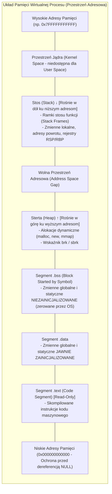
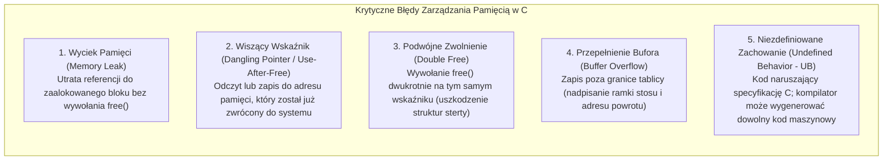
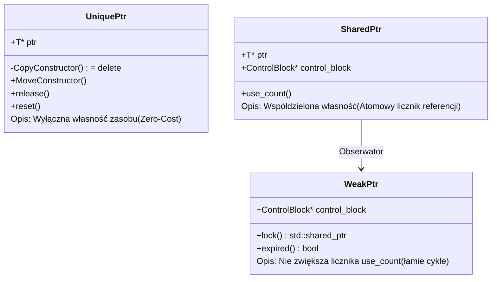
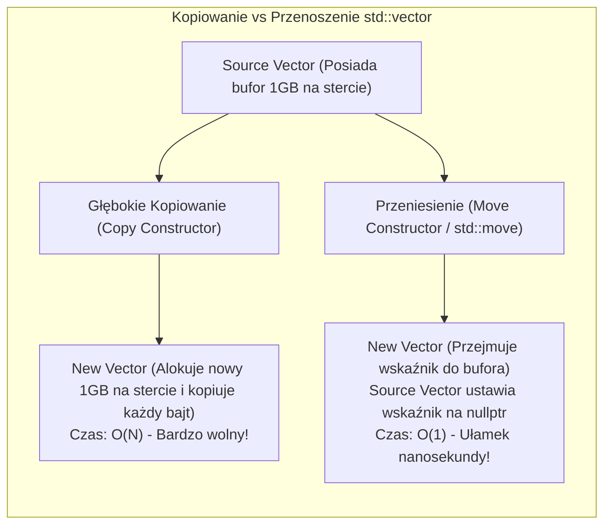

# C i C++: Niskopoziomowy Model Pamięci, Architektura Systemowa i Pytania Rekrutacyjne

Kompleksowe kompendium inżynierskie poświęcone językom **C** oraz **C++** — fundamentom programowania systemowego, silników gier, systemów operacyjnych, baz danych oraz systemów wbudowanych (*embedded*). Artykuł szczegółowo analizuje niskopoziomowy układ pamięci procesu, arytmetykę wskaźników, przejście od ręcznego zarządzania pamięcią (`malloc`/`free`) do idiomu RAII i inteligentnych wskaźników, semantykę przenoszenia (*Move Semantics*), metaprogramowanie szablonowe i Concepts (C++20), model pamięci wielowątkowej oraz obszerny zestaw pytań rekrutacyjnych i realnych scenariuszy awaryjnych (od poziomu Mid po Principal / Systems Architecta).

---

## Spis Treści
1. [Cykl Kompilacji i Układ Pamięci Wirtualnej Procesu](#1-cykl-kompilacji-i-układ-pamięci-wirtualnej-procesu)
   - Od kodu źródłowego do pliku binarnego: Preprocessor -> Compiler -> Assembler -> Linker
   - Anatomia pamięci wirtualnej procesu (Segmenty `.text`, `.data`, `.bss`, Heap, Stack)
   - Stos (Stack) vs Sterta (Heap) – mechanika alokacji, rejestry `RSP`/`RBP` i koszty I/O
2. [Język C: Wskaźniki, Ręczna Alokacja i Pamięciowe Zagrożenia](#2-język-c-wskaźniki-ręczna-alokacja-i-pamięciowe-zagrożenia)
   - Wskaźniki, wskaźniki wielopoziomowe (`**`) i wskaźniki generyczne (`void*`)
   - Arytmetyka wskaźników i reprezentacja tablic w pamięci
   - Wskaźniki na funkcje jako fundament polimorfizmu w C
   - Dynamiczna alokacja: `malloc`, `calloc`, `realloc`, `free`
   - Niskopoziomowe pułapki: Memory Leaks, Dangling Pointers, Double Free, Buffer Overflow i Undefined Behavior (UB)
3. [Paradygmat C++: RAII i Inteligentne Wskaźniki (Smart Pointers)](#3-paradygmat-c-raii-i-inteligentne-wskaźniki-smart-pointers)
   - Idiom RAII (Resource Acquisition Is Initialization) – serce nowoczesnego C++
   - `std::unique_ptr` – wyłączna własność i Zero-Cost Abstraction
   - `std::shared_ptr` – blok kontrolny (Control Block), atomowy licznik referencji i narzut
   - `std::weak_ptr` – przełamywanie cykli referencji (Circular Dependency)
   - Dlaczego `std::make_unique` i `std::make_shared` zamiast operatora `new`?
4. [Mechanizmy Nowoczesnego C++ (C++11 do C++23)](#4-mechanizmy-nowoczesnego-c-c11-do-c23)
   - Wartości l-value vs r-value oraz referencje do r-wartości (`T&&`)
   - Semantyka Przenoszenia (Move Semantics): Rzeczywista rola `std::move`
   - Reguła Pięciu / Reguła Zerowa (Rule of 5 / Rule of 0)
   - Doskonałe Przekazywanie (Perfect Forwarding) i `std::forward`
   - Szablony, SFINAE oraz C++20 **Concepts** i klauzula `requires`
   - Obliczenia w czasie kompilacji: `constexpr`, `consteval`
5. [Wielowątkowość i Model Pamięci C++ (Memory Model & Atomics)](#5-wielowątkowość-i-model-pamięci-c-memory-model--atomics)
   - Standaryzacja modelu pamięci w C++11 (koniec zależności od POSIX/Win32)
   - Wątki: `std::thread` oraz `std::jthread` (C++20 - RAII thread)
   - Narzędzia synchronizacji: `std::mutex`, `std::lock_guard`, `std::unique_lock`, `std::shared_mutex`
   - Operacje atomowe (`std::atomic<T>`) i porządki pamięci (*Memory Orders*):
     - `relaxed`, `acquire` / `release`, `seq_cst` (Sequential Consistency)
   - False Sharing na poziomie linii pamięci podręcznej procesora (Cache Line L1/L2)
6. [Pytania Rekrutacyjne z Odpowiedziami (FAQ Interview)](#6-pytania-rekrutacyjne-z-odpowiedziami-faq-interview)
   - Pytania Podstawowe i Średniozaawansowane (Mid)
   - Pytania Zaawansowane i Architektoniczne (Senior / Systems Architect)
   - Scenariusze Awaryjne i Live-fire Troubleshooting
7. [Tablica Szybkiej Powtórki (Cheat-Sheet)](#7-tablica-szybkiej-powtórki-cheat-sheet)

---

## 1. Cykl Kompilacji i Układ Pamięci Wirtualnej Procesu

W przeciwieństwie do języków zarządzanych przez maszynę wirtualną (Java JVM, .NET CLR) lub interpretowanych (Python), języki C i C++ są kompilowane **bezpośrednio do natywnego kodu maszynowego** docelowej architektury procesora (x86_64, ARM64, RISC-V).

```mermaid
flowchart LR
    Source["Pliki Źródłowe\n(.c / .cpp, .h)"] -->|1. Preprocessor (cpp)| TranslationUnit["Translation Unit\n(Rozwinięte makra i nagłówki)"]
    TranslationUnit -->|2. Compiler (gcc / clang / msvc)| Assembly["Kod Asemblera\n(.s / .asm)"]
    Assembly -->|3. Assembler (as)| ObjectFiles["Pliki Obiektowe\n(.o / .obj z kodem maszynowym)"]
    ObjectFiles -->|4. Linker (ld)| Binary["Wykonywalny Plik Binarny\n(ELF / PE / Mach-O)"]
    Libs["Biblioteki\n(.a / .so / .dll)"] --> Binary
```

### 1. Fazy Przetwarzania Kodu:
1. **Preprocesor:** Przetwarza dyrektywy zaczynające się od `#` (`#include` wkleja zawartość plików nagłówkowych, `#define` dokonuje tekstowej podmiany makr, `#ifdef` odrzuca fragmenty kodu). Wynikiem jest tzw. *Translation Unit*.
2. **Kompilator:** Dokonuje analizy leksykalnej, składniowej (AST), optymalizacji pośredniej (np. LLVM IR) i generuje kod asemblera dla konkretnej architektury procesora.
3. **Asembler:** Tłumaczy instrukcje asemblera na zera i jedynki binarnego kodu maszynowego, generując pliki obiektowe (`.o` w Linuksie, `.obj` w Windows).
4. **Linker (Konsolidator):** Łączy wszystkie pliki obiektowe, rozwiązuje symbole (dopasowuje wywołania funkcji do ich adresów definicji) oraz dołącza biblioteki statyczne (`.a`/`.lib`) i przygotowuje tablice importów dla bibliotek dynamicznych (`.so`/`.dll`).

---

### Układ Pamięci Wirtualnej Procesu (Process Memory Layout)

Każdy proces uruchamiany w nowoczesnym systemie operacyjnym działa w wyizolowanej **przestrzeni pamięci wirtualnej** (zarządzanej przez jednostkę MMU procesora i jądro systemu operacyjnego).



#### Porównanie: Stos (Stack) vs Sterta (Heap)

| Cecha | Pamięć Stosu (Stack) | Pamięć Sterty (Heap) |
| :--- | :--- | :--- |
| **Mechanizm Alokacji** | Błyskawiczny — polega jedynie na przesunięciu rejestru wskaźnika stosu (`RSP`). | Złożony — przeszukiwanie struktur alokatora (np. glibc `ptmalloc`, `jemalloc`, `mimalloc`). |
| **Koszt Zarządzania** | Automatyczny (przez kompilator przy wejściu/wyjściu z bloku lub funkcji). | Ręczny (programista) lub przez inteligentne wskaźniki (RAII). |
| **Czas Życia Zmiennych** | Ściśle powiązany ze stosem wywołań (po powrocie z funkcji pamięć wygasa). | Niezależny od funkcji — istnieje aż do jawnego zwolnienia (`free`/`delete`). |
| **Ryzyko Awarii** | *Stack Overflow* (przepełnienie stosu przy zbyt głębokiej rekurencji). | *Memory Leak*, fragmentacja pamięci, *Out-of-Memory*. |
| **Wydajność Odczytu** | Bardzo wysoka dzięki stałej obecności w pamięci podręcznej CPU (Cache L1/L2). | Niższa z powodu skoków wskaźników po stercie i chybieniach cache (*Cache Misses*). |

---

## 2. Język C: Wskaźniki, Ręczna Alokacja i Pamięciowe Zagrożenia

Wskaźnik to zmienna, której wartością jest **adres w pamięci** innej zmiennej lub funkcji.

### Anatomia Wskaźników i Arytmetyka
```c
#include <stdio.h>

int main(void) {
    int arr[5] = {10, 20, 30, 40, 50};
    int *ptr = arr; // arr ewaluuje do wskaźnika na pierwszy element (&arr[0])

    printf("Wartość: %d, Adres: %p\n", *ptr, (void*)ptr);

    // Arytmetyka wskaźników: przesunięcie o 1 oznacza przesunięcie o sizeof(int) bajtów (4 bajty)
    ptr++; 
    printf("Po inkrementacji - Wartość: %d, Adres: %p\n", *ptr, (void*)ptr);

    // Zapis indeksowy to lukier składniowy: arr[i] == *(arr + i) == *(i + arr) == i[arr]
    printf("Element 2: %d\n", *(ptr + 1)); // Wyświetli 30
    return 0;
}
```

---

### Wskaźniki na Funkcje (Function Pointers) i Polimorfizm w C
W języku C brak wsparcia dla programowania obiektowego realizuje się poprzez struktury zawierające wskaźniki na funkcje:

```c
#include <stdio.h>

typedef struct Shape {
    const char *name;
    double (*get_area)(struct Shape *self); // Wskaźnik na funkcję jako pole struktury
} Shape;

double circle_area(Shape *self) {
    return 3.14159 * 10.0 * 10.0;
}

int main(void) {
    Shape circle = { .name = "Koło", .get_area = circle_area };
    printf("Pole powierzchni kształtu '%s': %.2f\n", circle.name, circle.get_area(&circle));
    return 0;
}
```

---

### Dynamiczna Alokacja Pamięci w C: `malloc`, `calloc`, `realloc`, `free`
```c
#include <stdio.h>
#include <stdlib.h>

void memory_management_demo(void) {
    // 1. malloc: alokuje surową, NIEZAINICJALIZOWANĄ pamięć (zawiera śmieci z pamięci RAM)
    int *numbers = (int*) malloc(5 * sizeof(int));
    if (numbers == NULL) {
        perror("Błąd alokacji malloc");
        return;
    }

    // 2. calloc: alokuje pamięć i ZERUJE wszystkie bajty (wolniejszy od malloc, ale bezpieczniejszy)
    int *clean_numbers = (int*) calloc(5, sizeof(int));
    if (clean_numbers == NULL) {
        free(numbers);
        return;
    }

    // 3. realloc: dynamiczna zmiana rozmiaru bufora (zwiększenie lub zmniejszenie)
    int *resized_numbers = (int*) realloc(numbers, 10 * sizeof(int));
    if (resized_numbers == NULL) {
        // Jeśli realloc zawiedzie, stary bufor 'numbers' nadal istnieje i trzeba go zwolnić!
        free(numbers);
        free(clean_numbers);
        return;
    }
    numbers = resized_numbers;

    // 4. free: bezwzględne zwolnienie pamięci
    free(numbers);
    numbers = NULL; // Dobre praktyki: zerowanie wskaźnika chroni przed 'dangling pointer'
    
    free(clean_numbers);
    clean_numbers = NULL;
}
```

---

### Najgroźniejsze Niskopoziomowe Pułapki Pamięci w C



---

## 3. Paradygmat C++: RAII i Inteligentne Wskaźniki (Smart Pointers)

### Idiom RAII (Resource Acquisition Is Initialization)
W C++ zasoby (pamięć na stercie, deskryptory plików, muteksy, gniazda sieciowe) wiązane są z **cyklem życia obiektu na stosie**:
1. Konstruktor obiektu pozyskuje zasób.
2. Destruktor obiektu zwalnia zasób.
3. Gdy obiekt wychodzi poza zakres (`scope`) — niezależnie od tego, czy funkcja kończy się normalnie, przez `return`, czy przez rzucenie wyjątku — kompilator **gwarantuje deterministyczne wywołanie destruktora**.


---

### Inteligentne Wskaźniki w Nowoczesnym C++ (`<memory>`)

Czysty nowoczesny C++ eliminuje konieczność ręcznego używania operatorów `new` i `delete`.



#### 1. `std::unique_ptr<T>` (Zarządzanie Wyłączne)
Reprezentuje wyłączną własność obiektu na stercie. Nie można go kopiować, można go jedynie **przenosić (`std::move`)**.
- **Narzut wydajnościowy:** Równo 0 bajtów narzutu pamięciowego i procesora (*Zero-Cost Abstraction*). Ma dokładnie taki sam rozmiar jak surowy wskaźnik `sizeof(void*)`.

```cpp
#include <iostream>
#include <memory>

struct SocketConnection {
    SocketConnection() { std::cout << "Gniazdo otwarte\n"; }
    ~SocketConnection() { std::cout << "Gniazdo bezpiecznie zamknięte w destruktorze\n"; }
    void sendData() { std::cout << "Wysyłanie danych...\n"; }
};

void runConnection() {
    // std::make_unique to rekomendowana metoda tworzenia
    auto conn = std::make_unique<SocketConnection>();
    conn->sendData();
    // Brak konieczności 'delete conn' - destruktor wykona się automatycznie przy wyjściu z funkcji!
}
```

#### 2. `std::shared_ptr<T>` (Współdzielona Własność)
Używany, gdy wiele niezależnych obiektów musi współdzielić ten sam zasób na stercie.
- Posiada wskaźnik na obiekt oraz wskaźnik na tzw. **Control Block** na stercie.
- Control Block zawiera m.in.:
  - `strong reference counter` (zwiększany przy kopiowaniu `shared_ptr`, zmniejszany przy niszczeniu).
  - `weak reference counter`.
  - Custom deleter.
- Modyfikacja licznika referencji jest wykonywana **instrukcjami atomowymi** (np. `LOCK XADD` na x86), co gwarantuje bezpieczeństwo w środowiskach wielowątkowych, ale wprowadza mierzalny narzut wydajnościowy.

#### 3. `std::weak_ptr<T>` i Problem Wycieków Cyklicznych
Jeśli obiekt A trzyma `shared_ptr<B>`, a obiekt B trzyma `shared_ptr<A>`, licznik referencji nigdy nie spadnie do 0. Pamięć wycieka!
Rozwiązaniem jest zamiana jednej z referencji na **`std::weak_ptr`**, który obserwuje obiekt bez zwiększania głównego licznika `strong_count`:

```cpp
#include <iostream>
#include <memory>

struct Node {
    std::shared_ptr<Node> next;
    std::weak_ptr<Node> prev; // weak_ptr łamie cykliczną zależność!
    ~Node() { std::cout << "Node zniszczony\n"; }
};
```

---

## 4. Mechanizmy Nowoczesnego C++ (C++11 do C++23)

### Semantyka Przenoszenia (Move Semantics) i `std::move`

Przed standardem C++11 przekazywanie dużych struktur danych (np. `std::vector<int>` zawierającego 10 milionów elementów) z funkcji wymagało albo głębokiego kopiowania (alokacja nowej pamięci i kopiowanie każdego bajtu), albo przekazywania przez wskaźniki.

C++11 wprowadził **referencje do r-wartości (`T&&`)** oraz **semantykę przenoszenia**:
- Zamiast kopiować bufor ze sterty, nowy obiekt „kradnie” wskaźnik starego obiektu, a stary obiekt ustawia na `nullptr`.
- Całość odbywa się w czasie stałym $\mathcal{O}(1)$ zamiast liniowego $\mathcal{O}(N)$.



#### Co naprawdę robi `std::move`?
`std::move` **nie przenosi żadnych danych w pamięci**. Jest to wyłącznie bezkosztowe rzutowanie typów kompilatora:
```cpp
// Uproszczona implementacja std::move z biblioteki standardowej
template <typename T>
constexpr std::remove_reference_t<T>&& move(T&& arg) noexcept {
    return static_cast<std::remove_reference_t<T>&&>(arg);
}
```
`std::move` zamienia l-wartość (nazwany obiekt) na r-wartość, informując kompilator: *„Z tego obiektu można bezpiecznie ukraść zasoby w konstruktorze przenoszącym”*.

---

### Reguła Pięciu / Reguła Zerowa (Rule of 5 / Rule of 0)

1. **Rule of Zero (Reguła Zerowa - Preferowana):**
   Jeśli Twoja klasa korzysta z typów zarządzających zasobami za pomocą RAII (`std::string`, `std::vector`, `std::unique_ptr`), **nie deklaruj żadnego z 5 specjalnych konstruktorów/destruktorów**. Kompilator wygeneruje optymalny i bezpieczny kod automatycznie.
2. **Rule of Five (Reguła Pięciu):**
   Jeśli Twoja klasa zarządza surowym zasobem niskopoziomowym i musisz jawnie zdefiniować Destruktor, **musisz jawnie zdefiniować lub usunąć wszystkie 5 metod**:
   - Destruktor (`~MyClass()`)
   - Konstruktor kopiujący (`MyClass(const MyClass&);`)
   - Kopiujący operator przypisania (`MyClass& operator=(const MyClass&);`)
   - Konstruktor przenoszący (`MyClass(MyClass&&) noexcept;`)
   - Przenoszący operator przypisania (`MyClass& operator=(MyClass&&) noexcept;`)

---

### Szablony i C++20 Concepts

Tradycyjne szablony C++ przy błędnym typie generowały wielostronicowe, nieczytelne komunikaty błędów kompilatora. Wprowadzona w **C++20 koncepcja Concepts** pozwala na jawne deklarowanie wymagań wobec typów generycznych w czasie kompilacji:

```cpp
#include <iostream>
#include <concepts>

// Definicja własnego Conceptu (Musi wspierać dodawanie i być liczbą całkowitą)
template <typename T>
concept Numeric = std::integral<T> || std::floating_point<T>;

// Użycie conceptu w sygnaturze szablonu
template <Numeric T>
T add(T a, T b) {
    return a + b;
}

int main() {
    std::cout << add(10, 20) << "\n";       // OK: int spełnia Numeric
    std::cout << add(3.14, 2.71) << "\n";   // OK: double spełnia Numeric
    // add("A", "B"); // BŁĄD KOMPILACJI: Jasny i czytelny komunikat: constraints not satisfied!
}
```

---

## 5. Wielowątkowość i Model Pamięci C++ (Memory Model & Atomics)

Przed standardem C++11 język nie definiował oficjalnego modelu pamięci dla systemów wielowątkowych — zachowanie zależało od bibliotek platformowych (np. pthreads w POSIX). C++11 zdefiniował pojęcie **Wyścigu Danych (Data Race)** wprost w standardzie:
> [!CAUTION]
> Dwa wątki uzyskujące dostęp do tej samej komórki pamięci w tym samym czasie, gdzie przynajmniej jeden wykonuje modyfikację, bez synchronizacji — to **Undefined Behavior (UB)**.

### Model Porządkowania Pamięci w `std::atomic`

Nowoczesne procesory (zwłaszcza ARM, PowerPC) oraz agresywne optymalizatory kompilatora mają prawo **zmieniać kolejność wykonywania instrukcji w pamięci (Instruction Reordering)** w celu maksymalizacji przepustowości potoków CPU, o ile nie narusza to logiki pojedynczego wątku.

W programowaniu wielowątkowym stosuje się trzy główne modele spójności:
1. **`std::memory_order_relaxed`:** Gwarantuje wyłącznie atomowość odczytu/zapisu. Kompilator i procesor mogą dowolnie przestawiać inne instrukcje wokół tej operacji. Brak synchronizacji między wątkami.
2. **`std::memory_order_acquire` / `release` (Acquire-Release Semantics):**
   - **Release:** Żaden zapis do pamięci wykonany *przed* tą operacją nie może zostać przestawiony *po* niej.
   - **Acquire:** Żaden odczyt z pamięci wykonany *po* tej operacji nie może zostać przestawiony *przed* nią.
   - Tworzy relację *synchronizes-with* między wątkiem publikującym dane a wątkiem konsumującym.
3. **`std::memory_order_seq_cst` (Sequential Consistency - Domyślny):**
   - Wymusza globalny, jednolity dla wszystkich rdzeni porządek wykonania operacji. Najbezpieczniejszy, ale najwolniejszy (wymaga wstawiania barier pamięciowych / instrukcji `MFENCE` w procesorze).

---

## 6. Pytania Rekrutacyjne z Odpowiedziami (FAQ Interview)

### Pytania Podstawowe i Średniozaawansowane (Mid)

#### Pytanie 1: Czym różni się alokacja na Stosie (Stack) od alokacji na Stercie (Heap)?
**Odpowiedź:**
- **Stos:** Alokacja jest niezwykle szybka (przesunięcie wskaźnika rejestru `RSP`). Pamięcią zarządza automatycznie kompilator w oparciu o zasięg bloku/funkcji. Dane ze stosu są usuwane automatycznie po zakończeniu funkcji. Posiada ograniczony rozmiar (zazwyczaj 1-8 MB), którego przekroczenie powoduje błąd `Stack Overflow`.
- **Sterta:** Dynamiczna pamięć alokowana w czasie działania programu za pomocą `malloc` lub `new`. Alokacja jest znacznie wolniejsza, ponieważ alokator musi przeszukać struktury sterty i zarządzać fragmentacją. Pamięć na stercie istnieje dopóki programista jej jawnie nie zwolni (`free`/`delete`) lub nie zadziała destruktor inteligentnego wskaźnika RAII.

---

#### Pytanie 2: Jaka jest różnica między wskaźnikiem a referencją w C++?
**Odpowiedź:**
- **Wskaźnik (`T*`):** Jest osobną zmienną przechowującą adres w pamięci. Może być niezainicjalizowany, może wskazywać na `nullptr`, może być w dowolnym momencie przestawiony na inny adres i wspiera arytmetykę wskaźników (`ptr++`).
- **Referencja (`T&`):** Jest niezmiennym **aliasem** do już istniejącego obiektu. Musi zostać zainicjalizowana w momencie tworzenia, nie może być pusta (brak "null reference" w standardzie), nie można jej przekierować na inny obiekt po inicjalizacji i nie posiada własnego adresu w pamięci (operacja `&ref` zwraca adres referowanego obiektu).

---

#### Pytanie 3: Dlaczego destruktor klasy bazowej z metodami wirtualnymi MUSI być wirtualny?
**Odpowiedź:**
Jeśli usuniemy obiekt klasy pochodnej (`Derived`) poprzez wskaźnik na klasę bazową (`Base*`):
```cpp
Base* ptr = new Derived();
delete ptr;
```
Gdy destruktor `~Base()` **nie jest wirtualny**, kompilator wykona wiązanie statyczne w czasie kompilacji i wywoła **wyłącznie destruktor klasy bazowej**. Destruktor klasy `Derived` nigdy się nie wykona! Doprowadzi to do wycieku zasobów (pamięci, uchwytów plików) zaalokowanych przez klasę pochodną oraz stanowi formalne Niezdefiniowane Zachowanie (UB). Uczynienie destruktora wirtualnym (`virtual ~Base() = default;`) zapewnia poprawne wywołanie pełnego łańcucha destruktorów przez tablicę vtable.

---

#### Pytanie 4: Czym różni się `malloc/free` w C od `new/delete` w C++?
**Odpowiedź:**
- `malloc` i `free` to funkcje biblioteczne języka C (`<stdlib.h>`). Operują wyłącznie na surowych bajtach pamięci: nie wiedzą nic o konstruktorach ani destruktorach, wymagają ręcznego podania rozmiaru `sizeof(T)`, zwracają `void*` i w przypadku braku pamięci zwracają `NULL`.
- `new` i `delete` to wbudowane operatory języka C++. Operator `new` nie tylko alokuje pamięć odpowiedniego typu, ale **automatycznie wywołuje konstruktor obiektu**. Operator `delete` najpierw **wywołuje destruktor obiektu**, a dopiero potem zwalnia pamięć. W przypadku błędu alokacji `new` domyślnie rzuca wyjątek `std::bad_alloc`.

---

#### Pytanie 5: Czym różni się `std::unique_ptr` od `std::shared_ptr` i kiedy należy zastosować `std::weak_ptr`?
**Odpowiedź:**
- `std::unique_ptr` implementuje model wyłącznej własności. Obiekt ma dokładnie jednego właściciela, a wskaźnik nie może być kopiowany (jedynie przenoszony). Charakteryzuje się zerowym narzutem pamięciowym (*Zero-Cost*).
- `std::shared_ptr` implementuje model własności współdzielonej. Zarządza obiektem oraz blokiem kontrolnym na stercie zawierającym atomowy licznik referencji. Obiekt jest niszczony, gdy ostatni powiązany `shared_ptr` zostanie zniszczony.
- `std::weak_ptr` służy do nieinwazyjnej obserwacji obiektu zarządzanego przez `shared_ptr`. Nie zwiększa licznika referencji, dzięki czemu zapobiega wyciekom pamięci spowodowanym cyklicznym zapętleniem wskaźników (*Circular References*).

---

### Pytania Zaawansowane i Architektoniczne (Senior / Systems Architect)

#### Pytanie 6: Czym jest Undefined Behavior (UB) w C/C++ i jak optymalizator kompilatora wykorzystuje UB do usuwania gałęzi kodu?
**Odpowiedź:**
Undefined Behavior to sytuacja, w której kod programu narusza zasady specyfikacji standardu ISO C/C++ (np. przepełnienie signed int, dereferencja nullptr, wyścig danych, odczyt niezainicjalizowanej zmiennej). Standard zwalnia kompilator z jakiejkolwiek odpowiedzialności za zachowanie takiego programu.

**Mechanizm optymalizacji:**
Nowoczesny kompilator zakłada, że w poprawnym programie **UB nigdy nie wystąpi**. Jeśli kompilator stwierdzi, że dana ścieżka wykonania musiałaby doprowadzić do UB, wnioskuje, że ta ścieżka jest martwym kodem (*Unreachable Code*) i **całkowicie wycina ją z wygenerowanego pliku binarnego**.

*Przykład:*
```cpp
bool check(int* ptr) {
    int value = *ptr; // Jeśli ptr to NULL, nastąpi UB
    if (ptr == nullptr) {
        return false; // Kompilator usunie ten warunek, bo skoro nastąpiła dereferencja, ptr "nie może" być NULL!
    }
    return true;
}
```

---

#### Pytanie 7: Jak działa tablica funkcji wirtualnych (vtable i vptr) i jaki jest koszt wywołania metody wirtualnej?
**Odpowiedź:**
Polimorfizm dynamiczny w C++ jest realizowany przez mechanizm **vtable**:
1. Dla każdej klasy posiadającej przynajmniej jedną metodę wirtualną, kompilator tworzy w segmencie `.rodata` statyczną tablicę wskaźników do funkcji (**vtable**).
2. Każda instancja takiego obiektu otrzymuje ukryte pole wskaźnika (**`vptr`**), zazwyczaj na samym początku struktury obiektu, wskazujące na odpowiednią tablicę `vtable`.
3. Wywołanie metody wirtualnej `obj->foo()` wymaga podwójnego skoku wskaźnikowego:
   - Odczyt `vptr` z pamięci obiektu.
   - Odczyt wskaźnika do funkcji z tablicy vtable pod określonym indeksem.
   - Wywołanie skoku pośredniego (`call [rax + offset]`).
- **Koszt wydajnościowy:** Wywołanie pośrednie uniemożliwia kompilatorowi tzw. **inlining** (wklejenie kodu metody w miejscu wywołania) oraz może spowodować chybienie w tablicy przewidywania skoków procesora (*Branch Predictor Miss*).

---

#### Pytanie 8: Co dokładnie robi `std::move` i dlaczego obiekt po `std::move` znajduje się w stanie "ważnym, lecz nieokreślonym"?
**Odpowiedź:**
`std::move` to wyłącznie bezkosztowe rzutowanie `static_cast<T&&>(var)` na referencję do r-wartości. Samo wywołanie `std::move(x)` nie modyfikuje pamięci ani nie przenosi danych. Daje ono jedynie prawo konstruktorowi przenoszącemu do przejęcia wewnętrznych wskaźników obiektu.

**Stan "ważny, lecz nieokreślony" (valid but unspecified state):**
Zgodnie ze standardem C++, obiekt po operacji przeniesienia musi pozostać w stanie spójnym:
- Nie może naruszać niezmienników klasy (np. rozmiar bufora nie może być ujemny).
- Musi być zdolny do poprawnego zniszczenia przez destruktor bez wywołania `Double Free`.
- Można do niego przypisać nową wartość. Jednak programista nie może zakładać, co dokładnie znajduje się wewnątrz obiektu (np. `std::string` po przeniesieniu zazwyczaj jest pusty, ale standard tego nie gwarantuje).

---

#### Pytanie 9: Wyjaśnij semantykę Acquire-Release w modelu pamięci C++11 i wskaż, kiedy wystarcza zamiast Sequential Consistency.
**Odpowiedź:**
Model Acquire-Release pozwala na synchronizację między wątkami z dużo mniejszym narzutem sprzętowym niż pełna spójność sekwencyjna (`seq_cst`):
- Wątek A (Producent) modyfikuje dane, a następnie ustawia flagę za pomocą `flag.store(true, std::memory_order_release)`. Gwarantuje to, że żaden zapis pamięci poprzedzający flagę nie zostanie przestawiony przez kompilator lub procesor za operację release.
- Wątek B (Konsument) odpytuje flagę `while (!flag.load(std::memory_order_acquire));`. Gwarantuje to, że żaden odczyt danych znajdujący się po tej instrukcji nie zostanie wykonany przed odczytaniem flagi.
- Utworzona zostaje bariera pamięciowa typu *happens-before*. Wszystkie dane zapisane przez Producenta są widoczne dla Konsumenta. W przeciwieństwie do `seq_cst`, architektury ARM/POWER nie muszą wymuszać globalnej synchronizacji wszystkich rdzeni, co drastycznie zwiększa przepustowość struktur typu *Lock-Free Queue*.

---

#### Pytanie 10: Czym jest zjawisko "False Sharing" i jak mu zapobiegać przy użyciu specyfikatora `alignas`?
**Odpowiedź:**
Procesory odczytują i zapisują pamięć RAM w porcjach zwanych **liniami pamięci podręcznej (Cache Lines)**, o standardowym rozmiarze 64 bajtów.

**Zjawisko False Sharing:**
Występuje, gdy dwa niezależne wątki na różnych rdzeniach procesora modyfikują dwie zupełnie różne zmienne, które przypadkowo leżą w pamięci **wewnątrz tej samej 64-bajtowej linii cache**.
- Gdy Rdzeń 1 modyfikuje Zmienną A, sprzętowy protokół spójności cache (np. MESI) unieważnia całą linię cache na Rdzeniu 2.
- Mimo braku logicznego wyścigu danych, rdzenie bez przerwy unieważniają sobie nawzajem linie cache L1, co prowadzi do drastycznego spadku wydajności (nawet o 95%).

**Rozwiązanie w C++17:**
Rozsunięcie zmiennych do osobnych linii cache za pomocą `alignas`:
```cpp
#include <new> // std::hardware_destructive_interference_size

struct alignas(std::hardware_destructive_interference_size) ThreadSafeCounter {
    std::atomic<uint64_t> counter{0};
};
```

---

### Scenariusze Awaryjne i Live-fire Troubleshooting

#### Scenariusz 1: Sporadyczny błąd Segmentation Fault (SIGSEGV) w aplikacji wielowątkowej przy `std::shared_ptr`
* **Objaw produkcyjny:** Aplikacja serwerowa w C++ przetwarzająca miliony pakietów sieciowych ulega awarii raz na kilka dni z błędem `SIGSEGV` wewnątrz wewnętrznych metod `std::shared_ptr`.
* **Analiza Root Cause:**
  1. Zespół założył, że `std::shared_ptr` jest w pełni bezpieczny wątkowo.
  2. Prawda inżynierska: **Wyłącznie blok kontrolny (licznik referencji) jest atomowy**. Sam obiekt wskaźnika (para: wskaźnik na obiekt + wskaźnik na blok kontrolny) **nie jest bezpieczny wątkowo**.
  3. Dwa wątki współdzieliły tę samą instancję `std::shared_ptr globalPtr;` — Wątek 1 przypisywał nową wartość (`globalPtr = make_shared(...)`), a Wątek 2 w tym samym czasie z niego czytał. Nastąpił wyścig danych na wskaźnikach instancji.
* **Rozwiązanie i Naprawa:**
  1. Każdy wątek musi operować na **własnej lokalnej kopii** `std::shared_ptr` przekazanej przez wartość.
  2. Jeśli jedna zmienna globalna musi być modyfikowana współbieżnie: użycie `std::atomic<std::shared_ptr<T>>` (dostępne natywnie od C++20) lub operacji `std::atomic_load`/`std::atomic_store`.

---

#### Scenariusz 2: Niewykrywalny wyciek pamięci w C++ — Valgrind i AddressSanitizer (ASan)
* **Objaw produkcyjny:** Zużycie pamięci procesu roboczego stale rośnie w tempie 50 MB na godzinę, aż do wyczerpania zasobów serwera, mimo że w całym kodzie użyto wyłącznie `std::shared_ptr`.
* **Analiza Root Cause:**
  1. Wykorzystanie narzędzia **AddressSanitizer (ASan)** podczas kompilacji:
     ```bash
     clang++ -fsanitize=address -g main.cpp -o app
     ```
  2. Analiza logów ASan oraz profilera sterty wykazała **cykliczną zależność w grafie obiektów**: model sesji użytkownika `UserSession` trzymał `shared_ptr` do menedżera połączenia `ConnectionManager`, a ten trzymał listę aktywnych `shared_ptr<UserSession>`.
  3. Licznik `use_count` dla obu obiektów nigdy nie osiągał wartości 0, uniemożliwiając uruchomienie destruktora.
* **Rozwiązanie i Naprawa:**
  1. Zamiana wstecznej referencji w `ConnectionManager` z `std::shared_ptr<UserSession>` na `std::weak_ptr<UserSession>`.
  2. Wprowadzenie do procesu CI/CD automatycznego uruchamiania testów z flagą `-fsanitize=address,undefined`.

---

#### Scenariusz 3: Spadek wydajności i błąd przekroczenia zakresu przy operacjach na stringach w C
* **Objaw produkcyjny:** Narzędzie audytu kodu zgłasza krytyczną podatność bezpieczeństwa typu *Buffer Overflow* w funkcji parsującej nagłówki pakietów HTTP przy użyciu klasycznej funkcji `strcpy` lub `sprintf`.
* **Analiza Root Cause:**
  Tradycyjne funkcje języka C z biblioteki `<string.h>` (`strcpy`, `strcat`, `sprintf`, `gets`) nie weryfikują rozmiaru bufora docelowego. Jeśli dane wejściowe przekraczają zaalokowany rozmiar tablicy, dane nadpisują sąsiednie zmienne na stosie, w tym adres powrotu z funkcji (*Return Address*), co umożliwia atakującemu wykonanie dowolnego kodu (*Arbitrary Code Execution*).
* **Rozwiązanie i Naprawa:**
  1. W C: Zastąpienie niebezpiecznych funkcji ich bezpiecznymi wariantami z kontrolą rozmiaru: `strncpy`, `snprintf` lub standardem C11 Annex K (`strcpy_s`).
  2. W C++: Całkowite wyeliminowanie surowych tablic znakowych `char[]` na rzecz bezpiecznych typów kontenerowych **`std::string`** oraz nielokujących widoków **`std::string_view`** (C++17).

---

## 7. Tablica Szybkiej Powtórki (Cheat-Sheet)

| Koncepcja / Słowo Kluczowe | Zastosowanie / Opis |
| :--- | :--- |
| **`malloc(size)` / `free(p)`** | Ręczna alokacja/zwolnienie bajtów na stercie w C (brak konstruktorów) |
| **`new` / `delete`** | Alokacja w C++ z automatycznym wywołaniem konstruktora i destruktora |
| **`std::unique_ptr<T>`** | Własność wyłączna (Zero-Cost RAII, brak kopiowania, tylko `std::move`) |
| **`std::shared_ptr<T>`** | Własność współdzielona z atomowym licznikiem w Control Blocku |
| **`std::weak_ptr<T>`** | Nielicząca referencja przełamująca cykle `shared_ptr` |
| **`std::move(var)`** | Bezkosztowe rzutowanie do r-value (`static_cast<T&&>`) dla przeniesienia |
| **`std::forward<T>(arg)`** | Przekazywanie referencji z zachowaniem jej oryginalnej kategorii wartości |
| **`constexpr`** | Obliczenia możliwe do wykonania w czasie kompilacji |
| **`consteval` (C++20)** | Wymuszenie wykonania funkcji bezwzględnie w czasie kompilacji |
| **`std::atomic<T>`** | Operacje lock-free na zmiennych współdzielonych bez wyścigów danych |
| **`concept` (C++20)** | Nazwany zbiór ograniczeń nakładanych na parametry szablonu |
| **Flaga `-fsanitize=address`**| Wbudowany w GCC/Clang detektor wycieków pamięci i use-after-free |
