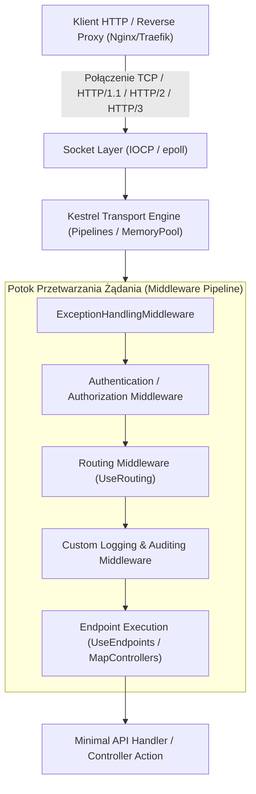
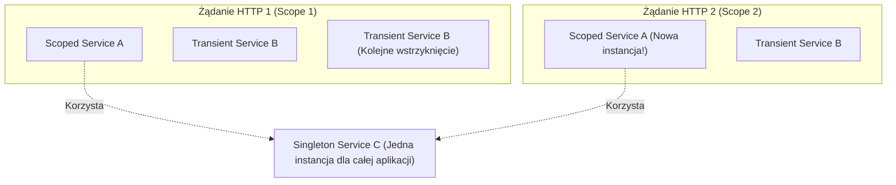
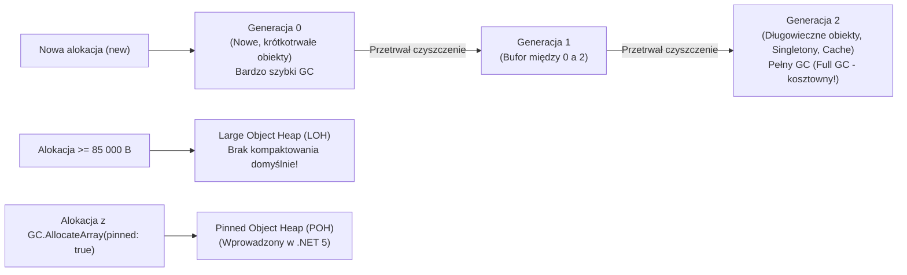
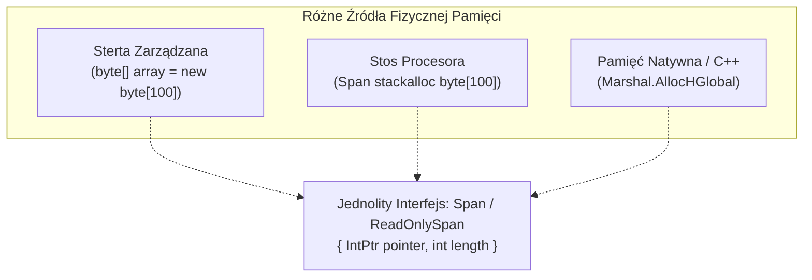

# ASP.NET Core: Architektura Pod Maską, Cykl Życia DI, Pamięć CLR i Pytania Rekrutacyjne

W środowiskach o krytycznym znaczeniu biznesowym i wysokiej skali, inżynier na poziomie Seniora musi rozumieć nie tylko składnię frameworka, ale przede wszystkim niskopoziomowe mechanizmy przetwarzania zapytań HTTP przez serwer **Kestrel**, zarządzanie cyklem życia serwisów w kontenerze **Dependency Injection (DI)** oraz fizyczną gospodarkę pamięcią w środowisku uruchomieniowym **CLR (Common Language Runtime)**.

Niniejsze kompendium szczegółowo analizuje architekturę wewnętrzną ASP.NET Core, pułapki alokacyjne, mechanikę działania **Garbage Collectora** oraz techniki programowania bezalokacyjnego (*Zero-Allocation .NET*), stanowiąc kompleksowe przygotowanie do technicznych rozmów rekrutacyjnych.

---

## Spis Treści
1. [Niskopoziomowa Anatomia ASP.NET Core i Serwer Kestrel](#1-niskopoziomowa-anatomia-aspnet-core-i-serwer-kestrel)
   - Architektura Kestrel: Sockets Transport, Pipelining i Libuv
   - Potok żądania HTTP (Request Pipeline & Middleware)
   - Middleware vs Filtry ASP.NET Core
   - Endpoint Routing: Dopasowywanie tras a wykonanie akcji
2. [Kontener Dependency Injection (Microsoft.Extensions.DependencyInjection)](#2-kontener-dependency-injection-microsoftextensionsdependencyinjection)
   - Cykle życia: `Transient`, `Scoped`, `Singleton`
   - Niebezpieczny antywzorzec: **Captive Dependencies** (Uwięziona zależność)
   - Fabrykowanie zakresów: `IServiceScopeFactory` w serwisach tła (`BackgroundService`)
   - Opcje walidacji: `ValidateScopes` i `ValidateOnBuild`
3. [Zarządzanie Pamięcią i Garbage Collector (CLR Deep-Dive)](#3-zarządzanie-pamięcią-i-garbage-collector-clr-deep-dive)
   - Model pamięci: Stos (Stack) vs Sterta (Managed Heap)
   - Pokolenia obiektów: Generacja 0, 1, 2
   - Sterty specjalne: LOH (Large Object Heap) i POH (Pinned Object Heap)
   - Tryby pracy GC: Workstation GC vs Server GC (Architektura per-core)
   - Non-concurrent vs Concurrent / Background GC
4. [Programowanie Wysokowydajne i Zero-Allocation .NET](#4-programowanie-wysokowydajne-i-zero-allocation-net)
   - `Span<T>` i `ReadOnlySpan<T>` pod lupą (Wskaźnik i długość na stosie)
   - `ref struct` i ograniczenia bezpieczeństwa typu
   - `Memory<T>` i `ReadOnlyMemory<T>` dla operacji asynchronicznych
   - Pula buforów: `ArrayPool<T>.Shared` i eliminacja fragmentacji LOH
5. [Pytania Rekrutacyjne z Odpowiedziami (Senior & Architect FAQ)](#5-pytania-rekrutacyjne-z-odpowiedziami-senior--architect-faq)
   - Pytania techniczne (DI, Kestrel, GC, Span)
   - Scenariusze Awaryjne i Live-fire Profiling (`dotnet-dump`, `dotnet-gcdump`)
6. [Tablica Szybkiej Powtórki (Cheat-Sheet)](#6-tablica-szybkiej-powtórki-cheat-sheet)

---

## 1. Niskopoziomowa Anatomia ASP.NET Core i Serwer Kestrel

Serwer **Kestrel** to wbudowany, międzyplatformowy serwer WWW dla ASP.NET Core, zaprojektowany pod kątem ekstremalnej przepustowości I/O.



### Kestrel pod Maską: `System.IO.Pipelines`
W klasycznym podejściu serwery HTTP czytały strumień sieciowy do tablic `byte[]`, co powodowało ogromną ilość alokacji i kopiowania pamięci między buforami jądra OS a aplikacją.

Kestrel wykorzystuje bibliotekę **`System.IO.Pipelines`**:
- Bezpośredni dostęp do buforów pamięci zarządzanych przez `MemoryPool<byte>`.
- Brak alokacji tablic bajtów przy każdym przychodzącym pakiecie TCP.
- Parsowanie nagłówków HTTP za pomocą `ReadOnlySequence<byte>` i `Span<byte>`, bez tworzenia niepotrzebnych instancji obiektów typu `string`.

### Potok Middleware a Filtry ASP.NET Core

Częstym pytaniem rekrutacyjnym jest różnica między **Middleware** a **Filtrami**:

| Cecha | Middleware | Filtry (Action/Resource/Exception Filter) |
| :--- | :--- | :--- |
| **Poziom działania** | Globalny potok HTTP aplikacji | Wyłącznie kontekst MVC / Controller Action |
| **Dostęp do parametrów akcji**| Brak (operuje na surowym `HttpContext`, strumieniach i nagłówkach) | Pełny dostęp do `ActionArguments`, modeli zwalidowanych przez Model Binder |
| **Kontekst wykonania** | Wykonywane dla absolutnie każdego żądania (nawet static files) | Wykonywane dopiero, gdy Endpoint Routing zidentyfikuje docelowy kontroler |
| **Wsparcie dla Minimal APIs** | W pełni wspierane (fundament Minimal APIs) | Tradycyjne filtry MVC nie działają na Minimal APIs (używa się `EndpointFilter`) |

---

## 2. Kontener Dependency Injection (Microsoft.Extensions.DependencyInjection)

Wbudowany kontener DI w .NET to kontener konforemny (*conforming container*), zaprojektowany z myślą o prostocie i maksymalnej wydajności.

### Cykle Życia Usług (Service Lifetimes)

1. **`Transient` (Chwilowy):** Nowa instancja jest tworzona za każdym razem, gdy usługa jest żądana. Używany dla lekkich, bezstanowych komponentów.
2. **`Scoped` (W ramach zakresu):** Dokładnie jedna instancja tworzona per zakres logiczny. W ASP.NET Core zakres jest automatycznie tworzony dla każdego przychodzącego żądania HTTP i niszczony po wysłaniu odpowiedzi. Idealny dla `DbContext`, repozytoriów, kontekstu użytkownika.
3. **`Singleton` (Pojedynczy):** Dokładnie jedna instancja tworzona raz przy pierwszym odwołaniu (lub przy starcie aplikacji) i współdzielona przez wszystkie żądania w trakcie życia całego procesu. Wymaga **100% bezpieczeństwa wątkowego (Thread-Safety)**!



---

### Śmiertelna Pułapka: Captive Dependencies (Uwięziona Zależność)

> [!CAUTION]
> **Captive Dependency** to błąd architektoniczny polegający na wstrzyknięciu usługi o krótszym cyklu życia (np. `Scoped` lub `Transient`) do usługi o dłuższym cyklu życia (najczęściej `Singleton`).

#### Dlaczego to katastrofa?
Singleton żyje przez cały czas działania aplikacji. Jeśli wstrzykniesz do niego `ScopedDbContext`, to instancja `DbContext` zostanie "uwięziona" w Singletonie i nigdy nie zostanie zwolniona!
Skutki:
1. **Brak bezpieczeństwa wątkowego:** `DbContext` nie jest bezpieczny wątkowo. Jeśli dwa współbieżne zapytania HTTP wywołają metodę Singletona, oba zaczną równolegle operować na tym samym `DbContext`, co natychmiast wyrzuci błąd:
   `InvalidOperationException: A second operation was started on this context instance before a previous operation completed`.
2. **Potężny wyciek pamięci (Memory Leak):** Wewnętrzny `ChangeTracker` kontekstu będzie bez końca gromadził wszystkie załadowane encje, doprowadzając do wyczerpania pamięci RAM.

#### Jak zapobiegać?
1. **Włączenie walidacji zakresów w środowisku deweloperskim i testowym:**
   ```csharp
   var builder = WebApplication.CreateBuilder(args);
   builder.Host.UseDefaultServiceProvider((context, options) =>
   {
       options.ValidateScopes = true;
       options.ValidateOnBuild = true;
   });
   ```
2. **Użycie `IServiceScopeFactory` w Singletonach (np. `BackgroundService`):**
   ```csharp
   public class QueueProcessorWorker(IServiceScopeFactory scopeFactory, ILogger<QueueProcessorWorker> logger) 
       : BackgroundService
   {
       protected override async Task ExecuteAsync(CancellationToken stoppingToken)
       {
           while (!stoppingToken.IsCancellationRequested)
           {
               // Ręczne utworzenie izolowanego zakresu per jednostka pracy:
               using (var scope = scopeFactory.CreateScope())
               {
                   var dbContext = scope.ServiceProvider.GetRequiredService<AppDbContext>();
                   await dbContext.ProcessPendingQueueAsync(stoppingToken);
               } // Tutaj dbContext jest poprawnie zwalniany (Dispose)!

               await Task.Delay(1000, stoppingToken);
           }
       }
   }
   ```

---

## 3. Zarządzanie Pamięcią i Garbage Collector (CLR Deep-Dive)

Platforma .NET zarządza pamięcią automatycznie, jednak w aplikacjach o wysokiej skali brak zrozumienia działania **Garbage Collectora (GC)** prowadzi do nieprzewidywalnych opóźnień (Latency Spikes) oraz pauz typu *Stop-the-World*.

### Pokolenia Obiektów (Generations)

GC dzieli stertę na generacje w oparciu o hipotezę słabej generacyjności (*Weak Generational Hypothesis*): **większość obiektów umiera krótko po ich utworzeniu**.



1. **Generacja 0 (Gen 0):** Miejsce, gdzie trafiają nowo tworzone małe obiekty (zmienne lokalne, krótkotrwałe DTO, obiekty Task). Czyszczenie Gen 0 trwa ułamki milisekund.
2. **Generacja 1 (Gen 1):** Służy jako bufor oddzielający obiekty krótkotrwałe od długotrwałych. Jeśli obiekt z Gen 0 przetrwa czyszczenie, awansuje do Gen 1.
3. **Generacja 2 (Gen 2):** Obiekty długo żyjące (konfiguracje, pule połączeń, statyczne kolekcje, cache). Czyszczenie Gen 2 (tzw. **Full GC**) sprawdza całą stertę i wiąże się ze znacznym narzutem CPU.

### Sterty Specjalne: LOH i POH
- **LOH (Large Object Heap):** Obiekty o rozmiarze **$\ge$ 85 000 bajtów** (np. duże tablice bajtów, duże stringi) nie trafiają do Gen 0, lecz bezpośrednio na LOH.
  * *Zagrożenie:* GC domyślnie **nie kompaktuje LOH** (ponieważ przesuwanie wielomegabajtowych bloków w pamięci byłoby zbyt kosztowne dla CPU). Prowadzi to do **fragmentacji pamięci LOH** i błędu `OutOfMemoryException`, mimo że wolna pamięć RAM jest formalnie dostępna!
- **POH (Pinned Object Heap):** Obiekty "przyszpilone" (np. bufory I/O przekazywane do natywnego kodu Windows/Linux), których GC nie może przesuwać. Zgrupowanie ich na dedykowanej stercie zapobiega fragmentacji sterty Gen 0/1/2.

### Workstation GC vs Server GC
- **Workstation GC:** Zoptymalizowany pod kątem responsywności interfejsu użytkownika (krótkie pauzy, 1 wątek GC, współdzielone sterty). Domyślny w aplikacjach desktopowych i konsolowych.
- **Server GC:** Zoptymalizowany pod kątem maksymalnej przepustowości (Throughput) systemów serwerowych:
  - CLR tworzy **osobną stertę zarządzaną oraz dedykowany wątek GC dla każdego fizycznego rdzenia/wątku procesora**.
  - Każdy rdzeń alokuje pamięć na własnej stercie bez rywalizacji o blokady (Zero lock contention).
  - Wymaga większej ilości pamięci RAM, ale zapewnia liniową skalowalność na maszynach wielordzeniowych.

---

## 4. Programowanie Wysokowydajne i Zero-Allocation .NET

Nowoczesny .NET (od .NET Core 2.1 przez .NET 8/9) wprowadził rewolucję pod kątem redukcji alokacji pamięci.

### `Span<T>` i `ReadOnlySpan<T>`

`Span<T>` reprezentuje ciągły obszar dowolnej pamięci (pamięć zarządzana na stercie, stos lub niezarządzana pamięć natywna).



#### Dlaczego `Span<T>` jest bezalokacyjny?
W tradycyjnym C#, aby wyciąć fragment ciągu znaków, robiliśmy:
```csharp
string date = "2026-10-01";
string year = date.Substring(0, 4); // ALOKUJE NOWY OBIEKT STRING NA STERTCIE!
```
Używając `Span<T>`:
```csharp
ReadOnlySpan<char> dateSpan = "2026-10-01".AsSpan();
ReadOnlySpan<char> yearSpan = dateSpan.Slice(0, 4); // ZERO ALOKACJI! Wskaźnik + długość na stosie.
int yearInt = int.Parse(yearSpan); // Bezpośrednie parsowanie ze Span w nowoczesnym .NET
```

#### Restrykcje `ref struct`:
`Span<T>` jest zdefiniowany jako `ref struct`. Oznacza to, że instancja `Span<T>` **może istnieć wyłącznie na stosie procesora**:
- Nie może być polem zwykłej klasy ani żadnego typu referencyjnego.
- Nie może być zboxowany do `object`.
- Nie może być używany w metodach `async/await` w poprzek słowa kluczowego `await` (ponieważ maszyna stanów `IAsyncStateMachine` mogłaby przenieść go na stertę!).

### `Memory<T>` i `ReadOnlyMemory<T>`
Dla operacji asynchronicznych (gdzie dane muszą przetrwać zawieszenie metody w punkcie `await`) stosujemy **`Memory<T>`**. Jest to zwykła struktura (nie `ref struct`), która może bezpiecznie żyć na stercie, a w momencie fizycznego przetwarzania synchronicznego wystawia właściwość `.Span`.

### Pula Buforów: `ArrayPool<T>`

Zamiast ciągłego alokowania tablic bajtów (szczególnie dużych wpadających na LOH), wypożyczamy je z puli:

```csharp
public async Task ProcessLargeStreamAsync(Stream stream, CancellationToken ct)
{
    // Wypożyczenie bufora o rozmiarze co najmniej 90 000 B z puli
    byte[] buffer = ArrayPool<byte>.Shared.Rent(90000);
    try
    {
        int bytesRead;
        while ((bytesRead = await stream.ReadAsync(buffer.AsMemory(0, buffer.Length), ct)) > 0)
        {
            ProcessChunk(buffer.AsSpan(0, bytesRead));
        }
    }
    finally
    {
        // ŻELAZNY OBOWIĄZEK: Zwrócenie bufora do puli w bloku finally!
        ArrayPool<byte>.Shared.Return(buffer);
    }
}
```

---

## 5. Pytania Rekrutacyjne z Odpowiedziami (Senior & Architect FAQ)

### Pytanie 1: Czym jest błąd Captive Dependency w ASP.NET Core, jakie niesie konsekwencje i w jaki sposób automatycznie go wykrywać?
**Odpowiedź:**
Captive Dependency występuje, gdy usługa o dłuższym cyklu życia (np. `Singleton`) przyjmuje w konstruktorze zależność o krótszym cyklu życia (np. `Scoped`).
**Konsekwencje:**
1. Usługa Scoped (np. `DbContext`) staje się trwałym więźniem Singletona i żyje tak długo jak cała aplikacja.
2. Wielowątkowy dostęp do niebezpiecznego wątkowo zasobu prowadzi do wyjątków współbieżności i przekłamywania danych transakcyjnych.
3. Wyciek pamięci (brak wywoływania metody `Dispose()` na zakończenie żądania HTTP oraz ciągłe puchnięcie Change Trackera).

**Automatyczne wykrywanie:**
Ustawienie właściwości `options.ValidateScopes = true` w metodzie `builder.Host.UseDefaultServiceProvider(...)`. Wtedy kontener Microsoft DI rzuca wyjątek `InvalidOperationException` natychmiast przy próbie rozwiązania Singletona z zależnością Scoped.

---

### Pytanie 2: Czym różni się Server GC od Workstation GC? Kiedy włączenie Server GC może pogorszyć stabilność systemu?
**Odpowiedź:**
- **Workstation GC:** Posiada jedną stertę zarządzaną i jeden dedykowany wątek czyszczący. Minimalizuje zużycie pamięci kosztem niższej przepustowości przy wielu rdzeniach.
- **Server GC:** Tworzy niezależną stertę i wątek GC dla każdego rdzenia procesora. Eliminuje wąskie gardła alokacji na wielordzeniowych maszynach serwerowych.

**Kiedy Server GC może zaszkodzić?**
W środowiskach skonteneryzowanych (Docker / Kubernetes) o mocno ograniczonych limitach pamięci RAM (np. kontener z limitem 512 MB przydzielony do węzła z 32 vCPU). Server GC zainicjalizuje 32 sterty. Każda sterta ma własne segmenty bazowe, co sprawia, że sam narzut stert może natychmiast przekroczyć limit pamięci cgroups, doprowadzając do zabicia kontenera przez mechanizm **OOM Killer** systemu Linux. W małych kontenerach należy limitować liczbę stert (`DOTNET_GCHeapCount`) lub korzystać z Workstation GC.

---

### Pytanie 3: Dlaczego fragmentacja pamięci na Large Object Heap (LOH) jest groźna i jak jej zapobiegać?
**Odpowiedź:**
Obiekty $\ge$ 85 000 B trafiają na stertę LOH. Ponieważ przenoszenie tak dużych bloków pamięci jest kosztowne obliczeniowo, Garbage Collector domyślnie nie kompaktuje LOH podczas czyszczenia, a jedynie zwalnia zaalokowane przestrzenie (tworzy tzw. wolne luki / *free lists*).
Gdy aplikacja alokuje i zwalnia tablice o zróżnicowanych rozmiarach, dochodzi do fragmentacji: pamięć jest poszatkowana. Kolejna próba alokacji dużej ciągłej tablicy zakończy się wyjątkiem `OutOfMemoryException`, mimo że suma wolnych przestrzeni jest większa niż żądany rozmiar.
**Zapobieganie:**
1. Stosowanie `ArrayPool<T>.Shared` do reużywania buforów zamiast tworzenia `new byte[...]`.
2. Stosowanie strumieniowego przetwarzania danych (`Stream`, `PipeReader`) z małymi buforami zamiast wczytywania całego pliku do pamięci.
3. W skrajnych przypadkach wymuszenie kompaktowania LOH: `GCSettings.LargeObjectHeapCompactionMode = GCLargeObjectHeapCompactionMode.CompactOnce`.

---

### Pytanie 4: Dlaczego `Span<T>` nie może być polem w zwykłej klasie C#?
**Odpowiedź:**
`Span<T>` jest zadeklarowany jako `ref struct`. Typ ten zawiera bezpośredni referencyjny wskaźnik do pamięci (`ref T _pointer`). Gdyby instancja `Span<T>` mogła trafić na stertę zarządzaną (np. jako pole klasy), Garbage Collector podczas kompaktowania sterty i przesuwania obiektów nie byłby w stanie bezpiecznie i wydajnie zaktualizować takiego wewnętrznego wskaźnika stosowego. Ponadto mogłoby dojść do sytuacji, w której `Span<T>` wskazywałby na pamięć ze stosu wątku (`stackalloc`), który już zakończył swoje działanie, co prowadziłoby do uszkodzenia pamięci (*dangling pointer* i naruszenie bezpieczeństwa typu platformy .NET).

---

### Pytanie 5 (Scenariusz Awaryjny Live-Fire): Serwis produkcyjny ASP.NET Core wykazuje ciągły wzrost zużycia pamięci RAM (z 500 MB do 16 GB w ciągu tygodnia). Restart pomaga tymczasowo. Jak podejdziesz do zbadania i usunięcia wycieku pamięci na środowisku produkcyjnym Linux?
**Ścieżka Postępowania:**
1. **Pobranie zrzutu pamięci bez ubijania procesu:**
   Użycie narzędzia `dotnet-gcdump` lub `dotnet-dump`:
   ```bash
   dotnet-gcdump collect -p <PID> -o leak_dump.gcdump
   ```
2. **Analiza zrzutu w Visual Studio lub JetBrains dotMemory / PerfView:**
   - Sprawdzenie widoku *Object Retention Graph* (drzewo przetrzymywania obiektów).
   - Zidentyfikowanie typów zajmujących najwięcej pamięci (np. miliony instancji `CustomerDto` lub `EventHandler`).
3. **Zbadanie korzenia GC (GC Root):**
   - Sprawdzenie, który obiekt nie pozwala na zwolnienie pamięci przez GC.
   - Typowe przyczyny w .NET:
     * Niewyrejestrowane zdarzenia (`event handler` trzymający referencję do obiektu).
     * Statyczne kolekcje (`static List<T>` lub `ConcurrentDictionary` bez polityki usuwania starych wpisów).
     * Uwięzione zależności w Singletonach (Captive Dependencies z DbContextem).
     * Pamięć podręczna `IMemoryCache` bez ustawionego limitu rozmiaru (`SizeLimit`) lub polityki wygasania (`SlidingExpiration`).
4. **Weryfikacja poprawki:** Wprowadzenie `WeakReference`, unregister handlerów w `Dispose()`, lub `MemoryCacheEntryOptions.SetSize(1)` i monitorowanie metryk przez `dotnet-counters`.

---

## 6. Tablica Szybkiej Powtórki (Cheat-Sheet)

| Koncepcja | Opis Techniczny | Główna Zaleta | Kluczowa Uwaga / Ryzyko |
| :--- | :--- | :--- | :--- |
| **Kestrel** | Asynchroniczny serwer HTTP na bazie `Pipelines` | Skrajna przepustowość, obsługa HTTP/3 | Wymaga poprawnej konfiguracji limitów połączeń |
| **Scoped Lifetime** | Jedna instancja per żądanie HTTP | Spójność transakcji w obrębie zapytania | Ryzyko Captive Dependency w Singletonach |
| **Server GC** | Osobna sterta i wątek GC per rdzeń CPU | Liniowa skalowalność, wysoki throughput | Narzut pamięciowy w małych kontenerach Docker |
| **Large Object Heap (LOH)** | Sterta dla obiektów $\ge$ 85 KB | Szybka alokacja poza Gen 0 | Fragmentacja pamięci przy częstych alokacjach |
| **`Span<T>`** | Typ `ref struct` reprezentujący ciągłą pamięć | Bezalokacyjne operacje na tablicach i stringach | Może żyć wyłącznie na stosie procesora |
| **`Memory<T>`** | Zwykła struktura reprezentująca pamięć | Może być bezpiecznie przekazywana przez `await` | Konwertuj na `.Span` tylko do operacji synchronicznych |
| **`ArrayPool<T>`** | Pula współdzielonych tablic bajtów/obiektów | Ograniczenie pracy GC i brak fragmentacji LOH | Bezwzględny wymóg zwrotu bufora w bloku `finally` |
