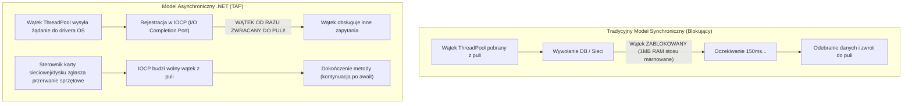
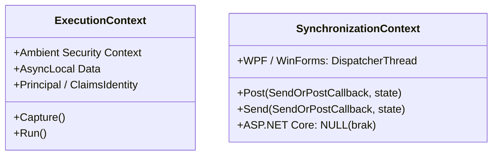
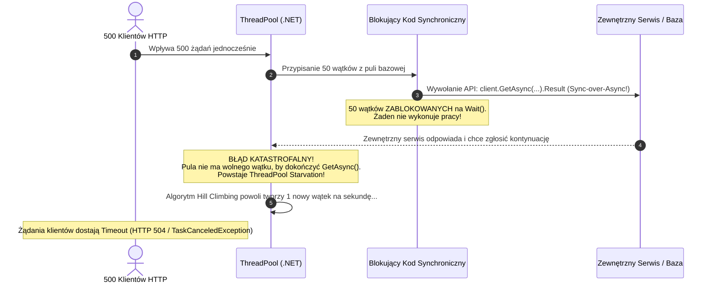

# Programowanie Asynchroniczne w C# i .NET: Maszyna Stanów, ThreadPool i Pytania Rekrutacyjne

Programowanie asynchroniczne w ekosystemie .NET oparte na wzorcu **Task-based Asynchronous Pattern (TAP)** stanowi fundament skalowalnych, nowoczesnych systemów backendowych. Pozwala na optymalne wykorzystanie zasobów sprzętowych poprzez zwalnianie wątków wykonawczych w trakcie operacji wejścia-wyjścia (I/O). Niniejszy artykuł omawia mechanikę `async/await` od poziomu generowanego kodu IL, poprzez model wątkowości CLR, po zaawansowaną optymalizację pamięci i analizę awarii produkcyjnych.

---

## Spis Treści
1. [Fundamenty: I/O-Bound vs CPU-Bound i Wzorzec TAP](#1-fundamenty-io-bound-vs-cpu-bound-i-wzorzec-tap)
   - Porty Ukończenia We/Wy (IOCP) a oszczędność wątków
   - Różnica między asynchronicznością a równoległością
2. [Niskopoziomowa Maszyna Stanów (Compiler Deep-Dive)](#2-niskopoziomowa-maszyna-stanów-compiler-deep-dive)
   - Jak Roslyn przekształca metodę z `async`
   - Struktura `IAsyncStateMachine` i metoda `MoveNext()`
   - Alokacje na stercie: kiedy występuje boxing maszyny stanów?
3. [Konteksty Wykonania: SynchronizationContext i ExecutionContext](#3-konteksty-wykonania-synchronizationcontext-i-executioncontext)
   - Czym jest `SynchronizationContext` i dlaczego usunięto go z ASP.NET Core?
   - Kiedy i po co stosować `ConfigureAwait(false)` w bibliotekach vs aplikacjach?
   - Przepływ danych bezpieczeństwa w `ExecutionContext` (`AsyncLocal<T>`)
4. [Optymalizacja Pamięci: Task<T> vs ValueTask<T>](#4-optymalizacja-pamięci-taskt-vs-valuetaskt)
   - Dlaczego `Task` alokuje pamięć na stercie?
   - Wewnętrzna budowa `ValueTask` i `IValueTaskSource`
   - Żelazne zasady korzystania z `ValueTask` (jak uniknąć katastrofy)
5. [ThreadPool Starvation i Katastrofalne Antywzorce](#5-threadpool-starvation-i-katastrofalne-antywzorce)
   - Mechanika `ThreadPool` w CLR (Hill Climbing Algorithm)
   - Zjawisko Sync-over-Async (`.Result`, `.Wait()`, `.GetAwaiter().GetResult()`)
   - Deadlock w środowiskach z jednowątkowym kontekstem synchronizacji
   - Pułapka `async void` i nieobsłużone wyjątki
6. [Zaawansowana Orkiestracja i Asynchroniczne Strumienie](#6-zaawansowana-orkiestracja-i-asynchroniczne-strumienie)
   - Poprawne kaskadowe propagowanie `CancellationToken`
   - Strumieniowanie danych: `IAsyncEnumerable<T>` i `[EnumeratorCancellation]`
   - Równoległe przetwarzanie asynchroniczne: `Parallel.ForEachAsync` vs `Task.WhenAll`
7. [Pytania Rekrutacyjne z Odpowiedziami (Senior .NET FAQ)](#7-pytania-rekrutacyjne-z-odpowiedziami-senior-net-faq)
   - Pytania Mid / Senior
   - Scenariusze Awaryjne i Live-fire Troubleshooting
8. [Tablica Szybkiej Powtórki (Cheat-Sheet)](#8-tablica-szybkiej-powtórki-cheat-sheet)

---

## 1. Fundamenty: I/O-Bound vs CPU-Bound i Wzorzec TAP

Podstawowym celem słów kluczowych `async` i `await` w C# nie jest przyspieszenie pojedynczej operacji, lecz **maksymalizacja przepustowości (throughput) i skalowalności systemu**.



### Operacje I/O-Bound
W operacjach I/O-bound (zapytania SQL przez `SqlClient`/`Npgsql`, żądania HTTP przez `HttpClient`, odczyt z dysku) fizyczny procesor nie wykonuje pracy. Wątek systemu operacyjnego w modelu synchronicznym jest zawieszony w stanie uśpienia (`WaitSleepJoin`). Przy 1000 współbieżnych zapytań synchronicznych system operacyjny musiałby utrzymać 1000 wątków, co wiąże się ze zużyciem co najmniej 1 GB pamięci na same stosy wątków oraz potężnym narzutem na przełączanie kontekstu (Context Switching).

W modelu asynchronicznym:
- Wywołanie `await stream.ReadAsync()` przekazuje żądanie do sterownika jądra systemu operacyjnego (np. Windows Overlapped I/O lub Linux epoll/io_uring).
- Wątek .NET ThreadPool natychmiast wraca do puli i może obsługiwać żądania innych klientów.
- Po zakończeniu transferu kontroler DMA wywołuje przerwanie sprzętowe, sterownik powiadamia IOCP (I/O Completion Port), a silnik .NET harmonogramuje wznowienie metody na dowolnym wolnym wątku z puli.

### Operacje CPU-Bound
Dla operacji intensywnie obciążających procesor (np. kompresja, obliczanie hashy kryptograficznych, parsowanie potężnych struktur JSON) zwolnienie wątku nie zachodzi, ponieważ procesor musi nieustannie wykonywać instrukcje. W takich przypadkach delegujemy zadanie do puli wątków za pomocą:

```csharp
Task<byte[]> compressedDataTask = Task.Run(() => CompressPayload(payload));
```

> [!WARNING]
> Nigdy nie opakowuj operacji asynchronicznych I/O w `Task.Run()` (np. `Task.Run(() => httpClient.GetStringAsync(...))`). Powoduje to marnowanie dwóch wątków: jednego z puli na uruchomienie delegatu oraz drugiego w procesie asynchronicznym.

---

## 2. Niskopoziomowa Maszyna Stanów (Compiler Deep-Dive)

Słowa kluczowe `async` i `await` są konstrukcjami czysto kompilatorowymi — środowisko uruchomieniowe CLR nie posiada natywnej instrukcji `await`. Kompilator Roslyn przekształca metodę z `async` w prywatną strukturę implementującą interfejs `IAsyncStateMachine`.

### Przekształcenie Kodu przez Roslyn

Rozważmy prostą metodę:

```csharp
public async Task<int> FetchDataAsync(int id)
{
    var client = new HttpClient();
    var response = await client.GetStringAsync($"https://api.internal/data/{id}");
    return response.Length;
}
```

Kompilator generuje pod spodem strukturę podobną do poniższej:

```csharp
[CompilerGenerated]
[StructLayout(LayoutKind.Auto)]
private struct <FetchDataAsync>d__1 : IAsyncStateMachine
{
    public int <>1__state;
    public AsyncTaskMethodBuilder<int> <>t__builder;
    public int id;
    
    // Zmienne lokalne przeniesione do pól struktury:
    private HttpClient <client>5__1;
    private string <response>5__2;
    private TaskAwaiter<string> <>u__1;

    public void MoveNext()
    {
        int num = this.<>1__state;
        int result;
        try
        {
            TaskAwaiter<string> awaiter;
            if (num != 0)
            {
                this.<client>5__1 = new HttpClient();
                // Rozpoczęcie operacji asynchronicznej
                awaiter = this.<client>5__1.GetStringAsync($"https://api.internal/data/{this.id}").GetAwaiter();

                // Sprawdzenie, czy operacja ukończyła się synchronicznie (np. z cache)
                if (!awaiter.IsCompleted)
                {
                    this.<>1__state = 0; // Ustawienie stanu na "oczekiwanie"
                    this.<>u__1 = awaiter;
                    // Zarejestrowanie kontynuacji MoveNext w awaiterze
                    this.<>t__builder.AwaitUnsafeOnCompleted(ref awaiter, ref this);
                    return; // Zwrot wątku do ThreadPool!
                }
            }
            else
            {
                awaiter = this.<>u__1;
                this.<>u__1 = default;
                this.<>1__state = -1;
            }

            // Odebranie wyniku (lub rzucenie wyjątku)
            this.<response>5__2 = awaiter.GetResult();
            result = this.<response>5__2.Length;
        }
        catch (Exception exception)
        {
            this.<>1__state = -2;
            this.<>t__builder.SetException(exception);
            return;
        }

        this.<>1__state = -2;
        this.<>t__builder.SetResult(result);
    }

    public void SetStateMachine(IAsyncStateMachine stateMachine) => 
        this.<>t__builder.SetStateMachine(stateMachine);
}
```

### Kiedy występuje Boxing (alokacja na stercie)?
1. Jeśli operacja asynchroniczna ukończy się **synchronicznie** (częste np. przy czytaniu z bufora w pamięci lub cache, gdzie `awaiter.IsCompleted == true`), metoda wykonuje się w całości synchronicznie w ramach bieżącego wywołania na stosie. Struktura maszyny stanów nigdy nie trafia na stertę!
2. Jeśli operacja zawiesza wykonanie (`!awaiter.IsCompleted`), metoda musi powrócić, ale jej stan (zmienne lokalne, stan maszyny) musi ocaleć. W metodzie `AwaitUnsafeOnCompleted` builder alokuje maszynę stanów na stercie (boxing) w obiekcie typu `AsyncStateMachineBox<TStateMachine>`.

---

## 3. Konteksty Wykonania: SynchronizationContext i ExecutionContext

Zrozumienie różnicy między `SynchronizationContext` a `ExecutionContext` to jeden z najważniejszych wyznaczników wiedzy Senior .NET Developera.



### SynchronizationContext
`SynchronizationContext` odpowiada za **miejsce (środowisko wątkowe)**, w którym ma wykonać się kontynuacja kodu po instrukcji `await`.
- **W WPF / Windows Forms:** Istnieje `DispatcherSynchronizationContext`. Zapewnia, że kod po `await` zostanie przekazany za pomocą `Post()` do wątku głównego interfejsu użytkownika (UI Thread), dzięki czemu można bezpiecznie aktualizować kontrolki UI.
- **W klasycznym ASP.NET (.NET Framework):** `AspNetSynchronizationContext` dbał o to, by kontynuacja po `await` miała dostęp do `HttpContext.Current` oraz gwarantował, że żądanie HTTP jest przetwarzane przez dokładnie jeden wątek w danym momencie.
- **W ASP.NET Core (.NET Core 1.0 - .NET 9+):** **`SynchronizationContext` ZOSTAŁ CAŁKOWICIE USUNIĘTY (`SynchronizationContext.Current == null`)**. Kontynuacja po `await` wykonuje się na dowolnym dostępnym wątku puli `ThreadPool`. Drastycznie zwiększyło to wydajność i całkowicie wyeliminowało ryzyko klasycznych deadlocków w kontrolerach Web API.

### Reguła `ConfigureAwait(false)`

```csharp
// W bibliotekach współdzielonych (Class Libraries / NuGet):
await stream.WriteAsync(buffer, cancellationToken).ConfigureAwait(false);
```

- **`ConfigureAwait(true)` (Domyślne):** Instruuje maszynę stanów, aby przechwyciła bieżący `SynchronizationContext` (oraz `TaskScheduler`) i wznowiła wykonanie w tym samym kontekście.
- **`ConfigureAwait(false)`:** Mówi: *"Nie obchodzi mnie, na jakim wątku lub w jakim kontekście dokończy się ta metoda. Uruchom kontynuację na pierwszym wolnym wątku z ThreadPool"*.

> [!TIP]
> **Gdzie stosować `ConfigureAwait(false)`?**
> * **Biblioteki wielokrotnego użytku (NuGet, warstwy Domain/Infrastructure):** ZAWSZE stosuj `ConfigureAwait(false)`. Chroni to bibliotekę przed zawieszeniem, jeśli zostanie skonsumowana przez aplikację z SynchronizationContext (np. WPF lub legacy ASP.NET).
> * **Aplikacje ASP.NET Core (Controllers, Minimal APIs):** Nie ma potrzeby stosowania `ConfigureAwait(false)`, ponieważ w ASP.NET Core nie ma `SynchronizationContext`. Jednakże w czystej architekturze w projektach bibliotecznych pozostaje to dobrą praktyką.

### ExecutionContext i `AsyncLocal<T>`
Podczas gdy `SynchronizationContext` zarządza wątkami, **`ExecutionContext` reprezentuje logiczne środowisko przepływu danych**. Przenosi m.in.:
- Dane tożsamości użytkownika (`ClaimsPrincipal`)
- Wartości zmiennych **`AsyncLocal<T>`** (odpowiednik `ThreadLocal<T>`, ale płynący wzdłuż asynchronicznego łańcucha wywołań — kluczowy dla `CorrelationId`, kontekstu transakcji czy tracingu OpenTelemetry).
- Informacje o kulturze (`CultureInfo`)

`ExecutionContext` jest domyślnie automatycznie przechwytywany i przepływa (flows) do wszystkich kontynuacji asynchronicznych.

---

## 4. Optymalizacja Pamięci: Task<T> vs ValueTask<T>

Obiekt `Task<T>` jest **klasą (typem referencyjnym)**. Za każdym razem, gdy metoda asynchroniczna tworzy instancję `Task<T>`, dochodzi do alokacji obiektu na stercie zarządzanej (Managed Heap).

W systemach o skrajnie wysokiej przepustowości (np. serwery proxy, brokery wiadomości, silniki przetwarzania transakcji finansowych czy telemetrii w infrastrukturze krytycznej) miliony alokacji `Task` na sekundę generują potężne obciążenie dla Garbage Collectora (szczególnie w Generacji 0).

### Rozwiązanie: `ValueTask<T>`

`ValueTask<T>` jest **strukturą (typem wartościowym)**. Może reprezentować:
1. Wynik bezpośredni (zwrócony natychmiast synchronicznie bez żadnej alokacji na stercie).
2. Tradycyjny obiekt `Task<T>`.
3. Interfejs `IValueTaskSource<T>` — mechanizm ponownego używania obiektów z puli (Object Pooling).

```csharp
public ValueTask<int> ReadByteAsync()
{
    // Jeśli dane są już w buforze pamięci RAM, zwracamy wynik synchronicznie:
    if (_bufferPosition < _bufferLength)
    {
        return new ValueTask<int>(_buffer[_bufferPosition++]); // ZERO ALOKACJI NA STERTCIE!
    }

    // W przeciwnym razie delegujemy do powolnego odczytu asynchronicznego:
    return new ValueTask<int>(ReadFromDiskAsync());
}
```

### Żelazne Reguły Korzystania z `ValueTask<T>`

> [!CAUTION]
> Ponieważ `ValueTask<T>` pod spodem może korzystać z obiektów `IValueTaskSource<T>`, które po odczytaniu wyniku są natychmiast resetowane i zwracane do wewnętrznej puli, złamanie poniższych reguł prowadzi do niezdefiniowanego zachowania (Undefined Behavior) i trudnych do wykrycia błędów pamięci:
> 1. **Nigdy nie wykonuj `await` na tym samym `ValueTask` wielokrotnie!** Drugi `await` trafi na zresetowany lub przypisany do innego żądania obiekt!
> 2. **Nigdy nie wywołuj `.GetAwaiter().GetResult()` przed ukończeniem operacji.**
> 3. **Nie używaj `ValueTask` w `Task.WhenAll()` ani `Task.WhenAny()`.** Jeśli musisz połączyć wiele zadań, przekonwertuj je wcześniej za pomocą `.AsTask()`.

---

## 5. ThreadPool Starvation i Katastrofalne Antywzorce

Pula wątków (.NET ThreadPool) dynamicznie zarządza liczbą wątków roboczych za pomocą algorytmu **Hill Climbing**. Algorytm monitoruje przepustowość systemu i w razie potrzeby powoli tworzy nowe wątki (zwykle w tempie zaledwie **1–2 wątki na sekundę** w przypadku wykrycia blokad).



### Zjawisko Sync-over-Async (`.Result`, `.Wait()`)

Sync-over-async polega na synchronicznym oczekiwaniu na wynik operacji asynchronicznej za pomocą:
- `task.Result`
- `task.Wait()`
- `task.GetAwaiter().GetResult()`

#### Dlaczego to zabija systemy produkcyjne?
1. **W aplikacjach z SynchronizationContext (np. WPF):** Wątek UI wywołuje `.Result`. `Result` blokuje wątek UI. W tle kończy się pobieranie danych i chce wznowić wykonanie metody w przechwyconym kontekście UI. Jednak wątek UI jest zablokowany i czeka na `Result`. **Powstaje klasyczny, 100% Deadlock.**
2. **W aplikacjach o dużej skali (ASP.NET Core):** Blokowanie wątku za pomocą `.Result` nie wywołuje bezpośredniego pojedynczego deadlocka, lecz **ThreadPool Starvation**. Jeśli nagle przyjdzie 200 żądań, a pula posiadała 32 wątki bazowe, wszystkie 32 wątki zostaną zablokowane na operacji `.Result`. Kiedy dane z bazy nadejdą, nie ma wolnego wątku w puli, który mógłby obsłużyć I/O completion callback! System zamiera na kilkadziesiąt sekund, a metryki CPU spadają do 0%, mimo że czasy odpowiedzi szybują w górę.

### Pułapka `async void`
Jedynym uzasadnionym miejscem dla `async void` są **procedury obsługi zdarzeń UI (Event Handlers)**, np. `private async void Button_Click(object sender, EventArgs e)`.

W kodzie backendowym `async void` jest śmiertelnie niebezpieczny:
- Wywołujący nie może użyć `await`, więc metoda odpala się w trybie "odpal i zapomnij" (*fire-and-forget*).
- **Wyjątki nie mogą zostać przechwycone przez blok `try/catch` otaczający wywołanie!**
- Nieobsłużony wyjątek w `async void` jest zgłaszany bezpośrednio do `SynchronizationContext` lub `AppDomain.UnhandledException`, co w domyślnej konfiguracji środowiska .NET **natychmiast zabija cały proces aplikacji (Crash procesu!)**.

---

## 6. Zaawansowana Orkiestracja i Asynchroniczne Strumienie

### Kaskadowe i Kooperatywne Anulowanie: `CancellationToken`
Model anulowania w .NET jest w pełni kooperacyjny. Oznacza to, że metoda nie może zostać brutalnie ubita z zewnątrz (co prowadziłoby do uszkodzenia pamięci lub osieroconych połączeń) — musi sama sprawdzić stan tokena.

```csharp
public async Task ProcessOrdersAsync(CancellationToken cancellationToken)
{
    // Powiązanie tokena zewnętrznego z lokalnym timeoutem:
    using var linkedCts = CancellationTokenSource.CreateLinkedTokenSource(cancellationToken);
    linkedCts.CancelAfter(TimeSpan.FromSeconds(30));

    try
    {
        while (!linkedCts.Token.IsCancellationRequested)
        {
            var order = await _orderQueue.DequeueAsync(linkedCts.Token);
            await ProcessSingleOrderAsync(order, linkedCts.Token);
        }
    }
    catch (OperationCanceledException) when (cancellationToken.IsCancellationRequested)
    {
        _logger.LogWarning("Przetwarzanie przerwane na żądanie systemu (Graceful Shutdown).");
    }
    catch (OperationCanceledException)
    {
        _logger.LogError("Przetwarzanie przerwane z powodu przekroczenia lokalnego timeoutu (30s).");
    }
}
```

### Asynchroniczne Strumienie: `IAsyncEnumerable<T>`
Wprowadzony w C# 8 interfejs `IAsyncEnumerable<T>` łączy paradygmat asynchroniczności z generatorem typu `yield return`. Pozwala na strumieniowanie potężnych wolumenów danych z bazy danych lub sieci rekord po rekordzie, bez konieczności buforowania całej kolekcji w pamięci RAM.

```csharp
public async IAsyncEnumerable<TelemetryData> StreamTelemetryAsync(
    [EnumeratorCancellation] CancellationToken cancellationToken = default)
{
    using var connection = new NpgsqlConnection(_connectionString);
    await connection.OpenAsync(cancellationToken);

    using var command = new NpgsqlCommand("SELECT id, value, timestamp FROM sensors", connection);
    using var reader = await command.ExecuteReaderAsync(cancellationToken);

    while (await reader.ReadAsync(cancellationToken))
    {
        yield return new TelemetryData(
            reader.GetInt32(0),
            reader.GetDouble(1),
            reader.GetDateTime(2)
        );
    }
}
```

### Równoległość Asynchroniczna: `Parallel.ForEachAsync` (.NET 6+)
Wcześniej programiści często używali `Task.WhenAll(items.Select(ProcessAsync))`, co przy 100 000 elementów tworzyło 100 000 zadań jednocześnie i zarzynało bazę danych lub sieć.

`Parallel.ForEachAsync` pozwala na łatwe ograniczenie stopnia współbieżności (*throttling*):

```csharp
await Parallel.ForEachAsync(orders, new ParallelOptions
{
    MaxDegreeOfParallelism = 10, // Maksymalnie 10 współbieżnych operacji
    CancellationToken = cancellationToken
}, async (order, ct) =>
{
    await _orderProcessor.ProcessAsync(order, ct);
});
```

---

## 7. Pytania Rekrutacyjne z Odpowiedziami (Senior .NET FAQ)

### Pytanie 1: Co dokładnie dzieje się pod spodem, gdy w metodzie następuje instrukcja `await`?
**Odpowiedź:**
1. Wywoływana jest metoda `GetAwaiter()` na oczekiwanym obiekcie (np. `Task`), zwracająca awaiter.
2. Maszyna stanów sprawdza właściwość `awaiter.IsCompleted`.
3. Jeśli zadanie jest już ukończone (`true`), sterowanie nie jest przerywane — kod kontynuuje wykonanie synchronicznie na bieżącym wątku bez narzutu na przełączanie kontekstu.
4. Jeśli zadanie nie jest ukończone (`false`), maszyna stanów zapisuje bieżący numer stanu (np. `state = 0`), alokuje się na stercie w obiekcie boxującym (o ile wcześniej nie była zboxowana) i przekazuje delegat `MoveNext` do awaitera za pomocą `awaiter.UnsafeOnCompleted(continuation)`.
5. Wątek wykonawczy natychmiast opuszcza metodę i wraca do wywołującego lub do puli `ThreadPool`.
6. Gdy oczekiwane zadanie I/O zostanie sfinalizowane, sterownik lub pętla zdarzeń wywołuje zarejestrowaną kontynuację, co uruchamia metodę `MoveNext()`, przywraca stan zmiennych lokalnych i pobiera wynik przez `awaiter.GetResult()`.

---

### Pytanie 2: Dlaczego w ASP.NET Core zrezygnowano z `SynchronizationContext`?
**Odpowiedź:**
W starszym ASP.NET (`System.Web`) każdy request był powiązany z `AspNetSynchronizationContext`, który wymuszał, by wszelkie asynchroniczne kontynuacje powracały do tego samego kontekstu żądania i nie wykonywały się współbieżnie. Wiązało się to z:
- Narzutem wydajnościowym na ciągłe przełączanie i harmonogramowanie zadań przez kontekst.
- Masowymi deadlockami, gdy programista wywołał `.Result` lub `.Wait()` na zadaniu asynchronicznym.

W ASP.NET Core kontekst requestu (`HttpContext`) jest w pełni wątkowo bezpieczny w ujęciu sekwencyjnym, a architektura zakłada, że kontynuacja po `await` może bezpiecznie wylądować na dowolnym wątku z puli `ThreadPool`. Wyeliminowanie `SynchronizationContext` drastycznie uprościło runtime, zwiększyło throughput i wyeliminowało ryzyko deadlocków wywołanych blokadą wątku kontekstowego.

---

### Pytanie 3: Wyjaśnij różnicę między `Task` a `ValueTask`. W jakich sytuacjach `ValueTask` jest antywzorcem?
**Odpowiedź:**
- `Task` to obiekt referencyjny na stercie. Jego alokacja kosztuje pamięć i czas GC, ale pozwala na wielokrotny odczyt wyniku (`await`, `.Result`), bezpieczne przekazywanie między wątkami oraz łączenie w `Task.WhenAll`.
- `ValueTask` to struktura (`readonly struct`), która w przypadku synchronicznego ukończenia (np. pobranie z cache pamięci podręcznej) kosztuje dokładnie **0 bajtów alokacji na stercie**.

**Kiedy `ValueTask` jest antywzorcem?**
1. Gdy metoda niemal zawsze kończy się asynchronicznie (operacja I/O). Wtedy `ValueTask` musi zaalokować pod spodem obiekt `Task` lub `IValueTaskSource`, a sama struktura `ValueTask` zajmuje więcej bajtów na stosie niż wskaźnik do `Task`, generując większy narzut kopiowania.
2. Gdy programista potrzebuje wielokrotnego oczekiwania (`await`) na to samo zadanie — `ValueTask` na to nie pozwala.
3. W interfejsach publicznych API ogólnego przeznaczenia, gdzie konsument może nie znać restrykcji dotyczących unikania równoległego awaitowania.

---

### Pytanie 4: Jak zdiagnozować zjawisko ThreadPool Starvation na serwerze produkcyjnym?
**Odpowiedź:**
**Symptomy:**
- Gwałtowny wzrost czasu odpowiedzi API (latency p99 rośnie z 20ms do kilkunastu sekund).
- Użycie CPU serwera jest niskie lub umiarkowane (np. 15-25%), a baza danych nie jest przeciążona.
- Masowe wyjątki `TimeoutException`, `TaskCanceledException` lub błędy timeoutów połączeń z Redisem/SQL.

**Narzędzia diagnostyczne:**
1. **`dotnet-counters`:** Monitorowanie liczby wątków i kolejki zadań w czasie rzeczywistym:
   ```bash
   dotnet-counters monitor --process-id <PID> --counters System.Runtime
   ```
   Kluczowe metryki:
   - `ThreadPool Thread Count`: ciągły, powolny wzrost liczby wątków.
   - `ThreadPool Queue Length`: duża liczba oczekujących zadań roboczych (Work Items Queue > 1000).
2. **Zrzut pamięci (`dotnet-dump`) i analiza w LLDB/SOS:**
   - Wygenerowanie zrzutu: `dotnet-dump collect -p <PID>`
   - Analiza stosów wątków: `dotnet-dump analyze dump.dmp`
   - Polecenie `clrstack -all` ujawnia dziesiątki lub setki wątków zablokowanych na metodach takich jak:
     `System.Threading.Tasks.Task.GetResultCore()`, `Task.Wait()`, lub `Monitor.Enter()`.

---

### Pytanie 5 (Scenariusz Awaryjny Live-Fire): System mikroserwisowy w architekturze .NET nagle przestaje odpowiadać przy dużym obciążeniu. W logach pojawiają się błędy `Timeout awaiting response from Redis client`. Po restarcie serwisu problem znika na godzinę. Co jest przyczyną i jak to naprawić?
**Analiza i Diagnoza:**
Klient Redisa (np. StackExchange.Redis) wykonuje operacje asynchronicznie i używa wewnętrznych callbacków rejestrowanych w .NET ThreadPool. 
Jeśli w dowolnym miejscu aplikacji (np. w logice biznesowej, mapowaniu DTO lub middleware) ktoś użył synchronicznego wywołania kodu asynchronicznego (np. `_userService.GetUserAsync(id).Result`), wątki ThreadPool zostają wyczerpane. Gdy odpowiedź z serwera Redis wraca do socketa, ThreadPool nie jest w stanie przydzielić wolnego wątku, by uruchomić kod deserializacji odpowiedzi Redisa przed upływem timeoutu (domyślnie 5000ms). Komunikat o błędzie wskazuje na Redis, ale faktyczną przyczyną jest **głodzenie puli wątków spowodowane kodem Sync-over-Async w innej części aplikacji**.

**Rozwiązanie:**
1. Przeprowadzenie pełnego audytu kodu w poszukiwaniu `.Result`, `.Wait()` i `.GetAwaiter().GetResult()` oraz zastąpienie ich w 100% przez łańcuchy `async / await`.
2. Aktywacja reguł analizatora kodu Roslyn (np. `AsyncFixer`, `Microsoft.VisualStudio.Threading.Analyzers`), które traktują blokowanie operacji asynchronicznych jako błąd kompilacji.
3. Włączenie w środowisku developerskim wykrywania blokad na wątkach poprzez `Ben.BlockingDetector`.

---

## 8. Tablica Szybkiej Powtórki (Cheat-Sheet)

| Zagadnienie | Dobre Praktyki (Good Practice) | Antywzorce (Bad Practice) |
| :--- | :--- | :--- |
| **Typ Zwracany** | `Task`, `Task<T>`, `ValueTask<T>` | `async void` (katastrofa: brak możliwości złapania wyjątków) |
| **Oczekiwanie na wynik** | `await DoWorkAsync()` | `.Result`, `.Wait()`, `.GetAwaiter().GetResult()` |
| **Kontekst w Bibliotekach**| `await task.ConfigureAwait(false)` | Nieużywanie `ConfigureAwait` w bibliotekach NuGet |
| **ASP.NET Core Controller** | Zwykły `await task` (brak SynchronizationContext) | Stosowanie `Task.Run` do opakowywania operacji I/O |
| **Anulowanie Operacji** | Zawsze przekazuj `CancellationToken` w dół stosu | Ignorowanie `CancellationToken` lub połykanie `OperationCanceledException` |
| **Zużycie Pamięci** | `ValueTask<T>` dla metod często kończących się synchronicznie | Wielokrotne awaitowanie tego samego `ValueTask` |
| **Ograniczanie Równoległości**| `Parallel.ForEachAsync` z `MaxDegreeOfParallelism` | `Task.WhenAll` na nieograniczonej kolekcji 10 000 elementów |
