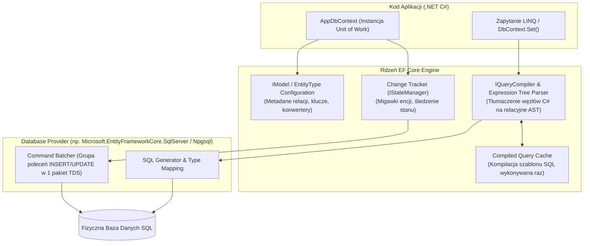
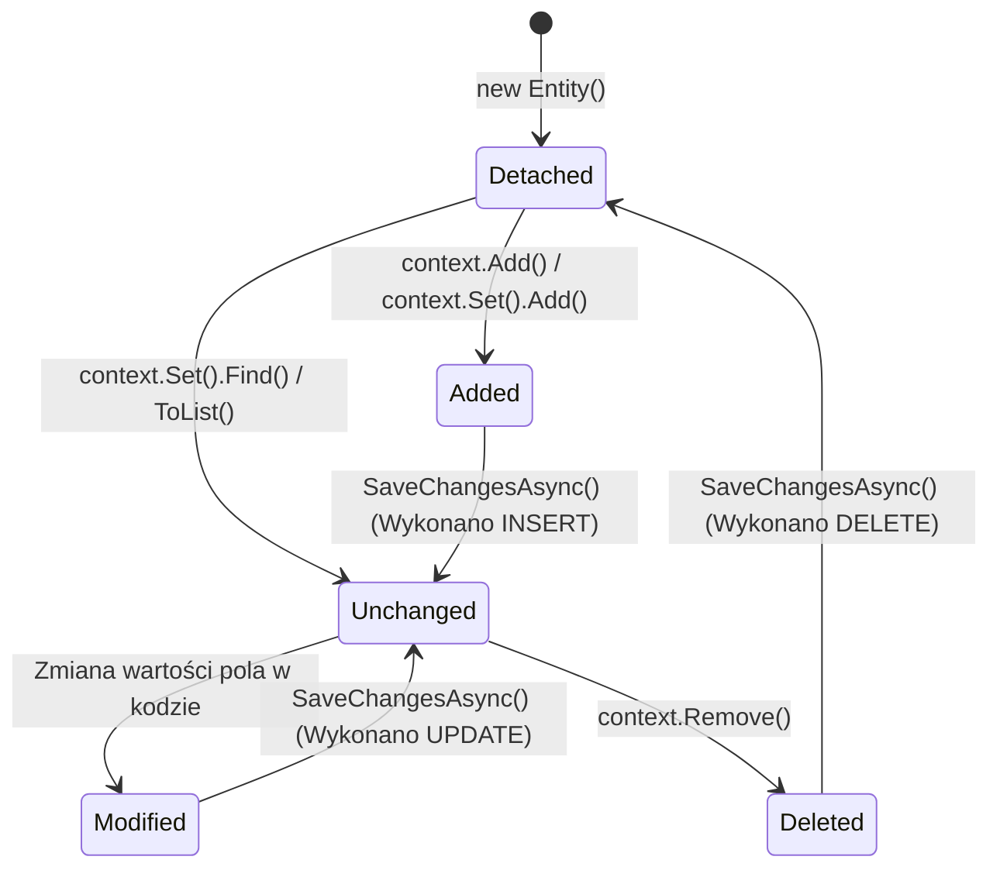
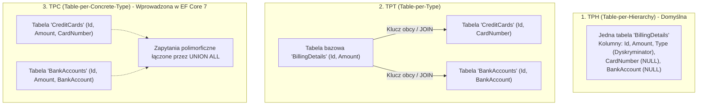

# Entity Framework Core: Niskopoziomowa Architektura ORM, Optymalizacja Zapytań i Pytania Rekrutacyjne

Kompleksowe kompendium inżynierskie poświęcone **Entity Framework Core (EF Core)** — wiodącemu frameworkowi mapowania obiektowo-relacyjnego (ORM) w ekosystemie .NET. Artykuł szczegółowo omawia wewnętrzną architekturę silnika, cykl życia `DbContext`, niskopoziomowe działanie Change Trackera, kompilację zapytań LINQ do SQL, strategie ładowania danych i problem *Cartesian Explosion*, operacje masowe (`ExecuteUpdate`/`ExecuteDelete`), zaawansowane modelowanie, optymistyczną współbieżność oraz zestaw zaawansowanych pytań rekrutacyjnych i realnych scenariuszy awaryjnych (od poziomu Mid do .NET / Software Architecta).

---

## Spis Treści
1. [Wewnętrzna Architektura EF Core i Cykl Życia DbContext](#1-wewnętrzna-architektura-ef-core-i-cykl-życia-dbcontext)
   - Architektura blokowa: Model, Query Compiler, Change Tracker i Provider
   - Cykl życia w Dependency Injection (Dlaczego `Scoped`?)
   - Brak bezpieczeństwa wątkowego (Thread Safety)
   - Optymalizacja alokacji z `DbContextPool`
2. [Mechanizm Śledzenia Zmian (Change Tracker Deep-Dive)](#2-mechanizm-śledzenia-zmian-change-tracker-deep-dive)
   - Stany encji: `Detached`, `Unchanged`, `Modified`, `Added`, `Deleted`
   - Wykrywanie zmian: Snapshot Tracking vs Notification Tracking
   - `AsNoTracking()` vs `AsNoTrackingWithIdentityResolution()`
   - Wsadowe wykonywanie poleceń SQL (Batching w `SaveChanges`)
3. [Przetwarzanie Zapytań: Od LINQ do Surowego SQL](#3-przetwarzanie-zapytań-od-linq-do-surowego-sql)
   - `IQueryable<T>` vs `IEnumerable<T>` (Server vs Client Evaluation)
   - Drzewa wyrażeń (*Expression Trees*) i buforowanie zapytań (*Query Cache*)
   - Problem N+1 zapytań i strategie ładowania: Eager, Explicit, Lazy Loading
   - Zjawisko Cartesian Explosion i optymalizacja za pomocą `AsSplitQuery()`
   - Projekcje do DTO jako fundament wysokiej wydajności
4. [Zaawansowane Modelowanie i Nowoczesne Funkcjonalności](#4-zaawansowane-modelowanie-i-nowoczesne-funkcjonalności)
   - Strategie mapowania dziedziczenia: TPH, TPT, TPC (Porównanie wydajności)
   - Value Converters i Strongly-Typed IDs
   - Global Query Filters (Soft Delete i Multi-Tenancy)
   - Natywne mapowanie kolumn JSON (`ToJson()`)
   - Operacje masowe: `ExecuteUpdateAsync()` oraz `ExecuteDeleteAsync()`
5. [Współbieżność, Transakcje i Zarządzanie Migracjami](#5-współbieżność-transakcje-i-zarządzanie-migracjami)
   - Optymistyczna współbieżność (*Optimistic Concurrency*) z `RowVersion`
   - Zarządzanie transakcjami (`IDbContextTransaction`)
   - Dobre praktyki migracji bazy danych w środowiskach produkcyjnych (CI/CD)
6. [Pytania Rekrutacyjne z Odpowiedziami (FAQ Interview)](#6-pytania-rekrutacyjne-z-odpowiedziami-faq-interview)
   - Pytania Podstawowe i Średniozaawansowane (Mid)
   - Pytania Zaawansowane i Architektoniczne (Senior / Architect)
   - Scenariusze Awaryjne i Live-fire Troubleshooting
7. [Tablica Szybkiej Powtórki (Cheat-Sheet)](#7-tablica-szybkiej-powtórki-cheat-sheet)

---

## 1. Wewnętrzna Architektura EF Core i Cykl Życia DbContext

Entity Framework Core nie jest pojedynczą monolityczną biblioteką, lecz modułowym silnikiem przetwarzania metadanych, zapytań i transakcji.



### Cykl Życia w Kontenerze Wstrzykiwania Zależności (DI)
W aplikacjach ASP.NET Core rejestracja kontekstu za pomocą `builder.Services.AddDbContext<AppDbContext>(...)` konfiguruje cykl życia jako **`Scoped`**:
- Dla każdego żądania HTTP tworzona jest **dokładnie jedna instancja `DbContext`**.
- Wszystkie serwisy wstrzykiwane w ramach tego samego żądania współdzielą ten sam kontekst, co realizuje wzorzec **Unit of Work** (wszystkie modyfikacje są zapisywane w jednej atomowej transakcji podczas wywołania `SaveChangesAsync`).
- Po zakończeniu żądania HTTP kontener DI niszczy instancję kontekstu, zwalniając połączenie do bazy danych z powrotem do puli (*ADO.NET Connection Pool*).

### Brak Bezpieczeństwa Wątkowego (Not Thread-Safe)
`DbContext` **nie jest bezpieczny wątkowo**. Instancja kontekstu nie może być współdzielona przez wiele wątków jednocześnie. Próba wykonania dwóch równoległych operacji:
```csharp
// KATASTROFALNY BŁĄD ARCHITEKTONICZNY!
Task t1 = _context.Users.ToListAsync();
Task t2 = _context.Orders.ToListAsync();
await Task.WhenAll(t1, t2);
```
Spowoduje natychmiastowe rzucenie wyjątku:
`System.InvalidOperationException: A second operation was started on this context instance before a previous operation completed. This is usually caused by different threads concurrently using the same instance of DbContext.`

### Optymalizacja Alokacji z `DbContextPool`
Standardowe tworzenie nowej instancji `DbContext` przy każdym żądaniu HTTP wiąże się z alokacją pamięci na stercie i inicjalizacją wewnętrznych serwisów.
Użycie `AddDbContextPool<AppDbContext>(...)` wprowadza pulę gotowych instancji kontekstu:
- Zamiast niszczyć obiekt po zakończeniu requestu, EF Core resetuje jego wewnętrzny stan (czyści Change Tracker) i zwraca instancję do puli.
- Pozwala to na redukcję alokacji pamięci o 20–30% w aplikacjach o wysokiej przepustowości (*High-Throughput Web APIs*).

---

## 2. Mechanizm Śledzenia Zmian (Change Tracker Deep-Dive)

Change Tracker (`IStateManager`) to serce wzorca Unit of Work w EF Core. Odpowiada za rejestrowanie obiektów pobranych z bazy danych oraz wykrywanie, które właściwości uległy zmianie.



### Stany Encji (`EntityState`):
1. **`Detached`**: Encja nie jest monitorowana przez kontekst (np. świeżo utworzony obiekt przez `new` lub encja pobrana z `AsNoTracking()`).
2. **`Unchanged`**: Encja znajduje się w bazie, a żadne jej pole nie uległo zmianie od momentu odczytu.
3. **`Modified`**: Przynajmniej jedno pole encji zostało zmienione. Podczas `SaveChanges` EF Core wygeneruje polecenie SQL `UPDATE`, aktualizując **tylko zmodyfikowane kolumny**.
4. **`Added`**: Nowy rekord. Podczas `SaveChanges` zostanie wygenerowane polecenie SQL `INSERT`, a nowo wygenerowany klucz główny (np. `IDENTITY` / `SERIAL`) zostanie automatycznie przypisany do encji.
5. **`Deleted`**: Oznaczona do usunięcia. Podczas `SaveChanges` zostanie wygenerowane polecenie SQL `DELETE`.

### Wykrywanie Zmian: Snapshot Tracking
Domyślnie EF Core stosuje mechanizm **Snapshot Tracking (Śledzenie Migawek)**:
- W momencie załadowania encji z bazy danych, Change Tracker tworzy w pamięci **ukrytą kopię (migawkę)** wszystkich jej wartości.
- Podczas wywołania `SaveChanges()` (lub jawnego `context.ChangeTracker.DetectChanges()`), Change Tracker skanuje każdą śledzoną encję, porównując bieżące wartości pól z zapisaną migawką.
- **Koszt wydajnościowy:** Jeśli załadujesz do pamięci 50 000 encji, Change Tracker musi wykonać 50 000 porównań pól, co drastycznie obciąża procesor i alokuje gigabajty pamięci RAM.

### `AsNoTracking()` vs `AsNoTrackingWithIdentityResolution()`

```csharp
// 1. Zwykłe zapytanie (Pełne śledzenie - wysoki koszt pamięciowy)
var trackedUser = await context.Users.FirstAsync(u => u.Id == 1);

// 2. AsNoTracking (Brak śledzenia - maksymalna wydajność dla zapytań tylko do odczytu)
var readOnlyUsers = await context.Users
    .AsNoTracking()
    .ToListAsync();

// 3. AsNoTrackingWithIdentityResolution (Brak śledzenia, ale zapobieganie duplikacji instancji obiektów w relacjach)
var orders = await context.Orders
    .AsNoTrackingWithIdentityResolution()
    .Include(o => o.Customer)
    .ToListAsync();
```

| Cecha | Śledzenie Domyślne | `AsNoTracking()` | `AsNoTrackingWithIdentityResolution()` |
| :--- | :--- | :--- | :--- |
| **Pamięć (Snapshot)** | Tworzona pełna migawka | Całkowity brak migawek | Brak migawek |
| **Wykrywanie zmian** | Automatyczne przy `SaveChanges` | Niemożliwe | Niemożliwe |
| **Identity Resolution**| Zawsze (1 rekord DB = 1 instancja w RAM) | Brak (Wiele rekordów może stworzyć osobne instancje rodzica) | Gwarantowane (Współdzielenie referencji do tego samego rodzica) |
| **Zastosowanie** | Modyfikacja, usuwanie, transakcje | Endpointy GET w API, raporty | Złożone zapytania z wieloma `Include()` tylko do odczytu |

---

## 3. Przetwarzanie Zapytań: Od LINQ do Surowego SQL

### Różnica między `IQueryable<T>` a `IEnumerable<T>`
Zrozumienie tej różnicy to fundament unikania dramatycznych problemów wydajnościowych w .NET:
- **`IQueryable<T>`**: Reprezentuje **drzewo wyrażeń (`Expression Tree`)**. Wywołanie metod `.Where()`, `.OrderBy()`, `.Take()` nie pobiera danych. Są one dołączane do drzewa wyrażeń. Translacja do polecenia SQL następuje po stronie **serwera bazy danych** dopiero w momencie wywołania operatora terminalnego (`ToListAsync()`, `FirstAsync()`, `foreach`).
- **`IEnumerable<T>`**: Reprezentuje kolekcję w pamięci RAM procesu .NET. Jeśli rzutujesz zapytanie do `IEnumerable` przed filtrowaniem, EF Core pobierze **całą tabelę z bazy danych do pamięci aplikacji**, a filtrowanie wykona procesor maszyny wirtualnej!

```csharp
// KATASTROFA: Cała tabela 'Invoices' (np. 5 milionów wierszy) jest przesyłana przez sieć!
IEnumerable<Invoice> query = context.Invoices; 
var results = query.Where(i => i.TotalAmount > 1000).ToList();

// PRAWIDŁOWO: Klauzula WHERE trafia bezpośrednio do zapytania SQL po stronie silnika bazy
IQueryable<Invoice> query = context.Invoices;
var results = await query.Where(i => i.TotalAmount > 1000).ToListAsync();
```

---

### Problem N+1 Zapytań i Strategie Ładowania Danych

Problem N+1 występuje, gdy aplikacja wykonuje 1 zapytanie po kolekcję główną, a następnie dla każdego z $N$ pobranych elementów wykonuje osobne, dodatkowe zapytanie SQL w pętli.

#### 1. Eager Loading (Wczesne Ładowanie - Rekomendowane):
Wykorzystuje metodę `.Include()` oraz `.ThenInclude()` do pobrania relacji za pomocą instrukcji `LEFT JOIN` w jednym zapytaniu:
```csharp
var usersWithOrders = await context.Users
    .Include(u => u.Orders)
        .ThenInclude(o => o.OrderItems)
    .ToListAsync();
```

#### 2. Lazy Loading (Leniwe Ładowanie - Antywzorzec w API):
Wymaga włączenia pakietu `Microsoft.EntityFrameworkCore.Proxies` oraz oznaczenia właściwości nawigacyjnych słowem kluczowym `virtual`.
```csharp
// NIEBEZPIECZEŃSTWO w serializacji JSON (np. w kontrolerze API):
foreach (var user in context.Users) 
{
    // Każde odwołanie do 'Orders' generuje ukryte zapytanie SELECT do bazy!
    Console.WriteLine(user.Orders.Count); 
}
```
> [!CAUTION]
> Lazy loading w webowych kontrolerach REST API jest tykającą bombą zegarową. Przekazanie encji z leniwym ładowaniem do serializatora JSON (`System.Text.Json` lub `Newtonsoft`) spowoduje przejście po całym grafie obiektów, wykonanie setek zapytań SQL (*N+1*) oraz wyrzucenie wyjątku cyklicznej referencji (*Circular Reference Exception*).

---

### Zjawisko Cartesian Explosion i `AsSplitQuery()`
Gdy wykonujemy Eager Loading z wieloma kolekcjami podrzędnymi:
```csharp
var blog = await context.Blogs
    .Include(b => b.Posts)
    .Include(b => b.Contributors)
    .FirstAsync();
```
Relacyjny silnik SQL generuje iloczyn kartezjański (*Cartesian Product*). Jeśli blog ma 100 postów i 50 współautorów, zapytanie zwróci $1 \times 100 \times 50 = 5000$ wierszy z bazy danych, w których dane bloga będą zduplikowane 5000 razy, zapychając łącze sieciowe.

#### Rozwiązanie w EF Core: `AsSplitQuery()`
```csharp
var blog = await context.Blogs
    .AsSplitQuery() // Zamiast 1 potężnego iloczynu kartezjańskiego, EF Core wyśle 3 osobne zapytania
    .Include(b => b.Posts)
    .Include(b => b.Contributors)
    .FirstAsync();
```
- Zapytanie 1: `SELECT ... FROM Blogs WHERE Id = @id`
- Zapytanie 2: `SELECT ... FROM Posts WHERE BlogId = @id`
- Zapytanie 3: `SELECT ... FROM Contributors WHERE BlogId = @id`
EF Core automatycznie łączy wyniki w pamięci.

---

### Projekcje do DTO (Najwyższa Wydajność)
Pobieranie całych encji za pomocą `Include()` jest niepotrzebnym narzutem, jeśli API zwraca tylko wybrane pola:

```csharp
// Pobiera z bazy DOKŁADNIE 3 kolumny - zero narzutu Change Trackera, minimalne I/O sieci
public record UserSummaryDto(int Id, string FullName, int OrdersCount);

var users = await context.Users
    .Where(u => u.IsActive)
    .Select(u => new UserSummaryDto(
        u.Id,
        u.FirstName + " " + u.LastName,
        u.Orders.Count
    ))
    .ToListAsync();
```

---

## 4. Zaawansowane Modelowanie i Nowoczesne Funkcjonalności

### Strategie Mapowania Dziedziczenia

EF Core wspiera trzy podstawowe strategie mapowania polimorfizmu obiektowego na tabele relacyjne:



| Strategia | Struktura Tabel | Wydajność Odczytu Polimorficznego | Integralność Danych (NOT NULL) | Zastosowanie |
| :--- | :--- | :--- | :--- | :--- |
| **TPH** | 1 tabela dla całej hierarchii z kolumną dyskryminatora | **Najwyższa** (Brak złączeń JOIN) | Słaba (Pola klas podrzędnych muszą być NULL) | Proste hierarchie, wysoka wydajność |
| **TPT** | Osobna tabela dla każdej klasy (baza + podklasy) | **Niska** (Wymaga kosztownych operacji `LEFT JOIN`) | Doskonała (Klucze obce i więzy NOT NULL) | Rzadko zmieniane dane z silnymi regułami DB |
| **TPC** | Tabele tylko dla klas konkretnych (brak tabeli bazowej)| **Wysoka** dla konkretnych typów, średnia dla bazy | Doskonała (Brak pól NULL) | Głębokie hierarchie bez częstych zapytań o typ bazowy |

---

### Operacje Masowe: `ExecuteUpdateAsync` i `ExecuteDeleteAsync` (EF Core 7+)
Przez lata aktualizacja 10 000 rekordów w EF Core wymagała pobrania ich wszystkich do pamięci RAM, oznaczenia zmian przez Change Tracker i wysłania 10 000 instrukcji `UPDATE` w `SaveChangesAsync`.

Od wersji **EF Core 7+** wprowadzono natywne metody operacji masowych:
```csharp
// Bezpośrednie wygenerowanie i wykonanie SQL bez ładowania encji do pamięci!
int updatedRows = await context.Invoices
    .Where(i => i.DueDate < DateTime.UtcNow && !i.IsOverdue)
    .ExecuteUpdateAsync(setter => setter
        .SetProperty(i => i.IsOverdue, true)
        .SetProperty(i => i.PenaltyAmount, i => i.TotalAmount * 0.05m)
    );

// Masowe usunięcie starych logów w jednym zapytaniu SQL
await context.AuditLogs
    .Where(l => l.CreatedAt < DateTime.UtcNow.AddYears(-1))
    .ExecuteDeleteAsync();
```
> [!NOTE]
> `ExecuteUpdateAsync` i `ExecuteDeleteAsync` **omijają Change Tracker**. Oznacza to, że encje znajdujące się już w pamięci kontekstu nie zostaną automatycznie zaktualizowane.

---

### Global Query Filters (Soft Delete i Multi-Tenancy)
Globalne filtry zapytań są automatycznie dołączane do klauzuli `WHERE` każdego zapytania generowanego dla danego typu encji:

```csharp
public class AppDbContext : DbContext
{
    private readonly Guid _currentTenantId;

    public AppDbContext(DbContextOptions<AppDbContext> options, ITenantService tenantService)
        : base(options)
    {
        _currentTenantId = tenantService.GetTenantId();
    }

    protected override void OnModelCreating(ModelBuilder modelBuilder)
    {
        // 1. Filtr Soft-Delete
        modelBuilder.Entity<Article>()
            .HasQueryFilter(a => !a.IsDeleted);

        // 2. Filtr izolacji wielotenantowej (Multi-Tenancy)
        modelBuilder.Entity<Order>()
            .HasQueryFilter(o => o.TenantId == _currentTenantId);
    }
}
```

#### Jak tymczasowo pominąć filtr globalny?
W przypadku zadań administracyjnych lub odzyskiwania danych z kosza stosujemy `.IgnoreQueryFilters()`:
```csharp
// Pobierze artykuły łącznie z usuniętymi miękko (IsDeleted == true)
var allArticlesIncludingDeleted = await context.Articles
    .IgnoreQueryFilters()
    .ToListAsync();
```

---

## 5. Współbieżność, Transakcje i Zarządzanie Migracjami

### Optymistyczna Współbieżność z `RowVersion`
W systemach wielodostępnych dwóch użytkowników może jednocześnie edytować ten sam rekord. Optymistyczna współbieżność zakłada brak blokowania bazy danych, weryfikując wersję rekordu w momencie zapisu.

```csharp
public class Product
{
    public int Id { get; set; }
    public string Name { get; set; } = string.Empty;
    public decimal Price { get; set; }

    [Timestamp] // Konfiguracja kolumny współbieżności (w SQL Server: ROWVERSION / TIMESTAMP)
    public byte[] RowVersion { get; set; } = null!;
}
```

#### Mechanizm Niskopoziomowy:
Podczas wywołania `SaveChangesAsync()`, EF Core generuje zapytanie `UPDATE` weryfikujące wersję wiersza:
```sql
UPDATE [Products] SET [Price] = @p0
WHERE [Id] = @p1 AND [RowVersion] = @p2;
```
Jeśli w międzyczasie inny użytkownik zmienił rekord, `RowVersion` w bazie uległ inkrementacji. Zapytanie SQL zaktualizuje **0 wierszy**. EF Core wykrywa to i rzuca wyjątek **`DbUpdateConcurrencyException`**.

#### Prawidłowa Obsługa Konfliktu w Kodzie:
```csharp
try
{
    await context.SaveChangesAsync();
}
catch (DbUpdateConcurrencyException ex)
{
    foreach (var entry in ex.Entries)
    {
        if (entry.Entity is Product)
        {
            var proposedValues = entry.CurrentValues; // Wartości, które chcieliśmy zapisać
            var databaseValues = await entry.GetDatabaseValuesAsync(); // Wartości zmienione przez innego użytkownika

            if (databaseValues == null)
            {
                throw new Exception("Rekord został w międzyczasie usunięty przez innego użytkownika.");
            }

            // Strategia: Client Wins, Store Wins lub dedykowany merge biznesowy
            entry.OriginalValues.SetValues(databaseValues);
            await context.SaveChangesAsync(); // Ponowienie próby zapisu
        }
    }
}
```

---

### Zarządzanie Migracjami w Środowisku Produkcyjnym (CI/CD)

Częstym i niebezpiecznym antywzorcem jest wywoływanie `context.Database.Migrate()` w metodzie `Program.cs` podczas startu kontenera w chmurze (np. na Kubernetes):
- Jeśli w klastrze wstaje jednocześnie 5 replik poda aplikacji, wszystkie 5 próbują równolegle uruchomić migrację bazy danych, co skutkuje zakleszczeniami (*Deadlocks*) lub uszkodzeniem tabeli historii migracji `__EFMigrationsHistory`.

#### Rekomendowany Proces Produkcyjny:
1. Generowanie **idempotentnego skryptu SQL** podczas etapu budowania aplikacji w pipeline CI/CD:
   ```bash
   dotnet ef migrations script --idempotent --output bundle.sql --context AppDbContext
   ```
2. Skrypt zawiera weryfikację warunkową: aplikuje tylko te migracje, których brakuje w tabeli `__EFMigrationsHistory`.
3. Wykonanie skryptu SQL w kontrolowanym kroku wdrożeniowym CD przez dedykowanego joba (np. *Kubernetes Pre-Install / Init-Job*) przed wdrożeniem nowej wersji aplikacji.

---

## 6. Pytania Rekrutacyjne z Odpowiedziami (FAQ Interview)

### Pytania Podstawowe i Średniozaawansowane (Mid)

#### Pytanie 1: Wyjaśnij różnicę między `IQueryable` a `IEnumerable` w kontekście zapytań EF Core.
**Odpowiedź:**
- `IQueryable<T>` przechowuje strukturę zapytania w postaci drzewa wyrażeń (*Expression Tree*). Wszystkie operatory LINQ (np. `Where`, `OrderBy`, `Select`) są analizowane przez dostawcę bazy danych i kompilowane do natywnego zapytania SQL, które wykonuje się bezpośrednio na silniku bazy danych. Do pamięci aplikacji przesyłane są wyłącznie przefiltrowane dane wynikowe.
- `IEnumerable<T>` operuje na danych w pamięci aplikacji (*In-Memory*). Jeśli odpytujesz tabelę za pośrednictwem `IEnumerable`, silnik bazy danych zmuszony jest przesłać wszystkie wiersze przez sieć do procesu .NET, a filtrowanie i sortowanie wykonuje procesor komputera klienta. Może to prowadzić do gigantycznych wycieków pamięci i dramatycznego spadku wydajności.

---

#### Pytanie 2: Czym różni się metoda `Find()` / `FindAsync()` od `First()` / `FirstOrDefaultAsync()`?
**Odpowiedź:**
- `FindAsync(key)`:
  - W pierwszej kolejności przeszukuje **pamięć lokalną Change Trackera** bieżącego `DbContext`.
  - Jeśli encja o danym kluczu głównym została już załadowana do kontekstu w ramach bieżącego żądania HTTP, metoda zwraca ją natychmiast **bez wysyłania zapytania SQL do bazy danych**.
  - Zapytanie SQL jest wysyłane dopiero wtedy, gdy encji nie ma w pamięci podręcznej kontekstu.
- `FirstOrDefaultAsync(predicate)`:
  - **Zawsze generuje i wysyła zapytanie SQL `SELECT TOP(1)` do bazy danych**, całkowicie ignorując stan lokalnej pamięci Change Trackera przed wykonaniem zapytania.

---

#### Pytanie 3: Na czym polega problem N+1 zapytań i jak go zdiagnozować?
**Odpowiedź:**
Problem N+1 występuje, gdy pobieramy listę $N$ rekordów głównych za pomocą 1 zapytania SQL, a następnie podczas iteracji po kolekcji w kodzie, dla każdego pojedynczego rekordu wysyłamy kolejne zapytanie o powiązane dane podrzędne. Łączna liczba zapytań wynosi $1 + N$.

**Diagnoza:**
- Narzędzia APM (Application Performance Monitoring), takie jak Dynatrace, Datadog czy Azure Application Insights.
- Włączenie logowania zapytań SQL w EF Core (`LogTo(Console.WriteLine, LogLevel.Information)`).
- Wykorzystanie biblioteki `MiniProfiler` lub profilerów bazodanowych (SQL Server Profiler / pg_stat_statements).
- **Rozwiązanie:** Zastosowanie Eager Loading (`.Include()`) lub projekcji LINQ (`.Select()`).

---

#### Pytanie 4: Dlaczego `DbContext` nie powinien być rejestrowany w kontenerze DI jako Singleton?
**Odpowiedź:**
Rejestracja `DbContext` jako Singleton niesie za sobą dwa krytyczne zagrożenia architektoniczne:
1. **Brak bezpieczeństwa wątkowego:** `DbContext` nie jest bezpieczny wątkowo. Równoległe żądania HTTP próbujące korzystać z tej samej instancji wywołają błąd współbieżności `InvalidOperationException`.
2. **Niekontrolowany wzrost pamięci (Memory Leak):** Wzorzec Change Tracker gromadzi referencje do każdej encji załadowanej przez kontekst. W przypadku Singletona Change Tracker nigdy nie byłby czyszczony, co doprowadziłoby do zapchania sterty pamięci RAM i drastycznego spowolnienia każdego kolejnego wywołania `DetectChanges()`.

---

#### Pytanie 5: Do czego służą Global Query Filters i kiedy należy uważać na ich działanie?
**Odpowiedź:**
Służą do automatycznego doklejania warunków logicznych do każdego zapytania SQL dla danego typu encji. Najczęściej wykorzystuje się je do implementacji wzorca **Soft Delete** (`e => !e.IsDeleted`) oraz **wielodostępności (Multi-Tenancy)** (`e => e.TenantId == currentTenant`).

**Zagrożenia:**
- Podczas nawigacji w relacjach: jeśli pobierasz rodzica, a encja powiązana w relacji `Include()` ma `IsDeleted == true`, relacja ta zostanie załadowana jako `null` lub pusta kolekcja.
- Spadek wydajności indeksów: dołączenie filtru wielotenantowego do każdego zapytania wymaga odpowiedniego projektowania indeksów kompozytowych (indeksy muszą uwzględniać kolumnę filtrującą na pierwszej pozycji).

---

### Pytania Zaawansowane i Architektoniczne (Senior / Architect)

#### Pytanie 6: Wyjaśnij niskopoziomowe działanie Change Trackera. Jak przebiega wykrywanie zmian (Snapshot Scanning vs Notifications)?
**Odpowiedź:**
EF Core wspiera dwa modele wykrywania zmian:
1. **Snapshot Scanning (Domyślny):** W momencie ładowania encji z bazy danych silnik tworzy w pamięci kopię zapasową wartości wszystkich pól. W momencie wywołania `DetectChanges()` następuje iteracja po wszystkich śledzonych encjach i porównanie wartości bieżących z zapisanymi w migawce. Jest to całkowicie przezroczyste dla modeli domenowych (czyste POCO), ale kosztowne obliczeniowo przy dużej liczbie obiektów.
2. **Notification Tracking:** Modele domenowe implementują interfejsy `INotifyPropertyChanged` oraz `INotifyPropertyChanging`. Za każdym razem, gdy wartość pola ulega zmianie, encja natychmiast wysyła zdarzenie do Change Trackera. W tym trybie metoda `DetectChanges()` nie wykonuje żadnych kosztownych porównań pamięciowych, co zapewnia maksymalną wydajność przy masowych operacjach.

---

#### Pytanie 7: W jaki sposób mechanizm `AsSplitQuery()` rozwiązuje problem Cartesian Explosion i jakie niesie ze sobą kompromisy?
**Odpowiedź:**
Gdy zapytanie zawiera wiele relacji typu kolekcja (np. `Orders` oraz `Payments`), domyślny tryb `AsSingleQuery()` generuje zapytanie z wieloma złączeniami `LEFT JOIN`. Prowadzi to do **iloczynu kartezjańskiego (Cartesian Explosion)**, gdzie każdy wiersz tabeli nadrzędnej jest powielany dla każdej kombinacji wierszy tabel podrzędnych.

`AsSplitQuery()` dzieli jedno potężne zapytanie na serię niezależnych zapytań SQL dla każdej relacji, a EF Core łączy obiekty w pamięci na podstawie kluczy obcych.

**Kompromisy i Wady Split Queries:**
- **Brak spójności izolacji transakcyjnej:** Jeśli pomiędzy wykonaniem pierwszego a drugiego zapytania inny proces zmodyfikuje dane w bazie, wyniki mogą być niespójne. Aby temu zapobiec, należy jawnie objąć operację transakcją z poziomem izolacji `REPEATABLE READ` lub `SERIALIZABLE`.
- **Wzrost liczby round-tripów sieciowych:** Wysłanie kilku osobnych zapytań zwiększa latencję sieciową, jeśli baza danych znajduje się daleko od serwera aplikacji.

---

#### Pytanie 8: Czym różnią się metody `ExecuteUpdateAsync` i `ExecuteDeleteAsync` od klasycznego `Remove()` i `SaveChangesAsync()`?
**Odpowiedź:**
- **Klasyczne podejście:** Wymaga załadowania encji do pamięci RAM, utworzenia migawki w Change Trackerze, oznaczenia stanu jako `Deleted`/`Modified`, a następnie wywołania `SaveChangesAsync()`, co generuje polecenia SQL w transakcji z uwzględnieniem triggerów, kluczy obcych i walidacji optymistycznej współbieżności.
- **`ExecuteUpdateAsync` / `ExecuteDeleteAsync` (EF Core 7+):** Kompiluje zapytanie LINQ bezpośrednio do pojedynczego polecenia SQL `UPDATE` lub `DELETE` z odpowiednią klauzulą `WHERE`. 
  - **Zalety:** Nie pobiera żadnych danych z bazy do pamięci, nie alokuje obiektów na stercie i całkowicie omija Change Tracker. Wydajność jest o rzędy wielkości wyższa (zbliżona do surowego Dappera/ADO.NET).
  - **Wady:** Omija mechanizmy domenowe, nie aktualizuje encji załadowanych już do pamięci bieżącego kontekstu i nie wyzwala zdarzeń interceptorów Change Trackera.

---

#### Pytanie 9: Jak zaimplementować bezpieczną obsługę optymistycznej współbieżności i jak rozwiązać konflikt w przypadku kolizji zapisów?
**Odpowiedź:**
Implementacja opiera się na dodaniu kolumny wersji wiersza (np. `byte[] RowVersion` z adnotacją `[Timestamp]` w SQL Server lub kolumny `xmin` w PostgreSQL).

Podczas wystąpienia wyjątku `DbUpdateConcurrencyException`:
1. Przechwytujemy wyjątek w bloku `catch`.
2. Pobieramy bieżący wpis `EntityEntry` z wyjątku.
3. Pobieramy wartości zaproponowane przez klienta (`entry.CurrentValues`), wartości oryginalne (`entry.OriginalValues`) oraz aktualne wartości z bazy danych (`await entry.GetDatabaseValuesAsync()`).
4. Wybieramy strategię biznesową:
   - **Database Wins (Store Wins):** Odrzucenie zmian klienta i odświeżenie danych wartościami z bazy.
   - **Client Wins:** Nadpisanie danych w bazie wartościami klienta poprzez przypisanie aktualnego tokena wersji bazy do wartości oryginalnych i ponowne wywołanie `SaveChangesAsync()`.
   - **Custom Merge:** Połączenie niezależnie zmodyfikowanych pól i zaprezentowanie użytkownikowi formularza rozwiązywania konfliktów.

---

#### Pytanie 10: Jak zaprojektować bezpieczne i odporne na błędy wdrażanie migracji bazodanowych w architekturze mikroserwisowej i chmurowej?
**Odpowiedź:**
W architekturze chmurowej (np. kontenery Kubernetes, Azure Container Apps) automatyczne wywoływanie `Database.Migrate()` przy starcie aplikacji jest krytycznym antywzorcem.

**Standard inżynierski:**
1. **Zasada kompatybilności wstecznej (Expand and Contract Pattern / Parallel Run):**
   Baza danych musi zawsze wspierać co najmniej dwie wersje aplikacji (bieżącą $V_N$ i poprzednią $V_{N-1}$):
   - **Krok 1 (Expand):** Dodajemy nową kolumnę lub tabelę z wartościami opcjonalnymi (NULL lub domyślnymi). Wdrażamy nową wersję kodu, która zapisuje do nowej i starej struktury.
   - **Krok 2 (Contract):** Po ustabilizowaniu wdrożenia i upewnieniu się, że rollback nie nastąpi, usuwamy starą kolumnę w kolejnej migracji.
2. **Generowanie idempotentnych skryptów SQL w CI/CD:**
   Użycie polecenia `dotnet ef migrations script --idempotent` do wygenerowania skryptu SQL, który weryfikuje historię w tabeli `__EFMigrationsHistory`.
3. **Wdrożenie przez dedykowany proces:**
   Wykonanie skryptu SQL z poziomu pipeline'u CD (np. Azure DevOps / GitHub Actions) lub jednorazowego zadania *Kubernetes Job* przed rozpoczęciem procedury *Rolling Update* podów aplikacji.

---

### Scenariusze Awaryjne i Live-fire Troubleshooting

#### Scenariusz 1: Gwałtowny wyciek pamięci (Out of Memory) w usłudze przetwarzającej dane w tle (Background Worker)
* **Objaw produkcyjny:** Usługa tła (`IHostedService`) przetwarzająca 500 000 rekordów z kolejki po 30 minutach działania zajmuje 12 GB pamięci RAM, po czym proces zostaje zabity przez mechanizm OOM Killer systemu Linux.
* **Analiza Root Cause:**
  1. Usługa tła wstrzykiwała pojedynczą instancję `DbContext` (lub utworzyła jeden `IServiceScope` na cały czas życia procesu).
  2. Każdy przetworzony rekord z bazy był rejestrowany w Change Trackerze.
  3. Change Tracker rósł w nieskończoność, trzymając w pamięci sterty pół miliona obiektów wraz z ich migawkami.
* **Rozwiązanie i Naprawa:**
  1. Przetwarzanie wsadowe z tworzeniem nowego `IServiceScope` dla każdej paczki (np. co 500 rekordów):
     ```csharp
     using (var scope = _serviceProvider.CreateScope())
     {
         var context = scope.ServiceProvider.GetRequiredService<AppDbContext>();
         // Pobieranie danych z AsNoTracking() lub przetwarzanie paczki
         await context.SaveChangesAsync();
     } // Tutaj cały DbContext i Change Tracker są niszczone i zwalniane z RAM
     ```
  2. Alternatywnie: ręczne czyszczenie pamięci kontekstu za pomocą `context.ChangeTracker.Clear()` po zapisaniu każdej partii danych.

---

#### Scenariusz 2: Deadlock i błąd `InvalidOperationException: A second operation was started on this context instance`
* **Objaw produkcyjny:** W logach produkcyjnych pojawia się losowo błąd informujący o próbie wykonania operacji na instancji kontekstu przed zakończeniem poprzedniej.
* **Analiza Root Cause:**
  1. Programista w celu przyspieszenia działania endpointu dashboardu zastosował `Task.WhenAll()`:
     ```csharp
     var usersTask = _context.Users.ToListAsync();
     var statsTask = _context.Orders.SumAsync(o => o.TotalAmount);
     await Task.WhenAll(usersTask, statsTask); // BŁĄD! Dwa wątki używają jednego DbContext
     ```
  2. `DbContext` nie jest bezpieczny wątkowo i współdzieli jedno bazowe połączenie sieciowe ADO.NET.
* **Rozwiązanie i Naprawa:**
  1. Sekwencyjne oczekiwanie na wyniki:
     ```csharp
     var users = await _context.Users.ToListAsync();
     var stats = await _context.Orders.SumAsync(o => o.TotalAmount);
     ```
  2. Jeśli operacje muszą wykonać się równolegle: wstrzyknięcie fabryki `IDbContextFactory<AppDbContext>` i utworzenie odrębnych instancji kontekstu dla każdego niezależnego zadania asynchronicznego.

---

#### Scenariusz 3: Niezamierzone wykonanie zapytania po stronie klienta (Client Evaluation) lub błąd translacji LINQ
* **Objaw produkcyjny:** Po aktualizacji biblioteki EF Core wybrane zapytania rzucają wyjątek `InvalidOperationException: The LINQ expression could not be translated. Either rewrite the query in a form that can be translated, or switch to client evaluation explicitly`.
* **Analiza Root Cause:**
  1. W zapytaniu LINQ użyto własnej metody języka C#, której silnik EF Core nie potrafi przetłumaczyć na SQL (np. `Where(u => MyCustomLogic(u.Status))`).
  2. W starszych wersjach (EF Core 2.x) silnik pobierał po cichu całą tabelę do pamięci i ewaluował kod na procesorze klienta. W nowoczesnym EF Core (od wersji 3.0+) zachowanie to zostało słusznie zablokowane wyjątkiem, aby chronić bazy danych przed przeciążeniem.
* **Rozwiązanie i Naprawa:**
  1. Przepisanie logiki na konstrukcje rozpoznawane przez dostawcę bazy danych (funkcje bazy danych, wbudowane operatory SQL).
  2. Rejestracja metody za pomocą `HasDbFunction` w celu zmapowania metody C# na funkcję składowaną w bazie danych (*User-Defined Function - UDF*).
  3. Jeśli ewaluacja po stronie klienta jest rzeczywiście wymagana: jawne wywołanie `.AsEnumerable()` lub `.ToListAsync()` przed wywołaniem metody niemożliwej do przetłumaczenia.

---

## 7. Tablica Szybkiej Powtórki (Cheat-Sheet)

| Zagadnienie / Metoda | Składnia / Opcja | Kluczowe znaczenie inżynierskie |
| :--- | :--- | :--- |
| **Brak Śledzenia** | `.AsNoTracking()` | Wyłącza Change Tracker; maksymalna wydajność odczytu |
| **Rozdzielenie Zapytań**| `.AsSplitQuery()` | Eliminuje iloczyn kartezjański przy wielu `.Include()` |
| **Pojedyncze Zapytanie**| `.AsSingleQuery()` | Gwarantuje atomowość; ryzyko iloczynu kartezjańskiego |
| **Masowa Aktualizacja** | `.ExecuteUpdateAsync(...)` | Bezpośredni SQL `UPDATE` w bazie bez ładowania do RAM |
| **Masowe Usunięcie** | `.ExecuteDeleteAsync()` | Bezpośredni SQL `DELETE` w bazie bez Change Trackera |
| **Ignorowanie Filtrów** | `.IgnoreQueryFilters()` | Pomija filtry Soft-Delete i Multi-Tenancy |
| **Czyszczenie Trackera**| `context.ChangeTracker.Clear()` | Resetuje śledzone obiekty bez niszczenia kontekstu |
| **Pula Kontekstów** | `services.AddDbContextPool<T>()` | Eliminuje alokacje pamięci w pętli HTTP API |
| **Współbieżność** | `[Timestamp]` / `IsRowVersion()` | Optymistyczne blokowanie (wykrywanie kolizji zapisu)|
| **Mapowanie JSON** | `builder.OwnsOne(x => x.Data).ToJson()` | Natywna obsługa kolumn JSON w SQL Server i Postgres|
| **Idempotentny Skrypt** | `dotnet ef migrations script --idempotent` | Bezpieczny skrypt SQL do wykonania w pipeline CI/CD |
