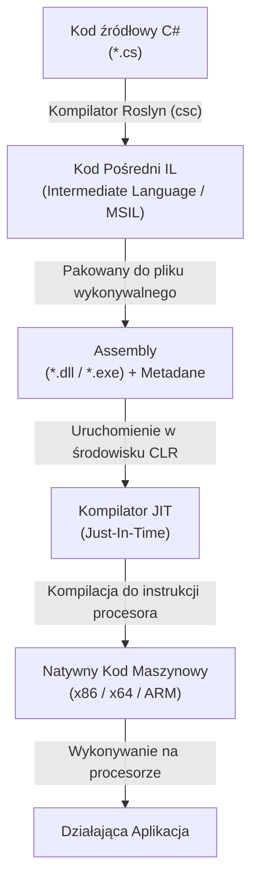
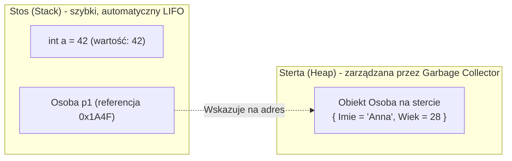
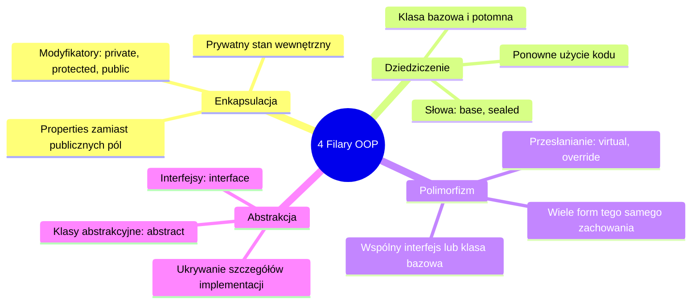

# Podstawy Programowania w C# i .NET

Język **C#** (wymawiany jako *C-Sharp*) to nowoczesny, bezpieczny pod względem typów (*type-safe*), zorientowany obiektowo język programowania wysokiego poziomu opracowany przez firmę Microsoft. Stanowi fundament ekosystemu **.NET**, umożliwiając tworzenie aplikacji webowych (ASP.NET Core), chmurowych (Azure/AWS), mobilnych (.NET MAUI), desktopowych (WPF, WinUI), gier (silnik Unity) oraz mikrousług.

---

## 1. Architektura .NET: Jak Działa C# Pod Spodem?

C# jest językiem kompilowanym do kodu pośredniego, który następnie uruchamiany jest w środowisku wykonawczym zwanym **CLR (Common Language Runtime)**.

### Cykl Kompilacji i Wykonania



1. **Kompilator Roslyn**: Tłumaczy kod źródłowy C# na kod pośredni **CIL / IL** (*Common Intermediate Language*) oraz generuje metadane opisujące typy i składowe.
2. **Assembly (.dll)**: Wynik kompilacji to biblioteka lub plik wykonywalny zawierający kod IL, niezależny od konkretnego procesora.
3. **CLR (Common Language Runtime)**: Wirtualna maszyna zarządzająca wykonaniem programu. Zapewnia:
   - **JIT Compilation**: Kompilację IL do instrukcji natywnych bezpośrednio przed wykonaniem.
   - **Garbage Collection (GC)**: Automatyczne zarządzanie pamięcią.
   - **Zarządzanie wątkami** i bezpieczeństwo typów.

---

## 2. Anatomia Programu i Nowoczesna Składnia

Od C# 9 wprowadzono tzw. **Top-Level Statements**, które eliminują boilerplate w prostych programach.

### Klasyczny styl (C# 1–8) vs Top-Level Statements (C# 9+)

```csharp
// Klasyczny styl (z widoczną klasą Program i metodą Main)
using System;

namespace MojaAplikacja
{
    internal class Program
    {
        static void Main(string[] args)
        {
            Console.WriteLine("Witaj w świecie C#!");
        }
    }
}
```

```csharp
// Nowoczesny styl (Top-Level Statements w .NET 6/7/8/9+)
// Kompilator automatycznie generuje klasę Program i metodę Main w tle!
Console.WriteLine("Witaj w świecie C#!");

if (args.Length > 0)
{
    Console.WriteLine($"Argument wejściowy: {args[0]}");
}
```

---

## 3. System Typów w C#

C# jest językiem **ściśle i statycznie typowanym** (*statically typed*). Każda zmienna i stała ma określony typ znany już na etapie kompilacji.

Wszystkie typy w C# dziedziczą bezpośrednio lub pośrednio po klasie bazowej `System.Object`.

### Value Types (Typy Wartościowe) vs Reference Types (Typy Referencyjne)

To jedno z najważniejszych zagadnień w .NET:

| Cecha | Value Types (Typy Wartościowe) | Reference Types (Typy Referencyjne) |
| :--- | :--- | :--- |
| **Główne przykłady** | `int`, `double`, `bool`, `char`, `struct`, `enum`, krotki | `string`, `class`, `record`, tablice, interfejsy, delegaty |
| **Gdzie przechowywane?** | Zwykle na **Stosie (Stack)** (lub wewnątrz obiektu na stercie) | Dane na **Stercie (Heap)**, wskaźnik/referencja na **Stosie** |
| **Kopiowanie zmiennej** | Kopiowana jest **cała wartość** | Kopiowany jest **wyłącznie wskaźnik** (referencja) |
| **Wartość domyślna** | Wartość zerowa (np. `0`, `false`, `0.0`) | `null` (brak odwołania do obiektu na stercie) |
| **Dziedziczenie** | Dziedziczą po `System.ValueType`, brak możliwości dziedziczenia po innych strukturach | Wspierają pełne dziedziczenie obiektowe |



### Podstawowe Typy Wbudowane

```csharp
// Liczby całkowite
byte b = 255;            // 8 bitów (0 do 255)
int wiek = 25;           // 32 bity (-2.14 mld do 2.14 mld) - standardowy wybór
long odleglosc = 9_000_000_000L; // 64 bity (zwróć uwagę na sufix L i separator _)

// Liczby zmiennoprzecinkowe
float piFloat = 3.14f;    // 32 bity (sufiks f), precyzja ~7 cyfr
double piDouble = 3.14159; // 64 bity, domyślny typ zmiennoprzecinkowy, precyzja ~15-17 cyfr
decimal cena = 199.99m;   // 128 bitów (sufiks m), b. wysoka precyzja (finanse/księgowość!)

// Logika i znaki
bool czyAktywny = true;   // true / false
char litera = 'A';        // pojedynczy znak w cudzysłowie pojedynczym
string tekst = "C# kurs"; // ciąg znaków (typ referencyjny!)
```

> [!IMPORTANT]
> **Zasada finansowa:** Do obliczeń pieniężnych (ceny, podatki, waluty) **nigdy nie używaj `double` ani `float`** z powodu błędów zaokrągleń binarnych IEEE 754. Zawsze stosuj typ `decimal`.

---

## 4. Niejawne Typowanie (`var`) i Stałe

Słowo kluczowe `var` wprowadza **niejawne typowanie statyczne** (*type inference*). Kompilator sam dedukuje typ na podstawie przypisanej wartości w momencie kompilacji.

```csharp
var liczba = 10;                // Kompilator wie, że to 'int'
var nazwisko = "Kowalski";      // Kompilator wie, że to 'string'
// liczba = "Inny tekst";       // BŁĄD KOMPILACJI! C# to nie JavaScript!

// Stałe (wartość musi być znana w czasie kompilacji)
const double PodatekVat = 0.23;
// PodatekVat = 0.25;           // BŁĄD KOMPILACJI
```

---

## 5. Konwersje Typów i Parsowanie

### Rzutowanie Niejawne i Jawne

```csharp
// Rzutowanie niejawne (implicit) - bezpieczne, bez utraty danych (mniejszy typ -> większy)
int malyTyp = 100;
long duzyTyp = malyTyp;

// Rzutowanie jawne (explicit / cast) - ryzyko utraty precyzji lub przepełnienia
double liczbaZmienna = 9.81;
int liczbaCalkowita = (int)liczbaZmienna; // Wynik: 9 (obcięcie części ułamkowej)
```

### Konwersje ze Stringa: `Parse` vs `TryParse`

W bezpiecznym kodzie produkcyjnym do konwersji ciągów znaków na liczby należy stosować metodę `TryParse`:

```csharp
string wejscie = "123";

// Ryzykowne: rzuca FormatException, jeśli tekst nie jest liczbą!
int wynik1 = int.Parse(wejscie);

// Rekomendowane: bezpieczne parsowanie z obsługą błędów
if (int.TryParse(wejscie, out int wynikLiczbowy))
{
    Console.WriteLine($"Pomyślnie sparsowano: {wynikLiczbowy}");
}
else
{
    Console.WriteLine("Niepoprawny format liczby!");
}
```

---

## 6. Obsługa Wartości Null i Nullable Types

W nowoczesnym C# włączona jest domyślnie funkcja **Nullable Reference Types** chroniąca przed niesławnym `NullReferenceException`.

```csharp
// Typy wartościowe nie mogą być null, chyba że dodamy znak '?'
int zwyklyInt = 0;
int? nullowalnyInt = null; // System.Nullable<int>

string? opcjonalnyNapis = null; // Może być nullem

// 1. Operator bezpiecznej nawigacji (Null-conditional operator: ?.)
int? dlugosc = opcjonalnyNapis?.Length;

// 2. Operator łączenia null (Null-coalescing operator: ??)
string bezpiecznyTekst = opcjonalnyNapis ?? "Wartość domyślna";

// 3. Operator przypisania przy null (??=)
opcjonalnyNapis ??= "Nowy napis";

// 4. Operator wytłumienia ostrzeżenia null (Null-forgiving operator: !)
// Używaj tylko wtedy, gdy masz 100% pewności, że wartość nie jest null
string wynikPewny = opcjonalnyNapis!;
```

---

## 7. Operatory i Formatowanie Tekstu

### Interpolacja Ciągów Znaków

```csharp
string imie = "Marta";
int punkty = 95;

// Interpolacja ciągów ($"...")
string komunikat = $"Użytkownik {imie} uzyskał wynik: {punkty}%";

// Ciąg dosłowny (Verbatim string: @"...") ignoruje sekwencje ucieczki np. backslash
string sciezka = @"C:\Projekty\MojaAplikacja\bin";

// Wieloliniowe Raw String Literals (C# 11+) zachowują wcięcia i formatowanie:
string json = """
{
    "name": "Jan",
    "role": "Developer"
}
""";
```

---

## 8. Instrukcje Sterujące

### Instrukcje Warunkowe i Nowoczesny Pattern Matching

```csharp
int temperatura = 22;

if (temperatura < 0)
{
    Console.WriteLine("Mróz!");
}
else if (temperatura is >= 0 and <= 25) // Składnia Pattern Matching
{
    Console.WriteLine("Umiarkowanie.");
}
else
{
    Console.WriteLine("Gorąco!");
}

// Wyrażenie trójargumentowe (Ternary Operator)
string status = temperatura > 18 ? "Ciepło" : "Chłodno";
```

### Klasyczny `switch` vs Wyrażenie `switch` (Switch Expression)

W nowoczesnym C# preferowane są wyrażenia `switch`:

```csharp
int numerDnia = 3;

// Nowoczesne wyrażenie switch (C# 8+)
string nazwaDnia = numerDnia switch
{
    1 => "Poniedziałek",
    2 => "Wtorek",
    3 => "Środa",
    4 => "Czwartek",
    5 => "Piątek",
    6 or 7 => "Weekend",
    _ => "Nieznany dzień" // Wzorzec odrzucenia (discard) - odpowiednik default
};
```

### Pętle w C#

```csharp
// 1. Pętla for (gdy znamy liczbę iteracji)
for (int i = 0; i < 5; i++)
{
    Console.WriteLine($"Indeks: {i}");
}

// 2. Pętla foreach (iteracja po kolekcjach implementujących IEnumerable)
string[] owoce = ["Jabłko", "Banan", "Pomarańcza"]; // C# 12 collection expression
foreach (var owoc in owoce)
{
    Console.WriteLine(owoc);
}

// 3. Pętla while (warunek sprawdzany przed wykonaniem)
int licznik = 0;
while (licznik < 3)
{
    licznik++;
}

// 4. Pętla do-while (wykonuje się co najmniej raz)
do
{
    Console.WriteLine("Wykona się przynajmniej raz!");
} while (false);
```

---

## 9. Kolekcje Danych (`System.Collections.Generic`)

Kolekcje generyczne zapewniają bezpieczeństwo typów i wysoką wydajność (brak kosztownego operowania na `object`, czyli brak *boxing/unboxing*).

### Porównanie Popularnych Kolekcji

| Kolekcja | Opis | Złożoność odczytu | Złożoność dodawania | Typowe zastosowanie |
| :--- | :--- | :--- | :--- | :--- |
| `T[]` (Tablica) | Stały rozmiar, elementy w ciągłym bloku pamięci | $O(1)$ wg indeksu | Brak zmiany rozmiaru | Znana z góry liczba elementów |
| `List<T>` | Dynamiczna tablica zmieniająca rozmiar | $O(1)$ wg indeksu | $O(1)$ amortyzowane na końcu | Uniwersalna lista elementów |
| `Dictionary<TKey, TValue>` | Tablica asocjacyjna oparta na Haszowaniu | $O(1)$ wg klucza | $O(1)$ średnio | Szybkie wyszukiwanie po unikalnym kluczu |
| `HashSet<T>` | Zbiór unikalnych wartości bez duplikatów | $O(1)$ sprawdzenie obecności | $O(1)$ średnio | Eliminacja duplikatów, szybkie `Contains` |
| `Queue<T>` / `Stack<T>` | Kolejka (FIFO) / Stos (LIFO) | $O(1)$ (Peek/Pop) | $O(1)$ (Enqueue/Push) | Przetwarzanie zadań, algorytmy |

### Przykłady Użycia Kolekcji

```csharp
// 1. List<T>
var liczby = new List<int> { 1, 2, 3 };
liczby.Add(4);
liczby.Remove(2);
Console.WriteLine($"Liczba elementów: {liczby.Count}");

// 2. Dictionary<TKey, TValue>
var kraje = new Dictionary<string, string>
{
    ["PL"] = "Polska",
    ["DE"] = "Niemcy",
    ["US"] = "Stany Zjednoczone"
};

if (kraje.TryGetValue("PL", out string? kraj))
{
    Console.WriteLine($"Znaleziono kraj: {kraj}");
}

// 3. HashSet<T>
var unikalneId = new HashSet<int> { 1, 2, 2, 3 }; // Duplikat '2' zostanie zignorowany
bool dodanoNowy = unikalneId.Add(4); // true
bool dodanoIstniejacy = unikalneId.Add(1); // false
```

---

## 10. Metody i Przekazywanie Parametrów

### Anatomia Metody

```csharp
// Modyfikator dostępu + Typ zwracany + Nazwa + (Parametry)
public int Dodaj(int a, int b)
{
    return a + b;
}

// Składnia Expression-Bodied Member (zwięzła wersja dla prostych metod)
public int Pomnoz(int a, int b) => a * b;

// Parametry opcjonalne i nazwane
public void WyslijWiadomosc(string odbiorca, string temat = "Brak tematu", bool pilne = false)
{
    Console.WriteLine($"Do: {odbiorca}, Temat: {temat}, Pilne: {pilne}");
}

// Wywołanie z parametrami nazwanymi:
WyslijWiadomosc("jan@example.com", pilne: true);
```

### Modyfikatory Parametrów: `val`, `ref`, `out`, `in`

- **Domyślnie (przez wartość)**: Kopiowana jest wartość zmiennej (lub referencja na obiekt). Zmiana wartości w metodzie nie wpływa na zmienną zewnętrzną.
- **`ref`**: Przekazanie referencji do istniejącej zmiennej. Metoda modyfikuje oryginalną zmienną. Zmienna musi być zainicjalizowana przed wywołaniem.
- **`out`**: Przekazanie zmiennej jako parametru wyjściowego. Metoda **musi** przypisać wartość przed zakończeniem.
- **`in`**: Przekazanie przez referencję tylko do odczytu (optymalizacja dla dużych struktur `struct`).

```csharp
public void PrzykladParametrow(ref int a, out int wynik, in decimal duzaStruktura)
{
    a += 10;
    wynik = a * 2; // Wymagane przypisanie przed wyjściem z metody!
    // duzaStruktura = 10m; // BŁĄD! 'in' jest tylko do odczytu!
}
```

---

## 11. Programowanie Zorientowane Obiektowo (OOP)

C# jest językiem w pełni obiektowym opartym na klasach, strukturach i interfejsach.

### Klasa, Pola i Właściwości (Properties)

```csharp
public class KontoBankowe
{
    // Pole prywatne (Backing field)
    private decimal _saldo;

    // Pełna właściwość z walidacją
    public decimal Saldo
    {
        get => _saldo;
        private set
        {
            if (value < 0)
                throw new ArgumentException("Saldo nie może być ujemne.");
            _saldo = value;
        }
    }

    // Właściwość automatyczna (Auto-property)
    public string NumerKonta { get; init; } // 'init' oznacza, że można ustawić tylko przy tworzeniu!

    // Konstruktor
    public KontoBankowe(string numerKonta, decimal saldoPoczatkowe)
    {
        NumerKonta = numerKonta;
        Saldo = saldoPoczatkowe;
    }

    // Metoda biznesowa
    public void Wplac(decimal kwota)
    {
        if (kwota <= 0) throw new ArgumentOutOfRangeException(nameof(kwota), "Kwota musi być dodatnia.");
        Saldo += kwota;
    }
}
```

### 4 Filary Programowania Obiektowego



#### Przykład Polimorfizmu i Abstrakcji:

```csharp
// Abstrakcja: Definiujemy kontrakt
public interface IPowystawcaPowiadomien
{
    void Wyslij(string odbiorca, string wiadomosc);
}

// Implementacja 1: Email
public class EmailService : IPowystawcaPowiadomien
{
    public void Wyslij(string odbiorca, string wiadomosc)
    {
        Console.WriteLine($"[EMAIL] Wysyłanie do {odbiorca}: {wiadomosc}");
    }
}

// Implementacja 2: SMS
public class SmsService : IPowystawcaPowiadomien
{
    public void Wyslij(string odbiorca, string wiadomosc)
    {
        Console.WriteLine($"[SMS] Wysyłanie do {odbiorca}: {wiadomosc}");
    }
}

// Polimorfizm w działaniu:
public class MenedzerZamowien
{
    private readonly IPowystawcaPowiadomien _powiadomienia;

    // Dependency Injection w pigułce!
    public MenedzerZamowien(IPowystawcaPowiadomien powiadomienia)
    {
        _powiadomienia = powiadomienia;
    }

    public void ZrealizujZamowienie(string klient)
    {
        // Kod nie zależy od tego, czy powiadomienie to SMS czy Email
        _powiadomienia.Wyslij(klient, "Twoje zamówienie zostało wysłane!");
    }
}
```

---

## 12. Rekordy (`record`) w C#

Wprowadzone w C# 9 **rekordy** reprezentują niemutowalne obiekty zorientowane na dane (*value-based equality*). Dwa różne obiekty typu `record` o identycznych właściwościach są sobie równe!

```csharp
// Jednoliniowa definicja z Primary Constructor
public record KlientDto(int Id, string Imie, string Email);

var k1 = new KlientDto(1, "Tomasz", "tomasz@test.pl");
var k2 = new KlientDto(1, "Tomasz", "tomasz@test.pl");

// W klasach 'k1 == k2' zwróciłoby FALSE (różne adresy na stercie)
// W rekordach porównywane są wartości pól:
Console.WriteLine(k1 == k2); // True!

// Niemutowalna modyfikacja za pomocą 'with' (Non-destructive mutation)
var k3 = k1 with { Email = "nowy@test.pl" };
```

---

## 13. Obsługa Błędów: Wyjątki (`try-catch-finally`)

Wyjątki reprezentują błędy występujące w trakcie działania programu.

```csharp
try
{
    string tekst = File.ReadAllText("nieistniejacy_plik.txt");
}
catch (FileNotFoundException ex)
{
    // Obsługa konkretnego błędu
    Console.WriteLine($"Nie odnaleziono pliku: {ex.FileName}");
}
catch (IOException ex) when (ex.Message.Contains("access")) // Filtr wyjątku (Exception Filter)
{
    Console.WriteLine("Błąd uprawnień do pliku!");
}
catch (Exception ex)
{
    // Przechwycenie wszystkich pozostałych wyjątków
    Console.WriteLine($"Wystąpił nieoczekiwany błąd: {ex.Message}");
    
    // WAŻNE: Ponowne rzucenie z zachowaniem całego śladu stosu (Stack Trace):
    throw; 
    // UWAGA: Nigdy nie pisz: 'throw ex;' - to resetuje Stack Trace do bieżącej linii!
}
finally
{
    // Blok wykonuje się ZAWSZE (niezależnie od tego, czy wystąpił błąd)
    Console.WriteLine("Czyszczenie zasobów.");
}
```

---

## 14. Zarządzanie Zasobami: `IDisposable` i `using`

Pamięć zarządzana (obiekty .NET) jest czyszczona automatycznie przez Garbage Collector. Jednak **zasoby niezarządzane** (uchwyty do plików, połączenia z bazą danych, gniazda sieciowe) muszą być zwalniane natychmiast po użyciu.

Służy do tego interfejs `IDisposable` oraz instrukcja `using`.

```csharp
// Nowoczesna deklaracja using (C# 8+)
// Metoda Dispose() zostanie wywołana automatycznie przy wyjściu ze scope'a metody
using var reader = new StreamReader("dane.txt");
string zawartosc = reader.ReadToEnd();
Console.WriteLine(zawartosc);
```

---

## 15. Podstawy LINQ (Language Integrated Query)

**LINQ** to zintegrowany mechanizm zapytań umożliwiający jednolite filtrowanie, sortowanie i transformowanie kolekcji w pamięci, baz danych (EF Core) czy plików XML.

> [!TIP]
> Większość operacji LINQ wykorzystuje **odroczone wykonanie** (*deferred execution*). Zapytanie nie przetwarza danych w momencie definicji, lecz dopiero wtedy, gdy po nim iterujemy (np. pętlą `foreach`, metodą `ToList()`, `Count()`).

```csharp
var pracownicy = new List<Pracownik>
{
    new("Jan", "IT", 8500),
    new("Anna", "HR", 6200),
    new("Piotr", "IT", 12000),
    new("Katarzyna", "Marketing", 7000),
    new("Michał", "IT", 9500)
};

// Składnia metodowa (Fluent Syntax) - najpopularniejsza w praktyce:
var najlepsiProgramisci = pracownicy
    .Where(p => p.Dzial == "IT" && p.Wynagrodzenie > 8000) // Filtrowanie
    .OrderByDescending(p => p.Wynagrodzenie)              // Sortowanie malejąco
    .Select(p => new { p.Imie, p.Wynagrodzenie })         // Projekcja do typu anonimowego
    .ToList();                                            // Natychmiastowe wykonanie!

// Przydatne metody agregujące i wyszukujące:
bool czyKtosZarabiaPowyzej10k = pracownicy.Any(p => p.Wynagrodzenie > 10000);
int liczbaPracownikowIT = pracownicy.Count(p => p.Dzial == "IT");
decimal sredniaPlaca = pracownicy.Average(p => p.Wynagrodzenie);

// Pobranie pierwszego elementu lub null, jeśli brak
var pierwszyZMarketingu = pracownicy.FirstOrDefault(p => p.Dzial == "Marketing");
```

---

## 16. Pytania Rekrutacyjne z Podstaw C# (FAQ Interview)

### Q1: Czym różni się typ wartościowy (Value Type) od referencyjnego (Reference Type)?
> **Odpowiedź:**  
> Typy wartościowe (`int`, `bool`, `struct`) przechowują bezpośrednio swoje dane, zazwyczaj na stosie (*stack*), a ich przypisanie kopiuje całą wartość. Typy referencyjne (`class`, `string`, obiekty) przechowują dane na stercie (*heap*), a zmienna na stosie zawiera jedynie wskaźnik (referencję) do tego miejsca w pamięci. Przypisanie typu referencyjnego kopiuje wyłącznie referencję, więc obie zmienne wskazują na ten sam obiekt.

---

### Q2: Co to jest Boxing i Unboxing w C#?
> **Odpowiedź:**  
> **Boxing** to niejawna konwersja typu wartościowego (`Value Type`) do typu `object` (lub interfejsu), co wiąże się z alokacją nowego obiektu na stercie i skopiowaniem wartości.  
> **Unboxing** to jawna konwersja obiektu z powrotem do typu wartościowego.  
> *Uwaga:* Operacje te generują narzut wydajnościowy i obciążają Garbage Collector, dlatego należy unikać niepotrzebnego boxingu, stosując kolekcje generyczne (`List<int>` zamiast dawnego `ArrayList`).

---

### Q3: Jaka jest różnica między `throw` a `throw ex` w bloku `catch`?
> **Odpowiedź:**  
> Użycie `throw;` zachowuje oryginalny ślad stosu wywołań (*Stack Trace*), dzięki czemu logi precyzyjnie wskazują linię, w której pierwotnie doszło do błędu. Z kolei `throw ex;` nadpisuje *Stack Trace*, sprawiając, że błąd wygląda tak, jakby powstał dopiero w linii wykonania instrukcji `catch`. W 99% przypadków należy stosować `throw;`.

---

### Q4: Czym różni się `string` od `StringBuilder`?
> **Odpowiedź:**  
> `string` w C# jest **niemutowalny** (*immutable*). Każda modyfikacja (np. konkatenacja w pętli `tekst += "a"`) alokuje nowy obiekt w pamięci i kopiuje zawartość, co prowadzi do fragmentacji sterty i spadku wydajności ($O(n^2)$).  
> `StringBuilder` (z przestrzeni `System.Text`) reprezentuje bufor modyfikowalny (*mutable*), który dynamicznie powiększa pamięć podręczną bez ciągłych alokacji nowych obiektów, osiągając złożoność $O(n)$ przy wielu modyfikacjach.

---

### Q5: Czym różni się `IEnumerable<T>` od `IQueryable<T>`?
> **Odpowiedź:**  
> `IEnumerable<T>` służy do operowania na kolekcjach w pamięci RAM aplikacji (*LINQ to Objects*). Filtrowanie (`Where`) odbywa się po stronie aplikacji.  
> `IQueryable<T>` rozszerza `IEnumerable` i operuje na drzewach wyrażeń (*Expression Trees*). Jest używany przez ORM-y (np. Entity Framework Core), gdzie zapytanie jest tłumaczone na natywny kod SQL i wykonywane po stronie serwera bazy danych. Do aplikacji trafiają wyłącznie przefiltrowane rekordy.

---

### Q6: Do czego służy interfejs `IDisposable` i słowo kluczowe `using`?
> **Odpowiedź:**  
> `IDisposable` definiuje metodę `Dispose()` przeznaczoną do natychmiastowego, deterministycznego zwalniania zasobów niezarządzanych (uchwyty plików, strumienie, połączenia sieciowe/bazodanowe) bez oczekiwania na uruchomienie Garbage Collectora. Słowo kluczowe `using` to lukier składniowy (*syntactic sugar*) generujący blok `try-finally`, który gwarantuje wywołanie metody `Dispose()` nawet w przypadku wystąpienia nieobsłużonego wyjątku.

---

## 17. Podsumowanie i Ścieżka Dalszej Nauki

Opanowanie podstaw C# otwiera drogę do zaawansowanych tematów inżynierii oprogramowania w ekosystemie .NET:

1. **Programowanie asynchroniczne**: `Task`, `ValueTask`, `async` / `await` oraz obsługa `CancellationToken`.
2. **Architektura i Wzorce**: Zasady SOLID, Dependency Injection (wbudowany kontener IoC w ASP.NET Core), wzorce GoF.
3. **Dostęp do danych**: Entity Framework Core, Dapper, mapowanie relacyjno-obiektowe i migracje.
4. **Testowanie jednostkowe**: xUnit / NUnit, FluentAssertions, biblioteki atrap (Moq, NSubstitute).
5. **Budowa API**: RESTful API w ASP.NET Core, Minimal APIs, autoryzacja JWT oraz middleware.
