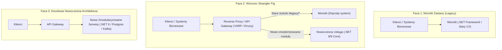
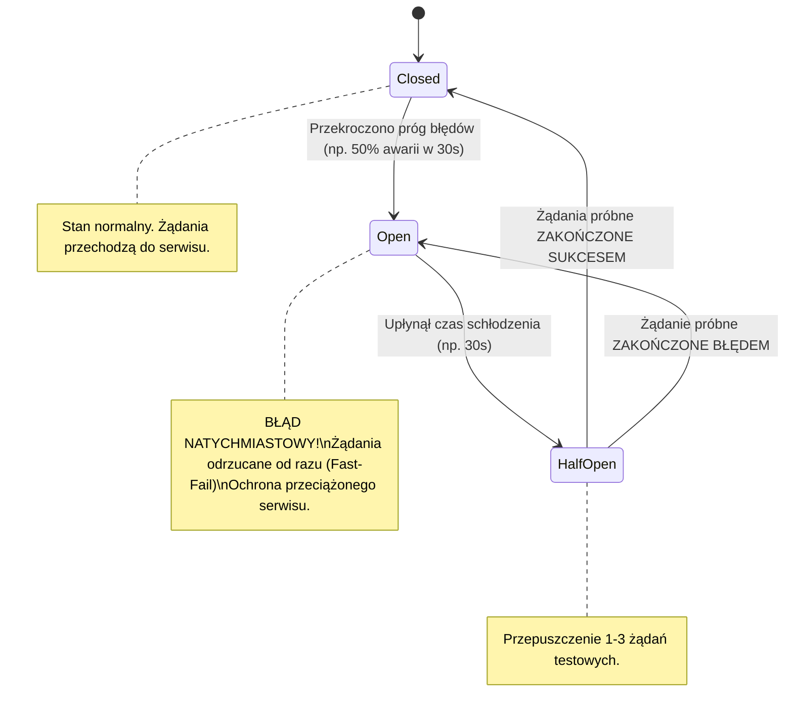
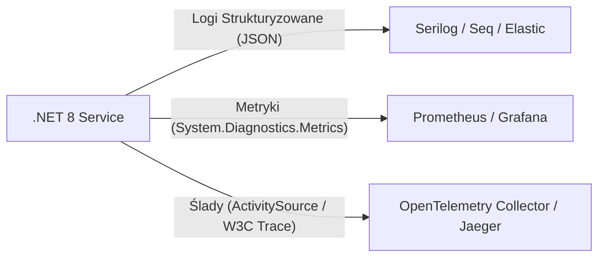

# Utrzymanie Dojrzałych Systemów, Wzorce Odporności (Resilience) i Architektura Produkcyjna w .NET

W systemach o statusie **infrastruktury krytycznej** i dojrzałych aplikacjach korporacyjnych (działających produkcyjnie przez lata) kluczową rolą Senior Developera nie jest pisanie nowego kodu od zera na "zielonej trawie" (*greenfield*), lecz **bezpieczna ewolucja istniejącego ekosystemu, eliminacja długu technicznego oraz zagwarantowanie najwyższej niezawodności i dostępności (High Availability & Fault Tolerance 24/7/365)**.

Niniejszy przewodnik omawia wzorce architektoniczne niezbędne do modernizacji systemów zastanych (*legacy*), implementację zaawansowanych wzorców odporności za pomocą **Polly v8 / `Microsoft.Extensions.Resilience`**, projektowanie bezawaryjnych usług tła (`BackgroundService`) oraz strategię obserwowalności i diagnostyki awarii produkcyjnych.

---

## Spis Treści
1. [Modernizacja Systemów Zastanych (Mature & Legacy Systems)](#1-modernizacja-systemów-zastanych-mature--legacy-systems)
   - Wzorzec Strangler Fig (Oplatania) w praktyce architektonicznej
   - Wzorzec Branch by Abstraction i Feature Flags
   - Zachowanie kompatybilności wstecznej (Backward Compatibility i API Versioning)
2. [Wzorce Odporności (Resilience & Fault Tolerance) w .NET 8 / 9](#2-wzorce-odporności-resilience--fault-tolerance-w-net-8--9)
   - Architektura potoków `ResiliencePipeline` (Polly v8 i `Microsoft.Extensions.Resilience`)
   - **Retry z Exponential Backoff i Jitter** (Eliminacja zjawiska Thundering Herd)
   - **Circuit Breaker** (Stany: Closed, Open, Half-Open)
   - **Rate Limiting** i **Bulkhead Isolation** (Ochrona przed wyczerpaniem zasobów)
   - Wzorzec Fallback i degradacja kontrolowana (Graceful Degradation)
3. [Długo Działające Usługi w Tle (Background Workers & Daemons)](#3-długo-działające-usługi-w-tle-background-workers--daemons)
   - Anatomia `BackgroundService` i `IHostedService`
   - Bezpieczne asynchroniczne kolejkowanie: `System.Threading.Channels` zamiast `BlockingCollection`
   - **Graceful Shutdown**: Obsługa sygnałów OS (SIGTERM), `IHostApplicationLifetime` i bezpieczne domykanie jednostek pracy
4. [Obserwowalność Produkcyjna (Production Observability)](#4-obserwowalność-produkcyjna-production-observability)
   - Triada obserwowalności: Logi, Metryki, Ślady (Logs, Metrics, Traces)
   - Semantyczne i strukturyzowane logowanie z Serilog
   - Standard OpenTelemetry i W3C TraceContext w architekturze .NET
   - Health Checks: Sondy Liveness vs Readiness w środowiskach skonteneryzowanych
5. [Pytania Rekrutacyjne z Odpowiedziami (Senior .NET FAQ)](#5-pytania-rekrutacyjne-z-odpowiedziami-senior-net-faq)
   - Pytania z zakresu architektury produkcji i resilience
   - Scenariusze Awaryjne i Live-fire Troubleshooting (Cascading Failure, Socket Exhaustion)
6. [Tablica Szybkiej Powtórki (Cheat-Sheet)](#6-tablica-szybkiej-powtórki-cheat-sheet)

---

## 1. Modernizacja Systemów Zastanych (Mature & Legacy Systems)

Przepisywanie dojrzałego systemu od nowa (*Big Bang Rewrite*) jest jednym z najczęstszych powodów spektakularnych porażek projektów informatycznych. Senior Developer stosuje podejście inkrementalne.



### Wzorzec Strangler Fig (Oplatania)
Wzorzec ten polega na stopniowym "duszeniu" monolitu poprzez wycinanie kolejnych domen biznesowych i przekierowywanie ruchu na poziomie bramy API (np. przy użyciu **YARP — Yet Another Reverse Proxy** od Microsoftu):
1. Wprowadzenie bramy proxy przed starym monolitem.
2. Zaimplementowanie nowej funkcjonalności (lub wydzielenie istniejącej) w nowej usłudze w oparciu o czysty kod (.NET 8/9).
3. Skierowanie ruchu dla danego endpointu do nowego serwisu.
4. Stopniowe wygaszanie starego kodu aż do całkowitej eliminacji monolitu.

### Wzorzec Branch by Abstraction
Gdy modernizacja dotyczy wnętrza jednej bazy kodu (np. wymiana starej biblioteki dostępu do bazy `ADO.NET` na `EF Core` lub `Dapper`):
1. **Abstrakcja:** Tworzymy interfejs (np. `IOrderRepository`) reprezentujący operacje.
2. **Kierowanie:** Stary kod implementuje ten interfejs, a aplikacja korzysta wyłącznie z abstrakcji.
3. **Nowa implementacja:** Tworzymy nową implementację (np. `DapperOrderRepository`).
4. **Przełączenie:** Używamy **Feature Flag** (np. `Microsoft.FeatureManagement`), aby dynamicznie przełączać implementację na produkcji dla 5% użytkowników (Canary Release).
5. **Czyszczenie:** Po weryfikacji stabilności usuwamy stary kod i flagę.

---

## 2. Wzorce Odporności (Resilience & Fault Tolerance) w .NET 8 / 9

W systemach rozproszonych awarie sieciowe, chwilowe przeciążenia baz danych czy spadki wydajności zewnętrznych usług są nieuniknione. System musi być na nie uodporniony.

W .NET 8 Microsoft zunifikował ekosystem odporności, integrując bibliotekę **Polly v8** z frameworkiem za pośrednictwem pakietu `Microsoft.Extensions.Resilience`.



### Konfiguracja Potoku Resilience Pipeline w .NET

Nowa architektura Polly v8 opiera się na wydajnych, bezalokacyjnych potokach `ResiliencePipeline`:

```csharp
var builder = WebApplication.CreateBuilder(args);

builder.Services.AddResiliencePipeline("database-resilience", pipelineBuilder =>
{
    // 1. Timeout: Żadne zapytanie nie może trwać dłużej niż 3 sekundy
    pipelineBuilder.AddTimeout(TimeSpan.FromSeconds(3));

    // 2. Retry ze zjawiskiem Jitter
    pipelineBuilder.AddRetry(new RetryStrategyOptions
    {
        MaxRetryAttempts = 3,
        BackoffType = DelayBackoffType.Exponential,
        UseJitter = true, // Kluczowe dla uniknięcia Thundering Herd!
        Delay = TimeSpan.FromMilliseconds(200),
        ShouldHandle = new PredicateBuilder().Handle<SqlException>().Handle<TimeoutException>()
    });

    // 3. Circuit Breaker
    pipelineBuilder.AddCircuitBreaker(new CircuitBreakerStrategyOptions
    {
        FailureRatio = 0.5, // Otwórz obwód, jeśli 50% żądań w oknie czasowym zawiedzie
        SamplingDuration = TimeSpan.FromSeconds(30),
        MinimumThroughput = 10,
        BreakDuration = TimeSpan.FromSeconds(30)
    });
});
```

### Dlaczego "Jitter" w strategii Retry jest krytyczny?
Jeśli zewnętrzny serwis padnie na 5 sekund, a 1000 instancji klientów ponawia próbę w sztywnych odstępach czasu (np. dokładnie co 1.0s, 2.0s, 4.0s), to w 1. sekundzie wszystkie 1000 klientów uderzy w serwis **jednocześnie w tym samym ułamku milisekundy**. Zjawisko to nazywa się **Thundering Herd (Efekt Tratowania)**.
Włączenie **Jitter** dodaje losowe przesunięcie czasu (np. 1.12s, 0.89s, 1.45s), rozpraszając falę zapytań w czasie i pozwalając przeciążonemu systemowi na bezpieczne podniesienie się.

---

## 3. Długo Działające Usługi w Tle (Background Workers & Daemons)

W systemach infrastruktury krytycznej operacje asynchroniczne (np. przetwarzanie telemetrii z czujników przemysłowych, replikacja audytowa, synchronizacja stanów) są często realizowane przez usługi typu daemon działające 24/7/365.

### `System.Threading.Channels` — Skrajnie Wydajna Kolejka w Pamięci
Tradycyjna kolekcja `BlockingCollection<T>` opiera się na ciężkich, synchronicznych blokadach jądra (`Monitor`, `WaitHandle`).
W nowoczesnym .NET standardem jest **`System.Threading.Channels`**:
- W pełni asynchroniczny model zapisu (`WriteAsync`) i odczytu (`ReadAsync`).
- Wsparcie dla kolejki ograniczonej (*Bounded Channel*) z polityką przeciwdziałania zatorom (*Backpressure*).
- Zero alokacji i znakomita wydajność w modelu Producer-Consumer.

```csharp
public class TelemetryQueue
{
    private readonly Channel<TelemetryPoint> _channel;

    public TelemetryQueue(int capacity = 10000)
    {
        var options = new BoundedChannelOptions(capacity)
        {
            FullMode = BoundedChannelFullMode.Wait, // Zastosowanie Backpressure (producent czeka)
            SingleWriter = false,
            SingleReader = true // Jeden worker w tle odczytuje dane
        };
        _channel = Channel.CreateBounded<TelemetryPoint>(options);
    }

    public ValueTask EnqueueAsync(TelemetryPoint point, CancellationToken ct) => 
        _channel.Writer.WriteAsync(point, ct);

    public IAsyncEnumerable<TelemetryPoint> ReadAllAsync(CancellationToken ct) => 
        _channel.Reader.ReadAllAsync(ct);
}
```

### Wzorzec Graceful Shutdown (Bezpieczne Wyłączanie)
Gdy orkiestrator (np. Kubernetes, systemd) wysyła sygnał `SIGTERM`, aplikacja nie może natychmiast ubić procesu, gdyż doprowadziłoby to do uszkodzenia przetwarzanych transakcji.

```csharp
public class TelemetryWorker(
    TelemetryQueue queue,
    IServiceScopeFactory scopeFactory,
    ILogger<TelemetryWorker> logger) : BackgroundService
{
    protected override async Task ExecuteAsync(CancellationToken stoppingToken)
    {
        logger.LogInformation("TelemetryWorker został uruchomiony.");

        try
        {
            // Czytamy strumień dopóki stoppingToken nie zgłosi żądania zatrzymania
            await foreach (var item in queue.ReadAllAsync(stoppingToken))
            {
                using var scope = scopeFactory.CreateScope();
                var repository = scope.ServiceProvider.GetRequiredService<ITelemetryRepository>();
                
                // Zapisujemy dane przekazując CancellationToken.None lub krótki timeout, 
                // aby dokończyć bieżącą jednostkę pracy przed zgaszeniem procesu!
                await repository.SaveAsync(item, CancellationToken.None);
            }
        }
        catch (OperationCanceledException)
        {
            logger.LogInformation("TelemetryWorker otrzymał sygnał Graceful Shutdown. Bezpieczne zamykanie.");
        }
        finally
        {
            logger.LogInformation("Zwolniono zasoby workera.");
        }
    }
}
```

---

## 4. Obserwowalność Produkcyjna (Production Observability)

W środowiskach regulowanych brak obserwowalności uniemożliwia spełnienie rygorystycznych umów SLA oraz wymogów audytowych.



### Semantyczne Logowanie (Structured Logging)
Tradycyjna konkatenacja stringów uniemożliwia indeksowanie i przeszukiwanie logów w systemach typu ELK / Grafana Loki:

```csharp
// ❌ ZŁE PODEJŚCIE: Utrata struktury danych, marnowanie CPU na formatowanie stringa
logger.LogInformation("Użytkownik " + userId + " złożył zamówienie " + orderId + " na kwotę " + amount);

// ✅ PRAWIDŁOWE PODEJŚCIE: Logowanie semantyczne z szablonem wiadomości
logger.LogInformation("Użytkownik {UserId} złożył zamówienie {OrderId} na kwotę {OrderAmount:C}", 
    userId, orderId, amount);
```

### Health Checks: Liveness vs Readiness
Orkiestratory kontenerów wymagają rozróżnienia dwóch pytań:
1. **Liveness Probe (`/health/live`):** *"Czy proces aplikacji żyje i nie wpadł w nieskończoną pętlę / zakleszczenie?"* Jeśli nie odpowiada, orkiestrator **restartuje kontener**.
2. **Readiness Probe (`/health/ready`):** *"Czy aplikacja ma aktywne połączenie z bazą SQL i kolejką oraz jest gotowa przyjmować ruch użytkowników?"* Jeśli nie, kontener **nie jest restartowany**, a jedynie tymczasowo odpinany od load balancera.

```csharp
builder.Services.AddHealthChecks()
    .AddCheck("self", () => HealthCheckResult.Healthy(), tags: ["live"])
    .AddNpgSql(builder.Configuration.GetConnectionString("Postgres")!, tags: ["ready"])
    .AddSqlServer(builder.Configuration.GetConnectionString("MsSql")!, tags: ["ready"]);

app.MapHealthChecks("/health/live", new HealthCheckOptions
{
    Predicate = check => check.Tags.Contains("live")
});

app.MapHealthChecks("/health/ready", new HealthCheckOptions
{
    Predicate = check => check.Tags.Contains("ready")
});
```

---

## 5. Pytania Rekrutacyjne z Odpowiedziami (Senior .NET FAQ)

### Pytanie 1: W jaki sposób podejdziesz do refaktoryzacji przestarzałego monolitu .NET Framework, w którym brakuje testów jednostkowych, a biznes żąda ciągłego wdrażania nowych funkcjonalności?
**Odpowiedź:**
1. **Reguła bezpieczeństwa zero regression:** Bezwzględny zakaz przepisywania całego systemu od zera.
2. **Budowa siatki bezpieczeństwa (Testy End-to-End / Charakterystyki):** Zanim dotknę kodu, tworzę testy czarnoskrzynkowe (np. API integration tests lub Playwright), które rejestrują wejścia i wyjścia obecnego systemu (tzw. *Approval Tests* / *Characterization Tests*).
3. **Wprowadzenie wzorca Strangler Fig:** Wdrożenie Reverse Proxy (np. YARP) przed starym monolitem. Nowe funkcjonalności są tworzone w nowym serwisie .NET 8/9, a proxy kieruje ruch do starego lub nowego systemu.
4. **Branch by Abstraction:** Wewnątrz monolitu wydzielam interfejsy wokół kluczowych modułów. Umożliwia to stopniową podmianę implementacji z wykorzystaniem Feature Flags.
5. **Telemetria porównawcza:** W fazie wdrożenia stosuję technikę *Dark Launching* lub *Shadow Traffic* (nowy serwis otrzymuje kopię żądania i weryfikuje poprawność wyników bez wpływu na klienta końcowego).

---

### Pytanie 2: Czym różni się Circuit Breaker od mechanizmu Retry i dlaczego stosowanie samego Retry bez Circuit Breakera może zniszczyć infrastrukturę?
**Odpowiedź:**
- **Retry** służy do niwelowania błędów przejściowych (*transient faults*), np. utraty pojedynczego pakietu TCP. Zakłada, że kolejna próba za ułamek sekundy ma szansę na sukces.
- **Circuit Breaker** służy do reagowania na długotrwałe awarie. Gdy awaria nie jest przejściowa, a zewnętrzny serwis jest martwy lub skrajnie przeciążony, stosowanie samego Retry powoduje, że setki klientów powtarzają zapytania, generując lawinę żądań (*Retry Storm*), co dobija leżący serwis i uniemożliwia mu restart. Circuit Breaker odcina ruch (stan `Open`) i zwraca błąd natychmiast (*Fast-Fail*), dając usłudze czas na regenerację.

---

### Pytanie 3: Jakie ryzyko wiąże się z tworzeniem instancji `HttpClient` za pomocą `new HttpClient()` w pętli lub przy każdym zapytaniu i jak rozwiązuje to `IHttpClientFactory`?
**Odpowiedź:**
Mimo że `HttpClient` implementuje `IDisposable`, jego zniszczenie nie zwalnia natychmiast fizycznego gniazda sieciowego TCP (gniazdo przechodzi w stan `TIME_WAIT` systemu operacyjnego trwający zwykle 120 sekund). Tworzenie wielu instancji prowadzi do **wyczerpania portów (Socket Exhaustion)** i błędu `SocketException: Only one usage of each socket address is normally permitted`.

Z kolei zrobienie z `HttpClient` zwykłego Singletona powoduje inny błąd: klient nie odświeża zmian w rekordach DNS (np. w przypadku przełączenia chmurowego load balancera na nowy adres IP).

**Rozwiązanie w `IHttpClientFactory`:**
Fabryka zarządza pulą obiektów **`HttpMessageHandler`**. Handlery te są współdzielone i utrzymywane w puli z domyślnym czasem życia wynoszącym 2 minuty. Po 2 minutach handler jest wycofywany (co pozwala na aktualizację DNS), ale gniazda są reużywane, co całkowicie zapobiega Socket Exhaustion.

---

### Pytanie 4: Dlaczego w długo działających procesach produkcyjnych (`BackgroundService`) zaleca się stosowanie `System.Threading.Channels` zamiast klasycznych kolekcji współbieżnych lub `BlockingCollection`?
**Odpowiedź:**
1. **Asynchroniczność:** `Channels` oferuje w pełni asynchroniczne metody `WriteAsync` i `ReadAsync`, które zwalniają wątki robocze .NET ThreadPool w momencie oczekiwania na dane lub zwolnienie miejsca w buforze. `BlockingCollection` blokuje fizyczny wątek w stanie `WaitSleepJoin`, co przy wielu kolejkach marnuje wątki z puli.
2. **Natywne wsparcie dla Backpressure:** Przy użyciu `BoundedChannel` możemy określić maksymalną pojemność i strategię, gdy producent wyprzedza konsumenta (`BoundedChannelFullMode.Wait`). Zapobiega to niekontrolowanemu puchnięciu kolejki i wyciekom pamięci RAM.
3. **Integracja z `IAsyncEnumerable`:** Umożliwia eleganckie przetwarzanie pętlą `await foreach (var item in channel.Reader.ReadAllAsync(ct))` z pełnym wsparciem dla kooperatywnego anulowania.

---

### Pytanie 5 (Scenariusz Awaryjny Live-Fire): Na środowisku produkcyjnym 24/7 po wdrożeniu nowej wersji podów na Kubernetesie zauważono, że podczas każdego rolling update gubione są pojedyncze zamówienia klientów (klienci otrzymują błędy połączenia, a transakcje w bazie są urwane). Jak to zdiagnozujesz i naprawisz?
**Diagnoza:**
Problem wynika z braku poprawnej implementacji **Graceful Shutdown** w aplikacji oraz braku synchronizacji między Kubernetesem a serwerem Kestrel:
1. Kubernetes wysyła sygnał `SIGTERM` do poda i jednocześnie usuwa endpoint z serwisu (kube-proxy / Ingress).
2. Propagacja usunięcia endpointu w regułach iptables/IPVS może trwać kilkaset milisekund lub kilka sekund. W tym czasie Ingress wciąż wysyła nowe żądania do poda.
3. Jeśli aplikacja natychmiast ubija kontener po odebraniu `SIGTERM`, aktywne żądania zostają brutalnie przerwane, a w trakcie trwających transakcji następuje zerwanie połączeń TCP (`RST`).

**Rozwiązanie:**
1. W konfiguracji Deploymentu K8s dodanie `preStop hook` z krótkim uśpieniem (np. `sleep 5`), aby kube-proxy zdążyło przepiąć ruch:
   ```yaml
   lifecycle:
     preStop:
       exec:
         command: ["/bin/sh", "-c", "sleep 5"]
   ```
2. Skonfigurowanie w Kestrel/Host czasu na bezpieczne dokończenie aktywnych zapytań:
   ```csharp
   builder.Services.Configure<HostOptions>(options =>
   {
       options.ShutdownTimeout = TimeSpan.FromSeconds(30);
   });
   ```
3. W procesach tła (`BackgroundService`) prawidłowe obsłużenie tokena anulowania, pozwalające na dokończenie rozpoczętych jednostek transakcyjnych przed wyjściem z pętli.

---

## 6. Tablica Szybkiej Powtórki (Cheat-Sheet)

| Koncepcja | Zastosowanie w Architekturze | Kluczowe Narzędzie w .NET | Najczęstszy Błąd |
| :--- | :--- | :--- | :--- |
| **Strangler Fig** | Stopniowe wygaszanie monolitu legacy | Reverse Proxy (YARP, Nginx) | Próba przepisania całości od zera (Big Bang) |
| **Branch by Abstraction**| Wymiana biblioteki/podsystemu w monolicie | Interfejsy + Feature Flags | Modyfikacja kodu produkcyjnego bez flagi |
| **Circuit Breaker** | Ochrona przed kaskadową awarią serwisów | Polly v8 (`AddCircuitBreaker`) | Zbyt krótki czas schłodzenia (BreakDuration) |
| **Retry + Jitter** | Odporność na chwilowe błędy sieciowe | Polly v8 (`UseJitter = true`) | Sztywne czasy ponowień (Thundering Herd) |
| **Backpressure** | Ochrona przed przepełnieniem pamięci przez producenta | `Channel.CreateBounded<T>` | Nielimitowana kolejka w pamięci RAM |
| **Graceful Shutdown**| Zabezpieczenie przed ucinaniem transakcji | `IHostApplicationLifetime` | Ignorowanie `stoppingToken` w workerach |
| **Readiness Probe** | Ochrona przed kierowaniem ruchu na niegotowy pod | ASP.NET Core Health Checks | Utożsamianie Liveness z Readiness |
