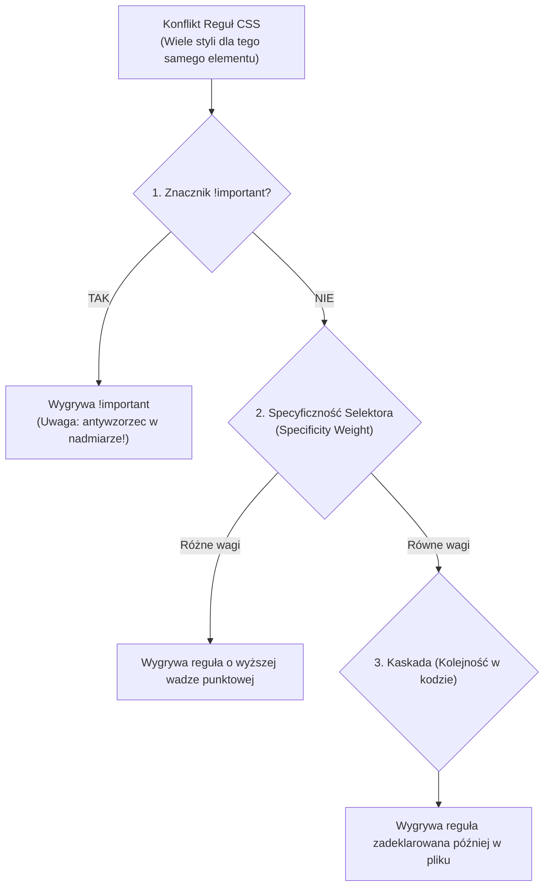
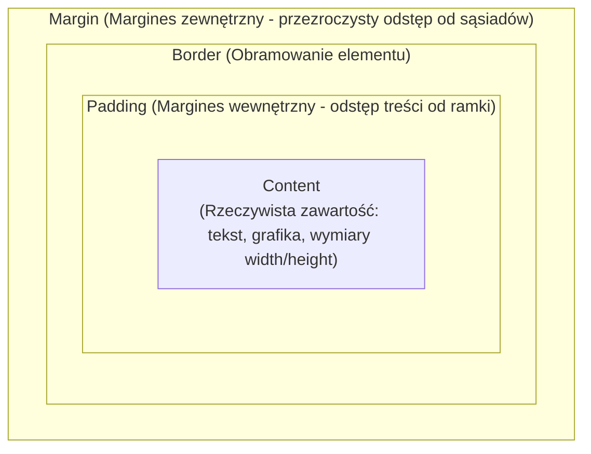

# CSS3: Kaskadowość, Model Pudełkowy i Nowoczesne Układy

**CSS (Cascading Style Sheets)** to język deklaratywny służący do definiowania prezentacji wizualnej dokumentów HTML. Kontroluje kolory, typografię, odstępy, układ elementów (*layout*), responsywność oraz animacje.

---

## 1. Trzy Filary CSS: Kaskada, Specyficzność i Dziedziczenie

Zrozumienie, dlaczego jedna reguła CSS wygrywa z inną, to najważniejsza umiejętność w pracy z arkuszami stylów:



### Wagi Specyficzności Selektorów (System Punktacji):

Specyficzność oblicza się w czterech kategoriach `(A, B, C, D)`:

| Poziom | Typ selektora | Punkty | Przykłady |
| :--- | :--- | :---: | :--- |
| **A** | Style liniowe (*Inline Styles*) | `1-0-0-0` | `<div style="color: red;">` |
| **B** | Selektory ID | `0-1-0-0` | `#header`, `#main-nav` |
| **C** | Klasy, atrybuty, pseudo-klasy | `0-0-1-0` | `.btn`, `[type="text"]`, `:hover`, `:nth-child(2)` |
| **D** | Elementy, pseudo-elementy | `0-0-0-1` | `div`, `p`, `h1`, `::before`, `::after` |

> [!NOTE]
> Selektor uniwersalny `*`, kombinatory (`+`, `>`, `~`) oraz pseudo-klasa `:where()` mają wagę `0-0-0-0`.  
> Nawet 100 klas (`.c1.c2...`) **nie przebije** jednego selektora ID (`#header`)!

---

## 2. Model Pudełkowy (Box Model)

Każdy element wyświetlany w przeglądarce to prostokątne pudełko składające się z czterech warstw:



### Problem `content-box` vs Zbawienie `border-box`

Domyślnie w przeglądarkach obowiązuje `box-sizing: content-box`. Oznacza to, że dodanie `padding` lub `border` **zwiększa całkowity fizyczny rozmiar elementu na ekranie**!

```css
/* Tradycyjny problem (content-box): */
.box {
  width: 200px;
  padding: 20px;
  border: 5px solid black;
  /* Całkowita szerokość na ekranie = 200 + 20*2 + 5*2 = 250px! */
}

/* Nowoczesny standard w każdym projekcie: */
*, *::before, *::after {
  box-sizing: border-box;
}

/* Przy border-box: szerokość ZAWSZE wynosi dokładnie 200px!
   Padding i border chowają się do wnętrza zadeklarowanego wymiaru. */
```

---

## 3. Jednostki w CSS: Kiedy `px`, a kiedy `rem` i `em`?

| Jednostka | Typ | Do czego się odnosi? | Rekomendowane zastosowanie |
| :--- | :--- | :--- | :--- |
| **`px`** | Bezwzględna | Stały piksel ekranu | Cienkie ramki (`1px solid`), cienie (`box-shadow`), stałe detale |
| **`rem`** | Względna | Rozmiar czcionki elementu głównego (`html` font-size, domyślnie `16px`) | **Rozmiary czcionek, marginesy, paddingi, layout** (respektuje preferencje powiększenia czcionki w systemie użytkownika!) |
| **`em`** | Względna | Rozmiar czcionki **bieżącego elementu** (dziedziczy kaskadowo) | Ikony skalujące się wraz z tekstem przycisku, odstępy lokalne |
| **`vw` / `vh`** | Względna | 1% szerokości / wysokości całego okna (*viewport*) | Pełnoekranowe sekcje hero (`min-height: 100vh`) |
| **`dvh` / `svh`** | Względna | Dynamic / Small viewport height (nowość dla mobile) | Rozwiązuje problem znikającego paska adresu na telefonach (iOS Safari / Chrome) |
| **`%`** | Względna | Procent wymiaru **elementu nadrzędnego (rodzica)** | Szerokości kolumn (`width: 50%`) |

---

## 4. Pozycjonowanie Elementów (`position`)

Właściwość `position` określa, w jaki sposób element jest pozycjonowany w normalnym przepływie dokumentu:

1. **`static` (domyślne):** Element znajduje się w naturalnym przepływie. Właściwości `top`, `right`, `bottom`, `left` oraz `z-index` nie działają.
2. **`relative`:** Element przesuwa się względem swojego **pierwotnego położenia**. Miejsce po nim w przepływie pozostaje zarezerwowane. Staje się **punktem odniesienia** dla dzieci o `position: absolute`.
3. **`absolute`:** Element zostaje całkowicie **wyjęty z normalnego przepływu dokumentu**. Pozycjonuje się względem najbliższego przodka z pozycjonowaniem innym niż `static`.
4. **`fixed`:** Element wyjęty z przepływu, pozycjonuje się względem **okna przeglądarki (viewport)**. Pozostaje w tym samym miejscu podczas przewijania (np. stały pasek nawigacji, cookie banner).
5. **`sticky`:** Połączenie `relative` i `fixed`. Zachowuje się jak `relative`, dopóki strona nie zostanie przewinięta do określonego progu (`top: 0`), po czym „przykleja się” do krawędzi ekranu.

---

## 5. Układ Jednowymiarowy: Flexbox

**Flexbox** (`display: flex`) projektuje układ wzdłuż **jednej osi** (poziomej lub pionowej). Idealny do pasków nawigacji, wyśrodkowywania elementów i kart w jednym rzędzie.

```css
.flex-container {
  display: flex;
  flex-direction: row;          /* Oś główna (row / column) */
  justify-content: space-between; /* Wyrównanie wzdłuż osi GŁÓWNEJ (flex-start, center, space-between) */
  align-items: center;          /* Wyrównanie wzdłuż osi POPRZECZNEJ (center, stretch, baseline) */
  flex-wrap: wrap;              /* Przenoszenie elementów do nowej linii przy braku miejsca */
  gap: 1.5rem;                  /* Nowoczesny odstęp między dziećmi (eliminuje margin hacki!) */
}

.flex-item {
  flex: 1 1 200px; /* Skrót od: flex-grow, flex-shrink, flex-basis */
}
```

> [!TIP]
> **Perfekcyjne wyśrodkowanie elementu w pionie i poziomie w CSS:**
> ```css
> .parent {
>   display: flex;
>   justify-content: center;
>   align-items: center;
> }
> ```

---

## 6. Układ Dwuwymiarowy: CSS Grid

**CSS Grid** (`display: grid`) kontroluje układ jednocześnie w **dwóch wymiarach (wiersze i kolumny)**.

```css
.grid-container {
  display: grid;
  /* Magiczna linijka responsywnego grida bez użycia media queries! */
  grid-template-columns: repeat(auto-fit, minmax(280px, 1fr));
  gap: 2rem;
}
```

- **`repeat(auto-fit, ...)`:** Automatycznie oblicza, ile kolumn zmieści się w rzędzie.
- **`minmax(280px, 1fr)`:** Każda kolumna ma minimum `280px`. Jeśli jest więcej miejsca, rozciąga się proporcjonalnie dzięki jednostce ułamkowej `1fr` (*fraction*).

### Flexbox vs CSS Grid – Kiedy co wybrać?

| Cecha | Flexbox | CSS Grid |
| :--- | :--- | :--- |
| **Wymiary** | Jednowymiarowy (1D: rząd LUB kolumna) | Dwuwymiarowy (2D: rzędy I kolumny jednocześnie) |
| **Podejście** | *Content-first* (układ zależy od rozmiaru treści elementów) | *Layout-first* (najpierw definiujemy siatkę, potem wrzucamy elementy) |
| **Najlepsze do:** | Paski menu, przyciski z ikonami, listy tagów, pionowe wyrównanie | Całe szkielety stron, galerie produktów, złożone dashboardy |

---

## 7. Responsywność (RWD) i Podejście Mobile-First

**Mobile-First** to technika projektowania styli, w której domyślny kod CSS jest zoptymalizowany pod małe ekrany smartfonów, a kolejne reguły dla większych ekranów dodawane są za pomocą zapytań `@media (min-width: ...)`:

```css
/* 1. Domyślne style dla telefonów (Mobile) */
.card-container {
  display: flex;
  flex-direction: column;
  padding: 1rem;
}

/* 2. Tablety i małe laptopy (od 768px w górę) */
@media (min-width: 768px) {
  .card-container {
    flex-direction: row;
    padding: 2rem;
  }
}

/* 3. Duże ekrany monitorów (od 1200px w górę) */
@media (min-width: 1200px) {
  .card-container {
    max-width: 1140px;
    margin: 0 auto;
  }
}
```

---

## 8. Nowoczesny CSS: Zmienne, `:has()` i Zagnieżdżanie

Nowoczesny CSS eliminuje konieczność stosowania preprocesorów (np. SASS) w wielu podstawowych zadaniach:

```css
/* Zmienne CSS (Custom Properties) */
:root {
  --primary-blue: #3b82f6;
  --bg-dark: #0f172a;
  --radius-lg: 0.75rem;
}

.card {
  background-color: var(--bg-dark);
  border-radius: var(--radius-lg);
  border: 1px solid var(--primary-blue);
  
  /* Natywne zagnieżdżanie (CSS Nesting - wspierane we wszystkich nowoczesnych przeglądarkach) */
  & h2 {
    color: white;
  }

  &:hover {
    box-shadow: 0 10px 25px rgba(59, 130, 246, 0.3);
  }
}

/* Potężna pseudoklasa rodzica :has() */
/* Stylizuje nagłówek TYLKO wtedy, gdy zawiera wewnątrz obrazek */
header:has(img) {
  padding-bottom: 3rem;
}
```

---

## 9. Pytania Rekrutacyjne z CSS (FAQ Interview)

### Q1: Czym jest Stacking Context (Kontekst Nawarstwiania) i jak wpływa na `z-index`?
> **Odpowiedź:**  
> `z-index` działa tylko w ramach danego kontekstu nawarstwiania. Jeśli element potomny ma `z-index: 9999`, ale jego rodzic znajduje się w osobnym kontekście o niższym priorytecie niż sąsiad rodzica, to element potomny i tak wyświetli się **pod** sąsiadem. Kontekst nawarstwiania tworzy m.in. `position: relative/absolute` z `z-index` innym niż `auto`, właściwość `opacity < 1`, `transform`, `filter` czy `isolation: isolate`.

---

### Q2: Czym różni się `visibility: hidden` od `display: none` i `opacity: 0`?
> **Odpowiedź:**  
> - **`display: none`:** Element zostaje całkowicie usunięty z drzewa renderowania (*Render Tree*). Nie zajmuje żadnego miejsca na ekranie i nie jest dostępny dla czytników ekranu. Wywołuje *Reflow* (przeliczenie układu).  
> - **`visibility: hidden`:** Element staje się niewidoczny, ale **nadal fizycznie zajmuje swoje miejsce w układzie strony**. Nie reaguje na kliknięcia myszy.  
> - **`opacity: 0`:** Element jest w 100% przezroczysty, zajmuje miejsce i **nadal reaguje na zdarzenia myszy** (np. kliknięcia).

---

### Q3: Dlaczego warto używać zmiennych CSS (Custom Properties) zamiast zmiennych w SASS?
> **Odpowiedź:**  
> Zmienne SASS (`$kolor: red`) są przetwarzane na etapie kompilacji i kompilator wstawia statyczne wartości do gotowego pliku CSS.  
> Zmienne CSS (`--kolor: red`) działają dynamicznie w czasie działania aplikacji w przeglądarce, respektują drzewo DOM i dziedziczenie (można je nadpisywać dla wybranego komponentu lub motywu Dark Mode) oraz mogą być manipulowane bezpośrednio z poziomu JavaScriptu (`element.style.setProperty('--kolor', 'blue')`).
