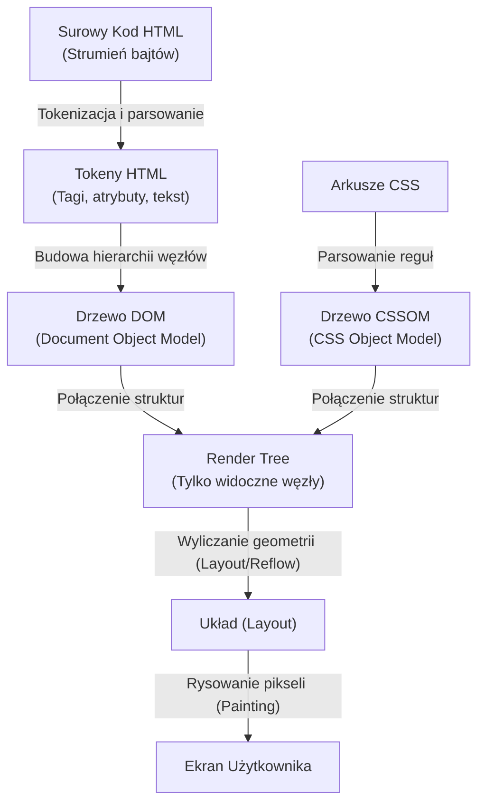
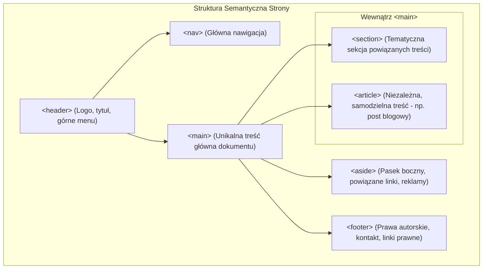

# HTML5: Fundamenty, Semantyka i Dostępność

**HTML (HyperText Markup Language)** to szkielet każdej strony i aplikacji internetowej. Nie jest językiem programowania (nie posiada logiki warunkowej ani pętli), lecz **deklaratywnym językiem znaczników**, którego zadaniem jest nadanie surowym danym struktury, hierarchii oraz znaczenia semantycznego.

Przeglądarka internetowa parsuje kod HTML i buduje w pamięci obiektowy model dokumentu zwany **drzewem DOM (Document Object Model)**.

---

## 1. Jak Przeglądarka Przetwarza HTML?



---

## 2. Anatomia Dokumentu HTML5

Każdy poprawny dokument HTML5 posiada następującą bazową strukturę:

```html
<!DOCTYPE html>
<html lang="pl">
<head>
  <meta charset="UTF-8">
  <meta name="viewport" content="width=device-width, initial-scale=1.0">
  <meta name="description" content="Nowoczesny kurs technologii webowych.">
  <title>Podstawy HTML5 - CodeAssure</title>
  <link rel="stylesheet" href="styles.css">
  <link rel="icon" href="/favicon.ico">
</head>
<body>
  <h1>Witaj na stronie!</h1>
  <p>Treść widoczna dla użytkownika.</p>
  <script src="app.js" defer></script>
</body>
</html>
```

### Kluczowe Elementy Sekcji `<head>`:
- `<!DOCTYPE html>`: Informuje przeglądarkę, że dokument jest zgodny ze standardem **HTML5** (zapobiega wejściu przeglądarki w tryb zgodności wstecznej *Quirks Mode*).
- `<meta charset="UTF-8">`: Definiuje kodowanie znaków jako UTF-8 (poprawne renderowanie polskich znaków: ą, ę, ś, ć itp.).
- `<meta name="viewport" content="width=device-width, initial-scale=1.0">`: **Krytyczne dla Responsive Web Design (RWD)**. Zapewnia, że szerokość strony dopasowuje się do fizycznej szerokości ekranu urządzenia mobilnego bez sztucznego pomniejszania.
- `defer` w tagu `<script>`: Pobiera skrypt w tle równolegle z parsowaniem HTML i wykonuje go dopiero po zakończeniu budowy drzewa DOM (zapobiega blokowaniu renderowania).

---

## 3. Semantyczny HTML5 vs "Div Soup"

Przed HTML5 struktura stron opierała się na niekończących się zagnieżdżeniach znaczników `<div>` (np. `<div class="header">`, `<div class="nav">`). HTML5 wprowadził **znaczniki semantyczne**, które jasno informują przeglądarki, boty indeksujące (SEO) oraz czytniki ekranowe (dla osób niewidomych), jaką rolę pełni dany fragment strony.



### Podsumowanie Ról Znaczników Semantycznych:

| Znacznik | Przeznaczenie | Czy może występować wielokrotnie? |
| :--- | :--- | :---: |
| `<header>` | Nagłówek strony lub sekcji | Tak |
| `<nav>` | Blok linków nawigacyjnych | Tak |
| `<main>` | Główna, niepowtarzająca się treść dokumentu | **Tylko 1 raz na stronę** |
| `<section>` | Tematyczny blok treści (zazwyczaj z własnym nagłówkiem `<h2>-<h6>`) | Tak |
| `<article>` | Niezależny wpis (np. artykuł, komentarz, karta produktu), który miałby sens wyrwany z kontekstu | Tak |
| `<aside>` | Treść poboczna, uzupełniająca (sidebar, zajawki, linki) | Tak |
| `<footer>` | Stopka dokumentu lub sekcji | Tak |

---

## 4. Tekst, Linki i Bezpieczeństwo

### Hierarchia Nagłówków
Nagłówki `<h1>` do `<h6>` definiują strukturę dokumentu:
- Zawsze powinien istnieć **dokładnie jeden `<h1>`** na stronie reprezentujący główny temat.
- **Nigdy nie pomijaj poziomów nagłówków** (np. przechodzenie z `<h1>` bezpośrednio do `<h3>` to błąd dostępności a11y).
- Nagłówków używa się do strukturyzowania treści, a **nie do formatowania wielkości czcionki** (do wyglądu służy CSS).

### Bezpieczne Linki (`<a>`)

```html
<!-- Bezpieczny link zewnętrzny otwierany w nowej karcie -->
<a href="https://example.com" target="_blank" rel="noopener noreferrer">
  Odwiedź stronę zewnętrzną
</a>
```

> [!WARNING]
> **Luka bezpieczeństwa `target="_blank"`:**  
> Otwierając stronę w nowym oknie bez `rel="noopener"`, nowa strona zyskuje dostęp do obiektu `window.opener` Twojej aplikacji i może przekierować Twoich użytkowników na fałszywą stronę phishingową (`window.opener.location = "fake-login.com"`). Zawsze dodawaj `rel="noopener noreferrer"`.

---

## 5. Nowoczesne Formularze w HTML5

Formularz (`<form>`) służy do zbierania danych od użytkownika i wysyłania ich na serwer za pomocą metody `GET` lub `POST`.

```html
<form action="/api/register" method="POST" class="form-container">
  <!-- Powiązanie <label> z <input> przez atrybut 'for' i 'id' jest kluczowe dla dostępności! -->
  <div class="form-group">
    <label for="user-email">Adres E-mail:</label>
    <input 
      type="email" 
      id="user-email" 
      name="email" 
      placeholder="jan@example.com" 
      required
      autocomplete="email"
    >
  </div>

  <div class="form-group">
    <label for="user-password">Hasło:</label>
    <input 
      type="password" 
      id="user-password" 
      name="password" 
      minlength="8" 
      required
    >
  </div>

  <div class="form-group">
    <label for="role-select">Stanowisko:</label>
    <select id="role-select" name="role">
      <option value="dev">Software Developer</option>
      <option value="qa">QA Engineer</option>
      <option value="devops">DevOps Engineer</option>
    </select>
  </div>

  <button type="submit">Zarejestruj się</button>
</form>
```

### Typy Inputów i Wbudowana Walidacja HTML5:
- **Typy specjalistyczne:** `type="email"`, `type="number"`, `type="tel"`, `type="url"`, `type="date"`, `type="file"`.
- Na urządzeniach mobilnych typ pola automatycznie otwiera odpowiednią klawiaturę (np. klawiaturę numeryczną dla `type="tel"` lub `@` dla `type="email"`).
- **Atrybuty walidacji:** `required`, `pattern="[A-Za-z]{3}"` (RegEx), `min`, `max`, `minlength`, `maxlength`.

---

## 6. Multimedia i Optymalizacja (``, `<picture>`)

### Zoptymalizowany Obrazek z Lazy Loading:

```html

```

- **`alt` (Tekst alternatywny):** Obowiązkowy atrybut dla czytników ekranowych oraz robotów SEO. Jeśli obrazek jest czysto dekoracyjny, ustaw pusty `alt=""`.
- **`loading="lazy"`:** Natywne odroczone ładowanie obrazka – przeglądarka pobiera plik dopiero wtedy, gdy użytkownik przewinie stronę w pobliże widoku.
- **`width` i `height`:** Zawsze podawaj proporcje w pikselach, aby zapobiec zjawisku **Cumulative Layout Shift (CLS)**, czyli skakaniu treści podczas doczytywania obrazka.

### Responsywny Obrazek ze Znacznikiem `<picture>` (WebP / AVIF):

```html
<picture>
  <!-- Nowoczesny format AVIF dla wspierających przeglądarek -->
  <source srcset="/images/photo.avif" type="image/avif">
  <!-- Wydajny format WebP -->
  <source srcset="/images/photo.webp" type="image/webp">
  <!-- Fallback w tradycyjnym JPG -->
  
</picture>
```

---

## 7. Dostępność Cyfrowa (a11y) i Standardy WCAG

Dostępność (*Accessibility / a11y*) to projektowanie stron w taki sposób, aby mogły z nich korzystać osoby z niepełnosprawnościami wzroku, słuchu, ruchu czy funkcji poznawczych.

### Złote Zasady a11y w HTML:
1. **Używaj natywnych elementów interaktywnych:**  
   Zamiast pisać `<div onclick="...">Kliknij</div>`, używaj `<button type="button">`. Przeglądarka za darmo dodaje obsługę klawiatury (klawisze `Enter` i `Spacja`) oraz focus.
2. **Atrybuty ARIA (Accessible Rich Internet Applications):**  
   Używaj ARIA tylko wtedy, gdy HTML nie oferuje gotowego odpowiednika (*„No ARIA is better than bad ARIA”*):
   - `aria-label="Zamknij menu"` – opis tekstowy dla przycisków zawierających tylko ikonę (np. krzyżyk `X`).
   - `aria-hidden="true"` – ukrywa elementy czysto dekoracyjne (np. ikony) przed czytnikami ekranu.
   - `aria-expanded="false"` – informuje czytnik, czy menu rozwijane jest otwarte.

---

## 8. Pytania Rekrutacyjne z HTML (FAQ Interview)

### Q1: Czym różni się element blokowy (Block) od liniowego (Inline)?
> **Odpowiedź:**  
> - **Elementy blokowe** (np. `<div>`, `<p>`, `<h1>`, `<section>`): domyślnie zajmują całą dostępną szerokość kontenera (100%), rozpoczynają się od nowej linii oraz respektują wszystkie właściwości wymiarów (`width`, `height`, `margin`, `padding`).  
> - **Elementy liniowe** (np. `<span>`, `<a>`, `<strong>`, `<em>`): zajmują tylko tyle miejsca, ile wynosi ich zawartość, układają się w jednej linii obok siebie i nie respektują właściwości `width` oraz `height`, a pionowe marginesy (`margin-top`/`bottom`) na nie nie wpływają.

---

### Q2: Czym różni się atrybut `async` od `defer` w znaczniku `<script>`?
> **Odpowiedź:**  
> - **Standardowy `<script>`:** Zatrzymuje (*blokuje*) parsowanie HTML, natychmiast pobiera plik JS i natychmiast go wykonuje.  
> - **`<script async>`:** Pobiera skrypt w tle równolegle z parsowaniem HTML. W momencie gdy skrypt zostanie pobrany, parsowanie HTML zostaje wstrzymane i skrypt jest wykonywany. Kolejność wykonania wielu skryptów `async` nie jest gwarantowana.  
> - **`<script defer>`:** Pobiera skrypt asynchronicznie w tle i **czeka z wykonaniem aż cały HTML zostanie sparsowany**. Gwarantuje zachowanie kolejności skryptów w kodzie.

---

### Q3: Do czego służą atrybuty `data-*` w HTML5?
> **Odpowiedź:**  
> Atrybuty `data-*` (Custom Data Attributes) pozwalają na przechowywanie niestandardowych danych biznesowych wewnątrz elementów HTML bez naruszania poprawności walidacji specyfikacji. W JavaScript odczytuje się je za pomocą właściwości `element.dataset` (np. `data-user-id="42"` odczytujemy jako `element.dataset.userId`).
