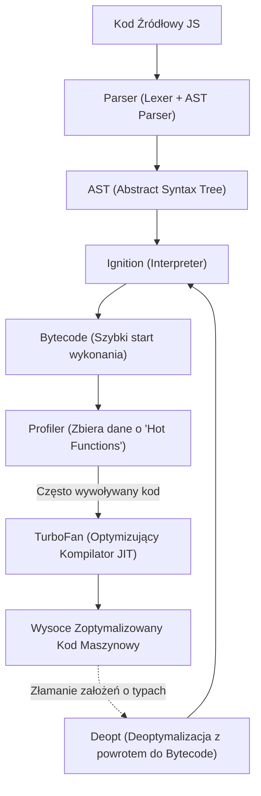
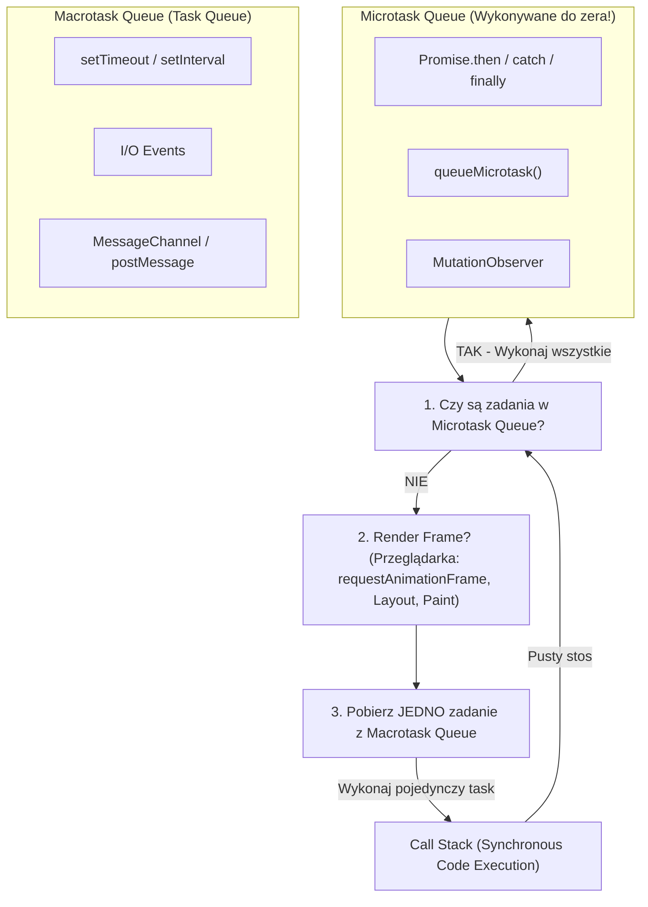

---
title: "JavaScript - Architektura V8, Event Loop, Asynchroniczność i Pytania Rekrutacyjne"
description: "Kompleksowy przewodnik po JavaScript (ES6 - ES2024+): kompilator TurboFan, mechanika Event Loop, domknięcia, prototypy, współbieżność, polyfille oraz pytania z rozmów kwalifikacyjnych."
date: "2026-09-23"
tags: ["JavaScript", "Frontend", "V8", "EventLoop", "Async", "ES6", "Interview"]
order: 4
---
# Kompendium Wiedzy i Pytania Rekrutacyjne: JavaScript (Deep Dive)

Kompleksowy przewodnik techniczny i rekrutacyjny z nowoczesnego języka JavaScript (od ES6 po ES2024+). Obejmuje architekturę silnika V8, mechanikę Event Loop, zaawansowany system typów, asynchroniczność, zarządzanie pamięcią oraz zestaw pytań i zadań kodowych (od Mid do Senior/Lead).

---

## Spis Treści
1. [Silnik JavaScript & Runtime Architecture (V8 & Event Loop)](#1-silnik-javascript--runtime-architecture-v8--event-loop)
   - Architektura V8: Parser, AST, Ignition (Bajtkod), TurboFan (JIT)
   - Hidden Classes (Shapes) i Inline Caching (IC)
   - Zarządzanie Pamięcią i Garbage Collector (Generational GC: Scavenge & Mark-Sweep)
   - Event Loop: Call Stack, Microtasks vs Macrotasks, Render Frame
2. [System Typów, Zmienne i Scoping](#2-system-typów-zmienne-i-scoping)
   - Typy danych (Prymitywy vs Referencje, Symbol, BigInt)
   - Niejawna koercja typów i algorytm `ToPrimitive`
   - Execution Context, Lexical Environment i Hoisting
   - `var` vs `let` vs `const` i Temporal Dead Zone (TDZ)
   - Domknięcia (Closures) pod maską i wycieki pamięci
3. [Model Obiektowy, Prototypy i `this`](#3-model-obiektowy-prototypy-i-this)
   - Łańcuch prototypów (`__proto__`, `prototype`, `Object.create`)
   - Klasy ES6: Pola prywatne `#`, metody statyczne, dziedziczenie
   - Cztery reguły wiązania `this` i funkcje strzałkowe
4. [Asynchroniczność i Współbieżność](#4-asynchroniczność-i-współbieżność)
   - Anatomia obiektu `Promise`
   - Kombinatory: `Promise.all`, `allSettled`, `race`, `any`
   - `async` / `await` pod maską (Generatory + Obietnice)
   - Współbieżność: Web Workers, `SharedArrayBuffer` i `Atomics`
5. [Zaawansowane API i Nowoczesny JS](#5-zaawansowane-api-i-nowoczesny-js)
   - Metaprogramowanie: `Proxy` i `Reflect`
   - Kolekcje o słabych referencjach: `WeakMap` i `WeakSet`
   - Głębokie klonowanie: `structuredClone` vs alternatywy
   - Moduły: ESM vs CommonJS (Cykliczne zależności, asynchroniczność)
6. [Pytania Rekrutacyjne i Zadania Kodowe](#6-pytania-rekrutacyjne-i-zadania-kodowe)
   - Pytania Koncepcyjne (Mid / Senior)
   - Analiza Kodu i Kolejność w Event Loop (Tricky Snippets)
   - Zadania Implementacyjne: Polyfille i Wzorce (Live Coding)
7. [Tablica Szybkiej Powtórki (Cheat-Sheet)](#7-tablica-szybkiej-powtórki-cheat-sheet)

---

## 1. Silnik JavaScript & Runtime Architecture (V8 & Event Loop)

JavaScript jest językiem jednowątkowym (posiada jeden główny wątek wykonawczy ze stosem wywołań Call Stack), interpretowanym oraz kompilowanym w czasie rzeczywistym (**JIT — Just-In-Time**).



### Architektura V8 (Ignition & TurboFan)
1. **Parser & AST:** Kod źródłowy jest analizowany składniowo i przekształcany w drzewo AST (Abstract Syntax Tree).
2. **Ignition (Interpreter):** Generuje lekki bajtkod z AST i natychmiast rozpoczyna jego wykonywanie.
3. **TurboFan (Kompilator Optymalizujący):**
   - Obserwuje kod w czasie działania (Profiling). Funkcje wywoływane wielokrotnie z tymi samymi typami argumentów (*hot functions*) są kompilowane bezpośrednio do kodu maszynowego.
   - **Deoptymalizacja:** Jeśli optymalizacja założyła, że argument funkcji `add(a, b)` jest zawsze liczbą całkowitą, a kod przekaże nagle `string`, TurboFan cofa optymalizację (*bailout/deopt*) i wraca do interpretacji w Ignition.

### Hidden Classes (Shapes) i Inline Caching (IC)
* W JavaScript obiekty są dynamicznymi słownikami. Wyszukiwanie właściwości w pamięci przez haszowanie byłoby bardzo powolne.
* **Hidden Classes (Kształty / Mapy):** Silnik V8 w tle przypisuje każdemu obiektowi niewidoczną klasę opisującą offsety pól w pamięci.
  ```javascript
  // Dobre dla optymalizacji (współdzielą ten sam kształt):
  function Point(x, y) {
    this.x = x;
    this.y = y;
  }
  const p1 = new Point(1, 2);
  const p2 = new Point(3, 4);

  // Złe dla optymalizacji (powstają różne Hidden Classes):
  const a = {}; a.x = 1; a.y = 2;
  const b = {}; b.y = 2; b.x = 1; // Inna kolejność dodawania pól!
  ```
* **Inline Caching (IC):** V8 zapamiętuje lokalizację właściwości dla danego typu obiektu bezpośrednio w miejscu wywołania w kodzie maszynowym.

### Zarządzanie Pamięcią i Garbage Collector
Pamięć dzieli się na **Call Stack** (prymitywy i wskaźniki w bieżącym kontekście) oraz **Memory Heap** (obiekty, tablice, domknięcia).

V8 stosuje **Generational Garbage Collection**:
* **Young Generation (Nowa generacja):**
  - Obiekty żyjące krótko. Dzieli się na dwie przestrzenie: *Nursery* i *Intermediate* (mechanizm **Scavenger / Cheney's copying algorithm**).
  - Bardzo szybkie i częste czyszczenie pamięci (Minor GC).
* **Old Generation (Stara generacja):**
  - Obiekty, które przetrwały dwa cykle czyszczenia w nowej generacji, są promowane do starej generacji.
  - Wykorzystuje algorytm **Major GC (Mark-Sweep & Compact)**:
    1. *Marking:* Oznaczanie obiektów osiągalnych od korzeni (*GC Roots*: zmienne globalne, aktywny stos wywołań).
    2. *Sweeping:* Zwalnianie pamięci po obiektach nieoznaczonych.
    3. *Compacting:* Defragmentacja wolnej pamięci w celu uniknięcia luk adresowych.

### Event Loop w Przeglądarce i Node.js



* **Zasada działania:**
  1. Wykonaj cały kod synchroniczny z **Call Stack**.
  2. Gdy stos jest pusty: opróżnij **całą kolejkę Microtask Queue** (jeśli mikrozadanie doda kolejne mikrozadanie, zostanie ono wykonane w tym samym cyklu; może to doprowadzić do głodzenia wątku!).
  3. (W przeglądarce) Opcjonalnie wykonaj klatkę renderowania (**Animation Frame / Paint**).
  4. Pobierz **dokładnie jedno** zadanie z **Macrotask Queue** i umieść je na Call Stacku.
  5. Powtórz cykl.

---

## 2. System Typów, Zmienne i Scoping

### Typy Danych
W JS wyróżniamy **8 typów danych**:
* **7 Prymitywów (Immutable, przekazywane przez wartość):**
  `string`, `number`, `boolean`, `null`, `undefined`, `symbol`, `bigint`.
* **1 Typ Referencyjny (Mutable, przekazywany przez referencję):**
  `object` (w tym tablice `Array`, funkcje `Function`, `Date`, `RegExp`, `Map`, `Set`).

> [!NOTE]
> `typeof null === "object"` to historyczny błąd w specyfikacji JS z 1995 roku, wynikający z reprezentacji typu w pierwszych wersjach silnika (tag typu dla obiektów wynosił 0, a wskaźnik na `null` był adresem `0x00`).

### Niejawna Koercja Typów i Algorytm `ToPrimitive`
Podczas porównania `==` lub operacji takich jak `+`, silnik konwertuje typy za pomocą wewnętrznej metody `ToPrimitive(hint)`:
1. Sprawdza metodę `[Symbol.toPrimitive](hint)` na obiekcie.
2. Jeśli brak, w zależności od `hint` (`"string"` lub `"number"`):
   - Dla `"string"`: najpierw `toString()`, potem `valueOf()`.
   - Dla `"number"` / `"default"`: najpierw `valueOf()`, potem `toString()`.

```javascript
[] + []          // "" (oba obiekty zamieniają się na pusty string)
[] + {}          // "[object Object]"
{} + []          // 0 (w starszych konsolach {} interpretowane jako pusty blok kodu, +[] dawało 0)
true + false     // 1 (1 + 0)
"5" - 2          // 3 (operator - wymusza konwersję na liczbę)
"5" + 2          // "52" (operator + przy obecności stringa działa jako konkatenacja)
```

### Execution Context, Hoisting i Temporal Dead Zone (TDZ)
Każde wywołanie funkcji tworzy **Execution Context** zawierający:
1. **Variable Environment:** Magazyn zmiennych i funkcji.
2. **Lexical Environment:** Referencja do zasięgu nadrzędnego (Outer Lexical Scope).
3. **Wiązanie `this`**.

* **Hoisting:**
  - `function declaration`: Wynoszona w całości wraz z definicją (można ją wywołać przed deklaracją w kodzie).
  - `var`: Wynoszona deklaracja i inicjalizowana wartością `undefined`.
  - `let` oraz `const`: Wynoszona deklaracja, ale **pozostaje niezainicjalizowana**.
* **Temporal Dead Zone (TDZ):** Obszar od początku bloku zasięgu do linijki, w której następuje fizyczna deklaracja zmiennej `let` lub `const`. Próba odczytu lub zapisu w TDZ rzuca `ReferenceError`.

### Domknięcia (Closures) pod maską
**Domknięcie** to mechanizm, w którym funkcja wewnętrzna zachowuje dostęp do zmiennych ze swojego leksykalnego otoczenia (Lexical Environment), nawet po tym, jak funkcja nadrzędna zakończyła wykonywanie i została zdjęta ze stosu wywołań.

```javascript
function createCounter() {
  let count = 0; // Alokowane na stercie (Heap), a nie na stosie!
  return {
    increment: () => ++count,
    getValue: () => count
  };
}
const counter = createCounter();
console.log(counter.increment()); // 1
console.log(counter.getValue());  // 1
```
* **Mechanika V8:** Silnik przeprowadza analizę leksykalną (*Scope Analysis*). Zmienne, które są używane przez funkcje wewnętrzne (jak `count`), nie są niszczone na stosie, lecz przenoszone do specjalnego obiektu `Context` alokowanego na stercie (**Heap**).

---

## 3. Model Obiektowy, Prototypy i `this`

JavaScript nie posiada tradycyjnych klas opartych na klasycznym dziedziczeniu. Składnia `class` wprowadzona w ES6 to lukier syntaktyczny (*syntactic sugar*) nad **dziedziczeniem prototypowym**.

### Łańcuch Prototypów (Prototype Chain)
Każdy obiekt w JS posiada wewnętrzne łącze do innego obiektu, nazywanego jego prototypem (`[[Prototype]]`), do którego dostęp można uzyskać przez `Object.getPrototypeOf(obj)` (lub historyczne `obj.__proto__`).

```javascript
function User(name) {
  this.name = name;
}
User.prototype.sayHi = function() {
  return `Hi, I am ${this.name}`;
};

const user = new User("Alice");
user.sayHi(); 
// 1. Sprawdza, czy 'sayHi' jest bezpośrednio w obiekcie 'user' (właściwość własna: hasOwnProperty).
// 2. Jeśli nie, przechodzi do user.__proto__ (czyli User.prototype).
// 3. Jeśli nie, idzie wyżej do User.prototype.__proto__ (Object.prototype).
// 4. Jeśli nie, Object.prototype.__proto__ to null -> zwraca undefined.
```

### Cztery Reguły Wiązania `this`

Wartość `this` w zwykłych funkcjach jest określana w **momencie wywołania funkcji** (dynamic scope), a nie w momencie jej definiowania:

1. **Default Binding (Wiązanie domyślne):**
   - Samodzielne wywołanie `fn()`.
   - W trybie luźnym wskazuje na obiekt globalny (`window` lub `global`).
   - W trybie ścisłym (`'use strict'`) wskazuje na `undefined`.
2. **Implicit Binding (Wiązanie niejawne):**
   - Wywołanie przez kropkę jako metoda obiektu: `obj.fn()`. Wartość `this` wskazuje na obiekt przed kropką (`obj`).
3. **Explicit Binding (Wiązanie jawne):**
   - Wymuszenie kontekstu za pomocą `fn.call(ctx, arg1)`, `fn.apply(ctx, [args])` lub utworzenie trwale powiązanej funkcji przez `fn.bind(ctx)`.
4. **`new` Binding (Wiązanie konstruktora):**
   - Wywołanie funkcji z operatorem `new`. Tworzy nowy pusty obiekt, łączy jego prototyp z `Constructor.prototype`, wiąże `this` z nowo powstałym obiektem i domyślnie go zwraca.

#### Funkcje Strzałkowe (Arrow Functions):
* **NIE POSIADAJĄ własnego wiązania `this`**, ani `arguments`, ani `super`, ani `new.target`.
* Używają **Lexical `this`** — dziedziczą wartość `this` z bezpośrednio otaczającego je kontekstu w miejscu definicji kodu.
* Metody `call()`, `apply()` i `bind()` wywołane na arrow function nie mają wpływu na `this`.

---

## 4. Asynchroniczność i Współbieżność

### Obiekt `Promise`
Obiekt reprezentujący ewentualne zakończenie (sukces lub porażkę) operacji asynchronicznej. Posiada 3 stany:
* `pending`: Stan początkowy.
* `fulfilled`: Operacja zakończona sukcesem (posiada wartość).
* `rejected`: Operacja zakończona błędem (posiada powód / Reason).

Stan jest **niemutowalny** — po przejściu z `pending` do `fulfilled` lub `rejected` nie może ulec zmianie.

### Kombinatory Promise — Porównanie Architektoniczne
| Metoda | Kiedy kończy sukcesem? | Kiedy kończy błędem? | Zastosowanie |
| :--- | :--- | :--- | :--- |
| **`Promise.all`** | Wszystkie zakończą się sukcesem | **Fail-fast:** natychmiast przy pierwszym błędzie | Paczka zależnych zapytań API |
| **`Promise.allSettled`** | Zawsze po zakończeniu wszystkich | Nigdy nie rzuca rejectu zbiorczego | Raporty, logowanie, niezależne zadania |
| **`Promise.race`** | Pierwszy, który zakończy się (sukces lub błąd) | Pierwszy, który zakończy się (jeśli był to błąd) | Timeouty sieciowe |
| **`Promise.any`** | Pierwszy, który zakończy się **sukcesem** | Gdy **wszystkie** zawiodą (`AggregateError`) | Odpytywanie wielu mirrorów CDN |

### `async` / `await` pod maską
Składnia `async/await` jest lukrem syntaktycznym nad **funkcjami generatora (`function*`) oraz obietnicami (`Promise`)**:
```javascript
// Kod z async/await:
async function getData() {
  const user = await fetchUser();
  const posts = await fetchPosts(user.id);
  return posts;
}

// Koncepcyjna implementacja pod maską (Generator + Runner):
function getDataEquivalent() {
  return spawn(function* () {
    const user = yield fetchUser();
    const posts = yield fetchPosts(user.id);
    return posts;
  });
}

function spawn(genF) {
  return new Promise((resolve, reject) => {
    const gen = genF();
    function step(nextF) {
      let next;
      try { next = nextF(); } catch (e) { return reject(e); }
      if (next.done) return resolve(next.value);
      Promise.resolve(next.value).then(
        val => step(() => gen.next(val)),
        err => step(() => gen.throw(err))
      );
    }
    step(() => gen.next());
  });
}
```

### Współbieżność w JS: Web Workers & `SharedArrayBuffer`
Mimo że JavaScript w głównym wątku jest jednowątkowy, pełną wielowątkowość osiąga się przez:
* **Web Workers (lub `worker_threads` w Node.js):** Niezależne procesy/wątki posiadające własny Call Stack, Event Loop i pamięć Heap. Komunikują się poprzez asynchroniczne przesyłanie wiadomości (`postMessage`).
* **`SharedArrayBuffer` & `Atomics`:** Umożliwiają współdzielenie surowego bloku pamięci binarnej pomiędzy wieloma wątkami bez kopiowania danych. Obiekt `Atomics` zapobiega wyścigom pamięci (*race conditions*) za pomocą operacji atomowych (`Atomics.add`, `Atomics.wait`, `Atomics.notify`).

---

## 5. Zaawansowane API i Nowoczesny JS

### Metaprogramowanie: `Proxy` i `Reflect`
`Proxy` pozwala przechwytywać i modyfikować podstawowe operacje na obiektach (odczyt właściwości, zapis, wywołanie funkcji, usunięcie klucza):
```javascript
const target = { name: "Antigravity", views: 100 };

const reactive = new Proxy(target, {
  get(obj, prop, receiver) {
    console.log(`Pobieranie właściwości: ${String(prop)}`);
    return Reflect.get(obj, prop, receiver);
  },
  set(obj, prop, value, receiver) {
    console.log(`Modyfikacja ${String(prop)} na: ${value}`);
    // Reflect zwraca boolean sukcesu operacji
    return Reflect.set(obj, prop, value, receiver);
  }
});

reactive.views = 101; // Loguje: Modyfikacja views na: 101
```
* **Zastosowanie produkcyjne:** Podstawa działania nowoczesnych frameworków reaktywnych (system reaktywności w **Vue 3**, śledzenie stanu w MobX).

### `WeakMap` i `WeakSet` — Zarządzanie Pamięcią
* W zwykłej `Map` klucze są trzymane przez silną referencję. Dopóki istnieje mapa, obiekty kluczy nie zostaną usunięte przez Garbage Collector.
* W **`WeakMap`**:
  - Kluczami mogą być **wyłącznie obiekty**.
  - Klucze są trzymane przez **słabą referencję (weak reference)**. Jeśli nie ma innych referencji do danego obiektu, zostanie on usunięty przez GC, a wpis w `WeakMap` zniknie automatycznie.
  - Nie jest iterowalna (brak `size`, brak `.keys()`).
* **Use case:** Przechowywanie prywatnych danych obiektów, cache powiązany z elementami drzewa DOM (usunięcie elementu DOM zwalnia pamięć w cache).

### Głębokie Klonowanie: `structuredClone`
Wprowadzone do standardu natywne API do głębokiego klonowania obiektów:
```javascript
const original = {
  date: new Date(),
  map: new Map([["key", "value"]]),
  set: new Set([1, 2, 3]),
  buffer: new Uint8Array([10, 20])
};
const clone = structuredClone(original);
```
* **Dlaczego lepsze niż `JSON.parse(JSON.stringify(x))`?**
  - Obsługuje cykliczne referencje (`circular references`).
  - Prawidłowo kopiuje `Date`, `RegExp`, `Map`, `Set`, `ArrayBuffer`, `TypedArray`.
  - `JSON.stringify` gubi wartości `undefined`, funkcje, symbole i zamienia `Date` na string.
* **Ograniczenia `structuredClone`:** Nie potrafi klonować funkcji ani węzłów drzewa DOM.

---

## 6. Pytania Rekrutacyjne i Zadania Kodowe

### Pytania Koncepcyjne (Mid / Senior)

#### P1: Jaka jest różnica między `null` a `undefined`?
**Odpowiedź:**
* `undefined`: Oznacza zmienną, która została zadeklarowana, ale nie została jeszcze zainicjalizowana żadną wartością. Jest to również domyślna wartość zwracana przez funkcje bez `return` oraz wartość nieistniejących właściwości obiektów.
* `null`: Jest przypisywaną celowo przez programistę wartością oznaczającą "świadomy brak wartości / pusty wskaźnik".
* `typeof undefined === "undefined"`, podczas gdy `typeof null === "object"`.
* W operacjach logicznych: `null == undefined` daje `true`, ale `null === undefined` daje `false`.

---

#### P2: Dlaczego `0.1 + 0.2 !== 0.3` w JavaScript i jak poprawnie porównywać liczby zmiennoprzecinkowe?
**Odpowiedź:**
JavaScript reprezentuje wszystkie liczby zgodnie ze standardem **IEEE 754** (podwójna precyzja, 64 bity).
Ułamki dziesiętne, takie jak $0.1$ ($1/10$) oraz $0.2$ ($1/5$), w systemie dwójkowym są ułamkami okresowymi nieskończonymi. Ponieważ mantysa ma ograniczoną liczbę bitów (52 bity), dochodzi do zaokrąglenia.
Wynik `0.1 + 0.2` wynosi w rzeczywistości `0.30000000000000004`.
**Prawidłowe rozwiązanie:**
1. Sprawdzenie z marginesem błędu maszynowego:
   ```javascript
   function areEqual(a, b) {
     return Math.abs(a - b) < Number.EPSILON;
   }
   areEqual(0.1 + 0.2, 0.3); // true
   ```
2. Dla operacji finansowych: przeliczanie na jednostki całkowite (np. grosze/centy zamiast złotych/dolarów) lub użycie bibliotek precyzyjnych (np. `decimal.js`, `Big.js`).

---

#### P3: Co to jest wyciek pamięci (Memory Leak) w JS i jakie są najczęstsze przyczyny?
**Odpowiedź:**
Wyciek pamięci następuje, gdy obiekty, które nie są już potrzebne aplikacji, nadal posiadają referencję wychodzącą od korzenia (GC Root) i nie mogą zostać sprzątnięte przez Garbage Collector.
**Najczęstsze przyczyny:**
1. **Zapomniane Event Listenery:** Rejestracja `addEventListener` na elementach globalnych (`window`/`document`) lub komponentach SPA bez ich usuwania (`removeEventListener`) przy demontażu.
2. **Zapomniane Timery:** Niewyczyszczone `setInterval` lub `setTimeout` trzymające w callbacku referencje do dużych obiektów w swoim domknięciu.
3. **Odłączone węzły DOM (Detached DOM nodes):** Trzymanie referencji w zmiennej JavaScript do elementu DOM, który został usunięty z drzewa strony.
4. **Niechciane zmienne globalne:** Przypisanie do niezadeklarowanej zmiennej w trybie nieluźnym (`this.x = ...` w wywołaniu wolnym).
5. **Niewłaściwe użycie Closures:** Trzymanie referencji do dużych struktur w kontekście leksykalnym długo żyjących funkcji.

---

### Analiza Kodu i Kolejność w Event Loop (Tricky Snippets)

#### Snippet 1: Jaka będzie dokładna kolejność logów w konsoli?
```javascript
console.log('1');

setTimeout(() => {
  console.log('2');
  Promise.resolve().then(() => console.log('3'));
}, 0);

new Promise((resolve) => {
  console.log('4');
  resolve();
}).then(() => {
  console.log('5');
});

queueMicrotask(() => console.log('6'));

console.log('7');
```

**Odpowiedź:**
```
1
4
7
5
6
2
3
```
**Wyjaśnienie krok po kroku:**
1. `console.log('1')` — kod synchroniczny, wypisuje `1`.
2. `setTimeout` z czasem 0 rejestruje callback w **Macrotask Queue**.
3. Konstruktor `new Promise(...)` wykonuje funkcję wykonawczą **synchronicznie**, więc wypisuje `4` i woła `resolve()`.
4. Metoda `.then()` planuje callback w **Microtask Queue**.
5. `queueMicrotask` planuje callback w **Microtask Queue**.
6. `console.log('7')` — kod synchroniczny, wypisuje `7`.
7. Stos wywołań jest pusty! Następuje opróżnienie **Microtask Queue**:
   - Wykonuje się pierwszy microtask z Promisa: wypisuje `5`.
   - Wykonuje się drugi microtask: wypisuje `6`.
8. Microtask Queue jest pusta. Silnik pobiera pierwsze zadanie z **Macrotask Queue**:
   - Callback `setTimeout`: wypisuje `2`.
   - Wewnątrz pojawia się `Promise.resolve().then(...)`, co natychmiast rejestruje nowy microtask.
   - Po zakończeniu kodu z `setTimeout`, silnik znowu opróżnia Microtasks przed kolejnym makrozadaniem, wypisując `3`.

---

#### Snippet 2: Co wypisze poniższa pętla i jak ją naprawić na 3 różne sposoby?
```javascript
for (var i = 0; i < 3; i++) {
  setTimeout(() => console.log(i), 100);
}
```
**Odpowiedź:**
Wypisze: `3, 3, 3`.
Zmienna `var` ma zasięg funkcyjny, a nie blokowy. W momencie, gdy callbacki z `setTimeout` są pobierane z kolejki makrozadań po 100 ms, pętla dawno się zakończyła, a zmienna `i` w tym samym zasięgu wynosi `3`.

**Sposoby naprawy:**
1. **Użycie `let` (zasięg blokowy - tworzy nową zmienną dla każdej iteracji):**
   ```javascript
   for (let i = 0; i < 3; i++) {
     setTimeout(() => console.log(i), 100);
   }
   ```
2. **Użycie IIFE (Immediately Invoked Function Expression - utworzenie nowego zasięgu domknięcia):**
   ```javascript
   for (var i = 0; i < 3; i++) {
     ((j) => {
       setTimeout(() => console.log(j), 100);
     })(i);
   }
   ```
3. **Użycie trzeciego argumentu `setTimeout` (przekazanie wartości jako parametr):**
   ```javascript
   for (var i = 0; i < 3; i++) {
     setTimeout((j) => console.log(j), 100, i);
   }
   ```

---

### Zadania Implementacyjne: Polyfille i Wzorce (Live Coding)

#### Zadanie 1: Zaimplementuj funkcję `debounce` oraz `throttle` od podstaw.

```javascript
// DEBOUNCE: Odracza wykonanie funkcji do momentu, gdy minie 'delay' ms 
// od OSTATNIEGO wywołania (np. pole wyszukiwarki autocomplete).
function debounce(fn, delay) {
  let timerId = null;

  return function (...args) {
    const context = this;
    if (timerId) clearTimeout(timerId);

    timerId = setTimeout(() => {
      fn.apply(context, args);
      timerId = null;
    }, delay);
  };
}

// THROTTLE: Gwarantuje wykonanie funkcji MAKSYMALNIE raz na zadany interwał czasu
// (np. zdarzenia scroll, resize).
function throttle(fn, interval) {
  let lastTime = 0;

  return function (...args) {
    const now = Date.now();
    const context = this;

    if (now - lastTime >= interval) {
      lastTime = now;
      fn.apply(context, args);
    }
  };
}
```

---

#### Zadanie 2: Napisz własny polyfill dla `Promise.all`.

```javascript
function promiseAll(promises) {
  return new Promise((resolve, reject) => {
    // Sprawdzenie czy argument jest iterowalny
    if (!promises || typeof promises[Symbol.iterator] !== 'function') {
      return reject(new TypeError('Argument must be iterable'));
    }

    const items = Array.from(promises);
    if (items.length === 0) {
      return resolve([]);
    }

    const results = new Array(items.length);
    let completedCount = 0;

    items.forEach((item, index) => {
      // Obsługa elementów, które nie są natywnymi obietnicami
      Promise.resolve(item)
        .then((value) => {
          results[index] = value;
          completedCount++;

          if (completedCount === items.length) {
            resolve(results);
          }
        })
        .catch((error) => {
          // Fail-fast: pierwszy błąd natychmiast odrzuca całą obietnicę
          reject(error);
        });
    });
  });
}
```

---

#### Zadanie 3: Napisz polyfill dla `Function.prototype.bind`.

```javascript
Function.prototype.myBind = function (context, ...boundArgs) {
  if (typeof this !== 'function') {
    throw new TypeError('Function.prototype.bind called on non-callable');
  }

  const targetFn = this;

  return function boundFunction(...callArgs) {
    // Sprawdzenie, czy funkcja została wywołana jako konstruktor (np. new boundFunction())
    if (new.target) {
      return new targetFn(...boundArgs, ...callArgs);
    }

    return targetFn.apply(context, [...boundArgs, ...callArgs]);
  };
};
```

---

## 7. Tablica Szybkiej Powtórki (Cheat-Sheet)

| Zagadnienie | Słowa Kluczowe i Mechanizmy do Wymienienia |
| :--- | :--- |
| **Silnik V8** | Ignition (Bajtkod), TurboFan (JIT / Machine Code), Shapes / Hidden Classes, Inline Caching (IC), Bailout / Deopt |
| **Pamięć & GC** | Call Stack vs Heap, Generational GC: Scavenge (Nursery/Intermediate), Mark-Sweep-Compact (Old Gen) |
| **Event Loop** | Call Stack -> Wszystkie Microtasks (Promises, `queueMicrotask`) -> Render/Paint -> 1 Macrotask (`setTimeout`, I/O) |
| **Scoping & Zmienne** | TDZ (Temporal Dead Zone), Execution Context, Lexical Environment, Closures na stercie (Heap Context) |
| **Obiektowość & `this`** | Łańcuch `[[Prototype]]`, 4 reguły `this` (Default, Implicit, Explicit, `new`), Arrow functions (Lexical `this`) |
| **Asynchroniczność** | Promise states (immutable), Kombinatory (`all`, `allSettled`, `race`, `any`), `async/await` jako Generator + Promise runner |
| **Nowoczesny JS** | `structuredClone` vs JSON, `Proxy` + `Reflect` (reaktywność), `WeakMap` (słabe referencje, brak wycieków pamięci) |
