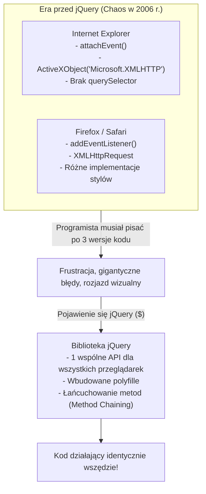

# jQuery: Manipulacja DOM, Zdarzenia i Ewolucja Technologii

**jQuery** to jedna z najbardziej wpływowych bibliotek w historii tworzenia oprogramowania webowego. Stworzona w 2006 roku przez Johna Resiga pod słynnym hasłem **„Write less, do more”** (Pisz mniej, rób więcej), zrewolucjonizowała świat frontendu, ujednolicając interfejs programistyczny w czasach chaosu niekompatybilnych przeglądarek.

Choć w nowoczesnych projektach typu SPA (Single Page Application) została wyparta przez frameworki takie jak React, Vue czy Angular, to **nadal zasila ponad 70% z 10 milionów najpopularniejszych stron na świecie** (w tym ekosystem WordPressa, systemy bankowe i dojrzałe aplikacje korporacyjne).

---

## 1. Dlaczego jQuery Powstało i Co Zmieniło?

W latach 2005–2010 każda przeglądarka (Internet Explorer 6/7, Mozilla Firefox, Opera, Safari) implementowała standardy W3C według własnego uznania.



---

## 2. Podstawowa Składnia i Funkcja Dolara (`$`)

Praktycznie cała praca z jQuery opiera się na wywołaniu funkcji `jQuery()` lub jej powszechnym aliasie `$()`:

```javascript
// 1. Zapewnienie, że kod uruchomi się dopiero po załadowaniu drzewa DOM:
$(document).ready(function() {
    console.log("Drzewo DOM jest w pełni załadowane i gotowe do modyfikacji!");
});

// Zwięzły, nowoczesny zapis (Shorthand):
$(function() {
    // Bezpieczne manipulowanie elementami DOM
    $("p").css("color", "blue");
});
```

> [!NOTE]
> **`$(document).ready()` vs `window.onload`:**  
> `$(document).ready()` odpala się natychmiast po sparsowaniu struktury znaczników HTML przez przeglądarkę (nie czeka na pobranie ciężkich obrazków czy filmów).  
> Zdarzenie natywne `window.onload` czeka aż pobierze się **absolutnie wszystko** (grafiki, arkusze stylów, czcionki), co mogło opóźniać interaktywność strony o wiele sekund.

---

## 3. Selektory w jQuery

jQuery wykorzystuje uniwersalną składnię selektorów CSS do wyszukiwania elementów w drzewie DOM:

```javascript
// Po identyfikatorze (#)
const $header = $("#main-header");

// Po klasie (.)
const $buttons = $(".btn-primary");

// Po tagu i atrybutach
const $inputs = $("input[type='email']");

// Selektory hierarchiczne i relacyjne
const $activeItem = $("ul.menu > li.active");

// Pseudoselektory charakterystyczne dla jQuery
$("tr:odd").css("background-color", "#f2f2f2"); // Co drugi wiersz tabeli
$("p:first").addClass("lead");                   // Pierwszy akapit
```

> [!TIP]
> **Konwencja nazewnictwa:** Zmienne przechowujące obiekty jQuery warto poprzedzać znakiem dolara (np. `const $submitBtn = $('#btn-submit');`). Pozwala to od razu odróżnić obiekt jQuery od natywnego elementu DOM JavaScriptu (`HTMLElement`).

---

## 4. Manipulacja Drzewem DOM

### Odczyt i Zmiana Treści:

| Metoda | Opis | Odpowiednik w czystym JS (Vanilla) |
| :--- | :--- | :--- |
| `$(el).text()` | Pobiera lub ustawia czysty tekst (bezpieczny przed XSS) | `el.textContent` |
| `$(el).html()` | Pobiera lub ustawia kod HTML wraz ze znacznikami | `el.innerHTML` |
| `$(el).val()` | Pobiera lub ustawia wartość pola formularza (`input`, `select`) | `el.value` |

```javascript
// Odczyt:
const email = $("#user-email").val();

// Zapis z łańcuchowaniem metod (Method Chaining):
$("#welcome-message")
    .text("Witaj z powrotem, " + email + "!")
    .css("font-weight", "bold")
    .fadeIn(300);
```

### Klasy i Atrybuty:

```javascript
// Zarządzanie klasami CSS
$("#alert-box").addClass("visible").removeClass("hidden");
$("#theme-toggle").toggleClass("dark-mode");
const czyAktywny = $("#tab-1").hasClass("active"); // true / false

// Atrybuty HTML
$("#profile-pic").attr("src", "/avatars/user-12.png");
$("#external-link").attr("target", "_blank");
$("#download-btn").removeAttr("disabled");
```

### Dodawanie i Usuwanie Elementów z Drzewa DOM:

```javascript
// Wstawianie do wnętrza:
$("#chat-box").append("<p>Nowa wiadomość od doradcy.</p>");   // Na koniec wewnątrz
$("#chat-box").prepend("<p>Wiadomość powitalna.</p>");       // Na początek wewnątrz

// Wstawianie na zewnątrz (obok):
$("#target-element").after("<hr>");                          // Bezpośrednio PO elemencie
$("#target-element").before("<span>Przed elementem</span>"); // Bezpośrednio PRZED

// Usuwanie:
$(".temporary-notice").remove(); // Całkowite usunięcie elementu z DOM
$("#cart-items").empty();        // Wyczyszczenie zawartości rodzica (dzieci znikają)
```

---

## 5. Obsługa Zdarzeń (Events) i Delegacja

Najważniejszą metodą obsługi zdarzeń w jQuery jest `.on()`:

```javascript
// Prosta obsługa kliknięcia
$("#btn-submit").on("click", function(event) {
    event.preventDefault(); // Zatrzymanie domyślnego przeładowania strony w formularzu
    console.log("Kliknięto przycisk!");
});
```

### Zjawisko i Zbawienie: Delegacja Zdarzeń (*Event Delegation*)

Częsty błąd początkujących polega na dodawaniu nasłuchiwaczy zdarzeń do elementów, które **powstaną w przyszłości** (np. po pobraniu danych przez AJAX). Standardowy `.click()` ich nie obsłuży!

Rozwiązaniem jest **delegacja zdarzeń** – przypisanie nasłuchiwania do istniejącego rodzica (lub obiektu `document`):

```javascript
// Zamiast dodawać 1000 nasłuchiwaczy do każdego przycisku,
// nasłuchujemy na rodzicu #todo-list i filtrujemy kliknięcia w '.delete-btn':
$("#todo-list").on("click", ".delete-btn", function() {
    // 'this' wewnątrz funkcji wskazuje na konkretny kliknięty przycisk!
    $(this).closest("li").fadeOut(400, function() {
        $(this).remove();
    });
});
```

---

## 6. Asynchroniczność: AJAX w jQuery

Przed wprowadzeniem natywnej funkcji `fetch()` w JavaScript, jQuery oferowało najprostszy sposób na asynchroniczne żądania sieciowe w tle bez przeładowywania strony:

```javascript
// Pełna konfiguracja za pomocą $.ajax
$.ajax({
    url: "https://api.example.com/v1/users",
    method: "POST",
    contentType: "application/json",
    data: JSON.stringify({
        name: "Piotr",
        role: "Developer"
    }),
    dataType: "json",
    success: function(response) {
        console.log("Serwer odpowiedział pomyślnie:", response);
        $("#status-label").text("Zapisano pomyślnie! ID: " + response.id);
    },
    error: function(xhr, status, error) {
        console.error("Wystąpił błąd zapytania:", error);
        alert("Błąd zapisu danych: " + xhr.status);
    }
});

// Skrótowe metody dla szybkich operacji GET:
$.getJSON("/api/products", function(produkty) {
    produkty.forEach(function(p) {
        $("#products-list").append("<li>" + p.title + " - " + p.price + " PLN</li>");
    });
});
```

---

## 7. Kamień z Rosetty: jQuery vs Nowoczesny Vanilla JS (ES6+)

Współczesny JavaScript (standardy ES6–ES2024) posiada już wbudowane wszystkie funkcjonalności, które dawniej oferowało jQuery.

| Zadanie | Składnia w jQuery | Nowoczesny Vanilla JS (ES6+) |
| :--- | :--- | :--- |
| **Pobranie pojedynczego elementu** | `$('#login-btn')` | `document.querySelector('#login-btn')` |
| **Pobranie wielu elementów** | `$('.card-item')` | `document.querySelectorAll('.card-item')` |
| **Pętla po elementach** | `$('.item').each(function() { ... })` | `document.querySelectorAll('.item').forEach(el => { ... })` |
| **Dodanie klasy** | `$(el).addClass('active')` | `el.classList.add('active')` |
| **Usunięcie klasy** | `$(el).removeClass('active')` | `el.classList.remove('active')` |
| **Przełączenie klasy** | `$(el).toggleClass('open')` | `el.classList.toggle('open')` |
| **Ustawienie tekstu** | `$(el).text('Cześć!')` | `el.textContent = 'Cześć!'` |
| **Wstawienie kodu HTML** | `$(el).html('<b>Ważne</b>')` | `el.innerHTML = '<b>Ważne</b>'` |
| **Ukrycie elementu** | `$(el).hide()` | `el.style.display = 'none'` |
| **Nasłuchiwanie zdarzenia** | `$(el).on('click', handler)` | `el.addEventListener('click', handler)` |
| **Zapytanie AJAX (GET)** | `$.getJSON('/api/data', res => {})` | `const res = await fetch('/api/data'); const data = await res.json();` |

---

## 8. Gdzie jQuery Jest Używane Dzisiaj?

Mimo dominacji frameworków komponentowych, znajomość jQuery wciąż pozostaje cenna na rynku pracy:

1. **WordPress:** Najpopularniejszy CMS na świecie (napędza >40% całego internetu) ma wbudowane jQuery w rdzeń oraz tysiące wtyczek i motywów.
2. **Utrzymanie systemów Legacy:** Miliony funkcjonujących portali e-commerce i korporacyjnych systemów intranetowych powstałych w latach 2008–2018.
3. **Biblioteki i pluginy:** Rozbudowane komponenty UI, które nadal opierają się na jQuery (np. zaawansowane tabele *DataTables*, wielopoziomowe selekty *Select2*, czy suwaki *Slick*).

---

## 9. Pytania Rekrutacyjne z jQuery i DOM (FAQ Interview)

### Q1: Czym różni się obiekt jQuery od natywnego elementu DOM?
> **Odpowiedź:**  
> Natywny element DOM (`HTMLElement`) to obiekt dostarczany bezpośrednio przez przeglądarkę, posiadający właściwości takie jak `.innerHTML`, `.style` czy metodę `.addEventListener()`.  
> Obiekt jQuery to **opakowujący obiekt tablicopodobny** (*wrapper*), zawierający referencje do jednego lub wielu natywnych elementów DOM oraz zestaw łańcuchowalnych metod biblioteki (`.addClass()`, `.fadeIn()`).  
> Aby wydobyć natywny element DOM z obiektu jQuery, odwołujemy się do indeksu: `$('#my-id')[0]` lub używamy metody `$('#my-id').get(0)`.

---

### Q2: Co to jest „Chaining” (Łańcuchowanie) w jQuery i jak to działa technicznie?
> **Odpowiedź:**  
> Łańcuchowanie pozwala na wywołanie wielu metod jedna po drugiej na tym samym zbiorze elementów w pojedynczej instrukcji, np. `$('#box').addClass('highlight').fadeIn(200).text('Gotowe');`.  
> Technicznie jest to możliwe, ponieważ niemal każda metoda w jQuery modyfikująca stan zwraca na końcu słowo kluczowe `return this;` (czyli zwraca referencję do tego samego obiektu jQuery).

---

### Q3: Dlaczego delegacja zdarzeń w jQuery (`$(parent).on('click', '.child', fn)`) poprawia wydajność aplikacji?
> **Odpowiedź:**  
> 1. **Mniejsze zużycie pamięci:** Zamiast rejestrować w pamięci RAM setki lub tysiące osobnych procedur obsługi zdarzeń dla każdego wiersza w tabeli czy elementu listy, rejestrujemy tylko **jeden jedyny nasłuchiwacz** na elemencie nadrzędnym.  
> 2. **Automatyczna obsługa elementów dynamicznych:** Gdy w aplikacji dodamy nowe elementy przez AJAX lub manipulację DOM, natychmiast reagują one na kliknięcia bez potrzeby ponownego wiązania zdarzeń (*event rebinding*).
