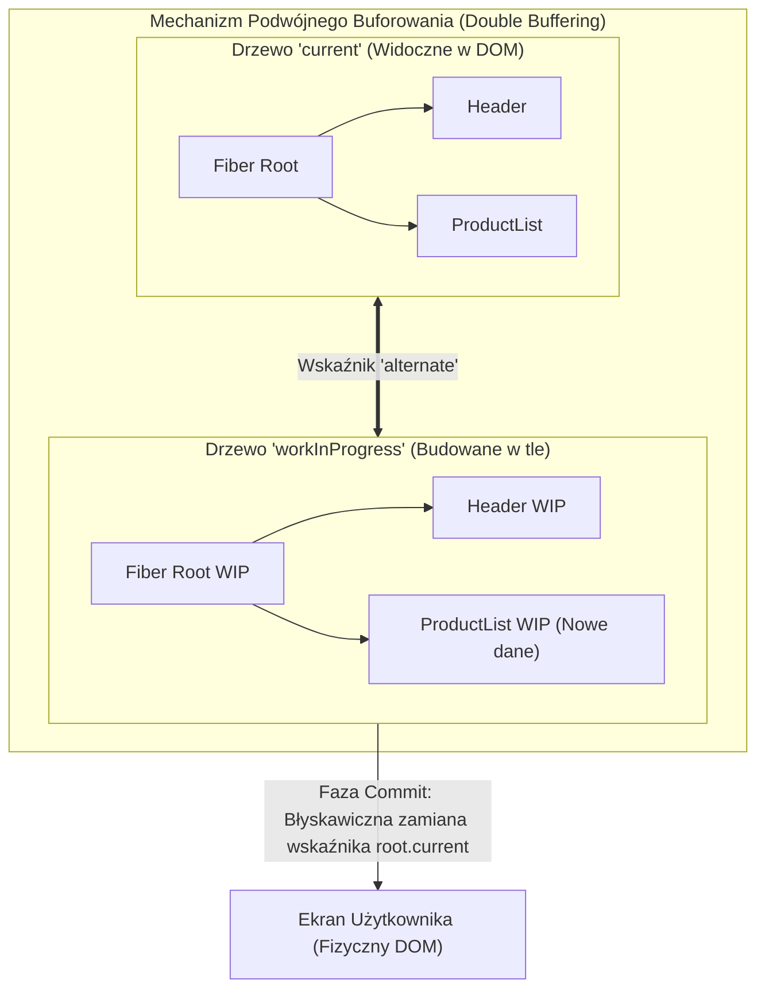
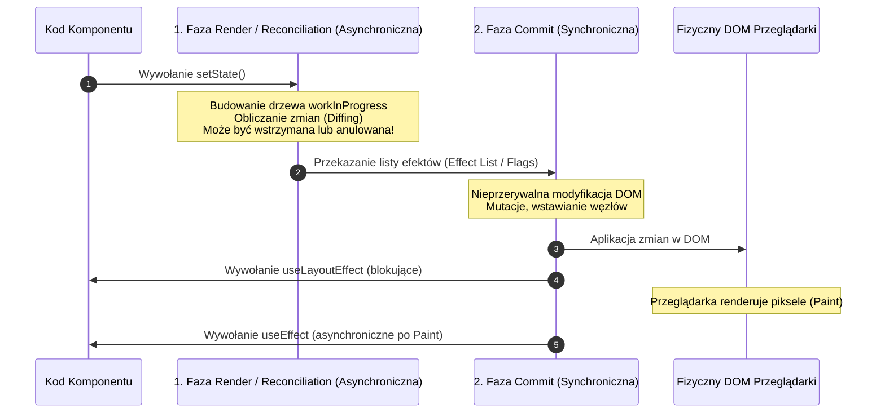
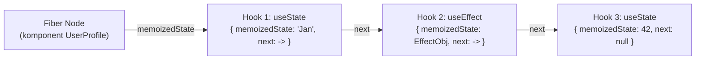
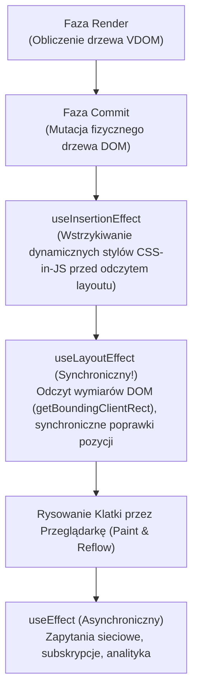

# React: Niskopoziomowa Architektura Fiber, Zaawansowane Hooki i Pytania Rekrutacyjne

Kompleksowe kompendium inżynierskie poświęcone bibliotece **React** — dominującemu standardowi budowy interfejsów użytkownika. Artykuł szczegółowo analizuje wewnętrzną architekturę silnika React Fiber, mechanizm podwójnego buforowania (*Double Buffering*), algorytm uzgadniania (*Reconciliation*), niskopoziomową implementację hooków jako listy wiązanej, współbieżność (*Concurrent Mode* w React 18/19), architekturę *React Server Components* (RSC), wzorce zarządzania stanem, optymalizację wydajności oraz obszerny zestaw pytań rekrutacyjnych i realnych scenariuszy awaryjnych (od poziomu Mid po Principal Frontend Architecta).

---

## Spis Treści
1. [Wewnętrzna Architektura Reacta i Silnik Fiber](#1-wewnętrzna-architektura-reacta-i-silnik-fiber)
   - Od Stack Reconcilera do Fiber: Dlaczego konieczna była zmiana silnika?
   - Węzeł Fiber jako jednostka pracy (Anatomia struktury danych)
   - Podwójne buforowanie (Double Buffering): Drzewo `current` vs `workInProgress`
   - Dwie fazy cyklu życia: Faza Render (asynchroniczna) vs Faza Commit (synchroniczna)
   - Heurystyka algorytmu Diffingu i rola właściwości `key`
2. [Głębokie Zrozumienie Hooków (Hooks Deep-Dive)](#2-głębokie-zrozumienie-hooków-hooks-deep-dive)
   - Jak silnik Reacta przechowuje stan? Lista wiązana `memoizedState`
   - Dlaczego reguły hooków (*Rules of Hooks*) są bezwzględnym wymogiem architektonicznym?
   - `useState` vs `useReducer` – kiedy stosować maszynę stanów?
   - Różnice w cyklu życia przeglądarki: `useEffect` vs `useLayoutEffect` vs `useInsertionEffect`
   - Pułapki memoizacji: `useMemo` i `useCallback` – koszt tworzenia vs korzyści referencyjne
   - `useRef` – mutowalny pojemnik bez wyzwalania re-renderu
3. [Współbieżny React (Concurrent Features) i Nowości React 19](#3-współbieżny-react-concurrent-features-i-nowości-react-19)
   - Koncepcja priorytetyzacji zadań (Scheduler & Lanes)
   - `useTransition` oraz `useDeferredValue` – separacja aktualizacji pilnych i opcjonalnych
   - Nowe mechanizmy React 19: `useActionState`, `useOptimistic`, hook `use()`
   - Zmierzch `forwardRef` (natywny props `ref`)
   - React Server Components (RSC) vs klasyczny Server-Side Rendering (SSR)
4. [Zarządzanie Stanem i Wzorce Architektoniczne](#4-zarządzanie-stanem-i-wzorce-architektoniczne)
   - Jednokierunkowy przepływ danych i podnoszenie stanu (*Lifting State Up*)
   - Pułapka Context API w dużych aplikacjach (brak selektorów i nadmiarowe re-rendery)
   - Podział na Server State (TanStack Query / SWR) vs Client State (Zustand / Redux Toolkit)
   - Wzorzec Compound Components
5. [Optymalizacja Renderowania i Profilowanie](#5-optymalizacja-renderowania-i-profilowanie)
   - Co naprawdę wywołuje ponowne renderowanie komponentu?
   - Płytkie porównywanie propsów w `React.memo`
   - Dzielenie kodu (*Code Splitting*) z `React.lazy` i `Suspense`
   - Wirtualizacja długich list (Virtual Windowing)
6. [Pytania Rekrutacyjne z Odpowiedziami (FAQ Interview)](#6-pytania-rekrutacyjne-z-odpowiedziami-faq-interview)
   - Pytania Podstawowe i Średniozaawansowane (Mid)
   - Pytania Zaawansowane i Architektoniczne (Senior / Lead)
   - Scenariusze Awaryjne i Live-fire Troubleshooting
7. [Tablica Szybkiej Powtórki (Cheat-Sheet)](#7-tablica-szybkiej-powtórki-cheat-sheet)

---

## 1. Wewnętrzna Architektura Reacta i Silnik Fiber

Do wersji 15 włącznie React wykorzystywał tzw. **Stack Reconciler**. Algorytm ten rekurencyjnie przetwarzał całe wirtualne drzewo komponentów. Ponieważ pojedynczy stos wywołań JavaScript w przeglądarce jest jednowątkowy, operacja ta blokowała główny wątek (*Main Thread*) na kilkadziesiąt milisekund, co prowadziło do gubienia klatek animacji (*frame drop*) i braku responsywności na kliknięcia użytkownika (*Jank*).

W React 16 wprowadzono całkowicie przepisany silnik — **React Fiber**.



### Węzeł Fiber jako Jednostka Pracy (Unit of Work)
Węzeł **Fiber** to obiekt JavaScript reprezentujący komponent i jego stan. W przeciwieństwie do tradycyjnego drzewa DOM, węzły Fiber tworzą strukturę opartą na jednokierunkowej liście relacji wskaźnikowych:
- `child`: Wskaźnik na pierwsze bezpośrednie dziecko.
- `sibling`: Wskaźnik na następne rodzeństwo.
- `return`: Wskaźnik na rodzica (dokąd powrócić po zakończeniu przetwarzania gałęzi).
- `memoizedState`: Wskaźnik na listę wiązaną hooków tego komponentu.
- `lanes`: Maska bitowa priorytetu aktualizacji.
- `alternate`: Wskaźnik na odpowiadający węzeł w drugim drzewie (wzorzec *Double Buffering*).

Taka struktura pozwala silnikowi Reacta na **przerywanie pracy** (*Cooperative Multitasking*), oddawanie kontroli do przeglądarki na czas obsłużenia zdarzenia użytkownika lub narysowania klatki (16.6 ms przy 60 FPS), a następnie wznawianie obliczeń dokładnie w miejscu przerwania.

---

### Dwie Fazy Cyklu Życia: Render vs Commit

Architektura wykonawcza Reacta jest podzielona na dwa odseparowane etapy:



1. **Faza Render (Reconciliation):**
   - Jest czysto obliczeniowa i **asynchroniczna**.
   - Wywołuje funkcje komponentów, porównuje stare i nowe drzewo Fiber oraz oznacza węzły flagami zmian (`Placement`, `Update`, `Deletion`).
   - **Nie wywołuje żadnych efektów ubocznych w DOM**. Silnik może ją wielokrotnie przerywać, cofać lub porzucać, jeśli nadejdzie aktualizacja o wyższym priorytecie (np. wpisywanie tekstu w polu input).
2. **Faza Commit:**
   - Jest bezwzględnie **synchroniczna**.
   - React aplikuje zgromadzone zmiany bezpośrednio do fizycznego drzewa DOM.
   - Zamienia wskaźnik `root.current` na drzewo `workInProgress`.
   - Wywołuje hooki layoutu (`useLayoutEffect`), a po narysowaniu klatki przez przeglądarkę asynchronicznie odpala `useEffect`.

---

### Heurystyka Algorytmu Diffingu i Rola Właściwości `key`
Standardowy algorytm porównywania drzew ma złożoność obliczeniową $\mathcal{O}(n^3)$. React stosuje heurystykę liniową $\mathcal{O}(n)$, opierając się na dwóch założeniach:
1. Dwa elementy o różnych typach tagów (np. zmiana z `<div>` na `<span>` lub zmiana typu komponentu) wygenerują zupełnie inne drzewa — stary węzeł wraz z dziećmi jest natychmiast niszczony (*unmount*), a nowy tworzony od zera.
2. Programista dostarcza stabilny identyfikator **`key`**, który informuje silnik, które elementy w kolekcji są tymi samymi węzłami pomiędzy kolejnymi renderami.

> [!WARNING]
> Używanie indeksu tablicy jako `key` (`key={index}`) w dynamicznych listach (gdzie elementy są sortowane, usuwane lub dodawane na początku) jest krytycznym błędem. React dopasuje stan wewnętrzny komponentu (np. wpisany tekst w `<input>`, zaznaczenie checkboxa) na podstawie indeksu, a nie tożsamości elementu, co powoduje zafałszowanie stanu interfejsu.

---

## 2. Głębokie Zrozumienie Hooków (Hooks Deep-Dive)

### Jak React przechowuje stan pod maską?
W komponentach funkcyjnych nie ma instancji klasy (`this`). Wszystkie stany tworzone przez `useState` i `useReducer` są przechowywane jako **jednokierunkowa lista wiązana w polu `memoizedState` węzła Fiber** danego komponentu.



### Dlaczego Reguły Hooków są bezwzględne?
React nie identyfikuje hooków po nazwach zmiennych, lecz **wyłącznie po kolejności ich wywołań**:
1. Podczas pierwszego renderu lista jest tworzona węzeł po węźle.
2. Podczas kolejnych renderów silnik ustawia wewnętrzny kursor na głowie listy (`currentHook = fiber.memoizedState`) i przy każdym napotkanym hooku przesuwa wskaźnik: `currentHook = currentHook.next`.
3. Jeśli umieścisz hook w instrukcji warunkowej `if (condition)`:
   - Kiedy warunek zmieni wartość, liczba wywołań hooków ulegnie zmianie.
   - Kursor hooków rozjedzie się z zapisaną listą wiązaną. Stan z Hooka 3 zostanie przypisany do Hooka 2, niszcząc spójność pamięci komponentu!

---

### `useEffect` vs `useLayoutEffect` vs `useInsertionEffect`

Zrozumienie, w którym momencie cyklu klatki przeglądarki wykonują się poszczególne hooki, decyduje o braku migotania (*flickering*) ekranu:



- **`useEffect` (Domyślny):** Odpala się **asynchronicznie po narysowaniu klatki (Post-Paint)**. Nie blokuje malowania pikseli przez przeglądarkę. Idealny do pobierania danych, timerów i nasłuchiwania zdarzeń.
- **`useLayoutEffect`:** Odpala się **synchronicznie zaraz po mutacji DOM, ale PRZED malowaniem klatki (Pre-Paint)**. Blokuje przeglądarkę. Używany wyłącznie wtedy, gdy musimy odczytać geometrię elementu z DOM (`getBoundingClientRect()`) i natychmiast skorygować jego styl, aby użytkownik nie zauważył przeskoku elementu na ekranie.
- **`useInsertionEffect` (React 18+):** Wykonuje się przed wszystkimi mutacjami układu. Zaprojektowany wyłącznie dla autorów bibliotek CSS-in-JS (np. styled-components) do wstrzykiwania znaczników `<style>`.

---

### Pułapki Memoizacji: `useMemo` i `useCallback`
Częstym antywzorcem jest owijanie każdej zmiennej w `useMemo` i każdej funkcji w `useCallback`.
- Każde użycie `useMemo` wiąże się z alokacją obiektu w liście hooków, alokacją tablicy zależności oraz kosztem iteracji i porównywania referencji (`Object.is`) przy każdym renderze.
- Jeśli obliczenie to zwykła filtracja małej tablicy (np. 50 elementów), **narzut pamięciowy i procesora na obsługę `useMemo` jest wyższy niż ponowne przeliczenie operacji**.

#### Kiedy memoizacja jest uzasadniona:
1. Obliczenie jest rzeczywiście ciężkie matematycznie (np. przetwarzanie grafiki, algorytmy na tysiącach rekordów).
2. Przekazujemy funkcję lub obiekt jako `props` do komponentu potomnego owiniętego w **`React.memo`** (zapewnienie równości referencyjnej, aby zapobiec re-renderowi dziecka).
3. Obiekt lub funkcja znajduje się w tablicy zależności innego hooka (`useEffect`, `useMemo`).

---

## 3. Współbieżny React (Concurrent Features) i Nowości React 19

### Model Priorytetyzacji (Scheduler, Lanes i `useTransition`)
Przed React 18 każda aktualizacja stanu miała ten sam, krytyczny priorytet. W trybie współbieżnym wprowadzono model pasów (*Lanes*), który dzieli aktualizacje na:
- **Urgent Updates (Pilne):** Bezpośrednie reakcje na akcje użytkownika (pisanie na klawiaturze, kliknięcie przycisku, ruch suwaka). Muszą wykonać się natychmiast.
- **Transition Updates (Przejścia / Niepilne):** Zmiana widoku, filtrowanie listy wyników, ładowanie danych. Mogą zostać opóźnione lub przerwane.

```tsx
import { useState, useTransition } from "react";

export function SearchFilter({ items }: { items: string[] }) {
  const [query, setQuery] = useState("");
  const [filteredItems, setFilteredItems] = useState(items);
  const [isPending, startTransition] = useTransition();

  const handleInputChange = (e: React.ChangeEvent<HTMLInputElement>) => {
    const value = e.target.value;
    // 1. Aktualizacja pilna: pole natychmiast pokazuje wpisany znak (brak opóźnienia klawiatury)
    setQuery(value);

    // 2. Aktualizacja niepilna: ciężkie filtrowanie może zostać przerwane, jeśli user pisze dalej
    startTransition(() => {
      setFilteredItems(items.filter((item) => item.toLowerCase().includes(value.toLowerCase())));
    });
  };

  return (
    <div>
      <input type="text" value={query} onChange={handleInputChange} />
      {isPending && <p>Filtrowanie wyników...</p>}
      <ul>
        {filteredItems.map((item) => (
          <li key={item}>{item}</li>
        ))}
      </ul>
    </div>
  );
}
```

---

### Kluczowe Zmiany w React 19

1. **Rezygnacja z `forwardRef`:**
   W React 19 właściwość `ref` stała się zwykłym parametrem komponentu funkcyjnego:
   ```tsx
   // React 19: Czysty kod bez konieczności forwardRef<HTMLInputElement, Props>
   function CustomInput({ placeholder, ref }: { placeholder: string; ref: React.Ref<HTMLInputElement> }) {
     return <input ref={ref} placeholder={placeholder} />;
   }
   ```
2. **Hook `use()`:**
   Umożliwia odczytywanie zasobów asynchronicznych (obietnic `Promise`) oraz kontekstów (`React.Context`) bezpośrednio w ciele komponentu, w tym **wewnątrz pętli i instrukcji warunkowych**:
   ```tsx
   import { use } from "react";

   function UserProfile({ userPromise }: { userPromise: Promise<User> }) {
     // Wstrzymuje renderowanie (Suspense) do momentu rozwiązania obietnicy
     const user = use(userPromise);
     return <h2>{user.name}</h2>;
   }
   ```
3. **Akcje Formularzy i Optymistyczny Interfejs (`useActionState`, `useOptimistic`):**
   Wprowadzenie natywnego wsparcia dla Server Actions, automatycznego zarządzania stanem oczekiwania formularza (`isPending`) oraz natychmiastowego aktualizowania widoku przed otrzymaniem odpowiedzi z serwera.

---

### React Server Components (RSC) vs Tradycyjny SSR

Częstym błędem jest mylenie **Server Components** z **Server-Side Rendering (SSR)**:

| Aspekt Architektoniczny | Klasyczny SSR (np. stary Pages Router) | React Server Components (RSC) |
| :--- | :--- | :--- |
| **Gdzie się wykonuje?** | Na serwerze (renderuje HTML), a potem w całości pobiera kod JS do przeglądarki. | Wyłącznie na serwerze. **Kod komponentu NIGDY nie trafia do bundle'a przeglądarki**. |
| **Format Wyjściowy** | Czysty string HTML. | Specjalny binarny strumień json-like (**RSC Payload**). |
| **Hydratacja (Hydration)**| Całe drzewo komponentów musi zostać zhydratowane w przeglądarce. | **Zero hydratacji dla Server Components**. Hydratowane są wyłącznie `Client Components`. |
| **Dostęp do Zasobów** | Poprzez endpointy API. | Bezpośredni dostęp do bazy danych, plików dysku i sekretów bez narzutu API. |
| **Użycie Hooków** | Pełne wsparcie dla `useState`, `useEffect`. | Brak możliwości użycia `useState`, `useEffect` ani zdarzeń DOM (`onClick`). |

---

## 4. Zarządzanie Stanem i Wzorce Architektoniczne

### Pułapka Context API w Złożonych Aplikacjach
Context API zostało zaprojektowane jako **mechanizm wstrzykiwania zależności** (Dependency Injection) dla rzadko zmieniających się danych (motyw graficzny, preferencje językowe, dane zalogowanego użytkownika).

> [!CAUTION]
> Gdy wartość przekazywana w `Providerze` ulegnie zmianie (`value={{ state, dispatch }}`), **KAŻDY komponent subskrybujący ten kontekst za pomocą `useContext` zostanie ponownie wyrenderowany**, nawet jeśli używa tylko wycinka stanu, który się nie zmienił! React Context nie posiada wbudowanych selektorów.

#### Architektura Nowoczesnego Stanu:
1. **Server State (Stan Serwera):** Dane z bazy pobierane przez sieć (cache, unieważnianie, deduplikacja żądań, retry). Standardem inżynierskim jest **TanStack Query (React Query)** lub **SWR**.
2. **Client State (Stan Klienta):** Stan czysto lokalny interfejsu (otwarte modale, filtry, stan formularza, koszyk). Standardem w dużych projektach są biblioteki oparte na selektorach i atomach: **Zustand** lub **Jotai**.

---

### Wzorzec Compound Components (Komponenty Złożone)
Wzorzec umożliwiający budowę elastycznych interfejsów (np. menu rozwijane, akordeony, zakładki), gdzie komponenty potomne współdzielą niewidoczny stan za pośrednictwem wewnętrznego kontekstu:

```tsx
import React, { createContext, useContext, useState } from "react";

const ToggleContext = createContext<{ on: boolean; toggle: () => void } | null>(null);

export function Toggle({ children }: { children: React.ReactNode }) {
  const [on, setOn] = useState(false);
  const toggle = () => setOn((prev) => !prev);
  return <ToggleContext.Provider value={{ on, toggle }}>{children}</ToggleContext.Provider>;
}

Toggle.On = function ToggleOn({ children }: { children: React.ReactNode }) {
  const ctx = useContext(ToggleContext);
  return ctx?.on ? <>{children}</> : null;
};

Toggle.Off = function ToggleOff({ children }: { children: React.ReactNode }) {
  const ctx = useContext(ToggleContext);
  return !ctx?.on ? <>{children}</> : null;
};

Toggle.Button = function ToggleButton() {
  const ctx = useContext(ToggleContext);
  return <button onClick={ctx?.toggle}>Przełącz</button>;
};

// Użycie: Deklaratywny, czysty kod bez przekazywania zbędnych propsów
export function App() {
  return (
    <Toggle>
      <Toggle.Button />
      <Toggle.On>Światło włączone</Toggle.On>
      <Toggle.Off>Ciemność</Toggle.Off>
    </Toggle>
  );
}
```

---

## 5. Optymalizacja Renderowania i Profilowanie

### Co naprawdę wywołuje ponowne renderowanie (Re-render)?
Wielu inżynierów uważa, że „zmiana propsów wywołuje re-render”. W rzeczywistości komponent renderuje się ponownie wyłącznie z 3 powodów:
1. **Zmiana stanu wewnętrznego (`useState` / `useReducer`).**
2. **Zmiana wartości subskrybowanego kontekstu (`useContext`).**
3. **Ponowne wyrenderowanie komponentu RODZICA.**

Jeśli komponent rodzic re-renderuje się, **wszystkie jego dzieci renderują się ponownie domyślnie**, niezależnie od tego, czy ich propsy uległy zmianie!
Dopiero owinięcie dziecka w **`React.memo`** wprowadza płytkie porównywanie propsów (*shallow comparison*), blokując kaskadowe renderowanie, o ile referencje propsów pozostały identyczne.

---

## 6. Pytania Rekrutacyjne z Odpowiedziami (FAQ Interview)

### Pytania Podstawowe i Średniozaawansowane (Mid)

#### Pytanie 1: Jak dokładnie działa Virtual DOM i dlaczego nie jest bezpośrednio "szybszy" od surowego DOM?
**Odpowiedź:**
Virtual DOM to lekka reprezentacja drzewa DOM w postaci zwykłych obiektów JavaScript w pamięci RAM.
Przekonanie, że Virtual DOM jest bezwzględnie szybszy od operacji na surowym DOM, jest mitem inżynierskim — optymalnie napisany kod w czystym JavaScript (Vanilla JS), który bezpośrednio modyfikuje konkretny węzeł `element.textContent = 'X'`, zawsze będzie szybszy, ponieważ nie ponosi narzutu na tworzenie obiektów VDOM i uruchamianie algorytmu diffingu.

**Rzeczywista wartość Virtual DOM:**
Zapewnia **abstrakcję deklaratywną** (*Declarative UI*). Programista opisuje, jak interfejs ma wyglądać w danym stanie ($UI = f(state)$), a silnik Reacta bierze na siebie optymalizację aktualizacji (*Batching*, minimalizacja liczby operacji `layout` i `repaint` w przeglądarce).

---

#### Pytanie 2: Dlaczego użycie indeksu tablicy jako właściwości `key` w listach jest groźnym antywzorcem?
**Odpowiedź:**
Klucz `key` służy silnikowi Reconciliation do identyfikacji tożsamości węzła między renderami.
Gdy użyjemy indeksu (`key={index}`):
1. Usunięcie pierwszego elementu z 5-elementowej tablicy spowoduje, że dawny element o indeksie 1 otrzyma indeks 0, dawny 2 otrzyma 1 itd.
2. React porówna stary klucz `0` z nowym kluczem `0` i uzna, że to ten sam komponent, którego właściwości uległy jedynie aktualizacji.
3. W rezultacie React zaktualizuje propsy, ale **zachowa nienaruszony stan lokalny komponentu potomnego** (np. wpisany tekst w niekontrolowanym `<input>`, stan zaznaczenia checkboxa lub lokalne animacje CSS), przypisując go do niewłaściwego elementu logicznego. Unikalny i stabilny klucz biznesowy (np. `item.id`) całkowicie eliminuje ten problem.

---

#### Pytanie 3: Czym różni się komponent kontrolowany (Controlled) od niekontrolowanego (Uncontrolled)?
**Odpowiedź:**
- **Komponent kontrolowany:** Stan formularza (np. wartość pola tekstowego) jest w pełni zarządzany przez stan Reacta (`value={state}` + `onChange={(e) => setState(e.target.value)}`). React jest jedynym źródłem prawdy (*Single Source of Truth*). Umożliwia natychmiastową walidację, dynamiczne formatowanie i warunkowe blokowanie przycisku submit.
- **Komponent niekontrolowany:** Stan formularza jest przechowywany bezpośrednio w pamięci węzła DOM przeglądarki. Dostęp do wartości uzyskuje się na żądanie za pomocą referencji (`useRef`) lub poprzez zdarzenie `onSubmit` i obiekt `FormData`. Zapewnia wyższą wydajność przy ogromnych formularzach, eliminując re-renderowanie komponentu przy każdym wciśnięciu klawisza.

---

#### Pytanie 4: Jak działa funkcja aktualizacji stanu `setState(prev => prev + 1)` i dlaczego bezpośrednie `setState(state + 1)` zawodzi w seriach wywołań?
**Odpowiedź:**
Aktualizacje stanu w React są asynchroniczne i grupowane (*Batching*).
Gdy wywołamy:
```tsx
setCount(count + 1);
setCount(count + 1);
setCount(count + 1);
```
Wszystkie trzy instrukcje w ramach bieżącego cyklu wykonania korzystają z tej samej zamkniętej w domknięciu wartości `count` (np. 0). W rezultacie licznik zwiększy się tylko o 1.

Zastosowanie formy funkcyjnej (`updater function`):
```tsx
setCount(prev => prev + 1);
setCount(prev => prev + 1);
```
Powoduje odłożenie operacji w wewnętrznej kolejce aktualizacji węzła Fiber. React przekazuje wynik poprzedniej operacji jako argument `prev` do kolejnej, gwarantując poprawną kalkulację sekwencyjną.

---

#### Pytanie 5: Czym jest Automatic Batching wprowadzony w React 18?
**Odpowiedź:**
Przed React 18 grupowanie aktualizacji stanu (*Batching*) działało wyłącznie wewnątrz natywnych handlerów zdarzeń Reacta (np. w `onClick`). Jeśli zmiana stanu następowała wewnątrz obietnicy `fetch().then()`, wywołania `setTimeout` lub natywnego nasłuchiwacza zdarzeń, każda zmiana stanu wywoływała osobny, synchroniczny re-render interfejsu.

Od wersji **React 18** wprowadzono **Automatic Batching** za pośrednictwem `createRoot`. Wszystkie aktualizacje stanu — niezależnie od tego, czy znajdują się w `setTimeout`, obietnicach asynchronicznych, czy handlerach zdarzeń — są automatycznie scalane w dokładnie jeden re-render.

---

### Pytania Zaawansowane i Architektoniczne (Senior / Lead)

#### Pytanie 6: Wyjaśnij niskopoziomowe działanie mechanizmu Double Buffering w React Fiber.
**Odpowiedź:**
Wzorzec *Double Buffering* jest techniką zapożyczoną z silników grafiki gier komputerowych:
1. W dowolnym momencie silnik Reacta dysponuje maksymalnie **dwoma drzewami Fiber**:
   - Drzewo **`current`**: Reprezentuje stan aktualnie wyrenderowany na ekranie użytkownika.
   - Drzewo **`workInProgress` (WIP)**: Tworzone i modyfikowane w tle w fazie Render.
2. Węzły obu drzew są połączone relacją symetryczną za pomocą wskaźnika `alternate`.
3. Podczas aktualizacji stanu silnik klonuje lub ponownie wykorzystuje węzły z drzewa `current` do budowy drzewa WIP, obliczając diffing w tle bez dotykania widocznego interfejsu.
4. Gdy faza Render zakończy się sukcesem, w fazie Commit następuje **jedna, natychmiastowa atomowa zamiana wskaźnika**: `root.current = workInProgress`. Stare drzewo staje się teraz bazą dla kolejnych aktualizacji WIP, eliminując alokację pamięci na stercie i obciążenie Garbage Collectora.

---

#### Pytanie 7: Dlaczego reguły hooków (Rules of Hooks) są bezwzględnym wymogiem i co stałoby się w pamięci, gdyby umieścić hook w instrukcji warunkowej?
**Odpowiedź:**
W strukturze węzła Fiber hooki są przechowywane jako jednokierunkowa lista wiązana (`fiber.memoizedState -> hook1 -> hook2 -> hook3`), gdzie każdy obiekt hooka posiada pole `next`.

Silnik Reacta podczas kolejnych renderów nie posiada żadnego identyfikatora tekstowego ani klucza dla danego hooka — **polega w 100% na kolejności wywołań**. Jeśli `Hook 1` znajdzie się wewnątrz bloku `if (false)`:
- React w kolejnym renderze pobierze z pamięci pierwszy zapisany węzeł listy (który pierwotnie należał do Hooka 1) i omyłkowo przekaże jego stan do `Hooka 2`.
- Wszystkie kolejne hooki w komponencie zostaną przesunięte o 1 pozycję w liście.
- Typy stanów ulegną zafałszowaniu (np. funkcja reducer otrzyma string, wywołując błąd wykonania), a stan komponentu ulegnie całkowitej korupcji.

---

#### Pytanie 8: Jaka jest fundamentalna różnica między React Server Components (RSC) a tradycyjnym Server-Side Rendering (SSR)?
**Odpowiedź:**
To dwie komplementarne, lecz całkowicie odmienne technologie:
- **Tradycyjny SSR:**
  Służy do szybkiego wygenerowania początkowego kodu HTML w celu optymalizacji SEO i wskaźnika FCP (*First Contentful Paint*). Następnie przeglądarka musi pobrać **dokładnie ten sam kod JavaScript komponentów**, przetworzyć go i przeprowadzić proces **hydratacji** (podpięcie nasłuchiwaczy zdarzeń). Rozmiar paczki JS rośnie wraz z liczbą komponentów.
- **React Server Components (RSC):**
  Komponenty serwerowe wykonują się **wyłącznie na serwerze i NIGDY nie są przesyłane do przeglądarki jako kod JavaScript**. Zwracają one strumień wirtualnego drzewa (*RSC Payload*). Pozwala to na używanie ciężkich bibliotek na serwerze (np. parserów markdown, narzędzi kryptograficznych) przy zachowaniu **0 bajtów narzutu na bundle klienta**. Co więcej, Server Components nie podlegają hydratacji.

---

#### Pytanie 9: Jak działa mechanizm `useTransition` pod kątem kolejkowania w silniku Scheduler i koncepcji Lanes?
**Odpowiedź:**
React zarządza priorytetami za pomocą 32-bitowych masek bitowych zwanych **Lanes** (np. `SyncLane`, `InputContinuousLane`, `DefaultLane`, `TransitionLane`).

Gdy aktualizacja stanu zostaje owinięta w `startTransition(() => setState(...))`:
1. Silnik przypisuje wygenerowanemu zadaniu priorytet z puli `TransitionLanes` zamiast domyślnego `DefaultLane`.
2. Wewnętrzny zarządca zadań (**Scheduler**) uruchamia fazę Render w małych fragmentach czasowych (Time Slicing - zazwyczaj plasterki po 5 ms).
3. Jeśli w trakcie przetwarzania transition użytkownik wykona akcję pilną (np. kliknie przycisk lub wpisze literę), Scheduler wstrzymuje bieżącą pracę nad Transition, obsługuje aktualizację pilną na ekranie, a dopiero potem wraca do dokończenia lub przeliczenia od nowa przerwanej operacji transition.

---

#### Pytanie 10: Dlaczego Context API w dużej skali prowadzi do problemów wydajnościowych i jak biblioteki pokroju Zustand rozwiązują ten problem?
**Odpowiedź:**
Context API powiadamia o zmianie wartości wszystkich konsumentów za pośrednictwem mechanizmu `readContext`. React w momencie wykrycia zmiany referencji `value` w providerze oznacza wszystkie zależne węzły Fiber do bezwzględnego re-renderu.
- **Problem:** Brak wbudowanego mechanizmu selektorów. Jeśli obiekt kontekstu zawiera 20 pól, a komponent subskrybuje tylko pole `user.name`, zmiana pola `user.theme` i tak wymusi re-render tego komponentu.
- **Rozwiązanie w Zustand / Jotai:**
  Wykorzystanie wzorca subskrypcji zewnętrznego store'a poza drzewem Reacta za pomocą hooka **`useSyncExternalStore`**. Komponent definiuje selektor:
  ```tsx
  const userName = useStore(state => state.user.name);
  ```
  Store powiadamia komponent o konieczności re-renderu **tylko wtedy, gdy wartość zwrócona przez selektor zmieniła się referencyjnie (`===`)**, całkowicie eliminując niepotrzebne re-rendery drzewa.

---

### Scenariusze Awaryjne i Live-fire Troubleshooting

#### Scenariusz 1: Pętla nieskończonych re-renderów (*Maximum update depth exceeded*) w `useEffect`
* **Objaw produkcyjny:** Aplikacja zawiesza przeglądarkę, a w konsoli pojawia się błąd: `Uncaught Error: Maximum update depth exceeded. This can happen when a component repeatedly calls setState inside componentWillUpdate or componentDidUpdate`.
* **Analiza Root Cause:**
  1. Komponent definiował obiekt konfiguracyjny wewnątrz ciała funkcji:
     ```tsx
     const options = { page: 1, limit: 10 }; // Nowa referencja pamięciowa przy KAŻDYM renderze!
     useEffect(() => {
       fetchData(options).then(setData);
     }, [options]); // options zmieniło referencję -> useEffect odpala się -> setData wywołuje re-render -> options znowu nowa referencja...
     ```
  2. Tablica zależności weryfikuje wartości za pomocą porównania `Object.is()`. Ponieważ obiekt tworzony w ciele komponentu za każdym razem otrzymuje nowy adres na stercie, warunek zależności nigdy nie był spełniony.
* **Rozwiązanie i Naprawa:**
  1. Wyniesienie stałego obiektu poza ciało komponentu (jeśli nie zależy od propsów).
  2. Użycie prymitywów w tablicy zależności zamiast całych obiektów: `[options.page, options.limit]`.
  3. Jeśli obiekt jest dynamiczny: zmemoizowanie go za pomocą `useMemo(() => ({ page, limit }), [page, limit])`.

---

#### Scenariusz 2: Niezamierzona utrata fokusu w polach formularza podczas wpisywania tekstu
* **Objaw produkcyjny:** Użytkownik wpisuje pierwszą literę w formularzu, po czym pole natychmiast traci fokus (*blur*), uniemożliwiając płynne pisanie.
* **Analiza Root Cause:**
  1. Programista zdefiniował komponent podrzędny **wewnątrz ciała innego komponentu funkcyjnego**:
     ```tsx
     function ParentForm() {
       const [text, setText] = useState("");

       // BŁĄD ARCHITEKTONICZNY: Nowa deklaracja funkcji komponentu przy KAŻDYM renderze ParentForm!
       function InputField() {
         return <input value={text} onChange={(e) => setText(e.target.value)} />;
       }

       return <div><InputField /></div>;
     }
     ```
  2. Przy każdej zmianie litery `ParentForm` re-renderuje się, tworząc nową referencję funkcji `InputField`.
  3. Podczas fazy Reconciliation React widzi inny typ komponentu (`prevType !== nextType`). Zgodnie z zasadami Diffingu stary element jest **całkowicie usuwany z drzewa DOM** i tworzony od zera, co bezpowrotnie niszczy fokus przeglądarki.
* **Rozwiązanie i Naprawa:**
  Bezwzględne wyniesienie komponentu `InputField` na zewnątrz komponentu rodzica i przekazywanie wartości przez `props`.

---

#### Scenariusz 3: Błąd hydratacji (*Hydration Mismatch Error: Text content does not match server-rendered HTML*)
* **Objaw produkcyjny:** W aplikacji SSR (Next.js / Remix) w konsoli pojawia się ostrzeżenie o niezgodności zhydratowanego drzewa z HTML-em wygenerowanym na serwerze.
* **Analiza Root Cause:**
  1. Komponent korzystał z API dostępnego wyłącznie w przeglądarce (np. `window.innerWidth`, `localStorage`) lub generował wartości losowe/zależne od strefy czasowej (`new Date().toLocaleTimeString()`).
  2. Serwer wygenerował HTML z czasem serwera (UTC), a przeglądarka podczas fazy hydratacji wyliczyła czas lokalny klienta (np. GMT+2). React wykrył rozbieżność w drzewie DOM i zgłosił błąd niespójności.
* **Rozwiązanie i Naprawa:**
  1. Odłożenie kodu specyficznego dla klienta do hooka `useEffect` (który odpala się dopiero po zakończeniu hydratacji):
     ```tsx
     const [isClient, setIsClient] = useState(false);
     useEffect(() => { setIsClient(true); }, []);
     return <div>{isClient ? window.innerWidth : 1024}</div>;
     ```
  2. Dla odizolowanych elementów tekstowych: użycie atrybutu `suppressHydrationWarning={true}`.

---

## 7. Tablica Szybkiej Powtórki (Cheat-Sheet)

| Hook / Mechanizm | Moment Wykonania | Kluczowe Zastosowanie Inżynierskie |
| :--- | :--- | :--- |
| **`useState(init)`** | Faza Render | Stan lokalny komponentu (oparty na liście wiązanej w Fiber) |
| **`useReducer(red, init)`** | Faza Render | Złożone maszyny stanów z wieloma przejściami |
| **`useEffect(fn, deps)`** | Asynchronicznie po Paint | Zapytania HTTP, timery, subskrypcje (nie blokuje klatki) |
| **`useLayoutEffect(fn, deps)`**| Synchronicznie przed Paint | Pomiary geometrii DOM (`getBoundingClientRect`), brak migotania |
| **`useInsertionEffect`** | Przed mutacją layoutu | Wyłącznie dla bibliotek CSS-in-JS (wstrzykiwanie `<style>`) |
| **`useMemo(fn, deps)`** | Faza Render | Zabezpieczenie równości referencyjnej dla ciężkich kalkulacji |
| **`useCallback(fn, deps)`** | Faza Render | Zabezpieczenie referencji funkcji przekazywanej do `React.memo` |
| **`useRef(init)`** | Dowolny | Mutowalny obiekt zachowywany między renderami bez wyzwalania re-renderu |
| **`useTransition()`** | Współbieżnie (Lanes) | Oznaczenie aktualizacji jako niepilnej (priorytetyzacja UI) |
| **`useDeferredValue(val)`** | Współbieżnie (Lanes) | Odroczenie aktualizacji wartości przy kosztownym filtrowaniu |
| **`use(Promise/Context)`** | Faza Render (React 19) | Odczyt asynchroniczny / warunkowy kontekstu i obietnic |
| **`React.memo(Component)`** | Przed Renderem | Płytkie porównywanie propsów w celu uniknięcia kaskadowych re-renderów |
