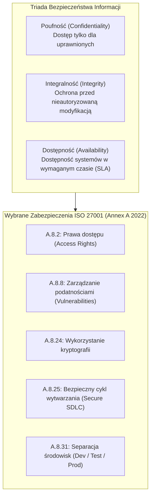
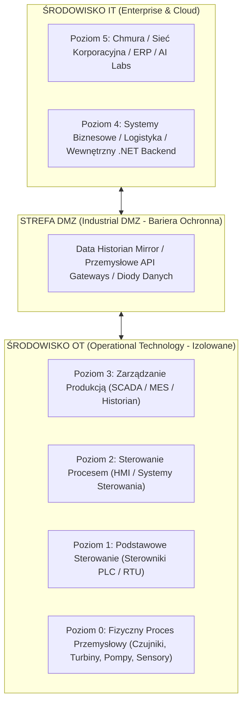
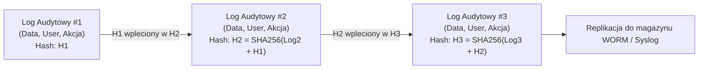
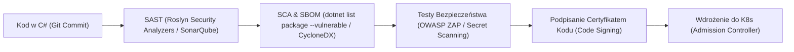

# Bezpieczeństwo Informacji, ISO 27001, Infrastruktura Krytyczna i Technologie OT w Architekturze .NET

W sektorze **infrastruktury krytycznej** (energetyka, gazownictwo, wodociągi, transport, przemysł chemiczny oraz telekomunikacja) inżynieria oprogramowania podlega rygorystycznym ramom prawnym i audytowym (m.in. unijna dyrektywa **NIS2**, **CER** oraz ustawa o Krajowym Systemie Cyberbezpieczeństwa). Kluczową rolę odgrywa tu wdrożenie i utrzymanie normy **ISO/IEC 27001** (System Zarządzania Bezpieczeństwem Informacji — SZBI / ISMS).

Dla programisty na poziomie **Senior .NET Developer** praca w takim środowisku oznacza wyjście poza standardowe pisanie kodu biznesowego — wymaga implementacji zaawansowanych zabezpieczeń na poziomie kodu, potoku CI/CD, kontroli tożsamości, nienaruszalnych rejestrów audytowych oraz zrozumienia specyfiki integracji systemów IT z **technologiami operacyjnymi (OT)**.

---

## Spis Treści
1. [Norma ISO/IEC 27001:2022 z Perspektywy Inżyniera Oprogramowania](#1-norma-isoiec-270012022-z-perspektywy-inżyniera-oprogramowania)
   - Triada CIA: Confidentiality, Integrity, Availability
   - Załącznik A (Annex A) i kluczowe domeny technologiczne
   - Wymóg pracy na zatwierdzonym sprzęcie, procedury czystego biurka i zasada Least Privilege
2. [Infrastruktura Krytyczna i Technologie Operacyjne (IT vs OT)](#2-infrastruktura-krytyczna-i-technologie-operacyjne-it-vs-ot)
   - Fundamentalna różnica celów: IT (Poufność danych) vs OT (Ciągłość działania i bezpieczeństwo fizyczne)
   - Architektura strefowa: Model Purdue (Purdue Enterprise Reference Architecture)
   - Strefy DMZ, diody danych (Data Diodes) i separacja sieciowa
3. [Architektura Bezpieczeństwa w Aplikacjach .NET / C#](#3-architektura-bezpieczeństwa-w-aplikacjach-net--c)
   - Uwierzytelnianie międzyserwisowe: **mTLS (Mutual TLS)** i weryfikacja certyfikatów X.509 w Kestrel
   - Zaawansowana autoryzacja: RBAC vs **ABAC (Attribute-Based Access Control)** z ASP.NET Core Policies
   - Szyfrowanie danych w spoczynku i w tranzycie (TDE, Always Encrypted, Data Protection API)
   - **Nienaruszalny Rejestr Audytowy (Immutable Audit Logging)** z kryptograficznym podpisem (HMAC / Blockchain / WORM)
   - Zarządzanie sekretami i tożsamościami maszynowymi (Vault, Managed Identity, rotacja kluczy)
4. [Bezpieczny Cykl Wytwarzania Oprogramowania (DevSecOps & Secure SDLC)](#4-bezpieczny-cykl-wytwarzania-oprogramowania-devsecops--secure-sdlc)
   - SAST (Statyczna analiza kodu i reguły Roslyn Security Analyzers)
   - SCA (Software Composition Analysis) i generowanie SBOM (CycloneDX / SPDX)
   - Bezpieczne zarządzanie zależnościami NuGet (Lockfiles, Private Feeds, Package Signing)
5. [Pytania Rekrutacyjne z Odpowiedziami (Senior Security FAQ)](#5-pytania-rekrutacyjne-z-odpowiedziami-senior-security-faq)
   - Pytania z zakresu ISO 27001, IT/OT i architektury bezpieczeństwa .NET
   - Scenariusze Awaryjne i Live-fire Incident Response
6. [Tablica Szybkiej Powtórki (Cheat-Sheet)](#6-tablica-szybkiej-powtórki-cheat-sheet)

---

## 1. Norma ISO/IEC 27001:2022 z Perspektywy Inżyniera Oprogramowania

Norma **ISO/IEC 27001** to międzynarodowy standard definiujący wymagania dla Systemu Zarządzania Bezpieczeństwem Informacji (**ISMS**). Certyfikacja organizacji oznacza, że wszystkie procesy — w tym inżynieria i wdrażanie oprogramowania — podlegają sformalizowanej analizie ryzyka i ciągłemu doskonaleniu (cykl Deminga: PDCA).



### Kluczowe Wymogi dla Programisty w Organizacji z ISO 27001:
1. **Praca wyłącznie na zatwierdzonym sprzęcie i łączności:**
   - Zakaz używania prywatnych urządzeń (BYOD) do kodu produkcyjnego. Sprzęt firmowy posiada szyfrowanie dysków (BitLocker), zablokowane porty USB, wymuszony EDR (Endpoint Detection and Response) oraz tunel VPN z uwierzytelnianiem wieloskładnikowym (MFA).
2. **Separacja środowisk i danych (A.8.31):**
   - Środowiska deweloperskie, testowe i produkcyjne są całkowicie odseparowane sieciowo i uprawnieniowo.
   - **Zakaz używania realnych danych produkcyjnych (zwłaszcza PII lub danych infrastrukturalnych) w środowiskach deweloperskich i testowych.** Wszelkie dane testowe muszą być syntetyczne lub zanonimizowane/zamaskowane.
3. **Zasada Najmniejszych Uprawnień (Principle of Least Privilege):**
   - Programista nie posiada praw administratora w bazie produkcyjnej ani dostępu do produkcyjnych klastrów K8s. Wdrożenia są w 100% zautomatyzowane przez potoki CI/CD.

---

## 2. Infrastruktura Krytyczna i Technologie Operacyjne (IT vs OT)

Jednym z najważniejszych aspektów pracy inżyniera w infrastrukturze krytycznej jest zrozumienie styku świata **IT (Information Technology)** ze światem **OT (Operational Technology)**.

### Model Purdue (ISA-95) w Architekturze Przemysłowej



| Kryterium | Środowisko IT (Information Technology) | Środowisko OT (Operational Technology) |
| :--- | :--- | :--- |
| **Główny Priorytet** | **Poufność** (Confidentiality) > Integralność > Dostępność | **Dostępność i Bezpieczeństwo Fizyczne** (Safety & Availability) > Integralność > Poufność |
| **Tolerancja na opóźnienia** | Akceptowalne opóźnienia sekundowe | Ścisły czas rzeczywisty (milisekundy / mikrosekundy) |
| **Skutek awarii systemu** | Strata finansowa, niedostępność aplikacji webowej | **Katastrofa fizyczna, wybuch, wyłączenie sieci energetycznej, zagrożenie życia ludzkiego** |
| **Cykl życia oprogramowania**| Ciągłe wdrożenia (CI/CD, rolling updates, minuty/dni) | Systemy pracujące bez restartu przez 10–20 lat; okna serwisowe raz na kwartał/rok |
| **Protokoły komunikacyjne** | HTTP/REST, gRPC, WebSocket, AMQP, Kafka | Modbus TCP, OPC UA, DNP3, IEC 60870-5-104, Profinet |

> [!IMPORTANT]
> **Zasada Izolacji IT/OT:** Bezpośrednia komunikacja między aplikacją backendową .NET w sieci korporacyjnej a sterownikiem PLC na linii produkcyjnej jest **bezwzględnie zabroniona**. Wszelka wymiana danych odbywa się przez strefę buforową **Industrial DMZ (IDMZ)**, np. z wykorzystaniem brokera OPC UA lub bazy danych typu Historian (np. InfluxDB/Timescale/OSIsoft PI).

---

## 3. Architektura Bezpieczeństwa w Aplikacjach .NET / C#

### Uwierzytelnianie Międzyserwisowe: mTLS (Mutual TLS)
W środowiskach *Zero Trust* systemy nie ufają sieci lokalnej. Każde wywołanie między mikroserwisami wymaga uwierzytelnienia nie tylko klienta, ale i serwera za pomocą certyfikatów X.509.

Konfiguracja mTLS w Kestrel (.NET 8/9):

```csharp
var builder = WebApplication.CreateBuilder(args);

builder.WebHost.ConfigureKestrel(options =>
{
    options.ConfigureHttpsDefaults(httpsOptions =>
    {
        httpsOptions.ClientCertificateMode = ClientCertificateMode.RequireCertificate;
        httpsOptions.CheckCertificateRevocation = true; // Weryfikacja listy CRL
        httpsOptions.ClientCertificateValidation = (cert, chain, errors) =>
        {
            // Rygorystyczna walidacja odcisku palca (Thumbprint) lub wystawcy certyfikatu CA
            return chain?.ChainElements
                .Any(c => c.Certificate.Thumbprint.Equals("TRUSTED_CA_THUMBPRINT", StringComparison.OrdinalIgnoreCase)) ?? false;
        };
    });
});
```

---

### Zaawansowana Autoryzacja: ABAC z ASP.NET Core Policies
Prosty model RBAC (np. `[Authorize(Roles = "Admin")]`) jest niewystarczający w infrastrukturze krytycznej. Stosuje się model **ABAC (Attribute-Based Access Control)**, biorący pod uwagę kontekst żądania (strefa sieciowa, czas operacji, certyfikat bezpieczeństwa, atrybuty zasobu):

```csharp
// Wymóg autoryzacyjny: Operator może przełączyć stację tylko ze strefy bezpiecznej
public record CriticalInfrastructureRequirement(string RequiredClearanceLevel) : IAuthorizationRequirement;

public class CriticalInfrastructureAuthHandler : AuthorizationHandler<CriticalInfrastructureRequirement>
{
    protected override Task HandleRequirementAsync(
        AuthorizationHandlerContext context, 
        CriticalInfrastructureRequirement requirement)
    {
        var user = context.User;
        var clearance = user.FindFirst("ClearanceLevel")?.Value;
        var ipZone = user.FindFirst("NetworkZone")?.Value;

        // Warunek ABAC: Wymagany poziom uprawnień ORAZ dostęp wyłącznie z sieci wewnętrznej OT-DMZ
        if (clearance == requirement.RequiredClearanceLevel && ipZone == "SecureIndustrialDMZ")
        {
            context.Succeed(requirement);
        }

        return Task.CompletedTask;
    }
}
```

---

### Nienaruszalny Rejestr Audytowy (Immutable Audit Logging)
W audycie ISO 27001 logi audytowe muszą gwarantować, że nikt — nawet administrator bazy danych (DBA) — nie może zmodyfikować ani usunąć wpisów historycznych bez natychmiastowego wykrycia fałszerstwa.



Implementacja łańcucha kryptograficznego w C#:

```csharp
public class AuditLogEntry
{
    public long Id { get; set; }
    public DateTime TimestampUtc { get; set; }
    public string UserId { get; set; } = string.Empty;
    public string Action { get; set; } = string.Empty;
    public string EntityDataJson { get; set; } = string.Empty;
    public string PreviousHash { get; set; } = string.Empty; // Hash poprzedniego rekordu
    public string CurrentHash { get; set; } = string.Empty;  // SHA256(Id + Timestamp + UserId + Action + Data + PreviousHash)

    public void ComputeHash(HMACSHA256 hmac, string previousHash)
    {
        PreviousHash = previousHash;
        var rawPayload = $"{Id}|{TimestampUtc:O}|{UserId}|{Action}|{EntityDataJson}|{PreviousHash}";
        var hashBytes = hmac.ComputeHash(Encoding.UTF8.GetBytes(rawPayload));
        CurrentHash = Convert.ToHexString(hashBytes);
    }
}
```

---

## 4. Bezpieczny Cykl Wytwarzania Oprogramowania (DevSecOps & Secure SDLC)

Zgodnie z normą ISO 27001 (wymóg A.8.25), bezpieczeństwo musi być integralnym elementem potoku CI/CD (*Shift Left Security*), a nie jednorazowym audytem przed wydaniem wersji.



1. **Wykrywanie podatności w bibliotekach zewnętrznych (SCA):**
   Automatyczna weryfikacja w potoku CI/CD komendą CLI platformy .NET:
   ```bash
   dotnet list package --vulnerable --include-transitive
   ```
2. **Generowanie SBOM (Software Bill of Materials):**
   Wymóg regulacyjny NIS2. Wykaz wszystkich bezpośrednich i przechodnich komponentów aplikacji generowany za pomocą `Microsoft.SourceLink` lub narzędzia `dotnet-project-licenses`.
3. **Secret Scanning:**
   Wymuszenie narzędzi typu `gitleaks` lub `trufflehog` w pre-commit hookach, aby uniemożliwić przypadkowe wypchnięcie klucza prywatnego lub hasła do repozytorium Git.

---

## 5. Pytania Rekrutacyjne z Odpowiedziami (Senior Security FAQ)

### Pytanie 1: W jaki sposób przygotowałbyś architekturę aplikacji .NET do przejścia audytu certyfikacyjnego ISO 27001 w obszarze zarządzania dostępem i bezpieczeństwa danych?
**Odpowiedź:**
Skupiłbym się na 4 filarach technicznych:
1. **Zarządzanie tożsamością i Least Privilege:** Eliminacja lokalnych kont i haseł w konfiguracjach na rzecz centralnego IdP (np. Entra ID / Keycloak) z protokołem OpenID Connect. Wykorzystanie Managed Identities do komunikacji z bazami danych (np. Azure SQL / AWS IAM Auth), co eliminuje przechowywanie connection stringów.
2. **Kryptografia w spoczynku i w tranzycie:** Wymuszenie TLS 1.3 dla wszystkich punktów końcowych Kestrel oraz mTLS dla komunikacji wewnętrznej. Szyfrowanie wrażliwych pól w bazie (np. Always Encrypted z kluczem w dedykowanym module HSM / Key Vault).
3. **Niezaprzeczalny audyt (Audit Logging):** Rejestrowanie każdego zdarzenia biznesowego (kto, co, kiedy, stan przed/po) w modelu tylko do zapisu (WORM lub łańcuch hashujący HMAC). Odseparowanie uprawnień do logów — programiści i administratorzy nie mogą mieć uprawnień do modyfikacji bazy audytowej.
4. **Zabezpieczenie potoku CI/CD (Secure SDLC):** Wdrożenie SAST (analiza statyczna kodu), SCA (skanowanie bibliotek NuGet pod kątem CVE) oraz automatyczne podpisywanie binariów (Code Signing) przed wdrożeniem na produkcję.

---

### Pytanie 2: Czym różni się podejście do bezpieczeństwa w środowisku IT od środowiska OT (Technologii Operacyjnych) i jak ta różnica wpływa na architekturę backendu .NET?
**Odpowiedź:**
W tradycyjnym IT priorytetem jest poufność danych (**Confidentiality**), po której następuje integralność i dostępność. W środowisku OT najważniejsze jest **bezpieczeństwo fizyczne i ciągłość procesu przemysłowego (Safety & Availability)**. Zatrzymanie serwisu webowego w IT oznacza niedogodność dla użytkowników; zatrzymanie systemu OT w elektrowni lub rafinerii grozi awarią infrastruktury krajowej lub zagrożeniem życia ludzkiego.

**Wpływ na backend .NET:**
1. **Ścisła separacja:** Aplikacja .NET nigdy nie łączy się bezpośrednio z urządzeniami OT (PLC, sensory) wewnątrz sieci przemysłowej. Komunikuje się wyłącznie z pośrednimi warstwami w strefie DMZ (np. brokery OPC UA, bazy Historian).
2. **Brak operacji blokujących:** Architektura musi być asynchroniczna i odporna na przestoje sieciowe (odporne buforowanie wiadomości w pamięci lub kolejce dyskowej).
3. **Idempotentność i niezawodność:** Komendy sterujące przesyłane do OT muszą być bezwzględnie idempotentne, aby ich ponowienie po awarii sieci nie spowodowało podwójnego otwarcia zaworu czy wyłączenia generatora.

---

### Pytanie 3: Jak zaimplementować bezpieczne przechowywanie i rotację sekretów (np. haseł do baz PostgreSQL/MSSQL) w ASP.NET Core bez przestojów produkcyjnych?
**Odpowiedź:**
1. **Użycie dostawcy konfiguracji Key Vault / HashiCorp Vault:** Konfiguracja aplikacji ładuje sekrety dynamicznie przez dostawcę `Azure.Extensions.AspNetCore.Configuration.Secrets` lub Vault API.
2. **Brak sekretów w repozytorium:** Pliki `appsettings.json` zawierają jedynie placeholdery lub strukturę konfiguracji; fizyczne hasła są wstrzykiwane w środowisku uruchomieniowym.
3. **Wsparcie dla rotacji z `IOptionsSnapshot<T>` lub `IOptionsMonitor<T>`:** Standardowe wstrzyknięcie `IOptions<T>` jest Singletonem i nie widzi zmian wartości w czasie działania. `IOptionsMonitor<T>` pozwala na subskrypcję zmian wartości w locie.
4. **Preferowane podejście bezhasłowe (Passwordless):** Wykorzystanie tożsamości zarządzanych (**Managed Identity / Kerberos / mTLS**) do łączenia się z bazą danych MS SQL lub PostgreSQL. Wtedy hasło w ogóle nie istnieje — token dostępowy jest generowany krótkoterminowo i automatycznie odświeżany przez bibliotekę kliencką.

---

### Pytanie 4: W jaki sposób zabezpieczysz aplikację .NET przed podatnościami typu Remote Code Execution (RCE) związanymi z deserializacją danych?
**Odpowiedź:**
Historycznie platforma .NET posiadała podatne formatery binarne (`BinaryFormatter`, `NetDataContractSerializer`, `SoapFormatter`), które podczas deserializacji wykonywały kod na podstawie typów zawartych w strumieniu danych.
**Dobre praktyki:**
1. **Całkowita eliminacja `BinaryFormatter`:** W .NET 8/9 `BinaryFormatter` jest domyślnie zablokowany i oznaczony jako krytycznie niebezpieczny (`Obsolete` z błędem kompilacji).
2. **Stosowanie bezpiecznych serializatorów:** Użycie `System.Text.Json` w trybie silnie typowanym (deserializacja do konkretnych klas DTO bez polimorfizmu opartego na dowolnych nazwach typów z zewnątrz).
3. Jeśli wymagany jest polimorfizm w JSON, należy stosować atrybuty `[JsonPolymorphic]` z jawną, ograniczoną listą dozwolonych typów pochodnych (`[JsonDerivedType]`), co uniemożliwia wstrzyknięcie niebezpiecznego typu systemowego.

---

### Pytanie 5 (Scenariusz Awaryjny Live-Fire Incident Response): System SIEM zgłasza anomalię: z konta serwisowego aplikacji .NET w nocy wykonano zapytanie SQL eksportujące 500 000 rekordów klientów. Jak inżynier reaguje na taki incydent zgodnie z procedurami ISO 27001?
**Procedura Reagowania (Incident Response zgodny z ISO 27001 A.5.24 - A.5.28):**
1. **Izolacja i ograniczenie strat (Containment):**
   - Natychmiastowe zablokowanie/unieważnienie tokena lub rotacja hasła konta serwisowego.
   - Odcięcie podejrzanej instancji aplikacji z sieci (np. zmiana reguł Network Security Group / odpięcie poda z klastra K8s), z zachowaniem stanu pamięci RAM do analizy powłamaniowej (Forensics).
2. **Zachowanie materiału dowodowego (Evidence Preservation):**
   - Zabezpieczenie zrzutów pamięci procesu, logów kontenera oraz logów bazy danych SQL przed ich nadpisaniem przez proces retencji.
   - Sprawdzenie kryptograficznego rejestru audytowego w celu weryfikacji, czy sam rejestr logów nie został zmanipulowany.
3. **Analiza przyczyny źródłowej (Root Cause Analysis - RCA):**
   - Ustalenie wektora ataku: czy doszło do wycieku sekretu (np. connection string w logach), podatności SQL Injection, czy kompromitacji tożsamości tożsamości dewelopera.
4. **Usunięcie podatności i przywrócenie (Eradication & Recovery):**
   - Załatanie podatności w kodzie, wdrożenie nowej wersji i przywrócenie usług w stanie bezpiecznym.
5. **Raportowanie i wnioski poincydentalne (Post-Incident Review):**
   - Zgłoszenie incydentu do CISO/DPO w organizacji oraz, jeśli wyciekły dane osobowe, zgłoszenie do organu nadzorczego (UODO) w wymaganym prawem terminie (72 godziny).
   - Wdrożenie działań korygujących (CAPA) zapobiegających powtórzeniu incydentu.

---

## 6. Tablica Szybkiej Powtórki (Cheat-Sheet)

| Koncepcja | Rola w Systemie Regulowanym | Standard / Technologia | Najczęstsze Zagrożenie |
| :--- | :--- | :--- | :--- |
| **ISO 27001** | Międzynarodowy standard ISMS / SZBI | Cykl PDCA, Załącznik A | Traktowanie procedur czysto formalnie ("papierologia") |
| **Model Purdue** | Podział sieci przemysłowej na strefy (L0–L5)| ISA-95, Industrial DMZ | Bezpośrednie połączenie IT z urządzeniami OT |
| **mTLS** | Obustronna autoryzacja kryptograficzna | Certyfikaty X.509, TLS 1.3 | Ignorowanie weryfikacji unieważnienia (CRL/OCSP) |
| **ABAC** | Autoryzacja na podstawie cech i kontekstu | ASP.NET Core Policies | Przekazywanie uprawnień bez weryfikacji strefy sieciowej |
| **Immutable Audit**| Nienaruszalna historia operacji | Łańcuchy HMAC, WORM | Możliwość modyfikacji logów przez DBA |
| **Passwordless** | Dostęp do bazy bez haseł w configu | Managed Identity, Kerberos | Zapisywanie haseł plain-text w `appsettings.json` |
| **SBOM** | Wykaz wszystkich komponentów w aplikacji | CycloneDX, SPDX (NIS2) | Nieświadome używanie bibliotek z lukami CVE |
