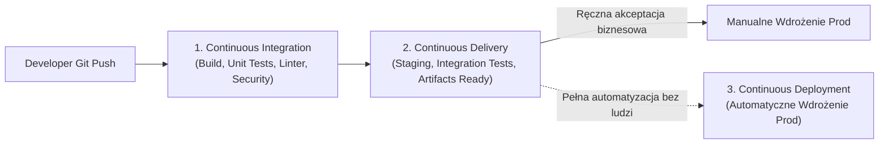
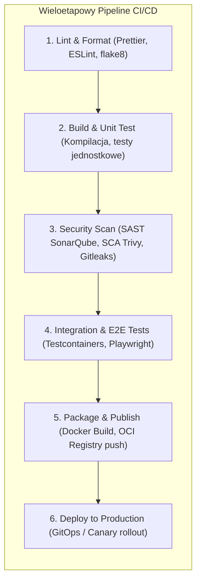
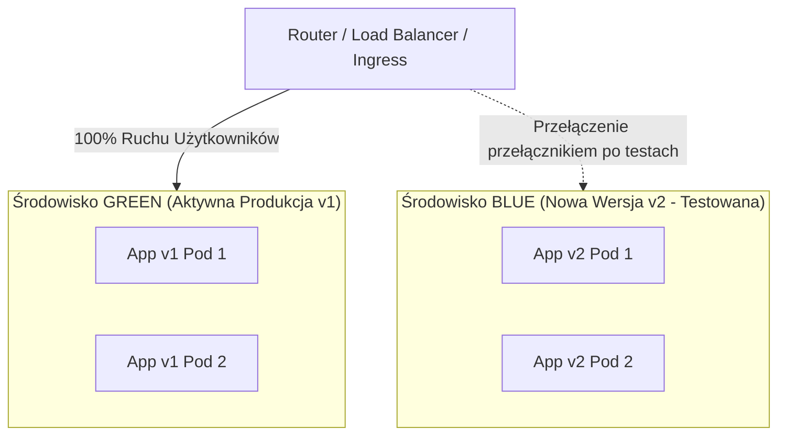
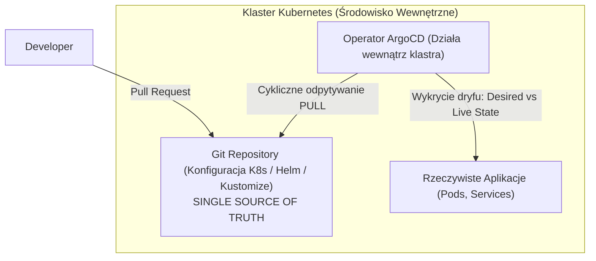
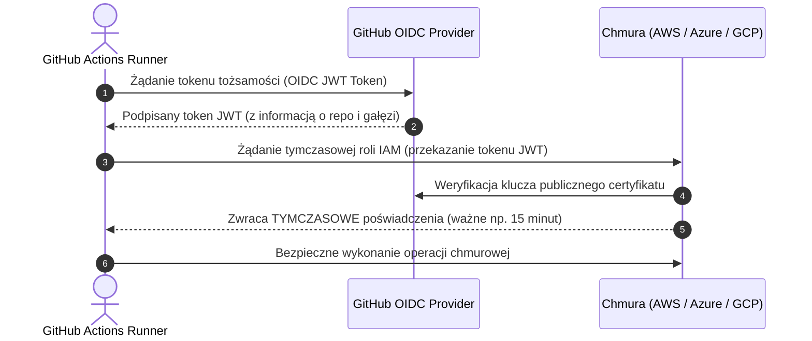

# CI/CD: Architektura Pipeline'ów, GitOps i Pytania Rekrutacyjne

Kompleksowe kompendium inżynierskie poświęcone metodykom ciągłej integracji (**Continuous Integration**), ciągłego dostarczania (**Continuous Delivery**) oraz ciągłego wdrażania (**Continuous Deployment**). Obejmuje architekturę nowoczesnych pipeline'ów (GitHub Actions, GitLab CI), strategie bezprzerwowego wdrażania (Zero-Downtime: Blue-Green, Canary, Rolling), paradygmat **GitOps** (ArgoCD), bezpieczeństwo tożsamościowe **OIDC** oraz zestaw zaawansowanych pytań rekrutacyjnych i scenariuszy awaryjnych (od poziomu Mid do Staff / DevOps Architect).

---

## Spis Treści
1. [Filary CI/CD i Ewolucja Wytwarzania Oprogramowania](#1-filary-cicd-i-ewolucja-wytwarzania-oprogramowania)
   - Różnice pojęciowe: Continuous Integration vs Delivery vs Deployment
   - Pętla sprzężenia zwrotnego (Feedback Loop) i zasada Fail-Fast
   - Przejście do Pipeline as Code
2. [Architektura Nowoczesnego Pipeline'u CI/CD](#2-architektura-nowoczesnego-pipelineu-cicd)
   - Agenci i Runnery (Hosted vs Self-Hosted / Ephemeral Containers)
   - Zarządzanie pamięcią: Dependency Cache vs Build Artifacts
   - Przesunięcie w Lewo (Shift-Left) i Filar DevSecOps (SAST, DAST, SCA, Secret Scanning)
3. [Strategie Wdrażania Oprogramowania (Zero-Downtime Deployment)](#3-strategie-wdrażania-oprogramowania-zero-downtime-deployment)
   - Rolling Update (Wdrożenie kroczące)
   - Blue-Green Deployment (Niebiesko-Zielone)
   - Canary Release (Wdrożenie kanarkowe)
   - Dark Launching i Feature Flags
   - Wzorzec Rozszerz-Zwiń (Expand/Contract) dla migracji baz danych
4. [GitOps: Rewolucja Modelu Dostarczania (Push vs Pull)](#4-gitops-rewolucja-modelu-dostarczania-push-vs-pull)
   - Tradycyjny model Push-based i jego wady bezpieczeństwa
   - Model Pull-based GitOps (ArgoCD, Flux): Git jako Single Source of Truth
   - Detekcja i eliminacja dryfu konfiguracji (Configuration Drift)
5. [Bezpieczeństwo i Tożsamość: Federacja OIDC](#5-bezpieczeństwo-i-tożsamość-federacja-oidc)
   - Eliminacja stałych sekretów (Koniec z `AWS_ACCESS_KEY_ID` w repozytorium)
   - OpenID Connect (OIDC) i Workload Identity Federation
6. [Pytania Rekrutacyjne z Odpowiedziami (FAQ Interview)](#6-pytania-rekrutacyjne-z-odpowiedziami-faq-interview)
   - Pytania Podstawowe i Średniozaawansowane (Mid)
   - Pytania Zaawansowane i Architektoniczne (Senior / DevOps Architect)
   - Scenariusze Awaryjne i Live-fire Troubleshooting
7. [Tablica Szybkiej Powtórki (Cheat-Sheet)](#7-tablica-szybkiej-powtórki-cheat-sheet)

---

## 1. Filary CI/CD i Ewolucja Wytwarzania Oprogramowania

W tradycyjnym modelu kaskadowym (Waterfall) integracja kodu następowała pod koniec wielomiesięcznych cykli, co prowadziło do tzw. **Integration Hell** — sytuacji, w której łączenie zmian od dziesiątek programistów trwało tygodniami i paraliżowało wydania.

CI/CD przekształciło ten proces w ciągły, w pełni zautomatyzowany przepływ:



### Różnice Definiujące CI vs CD:
1. **Continuous Integration (CI):**
   - Praktyka częstego scalania kodu przez programistów do głównej gałęzi (przynajmniej raz dziennie w Trunk-Based Development).
   - Każdy push uruchamia zautomatyzowany proces budowania i zestaw testów jednostkowych/integracyjnych.
   - **Cel:** Natychmiastowe wykrycie regresji w myśl zasady **Fail-Fast** (wczesne błędy są najtańsze w naprawie).
2. **Continuous Delivery (CD):**
   - Rozszerzenie CI: każdy pomyślny build automatycznie tworzy sprawdzony, gotowy do wdrożenia artefakt (np. skonteneryzowany obraz Docker, pakiet NuGet/npm) i wdraża go na środowiska testowe/stagingowe.
   - Wdrożenie na środowisko produkcyjne wymaga **jednego kliknięcia** człowieka (bramka biznesowa / approval gate).
3. **Continuous Deployment (CD):**
   - Najwyższy poziom dojrzałości inżynierskiej: każda zmiana, która przeszła pomyślnie wszystkie etapy weryfikacji w pipeline, trafia **bez jakiejkolwiek ingerencji człowieka bezpośrednio na produkcję** w ciągu minut od zatwierdzenia PR.

---

## 2. Architektura Nowoczesnego Pipeline'u CI/CD

Współczesny pipeline definiowany jest w całości jako kod (**Pipeline as Code** — np. `.github/workflows/*.yml` w GitHub Actions lub `.gitlab-ci.yml` w GitLab CI).



### Agenci i Runnery
* **Hosted Runners (Chmurowe):** Zarządzane przez dostawcę (np. maszyny wirtualne Azure/AWS zarządzane przez GitHub). Zawsze czyste środowisko, ale wyższy koszt i brak kontroli nad siecią wewnętrzną.
* **Self-Hosted / Ephemeral Runners:** Własne maszyny wirtualne lub pule kontenerów w klastrze Kubernetes (**Actions Runner Controller — ARC**). Uruchamiane w trybie efemerycznym (kontener powstaje na czas jednego zadania i jest natychmiast niszczony, co gwarantuje pełną izolację bezpieczeństwa).

### Zarządzanie Pamięcią Podręczną (Cache vs Artifacts)
* **Dependency Cache (np. `actions/cache`):** Służy do zachowywania niezmiennych bibliotek (`node_modules`, pakiety pip, `.m2/repository`, cache NuGet) pomiędzy kolejnymi uruchomieniami pipeline'u w celu skrócenia czasu budowania.
* **Build Artifacts:** Pliki wygenerowane w jednym etapie (np. skompilowana aplikacja `/dist` lub raporty pokrycia testów), które muszą zostać jawnie przekazane do kolejnych etapów tego samego uruchomienia.

### Filar DevSecOps: Przesunięcie w Lewo (Shift-Left Security)
Wstrzykiwanie weryfikacji bezpieczeństwa na jak najwcześniejszym etapie:
1. **SAST (Static Application Security Testing):** Analiza kodu źródłowego pod kątem podatności (np. podatność na SQL Injection, błędy kryptograficzne — SonarQube, Semgrep).
2. **SCA (Software Composition Analysis):** Skanowanie bibliotek open-source i zależności pod kątem znanych luk CVE (np. Snyk, Trivy, Dependabot).
3. **Secret Scanning:** Blokowanie commitów zawierających przypadkowo zahardcodowane klucze API, certyfikaty i hasła (Gitleaks, TruffleHog).
4. **DAST (Dynamic Application Security Testing):** Skanowanie uruchomionej aplikacji od zewnątrz metodami czarnej skrzynki (OWASP ZAP).

---

## 3. Strategie Wdrażania Oprogramowania (Zero-Downtime Deployment)

Wdrażanie nowych wersji aplikacji produkcyjnej bez przerywania obsługi użytkowników (**Zero-Downtime**) wymaga przemyślanych strategii architektonicznych:

### 1. Rolling Update (Wdrożenie Kroczące)
Domyślna strategia w klastrach **Kubernetes**:
* Nowe instancje (Pody w wersji v2) są uruchamiane stopniowo, a stare instancje (v1) są wygaszane dopiero wtedy, gdy nowa instancja pomyślnie przejdzie weryfikację gotowości (**Readiness Probe**).
* *Ograniczenie:* W trakcie wdrożenia w klastrze współistnieją równolegle wersje v1 i v2. Baza danych musi być w 100% kompatybilna wstecznie.

---

### 2. Blue-Green Deployment (Niebiesko-Zielone)



* Utrzymywane są dwa identyczne środowiska produkcyjne: **Green** (aktualnie obsługuje 100% ruchu) oraz **Blue** (bierne).
* Nowa wersja v2 jest wdrażana na środowisku Blue, gdzie zespół wykonuje dymne testy produkcyjne (Smoke Tests).
* Następnie Load Balancer natychmiastowo przepina ruch z Green na Blue.
* **Główna zaleta:** Błyskawiczny, natychmiastowy **Rollback** — w razie awarii wystarczy przestawić router z powrotem na Green.

---

### 3. Canary Release (Wdrożenie Kanarkowe)

```mermaid
flowchart LR
    Ingress["Ingress / API Gateway"] -->|95% Ruchu| Stable["Wersja Stabilna (v1)"]
    Ingress -->|5% Ruchu (Canary)| Canary["Wersja Nowa (v2)"]
    
    Canary --> Monitor["Prometheus / Datadog\n(Monitoring Error Rate, Latency)"]
    Monitor -->|Metryki OK| Promote["Stopniowe zwiększanie ruchu:\n10% -> 25% -> 50% -> 100%"]
    Monitor -->|Wzrost błędów 5xx| AutoRollback["Automatyczne wycofanie (Rollback)"]
```

* Nazwa nawiązuje do kanarków zabieranych przez górników do kopalń (wczesne ostrzeganie przed gazem).
* Nowa wersja v2 otrzymuje niewielki ułamek rzeczywistego ruchu (np. 2-5%). Narzędzia orkiestracji (np. **Flagger**, **Argo Rollouts**) analizują metryki telemetryczne (odsetek błędów HTTP 5xx, opóźnienia P99). Jeśli metryki są stabilne, ruch jest stopniowo zwiększany.

---

### 4. Wzorzec Rozszerz-Zwiń (Expand/Contract) dla Baz Danych
Największą przeszkodą w Zero-Downtime Deployment są **migracje schematu relacyjnej bazy danych**. Usunięcie kolumny lub zmiana jej nazwy natychmiast zabija działające stare instancje aplikacji.

```
Faza 1 (Expand):
Dodaj nową kolumnę 'full_name' obok starej 'name'. Aplikacja v1 czyta ze starej, aplikacja v2 zapisuje do obu.

Faza 2 (Transition):
Migracja danych w tle. Wdrożenie wersji v2, która czyta z 'full_name'.

Faza 3 (Contract):
Po upewnieniu się, że wersja v1 nie działa już na żadnym węźle, usuń starą kolumnę 'name'.
```

---

## 4. GitOps: Rewolucja Modelu Dostarczania (Push vs Pull)

### Dlaczego tradycyjny model Push-based jest problematyczny?
W tradycyjnym modelu (np. Jenkins czy GitHub Actions wdrażający do Kubernetes):
1. Narzędzie CI musi posiadać stałe, krytyczne uprawnienia administratora klastra (`kubeconfig` z prawami roota).
2. Naruszenie bezpieczeństwa serwera CI (np. podatność w runnerze) daje atakującemu natychmiastowy, pełny dostęp do wnętrza klastra produkcyjnego.
3. Jeśli ktoś dokona manualnej zmiany w klastrze (`kubectl edit deployment`), serwer CI o tym nie wie — powstaje niebezpieczny rozjazd (**Configuration Drift**).

---

### Model Pull-based GitOps (ArgoCD / Flux)



* **Zasady GitOps:**
  1. Cała pożądana konfiguracja infrastruktury i aplikacji jest zadeklarowana deklaratywnie w repozytorium **Git** (**Single Source of Truth**).
  2. Zmiany wprowadza się wyłącznie za pomocą **Pull Requestów** (pełna audytowalność, review, historia).
  3. **Wewnątrz klastra** działa dedykowany agent (np. **ArgoCD**), który stale porównuje stan zadeklarowany w Git (*Desired State*) ze stanem rzeczywistym w klastrze (*Live State*).
  4. W przypadku wykrycia manualnej modyfikacji w klastrze, ArgoCD automatycznie cofa nieautoryzowaną zmianę (**Self-Healing**).
  5. Żaden zewnętrzny serwer CI nie potrzebuje otwartych portów ani uprawnień do wnętrza klastra!

---

## 5. Bezpieczeństwo i Tożsamość: Federacja OIDC

Przez lata standardem w CI/CD było zapisywanie stałych tokenów i kluczy dostępowych (np. `AWS_ACCESS_KEY_ID` i `AWS_SECRET_ACCESS_KEY`) w zmiennych konfiguracyjnych repozytorium. Było to ogromne ryzyko wycieku sekretów.

### Standard OpenID Connect (OIDC) w CI/CD
Nowoczesne platformy (GitHub Actions, GitLab) eliminują potrzebę przechowywania jakichkolwiek haseł w repozytorium za pomocą **federacji tożsamości OIDC**:



* W repozytorium **nie ma żadnego klucza ani hasła**.
* Dostęp jest przyznawany dynamicznie na podstawie kryptograficznego potwierdzenia, że zapytanie pochodzi z konkretnego repozytorium i konkretnej gałęzi (np. `repo:my-org/my-app:ref:refs/heads/main`).

---

## 6. Pytania Rekrutacyjne z Odpowiedziami (FAQ Interview)

### Pytania Podstawowe i Średniozaawansowane (Mid)

#### P1: Jaka jest kluczowa różnica między Continuous Delivery a Continuous Deployment?
**Odpowiedź:**
Obie praktyki polegają na automatycznym testowaniu i przygotowywaniu artefaktów gotowych do wdrożenia.
* **Continuous Delivery:** Wdrożenie na środowisko produkcyjne wymaga manualnej decyzji człowieka (np. kliknięcie przycisku "Approve / Deploy" przez Product Ownera lub Release Managera).
* **Continuous Deployment:** Cały proces jest w 100% zautomatyzowany — każdy commit, który przeszedł pomyślnie wszystkie etapy weryfikacji jakościowej, trafia automatycznie bezpośrednio na produkcję bez żadnej ingerencji ludzkiej.

---

#### P2: Czym różni się Dependency Cache od Artifacts w pipeline CI/CD?
**Odpowiedź:**
* **Dependency Cache (np. cache pakietów npm, pip, maven):**
  - Służy do przyspieszania kolejnych uruchomień pipeline'u.
  - Jest pamięcią międzyuruchomieniową (współdzieloną w czasie).
  - W razie utraty cache'u pipeline nadal zakończy się sukcesem, pobierając pakiety z Internetu (cache nie jest krytyczny dla poprawności działania).
* **Build Artifacts:**
  - Są bezpośrednim produktem kompilacji danego konkretnego uruchomienia pipeline'u (np. pliki binarne `/dist`, paczka ZIP, raport testów).
  - Służą do przekazywania danych pomiędzy różnymi zadaniami (jobs) w ramach tego samego pipeline'u lub do archiwizacji wydań. Utrata artefaktu uniemożliwia dalsze wykonanie pipeline'u.

---

#### P3: Co to jest "Configuration Drift" i jak zapobiega mu architektura GitOps?
**Odpowiedź:**
* **Configuration Drift (Rozjazd konfiguracji):** Sytuacja, w której rzeczywisty stan infrastruktury lub aplikacji różni się od stanu zdefiniowanego w repozytorium kodu. Powstaje najczęściej w wyniku manualnych interwencji administratorów bezpośrednio na serwerach w trakcie awarii (tzw. "hotfixy na żywym organizmie").
* **Jak zapobiega GitOps?** W GitOps dedykowany operator (np. ArgoCD) stale monitoruje środowisko produkcyjne i porównuje je ze stanem zadeklarowanym w Git. W przypadku wykrycia jakichkolwiek rozbieżności, operator automatycznie nadpisuje samowolne zmiany stanem z Git (**Self-Healing / Auto-Sync**) lub natychmiast alarmuje zespół.

---

### Pytania Zaawansowane i Architektoniczne (Senior / DevOps Architect)

#### P4: Dlaczego używanie stałych kluczy dostępowych (np. AWS IAM User Access Keys) w CI/CD jest antywzorcem i jak rozwiązuje to federacja tożsamości OIDC?
**Odpowiedź:**
1. **Zagrożenia stałych kluczy:** Stałe poświadczenia zapisane w Secrets repozytorium nie wygasają. Mogą zostać przechwycone przez złośliwy kod w zależnościach open-source, wyciec w logach runnera lub pozostać aktywne po odejściu pracownika. Wymagają ciągłej, ryzykownej procedury rotacji.
2. **Rozwiązanie OIDC (OpenID Connect):**
   - Runner CI dynamicznie generuje podpisany kryptograficznie token tożsamości JWT, zawierający metadane (Claims: nazwa organizacji, repozytorium, gałąź, commit).
   - Dostawca chmury (np. AWS STS) weryfikuje podpis tokena z publicznym certyfikatem GitHub/GitLab i na jego podstawie wymienia go na **krótkotrwały token sesyjny** (np. ważny 15 minut) powiązany z dedykowaną rolą IAM.
   - W repozytorium nie istnieje żaden sekret, co całkowicie eliminuje wektor ataku związany z wyciekiem poświadczeń.

---

#### P5: Porównaj model Push-based CI/CD z modelem Pull-based GitOps pod kątem wektorów ataku i bezpieczeństwa sieciowego.
**Odpowiedź:**
* **Model Push (np. Jenkins / GitHub Actions wypychający zmiany do K8s):**
  - *Wektor ataku:* Serwer CI musi posiadać uprawnienia roota do klastra (`admin kubeconfig`) i musi mieć otwartą ścieżkę sieciową do API Servera Kubernetes z zewnątrz.
  - *Ryzyko:* Przełamanie zabezpieczeń runnera CI daje atakującemu pełną kontrolę nad całym klastrem produkcyjnym.
* **Model Pull / GitOps (np. ArgoCD działający wewnątrz K8s):**
  - *Bezpieczeństwo sieciowe:* API Server klastra może być całkowicie odcięty od publicznego Internetu (Private Cluster). Żadne porty nie muszą być otwarte na zewnątrz.
  - *Zasada najniższych uprawnień:* Operator działa wewnątrz klastra i wykonuje połączenia wychodzące wyłącznie do repozytorium Git (po HTTPS).
  - Narzędzia CI tracą uprawnienia wdrożeniowe — ich rola kończy się na zbudowaniu obrazu i zaktualizowaniu tagu w repozytorium konfiguracyjnym Git.

---

#### P6: Jak bezpiecznie przeprowadzić migrację bazy danych w architekturze bezprzerwowej (Zero-Downtime) ze strategią Blue-Green lub Rolling Update?
**Odpowiedź:**
Stosuje się wzorzec **Expand and Contract (Rozszerz i Zwiń)**, dzieląc zmiany na co najmniej dwa niezależne wdrożenia:
1. **Faza Rozszerzenia (Expand):**
   - Zmiany w bazie muszą być wyłącznie **addytywne i kompatybilne wstecznie**.
   - Jeśli chcemy zamienić kolumnę `address` na obiekt `street`, `city`, `zip`, dodajemy nowe kolumny zachowując starą. Nowa wersja aplikacji potrafi czytać ze starej i pisać do obu.
2. **Faza Tranzycji:**
   - Asynchroniczny skrypt w tle przepisuje historyczne rekordy do nowych kolumn.
3. **Faza Zwinięcia (Contract):**
   - Po całkowitym zakończeniu wdrożenia nowej wersji aplikacji na wszystkich węzłach i upewnieniu się, że żaden proces nie odwołuje się do starej kolumny, w kolejnym osobnym wdrożeniu usuwa się zdezaktualizowaną kolumnę `address`.

---

### Scenariusze Awaryjne i Live-fire Troubleshooting

#### Scenariusz 1: Pipeline CI wykonujący testy integracyjne nagle wydłużył czas działania z 6 minut do 45 minut, blokując kolejkę wdrożeń zespołu.
**Diagnoza i Plan Naprawczy:**
1. **Identyfikacja wąskiego gardła:** Przegląd czasów wykonania poszczególnych etapów (Job Duration).
2. **Typowe przyczyny i rozwiązania:**
   - **Utrata pamięci podręcznej (Cache Invalidation):** Zmiana pliku `package-lock.json` lub `pom.xml` spowodowała pobieranie wszystkich zależności od zera na każdym runnerze. Rozwiązanie: naprawa kluczy cache'a i weryfikacja polityki retencji.
   - **Sekwencyjne wykonywanie testów:** Wszystkie testy integracyjne działają na jednym rdzeniu. Rozwiązanie: macierz testów (**Matrix Strategy** / test sharding) dzieląca suite testowy na 4-8 równoległych workerów.
   - **Brak cache'owania warstw Docker (BuildKit):** Każdy build pobiera i kompiluje obraz bazowy od nowa. Rozwiązanie: włączenie `--cache-from` oraz eksport cache'u do rejestru kontenerów OCI.

---

#### Scenariusz 2: Operator ArgoCD zgłasza nieustanny status `OutOfSync` dla deploymentu, wpadając w pętlę ciągłej synchronizacji, mimo braku nowych commitów w Git.
**Diagnoza i Rozwiązanie:**
1. **Przyczyna:** W klastrze Kubernetes działa zewnętrzny kontroler lub **Mutating Admission Webhook** (np. Linkerd/Istio wstrzykujące kontenery sidecar lub mechanizm Horizontal Pod Autoscaler nadpisujący pole `replicas`).
2. **Efekt:** ArgoCD porównuje stan z Git (`replicas: 3`) ze stanem rzeczywistym nadpisanym przez HPA (`replicas: 8`), uznaje to za rozjazd i bezskutecznie próbuje przywrócić wartość 3.
3. **Rozwiązanie:** Skonfigurowanie w definicji `Application` reguły ignorowania konkretnych pól dynamicznych:
   ```yaml
   spec:
     ignoreDifferences:
     - group: apps
       kind: Deployment
       jsonPointers:
       - /spec/replicas
   ```

---

## 7. Tablica Szybkiej Powtórki (Cheat-Sheet)

| Zagadnienie | Słowa Kluczowe i Niskopoziomowe Koncepcje |
| :--- | :--- |
| **Pojęcia Podstawowe** | CI (integracja kodu, testy), CDeliver (gotowy pakiet, manual gate), CDeploy (100% auto-prod) |
| **Architektura** | Pipeline as Code, Ephemeral Runners (ARC na K8s), Dependency Cache vs Build Artifacts |
| **DevSecOps** | Shift-Left, SAST (kod statyczny), SCA (podatności bibliotek CVE), Secret Scanning, DAST |
| **Strategie Zero-Downtime** | Rolling Update (krocząca), Blue-Green (router switch, szybki rollback), Canary (analiza metryk % ruchu) |
| **Bazy Danych Zero-Downtime**| Wzorzec Expand and Contract (kompatybilność wsteczna zmian schematu) |
| **GitOps** | Git jako Single Source of Truth, Model Pull (ArgoCD/Flux wewnątrz klastra), Self-Healing, brak driftu |
| **Bezpieczeństwo Chmury** | Federacja OIDC, brak stałych haseł w repozytorium, krótkotrwałe tokeny sesyjne JWT |
| **Troubleshooting CI** | Test Sharding (Matrix builds), Warstwy Docker BuildKit cache, `ignoreDifferences` w ArgoCD |
