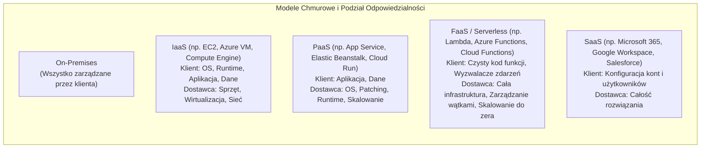
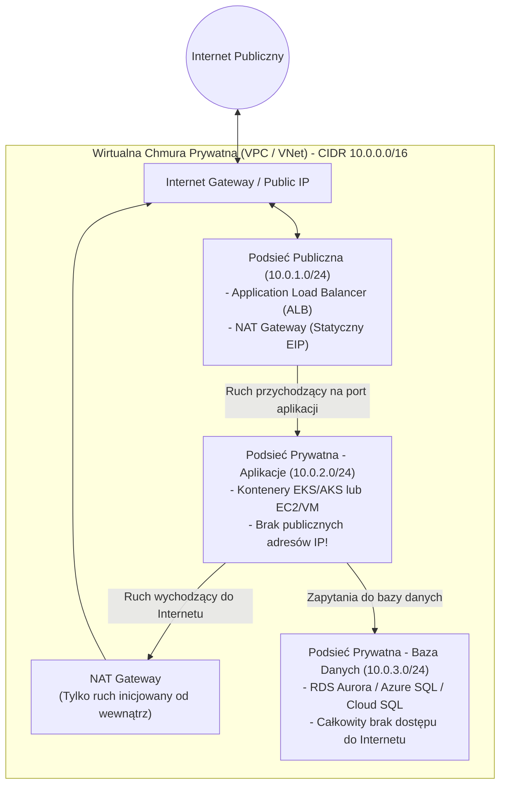
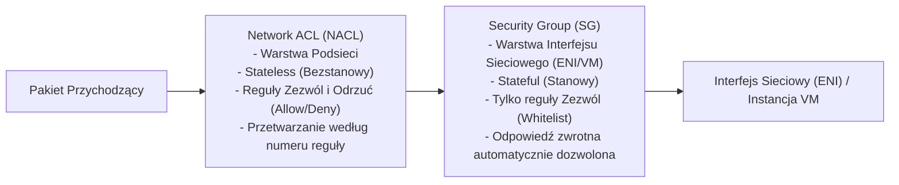
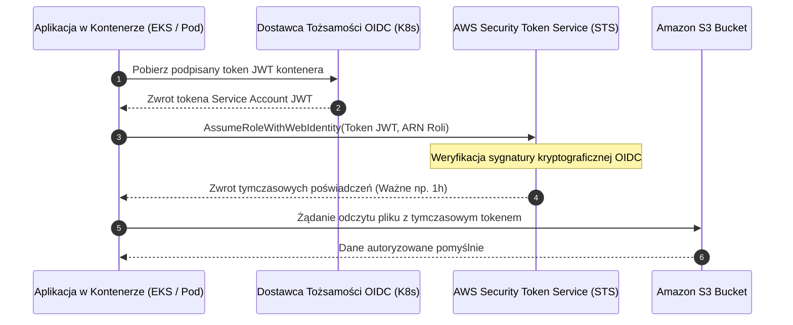
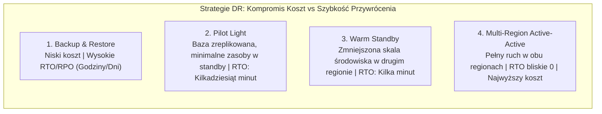

# Chmura Obliczeniowa: AWS, Azure i Google Cloud — Architektura, Porównanie Usług i Pytania Rekrutacyjne

Kompleksowe kompendium inżynierskie poświęcone architekturze chmury obliczeniowej (*Cloud Computing*) ze szczególnym uwzględnieniem „Wielkiej Trójki” dostawców publicznych: **Amazon Web Services (AWS)**, **Microsoft Azure** oraz **Google Cloud Platform (GCP)**. Artykuł szczegółowo omawia fundamenty architektoniczne, model współdzielonej odpowiedzialności (*Shared Responsibility Model*), topologię sieciową (VPC/VNet), zaawansowane zarządzanie tożsamością i uprawnieniami (IAM, Workload Identity), wzorce wysokiej dostępności i odzyskiwania po awarii (HA/DR, RTO/RPO), zagadnienia FinOps oraz obszerny zestaw pytań rekrutacyjnych i realnych scenariuszy awaryjnych (od poziomu Mid po Cloud/Solution Architecta).

---

## Spis Treści
1. [Fundamenty Chmury Obliczeniowej i Modele Usługowe](#1-fundamenty-chmury-obliczeniowej-i-modele-usługowe)
   - IaaS, PaaS, SaaS, FaaS (Serverless) – granice odpowiedzialności
   - Model Współdzielonej Odpowiedzialności (Shared Responsibility Model)
   - Globalna infrastruktura: Regiony, Strefy Dostępności (AZ) i Edge Locations
2. [Wielka Trójka: Porównanie i Mapowanie Usług (AWS vs Azure vs GCP)](#2-wielka-trójka-porównanie-i-mapowanie-usług-aws-vs-azure-vs-gcp)
   - Macierz odpowiedników: Compute, Storage, Databases, Networking, Messaging
   - Kluczowe różnice filozoficzne i architektoniczne dostawców
3. [Niskopoziomowa Architektura Sieciowa w Chmurze](#3-niskopoziomowa-architektura-sieciowa-w-chmurze)
   - Topologia VPC / VNet: Podsieci publiczne i prywatne, CIDR, Internet & NAT Gateways
   - Filtrowanie ruchu: Security Groups (Stateful) vs Network ACLs (Stateless)
   - Global VPC (GCP) vs Regional VPC (AWS) – implikacje routingu
   - Łączność hybrydowa: Site-to-Site VPN, AWS Direct Connect, Azure ExpressRoute, GCP Cloud Interconnect
4. [Bezpieczeństwo, Tożsamość i Zarządzanie Dostępem (IAM & Governance)](#4-bezpieczeństwo-tożsamość-i-zarządzanie-dostępem-iam--governance)
   - Architektura Zero Trust i zasada najmniejszych uprawnień (PoLP)
   - Uwierzytelnianie bez haseł i kluczy: IAM Roles, Managed Identities i Workload Identity Federation (OIDC)
   - Zarządzanie kluczami i szyfrowanie kopertowe (Envelope Encryption w KMS)
5. [Wzorce Architektoniczne w Chmurze i Niezawodność](#5-wzorce-architektoniczne-w-chmurze-i-niezawodność)
   - Strategie Disaster Recovery: Backup & Restore, Pilot Light, Warm Standby, Multi-Region Active-Active
   - Metryki RTO (Recovery Time Objective) oraz RPO (Recovery Point Objective)
   - Architektura Serverless: Mechanika Cold Startów i techniki ich mitygacji
   - Praktyka FinOps: On-Demand, Reserved Instances / Savings Plans, Spot / Preemptible VMs
6. [Pytania Rekrutacyjne z Odpowiedziami (FAQ Interview)](#6-pytania-rekrutacyjne-z-odpowiedziami-faq-interview)
   - Pytania Podstawowe i Średniozaawansowane (Mid)
   - Pytania Zaawansowane i Architektoniczne (Senior / Cloud Architect)
   - Scenariusze Awaryjne i Live-fire Troubleshooting
7. [Tablica Szybkiej Powtórki (Cheat-Sheet)](#7-tablica-szybkiej-powtórki-cheat-sheet)

---

## 1. Fundamenty Chmury Obliczeniowej i Modele Usługowe

Chmura obliczeniowa to model dostarczania zasobów IT (mocy obliczeniowej, dysków, sieci, baz danych) na żądanie przez Internet w modelu rozliczeń za rzeczywiste zużycie (*Pay-as-you-go*).



### Model Współdzielonej Odpowiedzialności (Shared Responsibility Model)
Jednym z najczęstszych powodów incydentów bezpieczeństwa w chmurze jest błędne założenie, że dostawca (AWS/Azure/GCP) zabezpiecza całe środowisko klienta.
- **Bezpieczeństwo CHMURY (Security OF the Cloud - Dostawca):** Fizyczne data centers, serwery kasetowe, redundantne zasilanie, macierze dyskowe, hiperwizory wirtualizacji, kable światłowodowe, ochrona przed atakami DDoS na poziomie łącza (np. AWS Shield Standard).
- **Bezpieczeństwo W CHMURZE (Security IN the Cloud - Klient):** Zarządzanie tożsamościami i uprawnieniami (IAM), łatanie systemów operacyjnych maszyn wirtualnych (OS patching), konfiguracja reguł zapory sieciowej (Security Groups / Firewalls), szyfrowanie danych w spoczynku (*at rest*) i w tranzycie (*in transit*), konfiguracja publicznego dostępu do zasobów (np. blokada publicznych bucketów S3).

### Globalna Infrastruktura
Dostawcy chmury organizują zasoby w ustandaryzowaną hierarchię fizyczno-geograficzną:
1. **Region:** Fizyczna lokalizacja geograficzna na świecie (np. `eu-central-1` we Frankfurcie, `westeurope` w Amsterdamie, `europe-west1` w Belgii). Każdy region składa się z minimum **trzech odseparowanych Stref Dostępności**.
2. **Strefa Dostępności (Availability Zone - AZ):** Jedno lub kilka fizycznych centrów danych posiadających niezależne zasilanie, chłodzenie i łączność sieciową, oddalonych od siebie o kilkadziesiąt kilometrów (wystarczająco blisko, by opóźnienie *round-trip* wynosiło < 1-2 ms, lecz na tyle daleko, by lokalna klęska żywiołowa lub awaria podstacji prądu nie wyłączyła sąsiednich AZ).
3. **Punkty Brzegowe (Edge Locations / Points of Presence - PoP):** Setki punktów na całym świecie służących do buforowania treści w sieciach CDN (CloudFront, Azure Front Door, Cloud CDN) oraz filtrowania ataków DDoS najbliżej użytkownika końcowego.

---

## 2. Wielka Trójka: Porównanie i Mapowanie Usług (AWS vs Azure vs GCP)

Każdy z wiodących dostawców posiada własną nomenklaturę, jednak wzorce architektoniczne i przeznaczenie usług są zbliżone.

| Kategoria Architektoniczna | Amazon Web Services (AWS) | Microsoft Azure | Google Cloud Platform (GCP) |
| :--- | :--- | :--- | :--- |
| **Maszyny Wirtualne (IaaS)** | Amazon EC2 | Azure Virtual Machines | Compute Engine |
| **Konteneryzacja (K8s)** | Amazon EKS | Azure Kubernetes Service (AKS) | Google Kubernetes Engine (GKE) |
| **Kontenery Serverless** | AWS Fargate / App Runner | Azure Container Apps (ACA) | Google Cloud Run |
| **Funkcje Serverless (FaaS)** | AWS Lambda | Azure Functions | Cloud Functions |
| **Magazyn Obiektowy** | Amazon S3 | Azure Blob Storage | Cloud Storage (GCS) |
| **Magazyn Blokowy (Dyski)** | Amazon EBS | Azure Managed Disks | Persistent Disk |
| **Magazyn Plikowy (NFS/SMB)**| Amazon EFS / FSx | Azure Files / NetApp Files | Cloud Filestore |
| **Relacyjne Bazy Danych** | Amazon RDS / Amazon Aurora | Azure SQL Database / Flexible | Cloud SQL / AlloyDB |
| **Globalna Baza Relacyjna** | Amazon Aurora Global | Azure Cosmos DB (z API SQL) | Google Cloud Spanner |
| **Bazy NoSQL (Dokumenty/KV)**| Amazon DynamoDB | Azure Cosmos DB | Firestore / Bigtable |
| **Pamięć Podręczna (Cache)** | Amazon ElastiCache (Redis) | Azure Cache for Redis | Cloud Memorystore |
| **Wirtualna Sieć Prywatna** | Amazon VPC | Azure Virtual Network (VNet) | Google Cloud VPC |
| **Szyna Zdarzeń / Kolejki** | Amazon SQS / SNS / EventBridge| Service Bus / Event Grid | Cloud Pub/Sub |
| **Zarządzanie Tożsamością** | AWS IAM / AWS IAM Identity Center| Microsoft Entra ID (d. Azure AD)| Cloud IAM |
| **Zarządzanie Kluczami (KMS)**| AWS KMS | Azure Key Vault | Cloud KMS |
| **Monitorowanie i Logi** | Amazon CloudWatch / CloudTrail | Azure Monitor / Log Analytics | Google Cloud Logging / Monitoring |

### Filozofia Dostawców:
- **AWS:** Najstarszy, najbardziej dojrzały ekosystem o największej liczbie granularnych usług. Charakteryzuje się ogromną elastycznością, lecz wysokim stopniem skomplikowania konfiguracji uprawnień i sieci.
- **Microsoft Azure:** Naturalny wybór dla środowisk korporacyjnych opartych na Active Directory, .NET, Windows Server i umowach Enterprise Agreement (EA). Bardzo silna integracja hybrydowa (Azure Arc).
- **Google Cloud Platform (GCP):** Lider w dziedzinie analityki danych, Big Data (BigQuery), sztucznej inteligencji (Vertex AI) oraz zaawansowanych sieci globalnych (Global VPC i sieć światłowodowa Google Andromeda).

---

## 3. Niskopoziomowa Architektura Sieciowa w Chmurze

Bezpieczna architektura systemów w chmurze zawsze opiera się na **architekturze strefowej (Multi-tier Network Architecture)** wewnątrz izolowanej sieci prywatnej.



### Podsieci Publiczne vs Prywatne
- **Podsieć Publiczna:** Posiada wpis w tabeli routingu kierujący ruch domyślny (`0.0.0.0/0`) bezpośrednio do bramy internetowej (**Internet Gateway - IGW**). Zasoby w tej podsieci mogą posiadać publiczne adresy IP (np. Load Balancery, serwery Bastion/Jump hosts).
- **Podsieć Prywatna:** Tabela routingu nie posiada bezpośredniej trasy do IGW. Dostęp do Internetu w celach pobierania aktualizacji realizowany jest jednostronnie za pośrednictwem **NAT Gateway** (translacja adresów sieciowych). Żadne połączenie z zewnątrz nie może bezpośrednio dotrzeć do zasobów w podsieci prywatnej.

---

### Filtrowanie Ruchu: Security Groups vs Network ACLs

W chmurze AWS (oraz analogicznie w Azure i GCP jako NSG i Cloud Firewall) stosuje się dwie warstwy zapory sieciowej:



#### Kluczowa Różnica Niskopoziomowa: Stateful vs Stateless
- **Security Group jest stanowa (Stateful):** Jeśli zezwolisz na ruch przychodzący na porcie 443 (HTTPS), ruch wychodzący z odpowiedzią na ten pakiet zostanie **automatycznie dozwolony**, niezależnie od reguł wychodzących. Security Group śledzi tablicę połączeń w jądrze wirtualizacji.
- **Network ACL jest bezstanowa (Stateless):** Każdy pakiet jest oceniany niezależnie. Jeśli zezwolisz na wejście na port 443, musisz jawnie otworzyć porty efemeryczne (np. TCP 1024–65535) dla ruchu powracającego z serwera, inaczej pakiet zostanie bezgłośnie odrzucony!

---

### Global VPC (GCP) vs Regional VPC (AWS / Azure)
Istotna różnica architektoniczna, o którą często pytają rekruterzy:
- **AWS VPC i Azure VNet są obiektami regionalnymi:** Tworząc VPC w AWS, ograniczasz je do jednego regionu (np. Frankfurt). Połączenie z VPC w Irlandii wymaga zestawienia dedykowanego tunelu **VPC Peering** lub użycia **AWS Transit Gateway**.
- **Google Cloud VPC jest obiektem globalnym:** Pojedyncze VPC w GCP może zawierać podsieci rozproszone po całym świecie (np. podsieć w Europie, Ameryce Północnej i Azji). Komunikacja między maszynami w różnych podsieciach na całym świecie odbywa się wewnątrz prywatnej, światłowodowej magistrali Google bez przechodzenia przez publiczny Internet i bez konieczności konfiguracji VPN czy Peeringu.

---

## 4. Bezpieczeństwo, Tożsamość i Zarządzanie Dostępem (IAM & Governance)

Zarządzanie tożsamością i dostępem (*Identity and Access Management*) jest pierwszą i najważniejszą linią obrony. Zasada **Zero Trust** zakłada, że żaden użytkownik, usługa ani pakiet sieciowy nie ma domyślnego zaufania, nawet jeśli znajduje się wewnątrz sieci korporacyjnej.

### Zasada Najmniejszych Uprawnień (Principle of Least Privilege - PoLP)
Każdy podmiot (użytkownik, rola, aplikacja) powinien posiadać **wyłącznie minimalny zestaw uprawnień** niezbędny do wykonania swojego zadania w określonym oknie czasowym.

#### Przykład Restrykcyjnej Polityki AWS IAM (JSON):
```json
{
  "Version": "2012-10-17",
  "Statement": [
    {
      "Sid": "AllowSpecificS3BucketOperations",
      "Effect": "Allow",
      "Action": [
        "s3:GetObject",
        "s3:PutObject"
      ],
      "Resource": "arn:aws:s3:::codeassure-production-data/invoices/*",
      "Condition": {
        "Bool": {
          "aws:SecureTransport": "true"
        }
      }
    }
  ]
}
```
*Dobre praktyki powyższej polityki:* Jawne wskazanie dozwolonych akcji (brak `s3:*`), ograniczenie do konkretnego prefiksu katalogu oraz wymuszenie szyfrowania w tranzycie (`aws:SecureTransport: true` odrzuca żądania HTTP bez TLS).

---

### Uwierzytelnianie bez haseł i kluczy: Rola IAM vs Statyczne Klucze

Największym zagrożeniem dla projektów chmurowych jest wyciek statycznych kluczy dostępowych (`AWS_ACCESS_KEY_ID` / `AWS_SECRET_ACCESS_KEY`) umieszczonych w plikach konfiguracyjnych lub zacommitowanych do repozytorium Git.



#### Odpowiedniki w Chmurach:
- **AWS:** **IAM Roles for Service Accounts (IRSA)** / IAM Roles dla EC2.
- **Azure:** **Azure Managed Identities** (przypisana systemowo lub użytkownikowi) oraz **Workload Identity** w AKS.
- **GCP:** **Workload Identity Federation** oraz Service Accounts impersonation.
W tym modelu poświadczenia są rotowane automatycznie pod maską przez platformę co kilkadziesiąt minut, a w kodzie aplikacji nie istnieje ani jeden statyczny sekret.

---

### Zarządzanie Kluczami i Szyfrowanie Kopertowe (Envelope Encryption)
Usługi KMS (AWS KMS, Azure Key Vault, Cloud KMS) wykorzystują wzorzec **Envelope Encryption**:
1. Dane nie są wysyłane do usługi KMS (byłoby to wolne i ograniczone przepustowością API KMS).
2. KMS generuje klucz szyfrowania danych (**Data Encryption Key - DEK**):
   - Wersję w postaci jawnej (*Plaintext DEK*).
   - Wersję zaszyfrowaną kluczem głównym klienta (*Encrypted DEK* przy użyciu KMS Master Key).
3. Aplikacja szyfruje duży plik lokalnie przy użyciu *Plaintext DEK*.
4. Aplikacja natychmiast usuwa *Plaintext DEK* z pamięci RAM, a zaszyfrowany plik zapisuje na dysku wraz z dołączonym *Encrypted DEK*.
5. W celu odszyfrowania aplikacja wysyła wyłącznie mały *Encrypted DEK* do KMS, który odszyfrowuje go i zwraca klucz roboczy.

---

## 5. Wzorce Architektoniczne w Chmurze i Niezawodność

### Strategie Disaster Recovery (DR) i Metryki RTO/RPO
W inżynierii niezawodności chmury kluczowe są dwa wskaźniki:
- **RPO (Recovery Point Objective):** Maksymalna dopuszczalna ilość utraconych danych mierzona w czasie (np. "dopuszczamy utratę transakcji z ostatnich 15 minut").
- **RTO (Recovery Time Objective):** Maksymalny dopuszczalny czas niedostępności systemu do momentu przywrócenia pełnej funkcjonalności po awarii (np. "system musi wstać w 2 godziny").



---

### Architektura Serverless i Problem Cold Startów
W architekturach opartych na funkcjach na żądanie (AWS Lambda, Azure Functions, Cloud Functions), platforma zarządza alokacją kontenerów wykonawczych:
1. **Cold Start (Zimny Start):** Gdy funkcja jest wywoływana po raz pierwszy lub gdy nagły skok ruchu wymaga utworzenia nowej instancji:
   - Platforma pobiera obraz lub paczkę zip z kodem.
   - Inicjalizuje nowy kontener wirtualny (np. Firecracker microVM w AWS).
   - Uruchamia środowisko wykonawcze (Runtime: JVM, Node.js, .NET CLR, Python).
   - Wykonuje kod inicjalizacyjny (np. połączenia z bazą, ładowanie klas, wstrzykiwanie zależności).
2. **Warm Execution (Ciepłe Wykonanie):** Kolejne żądania trafiają do już działającego kontenera, obsługując ruch w kilka milisekund.

#### Techniki Mitygacji Cold Startów w Środowiskach Java / .NET:
- **Provisioned Concurrency (AWS):** Utrzymywanie z góry zdefiniowanej puli zainicjalizowanych kontenerów w stanie gotowości (płatne za czas gotowości).
- **Kompilacja do kodu natywnego (AOT):** Użycie **GraalVM Native Image** w Java (Quarkus / Micronaut / Spring Boot 3 AOT) lub **.NET Native AOT**, co redukuje czas startu z 4-8 sekund do 30-50 milisekund dzięki eliminacji narzutu kompilatora JIT i rozgrzewania maszyny wirtualnej.

---

### FinOps: Strategie Optymalizacji Kosztów Chmurowych
Dyscyplina FinOps (Financial Operations) łączy inżynierię oprogramowania z zarządzaniem finansowym w celu maksymalizacji wartości biznesowej każdego wydanego dolara w chmurze:
1. **Modele Zakupu Mocy Obliczeniowej:**
   - **On-Demand:** Najwyższa elastyczność, zerowe zobowiązanie, najwyższa stawka godzinowa. Dobre dla nowych projektów i nieprzewidywalnych obciążeń.
   - **Savings Plans / Reserved Instances (RI):** Zobowiązanie na 1 rok lub 3 lata do określonego zużycia (np. kwota/godz. lub konkretna rodzina maszyn) dające zniżki sięgające 40–72%.
   - **Spot Instances / Preemptible VMs:** Nadmiarowa moc obliczeniowa sprzedawana ze zniżką do 90%. Dostawca chmury zastrzega sobie prawo do odebrania instancji z wyprzedzeniem 30–120 sekund. Idealne dla przetwarzania wsadowego (batch processing), obliczeń Big Data, transkodowania wideo i workerów Kubernetes odpornych na przerwania.
2. **Eliminacja Ukrytych Kosztów Transferu Sieciowego (Egress Costs):** Ruch przychodzący (*Ingress*) do chmury jest darmowy, ale transfer wychodzący do Internetu (*Egress*) lub ruch między regionami jest wysoko taryfikowany.

---

## 6. Pytania Rekrutacyjne z Odpowiedziami (FAQ Interview)

### Pytania Podstawowe i Średniozaawansowane (Mid)

#### Pytanie 1: Wyjaśnij Shared Responsibility Model w chmurze na przykładzie IaaS, PaaS i SaaS.
**Odpowiedź:**
Model współdzielonej odpowiedzialności precyzuje, które warstwy stosu technologicznego zabezpiecza i utrzymuje dostawca chmury, a które klient:
- **IaaS (np. AWS EC2, Azure VM):** Dostawca odpowiada za sprzęt fizyczny, zasilanie, sieć szkieletową i hiperwizor wirtualizacji. Klient odpowiada za system operacyjny (aktualizacje, podatności), oprogramowanie pośredniczące, aplikację, konfigurację zapory sieciowej (Security Groups) i szyfrowanie danych.
- **PaaS (np. Azure App Service, AWS Elastic Beanstalk, GCP Cloud Run):** Dostawca przejmuje dodatkowo odpowiedzialność za system operacyjny, instalację łatek i środowisko uruchomieniowe (runtime). Klient odpowiada wyłącznie za kod aplikacji, konfigurację usługową i dane.
- **SaaS (np. Microsoft 365, Google Workspace):** Dostawca zarządza całym stosem (od sprzętu po samą aplikację). Klient odpowiada jedynie za konfigurację tożsamości, polityki dostępu użytkowników i zarządzanie własnymi danymi.

---

#### Pytanie 2: Czym różni się Availability Zone od Regionu i dlaczego wdrażanie Multi-AZ jest kluczowe dla High Availability?
**Odpowiedź:**
- **Region** to oddzielny obszar geograficzny na świecie (np. Europa Centralna - Frankfurt), zaprojektowany tak, aby awarie na poziomie kraju lub kontynentu były od siebie odizolowane.
- **Availability Zone (AZ)** to jedno lub więcej fizycznych centrów danych wewnątrz danego regionu, posiadających niezależne zasilanie, chłodzenie i połączenia światłowodowe. Strefy w jednym regionie są połączone siecią o bardzo niskich opóźnieniach (< 2 ms).
- **Dlaczego Multi-AZ:** Pojedyncze centrum danych może ulec awarii z powodu pożaru, powodzi lub awarii zasilania. Wdrożenie aplikacji w architekturze Multi-AZ (np. instancje w AZ-a i AZ-b za Load Balancerem oraz replikacja bazy danych Multi-AZ) gwarantuje, że w przypadku całkowitego zniszczenia jednej strefy dostępności, ruch automatycznie przejmują instancje w drugiej strefie bez przestoju (*zero-downtime failover*).

---

#### Pytanie 3: Jaka jest różnica między magazynem obiektowym (Object Storage) a blokowym (Block Storage)?
**Odpowiedź:**
- **Magazyn Blokowy (np. AWS EBS, Azure Managed Disk, GCP Persistent Disk):**
  - Dane przechowywane są w postaci surowych bloków sektorowych o stałym rozmiarze.
  - Wymaga zamontowania do maszyny wirtualnej i sformatowania systemem plików (np. ext4, NTFS).
  - Charakteryzuje się bardzo niskimi opóźnieniami (sub-milisekundowymi) i wysokim IOPS.
  - Służy jako dysk systemowy dla maszyn wirtualnych oraz pamięć dla relacyjnych baz danych.
- **Magazyn Obiektowy (np. AWS S3, Azure Blob Storage, Google Cloud Storage):**
  - Dane przechowywane są w płaskiej strukturze jako niezmienne obiekty (pliki + unikalny klucz + metadane).
  - Dostęp realizowany jest wyłącznie przez protokół HTTP/HTTPS (REST API: `GET`, `PUT`, `DELETE`).
  - Oferuje niemal nieograniczoną skalowalność, trwałość na poziomie 99.999999999% (11 dziewiątek) oraz znacznie niższy koszt za gigabajt.
  - Idealny do przechowywania plików statycznych, multimediów, logów, kopii zapasowych i Data Lakes.

---

#### Pytanie 4: Czym różni się Load Balancer warstwy 4 (L4) od Load Balancera warstwy 7 (L7)?
**Odpowiedź:**
- **L4 (np. AWS Network Load Balancer - NLB, Azure Load Balancer):**
  - Działa na poziomie warstwy transportowej modelu OSI (protokoły TCP/UDP).
  - Podejmuje decyzje o routingu wyłącznie na podstawie adresu IP i portu źródłowego oraz docelowego.
  - Nie analizuje zawartości pakietów aplikacji (nie czyta nagłówków HTTP ani ciasteczek).
  - Charakteryzuje się ekstremalną przepustowością, ultraniskimi opóźnieniami i możliwością obsługi milionów żądań na sekundę przy użyciu stałego publicznego adresu IP.
- **L7 (np. AWS Application Load Balancer - ALB, Azure Application Gateway):**
  - Działa na poziomie warstwy aplikacji (protokoły HTTP/HTTPS/gRPC/WebSocket).
  - Posiada pełną wiedzę o strukturze zapytania: odczytuje ścieżki URL (np. `/api/v1/orders` vs `/static/*`), nagłówki, metody HTTP i ciasteczka sesyjne.
  - Umożliwia terminację TLS/SSL, przekierowania HTTP na HTTPS oraz routing oparty o zawartość zapytania (*Path-based routing*).

---

#### Pytanie 5: Czym jest Cold Start w architekturze Serverless i jak na niego wpływa wybór technologii?
**Odpowiedź:**
Cold Start to opóźnienie występujące przy pierwszym uruchomieniu funkcji Serverless (lub po okresie bezczynności), spowodowane koniecznością alokacji zasobów fizycznych, uruchomienia mikro-maszyny wirtualnej, zainicjalizowania środowiska wykonawczego (*runtime*) oraz wykonania statycznego kodu inicjalizacyjnego aplikacji.

**Wpływ technologii:**
- Języki interpretowane lub lekko kompilowane (Node.js, Python, Go) charakteryzują się minimalnym narzutem zimnego startu (zazwyczaj 100–300 ms).
- Środowiska oparte na maszynach wirtualnych (Java JVM, tradycyjny .NET CLR) cierpią na znaczne opóźnienia zimnego startu (od 2 do nawet 8 sekund) z powodu ciężkiego procesu ładowania klas i inicjalizacji frameworków (np. Spring).
- **Rozwiązanie nowoczesne:** Stosowanie kompilacji AOT (*Ahead-of-Time*) w Java (Quarkus/GraalVM) lub .NET AOT, które redukują czas startu do kilkudziesięciu milisekund.

---

### Pytania Zaawansowane i Architektoniczne (Senior / Cloud Architect)

#### Pytanie 6: Jak zaprojektować strategię Disaster Recovery o RTO bliskim zera i RPO bliskim zera (Multi-Region Active-Active)?
**Odpowiedź:**
Architektura Multi-Region Active-Active jest najbardziej złożonym i kosztownym wzorcem w inżynierii chmurowej:
1. **Ruch i Routing Globalny:**
   - Wykorzystanie globalnego DNS (np. AWS Route 53 z routingiem geolokalizacyjnym lub latency-based) albo globalnego akceleratora anycast (AWS Global Accelerator, Azure Front Door, GCP Cloud Load Balancing) z automatycznym health checkiem. Ruch użytkowników kierowany jest do najbliższego działającego regionu.
2. **Warstwa Bezstanowa (Stateless Compute):**
   - Klastry Kubernetes (EKS/AKS/GKE) wdrożone identycznie w obu regionach za pomocą podejścia GitOps (ArgoCD/Flux) i Infrastructure as Code (Terraform).
3. **Warstwa Danych (Największe Wyzwanie - Twierdzenie CAP):**
   - **Bazy NoSQL:** Wykorzystanie silników z wielomasterową replikacją wieloregionową (np. Amazon DynamoDB Global Tables lub Azure Cosmos DB z multi-region writes). Zapis w jednym regionie jest asynchronicznie replikowany do drugiego w czasie poniżej sekundy (*Eventual Consistency*).
   - **Bazy Relacyjne:** Zastosowanie globalnie rozproszonych baz o spójności ACID (Google Cloud Spanner wykorzystujący zegary atomowe TrueTime) lub silników typu Amazon Aurora Global Database (jeden region przyjmuje zapisy, a dedykowana warstwa replikacji fizycznej na poziomie storage'u przesyła zmiany do drugiego regionu z opóźnieniem < 1s).
4. **Rozwiązywanie Konfliktów:**
   - Wdrożenie strategii *Last-Write-Wins (LWW)* lub projektowanie domenowe oparte na CRDT (*Conflict-free Replicated Data Types*).

---

#### Pytanie 7: W jaki sposób bezpiecznie uwierzytelnić pipeline CI/CD (np. GitHub Actions) do AWS/Azure/GCP bez użycia statycznych kluczy dostępowych?
**Odpowiedź:**
Zastosowanie standardu **OpenID Connect (OIDC)** oraz federacji tożsamości (**Workload Identity Federation**):
1. **Mechanizm działania:**
   - W konsoli chmurowej (np. AWS IAM) rejestrujemy GitHub jako zaufanego dostawcę tożsamości OIDC (`token.actions.githubusercontent.com`).
   - Tworzymy rolę IAM z polityką zaufania (*Trust Policy*), która w warunku (`Condition`) restrykcyjnie weryfikuje pole `sub` (Subject claim), np. `repo:CodeAssureOrg/CodeAssure:ref:refs/heads/main`.
2. **Przebieg w pipeline:**
   - Podczas uruchomienia joba GitHub Actions generuje krótkotrwały, kryptograficznie podpisany token JWT.
   - Akcja CI/CD wysyła ten token do usługi STS chmury (np. `sts:AssumeRoleWithWebIdentity`).
   - Usługa chmurowa weryfikuje podpis publicznym kluczem GitHuba, sprawdza reguły zaufania i zwraca tymczasowe poświadczenia dostępowe ważne np. 15 minut.
3. **Zaleta:** W repozytorium nie ma żadnego hasła ani klucza, który mógłby wyciec.

---

#### Pytanie 8: Wyjaśnij zjawisko "Confused Deputy Problem" w architekturze chmurowej i jak przed nim chroni parametr `ExternalId`.
**Odpowiedź:**
*Confused Deputy Problem* to luka bezpieczeństwa występująca w relacjach zaufania między różnymi kontami chmurowymi (np. gdy firma trzecia SaaS wykonuje audyt Twojego konta AWS):
1. **Scenariusz ataku:**
   - Klient A nadaje firmie audytorskiej SaaS rolę zaufaną `arn:aws:iam::111:role/AuditRole`.
   - Złośliwy Klient B rejestruje się w firmie SaaS i podaje jako cel audytu ARN roli Klienta A.
   - Firma SaaS (będąc zdezorientowanym zastępcą - *Confused Deputy*) używa swoich uprawnień, by przejąć rolę Klienta A na zlecenie Klienta B, umożliwiając Klientowi B kradzież danych Klienta A.
2. **Rozwiązanie architektoniczne:**
   - Wymuszenie parametru **`ExternalId`** w polityce zaufania roli:
     ```json
     "Condition": {
       "StringEquals": {
         "sts:ExternalId": "unikalny-sekretny-identyfikator-generowany-dla-klienta"
       }
     }
     ```
   - Firma SaaS musi podczas wywołania `AssumeRole` podać ten unikalny identyfikator powiązany z kontem danego klienta, co całkowicie uniemożliwia podszycie się przez innego klienta platformy.

---

#### Pytanie 9: Jak działa architektura Google Cloud Spanner i jak osiąga spójność transakcyjną (ACID) na skalę globalną bez blokowania odczytów?
**Odpowiedź:**
Zgodnie z twierdzeniem CAP, tradycyjne bazy rozproszone zmuszone są wybierać między spójnością (Consistency) a dostępnością (Availability). Google Cloud Spanner jest pierwszą bazą globalną oferującą pełną spójność zewnętrzną (*External Consistency / Serializable*) przy jednoczesnej wysokiej dostępności:
- **Technologia TrueTime API:** Google zainstalował w swoich centrach danych fizyczne odbiorniki GPS oraz zegary atomowe (rubidowe).
- TrueTime API nie zwraca pojedynczego czasu $T$, lecz przedział niepewności $[t_{earliest}, t_{latest}]$, gdzie błąd niepewności $\epsilon$ wynosi zazwyczaj poniżej 1–2 ms.
- Spanner wykorzystuje ten mechanizm do nadawania transakcjom zsynchronizowanych globalnie znaczników czasu (*Commit Wait*). Jeśli transakcja otrzymuje czas $T$, silnik odczekuje czas $2\epsilon$ przed potwierdzeniem zapisu, gwarantując, że żadna kolejna transakcja na świecie nie otrzyma wcześniejszego znacznika czasu.
- Umożliwia to wykonywanie globalnych odczytów ze spójnością ACID w wybranym punkcie czasu bez zakładania jakichkolwiek blokad (*Lock-free read transactions*).

---

#### Pytanie 10: Porównaj architekturę routingu między regionami w AWS VPC vs Google Cloud Global VPC.
**Odpowiedź:**
- **W AWS:** VPC jest strukturą czysto regionalną. Aby połączyć zasoby z VPC w regionie `eu-central-1` (Frankfurt) z VPC w `us-east-1` (Wirginia), należy jawnie skonfigurować *Inter-Region VPC Peering* lub podłączyć oba regiony do *AWS Transit Gateway* z routingiem międzyregionowym. Konfiguracja wymaga osobnych podsieci, zarządzania trasami w tabelach routingu i płatności za transfer danych między regionami.
- **W GCP:** VPC jest strukturą z definicji **globalną**. Zasoby w podsieci `europe-west3` i podsieci `us-central1` współdzielą dokładnie tę samą tablicę routingu wewnątrz jednego VPC. Maszyny mogą komunikować się bezpośrednio po swoich prywatnych adresach IP RFC 1918 (np. `10.1.0.5` do `10.2.0.8`) bez żadnych routerów pośredniczących, VPN ani peeringu, a cały ruch płynie dedykowaną, prywatną siecią światłowodową Google.

---

### Scenariusze Awaryjne i Live-fire Troubleshooting

#### Scenariusz 1: Lawinowy wzrost kosztów za transfer danych (Egress Spike) w architekturze Multi-AZ
* **Objaw produkcyjny:** Na koniec miesiąca faktura za chmurę wzrosła o 15 000 USD pod pozycją `DataTransfer-Regional-Bytes` (transfer między strefami dostępności), mimo że ruch użytkowników zewnętrznych nie uległ zmianie.
* **Analiza Root Cause:**
  1. Aplikacja mikroserwisowa w klastrze Kubernetes w strefie `AZ-a` intensywnie komunikowała się z klastrem pamięci podręcznej Redis oraz replikami bazy danych umieszczonymi losowo w strefach `AZ-b` oraz `AZ-c`.
  2. Ruch wewnątrz tej samej strefy dostępności jest darmowy, ale **każdy gigabajt przesłany pomiędzy różnymi AZ w tym samym regionie jest płatny w obie strony**.
  3. Brak mechanizmu *Topology-Aware Routing* w Kubernetes powodował, że zapytania były losowo rozrzucane między strefami.
* **Rozwiązanie i Naprawa:**
  1. Włączenie w Kubernetes mechanizmu `topologyAwareHints` / `topology.kubernetes.io/zone`, aby ruch wewnątrzklastrowy trafiał w pierwszej kolejności do podów w tej samej strefie dostępności.
  2. Konfiguracja lokalnych instancji cache w każdej AZ lub wdrożenie węzłów bazodanowych z routingiem preferującym lokalną strefę.

---

#### Scenariusz 2: Masowy błąd `ProvisionedThroughputExceededException` w bazie NoSQL podczas akcji promocyjnej
* **Objaw produkcyjny:** Podczas kampanii telewizyjnej 40% użytkowników otrzymuje błąd HTTP 500 przy składaniu zamówienia. W metrykach bazy NoSQL (np. DynamoDB / Cosmos DB) widoczne jest masowe dławienie zapytań (*Throttling*), mimo że ogólna suma przydzielonych jednostek przepustowości (RCU/WCU) wynosiła zaledwie 30% limitu.
* **Analiza Root Cause:**
  Zjawisko **Hot Partition (Gorącej Partycji)**:
  1. Tabela posiadała klucz partycji (*Partition Key*) o zbyt niskiej kardynalności, np. `status: "ACTIVE"` lub pole typu `kraj: "PL"`.
  2. Silnik bazy rozdziela fizyczne partycje na podstawie hasha klucza partycji. Wszystkie miliony zapytań uderzały w jeden jedyny fizyczny węzeł obsługujący daną partycję, wyczerpując jego lokalny limit przepustowości, podczas gdy pozostałe 99 węzłów bazy było bezczynnych.
* **Rozwiązanie i Naprawa:**
  1. **Partition Key Sharding:** Dodanie losowego sufiksu lub hasha do klucza partycji (np. `PL_01`, `PL_02`, ... `PL_10`) w celu równomiernego rozproszenia danych na wiele partycji fizycznych.
  2. Wdrożenie warstwy akceleracji pamięciowej (np. DynamoDB Accelerator - DAX lub Redis) dla często odczytywanych rekordów.
  3. Przejście na tryb rozliczeń na żądanie (*On-Demand / Serverless Capacity Mode*), jeśli obciążenie ma charakter nieregularnych, gwałtownych pików.

---

#### Scenariusz 3: Awaria internetu w podsieci prywatnej po wdrożeniu nowego serwisu
* **Objaw produkcyjny:** Po wdrożeniu nowej aplikacji instancje w podsieci prywatnej utraciły możliwość komunikacji z zewnętrznymi API (np. bramką płatności Stripe) oraz pobierania obrazów z zewnętrznych rejestrów.
* **Analiza Root Cause:**
  1. Podczas prac infrastrukturalnych w Terraformie ktoś omyłkowo usunął instancję `NAT Gateway` w podsieci publicznej lub zaktualizował tabelę routingu podsieci prywatnej, usuwając trasę domyślną `0.0.0.0/0 -> nat-gateway-id`.
  2. Alternatywnie: usunięto elastyczny publiczny adres IP (Elastic IP) powiązany z bramą NAT, co uniemożliwiło translację adresów.
* **Rozwiązanie i Naprawa:**
  1. Przywrócenie wpisu w tabeli routingu podsieci prywatnej kierującego `0.0.0.0/0` do identyfikatora sprawnego NAT Gateway.
  2. Wdrożenie **VPC Endpoints / Private Link** dla kluczowych usług wewnętrznych chmury (np. S3, DynamoDB, ECR, Key Vault), dzięki czemu ruch do wewnętrznych usług chmurowych w ogóle nie opuszcza sieci szkieletowej i nie obciąża bramy NAT.

---

## 7. Tablica Szybkiej Powtórki (Cheat-Sheet)

| Koncepcja / Zasób | AWS | Azure | GCP | Kluczowa charakterystyka |
| :--- | :--- | :--- | :--- | :--- |
| **Koncepcja Sieci** | Regionalne VPC | Regionalny VNet | **Globalne VPC** | GCP umożliwia podsieci na całym świecie w 1 sieci |
| **Bezstanowa Zapora**| Network ACL (NACL) | Brak domyślnego | Brak domyślnego | Wymaga jawnego otwarcia portów powrotnych (ephemeral) |
| **Stanowa Zapora** | Security Group | Network Security Group (NSG) | Firewall Rules | Śledzi połączenia; odpowiedź powracająca jest automatyczna |
| **Brama Wyjściowa** | NAT Gateway | NAT Gateway | Cloud NAT | Umożliwia podsieciom prywatnym wyjście do Internetu |
| **Tożsamość Maszyn** | IAM Role (EC2/IRSA)| Managed Identity | Service Account | Brak haseł w kodzie; automatyczna rotacja tokenów |
| **Dostęp OIDC** | Web Identity (STS)| Workload Identity | Workload Identity Fed.| Bezpieczna integracja z GitHub Actions / GitLab CI |
| **Klucz Główny KMS** | KMS Key (CMK) | Key Vault Key | Cloud KMS CryptoKey | Używany wyłącznie do Envelope Encryption (nie do danych surowych)|
| **Baza Multi-Master**| DynamoDB Global | Cosmos DB Multi-Region | Cloud Spanner | Niskie opóźnienia zapisu na całym świecie |
| **Dyski Maszyn** | EBS | Managed Disks | Persistent Disk | Magazyn blokowy o niskich opóźnieniach dla VM |
| **Odporność na Błędy**| Multi-AZ | Availability Zones | Multi-Zone | Ochrona przed awarią fizycznego data center |
| **Oszczędność Kosztów**| Spot Instances | Spot VMs | Spot / Preemptible VMs| Do 90% zniżki, ryzyko odebrania zasobu w 30–120 sek. |
