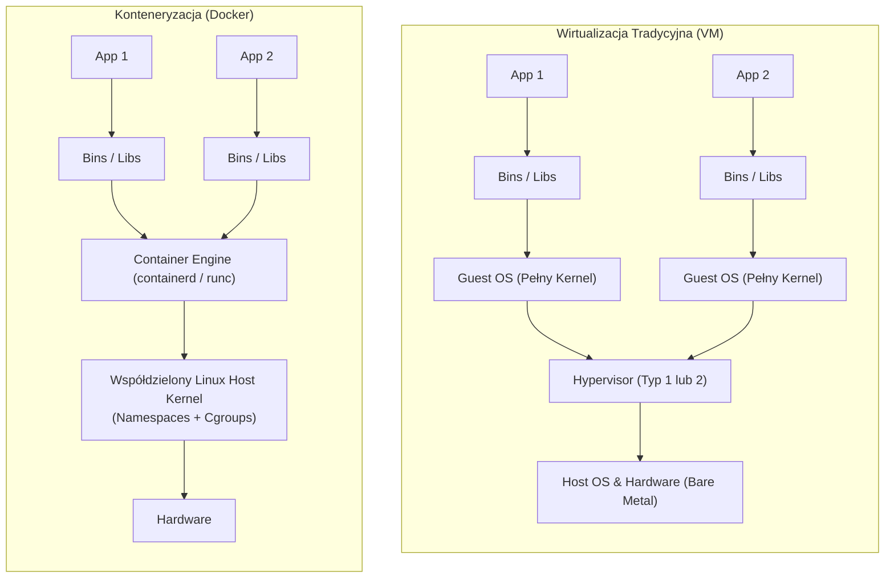
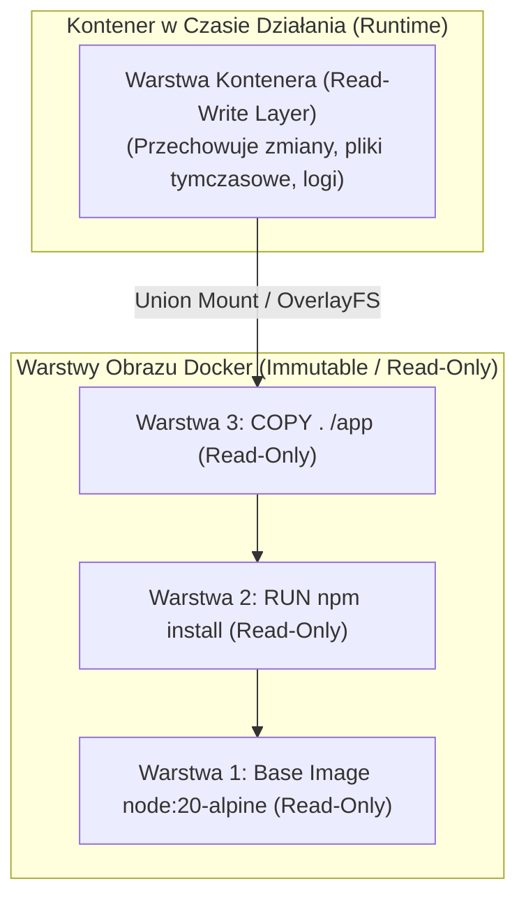
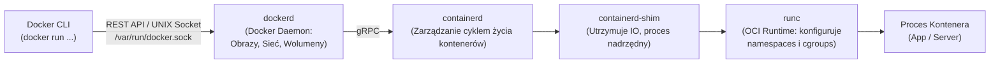
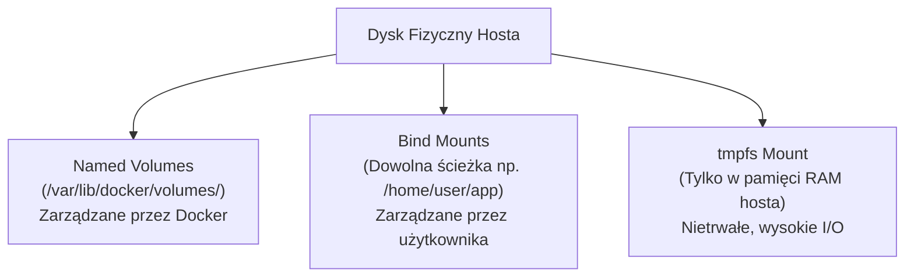

# Docker i Konteneryzacja: Architektura, Optymalizacja i Pytania Rekrutacyjne

Kompleksowe kompendium inżynierskie poświęcone technologii Docker i mechanizmom konteneryzacji. Obejmuje niskopoziomowe fundamenty jądra Linuksa (Namespaces, cgroups, OverlayFS), architekturę wykonawczą OCI (`containerd`, `runc`), wzorce optymalizacji obrazów oraz zestaw pytań rekrutacyjnych i scenariuszy awaryjnych (od poziomu Mid do Staff/Lead).

---

## Spis Treści
1. [Od Maszyn Wirtualnych (Hypervisor) do Kontenerów](#1-od-maszyn-wirtualnych-hypervisor-do-kontenerów)
2. [Niskopoziomowe Fundamenty Linuksa (Pod Maską Kontenera)](#2-niskopoziomowe-fundamenty-linuksa-pod-maską-kontenera)
   - Linux Namespaces (Izolacja zasobów)
   - Control Groups / cgroups (Limitowanie i pomiar)
   - Warstwowy System Plików: UnionFS i OverlayFS (Copy-on-Write)
3. [Architektura Docker Engine i Standard OCI](#3-architektura-docker-engine-i-standard-oci)
   - Od monolitu do modułowości: Docker Daemon, `containerd`, `runc` i `shim`
   - Standard OCI (Open Container Initiative)
4. [Zarządzanie Danymi i Siecią](#4-zarządzanie-danymi-i-siecią)
   - Wolumeny danych: Named Volumes, Bind Mounts i `tmpfs`
   - Sterowniki sieciowe: `bridge`, `host`, `overlay`, `macvlan`, `none`
5. [Projektowanie i Optymalizacja Dockerfile (Best Practices)](#5-projektowanie-i-optymalizacja-dockerfile-best-practices)
   - Multi-stage Builds i minimalne obrazy bazowe
   - Mechanika Docker Build Cache
   - Zmienne środowiskowe: `ARG` vs `ENV` i bezpieczeństwo sekretów (BuildKit Secrets)
   - Monitorowanie żywotności: Instrukcja `HEALTHCHECK`
   - Orkiestracja lokalna: Docker Compose v2 (depends_on z warunkiem healthcheck)
6. [Pytania Rekrutacyjne z Odpowiedziami (FAQ Interview)](#6-pytania-rekrutacyjne-z-odpowiedziami-faq-interview)
   - Pytania Podstawowe i Średniozaawansowane (Mid)
   - Pytania Zaawansowane i Architektoniczne (Senior / Lead)
   - Scenariusze Awaryjne i Troubleshooting (Live-fire)
7. [Tablica Szybkiej Powtórki (Cheat-Sheet)](#7-tablica-szybkiej-powtórki-cheat-sheet)

---

## 1. Od Maszyn Wirtualnych (Hypervisor) do Kontenerów

Przed erą kontenerów dominującym modelem izolacji były maszyny wirtualne (Virtual Machines — VM) zarządzane przez hipernadzorcę (**Hypervisor** — np. KVM, VMware ESXi, Hyper-V).



### Porównanie Architektoniczne
| Cecha | Maszyna Wirtualna (VM) | Kontener (Docker) |
| :--- | :--- | :--- |
| **Izolacja** | Pełna izolacja sprzętowa (Hardware-level) | Izolacja na poziomie procesów systemu (OS-level) |
| **Jądro systemu (Kernel)** | Każda VM posiada własne, niezależne jądro | **Współdzieli jądro systemu gospodarza (Host Kernel)** |
| **Czas uruchomienia** | Od kilkudziesięciu sekund do kilku minut | **Ułamki sekund (milisekundy)** |
| **Narzut pamięciowy** | Gigabajty RAM (rezerwacja na Guest OS) | Megabajty (tylko pamięć faktycznie zużyta przez proces) |
| **Wydajność I/O i CPU** | Narzut warstwy hipernadzorcy (emulacja I/O) | **Wydajność zbliżona do Native Bare-Metal** |

---

## 2. Niskopoziomowe Fundamenty Linuksa (Pod Maską Kontenera)

> [!NOTE]
> **Kontener w Linuksie nie jest fizycznym bytem.** Kontener to zwykły proces w systemie operacyjnym, który został uruchomiony z nałożonymi ograniczeniami **Namespaces** (co proces widzi) oraz **cgroups** (ile zasobów może zużyć).

### 1. Linux Namespaces (Izolacja Widoku)
Namespaces tworzą iluzję, że kontener posiada własny, odizolowany system operacyjny:

| Namespace | Co izoluje? | Efekt dla kontenera |
| :--- | :--- | :--- |
| **PID** | Przestrzeń identyfikatorów procesów | Główny proces w kontenerze ma `PID 1`, nie widząc procesów hosta |
| **NET** | Interfejsy sieciowe, tablice routingu, porty | Własny interfejs sieciowy (`eth0`), własny adres IP, dedykowana tablica portów |
| **MNT** (Mount) | Punkty montowania systemów plików | Kontener widzi wyłącznie własny katalog główny (`rootfs`), nie widząc dysków hosta |
| **UTS** | Nazwa hosta i domeny | Kontener może posiadać własny `hostname` niezależny od hosta |
| **IPC** | Komunikacja międzyprocesowa (Shared Memory, Semafory) | Procesy w kontenerze nie mogą komunikować się przez pamięć współdzieloną z hostem |
| **USER** | Mapowanie identyfikatorów UID i GID | Proces działający jako `root` (UID 0) w kontenerze może być zmapowany na zwykłego użytkownika na hoście |
| **CGROUP** | Widok hierarchii kontrolerów cgroup | Izolacja widoku limitów zasobów kontenera |

### 2. Control Groups — cgroups (Ograniczanie i Pomiar Zasobów)
Podczas gdy Namespaces odpowiadają za to, **co** kontener widzi, `cgroups` decydują o tym, **ile zasobów** kontener może skonsumować:
* **Limit Pamięci (`memory.limit_in_bytes` / cgroups v2 `memory.max`):** Określa maksymalny próg RAM. Jeśli kontener go przekroczy, interweniuje jądrowy mechanizm **OOM Killer** (Out Of Memory Killer), natychmiast ubijając proces z kodem wyjścia `137`.
* **Przydział CPU (`cpu.cfs_quota_us` i `cpu.cfs_period_us`):** Sterowany przez mechanizm **Completely Fair Scheduler (CFS)**. Jeśli ustawimy `--cpus="1.5"`, CFS przydzieli procesowi 150ms czasu procesora na każde 100ms okresu bazowego.
* **cgroups v2:** Nowoczesna, ujednolicona hierarchia drzewiasta eliminująca konflikty alokacji zasobów między różnymi kontrolerami (domyślna w nowszych dystrybucjach Linuksa).

### 3. Warstwowy System Plików: UnionFS i OverlayFS



* **Niemutowalne warstwy obrazu (Read-Only):** Każda linijka w `Dockerfile` (taka jak `RUN`, `COPY`, `ADD`) tworzy nową, niezmienną warstwę identyfikowaną skrótem SHA. Warstwy są współdzielone pomiędzy różnymi obrazami na tej samej maszynie (oszczędność dysku).
* **Warstwa kontenera (Read-Write):** W momencie uruchomienia kontenera Docker nakłada na samej górze cienką, zapisywalną warstwę tymczasową.
* **Mechanizm Copy-on-Write (CoW):**
  - Jeśli proces w kontenerze chce odczytać plik z warstwy obrazu — odczytuje go bezpośrednio.
  - Jeśli proces chce **zmodyfikować** plik z warstwy bazowej — sterownik **OverlayFS** najpierw kopiuje ten plik w górę do warstwy Read-Write kontenera i dopiero tam nanosi zmiany. Warstwy bazowe obrazu pozostają nietknięte.

---

## 3. Architektura Docker Engine i Standard OCI

Historycznie Docker był monolitycznym procesem (`docker daemon`). We współczesnej architekturze został rozbity na wyspecjalizowane komponenty zgodne ze standardem **OCI (Open Container Initiative)**:



1. **Docker CLI:** Klient konsolowy wysyłający żądania HTTP REST do demona przez gniazdo unixowe `/var/run/docker.sock`.
2. **`dockerd`:** Zarządza funkcjami wysokopoziomowymi: budowaniem obrazów, siecią wirtualną, wolumenami i routingiem.
3. **`containerd`:** Samodzielny demon nadzorujący cykl życia kontenerów (pobieranie obrazów z rejestru, przekazywanie strumieni I/O, monitorowanie stanu).
4. **`runc`:** Oficjalna referencyjna implementacja standardu **OCI Runtime**. Krótkotrwały proces CLI, który komunikuje się bezpośrednio z jądrem Linuksa, tworzy Namespaces, nakłada limity cgroups, uruchamia docelowy proces i natychmiast się zamyka.
5. **`containerd-shim`:** Lekki proces pośredniczący. Pozwala na restartowanie demona Dockera (`dockerd`) lub `containerd` bez ubijania uruchomionych kontenerów (**Live Restore**).

---

## 4. Zarządzanie Danymi i Siecią

### Wolumeny Danych (Storage)
Ponieważ warstwa kontenera Read-Write jest ulotna (dane giną po usunięciu kontenera `docker rm`), trzałość danych realizuje się poprzez:



* **Named Volumes (`docker volume create my-data`):** Domyślny i zalecany sposób przechowywania danych w środowiskach produkcyjnych (np. bazy danych PostgreSQL). Zarządzane w całości przez silnik Dockera, odizolowane od struktury systemu plików hosta.
* **Bind Mounts (`-v /moj/kod:/app`):** Montowanie konkretnego pliku lub katalogu z systemu plików hosta do kontenera. Wykorzystywane głównie w środowiskach developerskich (hot-reload kodu).
* **`tmpfs` Mounts:** Dane zapisywane wyłącznie w pamięci RAM hosta. Nigdy nie trafiają na dysk. Idealne dla poufnych kluczy lub bardzo szybkich operacji tymczasowych.

### Sterowniki Sieciowe (Network Drivers)
1. **`bridge` (Domyślny):** Tworzy wirtualny mostek sieciowy (`docker0` na hoście). Każdy kontener otrzymuje własny adres IP w sieci prywatnej. Komunikacja ze światem zewnętrznym realizowana jest przez NAT i mechanizm przekierowania portów (**Port Forwarding** `-p host:container`).
   * *Ważna różnica:* W **User-defined Bridge Network** działa wbudowany serwer DNS Dockera (kontenery mogą komunikować się po swoich nazwach serwisów). W domyślnym `bridge` komunikacja po nazwach nie działa bez linkowania flagą `--link`.
2. **`host`:** Kontener rezygnuje z własnej przestrzeni sieciowej (Network Namespace) i korzysta bezpośrednio z interfejsu sieciowego hosta. Brak narzutu NAT, maksymalna wydajność, ale ryzyko konfliktów portów.
3. **`overlay`:** Łączy kontenery działające na wielu różnych fizycznych maszynach (węzłach klastra Docker Swarm lub Kubernetes) w jedną płaską, bezpieczną sieć wirtualną.
4. **`none`:** Całkowite odcięcie kontenera od sieci (posiada wyłącznie interfejs pętli zwrotnej `loopback`).

---

## 5. Projektowanie i Optymalizacja Dockerfile (Best Practices)

### 1. Multi-Stage Builds (Wzorzec Wielowarstwowy)
Pozwala odseparować środowisko kompilacji (zawierające ciężkie kompilatory, SDK, narzędzia deweloperskie) od finalnego środowiska uruchomieniowego:

```dockerfile
# ETAP 1: Budowanie aplikacji (Build Stage)
FROM node:20-alpine AS builder
WORKDIR /app
COPY package*.json ./
RUN npm ci
COPY . .
RUN npm run build

# ETAP 2: Czyste środowisko produkcyjne (Runtime Stage)
FROM node:20-alpine AS runner
WORKDIR /app
ENV NODE_ENV=production

# Utworzenie nieuprzywilejowanego użytkownika (Security Best Practice)
RUN addgroup -S appgroup && adduser -S appuser -G appgroup

# Kopiujemy TYLKO skompilowane artefakty z etapu builder
COPY --from=builder /app/package*.json ./
COPY --from=builder /app/dist ./dist
RUN npm ci --only=production

USER appuser
EXPOSE 3000

CMD ["node", "dist/main.js"]
```

### 2. Wykorzystanie Docker Build Cache
Docker sprawdza każdą instrukcję podczas budowania. Jeśli warstwa i pliki źródłowe nie zmieniły się od ostatniego buildu — używa pamięci podręcznej (**Cached Layer**).

```dockerfile
# ❌ ZŁE PODEJŚCIE: Zmiana pojedynczej linijki kodu unieważnia cache dla npm install!
COPY . .
RUN npm install

# ✅ DOBRE PODEJŚCIE: Warstwa z zależnościami pobiera się tylko wtedy, gdy zmieni się package.json
COPY package.json package-lock.json ./
RUN npm ci
COPY . .
```

---

### 3. Zmienne Środowiskowe: `ARG` vs `ENV` i Bezpieczeństwo Sekretów
Wielu inżynierów myli zakres działania `ARG` oraz `ENV`:
* **`ARG` (Build-time):** Zmienna dostępna **wyłącznie podczas budowania obrazu** (`docker build --build-arg`). Nie jest dostępna wewnątrz działającego kontenera.
* **`ENV` (Runtime & Build-time):** Zmienna utrwalana w metadanych obrazu i dostępna zarówno podczas budowania, jak i **wewnątrz uruchomionego kontenera**.

> [!CAUTION]
> **Nigdy nie przekazuj haseł ani tokenów API przez `ARG` lub `ENV`!**
> Zarówno wartości `ARG`, jak i `ENV` są na stałe zapisywane w historii warstw obrazu. Każdy, kto posiada dostęp do obrazu, może odczytać sekrety za pomocą polecenia `docker history --no-trunc <image>` lub `docker inspect`.
> 
> **Prawidłowe rozwiązanie (BuildKit Secrets):**
> ```dockerfile
> # Składnia BuildKit bezpiecznego montowania sekretu tymczasowego
> # Klucz montowany jest w RAM i NIE zostaje utrwalony w żadnej warstwie obrazu!
> RUN --mount=type=secret,id=npmrc,target=/root/.npmrc \
>     npm ci --only=production
> ```
> Wywołanie w CLI: `docker build --secret id=npmrc,src=.npmrc .`

---

### 4. Monitorowanie Żywotności: Instrukcja `HEALTHCHECK`
Domyślnie Docker uznaje kontener za działający (`running`), dopóki proces główny (PID 1) nie zakończy działania. Jeśli aplikacja ulegnie zakleszczeniu (*Deadlock*) lub zwróci błąd 500, Docker nadal raportuje status `healthy / running`.

Instrukcja `HEALTHCHECK` instruuje silnik Dockera, jak okresowo weryfikować stan aplikacji:
```dockerfile
# Sprawdzanie dostępności co 30s z timeoutem 3s i 3 próbami
HEALTHCHECK --interval=30s --timeout=3s --start-period=10s --retries=3 \
  CMD curl -f http://localhost:3000/api/health || exit 1
```
* **Stany kontenera:** `starting` (podczas `start-period`), `healthy` (kod 0) oraz `unhealthy` (kod 1 po wyczerpaniu `retries`).
* W przypadku statusu `unhealthy` Docker Compose lub orchestratory (Kubernetes/Swarm) mogą automatycznie zrestartować uszkodzony kontener.

---

### 5. Orkiestracja Lokalna: Docker Compose v2
Docker Compose pozwala na deklaratywne definiowanie i uruchamianie aplikacji wielokontenerowych za pomocą pliku `compose.yaml`.
W wersji **Compose v2** (napisanej w Go jako wtyczka CLI `docker compose` zamiast starego skryptu Python `docker-compose`), wprowadzono zaawansowane mechanizmy sterowania kolejnością uruchamiania serwisów:

```yaml
services:
  db:
    image: postgres:16-alpine
    environment:
      POSTGRES_DB: app_db
      POSTGRES_PASSWORD_FILE: /run/secrets/db_password
    secrets:
      - db_password
    volumes:
      - db_data:/var/lib/postgresql/data
    healthcheck:
      test: ["CMD-SHELL", "pg_isready -U postgres"]
      interval: 5s
      timeout: 5s
      retries: 5

  api:
    build: .
    ports:
      - "8080:8080"
    # Uruchom API dopiero wtedy, gdy baza danych pomyślnie przejdzie HEALTHCHECK!
    depends_on:
      db:
        condition: service_healthy
    networks:
      - app_net

volumes:
  db_data:

networks:
  app_net:

secrets:
  db_password:
    file: ./secrets/db_password.txt
```

---

## 6. Pytania Rekrutacyjne z Odpowiedziami (FAQ Interview)

### Pytania Podstawowe i Średniozaawansowane (Mid)

#### P1: Czym różni się instrukcja `CMD` od `ENTRYPOINT` w Dockerfile?
**Odpowiedź:**
* **`ENTRYPOINT`:** Definiuje stały, główny proces binarny, który ma zostać uruchomiony w kontenerze. Bardzo trudno go nadpisać z poziomu wiersza poleceń (wymaga flagi `--entrypoint`).
* **`CMD`:** Definiuje domyślne argumenty przekazywane do `ENTRYPOINT` (lub samodzielne polecenie, jeśli brak `ENTRYPOINT`). Parametry `CMD` można w prosty sposób nadpisać, dopisując argumenty na końcu polecenia `docker run`.
* **Wzorzec optymalny:**
  ```dockerfile
  ENTRYPOINT ["python", "app.py"]
  CMD ["--port", "8080"]
  ```
  Uruchomienie `docker run my-image` wykona: `python app.py --port 8080`.  
  Uruchomienie `docker run my-image --port 9090` wykona: `python app.py --port 9090` (argumenty z `CMD` zostają zastąpione).

---

#### P2: Jaka jest różnica między instrukcją `EXPOSE` a flagą `-p` (`--publish`) w poleceniu `docker run`?
**Odpowiedź:**
* **`EXPOSE` (w Dockerfile):** Jest wyłącznie **metadaną dokumentacyjną**. Informuje osobę czytającą Dockerfile oraz inne kontenery w tej samej sieci, na którym porcie aplikacja nasłuchuje. **Nie otwiera ani nie mapuje żadnego portu** na maszynie hosta.
* **`-p <host_port>:<container_port>` (w CLI):** Realnie konfiguruje reguły `iptables` i translację adresów NAT na hoście, udostępniając port kontenera dla ruchu przychodzącego z sieci zewnętrznej.

---

#### P3: Czym różni się polecenie `COPY` od `ADD` w Dockerfile? Kiedy używać którego?
**Odpowiedź:**
* **`COPY`:** Kopiuje lokalne pliki lub katalogi z kontekstu budowania na maszynie do systemu plików obrazu. Jest proste, przewidywalne i bezpieczne.
* **`ADD`:** Posiada dwie dodatkowe funkcjonalności:
  1. Umożliwia pobieranie plików z zewnętrznych adresów URL (`ADD https://...`).
  2. Automatycznie **rozpakowuje archiwa** tar (`.tar`, `.tar.gz`) do katalogu docelowego.
* **Dobra praktyka:** Zawsze preferuj `COPY`. Używaj `ADD` wyłącznie wtedy, gdy świadomie chcesz automatycznie rozpakować lokalne archiwum tar do obrazu.

---

### Pytania Zaawansowane i Architektoniczne (Senior / Lead)

#### P4: Jak pod maską działa mechanizm OOM Killer w kontenerze i co oznacza kod wyjścia `Exit Code 137`?
**Odpowiedź:**
* Kod wyjścia `137` to suma: $128 + 9$ (gdzie 9 to sygnał `SIGKILL`). Oznacza, że proces w kontenerze został brutalnie i natychmiastowo zabity sygnałem `KILL` bez możliwości wykonania operacji graceful shutdown.
* **Mechanizm działania:**
  - Jądro Linuksa poprzez kontroler `cgroups` (pamięci) monitoruje bieżące zużycie RAM przez wszystkie procesy w kontenerze.
  - W momencie, gdy pamięć kontenera osiągnie limit zdefiniowany parametrem `--memory` (lub `memory.max`), jądro podejmuje próbę odzyskania pamięci (usunięcie cache stron).
  - Jeśli to nie wystarczy, aktywowany zostaje **Linux OOM-Killer**, który wylicza współczynnik `oom_score` procesów i wysyła sygnał `SIGKILL` do procesu zużywającego najwięcej pamięci.
* **Weryfikacja:** Polecenie `docker inspect <container_id>` w sekcji `State` pokaże flagę `"OOMKilled": true`.

---

#### P5: Czym jest problem procesu Zombie i PID 1 w kontenerze? Jak go rozwiązać?
**Odpowiedź:**
W systemie Linux proces z **PID 1** (zwykle `systemd` lub `init`) pełni dwie unikalne role:
1. **Adopcja i żniwa procesów osieroconych (Zombie Reaping):** Gdy proces potomny kończy działanie, jego wpis w tablicy procesów pozostaje jako "zombie", dopóki rodzic nie odbierze jego kodu wyjścia funkcją `waitpid()`. Jeśli rodzic umrze, procesy potomne adoptuje PID 1.
2. **Propagacja sygnałów:** Standardowy proces aplikacji (np. Node.js, Python) uruchomiony jako PID 1 często nie posiada wbudowanych procedur obsługi sygnałów systemowych takich jak `SIGTERM` czy `SIGINT`, przez co kontener nie reaguje na `docker stop` i po 10 sekundach jest bezwzględnie ubijany przez `SIGKILL`.
* **Rozwiązanie:**
  - Użycie lekkiego menedżera init dedykowanego dla kontenerów, np. **`tini`** lub **`dumb-init`**.
  - W Dockerze: użycie wbudowanej flagi `docker run --init ...`, która automatycznie wstrzykuje proces `tini` jako PID 1.

---

#### P6: Dlaczego uruchamianie kontenerów jako użytkownik `root` jest niebezpieczne i jak zaimplementować Rootless Containers?
**Odpowiedź:**
* Domyślnie użytkownik `root` wewnątrz kontenera posiada `UID 0` — czyli ten sam identyfikator co `root` na maszynie hosta.
* Jeśli w jądrze Linuksa lub bibliotece `runc` pojawi się luka bezpieczeństwa (np. Container Breakout / CVE pozwalające na ucieczkę z kontenera), atakujący natychmiast uzyskuje pełne uprawnienia administratora na całej maszynie fizycznej.
* **Obrona:**
  1. Instrukcja `USER appuser` w Dockerfile (aplikacja działa z uprawnieniami zwykłego użytkownika).
  2. **User Namespaces (`userns-remap`):** Mapowanie `UID 0` z kontenera na nieuprzywilejowany `UID 100000` na hoście.
  3. **Rootless Docker:** Uruchomienie samego demona `dockerd` i środowiska wykonawczego całkowicie bez uprawnień roota na poziomie systemu gospodarza.

---

### Scenariusze Awaryjne i Troubleshooting (Live-fire)

#### Scenariusz 1: Obraz Docker buduje się bardzo wolno (20 minut) w pipeline CI/CD za każdym razem, gdy zmieniony zostanie jeden plik `.ts`.
**Diagnoza i Plan Naprawczy:**
1. **Przyczyna:** Naruszenie hierarchii warstw cache lub kopiowanie zbędnych plików.
2. **Kroki naprawcze:**
   - Sprawdzenie pliku `.dockerignore`: Czy nie kopiujemy do kontekstu budowania katalogu `node_modules`, `.git`, folderów tymczasowych i logów? (Dodanie `.dockerignore` natychmiast zmniejsza rozmiar kontekstu wysyłanego do demona).
   - Rozdzielenie instalacji zależności od kopiowania kodu:
     ```dockerfile
     COPY package*.json ./
     RUN npm ci
     COPY . .
     RUN npm run build
     ```
   - Zastosowanie nowoczesnego silnika **Docker BuildKit** (`DOCKER_BUILDKIT=1`) oraz włączenie pamięci podręcznej montowań (`RUN --mount=type=cache,target=/root/.npm`).

---

#### Scenariusz 2: Kontener A nie może połączyć się z kontenerem B po nazwie serwisu (`curl http://backend:8080` zwraca błąd `Could not resolve host`).
**Diagnoza i Rozwiązanie:**
1. **Identyfikacja:** Sprawdzenie sieci za pomocą `docker network inspect <net_name>`.
2. **Przyczyna:** Kontenery zostały uruchomione w domyślnej sieci mostkowej (**Default `bridge` network**). W domyślnej sieci silnik Dockera celowo **wyłącza wbudowany serwer DNS** — kontenery mogą komunikować się wyłącznie po surowych adresach IP.
3. **Rozwiązanie:** Utworzenie własnej sieci mostkowej i podpięcie do niej obu kontenerów:
   ```bash
   docker network create my-app-network
   docker run -d --name backend --network my-app-network backend-image
   docker run -d --name frontend --network my-app-network frontend-image
   ```
   W sieci użytkownika (`user-defined bridge`) wbudowany serwer DNS Dockera pod adresem `127.0.0.11` automatycznie rozwiązuje nazwy kontenerów na ich aktualne adresy IP.

---

## 7. Tablica Szybkiej Powtórki (Cheat-Sheet)

| Zagadnienie | Słowa Kluczowe i Mechanizmy do Wymienienia |
| :--- | :--- |
| **Izolacja Linux** | Namespaces (PID, NET, MNT, IPC, UTS, USER), cgroups v1/v2 (CFS scheduler, memory limit) |
| **Architektura** | Docker CLI -> `dockerd` (REST) -> `containerd` (gRPC) -> `containerd-shim` -> `runc` (OCI Runtime) |
| **System Plików** | OverlayFS, UnionFS, warstwy Read-Only (Image Layers), warstwa Read-Write (CoW - Copy on Write) |
| **Pamięć i Storage** | Named Volumes (`/var/lib/docker/volumes`), Bind Mounts (lokalne ścieżki), `tmpfs` (RAM) |
| **Sieć Kontenerów** | Bridge (domyślny vs user-defined DNS `127.0.0.11`), Host (brak NAT), Overlay (multi-host swarm) |
| **Optymalizacja** | Multi-stage build, BuildKit cache mounts (`--mount=type=cache`), minimalne obrazy (Alpine/Distroless) |
| **Bezpieczeństwo** | Non-root `USER`, zapobieganie Zombie reaping (`--init` / `tini`), User Namespaces remap, brak `privileged` |
| **Awarie (Exit codes)**| Code 137 (OOM Killer / SIGKILL 9), Code 143 (Graceful SIGTERM 15), Code 1 (Application Error) |
