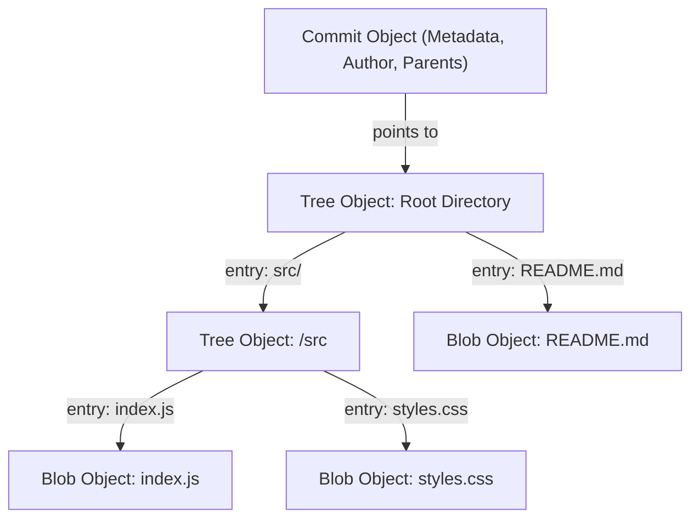
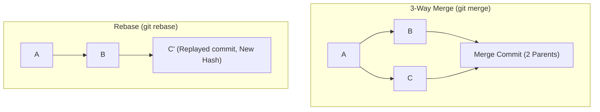

---
title: "Git - Niskopoziomowa Architektura, Przepływ Pracy i Pytania Rekrutacyjne"
description: "Zaawansowany przewodnik po Git: struktura DAG, obiekty (.git/objects), merge vs rebase, reflog, bisect, worktree oraz scenariusze awaryjne i pytania z rozmów."
date: "2026-09-23"
tags: ["Git", "VCS", "DevOps", "Architecture", "Interview", "General-IT"]
order: 2
---
# Kompendium Wiedzy i Pytania Rekrutacyjne: Git (Deep Dive)

Kompleksowy przewodnik techniczny i rekrutacyjny po systemie kontroli wersji **Git**. Obejmuje niskopoziomową strukturę obiektów, graf DAG, mechanikę wskaźników, zaawansowane operacje (`rebase`, `reflog`, `bisect`, `worktree`), techniki naprawcze po błędach oraz pytania rekrutacyjne (od poziomu Mid do Staff/Lead).

---

## Spis Treści
1. [Niskopoziomowa Architektura Gita (Plumbing vs Porcelain)](#1-niskopoziomowa-architektura-gita-plumbing-vs-porcelain)
   - Git jako baza danych typu Content-Addressable Storage
   - Wnętrze katalogu `.git/`
   - Cztery podstawowe obiekty: `blob`, `tree`, `commit`, `tag`
   - Trzy stany i cztery obszary pracy
2. [Gałęzie, Referencje i `HEAD`](#2-gałęzie-referencje-i-head)
   - Czym fizycznie jest gałąź (branch)?
   - Wskaźnik `HEAD` i stan "Detached HEAD"
   - Notacja rewizji (`~` vs `^`, `..` vs `...`)
3. [Łączenie Historii: Merge vs Rebase](#3-łączenie-historii-merge-vs-rebase)
   - Fast-Forward vs 3-Way Merge (True Merge)
   - Mechanika `git rebase` i Złota Zasada Rebase
   - Interaktywny rebase (`squash`, `fixup`, `edit`, `drop`)
   - `git rerere` (Reuse Recorded Resolution)
4. [Zarządzanie Zmianami i Wycofywanie Operacji](#4-zarządzanie-zmianami-i-wycofywanie-operacji)
   - `git reset` (`--soft`, `--mixed`, `--hard`)
   - `git revert` vs `git reset` vs `git restore`
   - `git stash` pod maską
5. [Zaawansowane Narzędzia Inżynierskie](#5-zaawansowane-narzędzia-inżynierskie)
   - `git reflog` — dziennik referencji i ratowanie danych
   - `git bisect` — binarne debugowanie historii
   - `git cherry-pick` i problem duplikacji commitów
   - `git worktree` — równoległa praca na wielu gałęziach
6. [Strategie Gałęziowe i Higiena Repozytorium](#6-strategie-gałęziowe-i-higiena-repozytorium)
   - Trunk-Based Development vs GitHub Flow vs Git Flow
   - Conventional Commits i Semantic Versioning
   - Bezpieczny force push: `--force-with-lease`
   - Duże pliki i czyszczenie historii: Git LFS, `git-filter-repo`
7. [Pytania Rekrutacyjne z Odpowiedziami](#7-pytania-rekrutacyjne-z-odpowiedziami)
   - Pytania Koncepcyjne i Architektoniczne
   - Scenariusze Awaryjne (Troubleshooting Live-fire)
8. [Tablica Szybkiej Powtórki (Cheat-Sheet)](#8-tablica-szybkiej-powtórki-cheat-sheet)

---

## 1. Niskopoziomowa Architektura Gita (Plumbing vs Porcelain)

Większość użytkowników korzysta z poleceń wysokopoziomowych (**Porcelain** — np. `git commit`, `git checkout`). Pod maską Git jest rozproszonym magazynem klucz-wartość (**Content-Addressable Storage**) opartym na skierowanym grafie acyklicznym (**DAG — Directed Acyclic Graph**), operującym za pomocą poleceń niskopoziomowych (**Plumbing** — np. `hash-object`, `cat-file`, `write-tree`).



### Cztery Podstawowe Obiekty Gita (`.git/objects`)
Każdy obiekt w Git jest identyfikowany przez 40-znakowy skrót SHA-1 (lub SHA-256 w nowszych konfiguracjach), wyliczany z nagłówka `typ wielkość\0` oraz zawartości:

1. **`blob` (Binary Large Object):**
   - Przechowuje **wyłącznie surową zawartość pliku** (bajty).
   - Nie przechowuje nazwy pliku, daty utworzenia ani uprawnień chmod.
   - Jeśli dwa różne pliki w projekcie mają identyczną zawartość, Git przechowuje w bazie tylko jeden obiekt blob.
2. **`tree`:**
   - Odpowiednik katalogu w systemie plików.
   - Zawiera listę wpisów: uprawnienia (np. `100644` dla pliku, `040000` dla katalogu), typ obiektu (`blob` lub `tree`), skrót SHA obiektu oraz nazwę pliku/folderu.
3. **`commit`:**
   - Wskazuje na obiekt `tree` reprezentujący główny katalog projektu w danym momencie (snapshot stanu).
   - Zawiera wskaźnik(i) na commit(y) rodziców (`parent`), dane autora i commitera (imię, email, timestamp) oraz treść wiadomości commita.
4. **`annotated tag`:**
   - Trwały wskaźnik do konkretnego commita zawierający podpis, datę, autora i opcjonalny podpis kryptograficzny GPG.

### Wnętrze Katalogu `.git/`
* `HEAD`: Plik tekstowy zawierający referencję do aktualnie wybranej gałęzi (np. `ref: refs/heads/main`).
* `objects/`: Baza obiektów zorganizowana w foldery odpowiadające pierwszym dwóm znakom SHA (np. `objects/4b/825dc642cb...`).
* `refs/`: Wskaźniki do commitów:
  - `refs/heads/`: Lokalne gałęzie.
  - `refs/remotes/`: Zdalne gałęzie śledzące (np. `origin/main`).
  - `refs/tags/`: Tagi.
* `index`: Plik binarny reprezentujący **Staging Area** — pamięć podręczną przygotowywanego drzewa następnego commita.

### Trzy Stany i Cztery Obszary Pracy
```
+--------------------+      git add      +------------------+     git commit     +-------------------+
|  Working Directory | ----------------> |   Staging Area   | -----------------> |   Git Repository  |
| (Katalog roboczy)  | <---------------- |     (Index)      | <----------------- |     (.git DAG)    |
+--------------------+   git restore     +------------------+     git reset      +-------------------+
          |                                                                                |
          +------------------------------ git stash ---------------------------------------+
                                        (Półka / Schowek)
```

---

## 2. Gałęzie, Referencje i `HEAD`

### Czym fizycznie jest gałąź (branch)?
W Git gałąź **nie jest kopią plików ani folderów**.
Gałąź to po prostu mały, 41-bajtowy plik tekstowy w katalogu `.git/refs/heads/<nazwa_gałęzi>`, w którym zapisany jest 40-znakowy hash commitu, na który gałąź aktualnie wskazuje, zakończony znakiem nowej linii.
* Utworzenie nowej gałęzi (`git branch feature`) to zapisanie 41 bajtów na dysku — stąd operacja ta jest natychmiastowa $O(1)$.

### Wskaźnik `HEAD` i Stan "Detached HEAD"
* `HEAD` to symboliczny wskaźnik mówiący Gitowi: *"gdzie aktualnie znajduje się twój katalog roboczy"*.
* Zwykle `HEAD` wskazuje na nazwę gałęzi (np. `ref: refs/heads/main`), a gałąź wskazuje na hash commita.
* **Detached HEAD (Odłączony HEAD):**
  - Sytuacja, w której `HEAD` wskazuje **bezpośrednio na konkretny commit**, a nie na gałąź (np. po wykonaniu `git checkout <commit_hash>`).
  - Jeśli utworzysz commity w stanie Detached HEAD, powstaną one poprawnie w bazie obiektów. Jeśli jednak przełączysz się na inną gałąź (`git checkout main`), nowe commity przestaną być wskazywane przez jakąkolwiek referencję i w przyszłości zostaną usunięte przez mechanizm `git gc` (Garbage Collector).

### Notacja Rewizji: `~` vs `^` oraz `..` vs `...`
* **`HEAD~` vs `HEAD^`:**
  - `HEAD~1` (lub `HEAD~`): Pierwszy przodek w linii prostej (1 krok wstecz). `HEAD~3` to pradziadek.
  - `HEAD^1`: Pierwszy rodzic commita (w przypadku merge commita to gałąź, na której staliśmy podczas merge'a).
  - `HEAD^2`: **Drugi rodzic** commita łączącego (gałąź scalana do bazy).
* **Zakresy rewizji:**
  - `git log feature..main`: Pokaż commity, które są w `main`, ale **nie ma ich** w `feature`.
  - `git diff feature...main` (Trzy kropki w diff): Porównaj stan gałęzi `main` z **wspólnym przodkiem** obu gałęzi (pomijając zmiany wykonane na `feature` od momentu rozgałęzienia).

---

## 3. Łączenie Historii: Merge vs Rebase



### Fast-Forward vs 3-Way Merge
* **Fast-Forward Merge:** Jeśli gałąź docelowa nie posunęła się naprzód od momentu utworzenia gałęzi bocznej, Git nie tworzy nowego commita. Po prostu przesuwa wskaźnik gałęzi docelowej na ostatni commit gałęzi bocznej.
* **3-Way Merge (True Merge):** Tworzy dedykowany **Merge Commit** posiadający dwóch rodziców. Git porównuje trzy snapshoty: wspólnego przodka (merge base), koniec pierwszej gałęzi i koniec drugiej gałęzi.
* **Wymuszenie braku Fast-Forward:** Flaga `git merge --no-ff` tworzy merge commit nawet, gdy możliwe było przesunięcie wskaźnika (zachowuje czytelną informację o istnieniu i domknięciu feature brancha w historii).

### Mechanika `git rebase` i Złota Zasada
* **Jak działa Rebase?**
  1. Git znajduje wspólnego przodka obu gałęzi.
  2. Zapisuje commity z gałęzi rebasowanej jako tymczasowe łatki (pliki diff).
  3. Resetuje gałąź roboczą do czubka gałęzi bazowej.
  4. Aplikuje kolejno każdą łatkę, tworząc **zupełnie nowe commity** (o nowej dacie, nowym hash SHA i nowym rodzicu).
* **Złota Zasada Rebase (The Golden Rule):**
  > [!CAUTION]
  > **Nigdy nie wykonuj `rebase` na gałęziach publicznych/współdzielonych** (np. `main`, `develop`), z których korzystają inni programiści. Przepisanie historii wymusza na innych użytkownikach skomplikowane i ryzykowne operacje naprawcze.

### Interaktywny Rebase (`git rebase -i HEAD~N`)
Pozwala modyfikować lokalną historię przed wystawieniem Pull Requesta:
* `pick`: Zachowaj commit bez zmian.
* `reword`: Zmień treść wiadomości commita.
* `edit`: Zatrzymaj proces rebase na tym commicie w celu wprowadzenia poprawek w kodzie.
* `squash`: Połącz commit z poprzednim i połącz wiadomości obu commitów.
* `fixup`: Połącz commit z poprzednim, ale **odrzuć** jego wiadomość (idealne do szybkich poprawek literówek/lintów).
* `drop`: Całkowicie usuń commit z historii.

### `git rerere` (Reuse Recorded Resolution)
Wbudowane narzędzie (`git config --global rerere.enabled true`), które zapamiętuje sposób rozwiązania konfliktów scalania. Jeśli podczas wielokrotnego rebase'owania długo żyjącej gałęzi ten sam konflikt pojawia się wielokrotnie, Git automatycznie aplikuje wcześniej zapisane rozwiązanie.

---

## 4. Zarządzanie Zmianami i Wycofywanie Operacji

### `git reset`: Trzy Tryby Działania
Polecenie `git reset <commit>` cofa wskaźnik bieżącej gałęzi do wskazanego commita. Różnica tkwi we flagach:

| Flaga | Wskaźnik gałęzi (`HEAD`) | Staging Area (Index) | Working Directory (Pliki na dysku) | Bezpieczeństwo |
| :--- | :--- | :--- | :--- | :--- |
| **`--soft`** | Przesunięty | **Nietknięty** (zmiany zostają w Stage) | **Nietknięty** (pliki bez zmian) | Bezpieczny |
| **`--mixed`** (Domyślny) | Przesunięty | **Zresetowany** (zmiany wycofane ze Stage) | **Nietknięty** (zmiany leżą w plikach jako unstaged) | Bezpieczny |
| **`--hard`** | Przesunięty | **Zresetowany** | **Zresetowany** (zmiany bezpowrotnie usunięte z dysku) | **Niebezpieczny** |

### `git revert` vs `git reset` vs `git restore`
* **`git revert <commit>`:** Tworzy **nowy commit**, który aplikuje dokładne odwrotności zmian wprowadzonych przez wskazany commit. Jest to jedyny bezpieczny sposób na wycofywanie zmian ze współdzielonych gałęzi publicznych (nie niszczy historii).
* **`git restore <file>` (Wprowadzone w Git 2.23):** Zastąpiło przeciążone polecenie `git checkout -- <file>`. Cofa niezacommitowane zmiany w plikach na dysku lub usuwa plik ze Staging Area (`git restore --staged <file>`).

### `git stash` pod maską
Gdy wykonujesz `git stash`, Git nie używa żadnego magicznego schowka — tworzy **dwa lub trzy normalne obiekty commitów** na specjalnej referencji `refs/stash`:
1. Commit reprezentujący stan Staging Area (Index).
2. Commit reprezentujący stan Working Directory (pliki zmodyfikowane).
3. (Opcjonalnie przy fladze `-u`) Commit zawierający pliki nieśledzone (untracked files).

---

## 5. Zaawansowane Narzędzia Inżynierskie

### `git reflog` — Dziennik Referencji i Ochrona Danych
* Git niemal nigdy nie usuwa obiektów natychmiast.
* `reflog` (Reference Log) to lokalny rejestr każdego przesunięcia wskaźnika `HEAD` w repozytorium (np. commity, switche, rebase, chechouty, resety).
* Wpisy w reflogu żyją domyślnie przez **90 dni** (lub 30 dni dla wpisów unreachable).
* Jeśli przypadkowo skasujesz gałąź (`git branch -D feature`) lub wykonasz katastrofalny `git reset --hard`, `git reflog` pozwala zlokalizować hash commita sprzed błędu i go przywrócić:
  ```bash
  git reflog
  # Znajdujemy wpis np.: HEAD@{1}: reset: moving to HEAD~5
  git checkout -b recovered-branch HEAD@{1}
  ```

### `git bisect` — Binarne Wyszukiwanie Regresji
Automatyzuje znajdowanie commita, który wprowadził błąd, za pomocą algorytmu przeszukiwania binarnego $O(\log N)$:
```bash
git bisect start
git bisect bad                 # Bieżący commit ma błąd
git bisect good v1.4.0         # W wersji 1.4.0 błędu jeszcze nie było

# Git sam wybiera commit w połowie historii i czeka na weryfikację:
# Można to w pełni zautomatyzować skryptem testowym:
git bisect run npm test
# Po zakończeniu Git wskazuje dokładnego autora i SHA winnego commita!
git bisect reset
```

### `git cherry-pick`
Pozwala pobrać zmiany wprowadzone przez pojedynczy commit z dowolnej gałęzi i zaaplikować je na bieżącej gałęzi jako **nowy commit**.
* *Uwaga architektoniczna:* Nadmierne stosowanie `cherry-pick` prowadzi do sytuacji, w której ta sama logicznie zmiana istnieje w historii pod wieloma różnymi hashami SHA, co komplikuje późniejsze scalanie gałęzi.

### `git worktree` — Wielowątkowa Praca Lokalna
Pozwala podpiąć **wiele katalogów roboczych pod to samo repozytorium `.git`**:
```bash
# Zamiast chować zmiany stashem i przełączać gałąź w jednym folderze:
git worktree add ../hotfix-folder hotfix-branch
```
* Możesz równolegle edytować kod i odpalać buildy/testy na dwóch różnych gałęziach w dwóch osobnych terminalach, współdzieląc tę samą bazę obiektów i oszczędzając czas oraz miejsce na dysku.
* Po skończonej pracy: `git worktree remove ../hotfix-folder`.

---

## 6. Strategie Gałęziowe i Higiena Repozytorium

### Trunk-Based Development vs Git Flow
| Cecha | Git Flow | Trunk-Based Development |
| :--- | :--- | :--- |
| **Główne gałęzie** | `main`, `develop`, `release/*`, `hotfix/*` | Pojedyncza gałąź główna (`main`/`trunk`) |
| **Długość życia gałęzi** | Długo żyjące feature branches (dni/tygodnie) | Bardzo krótko żyjące gałęzie (kilka godzin do max 1-2 dni) |
| **Wdrożenia** | Zaplanowane, rzadkie wydania pakietowe | Continuous Integration & Continuous Delivery (CI/CD) |
| **Zarządzanie ryzykiem** | Rygorystyczny proces release branchy | Feature Flags (Toggles) w kodzie |
| **Zalecane dla** | Oprogramowanie pudełkowe / instalowane | Nowoczesne środowiska SaaS, Web i Mikrousługi |

### Bezpieczny Push: Dlaczego `--force-with-lease`?
* `git push --force` (`-f`): Bezwzględnie nadpisuje zdalną gałąź lokalnym stanem. Jeśli Twój współpracownik w międzyczasie wypchnął na tę gałąź swoje commity, zostaną one bezpowrotnie zniszczone na serwerze!
* `git push --force-with-lease`: Sprawdza, czy zdalny wskaźnik na serwerze (`remote-tracking ref`) jest dokładnie taki sam, jak w Twojej lokalnej pamięci. Jeśli ktoś w międzyczasie zaktualizował gałąź na serwerze, push zostanie odrzucony, chroniąc przed utratą cudzych zmian.

---

## 7. Pytania Rekrutacyjne z Odpowiedziami

### Pytania Koncepcyjne i Architektoniczne

#### P1: Czym różni się `git fetch` od `git pull`?
**Odpowiedź:**
* `git fetch`: Pobiera wszystkie nowe obiekty (commity, tagi, bloby) oraz aktualizuje zdalne wskaźniki śledzące (`refs/remotes/origin/*`), ale **nie modyfikuje w żaden sposób Twojego katalogu roboczego ani bieżącej lokalnej gałęzi**. Jest to operacja całkowicie bezpieczna.
* `git pull`: Jest komendą złożoną. W pierwszym kroku wykonuje `git fetch`, a w drugim automatycznie scala pobrane zmiany z bieżącą gałęzią lokalną za pomocą `git merge FETCH_HEAD` (lub `git rebase`, jeśli ustawiono flagę `--rebase`).

---

#### P2: Jak Git przechowuje dane w katalogu `.git/objects` i dlaczego zmiana nawet jednego znaku w pliku powoduje utworzenie nowego obiektu?
**Odpowiedź:**
Git jest systemem typu *Content-Addressable Storage*.
* Zawartość pliku wraz z nagłówkiem jest haszowana algorytmem SHA (np. SHA-1). Skrót ten staje się kluczem i jednocześnie ścieżką w bazie obiektów (pierwsze 2 znaki to katalog, pozostałe 38 to nazwa pliku skompresowanego zlibem).
* Zmiana chociażby jednego znaku powoduje wyliczenie zupełnie innego skrótu SHA (efekt lawinowy kryptografii). W rezultacie Git zapisuje w bazie nowy obiekt `blob`.
* Następnie tworzony jest nowy obiekt `tree` wskazujący na nowy hash bloba, a na koniec nowy obiekt `commit` wskazujący na nowe drzewo. Obiekty w Git są niemutowalne (immutable).

---

#### P3: Co oznacza stan "Detached HEAD", kiedy powstaje i jak zapobiec utracie zmian wykonanych w tym stanie?
**Odpowiedź:**
* Stan ten oznacza, że wskaźnik `HEAD` wskazuje bezpośrednio na hash commita, a nie na referencję gałęzi (`refs/heads/*`).
* Powstaje np. po wykonaniu `git checkout <commit_hash>` lub przy przeglądaniu tagów.
* Jeśli w tym stanie wykonamy nowe commity, a następnie przełączymy się na inną gałąź (`git switch main`), nowe commity staną się osierocone (unreachable) i zostaną w końcu usunięte przez GC.
* **Rozwiązanie:** Wystarczy utworzyć nową gałąź w punkcie, w którym się znajdujemy, przed przełączeniem kontekstu:
  ```bash
  git switch -c new-feature-branch
  # lub: git branch new-feature-branch
  ```

---

#### P4: Czym różnią się polecenia `git reset`, `git revert` i `git restore`?
**Odpowiedź:**
* `git reset`: Przemieszcza wskaźnik aktualnej gałęzi wstecz w historii grafu DAG. Zmienia historię commitów. Nie należy go stosować do zmian, które zostały już wypchnięte do zdalnego repozytorium.
* `git revert`: Tworzy **nowy commit**, który wprowadza zmiany przeciwne (odwracające) do wskazanego commita. Bezpieczny dla współdzielonej historii.
* `git restore`: Służy wyłącznie do wycofywania niezacommitowanych zmian z katalogu roboczego lub indeksu (Staging Area), nie modyfikując historii commitów w grafie DAG.

---

### Scenariusze Awaryjne (Troubleshooting Live-fire)

#### Scenariusz 1: Wykonałeś `git reset --hard HEAD~3` na gałęzi lokalnej i straciłeś 3 ważne, niezapuszowane commity. Jak je odzyskać?
**Odpowiedź:**
Dopóki nie minął czas retencji Garbage Collectora (domyślnie 30/90 dni), obiekty commitów wciąż fizycznie znajdują się w bazie `.git/objects`.
1. Sprawdzam historię wskaźnika HEAD poleceniem:
   ```bash
   git reflog
   ```
2. Odszukuję pozycję sprzed wykonania nieszczęsnego resetu (np. `HEAD@{1}`).
3. Przywracam stan gałęzi:
   ```bash
   git reset --hard HEAD@{1}
   # Lub bezpieczniej tworzę z tego punktu nową gałąź ratunkową:
   git branch rescue-branch HEAD@{1}
   ```

---

#### Scenariusz 2: Programista przypadkowo wypchnął do zdalnego repozytorium commit zawierający klucz prywatny API lub hasło do bazy. Jakie kroki podejmujesz?
**Odpowiedź:**
1. **KROK ZERO (Priorytet krytyczny):** Natychmiastowe unieważnienie (rotacja/revocation) skompromitowanego klucza/hasła u dostawcy usługi (AWS, baza danych). Sam Git nie gwarantuje, że ktoś lub boty już nie sczytały sekretu z publicznego repozytorium w ułamku sekundy.
2. **Usunięcie z historii repozytorium:** Zwykły `git revert` lub nowy commit usuwający plik **NIE WYSTARCZY**, ponieważ wrażliwy plik nadal pozostanie w historii poprzednich commitów i obiektów blob w grafie DAG.
3. **Czyszczenie historii:** Użycie oficjalnie rekomendowanego narzędzia `git-filter-repo` (lub narzędzia BFG Repo-Cleaner):
   ```bash
   git-filter-repo --path secrets.env --invert-paths
   ```
4. **Wypchnięcie oczyszczonej historii:** Wymuszenie aktualizacji na serwerze: `git push origin --force --all --tags`.
5. Powiadomienie zespołu o konieczności świeżego sklonowania repozytorium lub przebazowania lokalnych gałęzi.

---

#### Scenariusz 3: Podczas `git rebase` napotykasz skomplikowany konflikt na 15 kolejnych commitach i zdajesz sobie sprawę, że popełniłeś błąd. Jak bezpiecznie przerwać operację i wrócić do stanu wyjściowego?
**Odpowiedź:**
W trakcie trwania procesu rebase Git znajduje się w stanie tymczasowym (katalog `.git/rebase-merge` lub `.git/rebase-apply`).
Aby całkowicie anulować proces i przywrócić gałąź do identycznego stanu sprzed rozpoczęcia rebase'u:
```bash
git rebase --abort
```
Jeśli rebase zdążył się już zakończyć i zatwierdzić nową historię, można cofnąć całą operację za pomocą refloga:
```bash
git reset --hard ORIG_HEAD
# lub: git reset --hard HEAD@{1}
```

---

## 8. Tablica Szybkiej Powtórki (Cheat-Sheet)

| Zagadnienie | Słowa Kluczowe i Niskopoziomowe Koncepcje |
| :--- | :--- |
| **Architektura** | DAG (Directed Acyclic Graph), Content-Addressable Storage, SHA hash, `.git/objects` |
| **Cztery Obiekty** | `blob` (surowa treść), `tree` (katalog/uprawnienia), `commit` (snapshot/metadata/rodzic), `tag` |
| **Stany i Obszary** | Working Directory -> (Stage / Index / Cache) -> Repository (.git) |
| **Gałąź i HEAD** | Gałąź to 41-bajtowy plik w `.git/refs/heads/`. Detached HEAD = HEAD wskazuje na SHA, a nie na branch |
| **Merge vs Rebase** | Merge = 3-way merge commit (2 rodziców). Rebase = odtwarzanie łatek na nowej bazie (nowe SHA) |
| **Reset** | `--soft` (zostaje w Stage), `--mixed` (zostaje w Working Dir), `--hard` (bezwzględne skasowanie zmian) |
| **Ratunek Danych** | `git reflog` (dziennik ruchów HEAD), `git bisect` (binarne szukanie błędu), `ORIG_HEAD` |
| **Narzędzia Pro** | `git worktree` (praca na wielu gałęziach naraz), `git rerere` (pamięć rozwiązywania konfliktów) |
| **Bezpieczeństwo** | `git push --force-with-lease` (ochrona przed nadpisaniem pracy innych), `git revert` (bezpieczne cofanie) |
