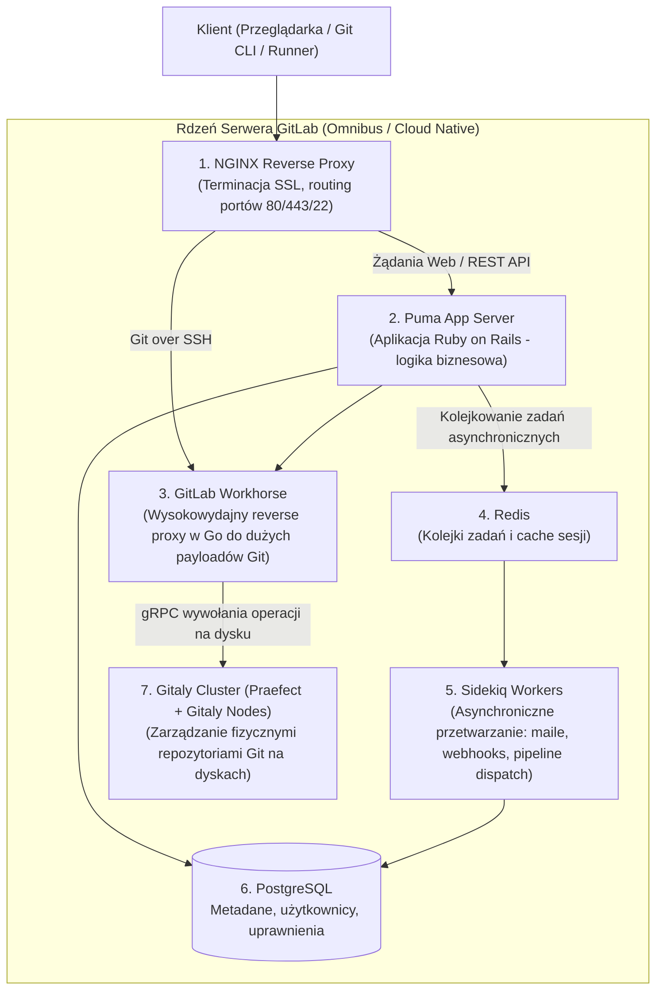
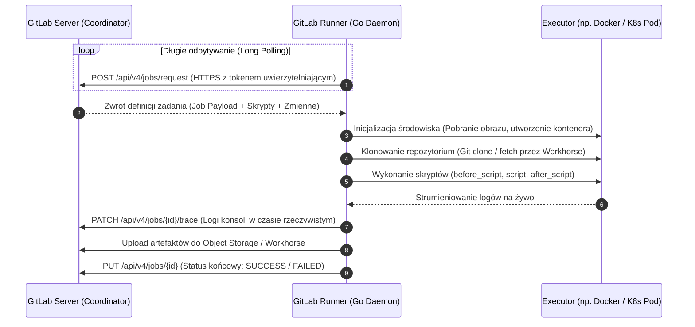
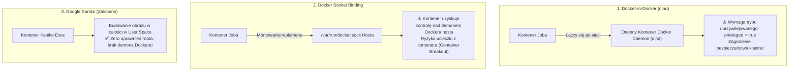
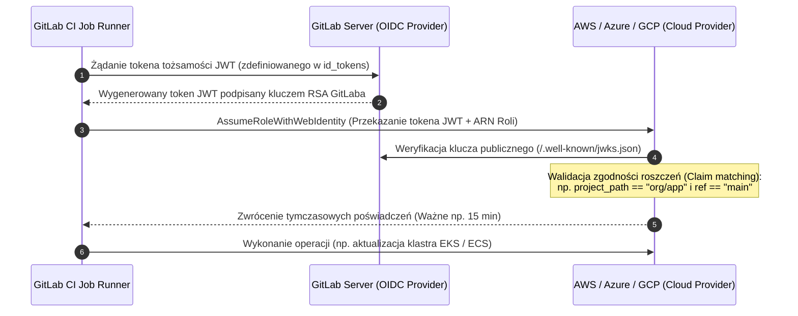

# GitLab i GitLab CI/CD: Architektura Platformy, GitLab Runner i Pytania Rekrutacyjne

Kompleksowe kompendium inżynierskie poświęcone platformie **GitLab** oraz wbudowanemu systemowi **GitLab CI/CD** — wiodącemu rozwiązaniu typu *All-in-One DevOps Platform*. Artykuł szczegółowo omawia wewnętrzną architekturę serwera GitLab (Puma, Sidekiq, Gitaly Cluster), mechanikę wykonawczą **GitLab Runner** (egzekutory Docker, Kubernetes, problem Docker-in-Docker vs Kaniko), zaawansowaną składnię `.gitlab-ci.yml`, grafy zorientowane acyklicznie (**DAG z `needs`**), różnice między `cache` a `artifacts`, wbudowane skanery DevSecOps, federację tożsamości **OIDC** oraz obszerny zestaw pytań rekrutacyjnych i realnych scenariuszy awaryjnych (od poziomu Mid po Principal DevOps / Platform Architecta).

---

## Spis Treści
1. [Wewnętrzna Architektura Platformy GitLab (Self-Managed)](#1-wewnętrzna-architektura-platformy-gitlab-self-managed)
   - Komponenty rdzenne: NGINX, Puma, Sidekiq, Redis, PostgreSQL
   - Niskopoziomowy demon Gitaly i Gitaly Cluster (Koniec problemów z NFS)
   - Przepływ zapytania Git (Git over HTTP/SSH)
2. [GitLab Runner: Mechanika Wykonawcza Pipeline'ów](#2-gitlab-runner-mechanika-wykonawcza-pipelineów)
   - Architektura komunikacji Runner <-> Server (Polling HTTPS)
   - Nowy model uwierzytelniania runnerów (`glrt-` tokens od GitLab 16.0+)
   - Typy runnerów: Shared, Group i Project Specific Runners
   - Egzekutory (Executors): Shell, Docker oraz Kubernetes
   - Budowanie kontenerów: Docker-in-Docker (`dind`) vs Socket Binding vs Kaniko
3. [Składnia `.gitlab-ci.yml` i Architektura Pipeline'u](#3-składnia-gitlab-ciyml-i-architektura-pipelineu)
   - Anatomia pliku: `stages`, `image`, `before_script`, `script`, `after_script`
   - Kluczowe rozróżnienie: `cache` (optymalizacja) vs `artifacts` (wyniki budowania)
   - Nowoczesne reguły wykonania: `rules` zamiast przestarzałego `only`/`except`
   - Directed Acyclic Graph (DAG): Błyskawiczne potoki za pomocą słowa kluczowego `needs`
   - Przekazywanie zmiennych między etapami (`dotenv` artifacts)
4. [Wzorce Modułowości i Skalowania w Organizacji](#4-wzorce-modułowości-i-skalowania-w-organizacji)
   - Dyrektywa `include`: `local`, `project`, `remote`, `template`
   - Kotwice YAML (YAML Anchors `&` i `*`) oraz szablony ukryte (`.template`)
   - GitLab CI/CD Components i CI/CD Catalog (Standard wielokrotnego użycia)
   - Multi-Project Pipelines i Child Pipelines (`trigger`)
5. [Bezpieczeństwo DevSecOps i Federacja Tożsamości OIDC](#5-bezpieczeństwo-devsecops-i-federacja-tożsamości-oidc)
   - Natywne skanery bezpieczeństwa: SAST, DAST, Container Scanning, Secret Detection
   - Eliminacja stałych kluczy chmurowych za pomocą OIDC JWT (`id_tokens`)
6. [Pytania Rekrutacyjne z Odpowiedziami (FAQ Interview)](#6-pytania-rekrutacyjne-z-odpowiedziami-faq-interview)
   - Pytania Podstawowe i Średniozaawansowane (Mid)
   - Pytania Zaawansowane i Architektoniczne (Senior / DevOps Architect)
   - Scenariusze Awaryjne i Live-fire Troubleshooting
7. [Tablica Szybkiej Powtórki (Cheat-Sheet)](#7-tablica-szybkiej-powtórki-cheat-sheet)

---

## 1. Wewnętrzna Architektura Platformy GitLab (Self-Managed)

W przeciwieństwie do lekkich narzędzi CI/CD, GitLab w wersji Self-Managed jest potężnym systemem złożonym z wielu współpracujących mikroserwisów.



### Kluczowe Komponenty Systemu:
1. **GitLab Workhorse:** Rewersyjny serwer proxy napisany w języku Go. Przechwytuje żądania o dużym wolumenie danych (np. `git push`, pobieranie artefaktów, upload dużych plików LFS) i przetwarza je z pominięciem ciężkiego interpretera Ruby, oszczędzając pamięć RAM serwera.
2. **Puma:** Wielowątkowy serwer aplikacji Ruby on Rails obsługujący interfejs użytkownika oraz publiczne API.
3. **Sidekiq:** Wielowątkowy demon przetwarzający zadania w tle (kolejkowane w bazie Redis), takie jak wysyłanie powiadomień, przeliczanie statystyk kodu czy wyzwalanie pipeline'ów.
4. **Gitaly & Gitaly Cluster:**
   - Historycznie GitLab korzystał z dysków sieciowych NFS do przechowywania repozytoriów. Przy setkach operacji `git status` lub `git log` sieć NFS ulegała zakleszczeniu przez wysokie opóźnienia operacji POSIX I/O.
   - **Gitaly** to wyspecjalizowany demon w Go, który wykonuje operacje Git bezpośrednio na lokalnym systemie plików serwera dyskowego i udostępnia je reszcie systemu przez szybkie wywołania **gRPC**.
   - **Gitaly Cluster (z routerem Praefect):** Zapewnia wysoką dostępność (High Availability) ze spójną, synchroniczną replikacją repozytoriów między wieloma węzłami dyskowymi z automatycznym failoverem.

---

## 2. GitLab Runner: Mechanika Wykonawcza Pipeline'ów

**GitLab Runner** to niezależna aplikacja napisana w języku Go, która pobiera zadania z serwera GitLab i wykonuje je w zdefiniowanym środowisku.



---

### Egzekutory (Executors): Docker vs Kubernetes vs Shell

| Executor | Mechanizm Działania | Poziom Izolacji | Zastosowanie |
| :--- | :--- | :--- | :--- |
| **Shell** | Skrypt wykonuje się bezpośrednio na maszynie hosta runnera | **Brak** (Proces ma uprawnienia usera `gitlab-runner`) | Bardzo szybki; kompilacje wymagające specyficznego sprzętu |
| **Docker** | Dla każdego joba pobierany jest czysty obraz kontenera | **Wysoki** (Izolacja kontenerowa) | **Standard rynkowy** dla większości projektów |
| **Kubernetes** | Tworzy dynamiczny Pod w klastrze K8s na czas trwania zadania | **Bardzo wysoki** (Efemeryczne pody K8s) | Elastyczne skalowanie w chmurze (Zero-to-Thousands) |

---

### Budowanie Obrazów w Kontenerach: Docker-in-Docker vs Kaniko

Jednym z najważniejszych zagadnień architektonicznych jest budowanie obrazów Docker wewnątrz runnera Docker/Kubernetes.



#### Przykład Budowy Obrazu za pomocą Kaniko w `.gitlab-ci.yml`:
```yaml
build_image:
  stage: build
  image:
    name: gcr.io/kaniko-project/executor:v1.20.0-debug
    entrypoint: [""]
  script:
    - mkdir -p /kaniko/.docker
    - echo "{\"auths\":{\"${CI_REGISTRY}\":{\"auth\":\"$(printf "%s:%s" "${CI_REGISTRY_USER}" "${CI_REGISTRY_PASSWORD}" | base64 | tr -d '\n')\"}}}" > /kaniko/.docker/config.json
    - >-
      /kaniko/executor
      --context "${CI_PROJECT_DIR}"
      --dockerfile "${CI_PROJECT_DIR}/Dockerfile"
      --destination "${CI_REGISTRY_IMAGE}:${CI_COMMIT_SHA}"
      --cache=true
```

---

## 3. Składnia `.gitlab-ci.yml` i Architektura Pipeline'u

### Kluczowe Rozróżnienie: `cache` vs `artifacts`

Mylenie pojęć `cache` oraz `artifacts` to jeden z najczęstszych błędów inżynierskich:

```mermaid
flowchart LR
    subgraph CacheConcept["CACHE (Optymalizacja Prędkości)"]
        JobA["Job 1: Build (Kompilacja)"] -->|Zapisuje katalog node_modules| S3Cache["Zewnętrzny Cache (MinIO / S3)"]
        S3Cache -.->|Może zostać pobrany (Best Effort)| JobA2["Kolejny build za 2 godziny"]
        NoteCache["⚠️ Nigdy nie używaj cache do przekazywania wyników!\nCache może wygasnąć lub nie pobrać się wcale."]
    end

    subgraph ArtifactsConcept["ARTIFACTS (Deterministyczny Wynik)"]
        JobBuild["Job: Build"] -->|Wysyła pliki dist/| GitLabStorage["GitLab Coordinator Artifacts"]
        GitLabStorage ==>|GWARANTOWANE pobranie| JobTest["Job: Test / Deploy"]
        NoteArt["✅ Gwarantowane przekazanie binariów między etapami."]
    end
```

| Cecha | `cache` | `artifacts` |
| :--- | :--- | :--- |
| **Przeznaczenie** | Przechowywanie zależności (np. `node_modules`, `~/.m2`) | Przekazywanie wyników budowania (np. `.jar`, folder `dist/`) |
| **Gwarancja istnienia** | **Brak gwarancji** (Best effort — pipeline musi działać nawet bez cache) | **Gwarantowane** (Kolejny job zakończy się błędem, jeśli brak artefaktu) |
| **Gdzie trafia?** | Zazwyczaj do zewnętrznego bucketu S3/MinIO skonfigurowanego w runnerze | Bezpośrednio na serwer GitLab / magazyn artefaktów projektu |
| **Dostępność** | Może być współdzielony pomiędzy różnymi pipeline'ami i gałęziami | Ściśle powiązany z konkretnym uruchomieniem pipeline'u |

---

### Directed Acyclic Graph (DAG): Potoki z Użyciem `needs`

Tradycyjny pipeline w GitLabie działa ściśle **sekwencyjnie etapami (Stage-by-Stage)**: żaden job z etapu `test` nie wystartuje, dopóki **wszystkie** joby z etapu `build` nie zakończą się sukcesem.

Słowo kluczowe **`needs`** przekształca pipeline w **DAG**: joby ignorują kolejność etapów i startują natychmiast, gdy zakończą się wskazane zależności!

```mermaid
flowchart LR
    subgraph Traditional["1. Tradycyjny Pipeline (Blokujący - Czas: 15 min)"]
        B1["Build Frontend (2 min)"] & B2["Build Backend (10 min)"] --> Barrier1["Bariera Etapu"]
        Barrier1 --> T1["Test Frontend (3 min)"] & T2["Test Backend (5 min)"]
    end

    subgraph DAG["2. Pipeline DAG z użyciem 'needs' (Czas: 10 min)"]
        DB1["Build Frontend (2 min)"] -->|needs: [Build Frontend]| DT1["Test Frontend (3 min)\nStartuje po 2 minutach!"]
        DB2["Build Backend (10 min)"] -->|needs: [Build Backend]| DT2["Test Backend (5 min)"]
    end
```

```yaml
stages:
  - build
  - test
  - deploy

build_frontend:
  stage: build
  script: npm run build
  artifacts:
    paths: [dist/]

build_backend:
  stage: build
  script: ./gradlew assemble # Trwa 10 minut

test_frontend:
  stage: test
  # Nie czeka na 10-minutowy build backendu! Startuje natychmiast po 2 minutach!
  needs: ["build_frontend"]
  script: npm test
```

---

### Nowoczesne Sterowanie Wykonaniem: Blok `rules`
Zastąpił przestarzałe dyrektywy `only` i `except`, oferując pełną ekspresyjność logiczną:

```yaml
deploy_staging:
  stage: deploy
  script: ./deploy.sh staging
  rules:
    # Uruchom automatycznie na gałęzi develop
    - if: '$CI_COMMIT_BRANCH == "develop"'
      when: on_success
    # Uruchom na gałęziach feature TYLKO wtedy, gdy zmieniły się pliki w katalogu src/
    - if: '$CI_PIPELINE_SOURCE == "merge_request_event"'
      changes:
        - src/**/*
      when: manual
    # W przeciwnym razie nie twórz tego joba wcale
    - when: never
```

---

## 4. Wzorce Modułowości i Skalowania w Organizacji

### Modułowość z `include` i Kotwicami YAML
```yaml
# Dołączenie wspólnych szablonów z repozytorium bezpieczeństwa
include:
  - project: 'codeassure-devops/ci-templates'
    ref: 'v2.0.0'
    file: '/templates/security-scanners.gitlab-ci.yml'

# Kotwica YAML definiująca wspólne środowisko
.node_template: &node_def
  image: node:20-alpine
  before_script:
    - npm ci --cache .npm --prefer-offline
  cache:
    key: ${CI_COMMIT_REF_SLUG}
    paths:
      - .npm/

unit_tests:
  <<: *node_def # Rozwinięcie kotwicy
  script:
    - npm run test:unit

lint_code:
  <<: *node_def
  script:
    - npm run lint
```

---

## 5. Bezpieczeństwo DevSecOps i Federacja Tożsamości OIDC

Najnowocześniejszym standardem bezpieczeństwa w GitLab CI jest całkowite wyeliminowanie statycznych kluczy dostępowych (np. `AWS_SECRET_ACCESS_KEY`) na rzecz **tokenów tożsamości OIDC (OpenID Connect)**.



#### Konfiguracja w `.gitlab-ci.yml`:
```yaml
deploy_aws:
  stage: deploy
  image: amazon/aws-cli:latest
  id_tokens:
    AWS_JWT_TOKEN:
      aud: https://aws.amazon.com # Grupa odbiorców (Audience)
  variables:
    ROLE_ARN: "arn:aws:iam::123456789012:role/GitLabDeployRole"
  script:
    - >
      export $(printf "AWS_ACCESS_KEY_ID=%s AWS_SECRET_ACCESS_KEY=%s AWS_SESSION_TOKEN=%s"
      $(aws sts assume-role-with-web-identity
      --role-arn "${ROLE_ARN}"
      --role-session-name "GitLabCI-${CI_JOB_ID}"
      --web-identity-token "${AWS_JWT_TOKEN}"
      --query "Credentials.[AccessKeyId,SecretAccessKey,SessionToken]"
      --output text))
    - aws s3 sync dist/ s3://codeassure-production/
```

---

## 6. Pytania Rekrutacyjne z Odpowiedziami (FAQ Interview)

### Pytania Podstawowe i Średniozaawansowane (Mid)

#### Pytanie 1: Jaka jest fundamentalna różnica między `cache` a `artifacts` w GitLab CI?
**Odpowiedź:**
- **`cache`:** Służy wyłącznie do **przyspieszania działania kolejnych buildów** poprzez przechowywanie zewnętrznych zależności (np. folder `.npm`, katalog pobranych bibliotek Maven `~/.m2`). Działa na zasadzie *Best-Effort* — jeśli cache z jakiegoś powodu nie zostanie pobrany (np. wygasł lub nowy runner go nie posiada), pipeline musi bez błędów pobrać zależności od zera. Nie służy do przekazywania wyników budowania.
- **`artifacts`:** Służy do **deterministycznego przekazywania produktów kompilacji** (np. skompilowane pliki binarne, raporty testów, katalog `dist/`) pomiędzy kolejnymi etapami (`stages`) w ramach tego samego pipeline'u. Jeśli job zależny wymaga artefaktu z poprzedniego etapu, a artefakt nie istnieje, pipeline zakończy się błędem.

---

#### Pytanie 2: Czym różnią się typy runnerów: Shared, Group i Project Specific Runners?
**Odpowiedź:**
- **Shared Runners (Współdzielone):** Dostępne globalnie dla wszystkich projektów w całej instancji GitLaba. Utrzymywane centralnie przez zespół infrastruktury/DevOps. Posiadają zazwyczaj zdefiniowane kolejkowanie i limity zasobów.
- **Group Runners (Grupowe):** Zarejestrowane na poziomie konkretnej grupy/organizacji. Dostępne dla wszystkich projektów i podgrup wewnątrz tej grupy. Idealne dla zespołów posiadających własną infrastrukturę (np. dedykowany klaster Kubernetes).
- **Project Specific Runners (Projektowe):** Dedykowane dla jednego konkretnego repozytorium. Stosowane w przypadku specyficznych wymagań sprzętowych (np. budowanie na maszynach macOS dla iOS, serwery z GPU dla modeli ML) lub gdy projekt wymaga najwyższego stopnia izolacji bezpieczeństwa.

---

#### Pytanie 3: Jak działa słowo kluczowe `needs` i czym różni się wykonanie pipeline'u sekwencyjnego od DAG?
**Odpowiedź:**
- **Pipeline Sekwencyjny (Domyślny):** Oparty na sztywnych etapach (`stages`). Wszystkie joby w danym etapie muszą zakończyć się sukcesem, zanim jakikolwiek job z kolejnego etapu będzie mógł wystartować. Jeśli jeden job w etapie `build` trwa 15 minut, a inny 1 minutę, joby testowe dla szybszego komponentu czekają bezczynnie 14 minut.
- **Pipeline DAG (`needs`):** Przekształca potok w skierowany graf acykliczny. Słowo kluczowe `needs: ['job_name']` pozwala zdefiniować bezpośrednią relację zależności. Job startuje **natychmiast po ukończeniu wskazanego joba nadrzędnego**, całkowicie ignorując globalne bariery etapów, co drastycznie skraca całkowity czas wykonania pipeline'u.

---

#### Pytanie 4: W jaki sposób przekazać zmienną środowiskową wygenerowaną dynamicznie w jednym jobie do kolejnego joba?
**Odpowiedź:**
Za pomocą mechanizmu **`dotenv` artifacts**:
1. W jobie generującym zapisujemy zmienne do pliku w formacie `KEY=VALUE`:
   ```yaml
   generate_version:
     stage: build
     script:
       - APP_VERSION=$(git describe --tags)
       - echo "DEPLOY_VERSION=${APP_VERSION}" > build.env
     artifacts:
       reports:
         dotenv: build.env
   ```
2. W kolejnym jobie zmienna `$DEPLOY_VERSION` jest automatycznie dostępna jako natywna zmienna środowiskowa w powłoce:
   ```yaml
   deploy:
     stage: deploy
     script:
       - echo "Wdrażanie wersji: ${DEPLOY_VERSION}"
   ```

---

#### Pytanie 5: Dlaczego dyrektywa `rules` całkowicie wyparła `only` / `except`?
**Odpowiedź:**
Instrukcje `only` i `except` posiadały ograniczone możliwości logiczne — nie pozwalały na łączenie złożonych warunków logicznych (AND/OR), nie współpracowały dobrze z mechanizmem `needs` i powodowały niejednoznaczności przy obsłudze Merge Request Pipelines.

Dyrektywa **`rules`**:
- Umożliwia pisanie złożonych wyrażeń warunkowych (`if: $CI_COMMIT_BRANCH == "main" && $FEATURE_FLAG == "true"`).
- Wspiera sprawdzanie zmian w konkretnych ścieżkach plików (`changes:`).
- Wspiera sprawdzanie obecności plików w repozytorium (`exists:`).
- Pozwala na dynamiczne sterowanie atrybutami joba (np. zmiana `when: manual` lub nadpisywanie zmiennych `variables:` tylko przy spełnieniu określonego warunku).

---

### Pytania Zaawansowane i Architektoniczne (Senior / DevOps Architect)

#### Pytanie 6: Wyjaśnij architekturę Gitaly Cluster w instalacjach GitLab Enterprise. Dlaczego zrezygnowano z sieciowych systemów plików NFS?
**Odpowiedź:**
Git jest systemem zoptymalizowanym pod kątem bardzo dużej liczby małych operacji odczytu/zapisu na dysku (metadane obiektów w `.git/objects/`).
- **Problem z NFS:** Protokół sieciowy NFS wymagał setek round-tripów sieciowych dla pojedynczego polecenia Git (np. sprawdzanie uprawnień POSIX, blokady plików). Skutkowało to drastycznymi opóźnieniami, zawieszaniem wątków serwera Puma i uszkadzaniem repozytoriów przy utracie pakietów.
- **Architektura Gitaly Cluster:**
  - Wprowadzono warstwę pośredniczącą **Praefect** — inteligentny router gRPC działający jako SQL-owy zarządca stanu replikacji.
  - Pod Praefectem działają fizyczne węzły **Gitaly Nodes**, przechowujące repozytoria na szybkich, lokalnych dyskach SSD/NVMe.
  - Praefect przyjmuje żądanie gRPC od GitLaba i synchronicznie rozsyła zapis do wszystkich węzłów klastra (Quorum writes).
  - W przypadku awarii jednego z węzłów Praefect automatycznie kieruje ruch do zdrowego węzła bez przerw w działaniu platformy (*Zero-downtime failover*).

---

#### Pytanie 7: Jakie są zagrożenia bezpieczeństwa związane z Docker Socket Binding (`/var/run/docker.sock`) w porównaniu do Docker-in-Docker i Kaniko?
**Odpowiedź:**
1. **Docker Socket Binding (`-v /var/run/docker.sock:/var/run/docker.sock`):**
   Kontener wewnątrz joba uzyskuje bezpośredni dostęp do demona Dockera maszyny gospodarza. Oznacza to, że użytkownik w kontenerze może wykonać `docker run -v /:/host_root alpine`, zyskując **pełny dostęp roota do całego systemu plików serwera fizycznego** (krytyczna podatność *Host Compromise*).
2. **Docker-in-Docker (`dind`):**
   Uruchamia odrębnego demona Dockera wewnątrz kontenera. Eliminuje dostęp do hosta, ale wymaga uruchomienia kontenera z flagą **`privileged = true`**, co wyłącza mechanizmy AppArmor/SELinux i pozwala kontenerowi na manipulację strukturami jądra.
3. **Google Kaniko (Standard Bezpieczny):**
   Wykonuje kompilację Dockerfile w przestrzeni użytkownika (*User Space*) bez użycia żadnego demona Dockera i bez uprawnień roota (`unprivileged`). Jest w pełni bezpieczny do uruchamiania w środowiskach współdzielonych (Kubernetes / Multi-tenant).

---

#### Pytanie 8: Jak zoptymalizować czas wykonywania pipeline'u GitLab CI w dużej korporacji (skrócenie z 30 min do 5 min)?
**Odpowiedź:**
Kompleksowa strategia optymalizacyjna obejmuje:
1. **Wdrożenie DAG (`needs`):** Usunięcie sztucznych barier etapów, pozwalając niezależnym zadaniom na natychmiastowy start.
2. **Optymalizacja Cache Zależności:** Skonfigurowanie rozproszonego cache w runnerze (S3/MinIO) z wykorzystaniem unikalnych kluczy na podstawie hasha plików blokad:
   ```yaml
   cache:
     key:
       files: [package-lock.json]
     paths: [.npm/]
   ```
3. **Wybiórcze uruchamianie (`rules:changes`):** Testy backendu uruchamiają się tylko przy zmianach w `backend/**`, a testy frontendowe tylko przy zmianach w `frontend/**`.
4. **Zrównoleglenie testów (Parallel Matrix):** Rozbicie zestawu 5000 testów E2E na 10 równoległych kontenerów za pomocą dyrektywy `parallel: 10`.
5. **Własne, zoptymalizowane obrazy bazowe:** Przygotowanie gotowego obrazu Docker z zainstalowanymi narzędziami zamiast wykonywania `apt-get update && apt-get install` przy każdym uruchomieniu joba.

---

#### Pytanie 9: Czym jest mechanizm Masked Variables i jakich ograniczeń należy przestrzegać, aby zmienna nie wyciekła w logach?
**Odpowiedź:**
GitLab automatycznie wycina wartości zmiennych oznaczonych jako **Masked** z logów konsoli, zastępując je ciągiem `[masked]`.

**Ograniczenia mechanizmu Maskowania:**
Wartość zmiennej musi spełniać surowe reguły wyrażeń regularnych:
- Musi składać się z co najmniej 8 znaków.
- Może zawierać wyłącznie znaki ze standardowego zestawu Base64 (`[a-zA-Z0-9_+=/@-]`).
- **Nie może zawierać znaków nowej linii (`\n`)** — dlatego wielolinijkowe klucze prywatne SSH/RSA nie mogą być bezpośrednio maskowane (należy je zakodować do jednej linii Base64 przed zapisaniem w GitLabie).
- Jeśli zmienna zostanie zmodyfikowana w skrypcie (np. odwrócona, sparsowana przez jq lub zakodowana), maskowanie przestaje działać i sekret wycieka do logów.

---

#### Pytanie 10: W jaki sposób zarządzać wieloma środowiskami za pomocą GitLab Environments and Deployments?
**Odpowiedź:**
Sekcja `environment` w jobie integruje pipeline z panelem zarządzania środowiskami w GitLab:
```yaml
deploy_prod:
  stage: deploy
  environment:
    name: production
    url: https://codeassure.io
    action: start
    on_stop: stop_prod
```
**Korzyści:**
- Pełny audyt: Dokładna historia, kto, kiedy i jaki commit wdrożył na dane środowisko.
- Wsparcie dla **Protected Environments**: Tylko wybrani użytkownicy (np. Release Managerowie) mają prawo zatwierdzić wdrożenie na środowisko produkcyjne.
- Możliwość natychmiastowego wykonania operacji **Rollback** jednym kliknięciem z panelu GitLaba.
- Obsługa środowisk efemerycznych (**Review Apps**): Automatyczne tworzenie dynamicznego środowiska dla każdego Merge Requesta i jego niszczenie po zmergowaniu (`on_stop`).

---

### Scenariusze Awaryjne i Live-fire Troubleshooting

#### Scenariusz 1: Job wisi w nieskończoność ze statusem "stuck"
* **Objaw produkcyjny:** Nowe zadanie w pipeline ma status `stuck` z ostrzeżeniem: *„This job is stuck because the project doesn't have any runners online assigned to it”*.
* **Analiza Root Cause:**
  1. Job posiadał zdefiniowany tag: `tags: [docker-gpu]`.
  2. Żaden z zarejestrowanych runnerów nie posiadał takiego tagu lub runner z tym tagiem był w stanie `offline` / wyłączony.
  3. Alternatywnie: Runner był zarejestrowany z flagą `untagged: false`, a w definicji joba w `.gitlab-ci.yml` pominięto pole `tags`.
* **Rozwiązanie i Naprawa:**
  1. Dopasowanie tagów w pliku `.gitlab-ci.yml` do rzeczywistych tagów runnera.
  2. Włączenie w ustawieniach runnera opcji *„Run untagged jobs”*, jeśli runner ma przyjmować wszystkie zadania bez tagów.

---

#### Scenariusz 2: Awaria pamięci podręcznej i błąd "Error response from daemon: Cannot connect to the Docker daemon" w Kubernetesie
* **Objaw produkcyjny:** Job budujący obrazy kontenerowe w klastrze Kubernetes kończy się błędem: `Cannot connect to the Docker daemon at unix:///var/run/docker.sock. Is the docker daemon running?`.
* **Analiza Root Cause:**
  1. Job korzystał z obrazu `docker:latest` i próbował wywołać `docker build`.
  2. W klastrze Kubernetes środowiskiem uruchomieniowym nie był już Docker, lecz `containerd` (zgodnie z wycofaniem Dockershima z K8s). Plik `/var/run/docker.sock` fizycznie nie istniał na węzłach roboczych.
* **Rozwiązanie i Naprawa:**
  1. Zastąpienie komend `docker build` bezdemonicznym narzędziem **Google Kaniko** lub **Buildah**.
  2. Kaniko buduje kontenery w czystej przestrzeni użytkownika, działając natywnie w Kubernetesie bez potrzeby dostępu do gniazda demona.

---

#### Scenariusz 3: Artefakty z poprzedniego etapu nadpisują pliki w kolejnym etapie
* **Objaw produkcyjny:** Job testowy w etapie `test` kończy się błędem z powodu nieoczekiwanej zawartości plików konfiguracyjnych, które zostały wygenerowane przez inny, równoległy job z etapu `build`.
* **Analiza Root Cause:**
  Domyślnie w GitLab CI **każdy job automatycznie pobiera WSZYSTKIE artefakty ze wszystkich poprzednich etapów**. Jeśli dwa różne joby wygenerowały plik o tej samej nazwie (np. `build.log` lub `config.json`), dochodzi do kolizji.
* **Rozwiązanie i Naprawa:**
  Jawne zdefiniowanie listy pobieranych artefaktów za pomocą dyrektywy **`dependencies`**:
  ```yaml
  test_app:
    stage: test
    dependencies:
      - build_app # Pobiera artefakty WYŁĄCZNIE z joba build_app, ignorując inne!
  ```
  Lub całkowite wyłączenie pobierania artefaktów: `dependencies: []`.

---

## 7. Tablica Szybkiej Powtórki (Cheat-Sheet)

| Słowo kluczowe / Zmienna | Zastosowanie / Opis |
| :--- | :--- |
| **`needs: [jobA, jobB]`** | Buduje graf DAG — job startuje bez czekania na cały poprzedni etap |
| **`cache`** | Przechowywanie zależności (npm, m2) — best effort, nie gwarantowane |
| **`artifacts: { paths: [] }`**| Przekazywanie produktów kompilacji między jobami — gwarantowane |
| **`rules: [if, changes]`** | Nowoczesne sterowanie warunkowe uruchamianiem zadań |
| **`include: { project, file }`**| Reużywanie szablonów pipeline'ów z innych repozytoriów |
| **`id_tokens`** | Generowanie bezpiecznych tokenów JWT OIDC do autoryzacji w chmurze (AWS/GCP)|
| **`parallel: matrix`** | Uruchamianie macierzy zadań dla wielu wersji runtime/parametrów |
| **`$CI_COMMIT_SHA`** | Pełny 40-znakowy hash commita wyzwalającego pipeline |
| **`$CI_COMMIT_BRANCH`** | Nazwa bieżącej gałęzi Git |
| **`$CI_PIPELINE_SOURCE`** | Źródło pipeline'u: `push`, `merge_request_event`, `schedule` |
| **`dependencies: []`** | Pomija automatyczne pobieranie artefaktów z poprzednich etapów |
| **`when: manual`** | Wymaga kliknięcia przycisku przez uprawnionego użytkownika |
