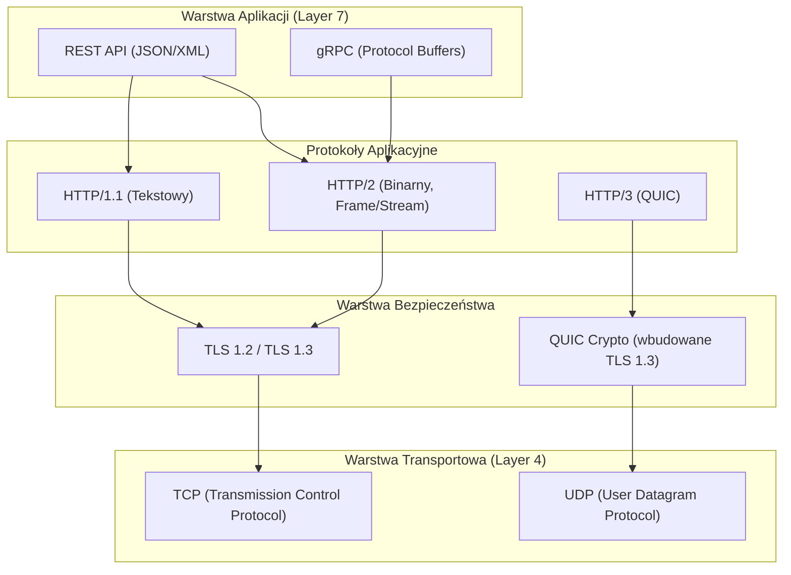
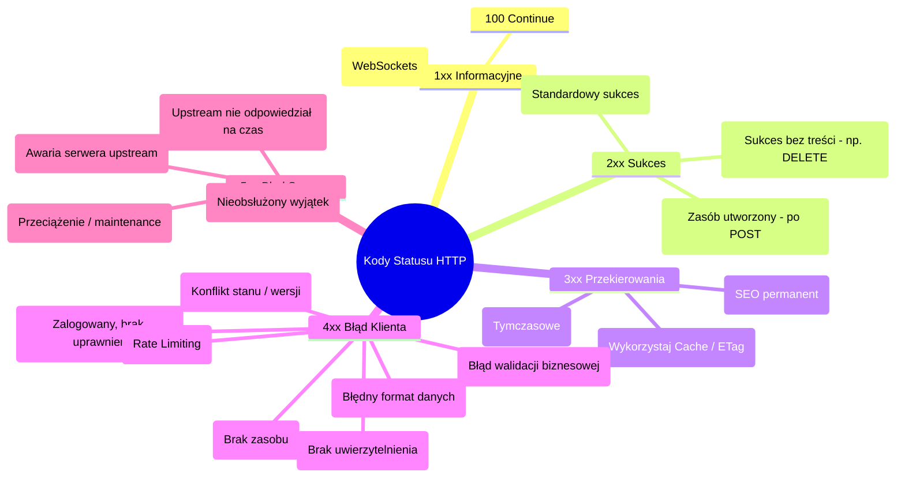
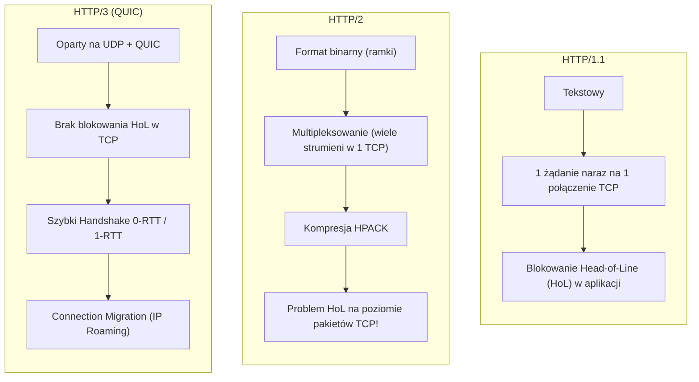
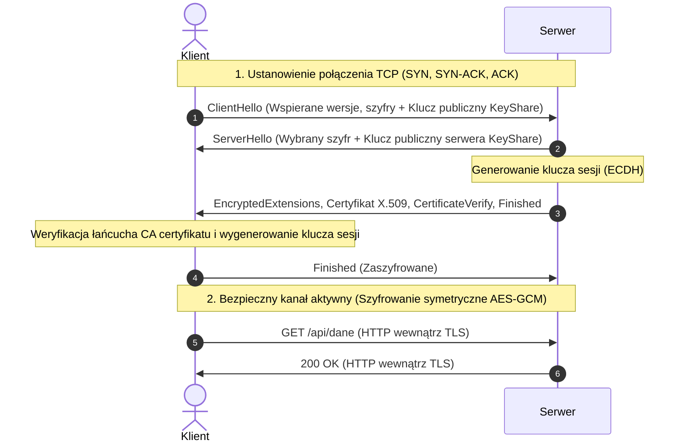
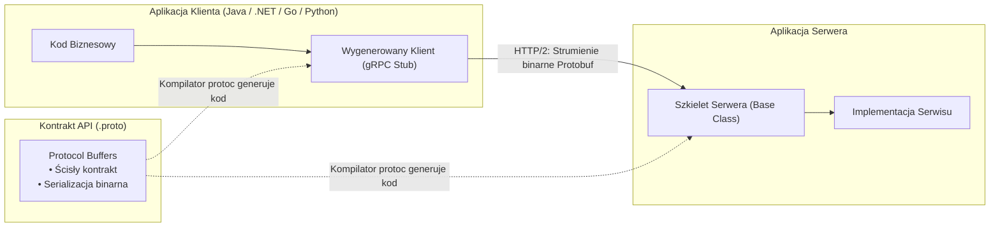
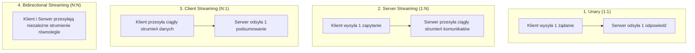
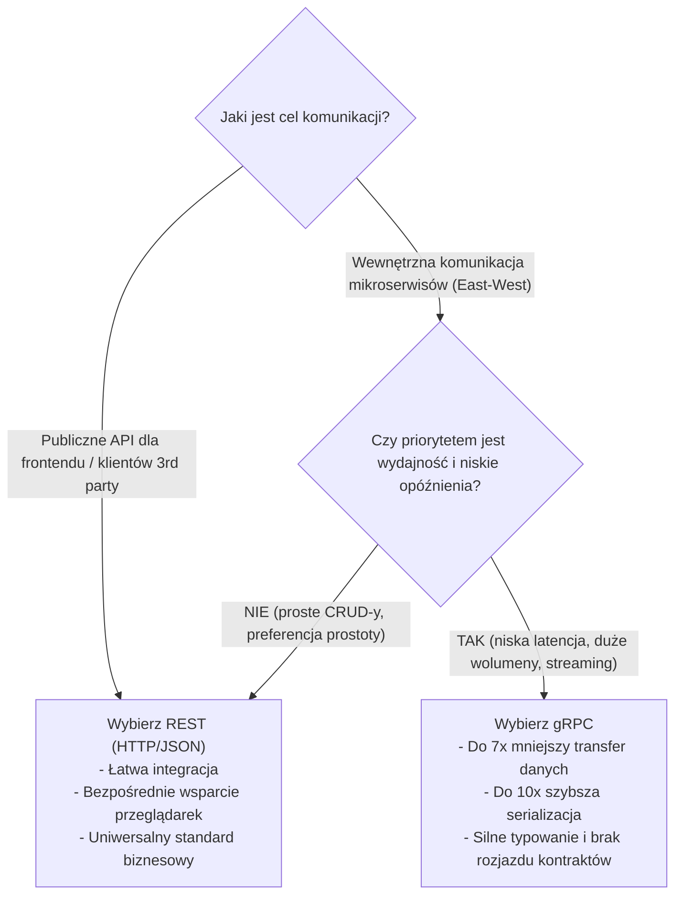

# Protokoły Sieciowe: HTTP, HTTPS i gRPC

Komunikacja między usługami oraz między klientem a serwerem to krwioobieg współczesnych systemów rozproszonych, aplikacji webowych oraz mikroserwisów. Wybór odpowiedniego protokołu sieciowego ma bezpośredni wpływ na **opóźnienia (latency)**, **przepustowość (throughput)**, **zużycie zasobów (CPU/RAM)** oraz **bezpieczeństwo** systemu.

---

## 1. Protokoły w Modelu Warstwowym

Zarówno HTTP, jak i gRPC to protokoły **warstwy aplikacji** (warstwa 7 w modelu OSI). Korzystają one z usług protokołów transportowych (TCP, UDP/QUIC) oraz warstw zabezpieczeń (TLS):



---

## 2. Protokół HTTP (Hypertext Transfer Protocol)

HTTP to protokół oparty na modelu **klient-serwer** oraz semantyce **żądanie-odpowiedź (Request-Response)**. Kluczową cechą HTTP jest jego **bezstanowość (statelessness)** – każde żądanie traktowane jest jako całkowicie niezależne, a serwer nie przechowuje stanu kontekstu klienta pomiędzy zapytaniami.

### Anatomia Żądania i Odpowiedzi HTTP

```http
GET /api/v1/orders/1024 HTTP/1.1
Host: api.example.com
User-Agent: Mozilla/5.0
Accept: application/json
Authorization: Bearer eyJhbGciOi...
```

```http
HTTP/1.1 200 OK
Date: Mon, 21 Sep 2026 09:25:00 GMT
Content-Type: application/json; charset=utf-8
Content-Length: 78
Cache-Control: max-age=300, public
ETag: "33a64df551425fcc55e4d42a148795d9f25f89d4"

{
  "id": 1024,
  "status": "COMPLETED",
  "totalAmount": 149.99,
  "currency": "PLN"
}
```

---

## 3. Metody HTTP: Bezpieczeństwo i Idempotencja

Dwa fundamentalne pojęcia w architekturze REST/HTTP:
- **Metoda bezpieczna (Safe):** Wywołanie metody nie zmienia stanu zasobów na serwerze (operacja typu *Read-Only*).
- **Metoda idempotentna (Idempotent):** Wielokrotne wykonanie identycznego żądania przynosi dokładnie taki sam skutek na serwerze, jak pojedyncze wykonanie ($f(f(x)) = f(x)$).

| Metoda | Bezpieczna (*Safe*)? | Idempotentna (*Idempotent*)? | Typowe zastosowanie |
| :--- | :---: | :---: | :--- |
| `GET` | **TAK** | **TAK** | Pobranie reprezentacji zasobu |
| `HEAD` | **TAK** | **TAK** | Pobranie samych nagłówków (bez treści) |
| `OPTIONS` | **TAK** | **TAK** | Sprawdzenie dozwolonych metod (np. mechanizm CORS Preflight) |
| `PUT` | NIE | **TAK** | Całkowite zastąpienie lub utworzenie zasobu pod podanym URI |
| `DELETE` | NIE | **TAK** | Usunięcie zasobu (wielokrotne usunięcie daje ten sam stan końcowy) |
| `POST` | NIE | **NIE** | Utworzenie nowego zasobu, przetwarzanie operacji nieidempotentnych |
| `PATCH` | NIE | Zależy (zwykle **NIE**) | Częściowa aktualizacja zasobu (np. modyfikacja pojedynczego pola) |

> [!IMPORTANT]
> **Dlaczego `POST` nie jest idempotentny, a `PUT` jest?**  
> Wywołanie 5 razy zapytania `POST /orders` utworzy 5 niezależnych zamówień (i 5 razy obciąży kartę klienta!).  
> Wywołanie 5 razy zapytania `PUT /orders/1024` z nowym adresem ustawi ten adres w zamówieniu 1024 – stan końcowy serwera po 1 czy 5 wywołaniach będzie identyczny.

---

## 4. Kody Statusu HTTP (Status Codes)

Kody numeryczne informujące klienta o wyniku operacji:



---

## 5. Ewolucja Protokołu: HTTP/1.1 vs HTTP/2 vs HTTP/3

Ewolucja protokołu HTTP koncentrowała się na minimalizacji opóźnień sieciowych oraz pokonaniu ograniczeń warstwy transportowej.



### Porównanie Wersji HTTP

| Cecha | HTTP/1.1 | HTTP/2 | HTTP/3 (QUIC) |
| :--- | :--- | :--- | :--- |
| **Format danych** | Tekstowy (czytelny dla oka) | **Binarny** (ramki i strumienie) | **Binarny** (ramki QUIC) |
| **Warstwa transportowa** | TCP | TCP | **UDP (protokół QUIC)** |
| **Multipleksowanie** | Brak (wymaga wielu połączeń TCP) | **Tak** (wiele strumieni w 1 TCP) | **Tak** (niezależne strumienie w QUIC) |
| **Head-of-Line (HoL) Blocking** | Występuje na poziomie aplikacji | Rozwiązany w aplikacji, **obecny w TCP** | **Całkowicie wyeliminowany** |
| **Kompresja nagłówków** | Brak (nagłówki przesyłane jawnie) | **HPACK** (statyczna/dynamiczna tabela) | **QPACK** (przystosowany do braku kolejności UDP) |
| **Czas nawiązywania połączenia** | TCP (1-RTT) + TLS (1-2 RTT) | TCP (1-RTT) + TLS (1-2 RTT) | **1-RTT (TCP+TLS połączone)** / **0-RTT** |
| **Odporność na zmianę sieci** | Zerwanie połączenia (zmiana IP) | Zerwanie połączenia (zmiana IP) | **Płynna migracja** (*Connection ID*) |

> [!NOTE]
> **Co to jest Head-of-Line (HoL) Blocking w TCP?**  
> W HTTP/2 możemy wysyłać 50 zapytań naraz w jednym połączeniu TCP. Jednak TCP gwarantuje bezwzględną kolejność pakietów. Jeśli jeden pakiet z 1. zapytania zaginie w sieci, jądro systemu operacyjnego wstrzymuje dostarczenie danych dla pozostałych 49 zapytań, dopóki zaginiony pakiet nie zostanie retransmitowany!  
> **HTTP/3 (QUIC)** rozwiązuje ten problem: każdy strumień w QUIC jest izolowany – zgubienie pakietu w strumieniu A nie opóźnia strumienia B!

---

## 6. HTTPS i Bezpieczeństwo: Protokół TLS 1.3

HTTPS to nic innego jak protokół HTTP przesyłany wewnątrz szyfrowanego tunelu **TLS (Transport Layer Security)**.

### Zagrożenia, przed którymi chroni HTTPS:
1. **Poufność (Confidentiality):** Zapobiega podsłuchiwaniu danych w sieci (*eavesdropping*) dzięki szyfrowaniu symetrycznemu (AES-256-GCM, ChaCha20-Poly1305).
2. **Integralność (Integrity):** Zapobiega modyfikacji danych w locie (*tampering*) dzięki kodom uwierzytelniania wiadomości (MAC/HMAC).
3. **Uwierzytelnienie (Authentication):** Gwarantuje tożsamość serwera za pomocą certyfikatów X.509 wystawianych przez zaufane centra certyfikacji (Certificate Authorities – CA).

### Przebieg Ustanawiania Połączenia: TLS 1.3 Handshake

W TLS 1.3 proces nawiązywania bezpiecznego połączenia został skrócony do zaledwie **jednego cyklu (1-RTT)**:



---

## 7. Protokół gRPC: Architektura i Koncepcja

**gRPC** (*gRPC Remote Procedure Calls*) to opracowany przez firmę Google, otwartoźródłowy, wysoce wydajny framework RPC.

W tradycyjnym modelu REST/HTTP wywołujemy zasoby pod adresem URL za pomocą czasowników HTTP (`GET /api/users/5`).  
W modelu **RPC** klient wywołuje metodę na zdalnym serwerze **dokładnie tak, jakby była to lokalna metoda w kodzie aplikacji**:

```csharp
// Wywołanie gRPC w C# wygląda jak lokalne wywołanie metody!
var response = await client.GetOrderDetailsAsync(new OrderRequest { OrderId = 1024 });
```

### Filary Architektury gRPC:



1. **HTTP/2 jako jedyny protokół transportowy:** Wykorzystuje natywne multipleksowanie, ramki binarne, nagłówki HPACK i streaming.
2. **Protocol Buffers (Protobuf):** Język definicji interfejsu (IDL) oraz binarny mechanizm serializacji. Zastępuje nieefektywny format JSON/XML.
3. **Generowanie kodu (*Code Generation*):** Kompilator `protoc` automatycznie generuje klasy modeli i klientów dla ponad 10 języków (C#, Java, Go, Python, C++, TypeScript).

---

## 8. Kontrakt w gRPC: Plik `.proto`

Definicja usługi i struktur danych w składni **proto3**:

```protobuf
syntax = "proto3";

package ecommerce.orders;

option csharp_namespace = "Ecommerce.Orders.Grpc";

// Definicja usługi (kontraktu RPC)
service OrderService {
  // 1. Unary RPC
  rpc GetOrder (OrderRequest) returns (OrderResponse);

  // 2. Server Streaming RPC
  rpc StreamOrderStatus (OrderRequest) returns (stream StatusUpdate);

  // 3. Client Streaming RPC
  rpc UploadTelemetry (stream SensorData) returns (UploadSummary);

  // 4. Bidirectional Streaming RPC
  rpc Chat (stream ChatMessage) returns (stream ChatMessage);
}

// Struktury komunikatów (Messages)
message OrderRequest {
  int64 order_id = 1; // Liczba 1 to unikalny znacznik pola (field tag) w binarnej reprezentacji!
}

message OrderResponse {
  int64 order_id = 1;
  string customer_name = 2;
  double total_price = 3;
  OrderStatus status = 4;
}

enum OrderStatus {
  ORDER_STATUS_UNSPECIFIED = 0;
  PENDING = 1;
  PROCESSING = 2;
  SHIPPED = 3;
  DELIVERED = 4;
}

message StatusUpdate {
  string timestamp = 1;
  OrderStatus status = 2;
  string location = 3;
}
```

> [!IMPORTANT]
> **Dlaczego pola mają numery (`= 1`, `= 2`)?**  
> W formacie JSON każda właściwość przesyła swoją tekstową nazwę (`"customer_name": "Anna"` $\rightarrow$ 15 bajtów na samą nazwę klucza!).  
> W Protobuf nazwy pól nie są przesyłane w sieci – zastępują je numeryczne identyfikatory (zajmujące 1 bajt). Dzięki temu ładunek sieciowy jest **nawet o 70–80% mniejszy niż JSON**, a serializacja wielokrotnie szybsza.

---

## 9. Cztery Wzorce Komunikacji w gRPC

Dzięki wykorzystaniu strumieni HTTP/2 gRPC oferuje 4 wzorce komunikacji:



1. **Unary RPC:** Klasyczny model request-response (odpowiednik REST).
2. **Server Streaming:** Klient wysyła jedno zapytanie, po czym serwer zwraca strumień danych (np. subskrypcja notowań giełdowych, live logi serwera).
3. **Client Streaming:** Klient przesyła strumień pakietów (np. upload pliku o wadze 2 GB w chunkach, pomiary telemetryczne z urządzeń IoT), a serwer na końcu odsyła potwierdzenie.
4. **Bidirectional Streaming:** Obie strony mogą niezależnie nadawać i odbierać komunikaty w czasie rzeczywistym (np. komunikatory, systemy gier multiplayer).

---

## 10. Porównanie: REST (HTTP/JSON) vs gRPC

| Kategoria | REST (HTTP/1.1 lub HTTP/2 + JSON) | gRPC (HTTP/2 + Protocol Buffers) |
| :--- | :--- | :--- |
| **Format danych** | Tekstowy JSON / XML | **Binarny Protocol Buffers (Protobuf)** |
| **Wydajność i rozmiar** | Średnia; narzut parsowania tekstu i kluczy JSON | **Ekstremalna**; mały payload, szybka serializacja CPU |
| **Protokół transportowy** | Głównie HTTP/1.1 (opcjonalnie HTTP/2) | **Wymuszone HTTP/2** |
| **Wzorce komunikacji** | Tylko Request-Response (Unary) | **Unary, Server, Client i Bidirectional Streaming** |
| **Definicja kontraktu** | Opcjonalna (np. OpenAPI / Swagger) | **Ścisła i wymagana (`.proto`)** |
| **Generowanie kodu** | Zewnętrzne narzędzia (np. NSwag, openapi-generator) | **Natywne i pierwszoklasowe (`protoc`)** |
| **Wsparcie przeglądarek** | **100% natywne** (przeglądarkowy `fetch`, XHR) | **Ograniczone** (wymaga warstwy `gRPC-Web` i proxy Envoy) |
| **Czytelność dla człowieka** | Bardzo wysoka (łatwy debug w Postmanie / cURL) | Wymaga dekodowania (narzędzia np. Postman gRPC, `grpcurl`) |

---

## 11. Kiedy Stosować REST, a Kiedy gRPC?



### Rekomendowane Zastosowania:
- **Wybierz REST:**
  - Publiczne API kierowane do zewnętrznych deweloperów.
  - Komunikacja bezpośrednia z poziomu przeglądarki internetowej (aplikacje React, Angular, Vue).
  - Systemy wymagające rozbudowanego buforowania na poziomie proxy brzegowych (Edge Caching, CDN).
- **Wybierz gRPC:**
  - Wewnętrzna komunikacja backend-to-backend w architekturze mikroserwisów.
  - Aplikacje czasu rzeczywistego wymagające streamingu dwukierunkowego.
  - Środowiska o ograniczonych zasobach sieciowych i energetycznych (urządzenia mobilne, mikrokontrolery, IoT).
  - Systemy Polyglot (zespoły piszące usługi w różnych językach: C#, Go, Java, Python ze wspólnym plikiem kontraktu `.proto`).

---

## 12. Pytania Rekrutacyjne z HTTP/HTTPS i gRPC (FAQ Interview)

### Q1: Czym różni się kod `401 Unauthorized` od `403 Forbidden`?
> **Odpowiedź:**  
> - **`401 Unauthorized`** (właściwie *Unauthenticated*) oznacza **brak lub niepoprawne dane uwierzytelniające**. Serwer nie wie, kim jest użytkownik. Odpowiedź często zawiera nagłówek `WWW-Authenticate` z instrukcją logowania.  
> - **`403 Forbidden`** oznacza, że tożsamość klienta została pomyślnie zweryfikowana, ale **klient nie ma uprawnień** do wykonania danej operacji na tym zasobie (np. zwykły użytkownik próbuje skasować rekord administratora). Ponowne podanie tych samych danych logowania nic nie zmieni.

---

### Q2: W jaki sposób HTTP/2 rozwiązuje problem Head-of-Line Blocking z HTTP/1.1 i dlaczego nie rozwiązał go całkowicie?
> **Odpowiedź:**  
> W HTTP/1.1 przeglądarka musiała czekać na pełną odpowiedź na pierwsze żądanie w danym połączeniu TCP, zanim mogła wysłać kolejne (lub otwierać do 6 równoległych połączeń TCP).  
> HTTP/2 wprowadziło **binarne ramki (Frames) i strumienie (Streams)**, co pozwala na przeplatanie pakietów wielu zapytań w jednym połączeniu TCP (**Multipleksowanie**).  
> Nie rozwiązało to jednak problemu na poziomie transportowym: ponieważ protokół TCP traktuje wszystkie dane jako jeden ciągły strumień bajtów, **utrata choćby jednego pakietu TCP powoduje zablokowanie wszystkich strumieni HTTP/2** do czasu retransmisji. Problem ten wyeliminowano dopiero w **HTTP/3** dzięki protokołowi **QUIC (UDP)**.

---

### Q3: Dlaczego Protocol Buffers (Protobuf) w gRPC jest znacznie szybszy i mniejszy od formatu JSON?
> **Odpowiedź:**  
> 1. **Brak nazw pól w ładunku sieciowym:** Pola identyfikowane są przez 1-bajtowe numery tagów (`1`, `2`), a nie tekstowe etykiety kluczy.  
> 2. **Kodowanie binarne liczb:** Liczby całkowite kodowane są za pomocą *Varints* (np. mała liczba `5` zajmuje 1 bajt zamiast tekstowego znaku `"5"` w ASCII), a liczby zmiennoprzecinkowe przesyłane są bezpośrednio w formacie IEEE binarnym bez parsowania stringów.  
> 3. **Zoptymalizowana serializacja:** Kompilator generuje natywny kod maszynowy/bajtowy w docelowym języku, który operuje bezpośrednio na tablicach bajtów, omijając kosztowny mechanizm refleksji (*Reflection*) znany z parserów JSON.

---

### Q4: Czy gRPC może działać bezpośrednio w przeglądarce internetowej?
> **Odpowiedź:**  
> **Nie bezpośrednio.** Standardowe przeglądarkowe API (`fetch` / `XMLHttpRequest`) nie daje programistom niskopoziomowej kontroli nad ramkami HTTP/2, nagłówkami końcowymi (*Trailers*) oraz wymuszeniem formatu binarnego.  
> Aby użyć gRPC w przeglądarce, stosuje się standard **gRPC-Web** w połączeniu z serwerem proxy (np. **Envoy Proxy**), który tłumaczy żądania z formatu HTTP/1.1/HTTP/2-Web na natywny protokół gRPC backendu.

---

### Q5: Jakie są kluczowe różnice między TLS 1.2 a TLS 1.3?
> **Odpowiedź:**  
> 1. **Szybkość (Latencja):** TLS 1.2 wymagał dwóch cykli wymiany (*2-RTT*) do nawiązania bezpiecznego połączenia, podczas gdy TLS 1.3 osiąga to w **1-RTT** (lub **0-RTT** przy wznawianiu sesji tzw. *0-RTT Resumption*).  
> 2. **Bezpieczeństwo:** TLS 1.3 całkowicie usunął przestarzałe, podatne na ataki algorytmy kryptograficzne (MD5, SHA-1, RC4, DES, CBC, wymianę kluczy statycznym RSA). Wymusza mechanizm **Forward Secrecy** oparty wyłącznie na efemerycznym algorytmie Diffiego-Hellmana (ECDHE).
