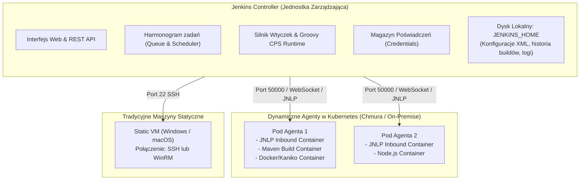
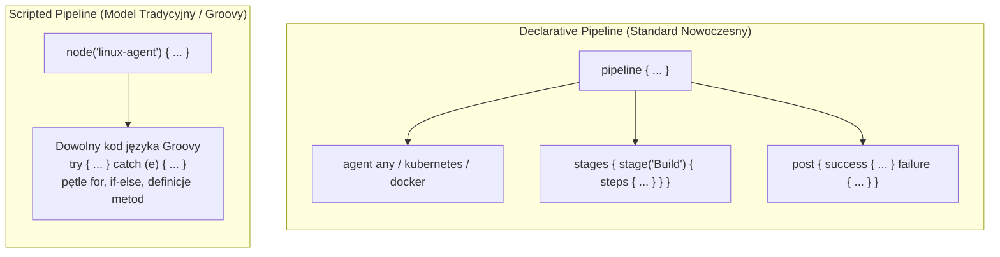
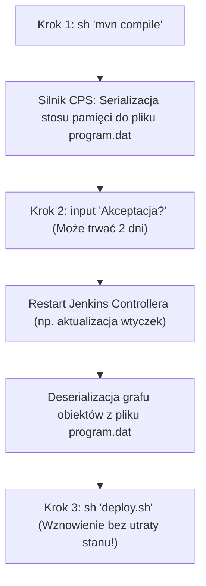

# Jenkins: Niskopoziomowa Architektura Controller-Agent, Groovy DSL i Pytania Rekrutacyjne

Kompleksowe kompendium inżynierskie poświęcone platformie **Jenkins** — jednemu z najbardziej dojrzałych i wszechobecnych serwerów automatyzacji w branży IT. Artykuł szczegółowo analizuje architekturę rozproszoną Controller-Agent, dynamiczne skalowanie agentów w klastrze Kubernetes, składnię Declarative i Scripted Pipeline, niskopoziomowe działanie silnika Groovy CPS (Continuation-Passing Style), projektowanie korporacyjnych bibliotek Jenkins Shared Libraries, podejście Jenkins Configuration as Code (JCasC), bezpieczeństwo poświadczeń oraz obszerny zestaw pytań rekrutacyjnych i realnych scenariuszy awaryjnych (od poziomu Mid po Principal DevOps / Platform Architecta).

---

## Spis Treści
1. [Architektura Rozproszona: Controller i Agenty](#1-architektura-rozproszona-controller-i-agenty)
   - Role i odpowiedzialności: Jenkins Controller vs Agent
   - Protokoły komunikacji: SSH, Inbound Agent (JNLP/Remoting port 50000) oraz WebSocket
   - Dynamiczne skalowanie agentów w klastrze Kubernetes (Kubernetes Plugin)
   - Struktura katalogu `JENKINS_HOME` i wyzwania Disaster Recovery
2. [Język Pipeline: Declarative vs Scripted Pipeline](#2-język-pipeline-declarative-vs-scripted-pipeline)
   - Ewolucja: Od zadań Freestyle do Pipeline as Code (`Jenkinsfile`)
   - Declarative Pipeline: Sztywna struktura blokowa (`pipeline`, `stages`, `steps`)
   - Scripted Pipeline: Imperatywny Groovy bez ograniczeń składniowych
   - Sekcje sterujące: `agent`, `parameters`, `environment`, `options`, `when`, `post`
3. [Wewnętrzny Silnik Wykonawczy: Groovy CPS i Serializacja](#3-wewnętrzny-silnik-wykonawczy-groovy-cps-i-serializacja)
   - Czym jest transformacja CPS (Continuation-Passing Style)?
   - Jak Jenkins zawiesza i wznawia pipeline w locie (przetrwanie restartu Controllera)
   - Zagrożenie: `java.io.NotSerializableException` w pipeline
   - Rola adnotacji `@NonCPS` w metodach pomocniczych
4. [Wzorce Enterprise: Shared Libraries i Jenkins Configuration as Code (JCasC)](#4-wzorce-enterprise-shared-libraries-i-jenkins-configuration-as-code-jcasc)
   - Architektura Jenkins Shared Libraries (`vars/`, `src/`, `resources/`)
   - Wersjonowanie bibliotek i tworzenie korporacyjnych standardów DSL
   - JCasC (`jenkins.yaml`): Eliminacja ręcznej konfiguracji w interfejsie UI
5. [Bezpieczeństwo i Zarządzanie Poświadczeniami (Security & Credentials)](#5-bezpieczeństwo-i-zarządzanie-poświadczeniami-security--credentials)
   - Wtyczka Credentials Binding i obsługa sekretów w kodzie
   - Automatyczne maskowanie haseł w konsoli i pułapki kodowania (Base64 leak)
   - Kontrola dostępu oparta na rolach (Role-Based Authorization Strategy)
6. [Pytania Rekrutacyjne z Odpowiedziami (FAQ Interview)](#6-pytania-rekrutacyjne-z-odpowiedziami-faq-interview)
   - Pytania Podstawowe i Średniozaawansowane (Mid)
   - Pytania Zaawansowane i Architektoniczne (Senior / DevOps Architect)
   - Scenariusze Awaryjne i Live-fire Troubleshooting
7. [Tablica Szybkiej Powtórki (Cheat-Sheet)](#7-tablica-szybkiej-powtórki-cheat-sheet)

---

## 1. Architektura Rozproszona: Controller i Agenty

W nowoczesnej inżynierii DevOps Jenkins nie jest pojedynczą maszyną wykonującą kompilację. Działa w architekturze **rozproszonej (Distributed Architecture)** opartej na podziale ról pomiędzy jednostkę zarządzającą a węzły robocze.



### 1. Jenkins Controller (dawniej Master):
- **Odpowiedzialność:** Hostowanie interfejsu użytkownika, zarządzanie kolejką budowania (*Build Queue*), autoryzacja i uwierzytelnianie, parsowanie skryptów `Jenkinsfile`, zarządzanie wtyczkami oraz logowanie wyników.
- **Żelazna zasada architektoniczna:** **Na Controllerze nigdy nie wolno uruchamiać zadań budowania (Build Executors = 0)**. Uruchamianie kompilacji na Controllerze grozi przepełnieniem pamięci RAM, zapełnieniem dysku oraz stanowi krytyczną lukę bezpieczeństwa (kod testowy mógłby uzyskać pełny dostęp do sekretów i plików konfiguracyjnych całego klastra).

### 2. Jenkins Agenty (Węzły Wykonawcze):
- Są to maszyny wirtualne, fizyczne serwery lub krótkotrwałe pody Kubernetes, których jedynym zadaniem jest wykonanie kroków zadania zleconego przez Controller.
- **Protokoły połączenia:**
  1. **SSH:** Controller inicjuje połączenie wychodzące do agenta i uruchamia na nim plik `remoting.jar`.
  2. **Inbound Agent (JNLP / Remoting port 50000):** Agent inicjuje połączenie przychodzące do Controllera. Niezbędne, gdy agent znajduje się za firewallem lub w sieci prywatnej bez publicznego IP.
  3. **WebSocket (Nowoczesny standard od Jenkins 2.217+):** Agent łączy się z Controllerem przez standardowy port HTTP/HTTPS (np. 443/80), eliminując konieczność otwierania dedykowanego portu 50000.

---

### Dynamiczne Agenty w Kubernetes (Kubernetes Plugin)

Najbardziej elastycznym i opłacalnym modelem w chmurze są **agenty efemeryczne (Ephemeral Agents)**:
- Agent nie istnieje jako stała maszyna.
- W momencie startu zadania w Jenkinsie, wtyczka Kubernetes Plugin tworzy dedykowany **Pod w klastrze K8s**.
- Po zakończeniu pipeline'u pod jest niszczony, co gwarantuje 100% czyste środowisko dla każdego buildu i brak konfliktów zależności.

#### Deklaracja wielokontenerowego Agenta K8s w `Jenkinsfile`:
```groovy
pipeline {
    agent {
        kubernetes {
            yaml '''
apiVersion: v1
kind: Pod
metadata:
  labels:
    some-label: jenkins-build
spec:
  containers:
  - name: maven
    image: maven:3.9-eclipse-temurin-17-alpine
    command: ['sleep']
    args: ['99d']
  - name: docker
    image: docker:26-cli
    command: ['sleep']
    args: ['99d']
    volumeMounts:
    - mountPath: /var/run/docker.sock
      name: docker-sock
  volumes:
  - name: docker-sock
    hostPath:
      path: /var/run/docker.sock
'''
        }
    }
    stages {
        stage('Kompilacja i Testy') {
            steps {
                container('maven') {
                    sh 'mvn clean test'
                }
            }
        }
        stage('Budowanie Obrazu') {
            steps {
                container('docker') {
                    sh 'docker build -t my-app:${BUILD_NUMBER} .'
                }
            }
        }
    }
}
```

---

## 2. Język Pipeline: Declarative vs Scripted Pipeline

W początkowych latach Jenkinsa zadania konfigurowano ręcznie w interfejsie graficznym (*Freestyle Jobs*). Powodowało to brak wersjonowania, brak możliwości audytu zmian w Git i problem z powtarzalnością.
Współczesny standard to **Pipeline as Code** — plik `Jenkinsfile` przechowywany w głównym katalogu repozytorium projektu.



### Porównanie Declarative vs Scripted

| Cecha | Declarative Pipeline | Scripted Pipeline |
| :--- | :--- | :--- |
| **Główny blok** | `pipeline { ... }` | `node { ... }` |
| **Próg wejścia** | Niski — restrykcyjna, czytelna składnia | Wysoki — wymaga znajomości języka Groovy |
| **Walidacja składni** | Statyczna weryfikacja przed startem buildu | Błędy wychodzą w trakcie wykonywania w runtime |
| **Elastyczność logiki** | Ograniczona (wymaga bloku `script {}` dla pętli)| Nieograniczona (pełny język imperatywny) |
| **Rekomendacja** | **Standard dla 95% projektów komercyjnych** | Skomplikowane algorytmy wdrożeń i w Shared Libs |

---

### Pełna Anatomia Declarative Pipeline

```groovy
pipeline {
    agent any

    // Parametry uruchomieniowe (wyświetlane w UI Jenkinsa przy 'Build with Parameters')
    parameters {
        string(name: 'DEPLOY_ENV', defaultValue: 'staging', description: 'Środowisko docelowe')
        booleanParam(name: 'RUN_INTEGRATION_TESTS', defaultValue: true, description: 'Czy uruchomić testy E2E?')
    }

    // Opcje wykonawcze
    options {
        timeout(time: 1, unit: 'HOURS') // Zabij zadanie, jeśli wisi ponad 1h
        retry(2) // Ponów wykonanie pipeline'u w razie błędu sieci
        buildDiscarder(logRotator(numToKeepStr: '30')) // Trzymaj historię tylko 30 ostatnich buildów
        timestamps() // Dodaj znaczniki czasu do logów konsoli
    }

    // Zmienne środowiskowe dostępne we wszystkich etapach
    environment {
        APP_NAME = 'order-service'
        REGISTRY_URL = 'registry.codeassure.io'
    }

    stages {
        stage('Kompilacja') {
            steps {
                echo "Budowanie aplikacji ${APP_NAME} na środowisko ${params.DEPLOY_ENV}..."
                sh './gradlew assemble'
            }
        }

        stage('Testy Integracyjne') {
            // Warunkowe wykonanie etapu
            when {
                expression { return params.RUN_INTEGRATION_TESTS == true }
            }
            steps {
                sh './gradlew integrationTest'
            }
        }

        stage('Wdrożenie Produkcyjne') {
            when {
                branch 'main'
            }
            steps {
                // Wymuszenie manualnej akceptacji w interfejsie Jenkinsa
                input message: 'Czy zatwierdzasz wdrożenie na produkcję?', ok: 'Wdróż'
                sh './deploy.sh production'
            }
        }
    }

    // Sekcja sprzątająca i powiadomień
    post {
        always {
            cleanWs() // Czyszczenie katalogu roboczego (Workspace) po buildzie
        }
        success {
            echo "Pipeline zakończony sukcesem!"
        }
        failure {
            echo "Pipeline upadł! Wysyłanie powiadomienia na Slack / PagerDuty..."
        }
        unstable {
            echo "Testy nie przeszły, ale pipeline został ukończony (Status UNSTABLE)."
        }
    }
}
```

---

## 3. Wewnętrzny Silnik Wykonawczy: Groovy CPS i Serializacja

Jedną z najbardziej unikalnych i zarazem problematycznych cech silnika Jenkins Pipeline jest mechanizm **Continuation-Passing Style (CPS)**.

### Jak Jenkins wykonuje kod w potokach?
W klasycznym programie restart serwera ubija wszystkie działające procesy. Jenkins został zaprojektowany tak, aby **wytrzymać restart Controllera w trakcie wykonywania długotrwałego pipeline'u**:
1. Silnik kompiluje kod Groovy do postaci **CPS**.
2. Przed wykonaniem każdego kroku (np. `sh`, `sleep`, `input`) silnik wykonuje **zrzut pełnego stanu stosu wywołań i zmiennych do pamięci dyskowej** w postaci zserializowanego grafu obiektów Java (`program.dat` w katalogu buildu).
3. Po restarcie Controllera stan jest deserializowany, a pipeline wznawia pracę dokładnie w tym samym punkcie.



---

### Pułapka Pamięciowa: `NotSerializableException`
Ponieważ silnik CPS musi zserializować wszystkie zmienne lokalne w pamięci, użycie obiektu, który **nie implementuje interfejsu `java.io.Serializable`**, skutkuje natychmiastowym przerwaniem pipeline'u z błędem:
`java.io.NotSerializableException: java.util.regex.Matcher`

#### Przykład Błędnego Kodu:
```groovy
// BŁĄD! java.util.regex.Matcher nie jest serializowalny w Java
def matcher = (env.GIT_BRANCH =~ /feature\/(.*)/)
if (matcher.matches()) {
    sh "echo Branch: ${matcher[0][1]}"
}
```

#### Rozwiązanie: Adnotacja `@NonCPS`
Adnotacja `@NonCPS` informuje silnik Jenkinsa: *„Wykonaj tę metodę w standardowym runtime Groovy, bez transformacji CPS i bez prób serializacji stanu”*:

```groovy
// PRAWIDŁOWO: Metoda oznaczona jako @NonCPS
@NonCPS
String extractFeatureName(String branch) {
    def matcher = (branch =~ /feature\/(.*)/)
    return matcher.matches() ? matcher[0][1] : 'unknown'
}

stage('Extract') {
    steps {
        script {
            def name = extractFeatureName(env.GIT_BRANCH)
            echo "Nazwa feature: ${name}"
        }
    }
}
```
> [!NOTE]
> Wewnątrz metod oznaczonych jako `@NonCPS` **nie wolno wywoływać kroków Jenkinsa** takich jak `sh`, `echo`, `archiveArtifacts` czy `sleep`, ponieważ kroki te wymagają obecności transformacji CPS.

---

## 4. Wzorce Enterprise: Shared Libraries i Jenkins Configuration as Code (JCasC)

### Jenkins Shared Libraries (Współdzielone Biblioteki)
W firmie posiadającej 200 mikroserwisów kopiowanie i wklejanie tego samego 200-linijkowego pliku `Jenkinsfile` jest koszmarem utrzymaniowym.
Wzorzec **Shared Libraries** pozwala na wyniesienie wspólnej logiki do odrębnego repozytorium Git.

#### Struktura Repozytorium Biblioteki:
```
my-shared-library/
├── vars/
│   ├── buildJavaService.groovy    <-- Globalna funkcja (Custom Step)
│   └── notifySlack.groovy         <-- Pomocniczy krok powiadomień
├── src/
│   └── com/codeassure/ci/
│       └── DockerUtils.groovy     <-- Klasy obiektowe (czysty Groovy)
└── resources/
    └── k8s/
        └── deployment-template.yaml
```

#### Definicja własnego kroku w `vars/buildJavaService.groovy`:
```groovy
def call(Map config = [:]) {
    pipeline {
        agent { label config.agentLabel ?: 'docker-agent' }
        stages {
            stage('Build & Test') {
                steps {
                    sh "${config.buildCommand ?: './gradlew build'}"
                }
            }
            stage('SonarQube Analysis') {
                steps {
                    withSonarQubeEnv('SonarQube-Prod') {
                        sh './gradlew sonar'
                    }
                }
            }
        }
    }
}
```

#### Zastosowanie w repozytorium projektu (`Jenkinsfile` - 2 linijki!):
```groovy
@Library('codeassure-shared-library@v2.1.0') _

buildJavaService(buildCommand: './gradlew clean build', agentLabel: 'k8s-maven')
```

---

### Jenkins Configuration as Code (JCasC)
Historycznie konfiguracja Jenkinsa (konta, wtyczki, agenty, konfiguracje chmur) była "wyklikiwana" w panelu administratora i zapisywana w tysiącach niespójnych plików XML w katalogu `JENKINS_HOME`.

Standard **JCasC** pozwala na zdefiniowanie **całego stanu Controllera w pojedynczym pliku YAML**:

```yaml
jenkins:
  systemMessage: "Klastrowy serwer CI/CD CodeAssure zarządzany przez GitOps"
  numExecutors: 0 # Żelazna reguła: 0 executorów na Controllerze!
  mode: EXCLUSIVE
  clouds:
    - kubernetes:
        name: "kubernetes"
        serverUrl: "https://kubernetes.default.svc"
        jenkinsUrl: "http://jenkins-service:8080"
        templates:
          - name: "default-jnlp"
            label: "k8s-agent"
            containers:
              - name: "jnlp"
                image: "jenkins/inbound-agent:alpine"

unclassified:
  location:
    url: "https://ci.codeassure.io/"
    adminAddress: "devops@codeassure.io"
```
Plik `jenkins.yaml` znajduje się w repozytorium Git. W przypadku całkowitej awarii maszyny nowy Controller wstaje w kontenerze w 30 sekund z identyczną konfiguracją.

---

## 5. Bezpieczeństwo i Zarządzanie Poświadczeniami (Security & Credentials)

### Bezpieczne Użycie Poświadczeń w Kodzie (`withCredentials`)
Jenkins posiada wbudowany skarbiec poświadczeń. W skryptach pipeline pobieramy sekrety za pomocą wtyczki **Credentials Binding Plugin**:

```groovy
stage('Deploy to Artifactory') {
    steps {
        // Bezpieczne wstrzyknięcie zmiennych środowiskowych z ukryciem wartości w logach
        withCredentials([usernamePassword(
            credentialsId: 'artifactory-deploy-user',
            usernameVariable: 'ARTIFACTORY_USER',
            passwordVariable: 'ARTIFACTORY_PASS'
        )]) {
            sh '''
                echo "Użytkownik: ${ARTIFACTORY_USER}"
                curl -u "${ARTIFACTORY_USER}:${ARTIFACTORY_PASS}" -T app.jar https://repo.codeassure.io/
            '''
        }
    }
}
```

### Pułapka: Wyciek Maskowanego Hasła (Base64 Leak)
Jenkins automatycznie zastępuje znaną wartość hasła gwiazdkami `****` w logach konsoli.
**Jednak mechanizm ten nie chroni przed transformacjami danych**:
```groovy
// ANTYWZORZEC BEZPIECZEŃSTWA:
withCredentials([string(credentialsId: 'my-secret-token', variable: 'TOKEN')]) {
    // Jeśli zakodujesz sekret do Base64, Jenkins NIE ROZPOZNA ciągu w logach!
    sh 'echo $TOKEN | base64' // CIĄG WYCIEKA DO PUBLICZNYCH LOGÓW KONSOLI!
}
```

---

## 6. Pytania Rekrutacyjne z Odpowiedziami (FAQ Interview)

### Pytania Podstawowe i Średniozaawansowane (Mid)

#### Pytanie 1: Czym różni się Declarative Pipeline od Scripted Pipeline?
**Odpowiedź:**
- **Declarative Pipeline (`pipeline { ... }`):**
  - Narzuca ścisłą, ustrukturyzowaną hierarchię bloków.
  - Posiada wbudowaną walidację składni na poziomie analizy statycznej przed startem buildu.
  - Zapewnia łatwiejszą integrację z interfejsem graficznym Blue Ocean / UI oraz czytelne sekcje `post`, `when`, `parameters`.
  - Zalecany dla 95% standardowych potoków budowania.
- **Scripted Pipeline (`node { ... }`):**
  - Oparty na czystym języku imperatywnym Groovy.
  - Brak sztywnych struktur — pozwala na dowolne używanie pętli, konstrukcji warunkowych `if/else`, bloków `try/catch/finally` oraz definiowanie własnych klas i metod.
  - Wymaga zaawansowanej wiedzy programistycznej i jest trudniejszy w debugowaniu błędów wykonawczych.

---

#### Pytanie 2: Dlaczego uruchamianie buildów bezpośrednio na Controllerze (Build Executors > 0) jest uznawane za błąd architektoniczny?
**Odpowiedź:**
Z trzech fundamentalnych przyczyn:
1. **Stabilność klastra:** Ciężkie procesy kompilacji (np. kompilacja C++, testy integracyjne w Java pożerające RAM) mogą doprowadzić do błędu `OutOfMemoryError` na Controllerze, co powoduje zawieszenie całego systemu Jenkinsa dla wszystkich zespołów w firmie.
2. **Bezpieczeństwo danych:** Procesy na Controllerze mają bezpośredni dostęp do katalogu `JENKINS_HOME` — oznacza to, że niezweryfikowany kod testowy w repozytorium może odczytać pliki konfiguracyjne XML, klucze prywatne SSH i wszystkie poświadczenia firmowe.
3. **Skalowalność:** Pojedynczy serwer ma fizyczne ograniczenia CPU/RAM; skalowanie horyzontalne możliwe jest wyłącznie poprzez delegowanie zadań do agentów.

---

#### Pytanie 3: Do czego służy sekcja `post` w Declarative Pipeline i czym różni się warunek `unstable` od `failure`?
**Odpowiedź:**
Sekcja `post` definiuje akcje, które mają wykonać się po zakończeniu etapów `stages`.
- **`failure`:** Oznacza, że pipeline zakończył się twardym błędem wykonania (np. błąd składni, błąd kompilacji, błąd polecenia `sh` z kodem wyjścia innym niż 0, błąd sieci).
- **`unstable`:** Oznacza, że kod się skompilował, a proces zakończył sukcesem, ale narzędzia analityczne wykryły problemy biznesowe — najczęściej dotyczy to **testów jednostkowych, które nie przeszły** (krok `junit` oznaczył build jako niestabilny) lub naruszenia reguł jakości kodu w SonarQube. Wdrożenia produkcyjne powinny być blokowane zarówno dla statusu `failure`, jak i `unstable`.

---

#### Pytanie 4: Czym różni się instrukcja warunkowa `when` od bloku `if` w Groovy?
**Odpowiedź:**
- Dyrektywa **`when`** jest natywnym elementem Declarative Pipeline. Decyduje o tym, czy dany etap (`stage`) w ogóle ma zostać uruchomiony. Jeśli warunek nie jest spełniony, etap w interfejsie graficznym zostaje oznaczony jako pominięty (*Skipped*), co daje czytelną wizualizację przebiegu w UI bez wchodzenia do wnętrza etapu.
- Instrukcja **`if`** wymaga użycia bloku `script { ... }` wewnątrz `steps`. Nawet jeśli warunek `if` pominie kod, etap i tak zostanie uruchomiony, zarezerwuje agenta i odnotuje czas wykonania w metrykach, co zaciemnia czytelność raportu.

---

#### Pytanie 5: Czym jest wtyczka Blue Ocean w ekosystemie Jenkinsa?
**Odpowiedź:**
Blue Ocean to oficjalny interfejs graficzny nowej generacji zaprojektowany dla Jenkins Pipeline:
- Zastępuje tradycyjny, tabelaryczny widok Jenkinsa nowoczesnym, czytelnym grafem przepływu etapów (*Pipeline Graph*).
- Pozwala na wizualną analizę etapów równoległych (*Parallel stages*).
- Zapewnia inteligentne filtrowanie logów — automatycznie rozwija i podświetla dokładnie ten fragment logu konsoli, w którym wystąpił błąd, eliminując konieczność ręcznego przeszukiwania wielomegabajtowych logów tekstowych.

---

### Pytania Zaawansowane i Architektoniczne (Senior / DevOps Architect)

#### Pytanie 6: Wyjaśnij niskopoziomowe działanie silnika Groovy CPS w Jenkins Pipeline. Kiedy i dlaczego dochodzi do błędu `NotSerializableException`?
**Odpowiedź:**
Jenkins Pipeline wykorzystuje mechanizm **Continuation-Passing Style (CPS)**:
- Przed wykonaniem każdego kroku program Groovy jest przekształcany w maszynę stanów.
- Silnik utrwala cały stan programu (zmienne lokalne, stan pętli, stos wywołań) do postaci zserializowanej na dysku (`program.dat`).
- Umożliwia to przetrwanie restartu serwera Jenkinsa i wznawianie długotrwałych zadań.

**Przyczyna `NotSerializableException`:**
W momencie, gdy w zasięgu zmiennych lokalnych pipeline'u znajdzie się obiekt klasy Java, która nie implementuje `java.io.Serializable` (np. obiekty `java.util.regex.Matcher`, strumienie I/O, połączenia sieciowe lub niektóre struktury domknięć Groovy), silnik Java rzuca wyjątek serializacji, przerywając build.

**Rozwiązanie:**
1. Wyniesienie nietrwałych operacji do metod pomocniczych oznaczonych adnotacją **`@NonCPS`**.
2. Niszczenie referencji do obiektów nieserializowalnych (`matcher = null`) przed wywołaniem kolejnego kroku Jenkinsa.

---

#### Pytanie 7: Jak zaprojektować skalowalną architekturę Jenkins Shared Libraries dla setek aplikacji w organizacji?
**Odpowiedź:**
Profesjonalna architektura korporacyjna opiera się na 3 filarach:
1. **Wersjonowanie biblioteki (SemVer i Git Tags):**
   Nigdy nie należy podpinać biblioteki na gałęzi `master`/`main`. W `Jenkinsfile` wymuszamy konkretny tag wydania: `@Library('corp-shared-lib@v2.4.1') _`. Zmiany w bibliotece przechodzą przez standardowy proces Code Review i testy jednostkowe.
2. **Testowanie jednostkowe kodu biblioteki:**
   Wykorzystanie frameworka **JenkinsPipelineUnit** lub Spock w Java/Groovy do testowania logiki Shared Libs w izolacji (mockowanie kroków takich jak `sh`, `echo`, `withCredentials`).
3. **Abstrakcja wysokopoziomowa (Wzorzec Template Pipeline):**
   Dla standardowych aplikacji definiuje się pojedynczy krok fasadowy, np. `standardMicroservicePipeline(type: 'spring-boot', port: 8080)`. Zespoły deweloperskie nie piszą własnych etapów budowania, a jedynie deklarują parametry biznesowe, co zapewnia 100% spójność bezpieczeństwa, skanowania SonarQube i audytu w całej korporacji.

---

#### Pytanie 8: Jak działa integracja Jenkinsa z Kubernetesem i jak uniknąć wąskiego gardła zasobów przy 1000 buildów dziennie?
**Odpowiedź:**
Integracja opiera się na wtyczce **Kubernetes Plugin**:
1. Controller komunikuje się z API klastra Kubernetes (przez ServiceAccount token).
2. Na żądanie utworzenia agenta wtyczka wykonuje wywołanie `POST /api/v1/namespaces/{ns}/pods`, tworząc tymczasowy pod z kontenerem `inbound-agent` (obsługującym protokół remoting) oraz kontenerami roboczymi (Maven, Go, Node).
3. Po zakończeniu zadania pod jest automatycznie usuwany.

**Optymalizacje wydajnościowe przy dużej skali:**
- **Cache zależności (Persistent Volume Claims vs Object Storage):** Współdzielony wolumen PVC z trybem `ReadWriteMany` (np. NFS/EFS) dla katalogów `~/.m2` lub `~/.npm` zapobiega pobieraniu gigabajtów bibliotek z Internetu przy każdym uruchomieniu poda.
- **Limity i Resource Quotas:** Bezwzględne definiowanie `resources.requests` i `resources.limits` (CPU i RAM) w pod templates, aby zapobiec zagłodzeniu klastra K8s.
- **Node Taints i Tolerations:** Dedykowanie osobnej puli węzłów Kubernetes (np. Spot/Preemptible instances w chmurze AWS/GCP) wyłącznie dla zadań Jenkinsa, odizolowanej od produkcyjnych aplikacji.

---

#### Pytanie 9: Czym jest Jenkins Configuration as Code (JCasC) i jak realizuje paradygmat GitOps w zarządzaniu infrastrukturą CI/CD?
**Odpowiedź:**
JCasC eliminuje ręczną, podatną na błędy ludzkie konfigurację Jenkinsa przez interfejs graficzny:
- Cały stan serwera (konfiguracja bezpieczeństwa, integracje z GitHub/GitLab, definicje chmur Kubernetes, zmienne globalne, konfiguracja narzędzi JDK/Maven) jest opisany w czytelnym dla człowieka pliku `jenkins.yaml`.
- Plik ten znajduje się w repozytorium Git.
- **Przepływ GitOps:** Modyfikacja pliku w Git uruchamia pipeline testujący poprawność składniową za pomocą oficjalnego schematu JSON/YAML, po czym aplikuje zmiany na działającym klastrze za pośrednictwem endpointu REST `reload-configuration-as-code` bez przestoju serwera.
- W połączeniu z wtyczką `plugin-installation-manager-tool` pozwala na wdrożenie w pełni odtwarzalnego, niemutowalnego kontenera Controllera w dowolnej chmurze.

---

#### Pytanie 10: Jak zarządzać wieloma gałęziami i repozytoriami za pomocą wzorca Multibranch Pipeline?
**Odpowiedź:**
Projekt typu **Multibranch Pipeline**:
- Zamiast konfigurować osobne zadanie dla każdej gałęzi, Jenkins skanuje całe repozytorium Git (lub całą organizację na GitHub/GitLab).
- Dla każdej gałęzi zawierającej plik `Jenkinsfile` automatycznie tworzy odrębny pod-projekt z własną historią buildów.
- W momencie utworzenia Pull Requesta automatycznie uruchamia pipeline weryfikacyjny (status check blokujący merge w Git).
- Gdy gałąź zostaje usunięta z Git, Jenkins automatycznie archiwizuje lub usuwa powiązane zadanie, co całkowicie eliminuje ręczne sprzątanie starych jobów.

---

### Scenariusze Awaryjne i Live-fire Troubleshooting

#### Scenariusz 1: Zawieszenie całego Jenkinsa z powodu zapełnienia dysku (`JENKINS_HOME` 100% Full)
* **Objaw produkcyjny:** Żadne nowe zadanie nie może wystartować. W logach Controllera pojawiają się błędy `No space left on device`. Logowanie do interfejsu webowego kończy się błędem HTTP 500.
* **Analiza Root Cause:**
  1. Sprawdzenie wykorzystania dysku za pomocą `du -sh $JENKINS_HOME/*`.
  2. Katalogi `builds/` oraz `workspaces/` zajmowały setki gigabajtów.
  3. Zespoły w swoich pipeline'ach archiwizowały gigabajtowe pliki instalacyjne i raporty (`archiveArtifacts '**/*.iso'`) bez zdefiniowanej polityki rotacji historii buildów.
* **Rozwiązanie i Naprawa:**
  1. Natychmiastowe usunięcie starych katalogów `workspace/` za pomocą skryptu administratorskiego w Jenkins Script Console (`Groovy Console`).
  2. Globalne wymuszenie polityki retencji za pomocą **Build Discarder**:
     ```groovy
     options {
         buildDiscarder(logRotator(numToKeepStr: '20', artifactNumToKeepStr: '5'))
     }
     ```
  3. Przeniesienie długoterminowego przechowywania artefaktów z dysku Jenkinsa do dedykowanego magazynu (Nexus, JFrog Artifactory lub Amazon S3).

---

#### Scenariusz 2: Agent w Kubernetesie nie może połączyć się z Controllerem (`Remoting error: JNLP connection timeout`)
* **Objaw produkcyjny:** Pipeline wisi na etapie `Waiting for agent to connect...`, po czym kończy się timeoutem. W klastrze K8s pod agenta wstaje, ale natychmiast przechodzi w stan `Error` lub `CrashLoopBackOff`.
* **Analiza Root Cause:**
  1. Sprawdzenie logów kontenera `jnlp` w podzie agenta: `kubectl logs <pod-name> -c jnlp`.
  2. Błąd w logach: `Failed to connect to jenkins-controller:50000: Connection refused`.
  3. Controller nie posiadał otwartego portu TCP 50000 w usłudze Kubernetes Service lub zmienna środowiskowa `JENKINS_TUNNEL` nie została skonfigurowana.
* **Rozwiązanie i Naprawa:**
  1. Utworzenie dedykowanego serwisu K8s dla portu agentów (port 50000 TCP).
  2. Alternatywnie (rekomendowane): przełączenie komunikacji na **protokół WebSocket** w konfiguracji wtyczki Kubernetes Plugin (`jenkinsUrl: "http://jenkins:8080"`, włączenie flagi `webSocket: true`), co eliminuje potrzebę otwierania osobnego portu 50000.

---

#### Scenariusz 3: Błąd `java.io.NotSerializableException: java.util.regex.Matcher` niszczący pipeline
* **Objaw produkcyjny:** Build kończy się nagłą awarią zrzutu stosu:
  `an exception which occurred: in field com.cloudbees.groovy.cps.impl.BlockScopeEnv.locals ... Caused by: java.io.NotSerializableException: java.util.regex.Matcher`.
* **Analiza Root Cause:**
  Programista użył wyrażenia regularnego języka Groovy wewnątrz bloku `steps` Declarative Pipeline, a następnie bezpośrednio po nim wywołał krok Jenkinsa `sh`:
  ```groovy
  script {
      def m = text =~ /pattern/
      if (m.find()) {
          sh "echo Found" // Krok sh wymusza serializację CPS, a obiekt 'm' jest w pamięci!
      }
  }
  ```
* **Rozwiązanie i Naprawa:**
  1. Wyniesienie logiki do metody z adnotacją `@NonCPS`:
     ```groovy
     @NonCPS
     boolean checkPattern(String text) {
         return (text =~ /pattern/).find()
     }
     ```
  2. Lub natychmiastowe zresetowanie wskaźnika obiektu: `m = null` przed wywołaniem kroku `sh`.

---

## 7. Tablica Szybkiej Powtórki (Cheat-Sheet)

| Zagadnienie / Dyrektywa | Zastosowanie / Opis |
| :--- | :--- |
| **`pipeline { ... }`** | Główny kontener Declarative Pipeline |
| **`agent { kubernetes { ... } }`** | Dynamiczny pod roboczy w klastrze K8s (efemeryczny) |
| **`agent none`** | Wyłączenie globalnego agenta (wymusza deklarację agenta w każdym `stage`) |
| **`options { buildDiscarder(...) }`**| Rotacja logów i usuwanie starych buildów w celu ochrony dysku |
| **`when { branch 'main' }`** | Warunkowe wykonanie etapu z poprawnym oznaczeniem w UI |
| **`post { always / failure }`** | Bloki czyszczące i wysyłające powiadomienia po buildzie |
| **`cleanWs()`** | Czyszczenie katalogu roboczego agenta po zakończeniu zadania |
| **`withCredentials([...])`** | Bezpieczne wstrzyknięcie haseł/kluczy z automatycznym maskowaniem |
| **`@NonCPS`** | Wyłączenie serializacji CPS dla metod Groovy (unika `NotSerializableException`) |
| **`@Library('lib@tag') _`** | Import wersji współdzielonej biblioteki Jenkins Shared Library |
| **JCasC (`jenkins.yaml`)** | Pełna deklaratywna konfiguracja Controllera w kodzie YAML |
| **Port 50000** | Tradycyjny port Inbound Agent JNLP (zastępowany przez WebSocket) |
