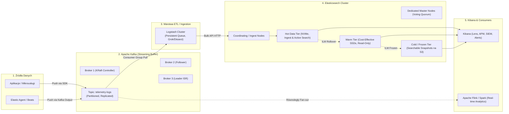
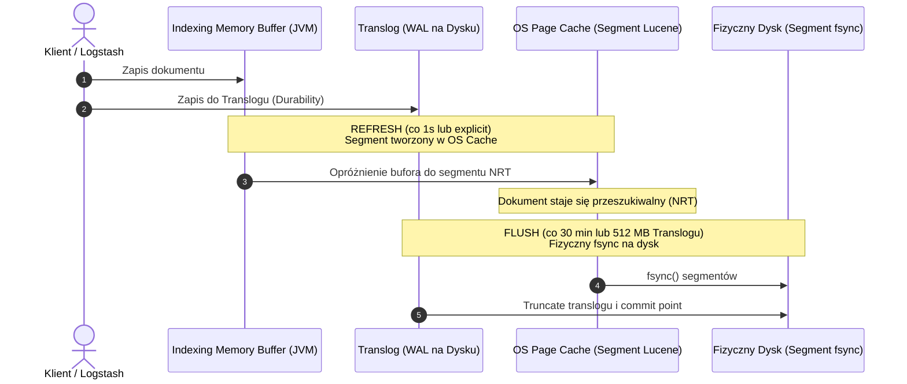

---
title: "Apache Kafka & ELK Stack - Architektura Strumieniowa, Wyszukiwanie i Pytania Rekrutacyjne"
description: "Głębokie kompendium architektury Kafka (KRaft, Zero-Copy, EOS) oraz stosu ELK (Elasticsearch, Logstash, Kibana, Beats, ES|QL, HNSW, tuning JVM) z pytaniami rekrutacyjnymi."
date: "2026-09-23"
tags: ["Kafka", "Elasticsearch", "ELK", "Kibana", "Logstash", "DistributedSystems", "Interview", "General-IT"]
order: 3
---
# Kompendium Wiedzy i Pytania Rekrutacyjne: Apache Kafka & ELK Stack (Rozszerzone)

Kompleksowy przewodnik techniczny i rekrutacyjny obejmujący architekturę, mechanizmy niskopoziomowe, strojenie wydajności, dobre praktyki oraz zestaw pytań i odpowiedzi (od poziomu Mid do Principal/Architect) z naciskiem na **Apache Kafka**, **Elasticsearch** oraz **Kibana**.

---

## Spis Treści
1. [Architektura Systemów: Kafka + ELK Pipeline](#1-architektura-systemów-kafka--elk-pipeline)
2. [Apache Kafka — Głębokie Kompendium](#2-apache-kafka--głębokie-kompendium)
   - Architektura klastra i jednostki danych
   - KRaft vs ZooKeeper
   - Niskopoziomowa wydajność (Zero-Copy, Page Cache, Batching)
   - Semantyka dostarczania (At-least-once, Idempotence, EOS)
   - Mechanika Consumer Group i Rebalancing
   - Retencja, Segmenty i Log Compaction
3. [Elasticsearch — Architektura i Lucene (Zaawansowane)](#3-elasticsearch--architektura-i-lucene-zaawansowane)
   - Role węzłów (Node Roles)
   - Shardy, Repliki, Routing i Shard Sizing
   - Lucene pod maską: Inverted Index, BKD Trees, Doc Values
   - Cykl życia zapisu: Translog, Refresh vs Flush, Segment Merging
   - Mapowania: `text` vs `keyword`, `flattened`, `nested` vs `join`
   - Trafność i Scoring: TF-IDF vs Okapi BM25
   - Wyszukiwanie Semantyczne i Wektorowe (kNN, HNSW, Hybrid Search & RRF)
   - Języki zapytań: Query DSL vs Nowoczesny ES|QL
   - Agregacje: Metric, Bucket, Pipeline i algorytm HyperLogLog++
   - Strojenie JVM i Systemu: Compressed OOPs, Circuit Breakers, Swapping
   - Zarządzanie danymi: ILM (Index Lifecycle Management) i Data Streams
   - Bezpieczeństwo: RBAC, Document-Level (DLS) & Field-Level Security (FLS)
4. [Kibana & Observability — Kompendium Techniczne](#4-kibana--observability--kompendium-techniczne)
   - Architektura Kibany: Node.js, Saved Objects, Task Manager
   - Data Views i Runtime Fields (Painless scripts)
   - Wizualizacje: Kibana Lens vs TSVB vs Vega / Canvas
   - Nowoczesny Ingestion: Fleet & Elastic Agent vs Beats
   - Observability & APM: Traces, Spans, OpenTelemetry
   - Silnik Reguł i Alerting (Alerting Engine & Action Connectors)
   - Spaces, Bezpieczeństwo i Izolacja Tenantów
5. [Logstash, Beats i Ingest Pipelines](#5-logstash-beats-i-ingest-pipelines)
   - Beats vs Logstash vs Ingest Pipelines
   - Logstash: Pipeline, Grok, Dissect, Mutate
   - Odporność na awarie: Persistent Queues (PQ) i DLQ
6. [Pytania Rekrutacyjne z Odpowiedziami](#6-pytania-rekrutacyjne-z-odpowiedziami)
   - Apache Kafka (Mid / Senior / Lead)
   - Elasticsearch: Architektura, JVM i Lucene (Deep Dive)
   - Elasticsearch: Scoring, Wektory, Zapytania i Agregacje
   - Kibana, Fleet & Zarządzanie Danymi
   - Scenariusze Awaryjne i Troubleshooting (Live-fire Scenarios)
7. [Tablica Szybkiej Powtórki (Cheat-Sheet)](#7-tablica-szybkiej-powtórki-cheat-sheet)

---

## 1. Architektura Systemów: Kafka + ELK Pipeline

W nowoczesnych środowiskach korporacyjnych (High-Throughput Logging, SIEM, Real-Time Analytics) Apache Kafka i Elastic Stack (Elasticsearch, Logstash, Kibana) tworzą zintegrowany, wysoce skalowalny ekosystem.



### Rola poszczególnych komponentów:
* **Kafka jako Shock Absorber (Backpressure Management):** Elasticsearch nie jest bazą zoptymalizowaną do buforowania nagłych skoków ruchu (może dojść do zapełnienia kolejki `write threadpool` i błędów HTTP 429). Kafka odkłada zdarzenia na dysk w sposób sekwencyjny, dając konsumentom czas na ich przetworzenie.
* **Architektura Fan-out:** Dane z Kafki mogą być równolegle pobierane przez Logstash do Elasticsearch oraz przez silniki strumieniowe (Flink, Spark) do analityki predykcyjnej czy detekcji fraudów.
* **Elasticsearch jako Search & Analytics Engine:** Indeksuje ustrukturyzowane i nieustrukturyzowane dane, umożliwiając błyskawiczne agregacje i wyszukiwanie pełnotekstowe oraz wektorowe.
* **Kibana jako Single Pane of Glass:** Panel zarządzania klastrem, wizualizacji metryk, logów, śladów (traces APM) oraz reguł bezpieczeństwa SIEM.

---

## 2. Apache Kafka — Głębokie Kompendium

### Architektura klastra i jednostki danych
* **Topic & Partition:** Topic jest logicznym bytem; fizycznie dzieli się na partycje. Każda partycja to uporządkowany, append-only log na dysku brokera. Partycja jest niepodzielną jednostką skalowalności i równoległości w Kafce.
* **Offset:** Monotonicznie rosnący numer identyfikacyjny przypisywany każdemu rekordowi wewnątrz danej partycji. Gwarancja kolejności w Kafce zachowana jest **wyłącznie w ramach jednej partycji**.
* **Broker & Controller:** Brokerzy odpowiadają za zapis/odczyt i replikację danych. W klastrze jeden lub więcej węzłów zarządza metadanymi jako Controller.

### KRaft (Kafka Raft Metadata Mode) vs ZooKeeper
* **ZooKeeper (Legacy, wycofany w Kafka 4.0):**
  - Metadane przechowywane poza procesem Kafki w zewnętrznym systemie ZK.
  - Zmiany stanu (np. awaria brokera) wymagały powiadomienia ZK -> Controller w Kafce -> rozgłoszenie do brokerów.
  - Ograniczenie skalowalności do kilkuset tysięcy partycji (tzw. zjawisko *metadata storm*).
* **KRaft (Współczesny standard):**
  - Zaimplementowany wewnętrzny protokół konsensusu bazujący na Raft.
  - Metadane zapisywane są w dedykowanym topiku Kafki (`@metadata`).
  - Wybór nowego kontrolera następuje w milisekundach, ponieważ stan metadanych jest stale replikowany do węzłów kworum i utrzymywany w ich pamięci RAM.
  - Skalowalność do milionów partycji w klastrze.

### Niskopoziomowa wydajność — dlaczego Kafka jest tak szybka?
1. **Sequential I/O (Sekwencyjny zapis na dysku):**
   - Zapis danych polega wyłącznie na dopisywaniu na koniec pliku (append-only log). Eliminuje to kosztowne przeskoki głowicy dysku (seek time w HDD) oraz optymalizuje pracę kontrolera NVMe/SSD.
2. **Page Cache systemu operacyjnego:**
   - Broker Kafki celowo nie zarządza buforami wiadomości wewnątrz pamięci sterty JVM (Heap). Zamiast tego deleguje buforowanie do **Page Cache** jądra Linuksa. Dzięki temu unika narzutu i pauz Garbage Collectora (Stop-the-World GC pauses).
3. **Zero-Copy Data Transfer (`sendfile` syscall):**
   - Standardowy odczyt sieciowy: Dysk -> OS Page Cache -> JVM User Space -> Socket Buffer -> Karta sieciowa (NIC) (4 kopiowania danych i 4 przełączenia kontekstu).
   - Zero-Copy w Kafce: Wykorzystanie wywołania systemowego `sendfile()`. Dane wędrują bezpośrednio z OS Page Cache do bufora karty sieciowej NIC, całkowicie z pominięciem przestrzeni użytkownika (User Space).
4. **Batching i kompresja end-to-end:**
   - Producent grupuje wiadomości w paczki (`RecordBatch`). Kompresja (LZ4, Snappy, zstd) wykonywana jest raz po stronie producenta. Broker zapisuje skompresowaną paczkę bez dekompresji. Dekompresji dokonuje dopiero konsument.

### Semantyka dostarczania (Delivery Guarantees)
* **At-most-once:** Commit offsetu następuje *przed* zakończeniem przetwarzania wiadomości. Jeśli konsument ulegnie awarii w trakcie, wiadomość przepada.
* **At-least-once (Domyślna):** Commit offsetu następuje *po* przetworzeniu wiadomości. W przypadku błędu sieci lub restartu konsumenta przed commitem, wiadomość może zostać przetworzona ponownie (duplikaty).
* **Exactly-Once Semantics (EOS):**
  - **Idempotent Producer (`enable.idempotence=true`):** Chroni przed duplikatami wynikającymi z powtórzeń sieciowych (retries). Producent otrzymuje Producer ID (PID), a każda paczka ma `Sequence Number`. Broker odrzuca pakiety o znanym już numerze sekwencji.
  - **Transakcje (`transactional.id`):** Umożliwiają atomowe operacje na wielu topikach w schemacie *consume-transform-produce* za pośrednictwem modułu Transaction Coordinator i topiku `__transaction_state`. Konsumenci czytają wyłącznie dane zatwierdzone (`isolation.level=read_committed`).

### Parametry niezawodności Producenta:
* `acks=0`: Producent nie czeka na żadną odpowiedź brokera (maksymalna przepustowość, ryzyko utraty danych).
* `acks=1`: Potwierdzenie po zapisie na dysku partycji lidera.
* `acks=all` (lub `-1`): Potwierdzenie po zapisaniu przez lidera i wszystkie aktywne repliki w **ISR (In-Sync Replicas)**. W połączeniu z `min.insync.replicas=2` i `replication.factor=3` stanowi żelazny standard odporności na awarie.

---

## 3. Elasticsearch — Architektura i Lucene (Zaawansowane)

Elasticsearch to rozproszony silnik wyszukiwania i analityki oparty na bibliotece **Apache Lucene**.

### Role Węzłów (Node Roles)
W architekturze produkcyjnej węzły powinny być dedykowane:
* `master` (lub `cluster_manager`): Zarządza stanem klastra (tworzenie indeksów, alokacja shardów, topologia). Nie bierze udziału w indeksowaniu ani wyszukiwaniu.
* `data_hot`: Szybkie dyski NVMe, duży CPU. Odpowiada za bezpośredni zapis, częsty refresh i bieżące zapytania.
* `data_warm`: Tanie dyski SSD/HDD. Dane tylko do odczytu, rzadsze zapytania.
* `data_cold` / `data_frozen`: Przechowuje indeksy w postaci *Searchable Snapshots* na chmurowych magazynach obiektowych (AWS S3, Azure Blob, GCS).
* `ingest`: Wykonuje potoki transformacji (Ingest Pipelines: grok, geoip, dissect, set) przed fizycznym zapisem.
* `coordinating_only`: Węzeł bez danych i ról funkcyjnych. Przyjmuje zapytania HTTP od aplikacji/Kibany, rozprasza je do shardów i agreguje wyniki (scatter-gather).

### Shardy, Repliki, Routing i Shard Sizing
* **Primary vs Replica Shards:** Każdy indeks składa się z $N$ Primary Shardów. Każdy Primary Shard może mieć $M$ replik (dla High Availability i skalowania odczytu).
* **Algorytm Routingu:**
  $$\text{shard\_id} = \text{hash}(\text{routing\_value}) \pmod{\text{number\_of\_primary\_shards}}$$
  Domyślnie `routing_value` to `_id` dokumentu. Własny routing pozwala kierować dokumenty tego samego tenanta (np. `routing=tenant_id`) do tego samego shardu, optymalizując zapytania (routing search).
* **Reguły Shard Sizingu (Najważniejsze metryki architektoniczne):**
  - **Optymalny rozmiar shardu:** Dla logów i metryk: **30 GB – 50 GB**. Dla zapytań pełnotekstowych o niskich opóźnieniach: **10 GB – 30 GB**.
  - **Limit shardów na węzeł:** Nie przekraczać **20 shardów na 1 GB sterty JVM** (np. dla 30 GB Heap max 600 shardów na węzeł).
  - **Oversharding (Zbyt wiele shardów):** Prowadzi do ogromnego zużycia pamięci sterty na metadane Lucene, fragmentacji operacji I/O i blokowania wątków wyszukiwania.

### Lucene pod maską: Inverted Index, BKD Trees, Doc Values

```
Zbiór dokumentów:
Doc 1: "Kafka is fast"
Doc 2: "Elasticsearch is fast and scalable"

Inverted Index (Odwrócony Indeks dla pól 'text'):
+---------------+---------------+--------------------+
| Term (Słowo)  | Doc Frequency | Posting List (ID)  |
+---------------+---------------+--------------------+
| "elasticsearch"| 1             | [Doc 2]            |
| "fast"        | 2             | [Doc 1, Doc 2]     |
| "is"          | 2             | [Doc 1, Doc 2]     |
| "kafka"       | 1             | [Doc 1]            |
| "scalable"    | 1             | [Doc 2]            |
+---------------+---------------+--------------------+
```

* **Inverted Index (Odwrócony Indeks):** Mapuje unikalne słowa (termy) na identyfikatory dokumentów, w których występują (tzw. *Posting List*). Obsługuje wyszukiwanie pełnotekstowe.
* **BKD Trees:** Złożone, wielowymiarowe struktury drzewiaste służące do błyskawicznego indeksowania i filtrowania liczb, dat oraz współrzędnych geograficznych (`geo_point`).
* **Doc Values:** Kolumnowy format zapisu na dysku generowany w czasie indeksowania dla pól typu `keyword`, liczb, dat i booleanów. Umożliwia ultraszybkie sortowanie, agregacje i obliczenia skryptowe.
* **Fielddata:** Odpowiednik Doc Values dla pól `text`, ładowany dynamicznie do pamięci JVM Heap w momencie pierwszego zapytania. **Antywzorzec w produkcji** — łatwo doprowadza do `OutOfMemoryError`.

### Cykl Życia Zapisu: Refresh vs Flush



* **Refresh:** Tworzy nowy segment Lucene w pamięci podręcznej systemu operacyjnego (OS Cache). Domyślny interwał to `1s`. Dokument staje się widoczny dla wyszukiwarki (**Near Real-Time**).
* **Flush:** Zapewnia pełną trwałość (ACID durability). Wykonuje systemowy `fsync` danych z buforów do fizycznych plików na dysku oraz czyści i resetuje **Translog** (Write-Ahead Log).

### Mapowania: `text` vs `keyword`, `flattened`, `nested` vs `join`
* **`text` vs `keyword`:**
  - `text`: Podlega analizie leksykalnej (tokenizacja, lowercase, stemming). Służy do zapytań `match`.
  - `keyword`: Nieanalizowany ciąg znaków, zapisywany w całości. Posiada Doc Values, idealny do filtrów `term`, agregacji i sortowania.
* **`flattened`:** Obiekt JSON o dowolnej, zagnieżdżonej strukturze traktowany jako płaski zbiór par klucz-wartość. **Chroni przed Mapping Explosion**.
* **`nested` vs `join`:**
  - `nested`: Każdy obiekt w tablicy jest indeksowany jako ukryty, niezależny dokument Lucene w tym samym bloku segmentu. Zapewnia integralność relacji między polami zagnieżdżonego obiektu.
  - `join`: Relacje rodzic-dziecko (Parent-Child) między różnymi dokumentami w tym samym shardzie. Pozwala na aktualizację dziecka bez przepisywania rodzica, lecz wiąże się ze znacznym spadkiem wydajności zapytań (`has_child`, `has_parent`).

### Trafność i Scoring: TF-IDF vs Okapi BM25
Od wersji 5.x Elasticsearch używa **Okapi BM25** jako domyślnego algorytmu oceny trafności (relevance scoring):
$$\text{Score}(D, Q) = \sum_{i=1}^{N} \text{IDF}(q_i) \cdot \frac{f(q_i, D) \cdot (k_1 + 1)}{f(q_i, D) + k_1 \cdot \left(1 - b + b \cdot \frac{|D|}{\text{avgdl}}\right)}$$

* **Term Frequency (TF) Saturation:** W klasycznym TF-IDF 100-krotne wystąpienie słowa dawało 100-krotnie wyższą wagę. W BM25 parametr $k_1$ (zwykle $1.2$) ustala nasycenie (asymptotę) — po osiągnięciu pewnej liczby powtórzeń waga słowa przestaje gwałtownie rosnąć.
* **Document Length Normalization ($b$):** Parametr $b$ (domyślnie $0.75$) reguluje karę za długość dokumentu. Jeśli słowo występuje w krótkim tytule, ma wyższą wartość niż to samo słowo w 200-stronicowej książce.

### Wyszukiwanie Semantyczne i Wektorowe (kNN, HNSW, Hybrid Search & RRF)
Nowoczesny Elasticsearch wspiera natywne wyszukiwanie wektorowe:
* **`dense_vector`:** Typ pola przechowujący embeddingi wygenerowane przez modele LLM/NLP (np. 384, 768, 1536 wymiarów).
* **Algorytm HNSW (Hierarchical Navigable Small World):** Wielopoziomowy graf przybliżonego wyszukiwania najbliższych sąsiadów (Approximate kNN), gwarantujący sub-sekundowe wyszukiwanie w milionach wektorów.
* **Hybrid Search (Wyszukiwanie Hybrydowe):** Łączenie tradycyjnego wyszukiwania leksykalnego BM25 z wektorowym wyszukiwaniem semantycznym.
* **RRF (Reciprocal Rank Fusion):** Algorytm łączący i normalizujący pozycje wyników z obu metod wyszukiwania bez konieczności kalibracji absolutnych wartości score:
  $$\text{RRF Score}(d) = \sum_{m \in M} \frac{1}{k + r_m(d)}$$
  gdzie $r_m(d)$ to pozycja dokumentu $d$ w rankingu metody $m$, a $k$ to stała wygładzająca (zwykle 60).

### Języki Zapytań: Query DSL vs Nowoczesny ES|QL

#### 1. Tradycyjny Query DSL (`bool` query):
```json
GET logs-app-*/_search
{
  "query": {
    "bool": {
      "must": [
        { "match": { "message": "database connection timeout" } }
      ],
      "filter": [
        { "term": { "service.environment": "production" } },
        { "range": { "@timestamp": { "gte": "now-1h" } } }
      ]
    }
  },
  "aggs": {
    "errors_per_host": {
      "terms": { "field": "host.name", "size": 10 }
    }
  }
}
```
* **Query Context (`must`, `should`):** Oblicza `_score` (trafność). Brak możliwości agresywnego cache'owania.
* **Filter Context (`filter`, `must_not`):** Operacja binarna (tak/nie). Nie wpływa na `_score`. Wyniki filtrów są **automatycznie cache'owane w pamięci węzła (Node Query Cache)**.

#### 2. Nowoczesny ES|QL (Elasticsearch Query Language):
Nowa składnia potokowa (pipe syntax, zbliżona do Splunk SPL czy Kusto KQL), wykonująca operacje iteracyjnie i równolegle na poziomie silnika:
```sql
FROM logs-app-*
| WHERE service.environment == "production" AND @timestamp >= NOW() - 1 HOUR
| WHERE message LIKE "*database connection timeout*"
| STATS error_count = COUNT() BY host.name
| SORT error_count DESC
| LIMIT 10
```

### Agregacje: Metric, Bucket, Pipeline i algorytm HyperLogLog++
* **Metric Aggregations:** Obliczają wartości liczbowe z dokumentów: `avg`, `sum`, `min`, `max`, `stats`, `percentiles` (algorytm T-Digest).
* **Bucket Aggregations:** Dzielą dokumenty na zbiory (kubełki): `terms`, `date_histogram`, `range`, `composite` (do stronicowania dużych agregacji).
* **Pipeline Aggregations:** Agregacje liczone na wynikach innych agregacji (np. `derivative`, `moving_avg`, `bucket_script` do wyliczania współczynnika błędów % = errors / total).
* **Dokładność Cardinality i Algorytm HyperLogLog++:**
  - Wyliczanie unikalnych wartości (np. unikalni użytkownicy w milionach logów) zużywałoby gigabajty RAM w podejściu deterministycznym.
  - Elasticsearch używa probabilistycznego algorytmu **HyperLogLog++**.
  - Parametr `precision_threshold` (domyślnie 3000, max 40000) pozwala balansować między zużyciem pamięci a błędem statystycznym (zwykle poniżej 1-2%).

### Strojenie JVM i Systemu Operacyjnego

#### 1. Zasada "Compressed OOPs" i limit 31 GB Heap:
* W 64-bitowej JVM wskaźniki obiektów zajmują 8 bajtów.
* Technologia **Compressed OOPs** (Ordinary Object Pointers) kompresuje wskaźniki do 4 bajtów, traktując je nie jako adresy bajtów, lecz jako przesunięcia co 8 bajtów. Pozwala to zaadresować do $2^{32} \times 8 = 32\text{ GB}$ pamięci sterty.
* **Kluczowa reguła:** Jeśli przydzielimy stertę większą niż próg kompresji (zwykle około **30.5 GB – 31.5 GB** w zależności od wersji JVM), Compressed OOPs wyłączają się. Wszystkie wskaźniki puchną do 8 bajtów, a realna pojemność pamięci drastycznie spada. Dlatego **nigdy nie ustawiamy heapu powyżej 30-31 GB**.
* **Zasada 50% RAM:** Dokładnie 50% pamięci fizycznej przydziela się na JVM Heap (`-Xms` i `-Xmx` równe), a drugie 50% pozostawia się wolne dla **OS Page Cache** (dla Lucene, Doc Values i segmentów).

#### 2. Ustawienia Systemowe Linuksa:
* `bootstrap.memory_lock: true` (oraz `LimitMEMLOCK=infinity` w systemd): Całkowite wyłączenie swapowania pamięci procesu Elasticsearch. Swapowanie zabija wydajność klastra i powoduje wypadanie węzłów z powodu timeoutów bicia serca.
* `vm.max_map_count = 262144`: Wymagane przez Lucene do mapowania plików indeksów bezpośrednio w pamięci RAM (`mmapfs`).
* `nofile = 65535`: Limit otwartych deskryptorów plików (Lucene operuje na tysiącach plików segmentów).

#### 3. Circuit Breakers:
Elasticsearch posiada wewnętrzne bezpieczniki chroniące proces przed `OutOfMemoryError`:
* `indices.breaker.total.use_real_memory`: Mierzy realne zużycie sterty. Jeśli pamięć przekroczy próg (domyślnie 95%), zapytanie zostaje natychmiast przerwane wyjątkiem `CircuitBreakingException`, a klaster pozostaje stabilny.
* `indices.breaker.fielddata.limit`: Ogranicza zużycie pamięci przez niebezpieczne zapytania na polach tekstowych (domyślnie 40%).

---

## 4. Kibana & Observability — Kompendium Techniczne

Kibana to warstwa interfejsu użytkownika, zarządzania i analityki dla całego Elastic Stacka.

```mermaid
flowchart TD
    subgraph Browser["Przeglądarka Użytkownika"]
        UI["Kibana UI (React / EUI)"]
    end

    subgraph KibanaServer["Kibana Server (Node.js Backend)"]
        Core["Kibana Core & HTTP Server"]
        TaskManager["Task Manager (Background Jobs)"]
        AlertingEngine["Alerting & Actions Engine"]
        SavedObjectsClient["Saved Objects Management"]
    end

    subgraph ElasticBackend["Elasticsearch Cluster"]
        SO_Index[".kibana Index (Saved Objects: Dashboards, Visualizations)"]
        Alert_Index[".kibana-alerts Index"]
        BusinessData["Indeksy Danych Biznesowych & Telemetrycznych"]
    end

    subgraph ExternalServices["Powiadomienia & Integracje"]
        Slack["Slack / Webhook"]
        PagerDuty["PagerDuty"]
    end

    UI <-->|REST API / WebSockets| Core
    Core --- TaskManager & AlertingEngine & SavedObjectsClient
    SavedObjectsClient <--> SO_Index
    TaskManager <--> Alert_Index
    Core <-->|Direct Search / ES|QL| BusinessData
    AlertingEngine -->|Trigger Action| Slack & PagerDuty
```

### Architektura Kibany: Node.js, Saved Objects, Task Manager
* **Backend Node.js:** Kibana działa jako jednowątkowa aplikacja asynchroniczna w Node.js, komunikująca się z Elasticsearch wyłącznie poprzez REST API.
* **Saved Objects:** Dashboardy, wizualizacje, definicje Data Views i reguły alertów są przechowywane jako dokumenty JSON w dedykowanym, systemowym indeksie Elasticsearch: `.kibana_*`.
* **Kibana Task Manager:** Wbudowany system harmonogramowania zadań w tle. Odpowiada za cykliczne uruchamianie reguł alertów, raportów PDF/CSV i synchronizację metadanych.

### Data Views i Runtime Fields (Painless scripts)
* **Data Views (dawniej Index Patterns):** Logiczny szablon mapujący zbiór indeksów (np. `logs-prod-*`, `metrics-*`), definiujący formatowanie pól i relacje.
* **Runtime Fields:** Pola wyliczane w locie w momencie wykonywania zapytania przy użyciu języka skryptowego **Painless**.
  - *Zaleta:* Możliwość ekstrakcji danych z logów post-factum (np. wyciągnięcie tokenu z surowego stringa `message`) bez konieczności ponownego indeksowania terabajtów danych (brak reindeksacji).
  - *Wada:* Znaczny narzut na CPU w czasie zapytań w porównaniu do pól zaindeksowanych fizycznie.

### Wizualizacje: Kibana Lens vs TSVB vs Vega / Canvas
| Narzędzie | Zastosowanie | Zalety | Ograniczenia |
| :--- | :--- | :--- | :--- |
| **Kibana Lens** | Standardowa eksploracja danych i dashboardy | Intuicyjny Drag & Drop, inteligentne podpowiedzi agregacji | Mniej zaawansowane formuły matematyczne |
| **TSVB (Time Series Visual Builder)** | Zaawansowana telemetria i metryki | Potężne pipeline aggregations, metryki pochodne (math) | Sztywne powiązanie ze znacznikami czasu (`@timestamp`) |
| **Vega / Vega-Lite** | Niestandardowe wykresy i złożona infografika | Dowolność wizualna (JSON grammar), integracja z zewnętrznymi API | Wysoka krzywa uczenia, podatność na błędy składniowe |
| **Canvas** | Prezentacje zarządcze, ekrany statusowe (NOC) | Format plakatowy w czasie rzeczywistym, formatowanie co do piksela | Brak elastyczności analitycznej dashboardów |

### Nowoczesny Ingestion: Fleet & Elastic Agent vs Tradycyjne Beats
* **Tradycyjne Beats (Legacy / Standalone):** Każdy typ danych wymagał osobnego binarnego demona (Filebeat, Metricbeat, Packetbeat, Heartbeat). Aktualizacja konfiguracji na tysiącach serwerów wymagała zewnętrznych narzędzi orkiestracji (Ansible, Puppet).
* **Elastic Agent:** Jeden pojedynczy demon instalowany na hoście, zastępujący wszystkie komponenty Beats.
* **Fleet Server:** Centralny kontroler wbudowany w Elastic Stack. Z poziomu UI Kibany administrator definiuje polityki (Agent Policies), a agenci automatycznie pobierają nową konfigurację i integracje w locie bez restartu maszyny.

---

## 5. Logstash, Beats i Ingest Pipelines

### Porównanie komponentów warstwy Ingest
| Cecha | Filebeat / Elastic Agent | Logstash | Ingest Pipeline (ES Node) |
| :--- | :--- | :--- | :--- |
| **Środowisko** | Kompilowany binarnie (Go) | Maszyna wirtualna JVM (JRuby) | Wbudowany w Elasticsearch |
| **Footprint (RAM/CPU)** | Bardzo niski (kilkadziesiąt MB) | Średni / Wysoki (2-8 GB RAM) | Zależy od wolumenu (obciąża klaster ES) |
| **Buforowanie** | Proste (pamięć / plik rejestru) | **Persistent Queues (dyskowy bufor)** | Brak (odrzuca requesty błędem 429) |
| **Integracje Input/Output** | Ograniczone do Elastic / Kafka | **Ponad 200 wtyczek (JDBC, S3, JMS)** | Wyłącznie REST API Elasticsearch |

### Logstash: Pipeline, Grok vs Dissect, Mutate
```ruby
input {
  kafka {
    bootstrap_servers => "kafka-broker-1:9092,kafka-broker-2:9092"
    topics => ["telemetry-raw"]
    group_id => "logstash-etl"
    codec => "json"
    consumer_threads => 4
  }
}

filter {
  # DISSECT: Używane dla znanych, powtarzalnych separatorów (Błyskawiczne, brak Regex)
  dissect {
    mapping => {
      "log_header" => "%{client_ip} %{http_verb} %{request_path} %{status_code->}"
    }
  }

  # GROK: Używane tylko tam, gdzie konieczne są skomplikowane wyrażenia regularne
  grok {
    match => { "raw_error" => "%{JAVACLASS:exception_class}: %{GREEDYDATA:exception_msg}" }
  }

  mutate {
    convert => { "status_code" => "integer" }
    remove_field => [ "log_header" ]
  }
}

output {
  elasticsearch {
    hosts => ["https://es-hot-node:9200"]
    index => "logs-telemetry-default"
    ssl => true
    cacert => "/etc/logstash/ca.crt"
  }
}
```

* **Persistent Queue (PQ):** Chroni przed utratą danych w Logstash w razie awarii zasilania. Pakiety są commitowane na dysk przed rozpoczęciem fazy `filter`.
* **Dead Letter Queue (DLQ):** Zapisuje dokumenty odrzucone przez Elasticsearch (np. z powodu konfliktu typów lub naruszenia limitu pól), umożliwiając ich późniejszą analizę i reinjekcję.

---

## 6. Pytania Rekrutacyjne z Odpowiedziami

### Apache Kafka (Mid / Senior / Lead)

#### P1: Co się stanie, gdy w Consumer Group liczba konsumentów przekroczy liczbę partycji w topiku?
**Odpowiedź:**
Nadmiarowi konsumenci będą bezczynni (idle). W Kafce partycja jest niepodzielną jednostką równoległości: dana partycja może być w danym momencie przypisana do **maksymalnie jednego konsumenta** w ramach tej samej grupy konsumentów. Aby zwiększyć zrównoleglenie odczytu, należy zwiększyć liczbę partycji w topiku.

---

#### P2: Wyjaśnij różnicę między `acks=0`, `acks=1` a `acks=all` (lub `-1`). Czy `acks=all` gwarantuje 100% brak utraty danych?
**Odpowiedź:**
* `acks=0`: Producent wysyła wiadomość i nie czeka na żadne potwierdzenie. Ryzyko utraty danych jest najwyższe.
* `acks=1`: Producent czeka na potwierdzenie od lidera partycji. Jeśli lider potwierdzi, ale ulegnie awarii zanim dane zreplikują się do followersów, wiadomość zostanie utracona.
* `acks=all`: Producent czeka na potwierdzenie od lidera oraz wszystkich replik znajdujących się w zbiorze **ISR (In-Sync Replicas)**.
* **Warunek konieczny:** Samo `acks=all` nie chroni przed utratą danych, jeśli w zbiorze ISR znajduje się w danej chwili tylko sam lider (np. na skutek awarii sieci pozostałe repliki zostały wykluczone). Aby zapewnić pełną trwałość, należy bezwzględnie skonfigurować: `min.insync.replicas=2` oraz `replication.factor=3`.

---

#### P3: W jaki sposób Kafka zapewnia Exactly-Once Semantics (EOS)?
**Odpowiedź:**
1. **Idempotentny Producent (`enable.idempotence=true`):** Każdy producent otrzymuje unikalny Producer ID (PID), a każda wiadomość sekwencyjny `Sequence Number`. Broker odrzuca pakiety o znanym już numerze sekwencji w przypadku ponowień sieciowych (retries).
2. **Kafka Transactions:** Koordynowane przez Transaction Coordinatora i wewnętrzny topik `__transaction_state`. Umożliwiają atomowe zapisywanie wiadomości do wielu partycji oraz atomowy commit offsetów (`sendOffsetsToTransaction`). Konsumenci czytają wyłącznie zatwierdzone transakcje (`isolation.level=read_committed`).

---

#### P4: Jak Kafka osiąga tak gigantyczną przepustowość w porównaniu z tradycyjnymi brokerami (np. RabbitMQ)?
**Odpowiedź:**
1. **Sekwencyjne operacje I/O:** Wszystkie zapisy trafiają na koniec pliku w sposób sekwencyjny, eliminując seek-time dysku.
2. **Page Cache jądra OS:** Brak buforowania wiadomości na stercie JVM, co eliminuje narzut i pauzy Garbage Collectora.
3. **Zero-Copy (`sendfile`):** Przesyłanie danych z Page Cache bezpośrednio do bufora karty sieciowej z pominięciem przestrzeni użytkownika (JVM).
4. **Agresywny Batching i kompresja end-to-end:** Zmniejszenie narzutu nagłówków protokołu TCP i brak dekompresji na brokerach.

---

### Elasticsearch: Architektura, JVM i Lucene (Deep Dive)

#### P5: Dlaczego w Elasticsearch nie wolno ustawiać sterty JVM powyżej 31 GB? Wyjaśnij Compressed OOPs.
**Odpowiedź:**
* W architekturze 64-bitowej wskaźniki adresują pamięć za pomocą 64 bitów (8 bajtów), co drastycznie zwiększa zużycie pamięci na metadane obiektów.
* JVM stosuje mechanizm **Compressed OOPs** (Ordinary Object Pointers). Ponieważ obiekty w JVM są wyrównane do 8 bajtów (ostatnie 3 bity adresu to zawsze zera), JVM przesuwa 32-bitowy wskaźnik o 3 bity w lewo, co pozwala zaadresować do $2^{32} \times 8 = 32\text{ GB}$ pamięci przy użyciu zaledwie 4-bajtowych wskaźników.
* Po przekroczeniu progu kompresji (zwykle około 30.5 – 31.5 GB), JVM musi przełączyć się w tryb pełnych 64-bitowych wskaźników. Zużycie pamięci gwałtownie wzrasta, sterta staje się mniej efektywna, a wydajność drastycznie spada. Dlatego powszechną regułą architektoniczną jest ustawienie maksymalnie **30 GB**.

---

#### P6: Wyjaśnij cykl życia zapisu: czym różni się `refresh` od `flush`? Dlaczego ES nazywany jest "Near Real-Time"?
**Odpowiedź:**
* **`refresh`:** Zrzuca dane z bufora sterty (`Indexing Memory Buffer`) do nowo utworzonego segmentu Lucene w pamięci podręcznej systemu operacyjnego (**OS Page Cache**). Nie wykonuje zapisu na fizyczny dysk (`fsync`). Od tego momentu dokument jest widoczny w wynikach zapytań. Domyślny interwał to 1 sekunda, stąd określenie **Near Real-Time (NRT)**.
* **`flush`:** Odpowiada za trwałość danych (Durability). Wykonuje systemowe wywołanie `fsync` na wszystkich otwartych segmentach, trwale zapisując je na fizycznym nośniku dyskowym, po czym czyści **Translog** (Write-Ahead Log), który chronił dane przed utratą w przypadku nagłej awarii węzła.

---

#### P7: Czym jest "Oversharding" i jakie niesie konsekwencje dla zdrowia klastra?
**Odpowiedź:**
Oversharding to sytuacja, w której w klastrze znajduje się zbyt duża liczba małych shardów (np. shardy po kilkaset MB lub kilka GB):
* **Konsekwencje:**
  1. Każdy shard to w pełni funkcjonalna instancja Lucene, utrzymująca w stercie JVM struktury metadanych, deskryptory plików i bufory. Tysiące małych shardów prowadzą do wyczerpania pamięci sterty (OOM).
  2. Każde zapytanie wyszukiwania musi odpytać każdy shard w indeksie. Duża liczba shardów blokuje pulę wątków wyszukiwania (`search threadpool`), wprowadzając olbrzymi narzut na przełączanie kontekstu.
* **Rekomendacja:** Łączenie shardów do wielkości 30-50 GB dla logów, redukcja liczby replik i stosowanie Data Streams z politykami ILM.

---

#### P8: Co to jest Circuit Breaker w Elasticsearch i co oznacza błąd `CircuitBreakingException`?
**Odpowiedź:**
* Circuit Breaker to mechanizm zapobiegający awarii węzła na skutek błędu `OutOfMemoryError`. Monitoruje on operacje wymagające alokacji dużej ilości pamięci RAM (np. sortowanie, agregacje `terms`, fielddata).
* Zanim Elasticsearch wykona alokację, sprawdza, czy nowe obciążenie zmieści się w zdefiniowanym limicie (np. parent breaker na poziomie 95% sterty).
* Jeśli limit zostałby przekroczony, ES natychmiast odrzuca zapytanie i zwraca klientowi wyjątek `CircuitBreakingException`. Oznacza to, że klaster uchronił się przed crashem, ale zapytanie było zbyt agresywne lub pamięć węzła jest nasycona.

---

### Elasticsearch: Scoring, Wektory, Zapytania i Agregacje

#### P9: Jak działa algorytm Okapi BM25 i czym różnią się parametry $k_1$ i $b$?
**Odpowiedź:**
Okapi BM25 ocenia trafność dokumentu dla zadanego zapytania:
1. **Parametr $k_1$ (Nasycenie częstości występowania słowa - Term Frequency Saturation):**
   - Ustala próg, powyżej którego kolejne wystąpienia tego samego słowa w dokumencie mają znikomy wpływ na ocenę. Typowa wartość to $1.2$.
2. **Parametr $b$ (Normalizacja długości dokumentu - Field-Length Normalization):**
   - Określa, jak mocno długość tekstu wpływa na obniżenie oceny trafności. Jeśli $b=1$, krótki dokument otrzyma proporcjonalnie znacznie wyższy wynik; jeśli $b=0$, długość dokumentu jest całkowicie ignorowana. Standardowa wartość to $0.75$.

---

#### P10: Wyjaśnij ideę Wyszukiwania Hybrydowego (Hybrid Search) oraz algorytmu RRF (Reciprocal Rank Fusion).
**Odpowiedź:**
* **Hybrid Search:** Połączenie wyszukiwania leksykalnego (tradycyjny Inverted Index i BM25 — świetny dla dokładnych dopasowań słów kluczowych, kodów błędów, nazwisk) z wyszukiwaniem semantycznym (wektory gęste i algorytm HNSW — rozumienie intencji i kontekstu).
* **Problem z łączeniem:** Punktacja BM25 (dowolna liczba dodatnia) i odległość wektorowa (np. cosinusowa od 0 do 1) operują na zupełnie innych skalach liczbowych.
* **RRF (Reciprocal Rank Fusion):** Zamiast normalizować same wartości score, RRF bierze pod uwagę **pozycję (rank)** dokumentu na liście wyników obu metod. Wzór $Score = \frac{1}{60 + rank}$ gwarantuje, że dokumenty zajmujące wysokie pozycje w obu podejściach zostaną wypchnięte na samą górę końcowego rankingu.

---

#### P11: Czym różni się Query Context od Filter Context w zapykaniach `bool`?
**Odpowiedź:**
* **Query Context (`must`, `should`):**
  - Odpowiada na pytanie: "Jak dobrze ten dokument pasuje do zapytania?".
  - Oblicza wagę trafności `_score`.
  - Wyniki nie są domyślnie cache'owane w pamięci.
* **Filter Context (`filter`, `must_not`):**
  - Odpowiada na binarne pytanie: "Czy ten dokument spełnia kryterium?" (TAK / NIE).
  - Nie wpływa na obliczanie wartości `_score`.
  - Wyniki są automatycznie zapisywane w pamięci podręcznej **Node Query Cache**, co drastycznie przyspiesza powtarzalne zapytania i filtry czasowe/statusowe.

---

### Kibana, Fleet & Zarządzanie Danymi

#### P12: Czym są Runtime Fields w Kibanie / Elasticsearch i jakie są ich wady i zalety w porównaniu do standardowych pól indeksowanych?
**Odpowiedź:**
* **Czym są:** To pola definiowane w locie za pomocą kodu Painless, których wartości są obliczane dynamicznie podczas wykonywania zapytania search, a nie w trakcie indeksowania.
* **Zalety:**
  - Elastyczność: możliwość skorygowania błędnego parsowania lub wyciągnięcia nowych danych z logów historycznych bez reindeksacji.
  - Oszczędność dysku: pole nie zajmuje miejsca na nośniku ani w strukturach Lucene.
* **Wady:**
  - Znaczny spadek wydajności: obliczenia obciążają CPU węzłów przy każdym zapytaniu. Z tego względu nie nadają się do pól często filtrowanych w wielomilionowych zbiorach.

---

#### P13: Jak działa ekosystem Fleet i Elastic Agent i dlaczego zastępuje tradycyjne Beats?
**Odpowiedź:**
* **Tradycyjne Beats:** Rozproszone, oddzielne aplikacje binarne (Filebeat, Metricbeat itp.). Każda zmiana konfiguracji wymagała edycji lokalnych plików YAML i restartu serwisów za pomocą Ansible/Puppet.
* **Fleet + Elastic Agent:**
  - Pojedynczy binarny agent na hoście zarządzający wszystkimi integracjami (logi, metryki, ochrona endpointów).
  - Centralne zarządzanie z poziomu Kibany za pośrednictwem **Fleet Servera**.
  - Zmiana polityki (Agent Policy) w UI Kibany jest automatycznie rozgłaszana do tysięcy podłączonych agentów w czasie rzeczywistym bez konieczności restartu czy logowania po SSH.

---

### Scenariusze Awaryjne i Troubleshooting (Live-fire Scenarios)

#### Scenariusz 1: Consumer Lag w Kafce rośnie w sposób ciągły. Jak diagnozujesz i rozwiązujesz problem?
**Odpowiedź:**
1. **Lokalizacja problemu na poziomie partycji:**
   - Sprawdzić metryki konsumenta za pomocą `kafka-consumer-groups.sh --describe`.
   - Czy lag dotyczy jednej konkretnej partycji (wskazuje na Hot-Key i nierównomierny routing po kluczu), czy wszystkich równomiernie?
2. **Analiza po stronie konsumenta (np. Logstash):**
   - Czy konsument nie przekracza `max.poll.interval.ms`? Jeśli przetwarzanie paczki trwa zbyt długo, koordynator usuwa go z grupy, wywołując niekończący się rebalance.
   - Sprawdzić, czy Logstash jest ograniczony przez CPU (złożone filtry `grok`), czy przez operacje I/O (Elasticsearch zwraca 429 lub opóźnienia sieciowe).
3. **Działania korygujące:**
   - Zastąpić `grok` filtrem `dissect`.
   - Zwiększyć liczbę partycji w Kafce i doskalować liczbę wątków/instancji konsumenta.
   - Po stronie Elasticsearch: zwiększyć interwał `refresh_interval` na 30s i zwiększyć wielkość batcha `bulk`.

---

#### Scenariusz 2: Klaster Elasticsearch przechodzi w stan RED. Diagnoza i plan ratunkowy.
**Odpowiedź:**
1. **Znaczenie:** Stan **RED** oznacza brak dostępu do co najmniej jednego **Primary Shardu**. Zapytania i zapisy do tego indeksu kończą się błędami.
2. **Krok 1 (Diagnoza):** Wykonanie zapytania:
   ```json
   GET _cluster/allocation/explain
   ```
   Zwraca ono dokładny powód, dlaczego dany shard nie może zostać ulokowany (np. brak miejsca na dyskach spełniających watermarki, niezgodność reguł alokacji, brak węzła przechowującego dane).
3. **Krok 2 (Weryfikacja węzłów):** `GET _cat/nodes?v` — sprawdzenie, czy nie nastąpiła awaria węzła fizycznego lub ubicie procesu przez Kernel OOM Killer.
4. **Krok 3 (Naprawa):**
   - Jeśli węzeł został zrestartowany: po powrocie do klastra shardy automatycznie przejdą w stan recovered.
   - Jeśli dysk uległ uszkodzeniu, a istnieją repliki: wymuszenie alokacji repliki jako primary.
   - Jeśli primary shard przepadł bezpowrotnie i nie ma repliki: odzyskanie ze Snapshotu lub w ostateczności wymuszenie alokacji pustego shardu (`allocate_empty_primary` via `_cluster/reroute`) ze świadomością utraty danych.

---

#### Scenariusz 3: Błędy `429 circuit_breaking_exception` podczas wykonywania złożonych agregacji.
**Odpowiedź:**
1. **Analiza przyczyny:** Węzeł otrzymał zapytanie agregujące (np. nested terms aggregation o wysokim cardinality), które wymagało zaalokowania struktur przekraczających próg bezpieczeństwa Circuit Breakera.
2. **Natychmiastowe zabezpieczenie:** Ograniczenie lub zablokowanie zapytania generującego błąd po stronie aplikacji klienckiej / dashboardu Kibana.
3. **Optymalizacja zapytania:**
   - Zastąpienie agregacji `terms` agregacją z mniejszym parametrem `size`.
   - Użycie agregacji `composite` z paginacją zamiast próby pobrania wszystkich unikalnych wartości w jednym requestcie.
   - W przypadku wielkich zbiorów unikalnych identyfikatorów — przejście na algorytm `cardinality` z parametrem `precision_threshold`.
4. **Weryfikacja architektury:** Sprawdzenie, czy pola tekstowe nie mają włączonego `fielddata: true` — jeśli tak, bezwzględna migracja na typ `keyword` z Doc Values.

---

## 7. Tablica Szybkiej Powtórki (Cheat-Sheet)

| Zagadnienie | Słowa Kluczowe i Pojęcia Kluczowe |
| :--- | :--- |
| **Kafka: Wydajność** | Sequential I/O, Page Cache jądra, Zero-Copy (`sendfile`), RecordBatch, kompresja zstd/lz4 |
| **Kafka: Konsensus** | KRaft mode, Quorum controllerów, `@metadata` partition, eliminacja ZooKeepera |
| **Kafka: Niezawodność** | `acks=all`, `min.insync.replicas=2`, Idempotent Producer (PID + SeqID), EOS (Transactions) |
| **ES: Pamięć i JVM** | Max 30-31 GB Heap (Compressed OOPs), 50% RAM dla OS Cache, `bootstrap.memory_lock: true` |
| **ES: Cykl Zapisu** | Indexing Buffer -> Refresh (OS Cache segment, NRT) -> Translog fsync -> Flush |
| **ES: Struktury Wewnętrzne** | Inverted Index (tekst), BKD Trees (liczby/daty), Doc Values (kolumnowy na dysku, sort/aggs) |
| **ES: Nowoczesne Wyszukiwanie** | BM25 ($k_1$ saturation, $b$ length normalization), Dense Vector, HNSW graph, Hybrid Search, RRF |
| **ES: Nowoczesny Język** | ES|QL (pipe syntax, iteracyjny silnik wykonawczy, równoległość) |
| **Kibana: Nowości** | Fleet Server & Elastic Agent, Lens, Runtime Fields (Painless), Alerting Task Manager |
| **Troubleshooting** | Shard sizing (30-50 GB), `_cluster/allocation/explain`, Circuit Breakers, Mapping Explosion |
