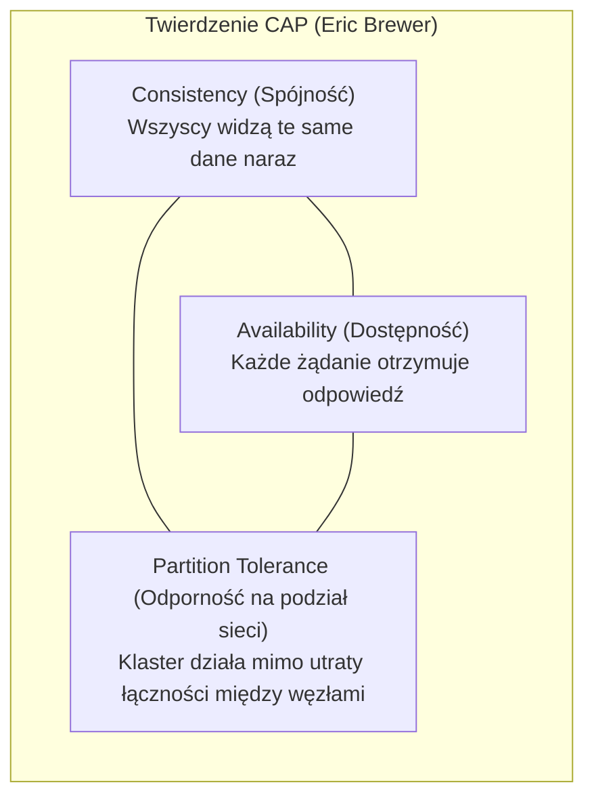
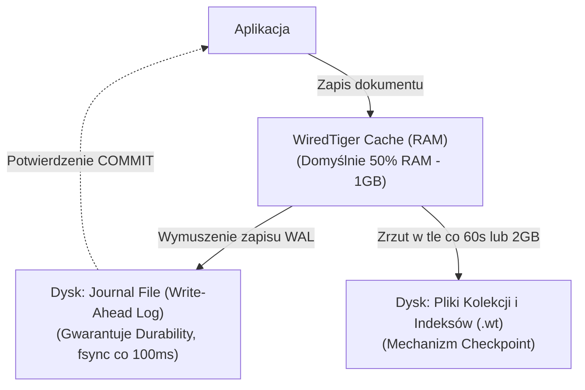
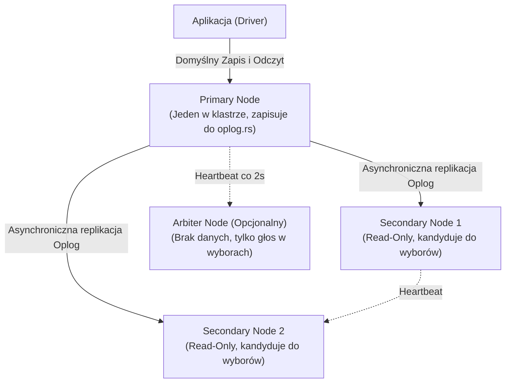
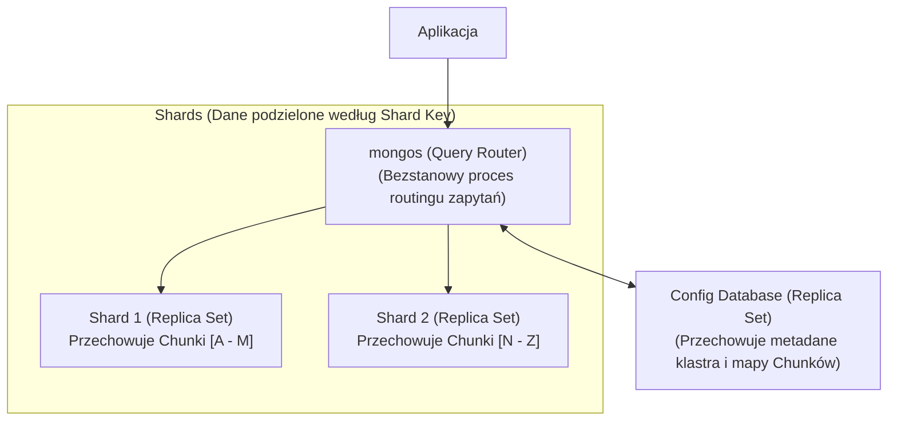

# Bazy NoSQL i MongoDB: Architektura, Skalowanie i Pytania Rekrutacyjne

Kompleksowy przewodnik inżynierski po nierelacyjnych bazach danych ze szczególnym uwzględnieniem **MongoDB**. Obejmuje teorię systemów rozproszonych (CAP, PACELC, BASE), niskopoziomową architekturę silnika pamięci masowej **WiredTiger**, replikację (Replica Sets), horyzontalne skalowanie (Sharding), zaawansowane modelowanie danych, potoki agregacji (**Aggregation Pipeline**) oraz zestaw pytań rekrutacyjnych i scenariuszy awaryjnych (od poziomu Mid do Staff/Principal).

---

## Spis Treści
1. [Paradygmat NoSQL i Teoria Systemów Rozproszonych](#1-paradygmat-nosql-i-teoria-systemów-rozproszonych)
   - Dlaczego powstało NoSQL? (Scale-Up vs Scale-Out)
   - Cztery Główne Rodziny Baz NoSQL
   - Twierdzenie CAP i Model PACELC
   - Model BASE vs ACID
2. [MongoDB pod Maską (WiredTiger Storage Engine)](#2-mongodb-pod-maską-wiredtiger-storage-engine)
   - Format BSON vs JSON
   - Anatomia 12-bajtowego `ObjectId`
   - Silnik pamięci WiredTiger: Pamięć RAM, B-Tree i kompresja
   - Checkpoint, Journaling (WAL) i współbieżność dokumentowa
3. [Wysoka Dostępność i Rozproszenie: Replica Sets & Sharding](#3-wysoka-dostępność-i-rozproszenie-replica-sets--sharding)
   - Replica Sets: Primary, Secondary, Arbiter i protokół wyborczy
   - Gwarancje spójności: Write Concern i Read Concern
   - Architektura Shardingu: `mongos`, Config Servers, Shards
   - Dobór Klucza Shardingu (Shard Key), Chunks i Balancer
4. [Modelowanie Danych w Bazach Dokumentowych](#4-modelowanie-danych-w-bazach-dokumentowych)
   - Embedding (Zagnieżdżanie) vs Referencing (Referencje)
   - Limit dokumentu 16 MB i obsługa dużych plików (GridFS)
   - Praktyczne wzorce schematów (Attribute, Bucket, Subset, Outlier)
5. [Indeksowanie i Potok Agregacji (Aggregation Pipeline)](#5-indeksowanie-i-potok-agregacji-aggregation-pipeline)
   - Typy indeksów: Compound (Zasada ESR), Multikey, TTL, Partial
   - Fazy Aggregation Pipeline (`$match`, `$project`, `$group`, `$unwind`, `$lookup`)
   - Optymalizacja potoku i limity pamięci (100 MB RAM limit)
6. [Pytania Rekrutacyjne z Odpowiedziami (FAQ Interview)](#6-pytania-rekrutacyjne-z-odpowiedziami-faq-interview)
   - Pytania Podstawowe i Średniozaawansowane (Mid)
   - Pytania Zaawansowane i Architektoniczne (Senior / Principal)
   - Scenariusze Awaryjne i Live-fire Troubleshooting
7. [Tablica Szybkiej Powtórki (Cheat-Sheet)](#7-tablica-szybkiej-powtórki-cheat-sheet)

---

## 1. Paradygmat NoSQL i Teoria Systemów Rozproszonych

Tradycyjne bazy relacyjne (RDBMS) powstały w epoce, gdy pamięć dyskowa była ekstremalnie droga, co wymusiło rygorystyczną **normalizację danych (1NF-3NF)** i unikanie redundancji. Skalowanie RDBMS odbywało się pionowo (**Scale-Up** — zakup coraz droższych serwerów z większą liczbą rdzeni CPU i RAM).

Pojawienie się architektury Big Data, milionów operacji zapisu na sekundę oraz chmury wymusiło podejście NoSQL (**Not Only SQL**) oparte na horyzontalnym skalowaniu (**Scale-Out** — klastry tanich węzłów towarowych / commodity hardware).

### Cztery Główne Rodziny Baz NoSQL
1. **Bazy Dokumentowe (Document Stores — np. MongoDB, CouchDB):**
   - Dane przechowywane w elastycznych, półustrukturyzowanych dokumentach (BSON/JSON).
   - Naturalne odzwierciedlenie obiektów w kodzie aplikacji (Domain-Driven Design).
2. **Klucz-Wartość (Key-Value Stores — np. Redis, AWS DynamoDB):**
   - Najprostszy i najszybszy model danych: unikalny klucz mapowany na nieprzezroczysty ciąg bajtów.
   - Ekstremalnie niskie opóźnienia sub-milisekundowe (cache, sesje, rankingi).
3. **Kolumnowe / Rodziny Kolumn (Wide-Column Stores — np. Apache Cassandra, ScyllaDB):**
   - Dane zorganizowane w wiersze posiadające dynamiczną liczbę kolumn zgrupowanych w Column Families.
   - Zoptymalizowane pod kątem gigantycznych wolumenów zapisu bez pojedynczego punktu awarii (architektura Masterless).
4. **Grafowe (Graph Databases — np. Neo4j, Amazon Neptune):**
   - Węzły (Nodes), Relacje (Edges) i Właściwości (Properties).
   - Błyskawiczne przeszukiwanie powiązań wielostopniowych ($O(1)$ index-free adjacency) — sieci społecznościowe, silniki rekomendacji, wykrywanie oszustw finansowych.

---

### Twierdzenie CAP i Model PACELC



> **Zasada CAP:** W rozproszonym systemie komputerowym zjawisko podziału sieci (**Network Partition — P**) jest fizycznym faktem, którego nie da się wyeliminować (awarie switchy, zerwane kable). W momencie wystąpienia podziału architekt musi wybrać między:
> * **CP (Consistency + Partition Tolerance):** System odrzuca zapytania lub zwraca błąd, jeśli nie może zagwarantować spójności (np. **MongoDB w domyślnej konfiguracji**, HBase).
> * **AP (Availability + Partition Tolerance):** System zawsze odpowiada na zapytania, godząc się z tym, że różne węzły mogą zwrócić nieaktualne dane (np. **Apache Cassandra**, CouchDB, DynamoDB).

#### Model PACELC (Daniel Abadi):
Uzupełnia CAP o stan normalnej pracy klastra (gdy nie ma awarii sieci):
$$\text{Jeśli jest } \mathbf{P} \text{ (Partition)} \rightarrow \text{Wybierz między } \mathbf{A} \text{ a } \mathbf{C}; \quad \text{ELSE } (\mathbf{E}) \rightarrow \text{Wybierz między } \mathbf{L} \text{ (Latency) a } \mathbf{C} \text{ (Consistency)}.$$
* **MongoDB:** Jest systemem **PC/EC** (w razie partycji wybiera Spójność; w normalnym stanie wybiera Spójność kosztem opóźnień).
* **Cassandra:** Jest systemem **PA/EL** (w razie partycji wybiera Dostępność; w normalnym stanie stawia na Niskie Opóźnienia).

---

### Model BASE vs ACID
Podczas gdy systemy RDBMS hołdują regułom **ACID**, systemy NoSQL często implementują model **BASE**:
* **Basically Available:** System gwarantuje dostępność operacyjną, nawet przy degradacji części węzłów.
* **Soft state:** Stan danych może zmieniać się w czasie bez interakcji użytkownika (w trakcie propagacji asynchronicznej).
* **Eventual consistency:** Jeśli nie pojawią się nowe aktualizacje, wszystkie repliki w klastrze w końcu staną się spójne.

---

## 2. MongoDB pod Maską (WiredTiger Storage Engine)

### BSON (Binary JSON)
MongoDB nie przechowuje na dysku surowego tekstu JSON. Zamiast tego stosuje format **BSON**:
* **Dodatkowe typy danych:** Natywne wsparcie dla `Date`, `ObjectId`, `Binary data` (UUID, hashe), `Int32`, `Int64`, `Decimal128` (precyzja finansowa).
* **Efektywność przeszukiwania:** Każde pole zawiera na początku informację o swoim rozmiarze (Length Prefix), co pozwala parserowi silnika przeskakiwać całe gałęzie dokumentu w pamięci bez konieczności ich skanowania bajt po bajcie.

### Anatomia 12-bajtowego `ObjectId`
Domyślny klucz główny `_id` to nie losowy UUID, lecz uporządkowana 12-bajtowa struktura generowana w czasie rzeczywistym:
```
+--------------------------+-----------------------+-------------------+
| 4 Bajty: Unix Timestamp  | 5 Bajtów: Random      | 3 Bajty: Licznik  |
| (Sekundy od epoki Unix)  | (Unikalne dla hosta   | (Monotonicznie    |
|                          | i procesu mongod)     | rosnący counter)  |
+--------------------------+-----------------------+-------------------+
```
* **Kluczowa cecha:** Ponieważ pierwsze 4 bajty to znacznik czasu, identyfikatory `ObjectId` są **naturalnie posortowane chronologicznie**. Zapobiega to fragmentacji indeksu B-Tree przy masowych operacjach `INSERT`.

---

### Silnik WiredTiger: Pamięć RAM, Checkpoints i Journaling



1. **WiredTiger Cache:** Zarządza pamięcią RAM. Przechowuje odkompresowane strony danych w pamięci, a na dysku zapisuje je w postaci skompresowanej (domyślnie algorytm **Snappy** dla danych i kompresja prefiksowa dla indeksów).
2. **Journal (WAL):** Dziennik zapisu sekwencyjnego na dysku. Chroni dane przed awarią zasilania pomiędzy punktami kontrolnymi. Domyślny interwał zrzutu bufora dziennika na dysk wynosi **100 ms**.
3. **Checkpoint:** Okresowy proces zrzutu zmodyfikowanych stron danych z pamięci podręcznej do fizycznych plików `.wt`. Odbywa się domyślnie co 60 sekund lub po zapełnieniu 2 GB dziennika.
4. **Współbieżność:** WiredTiger oferuje współbieżność na poziomie pojedynczego dokumentu (**Document-level concurrency**) z wykorzystaniem mechanizmu optymistycznej kontroli współbieżności bez blokowania całej kolekcji.

---

## 3. Wysoka Dostępność i Rozproszenie: Replica Sets & Sharding

### 1. Replica Sets (Wysoka Dostępność — HA)
Zestaw replik składa się z grupy procesów `mongod` utrzymujących ten sam zbiór danych:



* **`oplog.rs` (Operations Log):** Specjalna, ograniczona rozmiarowo kolekcja (Capped Collection) na węźle Primary, przechowująca idempotentną sekwencję wszystkich operacji modyfikacji danych. Węzły Secondary stale odpytują Oplog i aplikują zmiany lokalnie.
* **Failover i Wybory (Elections):** Węzły wymieniają sygnały heartbeat co 2 sekundy. Jeśli Primary nie odpowiada przez 10 sekund, węzły Secondary rozpoczynają procedurę wyborczą opartą na konsensusie (Raft-like consensus). Węzeł o najbardziej aktualnym Oplogu zostaje promowany do roli nowego Primary.

#### Strojenie Spójności: Write Concern i Read Concern
* **Write Concern:** Poziom potwierdzenia zapisu żądany przez klienta:
  - `{ w: 1 }`: Potwierdzenie po zapisie w pamięci RAM bieżącego węzła Primary.
  - `{ w: "majority" }`: Potwierdzenie dopiero, gdy większość uprawnionych węzłów Replica Setu zatwierdzi zapis.
  - `{ j: true }`: Wymuszenie fizycznego zrzutu zapisu do pliku Journal na dysku (`fsync`).
* **Read Concern:**
  - `"local"`: Zwraca najnowsze dane z odpytywanego węzła (możliwy *Dirty Read*, jeśli Primary zostanie obalony przed replikacją).
  - `"majority"`: Zwraca dane, które zostały potwierdzone przez większość węzłów (odporne na rollback po awarii Primary).
  - `"linearizable"`: Zwraca dane weryfikując w czasie rzeczywistym z większością węzłów, czy odpytywany węzeł Primary nadal jest legalnym liderem (zapobiega *Stale Reads* kosztem wyższych opóźnień).

---

### 2. Sharding (Horyzontalne Skalowanie Horyzontalne)
Gdy wolumen danych przekracza pojemność dyskową pojedynczej maszyny lub przepustowość zapisu uderza w limit I/O, stosuje się klaster **Sharded**:



* **`mongos`:** Lekki, bezstanowy router. Parsuje zapytanie klienta, sprawdza w pamięci podręcznej mapę chunków pobraną z Config Serverów i kieruje zapytanie wyłącznie do właściwych shardów (**Targeted Query**). Jeśli zapytanie nie zawiera Shard Key, musi odpytać wszystkie shardy (**Scatter-Gather Query** — kosztowne).
* **Wybór Shard Key:**
  - **Hashed Sharding:** Hash z wartości pola (np. `{ user_id: "hashed" }`). Gwarantuje idealnie równomierny rozkład danych na dyskach, ale niszczy wydajność zapytań zakresowych.
  - **Ranged Sharding:** Zakresy wartości (np. `{ country: 1, created_at: 1 }`). Umożliwia efektywne zapytania zakresowe, ale grozi powstaniem wąskich gardeł zapisu (**Hotspotting**), jeśli klucz jest monotonicznie rosnący.

---

## 4. Modelowanie Danych w Bazach Dokumentowych

W bazach NoSQL nie istnieje operacja `JOIN` na poziomie silnika pamięci masowej o takiej wydajności jak w RDBMS. Dlatego fundamentem modelowania jest:

```
ZŁOTA ZASADA MONGODB:
"Dane, które są odczytywane razem, powinny być przechowywane w jednym dokumencie."
```

### Embedding vs Referencing
```json
// 1. EMBEDDING (Denormalizacja - Zagnieżdżanie w jednym dokumencie):
{
  "_id": ObjectId("6650..."),
  "order_number": "ORD-2026-99",
  "customer": { "name": "Jan Kowalski", "email": "jan@example.com" },
  "items": [
    { "product_id": 101, "name": "Klawiatura Mechaniczna", "qty": 1, "price": 450.00 },
    { "product_id": 202, "name": "Myszka Bezprzewodowa", "qty": 1, "price": 250.00 }
  ]
}

// 2. REFERENCING (Normalizacja - Referencje po ObjectId):
// Kolekcja: orders
{ "_id": ObjectId("6650..."), "customer_id": ObjectId("7740..."), "item_ids": [101, 202] }
```

| Kryterium wyboru | Wybierz Zagnieżdżanie (Embedding) | Wybierz Referencje (Referencing) |
| :--- | :--- | :--- |
| **Relacja liczności** | 1:1 lub 1:Few (np. zamówienie i kilka pozycji) | 1:Many lub Many:Many (np. autor i setki tysięcy postów) |
| **Wzorzec dostępu** | Dane podrzędne są zawsze pobierane z głównymi | Dane podrzędne są często modyfikowane niezależnie |
| **Spójność i atomowość** | **Atomowość na poziomie dokumentu** (brak transakcji)| Wymaga transakcji wielodokumentowych (Multi-Document ACID) |
| **Ograniczenia** | Ryzyko przekroczenia limitu **16 MB BSON** | Narzut sieciowy na operację `$lookup` (odpowiednik JOIN) |

---

## 5. Indeksowanie i Potok Agregacji (Aggregation Pipeline)

### Zasada ESR dla Indeksów Złożonych (Compound Indexes)
Kolejność kolumn w indeksie wielopolowym decyduje o jego użyteczności:
$$\mathbf{E} \text{quality} \longrightarrow \mathbf{S} \text{ort} \longrightarrow \mathbf{R} \text{ange}$$
```javascript
// Zapytanie:
db.orders.find({ status: "PAID", created_at: { $gte: ISODate("2026-01-01") } })
         .sort({ total_amount: -1 });

// ✅ IDEALNY INDEKS ZGODNY Z ESR:
// 1. Equality: status
// 2. Sort: total_amount
// 3. Range: created_at
db.orders.createIndex({ status: 1, total_amount: -1, created_at: 1 });
```

---

### Potok Agregacji (Aggregation Pipeline)
Framework przetwarzania danych działający na zasadzie potoku uniksowego (dane płyną przez kolejne etapy transformacji):

```javascript
db.orders.aggregate([
  // Etap 1: Filtrowanie wstępne (UŻYWA INDEKSU!)
  { $match: { status: "COMPLETED", created_at: { $gte: ISODate("2026-01-01") } } },

  // Etap 2: Rozbicie tablicy pozycji zamówienia na niezależne dokumenty
  { $unwind: "$items" },

  // Etap 3: Grupowanie i wyliczanie metryk
  {
    $group: {
      _id: "$items.category",
      totalRevenue: { $sum: { $multiply: ["$items.qty", "$items.price"] } },
      averageOrderValue: { $avg: "$total_amount" },
      itemsCount: { $sum: "$items.qty" }
    }
  },

  // Etap 4: Sortowanie malejące po przychodzie
  { $sort: { totalRevenue: -1 } },

  // Etap 5: Ograniczenie do TOP 5 kategorii
  { $limit: 5 }
]);
```

* **Limit Pamięci RAM dla Fazy Agregacji:** Pojedynczy etap potoku (np. `$group` lub `$sort`) może skonsumować maksymalnie **100 MB pamięci RAM**. Jeśli zapytanie przekroczy ten limit, MongoDB rzuca błąd.
* **Rozwiązanie:** Włączenie zrzutu tymczasowego na dysk: `{ allowDiskUse: true }` lub zoptymalizowanie potoku etapem `$match` na samym początku.

---

## 6. Pytania Rekrutacyjne z Odpowiedziami (FAQ Interview)

### Pytania Podstawowe i Średniozaawansowane (Mid)

#### P1: Kiedy należy wybrać bazę dokumentową (np. MongoDB), a kiedy relacyjną bazę danych (np. PostgreSQL)?
**Odpowiedź:**
* **Wybierz MongoDB, gdy:**
  - Model danych jest dynamiczny, polimorficzny lub ewoluuje w czasie (brak sztywnego schematu).
  - Naturalna struktura danych to zagnieżdżone obiekty biznesowe (Aggregate Roots w DDD).
  - Wymagana jest ogromna przepustowość zapisu i natywne skalowanie poziome (Sharding w standardzie).
  - Aplikacja operuje na katalogach produktów, danych geolokalizacyjnych lub systemach telemetrii/IoT.
* **Wybierz PostgreSQL / RDBMS, gdy:**
  - Dane są wysoce zrelacjonowane (wielokrotne relacje Many-to-Many).
  - Spójność transakcyjna ACID w obrębie dziesiątek powiązanych tabel jest krytyczna biznesowo (systemy księgowe, bankowość tradycyjna).
  - Aplikacja wymaga skomplikowanych raportów ad-hoc z wielokrotnymi operacjami `JOIN`.

---

#### P2: Dlaczego MongoDB wprowadziło limit wielkości pojedynczego dokumentu na poziomie 16 MB? Co zrobić, gdy musimy zapisać większe dane?
**Odpowiedź:**
* **Przyczyna limitu:** Limit 16 MB zapobiega nadmiernemu zużyciu pamięci RAM w cache silnika WiredTiger oraz chroni przed drastycznym spadkiem wydajności transferu sieciowego. Dokumenty w MongoDB są przesyłane w całości; manipulacja gigabajtowymi dokumentami zablokowałaby pętle I/O i zaalokowała całą pamięć sterty.
* **Rozwiązanie:**
  - Do przechowywania dużych plików (np. filmy, obrazy, archiwa ZIP) służy mechanizm **GridFS**. Dzieli on duży plik na małe kawałki (chunki) po 255 KB i zapisuje je w dwóch powiązanych kolekcjach: `fs.files` (metadane) oraz `fs.chunks` (surowe bajty).

---

#### P3: Co oznacza parametr `w: "majority"` oraz `j: true` w operacjach zapisu?
**Odpowiedź:**
* `w: "majority"` (Write Concern): Informuje sterownik, że operacja zapisu zostanie uznana za zakończoną sukcesem dopiero wtedy, gdy zostanie zapisana w pamięci podręcznej większości aktywnych węzłów Replica Setu (np. 2 z 3 węzłów). Chroni przed utratą danych w przypadku awarii węzła Primary.
* `j: true` (Journaling): Wymusza, aby węzeł Primary dokonał fizycznego zrzutu zapisu z pamięci RAM do pliku Journal na dysku (`fsync`) przed zwróceniem odpowiedzi. Zapewnia 100% trwałości danych (Durability) w razie nagłego odcięcia zasilania.

---

### Pytania Zaawansowane i Architektoniczne (Senior / Principal)

#### P4: Jak silnik WiredTiger realizuje izolację i współbieżność dokumentową bez blokowania całej kolekcji?
**Odpowiedź:**
WiredTiger stosuje **optymistyczną kontrolę współbieżności (Optimistic Concurrency Control)** połączoną z wersjonowaniem pamięci:
1. Podczas modyfikacji dokumentu wątek wykonuje operację w pamięci roboczej, nie zakładając twardych blokad na całą kolekcję (w przeciwieństwie do starego silnika MMAPv1, który posiadał blokadę Reader-Writer na poziomie bazy/kolekcji).
2. Jeśli dwa współbieżne wątki spróbują zmodyfikować **dokładnie ten sam dokument w tym samym momencie**, silnik wykrywa konflikt zapisu (*Write Conflict*).
3. Wątek przegrany nie rzuca błędu do aplikacji, lecz w sposób transparentny ponawia operację modyfikacji z nowym stanem dokumentu (*Automatic Retry* na poziomie silnika WiredTiger).

---

#### P5: Czym różni się `Read Concern: "majority"` od `Read Concern: "linearizable"` i w jakim scenariuszu "majority" może zwrócić nieświeże dane (Stale Read)?
**Odpowiedź:**
* **`majority`:** Zwraca najnowsze dane zatwierdzone przez większość węzłów z perspektywy odpytywanego węzła Primary.
  - *Scenariusz problemowy (Network Partition):* Jeśli na skutek partycji sieciowej obecny węzeł Primary został odcięty od reszty klastra, a pozostałe węzły wybrały już nowego lidera, stary Primary przez kilka sekund (do momentu wykrycia braku heartbeatu) nadal uważa się za lidera. Odczyt z `readConcern: "majority"` na tym odciętym Primary może zwrócić dane, które są już nieaktualne (*Stale Read*).
* **`linearizable`:** Przed zwróceniem danych węzeł Primary wykonuje dodatkową wymianę sygnałów z większością węzłów klastra w celu potwierdzenia, że w danym milisekundowym momencie **nadal jest legalnym Primary**. Gwarantuje absolutną spójność liniową, lecz wiąże się ze znacznym narzutem sieciowym na każde zapytanie odczytu.

---

#### P6: Co to jest "Jumbo Chunk" w klastrze Sharded i dlaczego stanowi zagrożenie dla całego systemu?
**Odpowiedź:**
W shardingowanym klastrze MongoDB dane dzielone są na chunki (domyślnie 64 MB). Gdy chunk się zapełnia, proces balancer dzieli go na pół i przenosi część danych na inny shard.
* **Jumbo Chunk:** To chunk, który przekroczył maksymalny dopuszczalny rozmiar, ale **nie może zostać podzielony** przez balancera.
* **Przyczyna:** Wybór Shard Key o zbyt niskiej kardynalności (Low Cardinality) — np. pole `country: "PL"`, gdzie miliony dokumentów posiadają identyczną wartość klucza shardingu. MongoDB nie może podzielić chunka, w którym wszystkie dokumenty mają ten sam klucz shardingu.
* **Skutki:** Jumbo Chunk utyka na jednym shardzie na stałe, powodując nierównomierny rozkład danych, przepełnienie dysku jednego shardu i degradację wydajności klastra.

---

### Scenariusze Awaryjne i Live-fire Troubleshooting

#### Scenariusz 1: Klaster Replica Set ulega podziałowi sieci (Network Partition): węzeł Primary zostaje odcięty w mniejszościowym segmencie sieci (1 węzeł), podczas gdy dwa węzły Secondary znajdują się w segmencie większościowym (2 węzły). Co dzieje się krok po kroku?
**Przebieg i Diagnoza:**
1. **Segment mniejszościowy:** Odcięty węzeł Primary zauważa brak sygnałów heartbeat od pozostałych dwóch węzłów. Po upływie `electionTimeoutMillis` (domyślnie 10 sekund) zdaje sobie sprawę, że nie widzi większości klastra ($1 < 3/2$), i **automatycznie degraduje się do roli Secondary**, zamykając możliwość przyjmowania zapisów.
2. **Segment większościowy:** Dwa węzły Secondary widzą siebie nawzajem (posiadają większość: $2 > 3/2$). Rozpoczynają wybory i jeden z nich zostaje mianowany **nowym Primary**. Klaster kontynuuje przyjmowanie zapisów.
3. **Powrót sieci do normy (Rejoin):** Stary Primary widzi nowego Primary z wyższym numerem kadencji (Election Term).
   - Jeśli stary Primary zdążył przyjąć jakieś zapisy z `w: 1` tuż przed odcięciem, które nie trafiły do reszty węzłów — nowy Primary zmusza stary węzeł do wycofania tych operacji (**Rollback**).
   - Niezsynchronizowane dane zostają zapisane do specjalnego pliku rollbacku w formacie BSON na dysku w celu manualnej analizy przez administratora.

---

#### Scenariusz 2: Zapytanie z potokiem agregacji (`aggregate`) kończy się błędem `QueryExceededMemoryLimitNoDiskUseAllowed: Exceeded memory limit for $group, but did not allow external sort`.
**Diagnoza i Plan Naprawczy:**
1. **Przyczyna:** Faza `$group` lub `$sort` przekroczyła wewnętrzny limit **100 MB pamięci RAM** przydzielonej na pojedynczy etap przetwarzania potoku.
2. **Kroki naprawcze:**
   - **Krok 1 (Szybki fix):** Włączenie obsługi zrzutu tymczasowego na dysk za pomocą flagi:
     ```javascript
     db.orders.aggregate([...], { allowDiskUse: true });
     ```
   - **Krok 2 (Optymalizacja architektoniczna):**
     - Przeniesienie fazy `$match` na sam początek potoku w celu maksymalnej redukcji liczby przetwarzanych dokumentów.
     - Sprawdzenie, czy faza `$match` i `$sort` korzystają z indeksu B-Tree (polecenie `explain("executionStats")`).
     - Dodanie fazy `$project` przed agregacją w celu odrzucenia zbędnych, ciężkich pól dokumentu.

---

## 7. Tablica Szybkiej Powtórki (Cheat-Sheet)

| Zagadnienie | Słowa Kluczowe i Niskopoziomowe Koncepcje |
| :--- | :--- |
| **Systemy Rozproszone**| Twierdzenie CAP (MongoDB to system CP), Model PACELC (PC/EC), Model BASE vs ACID |
| **Format Danych** | BSON (Binary JSON), typowanie binarne, limit 16 MB dokumentu, GridFS (dla dużych plików) |
| **Klucz Główny** | 12-bajtowy `ObjectId` (4B timestamp, 5B random/host, 3B counter - naturalne sortowanie) |
| **WiredTiger Engine** | Cache RAM (50% RAM - 1GB), Snappy compression, Checkpoint (co 60s), Journal WAL (co 100ms) |
| **Wysoka Dostępność** | Replica Set (Primary + Secondaries), `oplog.rs` (Capped collection), automatyczny failover |
| **Gwarancje Zapisu** | Write Concern (`w: 1`, `w: "majority"`, `j: true`), Read Concern (`local`, `majority`, `linearizable`) |
| **Skalowanie Poziome** | Sharding: `mongos` (router), Config Servers (metadane), Shards; Hashed vs Ranged Shard Key |
| **Optymalizacja Zapytań**| Reguła ESR (Equality -> Sort -> Range), Aggregation Pipeline limit 100MB RAM (`allowDiskUse`) |
| **Modelowanie Danych** | Embedding (1:Few, atomowość dokumentu) vs Referencing (1:Many, normalizacja, `$lookup`) |
