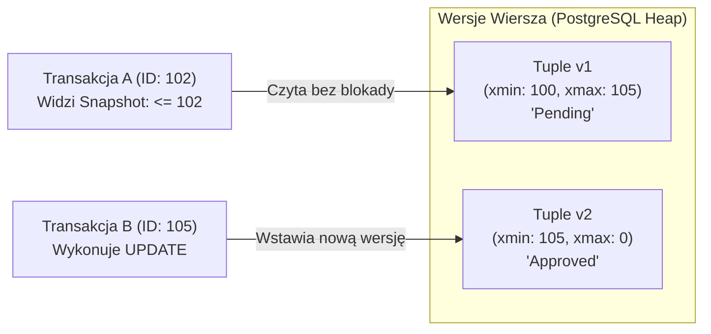
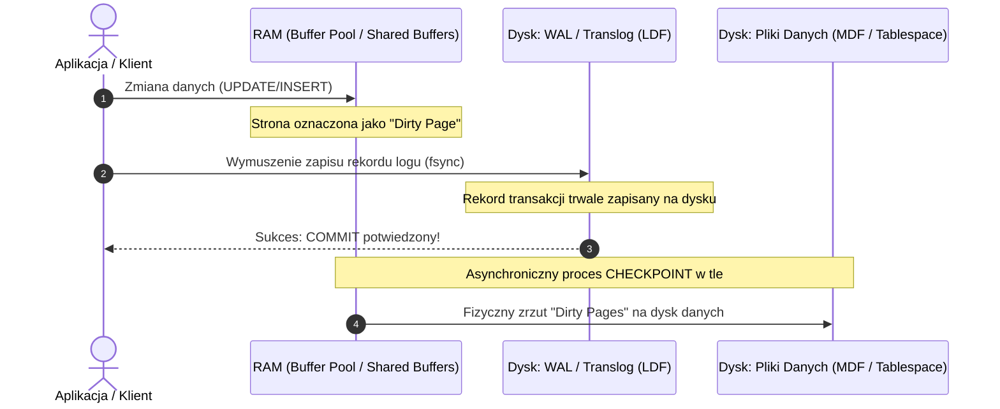
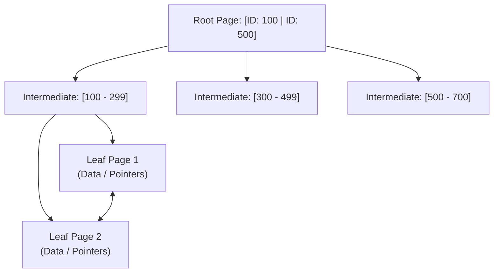

# Relacyjne Bazy Danych, SQL, PostgreSQL i MS SQL (Deep Dive)

Kompleksowy przewodnik inżynierski po relacyjnych systemach zarządzania bazami danych (**RDBMS**), języku **SQL** oraz silnikach **PostgreSQL** i **Microsoft SQL Server**. Obejmuje teorię transakcji i ACID, mechanikę wielowersyjności (MVCC), niskopoziomową architekturę pamięci masowej (Pages, Extents, Tuples, WAL/LDF), optymalizację zapytań (plany wykonania, indeksy B-Tree/GIN/Clustered) oraz zestaw zaawansowanych pytań rekrutacyjnych i scenariuszy awaryjnych (od poziomu Mid do Staff/Architect).

---

## Spis Treści
1. [Teoria RDBMS i Model Transakcyjny (ACID)](#1-teoria-rdbms-i-model-transakcyjny-acid)
   - Właściwości ACID pod maską
   - Zjawiska współbieżności i 4 standardowe poziomy izolacji
   - Mechanizm MVCC (Multi-Version Concurrency Control) w PostgreSQL i MS SQL
2. [Niskopoziomowa Architektura Fizyczna i Silniki Przechowywania](#2-niskopoziomowa-architektura-fizyczna-i-silniki-przechowywania)
   - Strony danych (Data Pages: 8KB), Krotki (Tuples) i Ekstenty (Extents)
   - Tabela typu Heap vs Tabela z Clustered Index
   - Bufory pamięci RAM (Shared Buffers / Buffer Pool) i mechanizm zapisu (WAL / LDF, Checkpoint)
3. [Architektura Indeksów i Wyszukiwanie Danych](#3-architektura-indeksów-i-wyszukiwanie-danych)
   - B-Tree w szczegółach (Root, Branches, Leaves, Fill Factor, Fragmentacja)
   - Indeksy w MS SQL: Clustered, Non-Clustered, Included Columns, Columnstore
   - Indeksy w PostgreSQL: GIN (JSONB/Full-text), GiST, BRIN, Partial Indexes
   - Strategie dostępu: Index Seek vs Index Scan vs Sequential/Table Scan
4. [Język SQL: Od Zaawansowanych Zapytań do Optymalizacji](#4-język-sql-od-zaawansowanych-zapytań-do-optymalizacji)
   - Funkcje Okna (Window Functions: `ROW_NUMBER`, `RANK`, `DENSE_RANK`, `LEAD`, `LAG`)
   - Wyrażenia CTE i Rekurencyjne CTE (Hierarchie i Drzewa)
   - Zrozumieć Plan Zapytania (Execution Plan / `EXPLAIN ANALYZE`)
   - Algorytmy Łączeń: Nested Loops, Hash Join, Merge Join
   - Zasada SARGability (Search Argumentable Queries)
5. [Współbieżność, Blokady i Zakleszczenia (Locks & Deadlocks)](#5-współbieżność-blokady-i-zakleszczenia-locks--deadlocks)
   - Hierarchia i typy blokad: Shared (S), Exclusive (X), Intent (IS/IX), Update (U)
   - Detekcja i anatomia Deadlocka (Wait-For Graph)
   - Strategie eliminacji zakleszczeń w systemach produkcyjnych
6. [Pytania Rekrutacyjne z Odpowiedziami (FAQ Interview)](#6-pytania-rekrutacyjne-z-odpowiedziami-faq-interview)
   - Pytania Podstawowe i Średniozaawansowane (Mid)
   - Pytania Zaawansowane i Architektoniczne (Senior / Principal)
   - Scenariusze Awaryjne i Live-fire Troubleshooting
7. [Tablica Szybkiej Powtórki (Cheat-Sheet)](#7-tablica-szybkiej-powtórki-cheat-sheet)

---

## 1. Teoria RDBMS i Model Transakcyjny (ACID)

System relacyjny gwarantuje spójność danych poprzez rygorystyczne przestrzeganie paradygmatu **ACID**:

* **Atomicity (Niepodzielność):** Wszystkie operacje wewnątrz transakcji wykonują się w całości albo żadna z nich. W razie błędu następuje `ROLLBACK`. Realizowane przez dziennik wyprzedzający (WAL w PostgreSQL, Transaction Log LDF w MS SQL).
* **Consistency (Spójność):** Transakcja przenosi bazę z jednego poprawnego stanu w drugi poprawny stan, nie łamiąc zdefiniowanych więzów integralności (`PRIMARY KEY`, `FOREIGN KEY`, `CHECK`, `UNIQUE`).
* **Isolation (Izolacja):** Współbieżnie wykonywane transakcje nie widzą swoich częściowych, niezatwierdzonych zmian (kontrolowane przez poziomy izolacji).
* **Durability (Trwałość):** Po otrzymaniu potwierdzenia `COMMIT`, zatwierdzone dane przetrwają awarię sprzętu lub odcięcie zasilania. Realizowane przez wymuszenie fizycznego zapisu dziennika na dysk (`fsync`).

---

### Zjawiska Współbieżności (Concurrency Anomalies)
1. **Dirty Read (Brudny odczyt):** Transakcja A odczytuje dane zmodyfikowane przez transakcję B, która nie została jeszcze zatwierdzona i może zostać wycofana (`ROLLBACK`).
2. **Non-Repeatable Read (Niepowtarzalny odczyt):** Transakcja A odczytuje ten sam wiersz dwukrotnie i otrzymuje różne wartości, ponieważ w międzyczasie transakcja B zmodyfikowała ten wiersz i wykonała `COMMIT`.
3. **Phantom Read (Odczyt widmo):** Transakcja A wykonuje zapytanie zakresowe (np. `WHERE age > 30`), po czym transakcja B dodaje nowy wiersz spełniający ten warunek i wykonuje `COMMIT`. Powtórne zapytanie w transakcji A zwraca dodatkowy, nowy wiersz.
4. **Serialization Anomaly:** Wynik współbieżnego wykonania grupy transakcji różni się od jakiejkolwiek sekwencyjnej kolejności ich wykonania.

### 4 Poziomy Izolacji Transakcji (ANSI SQL-92)
| Poziom Izolacji | Dirty Read | Non-Repeatable Read | Phantom Read | Serialization Anomaly |
| :--- | :---: | :---: | :---: | :---: |
| **Read Uncommitted** | Dozwolony | Dozwolony | Dozwolony | Dozwolony |
| **Read Committed** (Domyślny w PG i MSSQL) | **Zablokowany** | Dozwolony | Dozwolony | Dozwolony |
| **Repeatable Read** | **Zablokowany** | **Zablokowany** | Dozwolony* | Dozwolony |
| **Serializable** | **Zablokowany** | **Zablokowany** | **Zablokowany** | **Zablokowany** |

*\*W PostgreSQL poziom Repeatable Read dzięki mechanizmowi MVCC domyślnie eliminuje także odczyty widmo (Phantom Reads).*

---

### MVCC (Multi-Version Concurrency Control)
Zamiast tradycyjnego blokowania czytania przez zapis (co paraliżuje wydajność systemów OLTP), nowoczesne bazy stosują **MVCC**:
> **Złota reguła MVCC:** *Pisarze nie blokują czytelników, a czytelnicy nie blokują pisarzy.*



* **MVCC w PostgreSQL:**
  - Każda modyfikacja `UPDATE` fizycznie tworzy **nowy wiersz** (nową krotkę/tuple) na stronie danych, a stary wiersz oznacza jako nieaktualny za pomocą nagłówków `xmin` (ID transakcji tworzącej) oraz `xmax` (ID transakcji usuwającej/aktualizującej).
  - **Efekt uboczny (Bloat):** Stare, martwe krotki (*dead tuples*) pozostają na dysku, dopóki nie usunie ich proces **`VACUUM`** (lub `AUTOVACUUM`).
* **MVCC w Microsoft SQL Server:**
  - Domyślnie MS SQL używa pesymistycznych blokad dwufazowych (2PL).
  - MVCC można włączyć za pomocą **RCSI** (*Read Committed Snapshot Isolation*) lub **Snapshot Isolation**.
  - W MS SQL wersje wierszy nie zaśmiecają tabeli głównej — są wypychane do dedykowanej bazy systemowej **`tempdb`** (*Version Store*).

---

## 2. Niskopoziomowa Architektura Fizyczna i Silniki Przechowywania

### Strona Danych (Data Page: 8 KB)
Zarówno PostgreSQL, jak i MS SQL zarządzają danymi na dysku i w pamięci RAM w porcjach o wielkości **8192 bajtów (8 KB)**.

```
+--------------------------------------------------------------+
| Page Header (96 bajtów: LSN, wolne miejsce, wskaźniki)       |
+--------------------------------------------------------------+
| Line Pointers / Item IDs (Wskaźniki offsetów do wierszy) -> |
|                                                              |
|                  <--- WOLNA PRZESTRZEŃ --->                  |
|                                                              |
| <- Krotki danych (Tuples / Records) alokowane od końca strony|
+--------------------------------------------------------------+
| Row Offset Table (MS SQL) / Special Space (PostgreSQL)       |
+--------------------------------------------------------------+
```

* **Ekstent (Extent w MS SQL):** Jednostka 8 ciągłych stron danych ($8 \times 8\text{ KB} = 64\text{ KB}$).
* **Krotka (Tuple / Record):** Pojedynczy wiersz tabeli. Nigdy nie może przekraczać 8 KB na standardowej stronie (dla większych obiektów stosuje się mechanizmy **TOAST** w PostgreSQL lub **LOB / Row-Overflow Storage** w MS SQL).

### Tabela typu Heap vs Tabela z Clustered Index
To jedna z najbardziej fundamentalnych różnic architektonicznych:

| Cecha | Tabela typu Heap (Domyślna w PostgreSQL) | Tabela Clustered Index (Domyślna w MS SQL) |
| :--- | :--- | :--- |
| **Fizyczny porządek** | Brak porządku. Nowe wiersze lądują na pierwszej stronie z wolnym miejscem | Fizycznie posortowana według klucza indeksu klastrowego |
| **Struktura tabeli** | Zbiór nieuporządkowanych stron danych | Samo drzewo **B-Tree** jest tabelą (liście B-Tree to strony danych) |
| **Identyfikator wiersza** | Wskaźnik fizyczny **TID / RowID** (PageID + SlotNumber) | **Clustered Key** (klucz klastra) |
| **Indeksy wtórne (Non-Clustered)**| Wskazują bezpośrednio na wskaźnik fizyczny (PageID + Slot) | Wskazują na wartość **Klucza Klastrowego** |
| **Wydajność zapisu (`INSERT`)** | Bardzo szybki (dopisanie do wolnej strony) | Wymaga wstawienia we właściwe miejsce drzewa B-Tree (ryzyko *Page Split*) |

---

### Pamięć RAM i Mechanizm Trwałości Zapisu (WAL / LDF)



1. **Dirty Pages (Brudne strony):** Zmiana danych następuje najpierw wyłącznie w pamięci RAM. Strona różniąca się od tej na dysku staje się *Dirty Page*.
2. **Write-Ahead Logging (WAL / LDF):** Zanim brudna strona trafi na dysk danych, informacja o zmianie musi zostać bezwzględnie zrzucona na dysk w sekwencyjnym pliku dziennika transakcji (`WAL` w PG, `LDF` w MSSQL).
3. **Checkpoint:** Okresowy proces w tle, który zrzuca wszystkie zmodyfikowane strony z buforów RAM na dyski danych (`MDF` / tabele), czyszcząc niepotrzebne już segmenty dziennika WAL.

---

## 3. Architektura Indeksów i Wyszukiwanie Danych

### Struktura B-Tree (Zrównoważone Drzewo Poszukiwań)
Większość indeksów w bazach relacyjnych opiera się na strukturze **B+ Tree**:
* **Root Page (Korzeń):** Pojedyncza strona na szczycie drzewa.
* **Intermediate Pages (Węzły pośrednie):** Zawierają klucze sterujące routingiem do niższych poziomów.
* **Leaf Pages (Liście):** Połączone dwukierunkową listą wiązaną (umożliwiającą szybkie skanowanie zakresów `BETWEEN`). W indeksie klastrowym zawierają całe wiersze danych, w indeksie nieklastrowym zawierają wskaźniki do danych (Heap RID lub Clustered Key).



### Specjalistyczne Typy Indeksów

#### 1. W PostgreSQL:
* **GIN (Generalized Inverted Index):** Odwrócony indeks mapujący elementy wewnętrzne (np. klucze JSONB, elementy tablic `int[]`, termy pełnotekstowe) na listę wierszy. Niezbędny przy zapytaniach `WHERE data @> '{"status": "active"}'`.
* **BRIN (Block Range Index):** Zamiast indeksować każdy wiersz, BRIN zapisuje tylko minimum i maksimum wartości dla każdego bloku stron na dysku (np. co 128 stron). Zajmuje ułamek procenta pamięci B-Tree; idealny dla tabel o wielkości setek gigabajtów z danymi ułożonymi chronologicznie według daty (`created_at`).
* **Partial Index (Indeks częściowy):** Indeksuje tylko podzbiór wierszy spełniających warunek, np.:
  ```sql
  CREATE INDEX idx_unprocessed_orders ON orders (created_at) WHERE status = 'PENDING';
  ```

#### 2. W Microsoft SQL Server:
* **Included Columns (`INCLUDE`):** Dodaje kolumny nieluczowe do poziomu liści indeksu bez włączania ich do klucza B-Tree:
  ```sql
  CREATE NONCLUSTERED INDEX idx_users_email ON Users(Email) INCLUDE (FirstName, LastName);
  ```
  Pozwala na realizację tzw. **Covering Index** — silnik pobiera wszystkie dane bezpośrednio z liści indeksu, całkowicie eliminując kosztowne operacje doczytywania wierszy (*Key Lookup* / *RID Lookup*).
* **Columnstore Index:** Kolumnowy format zapisu danych zoptymalizowany pod kątem hurtowni danych i zapytań analitycznych (OLAP), oferujący kompresję sięgającą 10x i wektorowe przetwarzanie wsadowe (Batch Mode).

### Strategie Dostępu do Danych:
* **Index Seek:** Przejście od korzenia B-Tree do konkretnego liścia w czasie $O(\log N)$. Najbardziej pożądana i najszybsza operacja.
* **Index Scan:** Skanowanie wszystkich liści indeksu od początku do końca.
* **Table Scan / Seq Scan:** Sekwencyjne czytanie wszystkich stron tabeli z dysku. Optymalne tylko dla małych tabel lub zapytań pobierających duży procent wszystkich wierszy (> 20-30%).
* **Key Lookup (Bookmark Lookup):** Gdy indeks nieklastrowy nie pokrywa wszystkich kolumn zapytania, silnik musi dla każdego znalezionego klucza sięgnąć do indeksu klastrowego / sterty po brakujące kolumny. Przy tysiącach wierszy może drastycznie obniżyć wydajność.

---

## 4. Język SQL: Od Zaawansowanych Zapytań do Optymalizacji

### Funkcje Okna (Window Functions)
Funkcje okna wykonują obliczenia na zbiorze wierszy powiązanych z bieżącym wierszem, **nie zwijając** wierszy w pojedynczy rekord (w przeciwieństwie do `GROUP BY`):

```sql
SELECT 
  employee_id,
  department_id,
  salary,
  -- Pozycja w ramach działu (unikalne numery)
  ROW_NUMBER() OVER(PARTITION BY department_id ORDER BY salary DESC) as row_num,
  -- Ranking z remisami (luki w numeracji: 1, 2, 2, 4)
  RANK() OVER(PARTITION BY department_id ORDER BY salary DESC) as rnk,
  -- Ranking z remisami bez luk (1, 2, 2, 3)
  DENSE_RANK() OVER(PARTITION BY department_id ORDER BY salary DESC) as dense_rnk,
  -- Pensja poprzednika w dziale
  LAG(salary, 1) OVER(PARTITION BY department_id ORDER BY salary DESC) as prev_salary
FROM employees;
```

---

### Rekurencyjne CTE (Common Table Expressions)
Umożliwiają odpytywanie struktur hierarchicznych (drzewa, relacje przełożony-podwładny, grafy powiązań):

```sql
WITH RECURSIVE OrgChart AS (
  -- Krok bazowy (Anchor Member): szefowie najwyższego szczebla
  SELECT employee_id, manager_id, full_name, 1 as level
  FROM employees
  WHERE manager_id IS NULL

  UNION ALL

  -- Krok rekurencyjny (Recursive Member): dołączanie podwładnych
  SELECT e.employee_id, e.manager_id, e.full_name, o.level + 1
  FROM employees e
  INNER JOIN OrgChart o ON e.manager_id = o.employee_id
)
SELECT * FROM OrgChart ORDER BY level, manager_id;
```

---

### Algorytmy Łączeń (Join Operators)
Optymalizator kosztowy (Cost-Based Optimizer — CBO) dobiera jeden z 3 fizycznych operatorów połączeń:
1. **Nested Loops:**
   - Dla każdego wiersza z tabeli zewnętrznej przeszukuje tabelę wewnętrzną (zwykle za pomocą Index Seek).
   - Idealny, gdy jedna tabela jest mała, a druga posiada wydajny indeks na kluczu łączenia.
2. **Hash Join:**
   - Silnik buduje tabelę haszującą w pamięci RAM z mniejszej tabeli, a następnie skanuje większą tabelę sprawdzając dopasowania w haszmapie.
   - Idealny dla dużych, nieposortowanych zbiorów danych i łączeń na równość (`=`). Wymaga pamięci operacyjnej (`work_mem` w PG).
3. **Merge Join:**
   - Obie tabele muszą być uprzednio **posortowane** według klucza łączenia. Silnik przewija oba zbiory równolegle jak taśmę.
   - Ekstremalnie szybki dla ogromnych zbiorów, jeśli dane są już naturalnie posortowane przez indeksy klastrowe.

---

### Zasada SARGability (Search Argumentable)
Zapytanie jest **SARGable**, gdy optymalizator bazy danych może bezpośrednio wykorzystać indeks B-Tree (Index Seek) do przefiltrowania danych:

```sql
-- ❌ ANTYWZORZEC (Non-SARGable):
-- Funkcja nałożona na indeksowaną kolumnę wymusza przeliczenie jej dla każdego wiersza (TABLE SCAN!)
SELECT id, user_name FROM users WHERE YEAR(created_at) = 2026;
SELECT id FROM accounts WHERE SUBSTRING(account_number, 1, 3) = 'PL0';

-- ✅ ZAPYTANIE ZOPTYMALIZOWANE (SARGable):
-- Kolumna indeksowana pozostaje "czysta", a przekształcenie następuje po stronie stałej (INDEX SEEK!)
SELECT id, user_name FROM users 
WHERE created_at >= '2026-01-01 00:00:00' AND created_at < '2027-01-01 00:00:00';

SELECT id FROM accounts WHERE account_number LIKE 'PL0%';
```

---

## 5. Współbieżność, Blokady i Zakleszczenia (Locks & Deadlocks)

### Podstawowe Tryby Blokad:
* **Shared Lock (S):** Nakładana przy odczycie danych w pesymistycznym modelu transakcji. Wiele transakcji może jednocześnie posiadać blokadę `S` na tym samym zasobie.
* **Exclusive Lock (X):** Nakładana przy modyfikacji danych (`INSERT`, `UPDATE`, `DELETE`). Tylko jedna transakcja może posiadać blokadę `X`. Blokuje zarówno zapisy, jak i odczyty innych transakcji.
* **Update Lock (U):** Blokada hybrydowa używana przez silnik MS SQL w celu uniknięcia zakleszczeń przy operacjach modyfikacji. Pozwala na odczyt przez innych, ale tylko jedna transakcja może posiadać `U`, czekając na konwersję do `X`.
* **Intent Locks (IS, IX):** Blokady intencyjne nakładane na wyższych poziomach hierarchii (np. na tabeli lub stronie), sygnalizujące zamiar zablokowania pojedynczych wierszy wewnątrz.

---

### Anatomia i Detekcja Deadlocka

```mermaid
flowchart TD
    Tx1["Transakcja 1\n(Trzyma blokadę X na wierszu A)"]
    Tx2["Transakcja 2\n(Trzyma blokadę X na wierszu B)"]

    Tx1 -->|Czeka na zasób B| Tx2
    Tx2 -->|Czeka na zasób A| Tx1
    
    subgraph Engine["Silnik Bazy Danych"]
        Detector["Deadlock Detector (Thread co 1-5s)\nWykrywa cykl w grafie oczekiwań (Wait-For Graph)"]
        Detector -->|Wybiera ofiarę (Victim)| Kill["Uwalnia blokady:\nROLLBACK Transakcji 2"]
    end
```

* **Jak dochodzi do Deadlocka?**
  1. Transakcja 1 modyfikuje wiersz $A$ (otrzymuje na nim blokadę wyłączną `X`).
  2. Transakcja 2 modyfikuje wiersz $B$ (otrzymuje na nim blokadę wyłączną `X`).
  3. Transakcja 1 próbuje zaktualizować wiersz $B$ i zostaje zawieszona w oczekiwaniu na Transakcję 2.
  4. Transakcja 2 próbuje zaktualizować wiersz $A$ i zostaje zawieszona w oczekiwaniu na Transakcję 1.
  Powstaje cykliczne uzależnienie, którego żadna transakcja nie może samodzielnie przerwać.
* **Reakcja silnika:** Wątek detektora zakleszczeń (*Deadlock Monitor*) cyklicznie analizuje graf oczekiwań (**Wait-for Graph**). Po wykryciu pętli wybiera transakcję o najniższym koszcie wycofania (**Deadlock Victim**), rzuca błąd w aplikacji klienckiej i wykonuje `ROLLBACK`, pozwalając drugiej transakcji na dokończenie pracy.

---

## 6. Pytania Rekrutacyjne z Odpowiedziami (FAQ Interview)

### Pytania Podstawowe i Średniozaawansowane (Mid)

#### P1: Czym różni się klauzula `WHERE` od klauzuli `HAVING`?
**Odpowiedź:**
* `WHERE`: Filtruje pojedyncze wiersze **przed** wykonaniem operacji grupowania (`GROUP BY`) i agregacji. Nie może zawierać funkcji agregujących (np. `WHERE SUM(price) > 100` jest błędem składniowym).
* `HAVING`: Filtruje całe grupy wierszy **po** wykonaniu agregacji. Może i powinna operować na funkcjach agregujących (np. `HAVING COUNT(*) > 5`).

---

#### P2: Jaka jest różnica między `RANK()`, `DENSE_RANK()` a `ROW_NUMBER()`?
**Odpowiedź:**
Przy sortowaniu malejącym po pensjach pracowników, gdzie dwóch zarabia tyle samo (remis na 2. pozycji):
* **`ROW_NUMBER()`:** Nadaje bezwzględnie unikalne, sekwencyjne numery (np. 1, 2, 3, 4). O kolejności przy remisie decyduje niedeterministyczny porządek fizyczny wierszy.
* **`RANK()`:** Przyznaje remisującym wierszom tę samą pozycję, ale **pozostawia luki** w dalszej numeracji (np. 1, **2, 2**, 4).
* **`DENSE_RANK()`:** Przyznaje remisującym wierszom tę samą pozycję i **nie pozostawia luk** (np. 1, **2, 2**, 3).

---

#### P3: Co to jest Clustered Index i dlaczego tabela może mieć tylko jeden taki indeks?
**Odpowiedź:**
Clustered Index określa **fizyczny porządek zapisu danych na dysku**. W tabeli z indeksem klastrowym poziomem liści drzewa B-Tree są same właściwe strony danych tabeli.
Ponieważ fizyczne wiersze na dysku mogą być ułożone w danej chwili tylko w jednym, konkretnym porządku fizycznym, tabela może posiadać **wyłącznie jeden Clustered Index**.

---

### Pytania Zaawansowane i Architektoniczne (Senior / Principal)

#### P4: Jak działa MVCC w PostgreSQL i dlaczego brak procesu `VACUUM` doprowadzi do katastrofy wydajnościowej?
**Odpowiedź:**
W PostgreSQL operacja `UPDATE` nie modyfikuje wiersza w miejscu, lecz wstawia nową wersję krotki, a starą oznacza nagłówkiem `xmax`.
* **Table Bloat (Puchnięcie tabeli):** Martwe krotki (*dead tuples*) zajmują miejsce na stronach danych. Bez procesu czyszczenia indeksy i tabele puchną do dziesiątek gigabajtów, a zapytania `SELECT` muszą czytać z dysku tysiące pustych lub nieaktualnych stron.
* **Transaction ID (XID) Wraparound:** PostgreSQL używa 32-bitowego licznika transakcji ($2^{32} \approx 4\text{ miliardy}$ transakcji). Dzięki arytmetyce modularnej połowa z nich jest w przeszłości, a połowa w przyszłości. Jeśli baza przetworzy 2 miliardy transakcji bez wykonania zamrożenia wierszy (*Vacuum Freeze*), baza wejdzie w stan awaryjnego odcięcia zapisu (**Database Shutdown**), aby zapobiec sytuacji, w której stare dane nagle staną się widoczne jako dane "z przyszłości".

---

#### P5: Czym różni się zachowanie współbieżne PostgreSQL od Microsoft SQL Server w domyślnym poziomie izolacji `Read Committed`?
**Odpowiedź:**
* **PostgreSQL:** Domyślnie używa **MVCC**. Czytelnicy nigdy nie blokują pisarzy, a pisarze nie blokują czytelników. Zapytanie `SELECT` widzi snapshot zatwierdzony w momencie startu polecenia SQL.
* **MS SQL Server (domyślnie):** Używa **blokad pesymistycznych (Pessimistic Locking / 2PL)**. Zapytanie `SELECT` zakłada krótkotrwałe blokady współdzielone (`S`). Jeśli w tabeli trwa długa transakcja z blokadą wyłączną (`X`), zapytanie `SELECT` **zostanie zablokowane i będzie czekać**.
* *Jak uzyskać zachowanie podobne do PG w MS SQL?* Należy włączyć opcję bazy: `ALTER DATABASE mydb SET READ_COMMITTED_SNAPSHOT ON (RCSI)`, co przełącza silnik w tryb MVCC z wersjonowaniem w `tempdb`.

---

#### P6: Kiedy optymalizator zapytania wybierze algorytm Hash Join, a kiedy Nested Loops Join?
**Odpowiedź:**
* **Nested Loops Join:** Wybierany, gdy jeden ze zbiorów danych jest bardzo mały (kilka do kilkuset wierszy), a drugi zbiór posiada wydajny indeks na kluczu łączenia (Index Seek). Koszt: $O(N \log M)$.
* **Hash Join:** Wybierany dla dużych, nieposortowanych zbiorów danych bez użytecznych indeksów, przy łączeniach na równość (`=`). Koszt: $O(N + M)$. Wymaga alokacji pamięci na tablicę haszującą (jeśli zabraknie RAM, następuje kosztowny zrzut do dysku: *Hash Spill* do `work_mem` lub `tempdb`).
* **Merge Join:** Wybierany, gdy oba duże zbiory danych są już posortowane według klucza połączenia (np. przez indeksy klastrowe). Koszt: $O(N + M)$ bez narzutu na budowę tablicy haszującej.

---

### Scenariusze Awaryjne i Live-fire Troubleshooting

#### Scenariusz 1: Zapytanie z dnia na dzień zaczęło wykonywać się 60 sekund zamiast 100 ms bez żadnych zmian w kodzie aplikacji. Jakie kroki podejmujesz?
**Diagnoza i Rozwiązanie:**
1. **Pobranie aktualnego planu zapytania:**
   - Weryfikacja planu rzeczywistego (`EXPLAIN (ANALYZE, BUFFERS)` w PG lub włączenie *Actual Execution Plan* w MSSQL).
   - Porównanie szacowanej liczby wierszy (*Estimated Rows*) z rzeczywistą liczbą (*Actual Rows*).
2. **Przyczyna 1: Nieaktualne statystyki (Stale Statistics):**
   - Jeśli szacowana liczba wierszy to 1, a rzeczywista to 500 000, optymalizator błędnie wybrał *Nested Loops* zamiast *Hash Join*.
   - *Rozwiązanie:* `ANALYZE table_name;` (PG) lub `UPDATE STATISTICS table_name WITH FULLSCAN;` (MSSQL).
3. **Przyczyna 2: Parameter Sniffing (MS SQL):**
   - Plan zapytania został skompilowany w pamięci podręcznej dla parametru o nietypowej selektywności.
   - *Rozwiązanie:* Przekompilowanie procedury `sp_recompile`, użycie podpowiedzi `OPTION (RECOMPILE)` lub `OPTION (OPTIMIZE FOR UNKNOWN)`.

---

#### Scenariusz 2: Produkcyjna baza danych cierpi na chroniczne błędy Deadlock (kod 1205 w MS SQL) pomiędzy dwoma mikroserwisami aktualizującymi tabele `Orders` i `OrderItems`.
**Diagnoza i Plan Naprawczy:**
1. **Analiza Deadlock Graph:** Odczytanie raportu zakleszczenia z pliku Extended Events (MSSQL) lub logu serwera (PG `log_lock_waits = on`).
2. **Identyfikacja przyczyny:** Serwis A modyfikował najpierw tabelę `Orders`, a potem `OrderItems`. Serwis B modyfikował najpierw `OrderItems`, a potem `Orders`.
3. **Kroki naprawcze:**
   - **Spójna kolejność dostępu:** Wymuszenie w architekturze kodu, aby wszystkie transakcje zawsze blokowały zasoby w identycznej kolejności (zawsze najpierw `Orders`, potem `OrderItems`).
   - **Skrócenie czasu trwania transakcji:** Usunięcie wywołań zewnętrznych API i ciężkich obliczeń z wnętrza transakcji bazodanowej.
   - **Właściwe indeksowanie:** Dodanie indeksu na klucz obcy `OrderItems(order_id)`, co zapobiega eskalacji blokad do poziomu stron lub tabeli.

---

## 7. Tablica Szybkiej Powtórki (Cheat-Sheet)

| Zagadnienie | Słowa Kluczowe i Mechanizmy do Wymienienia |
| :--- | :--- |
| **ACID** | Atomicity (WAL/LDF), Consistency (Constraints), Isolation (MVCC/Locks), Durability (`fsync`) |
| **Izolacja** | Read Uncommitted, Read Committed (default), Repeatable Read, Serializable |
| **MVCC** | Pisarze nie blokują czytelników; PG: `xmin`/`xmax`, dead tuples, `VACUUM`; MSSQL: `tempdb` version store |
| **Pamięć i Dysk** | Strona 8 KB, Extents (64 KB w MSSQL), WAL / LDF, Dirty Pages, Checkpoint, Buffer Pool |
| **Typy Tabel** | Heap (brak porządku, wskaźniki RID) vs Clustered Index (drzewo B-Tree jest fizyczną tabelą) |
| **Indeksy** | B+ Tree (Root, Intermediate, Leaves), GIN (odwrócony dla JSONB), BRIN (bloki dla time-series), Covering Index (`INCLUDE`) |
| **SQL Pro** | SARGable queries, Window functions (`PARTITION BY`), Recursive CTE, Hash Join vs Nested Loops |
| **Współbieżność** | Shared (S) vs Exclusive (X) locks, Deadlock Monitor (Wait-For Graph), Victim Rollback |
