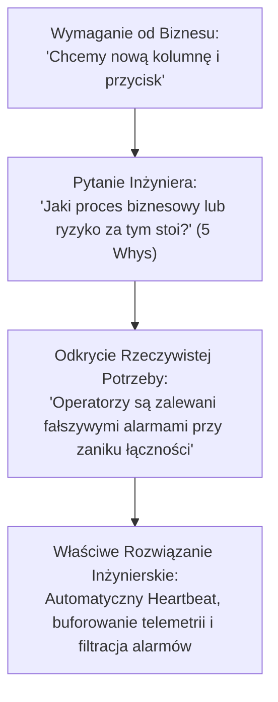
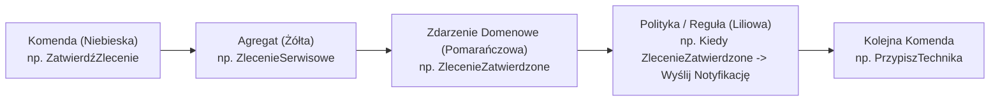
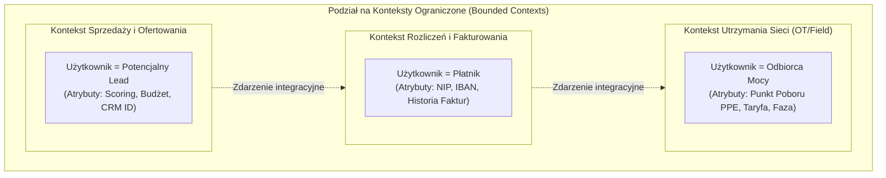
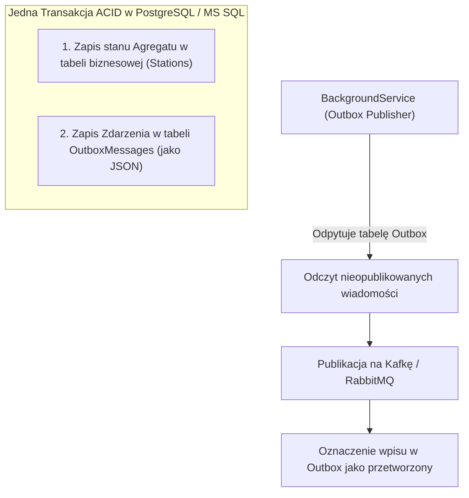

# Współpraca z Biznesem, Analiza Wymagań, DDD i Event Storming dla Senior Inżyniera

Rola dojrzałego inżyniera oprogramowania (**Senior / Lead .NET Developer**) wykracza daleko poza pasywne realizowanie zadań z Jiry czy "klepanie kodu" pod gotową specyfikację. W kluczowych sektorach gospodarki i infrastrukturze krytycznej powodzenie projektu zależy od zdolności inżyniera do **bezpośredniego partnerstwa z biznesem**, zrozumienia procesów dziedzinowych, aktywnego odkrywania ukrytych założeń oraz przełożenia skomplikowanej logiki na niezawodną, czystą architekturę techniczną.

Niniejsze opracowanie przedstawia metodykę inżynierii wymagań, warsztaty **Event Storming**, wzorce **Domain-Driven Design (DDD)** na poziomie strategicznym i taktycznym w C# oraz zestaw zaawansowanych pytań rekrutacyjnych — zarówno technicznych, jak i behawioralnych.

---

## Spis Treści
1. [Inżynier Jako Partner Biznesowy (Poza Tickety z Jiry)](#1-inżynier-jako-partner-biznesowy-poza-tickety-z-jiry)
   - Przejście od wykonawcy do doradcy technologicznego
   - Techniki odkrywania wymagań: 5 Whys, Example Mapping, User Story Mapping
   - Zarządzanie długiem technicznym w dialogu z biznesem (Język wartości i ryzyka)
2. [Event Storming: Szybkie Modelowanie Domeny](#2-event-storming-szybkie-modelowanie-domeny)
   - Dlaczego tradycyjna dokumentacja zawodzi?
   - Poziomy Event Stormingu: Big Picture, Process Modelling, Software Design
   - Gramatyka kolorów: Zdarzenia Domenowe, Komendy, Reguły, Agregaty, Systemy Zewnętrzne
   - Identyfikacja punktów zapalnych (Hot Spots) i wąskich gardeł procesowych
3. [Strategiczne Domain-Driven Design (Strategic DDD)](#3-strategiczne-domain-driven-design-strategic-ddd)
   - Język Wszechobecny (Ubiquitous Language) i eliminacja szumu pojęciowego
   - Granice Kontekstu (Bounded Contexts) i klasyfikacja subdomen (Core, Supporting, Generic)
   - Context Mapping: Partnerstwo, Shared Kernel, Klient-Dostawca, Anti-Corruption Layer (ACL)
4. [Taktyczne Domain-Driven Design w Nowoczesnym C# (.NET 8/9)](#4-taktyczne-domain-driven-design-w-nowoczesnym-c-net-89)
   - Encje (Entities) a Obiekty Wartości (Value Objects w C# z rekordami)
   - Agregaty (Aggregates) i żelazna zasada spójności transakcyjnej jednego agregatu
   - Zdarzenia Domenowe (Domain Events) i gwarancja dostarczenia: Wzorzec Outbox (Transactional Outbox)
   - Architektura Heksagonalna (Porty i Adaptery) a Czysta Architektura w .NET
5. [Architektoniczne Decyzje i ADR (Architecture Decision Records)](#5-architektoniczne-decyzje-i-adr-architecture-decision-records)
   - Jak dokumentować kluczowe decyzje inżynierskie?
   - Format ADR: Kontekst, Decyzja, Konsekwencje i Kompromisy
6. [Pytania Rekrutacyjne z Odpowiedziami (Senior & Lead FAQ)](#6-pytania-rekrutacyjne-z-odpowiedziami-senior--lead-faq)
   - Pytania techniczne (DDD, Agregaty, Spójność ostateczna)
   - Pytania behawioralne i sytuacyjne (Negocjacje z biznesem, konflikty priorytetów)
7. [Tablica Szybkiej Powtórki (Cheat-Sheet)](#7-tablica-szybkiej-powtórki-cheat-sheet)

---

## 1. Inżynier Jako Partner Biznesowy (Poza Tickety z Jiry)

Gdy developer otrzymuje zadanie w postaci: *"Dodaj kolumnę `IsBlocked` do tabeli `Devices` i zrób przycisk w panelu"*, słaby programista po prostu to koduje. Senior Developer pyta: **"Jaki problem biznesowy próbujemy rozwiązać?"**.

Może się okazać, że operatorzy chcą blokować urządzenia, ponieważ podczas awarii sieci telemetria przesyła błędne dane i powoduje fałszywe alarmy w dyspozytorni. Prawdziwym rozwiązaniem technicznym nie jest kolumna w bazie, lecz wdrożenie mechanizmu *Heartbeat & Circuit Breaker* dla telemetrii urządzeń!



### Techniki Odkrywania Wymagań
1. **Metoda 5 Whys (Pięć Razy Dlaczego):** Dochodzenie do pierwotnej przyczyny problemu biznesowego poprzez sekwencyjne pogłębianie pytań.
2. **Example Mapping:** Technika warsztatowa, w której w 25 minut deweloper, tester i analityk/biznes rozpisują:
   - Regułę biznesową (niebieska kartka)
   - Konkretne przykłady zachowań weryfikujące regułę (zielone kartki)
   - Nierozstrzygnięte pytania i wątpliwości (czerwone kartki)
3. **Mówienie Językiem Ryzyka i Kosztu (Dług Techniczny):**
   Biznes nie rozumie sformułowania *"Musimy zrefaktoryzować kod, bo mamy zły coupling w klasie Order"*.
   Biznes rozumie: *"Ten moduł odpowiada za fakturowanie energii. Ponieważ jest silnie powiązany z raportowaniem, każde wdrożenie niesie 40% ryzyka przestoju fakturowania i opóźnienia wpływów finansowych. Dwa dni refaktoryzacji zredukują ryzyko przestoju do zera"*.

---

## 2. Event Storming: Szybkie Modelowanie Domeny

**Event Storming** (metoda stworzona przez Alberto Brandoliniego) to warsztatowa technika grupowego modelowania złożonych domen biznesowych w oparciu o oś czasu i kolorowe karteczki samoprzylepne.



### Klocki Pojęciowe (Kolory w Event Storming):
- 🟧 **Domain Event (Pomarańczowa):** Fakt, który wydarzył się w przeszłości i ma znaczenie dla biznesu. Zapisywany w **czasie przeszłym dokonanym** (np. `FakturaWystawiona`, `CzujnikPrzegrzany`, `PłatnośćOdrzucona`).
- 🟦 **Command (Niebieska):** Intencja wywołana przez użytkownika lub system (np. `WystawFakturę`, `ZmieńNastawęTurbiny`).
- 🟨 **Aggregate (Duża Żółta):** Obiekt biznesowy zarządzający spójnością danych, który przyjmuje komendę i emituje zdarzenie (np. `KontoKlienta`, `StacjaTransformatorowa`).
- 🟪 **Policy / Read Model (Liliowa):** Reguła reaktywna: *"Kiedy zajdzie zdarzenie X, wykonaj komendę Y"* (np. *"Kiedy TemperaturaPrzekroczyła100C -> WyłączPompę"*).
- 🟥 **Hot Spot (Czerwona):** Niejasność biznesowa, konflikt definicyjny, wąskie gardło lub ryzyko prawne wymagające wyjaśnienia.

---

## 3. Strategiczne Domain-Driven Design (Strategic DDD)

W wielkich systemach próba stworzenia jednego "uniwersalnego" modelu danych (np. jednej wielkiej encji `Użytkownik` lub `Produkt` mającej 150 kolumn) kończy się architektonicznym paraliżem.



### Język Wszechobecny (Ubiquitous Language)
Pojęcia używane w kodzie (nazwy klas, metod, właściwości) muszą być **dokładnie tymi samymi pojęciami**, którymi posługują się eksperci domenowi.
- Jeśli biznes mówi: *"Zawieszamy dostawę gazu"*, w kodzie nie może być `UpdateStatus(Status = 4)`. Musi być metoda: `subscription.SuspendDelivery(reason)`.

### Wzorzec Anti-Corruption Layer (ACL)
Gdy nowoczesny serwis musi komunikować się ze starym systemem mainframe/legacy, nie pozwalamy, aby przestarzałe nazewnictwo i chaotyczne struktury danych przeniknęły do naszej czystej domeny.
Tworzymy **Warstwę Przeciwdziałania Skażeniu (ACL)**:
- ACL tłumaczy obce struktury danych na czyste pojęcia naszego Języka Wszechobecnego.

---

## 4. Taktyczne Domain-Driven Design w Nowoczesnym C# (.NET 8/9)

### Obiekty Wartości (Value Objects) a Rekordy C#
Obiekty Wartości nie posiadają unikalnego identyfikatora — są definiowane wyłącznie przez wartości swoich pól, są niezmienne (*immutable*) i zawierają własną walidację niezmienników.

W C# 10+ idealną implementacją Value Object są **`readonly record struct`**:

```csharp
public readonly record struct Money
{
    public decimal Amount { get; }
    public string Currency { get; }

    public Money(decimal amount, string currency)
    {
        if (amount < 0) 
            throw new ArgumentOutOfRangeException(nameof(amount), "Kwota nie może być ujemna.");
        
        if (string.IsNullOrWhiteSpace(currency) || currency.Length != 3) 
            throw new ArgumentException("Waluta musi być 3-literowym kodem ISO.", nameof(currency));

        Amount = amount;
        Currency = currency.ToUpperInvariant();
    }

    public static Money operator +(Money a, Money b)
    {
        if (a.Currency != b.Currency)
            throw new InvalidOperationException($"Nie można dodawać różnych walut: {a.Currency} i {b.Currency}");

        return new Money(a.Amount + b.Amount, a.Currency);
    }
}
```

---

### Agregat i Reguła Jednej Transakcji
Agregat to klaster obiektów powiązanych (encji i obiektów wartości), traktowany jako pojedyncza jednostka z punktu widzenia modyfikacji danych. Dostęp do agregatu odbywa się wyłącznie przez **Korzeń Agregatu (Aggregate Root)**.

> [!IMPORTANT]
> **Złota Reguła DDD:** W ramach jednej transakcji bazodanowej wolno zmodyfikować **dokładnie jeden agregat**. Modyfikacje innych agregatów powinny odbywać się asynchronicznie w oparciu o zdarzenia domenowe i **spójność ostateczną (Eventual Consistency)**.

```csharp
public class TransformerStation : AggregateRoot<StationId>
{
    private readonly List<SensorReading> _readings = [];
    public Temperature CurrentTemperature { get; private set; }
    public StationStatus Status { get; private set; }

    // Prywatny konstruktor dla EF Core
    private TransformerStation() { }

    public TransformerStation(StationId id, Temperature initialTemp) : base(id)
    {
        CurrentTemperature = initialTemp;
        Status = StationStatus.Operational;
    }

    public void RegisterTemperatureMeasurement(Temperature newTemp)
    {
        CurrentTemperature = newTemp;

        // Reguła biznesowa: przekroczenie temperatury krytycznej
        if (newTemp.Celsius > 110.0)
        {
            Status = StationStatus.EmergencyShutdown;
            // Emitowanie zdarzenia domenowego
            RaiseDomainEvent(new TransformerOverheatedDomainEvent(Id, newTemp, DateTime.UtcNow));
        }
    }
}
```

---

### Wzorzec Transactional Outbox (Niezawodna Publikacja Zdarzeń)
Gdy agregat emituje zdarzenie, zapis do bazy danych i publikacja na brokerze (Kafka / RabbitMQ) muszą być atomowe. W przeciwnym razie awaria brokera po zatwierdzeniu transakcji SQL doprowadzi do bezpowrotnej utraty zdarzenia!



---

## 5. Architektoniczne Decyzje i ADR (Architecture Decision Records)

W dojrzałych projektach decyzje inżynierskie nie mogą być podejmowane w próżni ani gubić się na komunikatorach (Slack / Teams). Służą do tego dokumenty **ADR** przechowywane bezpośrednio w repozytorium kodu (`/docs/adr/`):

```markdown
# ADR 007: Wprowadzenie Transactional Outbox dla telemetrii krytycznej

## Status: Zaakceptowany (Accepted)
## Data: 2026-10-01
## Autorzy: Senior .NET Lead, Chief Architect

### Kontekst:
Podczas awarii sieci telemetria przesyłana z urządzeń była gubiona, jeśli broker Kafka był chwilowo niedostępny. Prowadziło to do rozbieżności danych między bazą SQL a systemem analitycznym.

### Decyzja:
Wdrażamy wzorzec Transactional Outbox. Zdarzenia domenowe są zapisywane w tej samej transakcji bazy PostgreSQL/MSSQL co stan encji. Dedykowany BackgroundService publikuje wiadomości do Kafki z gwarancją 'At-Least-Once'.

### Konsekwencje:
- Pozytywne: Gwarancja 0% utraty zdarzeń. Odporność na awarie sieciowe brokera.
- Negatywne: Konieczność implementacji idempotentnego odbiorcy (Idempotent Consumer) po stronie subskrybentów ze względu na możliwość duplikatów.
```

---

## 6. Pytania Rekrutacyjne z Odpowiedziami (Senior & Lead FAQ)

### Pytanie 1: W jaki sposób odróżnić, czy dany koncept biznesowy powinien być Encją (Entity), czy Obiektem Wartości (Value Object)?
**Odpowiedź:**
Kluczowym kryterium jest **tożsamość (Identity)** oraz **zmienność w czasie**:
- Jeśli dwa obiekty mają dokładnie te same atrybuty, ale reprezentują dwa różne byty w świecie rzeczywistym (np. dwóch użytkowników o tym samym imieniu i nazwisku `Jan Kowalski`), obiekt musi posiadać unikalny identyfikator (`Id`) i jest **Encją**. Encje ewoluują w czasie, zachowując tę samą tożsamość.
- Jeśli obiekt jest definiowany wyłącznie przez swoje wartości i nie interesuje nas jego tożsamość (np. banknot o wartości 100 PLN, adres dostawy, przedział dat `DateRange`), to jest to **Obiekt Wartości (Value Object)**. Jeśli zmieni się ulica w adresie, nie modyfikujemy istniejącego adresu, lecz zastępujemy cały obiekt nową instancją (niezmienność / Immutability).

---

### Pytanie 2: Dlaczego w taktycznym DDD odradza się modyfikowanie wielu agregatów w ramach jednej transakcji bazy danych?
**Odpowiedź:**
Agregat z definicji jest granicą spójności transakcyjnej (*boundary of consistency*).
1. **Współbieżność i wydajność:** Modyfikowanie wielu agregatów w jednej transakcji wymusza zakładanie blokad na wielu tabelach i wierszach jednocześnie, co prowadzi do drastycznego wzrostu zakleszczeń (**Deadlocks**) i degradacji wydajności bazy danych w systemach transakcyjnych (OLTP).
2. **Skalowalność architektoniczna:** W systemach rozproszonych lub mikroserwisowych różne agregaty mogą docelowo znajdować się w innych bazach danych lub sherdach. Wymóg transakcji wieloagregatowej uniemożliwia podział systemu.
3. **Poprawne podejście:** Transakcja modyfikuje jeden agregat i emituje Zdarzenie Domenowe. Inne agregaty reagują na to zdarzenie asynchronicznie w modelu **spójności ostatecznej (Eventual Consistency)**.

---

### Pytanie 3: Przedstawiciel biznesu domaga się wdrożenia nowej funkcji w ciągu 2 dni. Wiesz, że zrobienie tego na skróty wprowadzi krytyczny dług techniczny i może zagrozić stabilności systemu na produkcji. Jak prowadzisz rozmowę?
**Odpowiedź (Pytanie Behawioralne):**
1. **Empatia i zrozumienie celu biznesowego:** Nie zaczynam od słowa "nie". Dowiaduję się, jakie twarde zobowiązanie biznesowe stoi za terminem 2 dni (np. zobowiązanie prawne, podpisanie kontraktu z kluczowym klientem).
2. **Prezentacja kompromisów (Trade-off Analysis):** Tłumaczę konsekwencje językiem zrozumiałym dla biznesu, nie używając żargonu: *"Jeśli wdrożymy to w 2 dni bez testów integracyjnych i bezpiecznej kolejki, ryzykujemy, że podczas obciążenia system rozliczeniowy przestanie działać, a naprawa danych potrwa tydzień"*.
3. **Zaproponowanie konstruktywnej alternatywy:**
   - **Wariant A (Okrojony zakres / MVP):** Dostarczenie w 2 dni 20% kluczowej funkcjonalności, która realizuje 80% potrzeby biznesowej w bezpieczny sposób.
   - **Wariant B (Manualny proces pomostowy):** Zastosowanie rozwiązania tymczasowego (np. asysta manualna/skryptowa przez pierwsze dni) do czasu wdrożenia pełnego, bezpiecznego automatu w kolejnym sprincie.
   - **Wariant C:** Jeśli biznes świadomie podejmuje ryzyko wydania wersji prowizorycznej, żądam natychmiastowego zaplanowania długu technicznego w kolejnym sprincie jako zadania o najwyższym priorytecie z potwierdzeniem na piśmie/ADR.

---

### Pytanie 4: Czym różni się wzorzec Domain Events od Integration Events?
**Odpowiedź:**
- **Domain Events (Zdarzenia Domenowe):** Zdarzenia wewnątrzprocesowe, zrozumiałe wyłącznie w granicach danego Kontekstu Ograniczonego (*Bounded Context*). Zawierają szczegółowe encje domenowe i są obsługiwane synchronicznie lub asynchronicznie w pamięci tej samej aplikacji (np. za pomocą mediatora w C#).
- **Integration Events (Zdarzenia Integracyjne):** Zdarzenia międzyprocesowe publikowane na zewnętrznym brokerze (Kafka, RabbitMQ, Azure Service Bus). Stanowią publiczny kontrakt API systemu. Muszą być minimalne pod kątem danych (aby nie ujawniać wewnętrznego modelu domeny na zewnątrz) i podlegać ścisłemu wersjonowaniu schematów (np. Protobuf / Avro / JSON Schema) w celu zachowania kompatybilności wstecznej.

---

### Pytanie 5 (Scenariusz Architektoniczny Live-Fire): Tworzymy system zarządzania siecią gazową. Eksperci domenowi używają pojęcia "Stacja Redukcyjna" w dwóch zupełnie różnych znaczeniach: dyspozytorzy rozumieją przez to fizyczny zawór i parametry ciśnienia, a księgowość rozumie przez to punkt rozliczeń podatkowych. Jak rozwiązujesz ten problem w architekturze?
**Rozwiązanie:**
Jest to klasyczny problem próby stworzenia jednego modelu dla różnych obszarów biznesowych.
1. **Identyfikacja dwóch Kontekstów Ograniczonych (Bounded Contexts):**
   - **Kontekst Dyspozytorski (Grid Operations Context):** Pojęcie `PressureReductionStation` — posiada atrybuty: `CurrentPressureBar`, `ValvePosition`, `MaxFlowRate`.
   - **Kontekst Bilingowy (Billing & Accounting Context):** Pojęcie `MeteringPoint` lub `TaxAccountingStation` — posiada atrybuty: `FiscalId`, `TariffCode`, `OwnerEntity`.
2. **Zastosowanie Języka Wszechobecnego:** W kodzie każdego z serwisów stosujemy wyłącznie pojęcia obowiązujące w danej poddomenie.
3. **Integracja:** Obiekt w świecie bilingowym odwołuje się do stacji operacyjnej wyłącznie za pomocą identyfikatora zewnętrznego (`StationExternalId`), a komunikacja między nimi odbywa się przez Zdarzenia Integracyjne (np. `MonthlyVolumeAggregatedIntegrationEvent`). Eliminuje to konflikt i pozwala każdemu zespołowi rozwijać model niezależnie.

---

## 7. Tablica Szybkiej Powtórki (Cheat-Sheet)

| Koncepcja | Opis i Cel | Zastosowanie w .NET / C# | Najczęstszy Błąd |
| :--- | :--- | :--- | :--- |
| **Event Storming** | Warsztat szybkiego odkrywania procesów domeny | Odkrywanie granic systemów i ryzyk | Dominacja technologii nad językiem biznesu |
| **Bounded Context**| Granica, w której dane pojęcie ma jedno znaczenie | Niezależny projekt/mikroserwis | Próba stworzenia jednej wielkiej bazy dla wszystkiego |
| **Ubiquitous Language**| Wspólny język programistów i ekspertów | Nazwy klas, metod i zdarzeń w C# | Techniczne nazwy tabel (`tbl_Dev_Mst_01`) |
| **Value Object** | Obiekt definiowany przez wartości, bez Id | `readonly record struct` | Mutowanie pól obiektu wartości |
| **Aggregate Root** | Korzeń gwarantujący spójność transakcyjną | Klasa bazowa z listą `IDomainEvent` | Modyfikacja wielu agregatów w jednej transakcji |
| **Transactional Outbox**| Atomowy zapis stanu i zdarzenia w SQL | Tabela `OutboxMessages` + Worker | Publikacja na brokerze przed zatwierdzeniem SQL |
| **Anti-Corruption Layer**| Tłumacz między czystą domeną a legacy | Klasy adapterów i mapperów | Wpuszczenie struktur legacy do modelu domeny |
