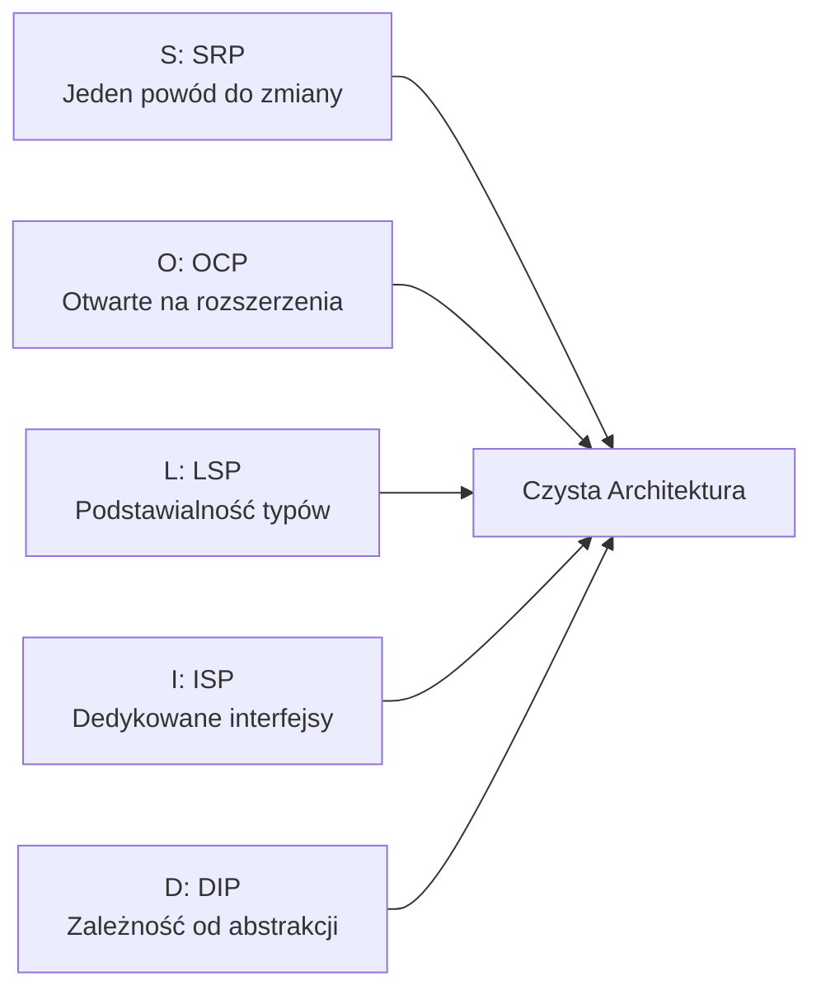
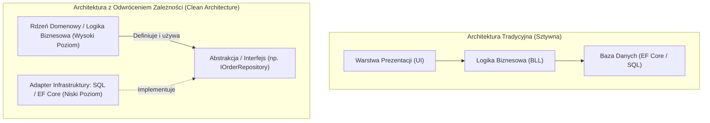

# Zasady SOLID w C# i .NET: Architektura Enterprise, Antywzorce i Pytania Rekrutacyjne

Zasady **SOLID** — sformułowane przez Roberta C. Martina (Uncle Bob) na początku lat 2000 — stanowią fundament projektowania zorientowanego obiektowo (**Object-Oriented Design**). W nowoczesnym ekosystemie .NET (C# 12 / 13, .NET 8 / 9) zasady te ewoluowały wraz z nadejściem paradygmatów programowania funkcyjnego (rekordy, pattern matching, immutability) oraz wbudowanego kontenera wstrzykiwania zależności (Dependency Injection).

Niniejszy artykuł omawia zasady SOLID nie jako akademicką regułkę, lecz z perspektywy **inżyniera oprogramowania i architekta systemów produkcyjnych**, skupiając się na subtelnych naruszeniach, kompromisach projektowych (*trade-offs*) oraz trudnych pytaniach rekrutacyjnych.

---

## Spis Treści
1. [Przegląd Akronimu SOLID i Cele Architektoniczne](#1-przegląd-akronimu-solid-i-cele-architektoniczne)
2. [S: Single Responsibility Principle (SRP)](#2-s-single-responsibility-principle-srp)
   - Czym naprawdę jest "powód do zmiany"? (Aktorzy biznesowi)
   - Antywzorzec: Klasy typu "God Object" i "Manager"
   - Przykłady w C#: refaktoryzacja monolitycznego serwisu
3. [O: Open/Closed Principle (OCP)](#3-o-openclosed-principle-ocp)
   - Otwarte na rozszerzenie, zamknięte na modyfikację
   - Polimorfizm, Wzorzec Strategii i Pattern Matching
   - Kiedy OCP staje się przedwczesną optymalizacją (Over-Engineering)?
4. [L: Liskov Substitution Principle (LSP)](#4-l-liskov-substitution-principle-lsp)
   - Formalna reguła Barbary Liskov (Warunki wstępne, końcowe i niezmienniki)
   - Klasyczna pułapka: Kwadrat dziedziczący po Prostokącie
   - Ciche naruszenia w C#: rzucanie `NotImplementedException` i sprawdzanie typu operatorem `is`
5. [I: Interface Segregation Principle (ISP)](#5-i-interface-segregation-principle-isp)
   - "Grube" interfejsy i zmuszanie klientów do zbędnych zależności
   - Antywzorzec: Ogromne repozytorium `IRepository<T>` z 30 metodami
   - Rozbicie interfejsów przy użyciu wzorców CQC / CQRS
6. [D: Dependency Inversion Principle (DIP)](#6-d-dependency-inversion-principle-dip)
   - Moduły wysokopoziomowe vs moduły niskopoziomowe
   - Różnica między DIP, Inversion of Control (IoC) i Dependency Injection (DI)
   - Antywzorzec Service Locator vs Constructor Injection
7. [Pytania Rekrutacyjne z Odpowiedziami (Senior & Architect FAQ)](#7-pytania-rekrutacyjne-z-odpowiedziami-senior--architect-faq)
   - Pytania techniczne i pułapki architektoniczne
   - Scenariusze z analizą kodu (Code Review Challenge)
8. [Tablica Szybkiej Powtórki (Cheat-Sheet)](#8-tablica-szybkiej-powtórki-cheat-sheet)

---

## 1. Przegląd Akronimu SOLID i Cele Architektoniczne

Głównym celem zasad SOLID jest minimalizacja kosztu modyfikacji oprogramowania w czasie (**TCO — Total Cost of Ownership**) oraz ograniczenie dwóch negatywnych zjawisk architektonicznych:
- **Kruchości kodu (Fragility):** Zmiana w jednym module powoduje niespodziewane błędy w z pozoru niezwiązanych częściach systemu.
- **Sztywności kodu (Rigidity):** Niemożność wprowadzenia prostej zmiany biznesowej bez przebudowy dziesiątek klas.



---

## 2. S: Single Responsibility Principle (SRP)

> **Zasada Pojedynczej Odpowiedzialności:** *Moduł powinien być odpowiedzialny przed jednym, i tylko jednym, aktorem biznesowym.*

Częsty błąd definicyjny polega na stwierdzeniu: *"Klasa powinna robić tylko jedną rzecz"*. To definicja pojedynczej funkcji, a nie klasy. W kontekście SRP "odpowiedzialność" jest powiązana z **źródłem zmiany biznesowej**.

### Antywzorzec: Klasa typu "God Object"

Spójrzmy na klasę `OrderProcessingService`, która łączy odpowiedzialności departamentu sprzedaży, księgowości i infrastruktury IT:

```csharp
// ❌ NARUSZENIE SRP: Trzy różne powody do zmiany (trzej różni aktorzy)
public class OrderService
{
    private readonly AppDbContext _context;

    public OrderService(AppDbContext context) => _context = context;

    public async Task ProcessOrderAsync(Order order)
    {
        // 1. Walidacja biznesowa (Aktor: Dział Sprzedaży)
        if (order.TotalAmount <= 0) 
            throw new InvalidOperationException("Niepoprawna kwota");

        // 2. Kalkulacja podatku VAT i rabatów (Aktor: Księgowość)
        decimal tax = order.TotalAmount * 0.23m;
        order.TotalWithTax = order.TotalAmount + tax;

        // 3. Bezpośrednia persystencja w bazie (Aktor: Administrator Bazy Danych)
        _context.Orders.Add(order);
        await _context.SaveChangesAsync();

        // 4. Integracja z bramką płatności HTTP (Aktor: Zewnętrzny Dostawca PayU/Stripe)
        using var client = new HttpClient();
        var response = await client.PostAsJsonAsync("https://payment.gateway/pay", new { order.Id, order.TotalWithTax });
        
        // 5. Wysyłka e-maila SMTP (Aktor: Dział Marketingu / Obsługi Klienta)
        using var smtp = new SmtpClient("smtp.company.com");
        smtp.Send("orders@company.com", order.CustomerEmail, "Twoje zamówienie", "Dziękujemy za zakup!");
    }
}
```

Jeśli zmieni się dostawca bramki płatności, zmieniasz tę klasę. Jeśli zmieni się stawka VAT, zmieniasz tę klasę. Jeśli zmieni się treść maila, zmieniasz tę klasę. Każda zmiana niesie ryzyko zepsucia pozostałych procesów!

### Refaktoryzacja do Czystego SRP

```csharp
// ✅ ZGODNE Z SRP: Każda klasa odpowiada przed jednym aktorem
public interface IOrderValidator { void Validate(Order order); }
public interface ITaxCalculator { decimal CalculateTax(Order order); }
public interface IPaymentGateway { Task ProcessPaymentAsync(Order order, CancellationToken ct); }
public interface IOrderNotificationService { Task SendConfirmationAsync(Order order, CancellationToken ct); }
public interface IOrderRepository { Task SaveAsync(Order order, CancellationToken ct); }

public class OrderProcessor(
    IOrderValidator validator,
    ITaxCalculator taxCalculator,
    IPaymentGateway paymentGateway,
    IOrderRepository repository,
    IOrderNotificationService notificationService)
{
    public async Task ProcessOrderAsync(Order order, CancellationToken ct)
    {
        validator.Validate(order);
        order.Tax = taxCalculator.CalculateTax(order);
        
        await paymentGateway.ProcessPaymentAsync(order, ct);
        await repository.SaveAsync(order, ct);
        await notificationService.SendConfirmationAsync(order, ct);
    }
}
```

---

## 3. O: Open/Closed Principle (OCP)

> **Zasada Otwarte/Zamknięte:** *Klasy, moduły i funkcje powinny być otwarte na rozbudowę, ale zamknięte na modyfikacje.*

Oznacza to, że powinniśmy mieć możliwość dodania nowego zachowania do systemu bez edycji istniejącego, przetestowanego i działającego na produkcji kodu.

### Antywzorzec: Drabinka `switch` / `if-else` zależna od typu

```csharp
// ❌ NARUSZENIE OCP: Dodanie nowego typu klienta wymaga edycji tej metody
public class DiscountService
{
    public decimal CalculateDiscount(CustomerType type, decimal amount)
    {
        return type switch
        {
            CustomerType.Regular => amount * 0.05m,
            CustomerType.Vip => amount * 0.15m,
            CustomerType.Employee => amount * 0.30m,
            // Aby dodać CustomerType.Partner, musimy MODYFIKOWAĆ tę klasę!
            _ => 0m
        };
    }
}
```

### Zastosowanie Wzorca Strategii (Strategy Pattern) w C#

W nowoczesnym C# zasada OCP jest najczęściej realizowana poprzez wstrzykiwanie kolekcji strategii:

```csharp
public interface IDiscountStrategy
{
    CustomerType ApplicableType { get; }
    decimal Calculate(decimal amount);
}

public class VipDiscountStrategy : IDiscountStrategy
{
    public CustomerType ApplicableType => CustomerType.Vip;
    public decimal Calculate(decimal amount) => amount * 0.15m;
}

public class PartnerDiscountStrategy : IDiscountStrategy
{
    public CustomerType ApplicableType => CustomerType.Partner;
    public decimal Calculate(decimal amount) => amount * 0.20m;
}

// ✅ Klasa kalkulatora jest ZAMKNIĘTA na modyfikację, ale OTWARTA na nowe strategie
public class DiscountCalculator(IEnumerable<IDiscountStrategy> strategies)
{
    private readonly Dictionary<CustomerType, IDiscountStrategy> _strategyMap = 
        strategies.ToDictionary(s => s.ApplicableType);

    public decimal Calculate(CustomerType type, decimal amount)
    {
        return _strategyMap.TryGetValue(type, out var strategy) 
            ? strategy.Calculate(amount) 
            : 0m;
    }
}
```

---

## 4. L: Liskov Substitution Principle (LSP)

> **Zasada Podstawienia Liskov:** *Jeśli $S$ jest podtypem $T$, to obiekty typu $T$ w programie mogą być zastąpione obiektami typu $S$ bez naruszania jakiejkolwiek pożądanej właściwości programu (poprawności, wykonywanego zadania itp.).*

Barbara Liskov i Jeannette Wing zdefiniowały ścisłe reguły zachowania podtypów:
1. **Warunki wstępne (Preconditions):** Podtyp nie może stawiać silniejszych warunków wstępnych niż typ bazowy.
2. **Warunki końcowe (Postconditions):** Podtyp nie może osłabiać warunków końcowych (musi gwarantować co najmniej to samo, co typ bazowy).
3. **Niezmienniki (Invariants):** Wszystkie niezmienniki typu bazowego muszą zostać zachowane w podtypie.
4. **Zasada historii (History Rule):** Podtyp nie może pozwalać na modyfikację stanu, która nie była dozwolona w typie bazowym (np. mutowanie obiektu niezmiennego).

### Subtelne Naruszenia LSP w Codziennym Kodzie

#### 1. Rzucanie `NotImplementedException` lub `SupportedException`
```csharp
public interface IFileReader
{
    byte[] ReadBytes();
    void Seek(long offset);
}

public class NetworkStreamReader : IFileReader
{
    public byte[] ReadBytes() => ...;
    
    // ❌ NARUSZENIE LSP: Klient oczekujący IFileReader nie spodziewa się wyjątku przy operacji Seek!
    public void Seek(long offset) => throw new NotSupportedException("Strumień sieciowy nie wspiera Seek");
}
```

#### 2. Sprawdzanie typu instrukcją `if (item is SpecialOrder)`
Jeśli w kodzie konsumującym klasę bazową widzisz rzutowanie lub sprawdzanie konkretnego typu potomnego, niemal na pewno naruszona została zasada LSP:

```csharp
public void Process(Invoice invoice)
{
    invoice.Issue();

    // ❌ ZŁE PODEJŚCIE: Złamanie polimorfizmu i LSP
    if (invoice is ProformaInvoice proforma)
    {
        proforma.CancelReservation(); // Typ nadrzędny tego nie potrafi!
    }
}
```

---

## 5. I: Interface Segregation Principle (ISP)

> **Zasada Segregacji Interfejsów:** *Żaden klient nie powinien być zmuszany do polegania na metodach, których nie używa.*

Zasada ta promuje tworzenie małych, wysoce spójnych interfejsów dedykowanych konkretnym rolom (*Role Interfaces*), zamiast jednego uniwersalnego "kombajnu" (*Header Interfaces*).

### Antywzorzec: Gruby Interfejs Repozytorium

```csharp
// ❌ NARUSZENIE ISP: Każda usługa zależy od wszystkich operacji
public interface IUserRepository
{
    Task<User> GetByIdAsync(int id);
    Task<IEnumerable<User>> GetAllActiveUsersAsync();
    Task AddAsync(User user);
    Task UpdateAsync(User user);
    Task DeleteAsync(int id);
    Task UpdatePasswordHashAsync(int userId, string hash);
    Task LockAccountAsync(int userId);
    Task GenerateAuditLogReportAsync(DateTime from, DateTime to);
}
```

Jeśli serwis obsługujący proces logowania potrzebuje jedynie pobrać użytkownika i sprawdzić hasło, wstrzyknięcie powyższego interfejsu wystawia na niego metody `DeleteAsync` czy `GenerateAuditLogReportAsync`.

### Podział na Małe, Zorientowane na Role Interfejsy

```csharp
public interface IUserReader
{
    Task<User?> GetByIdAsync(int id, CancellationToken ct);
}

public interface IUserAuthenticationRepository
{
    Task<User?> GetByLoginAsync(string login, CancellationToken ct);
    Task UpdatePasswordHashAsync(int userId, string hash, CancellationToken ct);
}

public interface IUserManagementRepository
{
    Task AddAsync(User user, CancellationToken ct);
    Task LockAccountAsync(int userId, CancellationToken ct);
}
```

Dzięki temu serwis uwierzytelniania zależy wyłącznie od `IUserAuthenticationRepository`, a testy jednostkowe wymagają zamockowania tylko 2 metod, zamiast 10.

---

## 6. D: Dependency Inversion Principle (DIP)

> **Zasada Odwrócenia Zależności:**
> 1. *Moduły wysokopoziomowe nie powinny zależeć od modułów niskopoziomowych. Oba powinny zależeć od abstrakcji.*
> 2. *Abstrakcje nie powinny zależeć od detali. Detale powinny zależeć od abstrakcji.*



W tradycyjnej architekturze warstwowej logika biznesowa zależy bezpośrednio od bazy danych. W architekturze z odwróconymi zależnościami (Hexagonal / Onion / Clean Architecture), to **domena definiuje interfejsy (porty)**, a warstwa infrastruktury (detal niskopoziomowy) implementuje te interfejsy.

### Rozróżnienie Pojęć: DIP vs IoC vs DI
- **DIP (Dependency Inversion Principle):** Zasada architektoniczna mówiąca o kierunku zależności (zależność od abstrakcji).
- **IoC (Inversion of Control):** Ogólny wzorzec projektowy odwracający sterowanie przepływem programu (np. framework wywołuje Twój kod, a nie Ty framework).
- **DI (Dependency Injection):** Wzorzec implementacyjny pozwalający dostarczyć obiektom ich zależności z zewnątrz (np. przez konstruktor), zamiast tworzyć je słowem kluczowym `new`.

---

## 7. Pytania Rekrutacyjne z Odpowiedziami (Senior & Architect FAQ)

### Pytanie 1: Czym różni się Single Responsibility Principle (SRP) od idei enkapsulacji i wysokiej spójności (High Cohesion)?
**Odpowiedź:**
- **High Cohesion (Wysoka Spójność):** To miara stopnia powiązania elementów wewnątrz modułu. Klasa jest spójna, jeśli wszystkie jej pola i metody współpracują nad wspólnym logicznym celem.
- **Enkapsulacja:** To ukrywanie wewnętrznego stanu obiektu i udostępnianie operacji za pośrednictwem publicznego kontraktu.
- **SRP:** Idzie o krok dalej — wiąże spójność z **powodem zmiany wynikającym z otoczenia biznesowego**. Klasa może być technicznie spójna (np. manipuluje polami encji `Employee`), ale jeśli łączy logikę wyliczania pensji (aktor: CFO) z logiką raportowania godzin pracy (aktor: HR) oraz persystencją w bazie (aktor: DBA), to narusza SRP, ponieważ żądania zmian od trzech niezależnych interesariuszy będą zmuszały do modyfikacji tego samego pliku źródłowego.

---

### Pytanie 2: W jaki sposób zasada Liskov Substitution Principle (LSP) odnosi się do kowariancji i kontrawariancji w C#?
**Odpowiedź:**
LSP jest bezpośrednią podstawą formalną dla reguł kowariancji (`out`) i kontrawariancji (`in`) typów generycznych w C#:
- **Kowariancja typu zwracanego (Postconditions):** Zgodnie z LSP podtyp może zwrócić typ bardziej wyspecjalizowany (węższy) niż typ bazowy. W C# 9+ wprowadzono natywne wsparcie dla kowariantnych typów zwracanych (*Covariant Returns*), co oznacza, że przesłonięta metoda może zwracać klasę pochodną bez rzutowania.
- **Kontrawariancja parametrów wejściowych (Preconditions):** Metoda w podtypie może przyjmować argumenty o typie szerszym (ogólniejszym) niż metoda bazowa, ponieważ nie zawęża to wymagań wstępnych klienta wywołującego.

---

### Pytanie 3: Czy interfejsy z domyślną implementacją metod w C# 8+ (Default Interface Methods) łamią zasady SOLID?
**Odpowiedź:**
Nie, jeśli są stosowane z właściwym przeznaczeniem.
Domyślne metody interfejsów zostały wprowadzone głównie z myślą o autorach bibliotek, aby umożliwić ewolucję publicznych interfejsów (dodanie nowej metody pomocniczej) bez łamania kompatybilności wstecznej (*binary compatibility*) istniejących implementacji innych twórców.
Mogą jednak zostać nadużyte do łamania:
- **SRP:** gdy interfejs zaczyna implementować skomplikowaną logikę biznesową lub zarządzać stanem.
- **ISP:** jeśli autor interfejsu dodaje do niego kolejne niepowiązane domyślne metody zamiast wydzielić dedykowany interfejs.

---

### Pytanie 4: Dlaczego wzorzec Service Locator jest uznawany za antywzorzec w kontekście Dependency Inversion Principle (DIP)?
**Odpowiedź:**
Wzorzec `Service Locator` polega na wstrzyknięciu do klasy całego kontenera (np. `IServiceProvider`) i wywoływaniu wewnątrz metod `serviceProvider.GetService<T>()`.
Jest to antywzorzec, ponieważ:
1. **Zataja zależności (Hidden Dependencies):** Patrząc na konstruktor klasy, nie wiesz, czego ona potrzebuje do działania. Dowiadujesz się o braku rejestracji serwisu dopiero w czasie działania (`NullReferenceException` w runtime).
2. **Utrudnia testowanie:** Zamiast podać prosty mock interfejsu w teście jednostkowym, musisz konfigurować cały mechanizm Service Locatora.
3. **Łamie DIP:** Klasa zamiast zależeć od konkretnych abstrakcji domenowych, zależy od infrastrukturalnego mechanizmu rozwiązywania zależności.

---

### Pytanie 5 (Code Review Challenge): Wskaż wszystkie naruszenia zasad SOLID w poniższym fragmencie kodu i zaproponuj poprawki:
```csharp
public class ReportGenerator
{
    public void GenerateAndSave(string reportType, string destinationPath)
    {
        IReport report;
        if (reportType == "PDF") report = new PdfReport();
        else if (reportType == "Excel") report = new ExcelReport();
        else throw new ArgumentException("Nieznany typ");

        var data = new SqlDatabase().FetchRawData(); // Połączenie z bazą
        var content = report.Render(data);
        File.WriteAllText(destinationPath, content);
    }
}
```

**Analiza i Wytknięte Błędy:**
1. **Naruszenie SRP:** Klasa `ReportGenerator` odpowiada jednocześnie za fabrykowanie raportów, pobieranie danych z bazy SQL, renderowanie oraz operacje I/O na systemie plików.
2. **Naruszenie OCP:** Dodanie nowego formatu raportu (np. HTML) wymaga edycji drabinki `if-else` wewnątrz `GenerateAndSave`.
3. **Naruszenie DIP:** Bezpośrednie tworzenie instancji `new SqlDatabase()` za pomocą słowa kluczowego `new`. Klasa wysokiego poziomu zależy od konkretnego, niskopoziomowego drivera SQL, a nie od abstrakcji `IDataSource`.
4. **Naruszenie ISP/LSP (ukryte):** Zwracanie typu `string` z `report.Render(data)` i zapisywanie go za pomocą `File.WriteAllText` zakłada, że każdy raport jest tekstem. Raporty binarne (jak PDF czy Excel) zostaną uszkodzone przy próbie zapisu jako string UTF-8.

---

## 8. Tablica Szybkiej Powtórki (Cheat-Sheet)

| Zasada | Znaczenie w jednym zdaniu | Typowy Objaw Naruszenia (Code Smell) | Sposób Naprawy / Wzorzec |
| :--- | :--- | :--- | :--- |
| **S** (Single Responsibility) | Jeden powód do modyfikacji klasy | Klasy mające po kilkaset linii, sufiksy `Manager`, `Helper`, `Processor` | Podział na małe klasy, wzorzec Fasady lub Command |
| **O** (Open/Closed) | Rozszerzaj zachowanie bez edycji istniejącego kodu | Długie drabinki `if-else` i instrukcje `switch` na typach danych | Wzorzec Strategii, Polimorfizm, Fabryka |
| **L** (Liskov Substitution) | Klasa potomna musi być 100% zgodna z kontraktem bazy | `throw new NotImplementedException()`, `if (x is SpecificType)` | Kompozycja zamiast dziedziczenia, wydzielenie interfejsu |
| **I** (Interface Segregation) | Klient nie może zależeć od metod, których nie używa | Klasy implementujące metody z pustym ciałem lub rzucające błąd | Rozbicie na małe interfejsy zorientowane na rolę |
| **D** (Dependency Inversion) | Zależność od abstrakcji, nie od konkretnych klas | Słowo kluczowe `new` w konstruktorze dla serwisów, Service Locator | Konstruktorowe wstrzykiwanie zależności (DI) |
