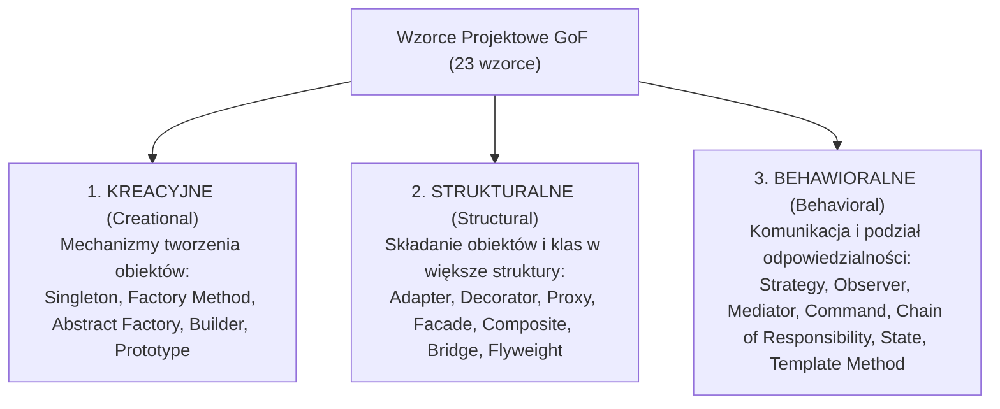
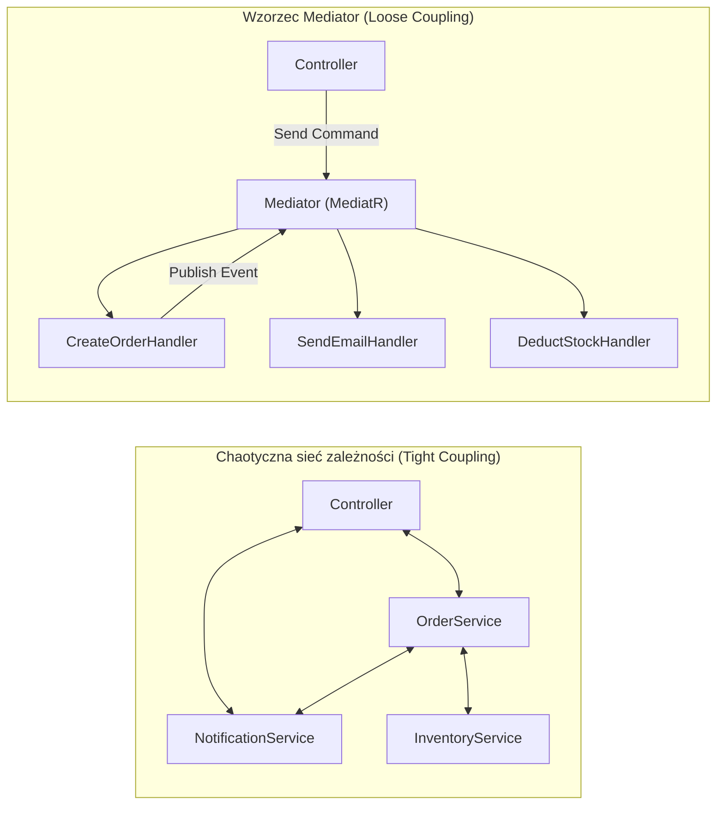
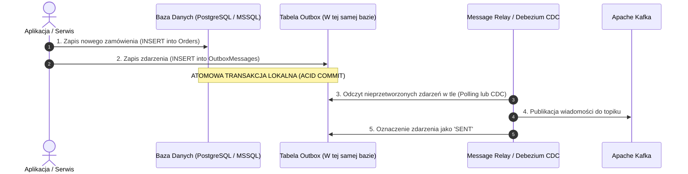
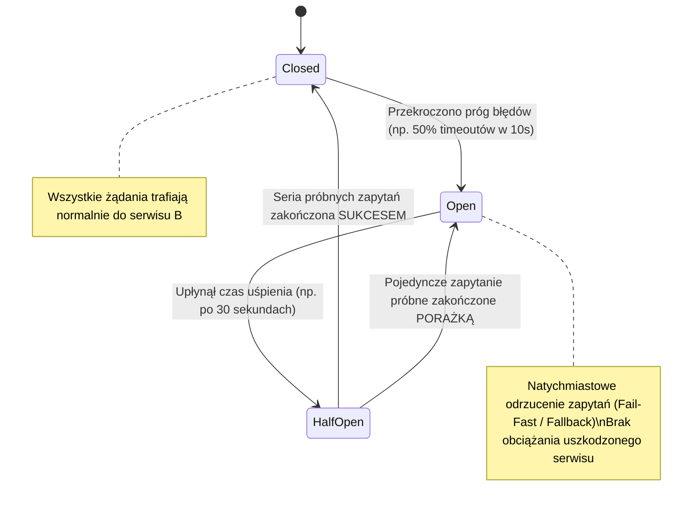

# Wzorce Projektowe w C# i Java (GoF & Enterprise Patterns)

Kompleksowy przewodnik inżynierski po wzorcach projektowych **Gang of Four (GoF)** oraz nowoczesnych wzorcach architektonicznych w systemach rozproszonych. Artykuł prezentuje implementacje w językach **C# (.NET)** oraz **Java**, omawia ewolucję wzorców w obliczu nowoczesnych mechanizmów językowych (lambdy, rekordy, wstrzykiwanie zależności), pułapki implementacyjne (wycieki pamięci, wielowątkowość) oraz zestaw zaawansowanych pytań rekrutacyjnych i scenariuszy awaryjnych (od poziomu Mid do Staff / Principal Architect).

---

## Spis Treści
1. [Taksonomia Wzorców Projektowych i Nowoczesne Spojrzenie](#1-taksonomia-wzorców-projektowych-i-nowoczesne-spojrzenie)
   - Dlaczego stosujemy wzorce projektowe?
   - Klasyfikacja GoF: Kreacyjne, Strukturalne, Behawioralne
   - Ewolucja: Jak nowoczesny C# (.NET 8/9) i Java (17/21) uprościły wzorce GoF
2. [Wzorce Kreacyjne (Creational Patterns)](#2-wzorce-kreacyjne-creational-patterns)
   - **Singleton:** Bezpieczeństwo wątkowe (`Lazy<T>` w C#, Enum i Bill Pugh w Java)
   - **Factory Method** vs **Abstract Factory**
   - **Builder:** Wzorzec Fluent Builder z walidacją niezmienników
   - **Prototype:** Głębokie klonowanie vs `ICloneable`
3. [Wzorce Strukturalne (Structural Patterns)](#3-wzorce-strukturalne-structural-patterns)
   - **Adapter:** Integracja niekompatybilnych interfejsów
   - **Decorator:** Dynamiczne rozszerzanie funkcjonalności (Strumienie I/O, Caching)
   - **Proxy:** Wirtualne, Caching i Dynamiczne Proxy (Fundament Spring AOP i EF Core)
   - **Facade** i **Composite**
4. [Wzorce Behawioralne (Behavioral Patterns)](#4-wzorce-behawioralne-behavioral-patterns)
   - **Strategy:** Wymienne algorytmy (i ich nowoczesny zamiennik: `Func<T>` / Lambdy)
   - **Observer:** System subskrypcji zdarzeń (Zdarzenia C# vs Reactive Streams)
   - **Mediator:** Luźne powiązania obiektów (Architektura MediatR w .NET)
   - **Chain of Responsibility:** Potok przetwarzania (Middleware w ASP.NET Core i filtry Spring)
   - **Command** i **State**
5. [Wzorce Architektoniczne w Systemach Rozproszonych (Enterprise)](#5-wzorce-architektoniczne-w-systemach-rozproszonych-enterprise)
   - **Transactional Outbox Pattern:** Gwarancja spójności baza $\leftrightarrow$ broker (Kafka)
   - **Circuit Breaker:** Zapobieganie kaskadowym awariom (Polly / Resilience4j)
   - **CQRS (Command Query Responsibility Segregation)**
6. [Pytania Rekrutacyjne z Odpowiedziami (FAQ Interview)](#6-pytania-rekrutacyjne-z-odpowiedziami-faq-interview)
   - Pytania Podstawowe i Średniozaawansowane (Mid)
   - Pytania Zaawansowane i Architektoniczne (Senior / Principal)
   - Scenariusze Awaryjne i Live-fire Troubleshooting
7. [Tablica Szybkiej Powtórki (Cheat-Sheet)](#7-tablica-szybkiej-powtórki-cheat-sheet)

---

## 1. Taksonomia Wzorców Projektowych i Nowoczesne Spojrzenie

Wzorce projektowe (opisane w 1994 r. przez Ericha Gammę, Richarda Helma, Ralpha Johnsona i Johna Vlissidesa — **Gang of Four / GoF**) to sprawdzone, zreifikowane rozwiązania powszechnych problemów architektonicznych w programowaniu obiektowym.



### Ewolucja w Nowoczesnym C# i Java:
Tradycyjne wzorce GoF powstały w czasach wczesnego C++ i Smalltalka, gdzie brakowało domknięć i programowania funkcyjnego. Współcześnie:
1. **Singleton:** Zastąpiony przez kontenery **Dependency Injection** z cyklem życia `AddSingleton()` (w .NET) lub `@Singleton` / `@Component` (w Springu).
2. **Strategy:** Zamiast tworzyć 10 klas implementujących interfejs `IPricingStrategy`, przekazujemy delegat `Func<decimal, decimal>` (C#) lub `Function<BigDecimal, BigDecimal>` (Java).
3. **Builder:** W nowoczesnym C# mechanizm `init-only setters` oraz wyrażenia `record with` często eliminują potrzebę pisania ręcznych builderów dla niemutowalnych DTO.

---

## 2. Wzorce Kreacyjne (Creational Patterns)

### 1. Singleton (Wielowątkowość pod lupą)
Wzorzec gwarantujący, że klasa posiada tylko jedną instancję i zapewnia do niej globalny punkt dostępu.

#### Implementacja w C# (.NET): Wzorzec `Lazy<T>`
W C# nie należy pisać manualnego Double-Check Lockingu z `lock` i `volatile`. Standardem jest wbudowany, bezpieczny wielowątkowo typ **`Lazy<T>`**:

```csharp
public sealed class ConfigurationManager
{
    // Lazy domyślnie korzysta z trybu LazyThreadSafetyMode.ExecutionAndPublication
    private static readonly Lazy<ConfigurationManager> _instance = 
        new Lazy<ConfigurationManager>(() => new ConfigurationManager());

    // Prywatny konstruktor uniemożliwia utworzenie obiektu operatorem 'new'
    private ConfigurationManager()
    {
        // Ciężka inicjalizacja
    }

    public static ConfigurationManager Instance => _instance.Value;
}
```

#### Implementacja w Java: Enum Singleton oraz Bill Pugh Pattern
W Javie tradycyjna implementacja Double-Checked Locking wymaga bezwzględnego użycia słowa kluczowego **`volatile`** (aby zapobiec instrukcji Reordering w pamięci procesora). 

Joshua Bloch (twórca Java Collections) zaleca **Enum Singleton**:
```java
// 1. ZALECANY WG JOSHUY BLOCHA: Odporny na refleksję i deserializację!
public enum CacheManager {
    INSTANCE;
    
    public void put(String key, Object value) { /* ... */ }
}

// 2. ALTERNATYWA: Bill Pugh Initialization-on-demand Holder Pattern
public class DatabasePool {
    private DatabasePool() {}

    // Klasa wewnętrzna nie jest ładowana do pamięci JVM dopóki nie wywołamy getInstance()!
    private static class Holder {
        private static final DatabasePool INSTANCE = new DatabasePool();
    }

    public static DatabasePool getInstance() {
        return Holder.INSTANCE;
    }
}
```

---

### 2. Factory Method vs Abstract Factory

```mermaid
flowchart TD
    subgraph FactoryMethod["Factory Method (Metoda Wytwórcza)"]
        Creator["Logistics (Klasa Bazowa / Interfejs)"] -->|createTransport()| Product["Transport (Produkt)"]
        RoadLogistics -->|zwraca| Truck["Truck"]
        SeaLogistics -->|zwraca| Ship["Ship"]
    end

    subgraph AbstractFactory["Abstract Factory (Fabryka Abstrakcyjna)"]
        GUIFactory["GUIFactory (Fabryka Rodziny Obiektów)"]
        GUIFactory --> WinFactory["WindowsFactory -> tworzy (WinButton, WinCheckbox)"]
        GUIFactory --> MacFactory["MacFactory -> tworzy (MacButton, MacCheckbox)"]
    end
```

* **Factory Method:** Pojedyncza metoda delegująca utworzenie **jednego konkretnego produktu** do podklas (np. `createTransport()` zwraca `ITransport`).
* **Abstract Factory:** Interfejs do tworzenia **całych rodzin powiązanych lub zależnych od siebie obiektów**, bez określania ich konkretnych klas (np. `UIFactory` tworzy jednocześnie spójne stylowo `Button`, `Checkbox` i `Window`).

---

### 3. Builder z Walidacją Niezmienników (Invariants)
Oddziela konstrukcję złożonego obiektu od jego reprezentacji, zapobiegając powstawaniu tzw. **Telescoping Constructor Anti-pattern** (konstruktorów z 10 parametrami, z których połowa to `null`):

```csharp
public class UserRegistration
{
    public string Email { get; }
    public string FullName { get; }
    public int Age { get; }

    internal UserRegistration(string email, string fullName, int age)
    {
        Email = email;
        FullName = fullName;
        Age = age;
    }
}

public class UserRegistrationBuilder
{
    private string _email;
    private string _fullName;
    private int _age;

    public UserRegistrationBuilder WithEmail(string email) { _email = email; return this; }
    public UserRegistrationBuilder WithFullName(string name) { _fullName = name; return this; }
    public UserRegistrationBuilder WithAge(int age) { _age = age; return this; }

    public UserRegistration Build()
    {
        // Walidacja spójności całego bytu w jednym punkcie
        if (string.IsNullOrWhiteSpace(_email) || !_email.Contains("@"))
            throw new InvalidOperationException("Nieprawidłowy adres email.");
        if (_age < 18)
            throw new InvalidOperationException("Rejestracja dozwolona od lat 18.");

        return new UserRegistration(_email, _fullName, _age);
    }
}
```

---

## 3. Wzorce Strukturalne (Structural Patterns)

### 1. Decorator (Dekorator)
Pozwala dynamicznie dodawać nowe zachowania do obiektów poprzez opakowywanie ich w obiekty klas dekoratorów, spełniając **Open/Closed Principle (OCP)**:

```csharp
public interface IOrderRepository
{
    Task<Order> GetByIdAsync(int id);
}

// 1. Klasa bazowa (Core Component)
public class SqlOrderRepository : IOrderRepository
{
    public async Task<Order> GetByIdAsync(int id) => /* zapytanie do bazy SQL */ null!;
}

// 2. Dekorator Caching (Transparentnie dodaje pamięć podręczną)
public class CachedOrderRepository : IOrderRepository
{
    private readonly IOrderRepository _inner;
    private readonly IMemoryCache _cache;

    public CachedOrderRepository(IOrderRepository inner, IMemoryCache cache)
    {
        _inner = inner;
        _cache = cache;
    }

    public async Task<Order> GetByIdAsync(int id)
    {
        return await _cache.GetOrCreateAsync($"order-{id}", () => _inner.GetByIdAsync(id));
    }
}
```

---

### 2. Proxy vs Adapter vs Decorator (Porównanie)
| Wzorzec | Zmienia interfejs? | Cel biznesowy |
| :--- | :---: | :--- |
| **Adapter** | **TAK** | Umożliwia współpracę dwóm niekompatybilnym interfejsom (np. integracja starego legacy API z nowym kodem). |
| **Decorator** | **NIE** | Dodaje nowe zachowania/odpowiedzialności do istniejącego komponentu bez modyfikacji jego kodu (np. cache, logowanie, szyfrowanie). |
| **Proxy** | **NIE** | Kontroluje dostęp do obiektu docelowego (np. Lazy Loading, ochrona uprawnień, transakcje `@Transactional`, zdalny dostęp RPC). |

---

## 4. Wzorce Behawioralne (Behavioral Patterns)

### 1. Strategy (Strategia)
Definiuje rodzinę wymiennych algorytmów, zamyka każdy z nich w osobnej klasie i sprawia, że są wymienne w czasie działania programu:

```java
// Java: Zamiast wielu klas, nowoczesny kod korzysta z interfejsu funkcyjnego
@FunctionalInterface
public interface DiscountStrategy {
    BigDecimal applyDiscount(BigDecimal totalAmount);
}

public class OrderCheckout {
    public BigDecimal calculateFinalPrice(BigDecimal amount, DiscountStrategy strategy) {
        return strategy.applyDiscount(amount);
    }
}

// Użycie z wyrażeniem Lambda:
OrderCheckout checkout = new OrderCheckout();
BigDecimal price = checkout.calculateFinalPrice(new BigDecimal("100.00"), 
    total -> total.multiply(new BigDecimal("0.80"))); // 20% zniżki
```

---

### 2. Mediator i Biblioteka MediatR w .NET
Zmniejsza liczbę chaotycznych zależności między obiektami, zmuszając je do komunikacji wyłącznie za pośrednictwem obiektu Mediatora:



```csharp
// 1. Wiadomość (Request / Command)
public record CreateUserCommand(string Email, string Name) : IRequest<int>;

// 2. Obsługa (Handler) - Odizolowana, łatwa do przetestowania jednostkowo
public class CreateUserHandler : IRequestHandler<CreateUserCommand, int>
{
    private readonly AppDbContext _db;
    public CreateUserHandler(AppDbContext db) => _db = db;

    public async Task<int> Handle(CreateUserCommand request, CancellationToken ct)
    {
        var user = new User { Email = request.Email, Name = request.Name };
        _db.Users.Add(user);
        await _db.SaveChangesAsync(ct);
        return user.Id;
    }
}
```

---

### 3. Chain of Responsibility (Łańcuch Zobowiązań)
Pozwala przekazywać żądanie wzdłuż łańcucha potencjalnych obiektów obsługujących. Każdy obiekt decyduje, czy przetworzyć żądanie i czy przekazać je do następnego ogniwa.
* **Architektura Middleware w ASP.NET Core:**
  ```csharp
  app.UseAuthentication(); // Ogniwo 1
  app.UseAuthorization();  // Ogniwo 2
  app.UseResponseCaching(); // Ogniwo 3
  app.MapControllers();    // Koniec łańcucha
  ```
* Każdy middleware posiada delegat `RequestDelegate next`, którym decyduje o przekazaniu żądania w głąb potoku lub jego zwarciu (*Short-circuiting*, np. zwrot błędu 401).

---

## 5. Wzorce Architektoniczne w Systemach Rozproszonych (Enterprise)

### 1. Transactional Outbox Pattern
Rozwiązuje krytyczny problem **Dual-Write** w mikroserwisach: jak zapisać dane w lokalnej bazie SQL i jednocześnie wysłać zdarzenie do brokera Kafka/RabbitMQ bez ryzyka niespójności w razie awarii sieci:



* **Zasada:** Publikacja wiadomości nie następuje bezpośrednio w kodzie biznesowym. Zamiast tego zdarzenie jest zapisywane w tej samej lokalnej transakcji bazodanowej do tabeli `Outbox`.
* Dedykowany proces w tle (narzędzie Change Data Capture, np. **Debezium**, lub proces workerowy w .NET) asynchronicznie czyta zdarzenia z tabeli Outbox i wypycha je do Kafki, gwarantując semantykę **At-least-once delivery**.

---

### 2. Circuit Breaker (Bezpiecznik)
Chroni aplikację przed kaskadową awarią, gdy zależna usługa zewnętrzna przestaje odpowiadać:



* Zaimplementowany w bibliotekach: **Polly** (dla .NET) oraz **Resilience4j** (dla Java/Spring).

---

## 6. Pytania Rekrutacyjne z Odpowiedziami (FAQ Interview)

### Pytania Podstawowe i Średniozaawansowane (Mid)

#### P1: Czym różni się wzorzec Strategy od wzorca State?
**Odpowiedź:**
Mimo że strukturalnie na diagramach klas oba wzorce wyglądają niemal identycznie (kontekst posiada referencję do interfejsu), różnią się intencją architektoniczną:
* **Strategy:** Służy do wyboru **algorytmu / sposobu realizacji zadania**. Klient zwykle świadomie wybiera i wstrzykuje konkretną strategię do kontekstu z zewnątrz (np. wybór płatności: Karta vs PayPal). Strategie rzadko wiedzą o swoim wzajemnym istnieniu.
* **State:** Służy do zmiany zachowania obiektu w zależności od jego **stanu wewnętrznego** (maszyna stanów). Kontekst deleguje zachowanie do bieżącego stanu, a same obiekty stanów często posiadają logikę przełączania kontekstu do kolejnego stanu (np. zamówienie w stanie `Nowe` $\rightarrow$ przechodzi w stan `Opłacone` $\rightarrow$ przechodzi w `Wysłane`).

---

#### P2: Dlaczego Double-Checked Locking w Javie wymaga słowa kluczowego `volatile`?
**Odpowiedź:**
Operacja utworzenia obiektu `instance = new Singleton()` nie jest atomowa w kodzie maszynowym procesora. Składa się z trzech kroków:
1. Alokacja surowej pamięci na stercie (`malloc`).
2. Wywołanie konstruktora obiektu.
3. Przypisanie adresu zaalokowanej pamięci do wskaźnika `instance`.
* **Problem Reordering:** Zarówno kompilator JIT, jak i procesor w celach optymalizacyjnych mogą zamienić kolejność kroków 2 i 3 (najpierw przypisać wskaźnik, a potem uruchomić konstruktor).
* W środowisku wielowątkowym inny wątek może trafić na pierwsze sprawdzenie `if (instance == null)`, zauważyć, że wskaźnik `instance` nie jest już nulem, i zacząć odczytywać pola obiektu, którego konstruktor **jeszcze nie zakończył działania** (zwrócenie częściowo zainicjalizowanego obiektu i błędy `NullPointerException`).
* Słowo kluczowe **`volatile`** zapobiega przestawianiu instrukcji w pamięci (Memory Barrier / Happens-Before relationship).

---

#### P3: Dlaczego wzorzec Singleton jest przez wielu inżynierów uznawany za antywzorzec (Anti-Pattern)?
**Odpowiedź:**
Klasyczny Singleton łamie zasady czystego kodu:
1. **Ukryte zależności:** Zamiast jawnie deklarować zależności w konstruktorze, klasy potajemnie sięgają po stan globalny (`Database.Instance.Query()`).
2. **Koszmar testowania jednostkowego:** Trudno zamockować singletona. Ponieważ żyje on przez całe uruchomienie procesu, testy uruchamiane równolegle modyfikują ten sam stan globalny, stając się testami migoczącymi (*Flaky Tests*).
3. **Łamanie Single Responsibility Principle:** Klasa odpowiada jednocześnie za swoją logikę biznesową ORAZ za zarządzanie własnym cyklem życia w pamięci.
* **Rozwiązanie:** Rezygnacja ze statycznych singletonów na rzecz klas zarządzanych przez kontenery **Dependency Injection** (gdzie framework zarządza cyklem życia jako pojedynczą instancją w kontenerze, a klasa pozostaje zwykłą klasą z interfejsem).

---

### Pytania Zaawansowane i Architektoniczne (Senior / Principal)

#### P4: W jaki sposób frameworki (Spring `@Transactional`, Entity Framework Core Interceptors) realizują zaawansowane zachowania przy użyciu wzorca Dynamic Proxy?
**Odpowiedź:**
Gdy oznaczasz metodę serwisu adnotacją `@Transactional` (Java) lub dekorujesz repozytorium w C#:
1. Framework nie wstrzykuje do kontrolera Twojej prawdziwej klasy biznesowej. W locie generuje w pamięci **Dynamiczne Proxy** (za pomocą `java.lang.reflect.Proxy` / CGLIB w Javie lub `Castle.Core DynamicProxy` w .NET) implementujące ten sam interfejs lub dziedziczące po klasie.
2. W momencie wywołania metody `orderService.placeOrder()` sterowanie trafia do metody pośredniczącej w Proxy (**InvocationHandler** / Interceptor).
3. Proxy otwiera transakcję w bazie danych (`connection.beginTransaction()`), woła właściwą metodę Twojej klasy w bloku `try`, a po sukcesie zatwierdza transakcję `commit()`. W razie wyjątku wykonuje automatyczny `rollback()`.
* **Klasyczna pułapka (Self-Invocation):** Jeśli wewnątrz klasy `OrderService` metoda A wywoła metodę B oznaczoną jako `@Transactional` (`this.methodB()`), wywołanie omija Proxy (odwołuje się bezpośrednio do `this`), przez co transakcja w metodzie B **nie zostanie otwarta**!

---

#### P5: Czym jest wzorzec Transactional Outbox i jak rozwiązuje problem podwójnego zapisu (Dual-Write) w mikroserwisach?
**Odpowiedź:**
* **Problem Dual-Write:** Mikrousługa musi zapisać zamówienie w bazie SQL i wysłać zdarzenie do Apache Kafka. Jeśli najpierw zapiszemy do bazy, a sieć do Kafki padnie — Kafka nie dowie się o zamówieniu. Jeśli najpierw wyślemy do Kafki, a zapis do bazy padnie z powodu błędu klucza obcego — wysłaliśmy fałszywą wiadomość o zamówieniu, którego nie ma. Tradycyjne transakcje dwufazowe (2PC / XA Transactions) nie są wspierane przez brokerów takich jak Kafka i paraliżują skalowalność.
* **Rozwiązanie Outbox Pattern:**
  - W tej samej lokalnej bazie danych tworzona jest dedykowana tabela `OutboxMessages`.
  - W ramach **jednej atomowej transakcji lokalnej** zapisujemy encję biznesową oraz rekord w tabeli Outbox.
  - Zewnętrzny proces workerowy lub agent CDC (np. **Debezium** czytający Transaction Log bazy PostgreSQL / MSSQL) asynchronicznie czyta wiersze z tabeli Outbox i wypycha je do Kafki. Gwarantuje to niezawodność dostarczenia (At-least-once) bez utraty spójności.

---

#### P6: Kiedy wzorzec Mediator (np. biblioteka MediatR w .NET) staje się antywzorcem?
**Odpowiedź:**
Mimo że MediatR jest niezwykle popularny w architekturze Clean Architecture/CQRS, staje się antywzorcem, gdy:
1. **Zastępuje architekturę domenową:** Inżynierowie zaczynają wywoływać handlery wewnątrz handlerów za pomocą `IMediator`, tworząc ukryty, spaghetti-kod bez widocznego w kodzie grafu wywołań (trudność w debugowaniu i analizie przepływu sterowania).
2. **Maskowanie braku podziału klas (God Classes):** Kontrolery wstrzykują wyłącznie `IMediator` i przyjmują dziesiątki żądań bez zastanowienia nad granicami domenowymi.
3. **Złamanie zasady Jawności:** Kompilator traci możliwość weryfikacji typów w czasie kompilacji na poziomie API klienta — wszystko sprowadza się do odsyłania generycznych obiektów `Send(command)`.

---

### Scenariusze Awaryjne i Live-fire Troubleshooting

#### Scenariusz 1: Długo działająca aplikacja serwerowa w Javie cierpi na chroniczny wyciek pamięci (OutOfMemoryError). Analiza zrzutu sterty (Heap Dump) wykazuje miliony instancji obiektów biznesowych przetrzymywanych przez listę słuchaczy.
**Diagnoza i Rozwiązanie:**
1. **Przyczyna:** To klasyczny problem **Lapsed Listener Problem** we wzorcu **Observer**. Krótkotrwały obiekt (np. sesja użytkownika lub widok raportu) zasubskrybował zdarzenie w długowiecznym obiekcie globalnym (np. singletonie `EventBus`), ale przy zniszczeniu zapomniał wywołać `unsubscribe()`.
2. **Mechanizm wycieku:** Obiekt globalny trzyma silną referencję (Strong Reference) do słuchacza na swojej liście, przez co Garbage Collector nie może sprzątnąć niepotrzebnego już obiektu.
3. **Rozwiązanie:**
   - Obowiązkowe wyrejestrowywanie słuchaczy w metodach zwalniających zasoby (`Dispose()` w C#, `AutoCloseable` w Java).
   - Wdrożenie **Weak References (Słabych Referencji)**: Obiekt publikujący przechowuje słuchaczy w postaci `WeakReference<EventListener>` (lub `WeakHashMap`). Gdy słuchacz przestaje być używany przez aplikację, Garbage Collector automatycznie usuwa go z pamięci, a publikujący ignoruje martwe referencje.

---

#### Scenariusz 2: Aplikacja e-commerce oparta na mikroserwisach ulega całkowitej awarii podczas Black Friday. Awaria jednego małego serwisu rekomendacji doprowadziła do wyczerpania puli wątków w głównym serwisie zamówień i padu całej platformy.
**Diagnoza i Plan Naprawczy:**
1. **Przyczyna (Kaskadowa awaria — Cascading Failure):** Główny serwis zamówień synchronicznie odpytywał serwis rekomendacji przy każdym koszyku. Gdy serwis rekomendacji zwolnił i zaczął odpowiadać po 30 sekundach, setki wątków serwisu zamówień zawisły na oczekiwaniu na odpowiedź I/O HTTP, blokując serwer aplikacji.
2. **Kroki naprawcze:**
   - Wdrożenie wzorca **Circuit Breaker** (np. biblioteka **Polly** w .NET lub **Resilience4j** w Java).
   - Skonfigurowanie agresywnego limitu czasu (**Timeout** — np. 1.5 sekundy).
   - Jeśli serwis rekomendacji przekroczy próg 50% błędów w oknie czasowym, bezpiecznik przechodzi w stan **OPEN**, natychmiast odcinając ruch do uszkodzonego komponentu i zwracając bezpieczną wartość zastępczą (**Fallback** — np. domyślną listę popularnych produktów z pamięci podręcznej) bez blokowania procesu zakupowego.

---

## 7. Tablica Szybkiej Powtórki (Cheat-Sheet)

| Zagadnienie | Słowa Kluczowe i Niskopoziomowe Koncepcje |
| :--- | :--- |
| **Kategorie GoF** | Kreacyjne (tworzenie), Strukturalne (składanie), Behawioralne (komunikacja i odpowiedzialność) |
| **Singleton** | C#: `Lazy<T>`, Java: Enum Singleton (Bloch), Bill Pugh Holder, `volatile` w Double-Check Locking |
| **Fabryki** | Factory Method (1 metoda zwraca 1 produkt) vs Abstract Factory (interfejs tworzący całą rodzinę powiązanych obiektów) |
| **Builder** | Zapobieganie Telescoping Constructor, walidacja w metodzie `Build()`, immutable DTOs |
| **Strukturalne Trio** | Adapter (zmienia interfejs), Decorator (rozszerza zachowanie, ten sam interfejs), Proxy (kontroluje dostęp) |
| **Dynamic Proxy** | Refleksja w locie (Castle DynamicProxy, CGLIB), fundament `@Transactional` i Interceptorów |
| **Behawioralne** | Strategy (wymienny algorytm / lambdy), Observer (eventy / Lapsed Listener leak), Mediator (MediatR) |
| **Chain of Resp.** | Potok procedur obsługi, fundament Middleware w ASP.NET Core i filtrów w Spring Security |
| **Enterprise** | **Transactional Outbox** (Dual-Write fix, Debezium CDC), **Circuit Breaker** (Closed -> Open -> Half-Open, Polly) |
