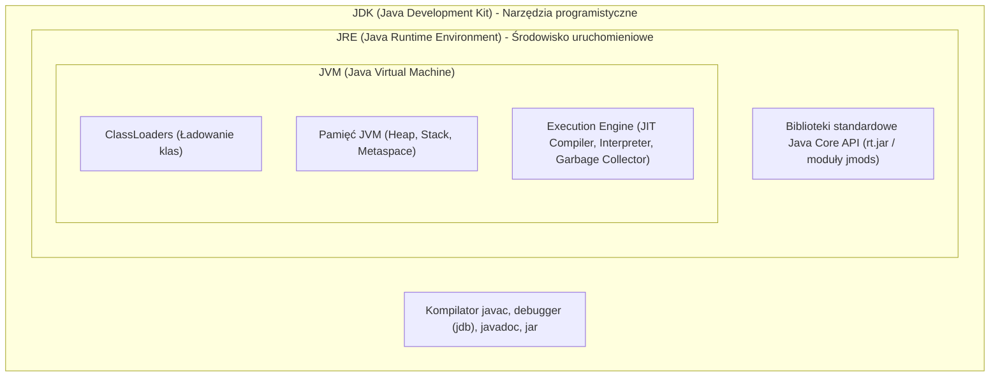
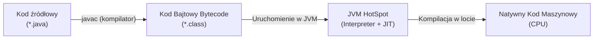
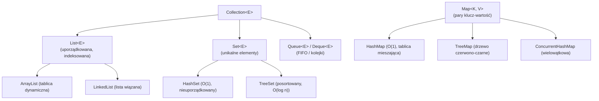

# Podstawy Programowania w Języku Java (Java 17 & 21+ LTS)

**Java** to jeden z najpopularniejszych, wieloplatformowych, obiektowych języków programowania na świecie. Zgodnie z historycznym hasłem *„Write Once, Run Anywhere”* (WORA), kod w Javie kompilowany jest do uniwersalnego kodu bajtowego (*bytecode*), który może zostać uruchomiony na dowolnym systemie operacyjnym wyposażonym w maszynę wirtualną **JVM (Java Virtual Machine)**.

Współczesna Java (od wersji 17 LTS i 21 LTS) to język wysoce ekspresyjny, nowoczesny i zoptymalizowany pod kątem chmury, oferujący rekordy, dopasowywanie wzorców (*pattern matching*), klasy zapieczętowane (*sealed classes*) oraz rewolucyjne wątki wirtualne (*Virtual Threads* – Project Loom).

---

## 1. Architektura JVM: JDK vs JRE vs JVM

Zrozumienie działania środowiska wykonawczego Javy jest kluczowe dla każdego inżyniera oprogramowania:



### Jak Powstaje i Działa Aplikacja w Javie?



1. **Plik źródłowy (`.java`)**: Czytelny dla człowieka kod programu.
2. **Kompilator `javac`**: Przekształca kod źródłowy w kod bajtowy (`.class`). Kod bajtowy jest niezależny od architektury procesora.
3. **Maszyna JVM**:
   - **Interpreter**: Szybko uruchamia kod bajtowy linijka po linijce.
   - **JIT Compiler (Just-In-Time - HotSpot C1/C2)**: Wykrywa często wykonywane fragmenty kodu (*hot spots*) i kompiluje je bezpośrednio do wysoce zoptymalizowanego kodu maszynowego.
   - **Garbage Collector (GC)**: Automatycznie odzyskuje pamięć ze sterty (np. G1GC, ZGC).

---

## 2. Struktura Programu w Javie

W Javie niemal każdy fragment kodu musi należeć do klasy. Nazwa pliku musi dokładnie odpowiadać nazwie klasy publicznej (`Main.java` -> `public class Main`).

### Tradycyjna metoda `main`

```java
package com.example.app;

public class Main {
    // Punkt wejścia aplikacji
    public static void main(String[] args) {
        System.out.println("Witaj w świecie nowoczesnej Javy!");
        
        if (args.length > 0) {
            System.out.println("Pierwszy argument: " + args[0]);
        }
    }
}
```

> [!NOTE]
> W najnowszych wersjach Javy (Java 21/22+ w ramach Preview Features) wprowadzono uproszczoną deklarację dla początkujących (*Unnamed Classes & Instance Main Methods*), pozwalającą napisać po prostu:
> `void main() { println("Cześć!"); }` bez boilerplate'u klasowego.

---

## 3. Typy Danych i Pamięć

W Javie istnieje ścisły podział na **typy pierwotne (prymitywne)** oraz **typy referencyjne (obiektowe)**.

### Typy Prymitywne (Value Types)

Typy prymitywne przechowują bezpośrednią wartość w pamięci (zwykle na stosie wątku):

| Typ | Rozmiar | Wartość domyślna | Zakres | Zastosowanie |
| :--- | :--- | :--- | :--- | :--- |
| `byte` | 8 bitów | `0` | -128 do 127 | Przetwarzanie strumieni binarzy |
| `short` | 16 bitów | `0` | -32 768 do 32 767 | Rzadko stosowany (oszczędność pamięci) |
| `int` | 32 bity | `0` | -2.14 mld do 2.14 mld | **Domyślny typ liczb całkowitych** |
| `long` | 64 bity | `0L` | $-9 \cdot 10^{18}$ do $9 \cdot 10^{18}$ | Duże identyfikatory bazodanowe, liczniki (sufiks `L`) |
| `float` | 32 bity | `0.0f` | ~7 cyfr precyzji | Grafika, gry (sufiks `f`) |
| `double` | 64 bity | `0.0d` | ~15-17 cyfr precyzji | **Domyślny typ zmiennoprzecinkowy** |
| `boolean` | 1 bit (logiczny) | `false` | `true` lub `false` | Flagi logiczne |
| `char` | 16 bitów (Unicode) | `'\u0000'` | 0 do 65 535 | Pojedynczy znak (`'A'`, `'ż'`) |

### Typy Referencyjne i Klasy Opakowujące (Wrappers)

Każdy typ prymitywny posiada odpowiadającą mu klasę obiektową:
- `int` $\rightarrow$ `Integer`
- `double` $\rightarrow$ `Double`
- `boolean` $\rightarrow$ `Boolean`
- `char` $\rightarrow$ `Character`

```java
// Autoboxing (automatyczne pakowanie prymitywu do obiektu)
Integer liczbaObiektowa = 42; 

// Unboxing (automatyczne rozpakowanie obiektu do prymitywu)
int liczbaPrymitywna = liczbaObiektowa; 
```

> [!WARNING]
> **Pieniądze i finanse:** Podobnie jak w C#, **nigdy nie używaj `double` ani `float` do kalkulacji finansowych** z uwagi na błędy zaokrągleń binarnych IEEE 754. Zawsze stosuj klasę `java.math.BigDecimal`!

---

## 4. Niejawne Wnioskowanie Typów (`var`)

Od Javy 10 słowo kluczowe `var` pozwala na lokalne wnioskowanie typów przez kompilator. Java pozostaje w 100% językiem statycznie typowanym!

```java
// Zamiast pisać:
Map<String, List<String>> mapaTradycyjna = new HashMap<String, List<String>>();

// W nowoczesnej Javie piszemy:
var mapa = new HashMap<String, List<String>>(); // Kompilator dokładnie zna typ
var powitanie = "Dzień dobry";                  // Kompilator wie, że to String
// powitanie = 123;                             // BŁĄD KOMPILACJI!
```

---

## 5. Praca z Tekstem: `String`, `StringBuilder` i Text Blocks

### Niemutowalność `String` i Pula Stringów (String Pool)

Obiekty `String` w Javie są **niemutowalne** (*immutable*). Zmiana wartości tworzy nowy obiekt w pamięci sterty w obszarze zwanym **String Pool**.

```java
String s1 = "Java";
String s2 = "Java";
String s3 = new String("Java");

System.out.println(s1 == s2);      // true (ten sam adres w String Pool)
System.out.println(s1 == s3);      // false (s3 wymusza nowy obiekt poza pulą)
System.out.println(s1.equals(s3)); // true (ZAWSZE porównuj tekst metodą .equals()!)
```

### Wieloliniowe Bloki Tekstu (Text Blocks - Java 15+)

Trzy cudzysłowy (`"""`) pozwalają na czytelny zapis JSON-a, SQL-a czy HTML-a bez konieczności uciekania znaków nowej linii:

```java
String jsonPayload = """
    {
        "id": 101,
        "name": "Kamil",
        "role": "Software Architect",
        "active": true
    }
    """;
```

### `StringBuilder` do Intensywnej Konkatenacji

```java
var sb = new StringBuilder();
for (int i = 0; i < 1000; i++) {
    sb.append("Liczba: ").append(i).append("\n");
}
String wynik = sb.toString();
```

---

## 6. Instrukcje Sterujące i Nowoczesny `switch`

### Tradycyjny `switch` vs Nowoczesne Wyrażenie `switch` (Java 14+)

Nowoczesny `switch` w Javie może działać jako wyrażenie zwracające wartość, eliminuje potrzebę stosowania instrukcji `break` i zapobiega błędom *fall-through*:

```java
enum StatusZamowienia { NOWE, W_TRAKCIE, WYSLANE, ANULOWANE }

StatusZamowienia status = StatusZamowienia.WYSLANE;

// Switch jako wyrażenie (Switch Expression ze strzałkami ->)
String komunikat = switch (status) {
    case NOWE -> "Oczekuje na płatność";
    case W_TRAKCIE -> "Paczka jest pakowana w magazynie";
    case WYSLANE -> "Paczka w drodze do paczkomatu";
    case ANULOWANE -> "Zamówienie zostało anulowane";
};
```

### Pattern Matching dla `switch` (Java 21 LTS)

Java 21 pozwala na sprawdzanie typów i warunków bezpośrednio w gałęziach `switch`:

```java
public static String opisObiektu(Object obj) {
    return switch (obj) {
        case Integer i -> "Liczba całkowita o wartości: " + i;
        case String s when s.length() > 10 -> "Długi tekst: " + s;
        case String s -> "Krótki tekst: " + s;
        case null -> "Pusta referencja (null)!";
        default -> "Nieznany obiekt typu: " + obj.getClass().getSimpleName();
    };
}
```

---

## 7. Kolekcje w Javie (`Java Collections Framework`)

Hierarchia kolekcji w Javie opiera się na interfejsach z pakietu `java.util`:



### Niemutowalne Fabryki Kolekcji (`List.of`, `Set.of`, `Map.of`)

Wprowadzone w Javie 9 metody fabryczne tworzą bezpieczne, niemodyfikowalne kolekcje:

```java
List<String> technologie = List.of("Java", "Spring Boot", "Docker", "PostgreSQL");
// technologie.add("Kubernetes"); // Rzuca UnsupportedOperationException!

Map<String, Integer> oceny = Map.of(
    "Algorytmy", 5,
    "Bazy Danych", 4
);
```

### Nowość w Java 21: Sequenced Collections

Przez lata brakowało wspólnego interfejsu dla kolekcji z określonym porządkiem napotkania. Java 21 wprowadziła interfejsy `SequencedCollection`, `SequencedSet` i `SequencedMap`:

```java
var lista = new ArrayList<>(List.of("A", "B", "C"));

// Nowe metody w Java 21:
String pierwszy = lista.getFirst(); // "A"
String ostatni = lista.getLast();   // "C"
lista.addFirst("START");
List<String> odwrocona = lista.reversed(); // widok odwróconej kolekcji
```

---

## 8. Metody i Przekazywanie Parametrów w Javie

> [!IMPORTANT]
> **Kluczowa zasada:** **Java jest ZAWSZE, BEZ WYJĄTKU „Pass-by-Value” (przekazywanie przez kopię wartości)!**  
> Gdy przekazujesz typ prymitywny (`int`), kopiowana jest liczba.  
> Gdy przekazujesz obiekt (`Osoba`), **kopiowana jest wartość referencji (adresu)** wskazującej na ten obiekt na stercie!

```java
public class TestPassByValue {
    public static void zmienWiek(Osoba o) {
        o.setWiek(30); // Modyfikujemy stan obiektu na stercie - ZMIANA WIDOCZNA
        o = new Osoba("Inna", 99); // Nadpisujemy lokalną kopię referencji - BRAK WPŁYWU NA ZEWNĄTRZ
    }
}
```

---

## 9. Programowanie Obiektowe (OOP w Javie)

### Klasa, Konstruktory i Enkapsulacja

```java
public class Samochod {
    // Pola prywatne (hermetyzacja stanu)
    private final String vin;
    private String marka;
    private int przebieg;

    // Konstruktor
    public Samochod(String vin, String marka) {
        this.vin = Objects.requireNonNull(vin, "VIN nie może być puste");
        this.marka = marka;
        this.przebieg = 0;
    }

    // Gettery i Settery z logiką walidacji
    public String getVin() { return vin; }
    public String getMarka() { return marka; }
    public int getPrzebieg() { return przebieg; }

    public void zwiekszPrzebieg(int kilometry) {
        if (kilometry <= 0) {
            throw new IllegalArgumentException("Dystans musi być dodatni.");
        }
        this.przebieg += kilometry;
    }
}
```

### Dziedziczenie i Polimorfizm

```java
// Interfejs definiujący kontrakt
public interface Platnosc {
    void zrealizuj(BigDecimal kwota);
    
    // Metoda domyślna w interfejsie (Java 8+)
    default void drukujPotwierdzenie() {
        System.out.println("Drukowanie standardowego potwierdzenia...");
    }
}

// Implementacja 1: Karta
public class PlatnoscKarta implements Platnosc {
    @Override
    public void zrealizuj(BigDecimal kwota) {
        System.out.println("Obciążenie karty na kwotę: " + kwota + " PLN");
    }
}

// Implementacja 2: BLIK
public class PlatnoscBlik implements Platnosc {
    private final String kodBlik;

    public PlatnoscBlik(String kodBlik) {
        this.kodBlik = kodBlik;
    }

    @Override
    public void zrealizuj(BigDecimal kwota) {
        System.out.println("Realizacja transakcji BLIK [" + kodBlik + "] na: " + kwota + " PLN");
    }
}
```

---

## 10. Nowoczesne Konstrukcje: Rekordy i Klasy Zapieczętowane

### Rekordy (`record` – Java 16+)

Rekord to zwięzły sposób deklarowania niemutowalnych nośników danych (*Data Transfer Objects*). Kompilator automatycznie generuje pola `private final`, konstruktor kanoniczny, gettery, metody `equals()`, `hashCode()` oraz `toString()`!

```java
// Zamiast 60 linijek kodu w tradycyjnej klasie:
public record UzytkownikDto(Long id, String login, String email) {
    // Kompaktowy konstruktor (Compact Constructor) do walidacji danych
    public UzytkownikDto {
        if (login == null || login.isBlank()) {
            throw new IllegalArgumentException("Login nie może być pusty!");
        }
    }
}

// Użycie:
var u1 = new UzytkownikDto(1L, "admin", "admin@firma.pl");
var u2 = new UzytkownikDto(1L, "admin", "admin@firma.pl");

System.out.println(u1.login()); // "admin" (uwaga: w rekordach gettery nie mają przedrostka 'get')
System.out.println(u1.equals(u2)); // true! Rekordy porównują wartości pól
```

### Klasy Zapieczętowane (`sealed classes` – Java 17 LTS)

Pozwalają autorowi klasy dokładnie określić, które inne klasy mają prawo po niej dziedziczyć:

```java
// Klasa bazowa pozwala na dziedziczenie TYLKO wybranym klasom
public sealed interface WynikOperacji permits Sukces, Blad {}

public final record Sukces(String dane) implements WynikOperacji {}
public final record Blad(String komunikat, int kodBledu) implements WynikOperacji {}

// Dzięki sealed classes kompilator wie w 'switch', że wyczerpaliśmy wszystkie możliwości:
public static void obsluz(WynikOperacji wynik) {
    switch (wynik) {
        case Sukces s -> System.out.println("Otrzymano dane: " + s.dane());
        case Blad b -> System.err.println("Błąd " + b.kodBledu() + ": " + b.komunikat());
        // Brak potrzeby klauzuli 'default' - kompilator sprawdza kompletność hierarchii!
    }
}
```

---

## 11. Obsługa Błędów: Wyjątki i `try-with-resources`

Java dzieli wyjątki na:
1. **Checked Exceptions** (sprawdzane w czasie kompilacji, dziedziczące po `Exception` z wyłączeniem `RuntimeException` – np. `IOException`, `SQLException`).
2. **Unchecked Exceptions** (błędy logiczne w trakcie działania, dziedziczące po `RuntimeException` – np. `NullPointerException`, `IllegalArgumentException`).
3. **Błędy krytyczne (`Error`)** – problemy maszyny wirtualnej (np. `OutOfMemoryError`, `StackOverflowError`).

```java
// Nowoczesna składnia try-with-resources z automatycznym zamykaniem zasobów (AutoCloseable)
try (var reader = new BufferedReader(new FileReader("dane.txt"))) {
    String linia;
    while ((linia = reader.readLine()) != null) {
        System.out.println(linia);
    }
} catch (FileNotFoundException e) {
    System.err.println("Nie odnaleziono pliku: " + e.getMessage());
} catch (IOException e) {
    System.err.println("Błąd wejścia/wyjścia: " + e.getMessage());
}
```

---

## 12. Programowanie Funkcyjne i Stream API

Od Javy 8 programiści mogą przetwarzać kolekcje w stylu deklaratywnym za pomocą strumieni (`Stream`):

```java
public record Produkt(String nazwa, String kategoria, BigDecimal cena, boolean dostepny) {}

List<Produkt> produkty = List.of(
    new Produkt("Laptop Dell", "Elektronika", new BigDecimal("4500.00"), true),
    new Produkt("Klawiatura", "Elektronika", new BigDecimal("350.00"), true),
    new Produkt("Kawa Ziarnista", "Spożywcze", new BigDecimal("85.00"), false),
    new Produkt("Monitor 4K", "Elektronika", new BigDecimal("1800.00"), true)
);

// Potok przetwarzania Stream API:
List<String> nazwyDrogiejElektroniki = produkty.stream()
    .filter(Produkt::dostepny)                                              // 1. Tylko dostępne
    .filter(p -> p.kategoria().equals("Elektronika"))                       // 2. Tylko kategoria Elektronika
    .filter(p -> p.cena().compareTo(new BigDecimal("1000.00")) > 0)         // 3. Cena > 1000 PLN
    .sorted(Comparator.comparing(Produkt::cena).reversed())                 // 4. Sortowanie malejąco po cenie
    .map(Produkt::nazwa)                                                    // 5. Transformacja do samej nazwy
    .toList();                                                              // 6. Zebranie do niemutowalnej listy (Java 16+)

// Wynik: ["Laptop Dell", "Monitor 4K"]
```

---

## 13. Przełom w Java 21: Wątki Wirtualne (Project Loom)

Tradycyjne wątki Javy (*Platform Threads*) były bezpośrednio mapowane 1:1 na kosztowne wątki systemu operacyjnego (1 wątek $\approx$ 1 MB pamięci RAM stosu). Ograniczało to współbieżność do kilku tysięcy wątków na serwer.

**Wątki Wirtualne (Virtual Threads)** w Javie 21 to ultralekkie wątki zarządzane bezpośrednio przez JVM (zajmują zaledwie kilkaset bajtów). Możesz bez przeszkód utworzyć **milion wątków jednocześnie**!

```java
// Uruchomienie zadania w wirtualnym wątku
Thread.startVirtualThread(() -> {
    System.out.println("Wątek wirtualny wykonuje operację I/O...");
});

// Wykorzystanie z ExecutorService (idealne do mikroserwisów i operacji blokujących I/O):
try (var executor = Executors.newVirtualThreadPerTaskExecutor()) {
    IntStream.range(0, 10_000).forEach(i -> {
        executor.submit(() -> {
            // Bezpieczne blokowanie - JVM odczepia wątek wirtualny od wątku OS (carrier thread)!
            Thread.sleep(Duration.ofSeconds(1));
            return i;
        });
    });
} // Automatyczny awaitTermination na końcu bloku try!
```

---

## 14. Pytania Rekrutacyjne z Podstaw Javy (FAQ Interview)

### Q1: Czym różni się operator `==` od metody `.equals()`?
> **Odpowiedź:**  
> Operator `==` porównuje tożsamość pamięciową (dla prymitywów: czy wartości są równe; dla obiektów: czy obie referencje wskazują na ten sam adres na stercie).  
> Metoda `.equals()` służy do porównywania logicznej zawartości dwóch obiektów. W klasach własnych należy nadpisać `.equals()` (oraz kontraktowo powiązaną metodę `hashCode()`), aby obiekty o takich samych polach były uznawane za równe (np. w `HashMap` lub `HashSet`).

---

### Q2: Jak działa `HashMap` pod spodem w Javie?
> **Odpowiedź:**  
> `HashMap` opiera się na tablicy kubełków (*buckets*).  
> 1. Na podstawie klucza obliczany jest jego `hashCode()`, który po operacji modulo wyznacza indeks kubełka.  
> 2. W przypadku kolizji (dwie różne wartości trafiające do tego samego kubełka), elementy zapisywane są w liście wiązanej (*LinkedList*).  
> 3. Od Javy 8, jeśli liczba elementów w jednym kubełku przekroczy próg 8 (*TREEIFY_THRESHOLD*), lista wiązana jest automatycznie przekształcana w **drzewo czerwono-czarne** (*Red-Black Tree*), co poprawia pesymistyczny czas wyszukiwania z $O(n)$ do $O(\log n)$.

---

### Q3: Jaka jest różnica między Checked a Unchecked Exception?
> **Odpowiedź:**  
> **Checked Exceptions** (np. `IOException`) dziedziczą po `Exception` i kompilator zmusza programistę do ich obsłużenia (`try-catch`) lub zadeklarowania w sygnaturze metody (`throws`). Reprezentują przewidywalne błędy zewnętrzne (np. brak pliku).  
> **Unchecked Exceptions** (dziedziczące po `RuntimeException`, np. `NullPointerException`, `IndexOutOfBoundsException`) nie wymagają deklaracji i zazwyczaj wynikają z błędów programistycznych.

---

### Q4: Czy w Javie parametry przekazywane są przez referencję?
> **Odpowiedź:**  
> **Nie. Java jest w 100% Pass-by-Value.** Gdy przekazujesz obiekt do metody, kopiowana jest wartość wskaźnika (referencji) do tego obiektu. Możesz zmodyfikować wewnętrzny stan obiektu poprzez wywołanie jego metod, ale jeśli wewnątrz metody przypiszesz do parametru nowy obiekt (`param = new Obiekt()`), nie wpłynie to w żaden sposób na referencję u wywołującego.

---

### Q5: Dlaczego `record` jest lepszy niż zwykła klasa z biblioteką Lombok?
> **Odpowiedź:**  
> `record` to natywna konstrukcja języka wspierana bezpośrednio przez kompilator i maszynę JVM. Jest w pełni niemutowalna, wspiera dekonstrukcję w *Pattern Matching* (Java 21), gwarantuje bezpieczną serializację i nie wymaga zewnętrznych bibliotek procesora adnotacji (jak Lombok), które ingerują w drzewo AST kompilatora.

---

## 15. Podsumowanie i Rekomendacje dla Developerów

Nowoczesna Java to potężne, wysoce zoptymalizowane narzędzie. Podczas tworzenia projektów pamiętaj o dobrych praktykach:
1. Preferuj **rekordy (`record`)** do obiektów DTO i transferu danych.
2. Korzystaj z **wyrażeń `switch`** oraz dopasowywania wzorców zamiast długich łańcuchów `if-else if-instanceof`.
3. Wykorzystuj **Stream API** do transformacji danych, ale nie nadużywaj go w prostych pętlach o krytycznej wydajności.
4. Korzystaj z **Java 21 Virtual Threads** w aplikacjach sieciowych z dużą liczbą operacji blokujących wejście/wyjście (I/O).
