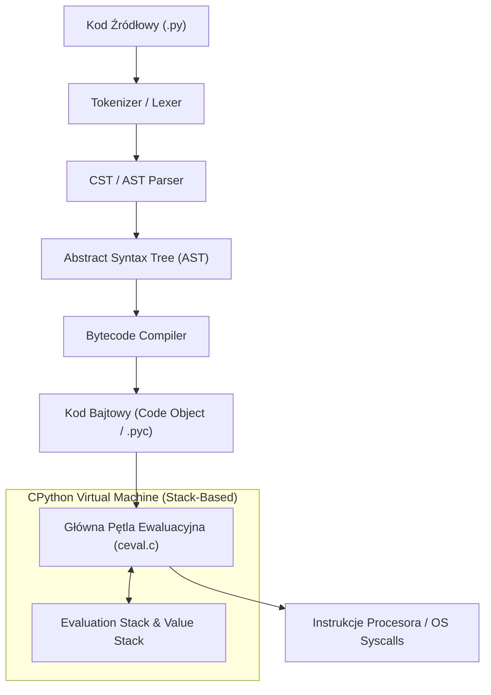
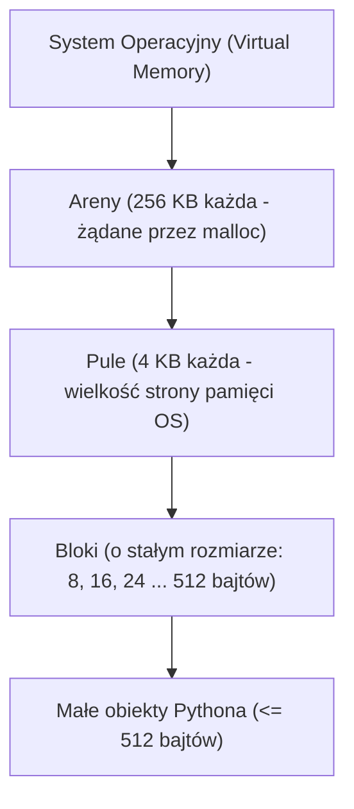

# Python: Architektura CPython, Model Obiektowy i Pytania Rekrutacyjne

Kompleksowy przewodnik inżynierski po języku **Python** (ze szczególnym uwzględnieniem referencyjnej implementacji **CPython**). Obejmuje niskopoziomowe mechanizmy wirtualnej maszyny, strukturę obiektów w pamięci C, algorytmy Garbage Collectora, Global Interpreter Lock (GIL), paradygmaty współbieżności, zaawansowane metaprogramowanie oraz zestaw pytań rekrutacyjnych i scenariuszy awaryjnych (od poziomu Mid do Principal/Architect).

---

## Spis Treści
1. [Architektura CPython i Wirtualna Maszyna (VM)](#1-architektura-cpython-i-wirtualna-maszyna-vm)
   - Od Kodu Źródłowego do Bajtkodu (Lexer, AST, Compiler, `.pyc`)
   - Pętla ewaluacyjna CPython (`ceval.c`, Stack-based Virtual Machine)
   - Analiza bajtkodu za pomocą modułu `dis`
2. [Niskopoziomowe Zarządzanie Pamięcią](#2-niskopoziomowe-zarządzanie-pamięcią)
   - Anatomia każdego obiektu: struktura `PyObject` i `PyVarObject`
   - Hierarchia alokatora: Areny (256 KB), Pule (4 KB) i Bloki (Small Object Allocator)
   - Integer i String Interning
   - Podwójny mechanizm czyszczenia pamięci: Reference Counting + Generational GC
3. [Global Interpreter Lock (GIL) i Współbieżność](#3-global-interpreter-lock-gil-i-współbieżność)
   - Czym jest GIL i dlaczego powstał?
   - CPU-bound vs I/O-bound w kontekście GIL
   - `threading` vs `multiprocessing` vs `asyncio`
   - Rewolucja PEP 703: Free-threaded Python (No-GIL Python 3.13+)
4. [Zaawansowany Model Obiektowy i Metaprogramowanie](#4-zaawansowany-model-obiektowy-i-metaprogramowanie)
   - Metody Magiczne (Dunder Methods: `__new__` vs `__init__`, `__call__`)
   - Wielodziedziczenie i algorytm linearyzacji C3 (MRO)
   - Protokół Deskryptorów (Descriptor Protocol: jak działa `@property`)
   - Metaklasy (`type` i dynamiczne tworzenie klas)
   - Optymalizacja pamięciowa z `__slots__`
5. [Funkcje, Domknięcia i Idiomy Językowe](#5-funkcje-domknięcia-i-idiomy-językowe)
   - Reguła LEGB (Local, Enclosing, Global, Built-in)
   - Domknięcia (Closures) i dekoratory z argumentami (`functools.wraps`)
   - Generatory, protokół iteratora i wyrażenia `yield from`
   - Menedżery kontekstu (`with`, protokół `__enter__` / `__exit__`)
   - Pułapka domyślnych argumentów mutowalnych (Mutable Default Arguments)
6. [Pytania Rekrutacyjne z Odpowiedziami (FAQ Interview)](#6-pytania-rekrutacyjne-z-odpowiedziami-faq-interview)
   - Pytania Podstawowe i Średniozaawansowane (Mid)
   - Pytania Zaawansowane i Architektoniczne (Senior / Principal)
   - Scenariusze Awaryjne i Live-fire Troubleshooting
7. [Tablica Szybkiej Powtórki (Cheat-Sheet)](#7-tablica-szybkiej-powtórki-cheat-sheet)

---

## 1. Architektura CPython i Wirtualna Maszyna (VM)

Python jest językiem interpretowanym w tym sensie, że kod źródłowy nie jest kompilowany bezpośrednio do binarnego kodu maszynowego procesora (jak w C++ czy Rust). Zamiast tego kod przechodzi transparentną kompilację do **bajtkodu**, który następnie jest wykonywany przez maszynę wirtualną **CPython**.



### Pętla Ewaluacyjna (`ceval.c`)
Maszyna wirtualna CPython to **maszyna oparta na stosie (Stack-based VM)**. Nie posiada wirtualnych rejestrów (jak Dalvik w Androidzie czy LuaJIT), lecz operuje na wskaźnikach wrzucanych i zdejmowanych ze stosu ewaluacyjnego bieżącej ramki (`PyFrameObject`).

### Inspekcja Bajtkodu za pomocą `dis`
Moduł `dis` pozwala podejmować decyzje optymalizacyjne na podstawie analizy wygenerowanego bajtkodu:

```python
import dis

def add_numbers(a, b):
    return a + b

dis.dis(add_numbers)
```
Wynik deasemblacji:
```text
  1           0 RESUME                   0
  2           2 LOAD_FAST                0 (a)
              4 LOAD_FAST                1 (b)
              6 BINARY_OP                0 (+)
             10 RETURN_VALUE
```
1. `LOAD_FAST 0`: Pobiera lokalną zmienną `a` z tablicy wskaźników ramki i odkłada ją na wierzchołek stosu wartości.
2. `LOAD_FAST 1`: Odkłada zmienną `b` na stos.
3. `BINARY_OP 0 (+)`: Zdejmuje dwa elementy ze stosu, wywołuje ich metodę binarną w C (`nb_add`) i odkłada wynik na stos.
4. `RETURN_VALUE`: Zdejmuje wynik ze stosu i zwraca go do wywołującej ramki.

---

## 2. Niskopoziomowe Zarządzanie Pamięcią

### Anatomia Obiektu: `PyObject`
W języku C każdy obiekt w Pythonie jest reprezentowany przez strukturę zaczynającą się od makra `PyObject_HEAD`:

```c
typedef struct _object {
    _PyObject_HEAD_EXTRA // Wskaźniki dwukierunkowej listy dla śledzenia przez GC
    Py_ssize_t ob_refcnt; // Licznik referencji (Reference Counter)
    struct _typeobject *ob_type; // Wskaźnik na obiekt typu (np. &PyLong_Type)
} PyObject;
```
* Obiekt typu `int` w Pythonie to nie jest surowy 4- lub 8-bajtowy rejestr procesora! W systemie 64-bitowym każda liczba całkowita zajmuje co najmniej **28 bajtów** (8 bajtów licznika referencji + 8 bajtów wskaźnika typu + 8 bajtów wielkości `ob_size` + 4 bajty wartości).

### Hierarchia Alokatora Pamięci w CPython
Aby uniknąć kosztownych wywołań jądra systemu (`malloc`/`free`) dla milionów małych obiektów, Python implementuje trójstopniowy alokator (**PyMalloc / Small Object Allocator** dla obiektów $\le 512$ bajtów):



* **Integer Interning:** CPython prealokuje w pamięci globalnej liczby całkowite z zakresu od **-5 do 256**. Oznacza to, że `a = 100` oraz `b = 100` wskazują na **ten sam adres w pamięci** (`a is b` zwraca `True`).
* **String Interning:** Wszystkie stałe literały znakowe przypominające identyfikatory kodu (bez spacji, składające się ze znaków alfanumerycznych) są automatycznie haszowane i współdzielone w pamięci.

---

### Podwójny Mechanizm Czyszczenia Pamięci (GC)

```mermaid
flowchart TD
    subgraph RefCounting["1. Reference Counting (Zawsze Aktywny, Deterministyczny)"]
        Create["Utworzenie referencji\n(ob_refcnt++)"]
        DelRef["Usunięcie referencji / wyjście ze scope\n(ob_refcnt--)"]
        CheckZero{"Czy ob_refcnt == 0?"}
        Free["NATYCHMIASTOWE ZWOLNIENIE PAMIĘCI\n(deallocator wywołany natychmiast)"]
        
        Create --> DelRef --> CheckZero
        CheckZero -->|TAK| Free
    end

    subgraph CyclicGC["2. Cyclic Garbage Collector (Uruchamiany Cyklicznie w Tle)"]
        CheckZero -->|NIE (Możliwy cykl referencji!)| Tracking["Śledzenie obiektów kontenerowych w GC"]
        Tracking --> Gen0["Generation 0 (Nowe obiekty)"]
        Gen0 -->|Przetrwał czyszczenie| Gen1["Generation 1"]
        Gen1 -->|Przetrwał czyszczenie| Gen2["Generation 2 (Długo żyjące)"]
        Gen2 --> FindCycles["Wyszukiwanie izolowanych wysp cyklicznych referencji"]
        FindCycles --> Reclaim["Zwolnienie pamięci z cykli"]
    end
```

1. **Reference Counting (Licznik referencji — I linia obrony):**
   - Każde przypisanie, przekazanie do funkcji czy dodanie do listy zwiększa `ob_refcnt`.
   - Zmniejszenie licznika do zera powoduje **natychmiastowe zniszczenie obiektu** i odzyskanie pamięci.
   - *Wada:* Nie radzi sobie z **cyklami referencyjnymi** (np. obiekt A wskazuje na B, a B wskazuje na A. Ich liczniki wynoszą 1, ale są nieosiągalne z korzenia aplikacji).
2. **Generational Garbage Collector (Generacyjny GC — II linia obrony):**
   - Śledzi wyłącznie obiekty kontenerowe (listy, słowniki, krotki, instancje klas).
   - Działa w 3 pokoleniach (Generations 0, 1, 2) w oparciu o hipotezę słabej generacyjności: *Większość obiektów umiera młodo*.
   - Okresowo przeszukuje dwukierunkowe listy obiektów, odejmuje referencje wewnętrzne i usuwa "wyspy" izolowanych obiektów o zerowej liczbie referencji zewnętrznych.

---

## 3. Global Interpreter Lock (GIL) i Współbieżność

### Czym jest GIL?
**Global Interpreter Lock** to muteks (blokada wzajemnego wykluczania) używany przez CPython w celu synchronizacji dostępu do struktur wewnętrznych maszyny wirtualnej.
* **Powód istnienia:** Ponieważ CPython używa Reference Countingu na poziomie jądra, brak blokady spowodowałby wyścigi wątków (*race conditions*) przy inkrementacji/dekrementacji liczników referencji, prowadząc do uszkodzenia pamięci.
* **Konsekwencja:** W ramach **jednego procesu CPython tylko jeden wątek systemowy może w danej chwili wykonywać bajtkod Pythona**, niezależnie od liczby fizycznych rdzeni procesora.

```mermaid
flowchart TD
    subgraph MultiThreading["Python Threading (1 Proces, Wiele Wątków)"]
        T1["Wątek 1"] -->|Trzyma GIL (Wykonuje kod)| GIL["GIL (Mutex)"]
        T2["Wątek 2"] -.->|Czeka na zwolnienie GIL| GIL
        T3["Wątek 3"] -.->|Czeka na zwolnienie GIL| GIL
        GIL --> SingleCore["Wykorzystanie MAKSYMALNIE 1 Rdzenia CPU!"]
    end

    subgraph MultiProcessing["Python Multiprocessing (Wiele Procesów)"]
        P1["Proces 1 (Własny GIL)"] --> Core1["Rdzeń CPU 1"]
        P2["Proces 2 (Własny GIL)"] --> Core2["Rdzeń CPU 2"]
        P3["Proces 3 (Własny GIL)"] --> Core3["Rdzeń CPU 3"]
    end
```

### Wybór Modelu Współbieżności
| Model | Kiedy stosować? | Wady / Ograniczenia |
| :--- | :--- | :--- |
| **`threading`** | Zadania **I/O-bound** (zapytania HTTP, odczyt z bazy danych, operacje dyskowe). Operacje I/O zwalniają GIL na poziomie C. | Bezskuteczny dla obliczeń matematycznych/CPU (działa wolniej niż 1 wątek z powodu narzutu na przełączanie kontekstu). |
| **`multiprocessing`** | Zadania **CPU-bound** (przetwarzanie obrazów, uczenie maszynowe, kryptografia). Pełne wykorzystanie wszystkich rdzeni. | Duży narzut pamięciowy (osobna pamięć każdego procesu), kosztowna komunikacja IPC (serializacja obiektów przez `pickle`). |
| **`asyncio`** | Wielka liczba równoległych połączeń sieciowych I/O (WebSockets, microservices, boty). | Kooperatywna wielozadaniowość w jednym wątku. Jeśli którakolwiek funkcja zablokuje proces synchronicznym kodem CPU, cała aplikacja zamiera. |

---

## 4. Zaawansowany Model Obiektowy i Metaprogramowanie

### `__new__` vs `__init__`
* **`__new__(cls, *args, **kwargs)`:** Prawdziwy **konstruktor**. Jest metodą statyczną, która alokuje pamięć i fizycznie tworzy nową instancję obiektu w C. Musi zwrócić nowo utworzoną instancję.
* **`__init__(self, *args, **kwargs)`:** **Inicjalizator**. Otrzymuje już utworzoną instancję (`self`) i przypisuje jej wartości początkowe.

```python
class Singleton:
    _instance = None

    def __new__(cls, *args, **kwargs):
        if cls._instance is None:
            # Fizyczna alokacja nowej instancji klasy bazowej object
            cls._instance = super().__new__(cls)
        return cls._instance
```

---

### Wielodziedziczenie i Algorytm C3 Linearization (MRO)
Gdy klasa dziedziczy z wielu klas bazowych, Python ustala kolejność przeszukiwania metod (**MRO — Method Resolution Order**) za pomocą matematycznego algorytmu **C3 Linearization**.

Gwarantuje on:
1. Spójność hierarchii (klasa pochodna jest zawsze sprawdzana przed swoją klasą bazową).
2. Zachowanie kolejności zdefiniowanej w deklaracji `class Child(Base1, Base2)`.
3. Zawsze korzystaj z **`super()`** zamiast bezpośrednich wywołań `BaseClass.method(self)` — `super()` wywołuje następną klasę w łańcuchu MRO, a niekoniecznie bezpośredniego rodzica!

---

### Protokół Deskryptorów (Descriptor Protocol)
Deskryptor to dowolny obiekt implementujący co najmniej jedną z metod: `__get__`, `__set__` lub `__delete__`.
Stanowi on fundament działania dekoratorów `@property`, `@classmethod`, `@staticmethod` oraz mapowania pól w systemach ORM (np. Django, SQLAlchemy):

```python
class NonNegativeNumber:
    def __set_name__(self, owner, name):
        self.public_name = name
        self.private_name = f"_{name}"

    def __get__(self, obj, objtype=None):
        if obj is None:
            return self
        return getattr(obj, self.private_name, 0)

    def __set__(self, obj, value):
        if value < 0:
            raise ValueError(f"{self.public_name} nie może być ujemne!")
        setattr(obj, self.private_name, value)

class Product:
    price = NonNegativeNumber()
    stock = NonNegativeNumber()

    def __init__(self, price, stock):
        self.price = price
        self.stock = stock
```

---

### Optymalizacja Pamięciowa za pomocą `__slots__`
Domyślnie każda instancja klasy w Pythonie przechowuje swoje atrybuty w dynamicznym słowniku `self.__dict__`. Słownik w Pythonie zużywa znaczną ilość pamięci na haszmapę.
* Definiując **`__slots__`**, informujemy CPython, aby zrezygnował z `__dict__` i zarezerwował stałą tablicę wskaźników bezpośrednio w strukturze obiektu w C:

```python
class StandardUser:
    def __init__(self, id, name):
        self.id = id
        self.name = name

class SlottedUser:
    __slots__ = ('id', 'name')
    def __init__(self, id, name):
        self.id = id
        self.name = name
```
* **Efekt:** Zużycie pamięci dla 1 miliona obiektów spada o **ponad 60-70%**, a operacje odczytu i zapisu atrybutów przyspieszają o około 20%.

---

## 5. Funkcje, Domknięcia i Idiomy Językowe

### Reguła LEGB i Modyfikatory Zasięgu
Python rozwiązuje nazwy zmiennych przeszukując 4 poziomy zasięgu w ścisłej kolejności:
1. **L (Local):** Wewnątrz bieżącej funkcji.
2. **E (Enclosing):** W funkcjach nadrzędnych (domknięcia leksykalne).
3. **G (Global):** Na poziomie bieżącego modułu/pliku.
4. **B (Built-in):** Wbudowane funkcje interpretera (`len`, `range`, `Exception`).

* Użyj **`global x`**, aby przypisać nową wartość do zmiennej modułowej.
* Użyj **`nonlocal x`**, aby zmodyfikować zmienną w otaczającym domknięciu bez tworzenia zmiennej globalnej.

---

### Domknięcia (Closures) i Dekoratory z Argumentami
Dekorator to funkcja wyższego rzędu, która przyjmuje funkcję jako argument i zwraca nową funkcję opakowującą (*wrapper*).

```python
from functools import wraps
import time

def retry(max_attempts=3, delay_seconds=1.0):
    """Dekorator z parametrami konfiguracyjnymi."""
    def decorator(func):
        # wraps zachowuje oryginalną nazwę __name__, docstring i sygnaturę
        @wraps(func)
        def wrapper(*args, **kwargs):
            attempts = 0
            while attempts < max_attempts:
                try:
                    return func(*args, **kwargs)
                except Exception as e:
                    attempts += 1
                    if attempts >= max_attempts:
                        raise e
                    time.sleep(delay_seconds)
        return wrapper
    return decorator

@retry(max_attempts=5, delay_seconds=0.5)
def call_external_api():
    # Kod podatny na błędy sieciowe
    pass
```

---

### Pułapka Domyślnych Argumentów Mutowalnych
```python
# ❌ ANTYWZORZEC:
def append_item(item, target_list=[]):
    target_list.append(item)
    return target_list

print(append_item(1)) # [1]
print(append_item(2)) # [1, 2] -> Ta sama lista jest współdzielona!
```
* **Dlaczego tak się dzieje?** W Pythonie definicje domyślnych argumentów są ewaluowane **dokładnie raz** — w momencie parsowania i kompilacji definicji funkcji (`def`), a nie przy każdym jej wywołaniu. Obiekt listy staje się częścią atrybutu funkcji `append_item.__defaults__`.
* **Prawidłowe rozwiązanie (Idiom `None`):**
  ```python
  def append_item(item, target_list=None):
      if target_list is None:
          target_list = []
      target_list.append(item)
      return target_list
  ```

---

## 6. Pytania Rekrutacyjne z Odpowiedziami (FAQ Interview)

### Pytania Podstawowe i Średniozaawansowane (Mid)

#### P1: Czym różni się operator `==` od operatora `is`?
**Odpowiedź:**
* **`==` (Równość wartości):** Porównuje zawartość logiczną obiektów, wywołując pod spodem metodę magiczną `__eq__()`. Na przykład dwie różne listy `[1, 2]` oraz `[1, 2]` zwrócą `True`.
* **`is` (Tożsamość pamięciowa):** Sprawdza, czy dwie zmienne wskazują na **dokładnie ten sam adres w pamięci operacyjnej** (odpowiednik porównania wskaźników w C: `id(a) == id(b)`).
* Zawsze używaj `is` do porównań z obiektami typu `None` (np. `if x is None:`), ponieważ `None` jest gwarantowanym singletonem w interpreterze.

---

#### P2: Wyjaśnij różnicę między płytkim kopiowaniem (`copy.copy`) a głębokim (`copy.deepcopy`).
**Odpowiedź:**
* **Shallow Copy (`copy()`):** Tworzy nową kolekcję nadrzędną, ale nie kopiuje obiektów zagnieżdżonych — wstawia do nowej kolekcji referencje do tych samych obiektów podrzędnych. Modyfikacja obiektu zagnieżdżonego w kopii wpłynie na oryginał.
* **Deep Copy (`deepcopy()`):** Rekurencyjnie tworzy nowe kopie zarówno kolekcji nadrzędnej, jak i wszystkich obiektów, list i słowników w niej zagnieżdżonych. Utrzymuje również wewnętrzną mapę referencji, radząc sobie ze strukturami cyklicznymi.

---

#### P3: Czym różni się generator od standardowej listy i dlaczego generatory są bardziej wydajne pamięciowo?
**Odpowiedź:**
* Lista przechowuje wszystkie swoje elementy w pamięci RAM jednocześnie w postaci tablicy wskaźników.
* Generator oblicza elementy na żądanie (**Lazy Evaluation**), używając słowa kluczowego `yield`. Zamiast zwracać całą kolekcję, funkcja generatora zamraża swój stan wykonania (wartości zmiennych lokalnych, pozycję wskaźnika instrukcji) i oddaje kontrolę do pętli wywołującej.
* Generator zużywa stałą, minimalną ilość pamięci $O(1)$ niezależnie od tego, czy przetwarza 10 elementów, czy 10 miliardów rekordów.

---

### Pytania Zaawansowane i Architektoniczne (Senior / Principal)

#### P4: Jak działa Global Interpreter Lock (GIL) w CPythonie i dlaczego w programach wielowątkowych typu CPU-bound wydajność może drastycznie spaść w porównaniu z jednowątkowym kodem?
**Odpowiedź:**
1. GIL wymusza, aby w danym momencie tylko jeden wątek systemowy wykonywał bajtkod Pythona.
2. Gdy uruchomimy wiele wątków wykonujących obliczenia matematyczne (CPU-bound) na procesorze wielordzeniowym, system operacyjny przydziela je do różnych fizycznych rdzeni.
3. Wątki te nie mogą jednak pracować równolegle — natychmiast uderzają w GIL. Rozpoczyna się brutalna walka o zamek (*lock contention*), wywołująca tysiące niepotrzebnych przełączeń kontekstu jądra (Context Switches) oraz unieważnianie pamięci podręcznej procesora (CPU Cache Invalidation / Thrashing).
4. Narzut na ciągłe próby przejęcia zamka sprawia, że program wykonuje się wolniej, niż gdyby te same obliczenia zrealizować w pojedynczym wątku.
5. **Rozwiązanie:** Użycie modułu `multiprocessing`, bibliotek numerycznych zwalniających GIL w C/Fortranie (NumPy, Polars) lub kompilatorów JIT/AOT (Cython, Numba).

---

#### P5: W jaki sposób CPython radzi sobie z cyklicznymi referencjami, których nie jest w stanie usunąć Reference Counting?
**Odpowiedź:**
Reference Counting nie może usunąć obiektów, które wskazują na siebie nawzajem, ponieważ ich licznik referencji nigdy nie spadnie do zera.
Wtedy interweniuje **Generational Garbage Collector**:
1. Cykliczny GC ignoruje obiekty atomowe (np. `int`, `str`), monitorując wyłącznie obiekty mogące zawierać referencje do innych (`dict`, `list`, obiekty klas).
2. Tworzy kopię roboczą licznika referencji dla każdego śledzonego obiektu (`gc_refs`).
3. Przechodzi po wszystkich wskaźnikach i dla każdej referencji wychodzącej dekrementuje `gc_refs` celu.
4. Jeśli po zakończeniu analizy `gc_refs` jakiejś grupy obiektów spadnie do zera, oznacza to, że były one podtrzymywane przy życiu **wyłącznie przez referencje wewnętrzne** wewnątrz cyklu.
5. Obiekty z takiej odizolowanej wyspy są usuwane, a ich pamięć zostaje zwrócona do systemu.

---

#### P6: Wyjaśnij działanie algorytmu C3 Linearization w wielodziedziczeniu Pythona. Co oznacza błąd `TypeError: Cannot create a consistent method resolution order (MRO)`?
**Odpowiedź:**
Algorytm C3 rozwiązuje graf dziedziczenia do jednowymiarowej sekwencji klas (MRO):
* Łączy kolejno listę MRO bezpośrednich rodziców oraz listę samych rodziców.
* W każdej iteracji wybiera klasę, która znajduje się na początku jednej z list (*head*), pod warunkiem, że nie występuje w części ogonowej (*tail*) żadnej innej scalanej listy.
* **Kiedy występuje błąd?** Jeśli relacje dziedziczenia są wzajemnie sprzeczne (np. klasa $X$ wymaga, aby klasa $A$ była sprawdzana przed $B$, podczas gdy inna gałąź wymaga, aby $B$ była przed $A$). Python rzuca wtedy błąd MRO w momencie definicji klasy, uniemożliwiając utworzenie niejednoznacznej struktury dziedziczenia.

---

### Scenariusze Awaryjne i Live-fire Troubleshooting

#### Scenariusz 1: Serwer asynchroniczny (FastAPI / aiohttp) pod dużym obciążeniem nagle przestaje odpowiadać na zapytania HTTP i generuje timeouty, mimo że użycie CPU wynosi zaledwie 12% (1 rdzeń z 8).
**Diagnoza i Plan Naprawczy:**
1. **Identyfikacja przyczyny:** Ponieważ `asyncio` działa w pojedynczym wątku na jednym rdzeniu, któryś z endpointów wywołał operację **blokującą synchronicznie** (np. synchroniczny `requests.get()`, `time.sleep()`, ciężkie parsowanie JSON o wielkości 50 MB, lub operację kryptograficzną).
2. **Efekt:** Wątek pętli zdarzeń (*Event Loop*) został zablokowany, przez co żadne inne zapytania asynchroniczne nie mogły zostać obsłużone.
3. **Kroki naprawcze:**
   - Zastąpienie bibliotek synchronicznych odpowiednikami asynchronicznymi (np. `httpx.AsyncClient` zamiast `requests`).
   - Jeśli ciężkiej operacji synchronicznej nie da się uniknąć — oddelegowanie jej do dedykowanej puli wątków za pomocą:
     ```python
     await asyncio.to_thread(heavy_sync_function, arg)
     ```
   - Użycie narzędzia `asyncio` debug mode (`asyncio.run(main(), debug=True)`), które automatycznie loguje ostrzeżenia o operacjach blokujących pętlę dłużej niż 100 ms.

---

#### Scenariusz 2: Długo działający proces przetwarzania danych w tle w Pythonie stale zwiększa zużycie pamięci RAM, aż zostaje zabity przez systemowy OOM Killer.
**Diagnoza i Rozwiązanie:**
1. **Diagnoza wycieku:**
   - Wykorzystanie modułu `tracemalloc` do zrzutu alokacji pamięci w czasie:
     ```python
     import tracemalloc
     tracemalloc.start()
     # ... kod ...
     snapshot = tracemalloc.take_snapshot()
     for stat in snapshot.statistics('lineno')[:10]:
         print(stat)
     ```
   - Inspekcja obiektów z modułem `objgraph`: wyrysowanie referencji blokujących usunięcie obiektów (`objgraph.show_backrefs()`).
2. **Typowe przyczyny w Pythonie:**
   - Globalne słowniki lub listy używane jako cache bez strategii wygaszania (brak TTL / LRU). Rozwiązanie: `functools.lru_cache(maxsize=1024)`.
   - Niezamknięte obiekty generatorów lub sesji trzymające ramki stosu z lokalnymi zmiennymi.
   - Odwoływanie się do obiektów w blokach `except Exception as e:` — przypisanie wyjątku do zmiennej lokalnej tworzy cykl referencyjny z ramką stosu `traceback`.

---

## 7. Tablica Szybkiej Powtórki (Cheat-Sheet)

| Zagadnienie | Słowa Kluczowe i Niskopoziomowe Koncepcje |
| :--- | :--- |
| **Architektura CPython** | Stack-based VM, `.pyc` Bytecode, `ceval.c`, moduł `dis`, `PyFrameObject` |
| **Zarządzanie Pamięcią** | `PyObject` (`ob_refcnt`, `ob_type`), PyMalloc (Areny 256KB, Pule 4KB, Bloki $\le 512$B), Interning (-5 do 256) |
| **Garbage Collection** | Reference Counting (natychmiastowy przy zero) + Generational GC (Gen 0, 1, 2 dla cykli kontenerów) |
| **Współbieżność & GIL** | GIL chroni stan CPython, `threading` (dla I/O), `multiprocessing` (dla CPU), `asyncio` (kooperatywny Event Loop) |
| **Model Obiektowy** | `__new__` (alokacja obiektu) vs `__init__` (inicjalizacja), C3 Linearization (MRO), `super()` |
| **Zaawansowane OOP** | Descriptor Protocol (`__get__`, `__set__`), Metaklasy (`type`), `__slots__` (redukcja RAM o 70%, brak `__dict__`) |
| **Funkcje i Idiomy** | Scope LEGB, `nonlocal`, dekoratory (`@wraps`), `yield` (lazy evaluation), domyślny mutowalny argument (`None`) |
| **Awarie Produkcyjne** | Blokowanie Event Loop w `asyncio`, Memory Leak przez cykle i globalny cache, `tracemalloc`, OOM Killer |
