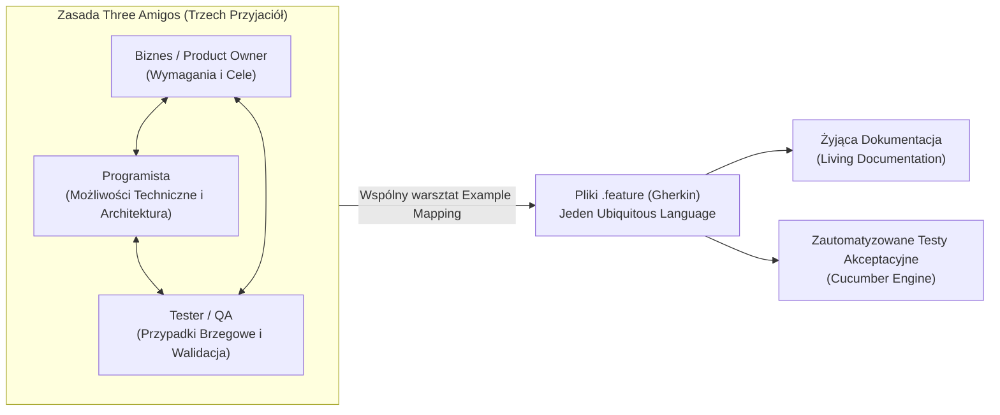
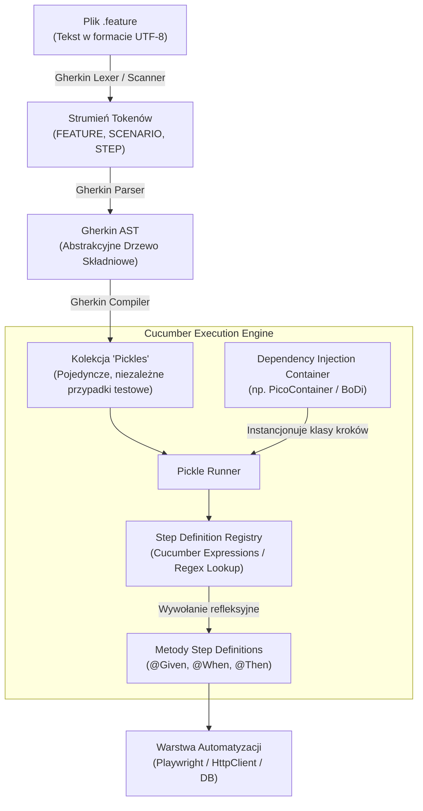
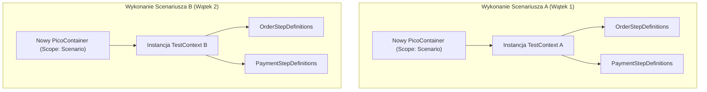
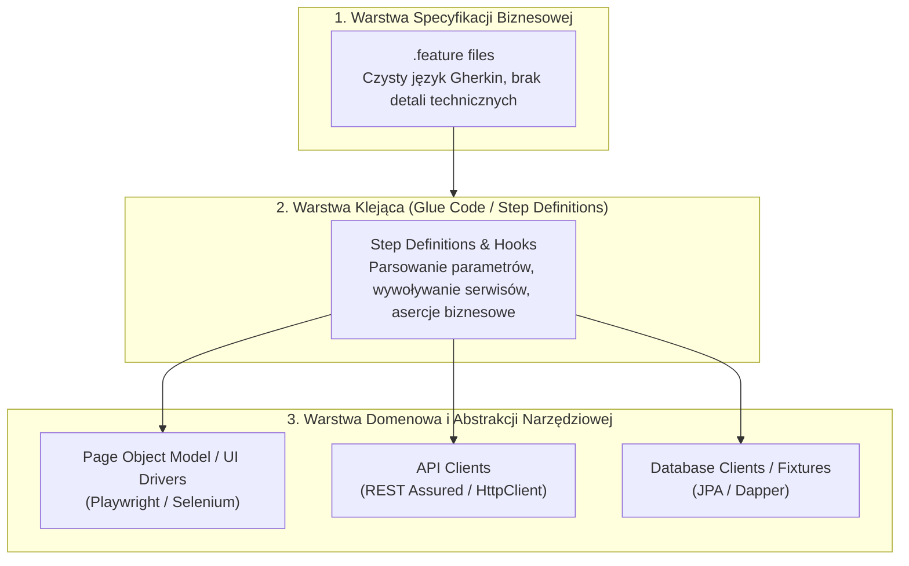

# Cucumber i BDD: Architektura Gherkin, Wzorce Automatyzacji i Pytania Rekrutacyjne

Kompleksowe kompendium inżynierskie poświęcone frameworkowi **Cucumber** oraz metodyce **Behavior-Driven Development (BDD)**. Artykuł szczegółowo omawia architekturę silnika wykonawczego Cucumbera, proces parsowania składni Gherkin (Gherkin AST i model Pickle), zaawansowane mechanizmy Cucumber Expressions i Type Registry, techniki wstrzykiwania zależności (Dependency Injection z PicoContainer i BoDi), zrównoleglanie testów, architekturę warstwową testów E2E/API oraz zestaw pytań rekrutacyjnych z odpowiedziami (od poziomu Mid po Architekta Automatyzacji).

---

## Spis Treści
1. [Filozofia BDD: Cel Biznesowy i Zasada Three Amigos](#1-filozofia-bdd-cel-biznesowy-i-zasada-three-amigos)
   - Dan North i geneza BDD (dlaczego TDD potrzebowało nowego języka)
   - Warsztat Three Amigos i Living Documentation
   - Kluczowe rozróżnienie: Narzędzie współpracy vs framework do klikania w UI
2. [Niskopoziomowa Architektura Silnika Cucumber](#2-niskopoziomowa-architektura-silnika-cucumber)
   - Gherkin Parser, Tokenizacja i Drzewo Składniowe (AST)
   - Model Wykonawczy: Od scenariusza do jednostek Pickle
   - Step Definition Registry i dopasowywanie kroków
   - Pełny cykl życia (Lifecycle Hooks)
3. [Składnia Gherkin: Od Podstaw do Zaawansowanych Technik](#3-składnia-gherkin-od-podstaw-do-zaawansowanych-technik)
   - Struktura: `Feature`, `Rule`, `Scenario`, `Background`
   - Parametryzacja: `Scenario Outline` vs Data Tables
   - Cucumber Expressions vs Regular Expressions (Regex)
   - Custom Type Transformers (`@ParameterType` i `@DataTableType`)
   - Tagi i zaawansowana logika selekcji (`and`, `or`, `not`)
4. [Zarządzanie Stanem i Dependency Injection](#4-zarządzanie-stanem-i-dependency-injection)
   - Pułapka stanu statycznego w testach równoległych
   - Izolacja stanu Scenariusza z PicoContainer w Java
   - Ekosystem .NET: Przejście z SpecFlow do Reqnroll i kontener BoDi
5. [Wzorce Architektoniczne Automatyzacji z Cucumber](#5-wzorce-architektoniczne-automatyzacji-z-cucumber)
   - Architektura Trójwarstwowa: Specification -> Glue Code -> Domain/Driver
   - Antywzorzec: Imperative Gherkin vs Declarative Gherkin
   - Integracja z Playwright, Selenium i REST Assured
6. [Zrównoleglenie i Bezpieczeństwo Wątkowe (Parallel Execution)](#6-zrównoleglenie-i-bezpieczeństwo-wątkowe-parallel-execution)
   - Równoległość na poziomie Scenariuszy (Pickle level)
   - Izolacja zasobów i przeglądarek (`ThreadLocal` vs DI Scope)
7. [Pytania Rekrutacyjne z Odpowiedziami (FAQ Interview)](#7-pytania-rekrutacyjne-z-odpowiedziami-faq-interview)
   - Pytania Podstawowe i Średniozaawansowane (Mid)
   - Pytania Zaawansowane i Architektoniczne (Senior / Lead)
   - Scenariusze Awaryjne i Live-fire Troubleshooting
8. [Tablica Szybkiej Powtórki (Cheat-Sheet)](#8-tablica-szybkiej-powtórki-cheat-sheet)

---

## 1. Filozofia BDD: Cel Biznesowy i Zasada Three Amigos

Częstym błędem inżynierskim jest traktowanie Cucumbera wyłącznie jako nakładki na Selenium lub Playwright, której jedynym zadaniem jest „pisanie testów po angielsku”. W rzeczywistości **Cucumber jest narzędziem do komunikacji i walidacji wymagań**, a nie silnikiem sterowania przeglądarką.



### Geneza Behavior-Driven Development (BDD)
Metodyka BDD została sformułowana przez **Dana Northa** jako ewolucja Test-Driven Development (TDD). North zauważył, że programiści piszący testy TDD często skupiali się na strukturze kodu i implementacji klas, zamiast na **zachowaniu systemu z perspektywy wartości biznesowej**.

Wprowadzono koncepcję **Ubiquitous Language (Języka Wszechobecnego)** zaczerpniętą z Domain-Driven Design (DDD):
- Analityk biznesowy, programista i tester posługują się dokładnie tym samym słownictwem.
- Wymagania są spisywane w formie **konkretnych przykładów** (*Example Mapping*), które eliminują dwuznaczności języka naturalnego.
- Pliki `.feature` stają się **Living Documentation** – dokumentacją, która nigdy się nie dezaktualizuje, ponieważ każde uruchomienie pipeline'u CI/CD weryfikuje jej zgodność z działającym systemem.

> [!IMPORTANT]
> Jeśli pliki `.feature` są pisane wyłącznie przez testera po zakończeniu prac programistycznych, bez udziału biznesu i deweloperów, zespół nie realizuje BDD — stosuje jedynie nieefektywny i kosztowny narzut składniowy na klasyczne testy automatyczne.

---

## 2. Niskopoziomowa Architektura Silnika Cucumber

Zrozumienie, w jaki sposób Cucumber przetwarza tekst w języku naturalnym i zamienia go w instrukcje kodu źródłowego, jest kluczowe dla optymalizacji i diagnozowania błędów wykonawczych.



### 1. Parsowanie do Gherkin AST
Cucumber czyta plik `.feature` i przy użyciu oficjalnego parsera Gherkin buduje **AST (Abstract Syntax Tree)**:
- Rozpoznaje reguły językowe na podstawie nagłówka `# language: pl` lub domyślnego języka angielskiego.
- Identyfikuje sekcje: `Feature`, `Rule`, `Scenario`, `Scenario Outline`, `Examples`, `Background`.

### 2. Kompilacja do Pickles (Jednostek Wykonawczych)
Cucumber nie uruchamia bezpośrednio drzewa AST. Kompilator przekształca AST na strukturę zwaną **Pickle**:
- Każdy `Scenario` staje się jednym `Pickle`.
- Każdy wiersz w tabeli `Examples` wewnątrz `Scenario Outline` generuje **osobny, niezależny Pickle**.
- Krok z sekcji `Background` jest wstrzykiwany na początek listy kroków każdego `Pickle`.
- Pickle zawiera wyłącznie spłaszczoną listę kroków i przypisane tagi, co umożliwia bezproblemowe zrównoleglanie na poziomie pojedynczych scenariuszy.

### 3. Step Definition Registry i Matcher
Silnik Cucumbera podczas startu skanuje pakiety wskazane w konfiguracji (`glue`):
- Tworzy rejestr wzorców wyrażeń (zarówno **Cucumber Expressions**, jak i wyrażeń regularnych **Regex**).
- W momencie wykonania kroku szuka w rejestrze pasującej sygnatury metody.
- W przypadku znalezienia dokładnie jednego dopasowania, wywołuje metodę przez refleksję, automatycznie rzutując typy argumentów.
- W przypadku braku dopasowania rzuca `UndefinedStepException`.
- W przypadku znalezienia więcej niż jednej metody pasującej do kroku rzuca `AmbiguousStepDefinitionsException`.

---

## 3. Składnia Gherkin: Od Podstaw do Zaawansowanych Technik

Format Gherkin opiera się na restrykcyjnej gramatyce zorientowanej na linie (*line-oriented grammar*).

### Podstawowe i Nowoczesne Słowa Kluczowe
- **`Feature`**: Opisuje wycinek funkcjonalności systemu lub wartość biznesową.
- **`Rule` (Wprowadzone w Gherkin v6)**: Pozwala grupować scenariusze wokół konkretnej reguły biznesowej w ramach jednego pliku feature.
- **`Background`**: Zestaw kroków wykonywanych przed **każdym** scenariuszem w danym pliku.
- **`Scenario`**: Pojedynczy, konkretny przypadek zachowania systemu.
- **`Given` / `Zakładając, że`**: Stan początkowy (kontekst / preconditions).
- **`When` / `Jeżeli`**: Akcja wyzwalająca (interakcja użytkownika lub zdarzenie zewnętrzne).
- **`Then` / `Wtedy`**: Oczekiwany rezultat (asercja biznesowa / postconditions).
- **`And` / `Oraz`, `But` / `Ale`**: Łączniki semantyczne ułatwiające płynne czytanie.

### Przykład z Użyciem `Rule` i `Scenario Outline`

```gherkin
# language: pl
Właściwość: Naliczanie rabatów w koszyku zamówień
  Jako kierownik sprzedaży
  Chcę, aby system automatycznie przyznawał rabaty lojalnościowe
  Aby zwiększyć retencję stałych klientów

  Założenia:
    Mając działający sklep internetowy z walutą "PLN"

  Zasada: Klienci o statusie VIP otrzymują 15% rabatu na cały asortyment

    Szablon scenariusza: Naliczanie zniżki VIP dla zamówień o różnej wartości
      Mając klienta o statusie "<status>"
      Gdy klient doda do koszyka produkty o łącznej wartości <kwota_poczatkowa> PLN
      Wtedy ostateczna kwota do zapłaty wynosi <kwota_koncowa> PLN

      Przykłady:
        | status   | kwota_poczatkowa | kwota_koncowa |
        | VIP      | 100.00           | 85.00         |
        | VIP      | 200.00           | 170.00        |
        | STANDARD | 100.00           | 100.00        |

  Zasada: Kody promocyjne nie łączą się z rabatem VIP

    Scenariusz: Próba użycia kuponu przez klienta VIP
      Mając klienta o statusie "VIP"
      I klient posiada aktywny kupon rabatowy "PROMO10"
      Gdy klient zatwierdza koszyk
      Wtedy system wyświetla komunikat "Rabaty nie łączą się. Zastosowano korzystniejszą zniżkę VIP"
```

---

### Cucumber Expressions vs Regular Expressions (Regex)

Nowoczesny Cucumber (od wersji 3.0+) wprowadził **Cucumber Expressions**, które zastąpiły skomplikowane i nieczytelne wyrażenia regularne.

| Zagadnienie | Cucumber Expressions (Standard) | Tradycyjny Regex |
| :--- | :--- | :--- |
| **Liczba całkowita** | `{int}` | `(\\d+)` lub `([0-9]+)` |
| **Liczba zmiennoprzecinkowa**| `{float}` lub `{double}` | `([0-9]*\\.?[0-9]+)` |
| **Ciąg znaków w cudzysłowie**| `{string}` (obsługuje `""` i `''`) | `"([^"]*)"` |
| **Dowolne słowo** | `{word}` | `(\\w+)` |
| **Dowolny tekst** | `{}` (anonimowy parametr) | `(.*)` |
| **Tekst opcjonalny** | `zamówienie(a)` | `zamówienie(?:a)?` |
| **Alternatywa słów** | `dodaj/usuń produkt` | `(?:dodaj\|usuń) produkt` |

#### Porównanie w Kodzie Java:

```java
// TRADYCYJNY REGEX (Trudny w utrzymaniu, podatny na błędy ucieczki znaków)
@When("^użytkownik dodaje (\\d+) sztuk(?:i)? produktu \"([^\"]*)\" do koszyka$")
public void addProductRegex(int count, String productName) { ... }

// NOWOCZESNY CUCUMBER EXPRESSION (Czytelny, zwięzły, bezpieczny typologicznie)
@When("użytkownik dodaje {int} sztuk(i) produktu {string} do koszyka")
public void addProductCucumberExpression(int count, String productName) {
    cartService.addItem(productName, count);
}
```

---

### Zaawansowane Rejestrowanie Typów: `@ParameterType` i `@DataTableType`

Jednym z najważniejszych wyznaczników czystego kodu w testach Cucumbera jest eliminacja ręcznego parsowania ciągów znaków i danych tabelarycznych wewnątrz metod kroków.

#### 1. Własny `@ParameterType` (Domain Object Mapping z parametru kroku)
Zamiast przyjmować `String` i ręcznie parsować go do Enum lub obiektu domenowego:

```gherkin
Mając użytkownika z uprawnieniami ADMIN w systemie
```

```java
package com.codeassure.cucumber.types;

import com.codeassure.domain.Role;
import io.cucumber.java.ParameterType;

public class TypeRegistryConfiguration {

    // Rejestracja konwertera parametru kroku
    @ParameterType("ADMIN|MANAGER|USER|GUEST")
    public Role role(String roleName) {
        return Role.valueOf(roleName.toUpperCase());
    }
}
```

Definicja kroku otrzymuje bezpośrednio gotowy Enum:
```java
@Given("użytkownik z uprawnieniami {role} w systemie")
public void userWithRole(Role role) {
    currentUser = userService.createUserWithRole(role);
}
```

---

#### 2. Własny `@DataTableType` (Mapowanie Tabel na Obiekty DTO)
Antywzorcem jest operowanie na `List<Map<String, String>>` wewnątrz kroków. Cucumber pozwala na automatyczną deserializację całych tabel na rekordy lub klasy DTO.

```gherkin
Gdy administrator zakłada nowe konta pracowników:
  | imie      | email               | dzial      | stawkaGodzinowa |
  | Jan       | jan@codeassure.io   | QA         | 120             |
  | Agnieszka | aga@codeassure.io   | DevBackend | 160             |
```

Definicja rekordu DTO w Java:
```java
public record EmployeeDto(
    String imie,
    String email,
    String dzial,
    BigDecimal stawkaGodzinowa
) {}
```

Rejestracja transfromera tabeli w Cucumberze:
```java
package com.codeassure.cucumber.types;

import io.cucumber.java.DataTableType;
import java.math.BigDecimal;
import java.util.Map;

public class DataTableConfig {

    @DataTableType
    public EmployeeDto employeeEntryTransformer(Map<String, String> row) {
        return new EmployeeDto(
            row.get("imie"),
            row.get("email"),
            row.get("dzial"),
            new BigDecimal(row.get("stawkaGodzinowa"))
        );
    }
}
```

Czysta i zwięzła metoda w Step Definitions:
```java
@When("administrator zakłada nowe konta pracowników:")
public void createEmployeeAccounts(List<EmployeeDto> employees) {
    // Zero mapowania ręcznego! Bezpośrednia kolekcja obiektów domenowych/DTO
    employees.forEach(employeeService::register);
}
```

---

## 4. Zarządzanie Stanem i Dependency Injection

Kluczowym problemem w projektowaniu frameworków opartych na Cucumberze jest **przekazywanie stanu pomiędzy krokami**.
Krok `Given` tworzy koszyk, krok `When` dodaje produkty, a krok `Then` weryfikuje sumę. Gdzie przechowywać ID koszyka?

### Pułapka Zmiennych Statycznych (`static`)
```java
// ANTYWZORZEC: Zmienne statyczne
public class StepDefs {
    private static String orderId; // KATASTROFA w wykonaniu równoległym!
}
```
> [!CAUTION]
> Użycie pól statycznych powoduje natychmiastowe wyścigi wątków (*Race Conditions*) i zanieczyszczenie stanu (*State Bleeding*) w momencie włączenia wielowątkowego wykonywania testów. Test A nadpisze `orderId` testu B.

---

### Rozwiązanie: Dependency Injection z PicoContainer (Cucumber-JVM)

Cucumber-JVM natywnie wspiera lekki kontener **PicoContainer** (poprzez zależność `cucumber-picocontainer`).
Kontener ten posiada specjalny cykl życia powiązany z obiektem **Scenario**:
1. Przed uruchomieniem każdego Scenariusza tworzona jest nowa instancja kontenera DI.
2. Klasa kontekstu (np. `TestContext`) jest wstrzykiwana przez konstruktor do wszystkich klas kroków, które jej potrzebują.
3. Po zakończeniu Scenariusza instancja kontekstu jest niszczona i poddawana Garbage Collection.



#### Implementacja Krok po Kroku (Java + PicoContainer):

1. **Klasa współdzielonego kontekstu:**
```java
package com.codeassure.cucumber.context;

import java.util.HashMap;
import java.util.Map;

public class TestContext {
    private String orderId;
    private Object responsePayload;
    private final Map<String, Object> storage = new HashMap<>();

    public String getOrderId() { return orderId; }
    public void setOrderId(String orderId) { this.orderId = orderId; }

    public void put(String key, Object value) { storage.put(key, value); }
    @SuppressWarnings("unchecked")
    public <T> T get(String key) { return (T) storage.get(key); }
}
```

2. **Wstrzyknięcie przez konstruktor w klasach kroków:**
```java
package com.codeassure.cucumber.steps;

import com.codeassure.cucumber.context.TestContext;
import io.cucumber.java.en.When;

public class OrderSteps {
    private final TestContext context;

    // PicoContainer automatycznie wstrzykuje tę samą instancję TestContext w ramach scenariusza
    public OrderSteps(TestContext context) {
        this.context = context;
    }

    @When("użytkownik składa zamówienie na kwotę {double}")
    public void placeOrder(double amount) {
        String createdOrderId = orderService.submitOrder(amount);
        context.setOrderId(createdOrderId);
    }
}
```

```java
package com.codeassure.cucumber.steps;

import com.codeassure.cucumber.context.TestContext;
import io.cucumber.java.en.Then;
import static org.assertj.core.api.Assertions.assertThat;

public class PaymentSteps {
    private final TestContext context;

    public PaymentSteps(TestContext context) {
        this.context = context;
    }

    @Then("status płatności dla zamówienia wynosi {string}")
    public void verifyPaymentStatus(String expectedStatus) {
        // Bezpieczny odczyt identyfikatora zapisanego w innym kroku
        String currentOrderId = context.getOrderId();
        PaymentStatus actualStatus = paymentService.getStatus(currentOrderId);
        assertThat(actualStatus.name()).isEqualTo(expectedStatus);
    }
}
```

---

### Ekosystem .NET: Reqnroll (Następca SpecFlow) i Kontener BoDi

W ekosystemie .NET historycznym liderem BDD był **SpecFlow**. Na początku 2024 roku firma Tricentis zakończyła oficjalne wsparcie dla projektu SpecFlow. Społeczność open-source stworzyła bezpośredniego następcę: **Reqnroll** (pod egidą Reqnroll Project).

W Reqnroll wstrzykiwanie zależności realizowane jest domyślnie przez wbudowany, ultralekki kontener **BoDi** (`IObjectContainer`):

```csharp
using Reqnroll;
using Reqnroll.BoDi;
using FluentAssertions;

namespace CodeAssure.Specs.Steps
{
    public class ScenarioState
    {
        public string? OrderId { get; set; }
    }

    [Binding]
    public class OrderSteps
    {
        private readonly ScenarioState _state;

        // BoDi automatycznie tworzy i wstrzykuje instancję ScenarioState w zasięgu scenariusza
        public OrderSteps(ScenarioState state)
        {
            _state = state;
        }

        [Given(@"użytkownik składa zamówienie w koszyku")]
        public void GivenUzytkownikSkladaZamowienie()
        {
            _state.OrderId = "ORD-98741";
        }
    }

    [Binding]
    public class VerificationSteps
    {
        private readonly ScenarioState _state;

        public VerificationSteps(ScenarioState state)
        {
            _state = state;
        }

        [Then(@"identyfikator zamówienia jest wygenerowany")]
        public void ThenIdentyfikatorJestWygenerowany()
        {
            _state.OrderId.Should().NotBeNullOrEmpty();
        }
    }
}
```

---

## 5. Wzorce Architektoniczne Automatyzacji z Cucumber

Prawidłowa architektura projektu BDD opiera się na **ścisłej separacji warstw**.
Złamanie tej zasady prowadzi do tzw. *spaghetti step definitions*, gdzie kod logiki biznesowej, asercje, selektory CSS i zapytania do bazy danych są wymieszane w jednej metodzie.



### Porównanie: Imperative Gherkin vs Declarative Gherkin

Jednym z najczęstszych antywzorców niszczących projekty Cucumbera jest pisanie kroków w sposób **imperatywny (instruktażowy)** zamiast **deklaratywnego (opisującego intencję)**.

#### ❌ Styl Imperatywny (KATASTROFA w utrzymaniu):
```gherkin
Scenariusz: Logowanie do systemu
  Gdy użytkownik wpisuje "admin@codeassure.io" do pola o id "#username"
  I użytkownik wpisuje "TajneHaslo123" do pola o nazwie "input-password"
  I użytkownik klika w przycisk "button.btn-primary"
  I użytkownik czeka 5 sekund
  Wtedy strona przekierowuje na adres "/dashboard"
  I element "div.user-profile" zawiera tekst "Witaj, Administratorze"
```
*Wady:* Scenariusz jest nieczytelny dla biznesu, ściśle powiązany ze strukturą HTML/CSS, a każda zmiana w UI wymaga przepisywania plików `.feature`.

####  Styl Deklaratywny (Zgodny z zasadami BDD):
```gherkin
Scenariusz: Poprawne uwierzytelnienie administratora
  Mając zarejestrowanego użytkownika z uprawnieniami administratora
  Gdy użytkownik loguje się do portalu przy użyciu poprawnych poświadczeń
  Wtedy uzyskuje dostęp do panelu głównego z uprawnieniami administracyjnymi
```
*Zalety:* Czysty język biznesowy, odporność na zmiany w UI (jeśli zmieni się selektor lub formularz, modyfikujemy wyłącznie kod Page Object, a nie plik `.feature`).

---

## 6. Zrównoleglenie i Bezpieczeństwo Wątkowe (Parallel Execution)

Cucumber-JVM umożliwia wykonywanie scenariuszy w wielu równoległych wątkach (np. przy użyciu silnika **JUnit 5 Platform Suite Engine**).

### Konfiguracja Równoległości w JUnit 5
Plik `junit-platform.properties` w katalogu `src/test/resources/`:
```properties
# Włączenie równoległego wykonywania testów
junit.jupiter.execution.parallel.enabled = true
# Tryb współbieżny dla klas i metod
junit.jupiter.execution.parallel.mode.default = concurrent
junit.jupiter.execution.parallel.mode.classes.default = concurrent
# Liczba wątków (np. dynamicznie oparta o liczbę rdzeni CPU)
junit.jupiter.execution.parallel.config.strategy = dynamic
junit.jupiter.execution.parallel.config.dynamic.factor = 1.0
```

### Klasa Uruchomieniowa (Cucumber Runner Suite)
```java
package com.codeassure.cucumber;

import org.junit.platform.suite.api.ConfigurationParameter;
import org.junit.platform.suite.api.IncludeEngines;
import org.junit.platform.suite.api.SelectClasspathResource;
import org.junit.platform.suite.api.Suite;

import static io.cucumber.junit.platform.engine.Constants.GLUE_PROPERTY_NAME;
import static io.cucumber.junit.platform.engine.Constants.PLUGIN_PROPERTY_NAME;

@Suite
@IncludeEngines("cucumber")
@SelectClasspathResource("features")
@ConfigurationParameter(key = GLUE_PROPERTY_NAME, value = "com.codeassure.cucumber")
@ConfigurationParameter(key = PLUGIN_PROPERTY_NAME, value = "pretty, html:target/cucumber-reports.html")
public class RunCucumberTest {
}
```

### Zrzuty Ekranu w Hookach w Przypadku Błędu
Mechanizm `@After` pozwala na dołączenie zrzutu ekranu lub logów bezpośrednio do raportu Cucumbera:

```java
package com.codeassure.cucumber.hooks;

import io.cucumber.java.After;
import io.cucumber.java.Scenario;
import com.microsoft.playwright.Page;

public class TestHooks {
    private final Page page; // Wstrzyknięte przez PicoContainer / ThreadLocal

    public TestHooks(Page page) {
        this.page = page;
    }

    @After
    public void tearDown(Scenario scenario) {
        if (scenario.isFailed()) {
            byte[] screenshot = page.screenshot(new Page.ScreenshotOptions().setFullPage(true));
            // Dołączenie obrazu bezpośrenio do raportu HTML Cucumbera
            scenario.attach(screenshot, "image/png", "Failure Screenshot: " + scenario.getName());
        }
    }
}
```

---

## 7. Pytania Rekrutacyjne z Odpowiedziami (FAQ Interview)

### Pytania Podstawowe i Średniozaawansowane (Mid)

#### Pytanie 1: Czym różni się BDD od TDD i jaka jest rzeczywista rola Cucumbera w zespole?
**Odpowiedź:**
TDD (*Test-Driven Development*) skupia się na perspektywie programisty i poprawności technicznej implementacji (cykl *Red-Green-Refactor*). Testy TDD są zazwyczaj testami jednostkowymi/komponentowymi pisanymi w kodzie programistycznym (JUnit, xUnit).

BDD (*Behavior-Driven Development*) jest metodyką organizacyjną i procesową rozszerzającą TDD o perspektywę biznesową. Wykorzystuje technikę *Three Amigos* oraz *Ubiquitous Language*, aby jeszcze przed napisaniem kodu zdefiniować oczekiwane zachowanie systemu w postaci zrozumiałych dla wszystkich przykładów.

**Cucumber nie jest narzędziem do testowania UI** — jest silnikiem wykonawczym i parserem języka Gherkin, który tłumaczy specyfikację biznesową na wykonywalny kod weryfikujący (testy akceptacyjne). Działa jako *Single Source of Truth* i tworzy żyjącą dokumentację (*Living Documentation*).

---

#### Pytanie 2: Jaka jest różnica między Data Table a tabelą w `Scenario Outline` (Examples)?
**Odpowiedź:**
Różnica dotyczy poziomu granularności i cyklu życia wykonania:
1. **Tabela w `Scenario Outline` (`Examples`)**:
   - Służy do **parametryzacji całego scenariusza**.
   - Każdy wiersz tabeli `Examples` tworzy **zupełnie nowy, niezależny przypadek testowy (Pickle)**.
   - Dla każdego wiersza od nowa uruchamiają się hooki `@Before` i `@After`, nowa przeglądarka oraz nowy kontener DI.
2. **Data Table (Tabela Danych w Kroku)**:
   - Jest przypisana do **jednego konkretnego kroku** (`Given`, `When`, lub `Then`).
   - Cały scenariusz wykonuje się tylko raz.
   - Służy do przekazania złożonych struktur danych do pojedynczego kroku (np. lista produktów, parametry formularza, rekordy bazy danych).

---

#### Pytanie 3: Do czego służy sekcja `Background` i kiedy staje się antywzorcem?
**Odpowiedź:**
Sekcja `Background` pozwala wyciągnąć wspólne kroki przygotowawcze (preconditions) przed wszystkimi scenariuszami w danym pliku `.feature`. Jest wykonywana przed każdym scenariuszem, zaraz po hookach `@Before`.

**Kiedy staje się antywzorcem:**
- **Zbyt rozbudowany Background:** Gdy zawiera 5-10 kroków technicznych (np. klikanie po menu, logowanie, konfiguracja danych). Zaciemnia to kontekst scenariuszy, a czytający traci orientację, co jest właściwym celem testu.
- **Wprowadzanie kroków nieistotnych dla części scenariuszy:** Jeśli dany krok w `Background` ma znaczenie tylko dla 2 z 5 scenariuszy, łamie to spójność pliku feature. Wtedy taki scenariusz należy przenieść do osobnego pliku lub użyć słowa kluczowego `Rule`.

---

#### Pytanie 4: Jak działają mechanizmy Tagów i wyrażeń tagów w nowoczesnym Cucumberze?
**Odpowiedź:**
Tagi (`@smoke`, `@regression`, `@slow`, `@api`) służą do kategoryzacji i filtrowania scenariuszy lub całych plików feature. Od wersji Cucumber v6+ wprowadzono standardowe operatory logiczne: `and`, `or`, `not` oraz nawiasy okrągłe:

```bash
# Uruchomienie testów regresji API, wykluczając testy wolne
mvn test -Dcucumber.filter.tags="(@api and @regression) and not @slow"
```

Tagi mogą być również przypisywane do Hooków w kodzie, co pozwala na warunkowe wykonywanie operacji przygotowawczych:
```java
@Before("@database")
public void cleanDatabase() {
    dbClient.truncateTables();
}
```

---

#### Pytanie 5: W jakiej kolejności Cucumber wykonuje Hooki `@Before`, `@After`, `@BeforeStep`, `@AfterStep`?
**Odpowiedź:**
Hierarchia wykonania pojedynczego Scenariusza wygląda następująco:
1. Hooki `@Before` (z uwzględnieniem parametru `order` – rosnąco: 0, 1, 2...).
2. Krok `Background` (jeśli zdefiniowany).
3. Dla każdego kroku scenariusza:
   - Hook `@BeforeStep`
   - Wykonanie metody Step Definition
   - Hook `@AfterStep`
4. Hooki `@After` (z uwzględnieniem parametru `order` – **malejąco**: 2, 1, 0 — reguła stosu / LIFO).

---

### Pytania Zaawansowane i Architektoniczne (Senior / Lead)

#### Pytanie 6: W jaki sposób rozwiązać problem współdzielenia stanu w testach wielowątkowych bez zmiennych statycznych?
**Odpowiedź:**
Zastosowanie wzorca **Dependency Injection o zasięgu scenariusza (Scenario Scope)**.
W Cucumber-JVM najpopularniejszym rozwiązaniem jest `cucumber-picocontainer`, w ekosystemie Spring jest to `cucumber-spring` z adnotacją `@ScenarioScope`, a w .NET (Reqnroll/SpecFlow) wbudowany kontener `BoDi`.

**Mechanizm działania:**
1. Tworzymy czysty obiekt POCO/POJO (np. `ScenarioContext`), który agreguje dane wymieniane między krokami (np. wygenerowane tokeny, identyfikatory encji, odpowiedzi HTTP).
2. Klasy Step Definitions nie tworzą obiektów przez `new`, lecz deklarują `ScenarioContext` jako parametr w konstruktorze.
3. Kontener DI podczas startu wątku przypisanego do Scenariusza tworzy unikalną instancję `ScenarioContext` i wstrzykuje ją do wszystkich klas kroków uczestniczących w danym scenariuszu.
4. Po zakończeniu scenariusza kontener niszczy kontekst. W ten sposób wątki wykonujące różne scenariusze operują na fizycznie odseparowanych instancjach w pamięci sterty, co gwarantuje pełne bezpieczeństwo wątkowe (*Thread-Safety*).

---

#### Pytanie 7: Jak obsłużyć sytuację, gdy ten sam krok tekstowy musi zachowywać się inaczej w testach UI i testach API?
**Odpowiedź:**
Jest to klasyczny dylemat architektoniczny w BDD, określany jako **współdzielenie specyfikacji między warstwami**.
Krok biznesowy:
```gherkin
Mając utworzonego użytkownika "Jan Kowalski"
```
Może zostać zrealizowany na poziomie:
1. Szybkiego strzału HTTP POST do REST API (dla testów integracyjnych/funkcjonalnych).
2. Wyklikania formularza rejestracji w przeglądarce przez Playwright/Selenium (dla pełnych testów E2E).

**Rozwiązania architektoniczne:**
- **Podejście 1 (Rekomendowane - Tagi i Polimorfizm przez DI):**
  Definiujemy interfejs `UserCreator` z implementacjami `ApiUserCreator` oraz `UiUserCreator`. W zależności od obecności tagu `@ui` lub `@api` przy scenariuszu, kontener DI (lub fabryka w hooku `@Before`) wstrzykuje odpowiednią implementację serwisu. Pliki kroków pozostają identyczne.
- **Podejście 2 (Rozdzielenie pakietów glue):**
  Umieszczenie kroków w osobnych pakietach (`glue = "com.codeassure.steps.api"` vs `glue = "com.codeassure.steps.ui"`) i sterowanie pakietem glue z poziomu osobnych Runnerów JUnit Suite.

---

#### Pytanie 8: Dlaczego użycie `Scenario Outline` z setkami wierszy dla testów UI w przeglądarce jest uznawane za błąd projektowy?
**Odpowiedź:**
Jest to antywzorzec **odwróconej piramidy testów (Ice-Cream Cone Anti-pattern)** przeniesiony na grunt BDD:
1. **Narzut czasowy i zasobowy:** Każdy wiersz w `Examples` to osobny Pickle, który w testach UI uruchamia przeglądarkę, przechodzi przez sieć i wykonuje pełny cykl DOM. 100 wierszy oznacza 100 pełnych sesji przeglądarki, co drastycznie wydłuża czas pipeline'u CI/CD.
2. **Kombinatoryka danych to domena testów jednostkowych:** Wszelkie permutacje walidacji pól (np. niepoprawne znaki w PESEL, formaty email, wartości ujemne) powinny być testowane na poziomie silnika walidacji w testach jednostkowych (xUnit/JUnit/spock) w mikrosekundy.
3. **Zasada BDD:** Celem BDD jest udokumentowanie **reguły biznesowej**, a nie exhaustywne testowanie kombinatoryczne danych wejściowych. Wystarczą 2-3 kluczowe przykłady obrazujące granice reguły (*Equivalence Partitioning / Boundary Value Analysis*).

---

#### Pytanie 9: Jak zdiagnozować i wyeliminować błąd `AmbiguousStepDefinitionsException` w dużej skali projektu?
**Odpowiedź:**
Błąd ten występuje, gdy Cucumber znajdzie więcej niż jedno wyrażenie pasujące do kroku tekstowego.
Przyczyna zazwyczaj wynika ze zbyt szerokich wyrażeń regularnych lub nakładających się Cucumber Expressions:

```java
// Metoda A
@Given("użytkownik posiada {int} produktów w koszyku")

// Metoda B (zbyt szeroki parametr anonimowy {})
@Given("użytkownik posiada {} w koszyku")
```

**Kroki naprawcze i prewencja:**
1. Zastąpienie szerokich wzorców `{}` konkretnymi typami: `{int}`, `{string}`, lub dedykowanym `@ParameterType`.
2. Wykorzystanie pełnego tekstu wyjątku — Cucumber wskazuje dokładne klasy i linie obu kolidujących metod.
3. Wprowadzenie restrykcyjnych reguł weryfikacji architektury (np. ArchUnit lub lintery Gherkin), które blokują wprowadzanie generycznych kroków o niejednoznacznych wzorcach.

---

#### Pytanie 10: Jak wygląda status SpecFlow w świecie .NET i czym charakteryzuje się migracja do Reqnroll?
**Odpowiedź:**
W lutym 2024 roku Tricentis oficjalnie ogłosił koniec wsparcia (*End of Life*) dla SpecFlow. W odpowiedzi kluczowi kontrybutorzy i społeczność powołali do życia **Reqnroll** — oficjalnego następcę wspieranego przez fundację open-source.

**Główne aspekty techniczne Reqnroll:**
- Pełna kompatybilność wsteczna z API SpecFlow: zamiana namespace z `TechTalk.SpecFlow` na `Reqnroll`.
- Natywne wsparcie dla nowoczesnych wersji .NET (8, 9 i nowszych) oraz formatu C# 12+.
- Rozwiązanie problemów z generatorem kodu (`SpecFlow.Tools.MsBuildGeneration` zastąpione nowoczesnym `Reqnroll.Tools.MsBuild.Generation`).
- Pełna kompatybilność z kontenerem DI BoDi oraz natywnym Microsoft.Extensions.DependencyInjection.

---

### Scenariusze Awaryjne i Live-fire Troubleshooting

#### Scenariusz 1: Wyciek Stanu (State Leak) i Flaky Tests w Równoległym Wykonaniu
* **Objaw produkcyjny:** Testy uruchamiane sekwencyjnie lokalnie przechodzą w 100%. W pipeline CI/CD przy włączonych 8 wątkach losowe scenariusze wygasają z błędem `NullPointerException` lub asercją wskazującą na dane z zupełnie innego scenariusza.
* **Analiza Root Cause:**
  1. Przegląd kodu wykazał klasę `SessionStorage`, która przechowywała token autoryzacyjny użytkownika w polu:
     ```java
     public class SessionStorage {
         public static String userToken; // BŁĄD! Pole współdzielone przez wszystkie wątki JVM
     }
     ```
  2. Wątek 1 logował użytkownika `Admin` i zapisywał token. W ułamku sekundy Wątek 2 logował użytkownika `Guest` i nadpisywał `userToken`. Wątek 1 próbował wykonać akcję administracyjną z tokenem gościa, co kończyło się błędem 403 Forbidden.
* **Rozwiązanie i Naprawa:**
  1. Usunięcie modyfikatora `static`.
  2. Zarejestrowanie `SessionStorage` w kontenerze PicoContainer jako komponent wstrzykiwany przez konstruktor do Step Definitions.
  3. Jeśli zachodzi konieczność użycia obiektu globalnego, hermetyzacja w `ThreadLocal<String>` z bezwzględnym czyszczeniem w hooku `@After`:
     ```java
     public class ThreadSafeSessionStorage {
         private static final ThreadLocal<String> TOKEN_HOLDER = new ThreadLocal<>();

         public static void setToken(String token) { TOKEN_HOLDER.set(token); }
         public static String getToken() { return TOKEN_HOLDER.get(); }
         public static void clear() { TOKEN_HOLDER.remove(); } // Ochrona przed wyciekiem w puli wątków!
     }
     ```

---

#### Scenariusz 2: Niezrozumiały Wyjątek `CucumberException: Could not convert a Map to MyDto`
* **Objaw produkcyjny:** Po aktualizacji biblioteki Cucumber do wersji 7.x testy z tabelami danych rzucają wyjątek konwersji typów przy próbie zmapowania wiersza tabeli na obiekt DTO.
* **Analiza Root Cause:**
  W Cucumber v7 domyślny mechanizm Jackson/DataTable został zaostrzony. Brak bezargumentowego konstruktora w klasie DTO lub brak zarejestrowanego transfromera `@DataTableType` uniemożliwia automatyczną refleksję.
* **Rozwiązanie i Naprawa:**
  Stworzenie jawnego transfromera tabeli lub dodanie biblioteki `cucumber-datatable-type` i skonfigurowanie domyślnego mappera obiektowego:
  ```java
  public class DataTableTransformerConfig {
      private final ObjectMapper objectMapper = new ObjectMapper();

      @DefaultParameterTransformer
      @DefaultDataTableEntryTransformer
      @DefaultDataTableCellTransformer
      public Object transform(Object fromValue, Type toValueType) {
          return objectMapper.convertValue(fromValue, objectMapper.constructType(toValueType));
      }
  }
  ```

---

#### Scenariusz 3: Awaria Raportowania CI/CD — "Step implementation missing", mimo że metoda istnieje
* **Objaw produkcyjny:** Narzędzie budujące Maven/Gradle zwraca błąd o brakującej implementacji kroku, chociaż metoda `@Given` znajduje się w projekcie.
* **Analiza Root Cause:**
  1. Błędna konfiguracja parametru `glue` w Runnerze testowym. Runner szuka w pakiecie `com.codeassure.steps`, podczas gdy nowa klasa została umieszczona w `com.codeassure.features.steps`.
  2. Niedopasowanie wyrażenia: obecność znaków specjalnych w pliku `.feature` (np. nawiasy kwadratowe `[ ]` lub ukośniki `/`), które w Cucumber Expressions są znakami zastrzeżonymi (alternatywy i teksty opcjonalne).
* **Rozwiązanie i Naprawa:**
  1. Poprawa ścieżki w parametrze `@ConfigurationParameter(key = GLUE_PROPERTY_NAME, value = "com.codeassure")`.
  2. Escape'owanie znaków zastrzeżonych w pliku `.feature` lub w definicji kroku przy użyciu odwrotnego ukośnika `\`.

---

## 8. Tablica Szybkiej Powtórki (Cheat-Sheet)

| Zagadnienie | Składnia / Adnotacja | Zastosowanie / Opis |
| :--- | :--- | :--- |
| **Definicja Scenariusza** | `Scenario: Nazwa` | Pojedynczy przypadek biznesowy |
| **Szablon z Tabelą** | `Scenario Outline:` + `Examples:` | Parametryzacja scenariusza (każdy wiersz to osobny test) |
| **Kroki Wspólne** | `Background:` | Wykonywane przed każdym scenariuszem w pliku |
| **Grupa Reguł (v6+)** | `Rule:` | Grupowanie scenariuszy według reguły biznesowej |
| **Parametr Liczbowy** | `{int}`, `{float}`, `{double}` | Automatyczne rzutowanie na typy numeryczne |
| **Parametr Tekstowy** | `{string}` | Odczyt tekstu w cudzysłowie (`"tekst"`) |
| **Konwersja Typu** | `@ParameterType("REGEXP")` | Transformacja tekstu na Enum lub obiekt domenowy |
| **Konwersja Tabeli** | `@DataTableType` | Deserializacja wiersza tabeli na obiekt DTO / Record |
| **Hook Początkowy** | `@Before(order = 10, value = "@tag")` | Setup scenariusza z filtrowaniem tagów |
| **Hook Końcowy** | `@After` | Teardown, zrzuty ekranu (`scenario.attach`) |
| **Dependency Injection** | `PicoContainer` / `BoDi` | Wstrzykiwanie `ScenarioContext` przez konstruktor |
| **Logika Tagów** | `@smoke and not (@slow or @wip)` | Zaawansowana selekcja testów do uruchomienia |
| **Dołączenie Załącznika**| `scenario.attach(bytes, mime, name)` | Dołączanie screenshotów i logów do raportu |
