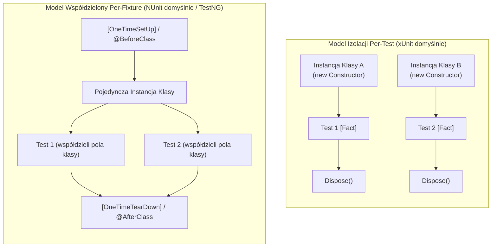
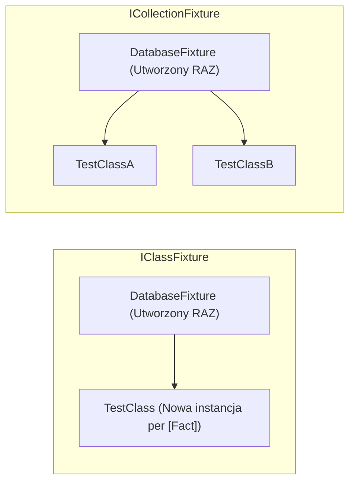
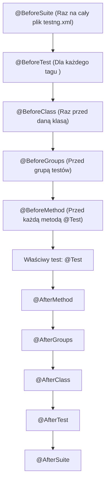

# Frameworki Testowe: xUnit, NUnit i TestNG (Deep Dive)

Kompleksowy przewodnik po wiodących frameworkach do testów jednostkowych, integracyjnych i automatyzacji w ekosystemach **.NET (C#)** oraz **Java**. Obejmuje analizę architektoniczną mechaniki uruchamiania testów, cykl życia instancji testowych, techniki parametryzacji, izolację współbieżną (równoległe wykonywanie testów) oraz zestaw pytań rekrutacyjnych i scenariuszy awaryjnych (od poziomu Mid do Lead / QA Automation Architect).

---

## Spis Treści
1. [Wprowadzenie i Paradygmat xUnit (Clean State vs Shared State)](#1-wprowadzenie-i-paradygmat-xunit-clean-state-vs-shared-state)
2. [xUnit.net (.NET Modern Standard)](#2-xunitnet-net-modern-standard)
   - Filozofia braku `[SetUp]` i `[TearDown]` (Konstruktor i `IDisposable` / `IAsyncLifetime`)
   - Cykl życia: Nowa instancja klasy na każdy test (`[Fact]`)
   - Testy parametryzowane: `[Theory]`, `[InlineData]`, `[MemberData]`, `[ClassData]`
   - Współdzielenie stanu i wstrzykiwanie zależności: `IClassFixture` i `ICollectionFixture`
   - Zrównoleglenie i mechanizm `ITestOutputHelper`
3. [NUnit (.NET Enterprise Veteran)](#3-nunit-net-enterprise-veteran)
   - Cykl życia oparty na atrybutach: `[SetUp]`, `[TearDown]`, `[OneTimeSetUp]`
   - Model instancjonowania per-fixture vs per-testcase
   - Asercje oparte na ograniczeniach (Constraint-Based Model: `Assert.That`)
   - Zaawansowana parametryzacja: `[TestCaseSource]`, `[Combinatorial]`, `[Pairwise]`
   - Równoległe wykonywanie z `[Parallelizable]`
4. [TestNG (Java Automation Powerhouse)](#4-testng-java-automation-powerhouse)
   - Dlaczego powstał TestNG? (Odpowiedź na ograniczenia JUnit 4)
   - Wielopoziomowa hierarchia adnotacji cyklu życia (`@BeforeSuite`, `@BeforeTest`, etc.)
   - Orkiestracja za pomocą `testng.xml`
   - Potężna parametryzacja: `@DataProvider` (asynchroniczny / równoległy)
   - Zależności testów (`dependsOnMethods`, `dependsOnGroups`) i soft assertions
   - Listenery: `ITestListener` i automatyczny mechanizm Retry (`IRetryAnalyzer`)
5. [Wielka Tabela Porównawcza: xUnit vs NUnit vs TestNG](#5-wielka-tabela-porównawcza-xunit-vs-nunit-vs-testng)
6. [Pytania Rekrutacyjne z Odpowiedziami (FAQ Interview)](#6-pytania-rekrutacyjne-z-odpowiedziami-faq-interview)
   - Pytania Podstawowe i Średniozaawansowane (Mid)
   - Pytania Zaawansowane i Architektoniczne (Senior / Automation Lead)
   - Scenariusze Awaryjne i Live-fire Troubleshooting
7. [Tablica Szybkiej Powtórki (Cheat-Sheet)](#7-tablica-szybkiej-powtórki-cheat-sheet)

---

## 1. Wprowadzenie i Paradygmat xUnit (Clean State vs Shared State)

Większość współczesnych frameworków testowych wywodzi się z architektury **SUnit** (stworzonej przez Kenta Becka dla języka Smalltalk) oraz późniejszego **JUnit** (Beck & Gamma).

W architekturze testowej kluczowe znaczenie ma zarządzanie stanem:
* **Clean State (Czysty Stan):** Każdy test jednostkowy działa w całkowitej izolacji. Żaden test nie zależy od wyniku poprzednika ani nie dzieli z nim obiektów w pamięci RAM. Zapobiega to tzw. **testom migoczącym (Flaky Tests)**.
* **Shared State (Stan Współdzielony):** Testy dzielą kosztowny w inicjalizacji zasób (np. połączenie do fizycznej bazy danych, przeglądarkę Selenium, kontener Dockerowy). Wymaga rygorystycznej synchronizacji przy współbieżnym uruchamianiu.



---

## 2. xUnit.net (.NET Modern Standard)

**xUnit.net** został zaprojektowany przez twórców NUnit (Jim Newkirk, Brad Wilson) jako całkowite przepisanie frameworka z myślą o prostocie, immutability i eliminacji architektonicznych błędów przeszłości.

### Filozofia Braku `[SetUp]` i `[TearDown]`
W tradycyjnych frameworkach atrybuty setup/teardown zachęcały do tworzenia skomplikowanych hierarchii dziedziczenia w testach i ukrywania stanu.
* **xUnit zrezygnował z `[SetUp]` na rzecz konstruktora klasy C#.**
* **Zrezygnował z `[TearDown]` na rzecz interfejsu `IDisposable`.**

```csharp
public class OrderServiceTests : IDisposable, IAsyncLifetime
{
    private readonly OrderService _sut; // System Under Test

    // KROK 1: SETUP (Konstruktor synchroniczny)
    public OrderServiceTests()
    {
        _sut = new OrderService();
    }

    // KROK 1b: SETUP ASYNCHRONICZNY (Wprowadzony przez IAsyncLifetime)
    public async Task InitializeAsync()
    {
        await _sut.WarmupCacheAsync();
    }

    [Fact]
    public void PlaceOrder_ShouldReturnSuccess_WhenStockAvailable()
    {
        var result = _sut.PlaceOrder(new Order(101));
        Assert.True(result.IsSuccess);
    }

    // KROK 2: TEARDOWN SYNCHRONICZNY
    public void Dispose()
    {
        _sut.ResetDatabaseConnection();
    }

    // KROK 2b: TEARDOWN ASYNCHRONICZNY
    public async Task DisposeAsync()
    {
        await _sut.CloseConnectionsAsync();
    }
}
```

> [!IMPORTANT]
> **Zasada Instancji w xUnit:** Jeśli klasa testowa posiada 10 metod `[Fact]`, runner xUnit utworzy **10 niezależnych instancji klasy testowej**! Dla każdego testu konstruktor i `Dispose()` wykonują się od nowa.

---

### Testy Parametryzowane: `[Theory]`
* `[Fact]`: Test bezparametryczny (zawsze weryfikuje niezmienny warunek).
* `[Theory]`: Test parametryzowany (wykonywany wielokrotnie dla różnych zestawów danych):

```csharp
public class CalculatorTests
{
    // 1. InlineData: Proste wartości literałowe
    [Theory]
    [InlineData(2, 3, 5)]
    [InlineData(-1, 1, 0)]
    public void Add_ShouldReturnSum(int a, int b, int expected)
    {
        Assert.Equal(expected, a + b);
    }

    // 2. MemberData: Dane pobierane ze statycznej właściwości/metody (złożone obiekty)
    public static IEnumerable<object[]> GetComplexData()
    {
        yield return new object[] { new User("Admin", 18), true };
        yield return new object[] { new User("Junior", 15), false };
    }

    [Theory]
    [MemberData(nameof(GetComplexData))]
    public void ValidateUser_ShouldCheckAge(User user, bool expected)
    {
        Assert.Equal(expected, user.CanAccess());
    }
}
```

---

### Współdzielenie Stanu: `IClassFixture` i `ICollectionFixture`
Gdy musimy współdzielić kosztowny obiekt (np. serwer testowy `WebApplicationFactory` lub bazę Testcontainers):



1. **`IClassFixture<T>`:** Obiekt `T` tworzony jest jeden raz przed pierwszym testem w danej klasie i usuwany po ostatnim teście.
2. **`ICollectionFixture<T>`:** Obiekt `T` współdzielony jest pomiędzy **wieloma różnymi klasami testowymi** oznaczonymi tym samym atrybutem `[Collection("NazwaKolekcji")]`.
3. **Zrównoleglenie w xUnit:** Domyślnie wszystkie klasy w obrębie tego samego assembly działają **równolegle**, chyba że należą do tej samej kolekcji `[Collection]`.

---

## 3. NUnit (.NET Enterprise Veteran)

NUnit to dojrzały framework o korzeniach w klasycznym modelu JUnit 3/4. Cieszy się ogromną popularnością w projektach korporacyjnych ze względu na bogaty ekosystem asercji i elastyczną parametryzację.

### Model Instancjonowania i Cykl Życia
W NUnit domyślnie **tworzona jest tylko jedna instancja klasy testowej** na wszystkie metody w tej klasie:
* `[OneTimeSetUp]`: Wykonywany raz przed wszystkimi testami w klasie.
* `[SetUp]`: Wykonywany przed każdą pojedynczą metodą testową.
* `[Test]`: Metoda testowa.
* `[TearDown]`: Wykonywany po każdym teście.
* `[OneTimeTearDown]`: Wykonywany raz po zakończeniu wszystkich testów.

*(Od NUnit 3.8 można wymusić zachowanie w stylu xUnit za pomocą `[FixtureLifeCycle(LifeCycle.InstancePerTestCase)]`).*

---

### Constraint-Based Assertion Model (`Assert.That`)
NUnit wprowadził nowoczesny, wysoce czytelny model asercji oparty na ograniczeniach:

```csharp
[Test]
public void AdvancedAssertions_Demo()
{
    var numbers = new[] { 1, 2, 3, 4, 5 };

    // Czytelne asercje w języku naturalnym (Fluent)
    Assert.That(numbers, Has.Length.EqualTo(5));
    Assert.That(numbers, Does.Contain(3));
    Assert.That(numbers, Is.Ordered.Ascending);

    var user = new User { Name = "Alice", Email = "alice@example.com" };
    Assert.That(user.Email, Does.EndWith("@example.com").IgnoreCase);

    // Oczekiwanie na wyjątek
    Assert.That(() => Divide(10, 0), Throws.TypeOf<DivideByZeroException>());
}
```

---

### Zaawansowana Parametryzacja i Iloczyn Kartezjański
NUnit wyróżnia się potężnymi atrybutami generującymi kombinacje danych:

```csharp
// Kombinatoryczny iloczyn kartezjański: Wykona się 2 x 3 = 6 razy!
[Test, Combinatorial]
public void Login_Combinations(
    [Values("admin", "guest")] string role,
    [Values("mobile", "desktop", "tablet")] string platform)
{
    var session = AuthService.Login(role, platform);
    Assert.That(session.IsActive, Is.True);
}

// Pairwise: Optymalizacja iloczynu kartezjańskiego (zmniejsza liczbę kombinacji, zachowując pokrycie par)
[Test, Pairwise]
public void Complex_Matrix_Test(
    [Values(1, 2, 3)] int a,
    [Values(true, false)] bool b,
    [Values("X", "Y", "Z")] string c)
{
    // Test zoptymalizowany pod kątem redukcji kombinacji
}
```

---

## 4. TestNG (Java Automation Powerhouse)

**TestNG (Test Next Generation)** został stworzony przez Cédrica Beusta w celu przełamania ograniczeń monolitycznego wówczas frameworka JUnit 4. Stał się de facto standardem branżowym w **automatyzacji testów UI (Selenium, Playwright) oraz API (RestAssured)** w świecie Java.



---

### Orkiestracja za pomocą `testng.xml`
W TestNG strukturę uruchomienia definiuje się za pomocą deklaratywnego pliku XML:

```xml
<!DOCTYPE suite SYSTEM "https://testng.org/testng-1.0.dtd" >
<suite name="Regression Suite" parallel="methods" thread-count="4">
    <parameter name="baseUrl" value="https://staging.app.com" />

    <test name="Authentication Tests">
        <groups>
            <run>
                <include name="smoke" />
                <exclude name="flaky" />
            </run>
        </groups>
        <classes>
            <class name="com.company.tests.LoginTests" />
            <class name="com.company.tests.ApiAuthTests" />
        </classes>
    </test>
</suite>
```

---

### Parametryzacja: `@DataProvider`
Najpotężniejszy mechanizm dostarczania danych w Javie. Umożliwia zasilanie testów macierzami dwuwymiarowymi lub iteratorami, z opcją **wielowątkowego wykonywania każdego rekordu danych**:

```java
public class UserRegistrationTests {

    @DataProvider(name = "registrationData", parallel = true)
    public Object[][] provideData() {
        return new Object[][] {
            { "user1@test.com", "Password!123", true },
            { "invalid-email", "Password!123", false },
            { "user2@test.com", "short", false }
        };
    }

    @Test(dataProvider = "registrationData")
    public void testRegistration(String email, String password, boolean expectedSuccess) {
        RegistrationResult result = authService.register(email, password);
        Assert.assertEquals(result.isSuccess(), expectedSuccess);
    }
}
```

---

### Zależności Testów (`dependsOnMethods`)
TestNG jako jeden z nielicznych frameworków wspiera jawne zależności proceduralne (kluczowe w testach End-to-End):

```java
public class E2ECheckoutTests {

    @Test
    public void step1_createOrder() {
        // Tworzy zamówienie
    }

    // Wykona się TYLKO wtedy, gdy step1 zakończył się sukcesem!
    // Jeśli step1_createOrder rzuci błąd, step2 zostanie oznaczony jako SKIPPED (nie FAILED).
    @Test(dependsOnMethods = { "step1_createOrder" })
    public void step2_processPayment() {
        // Płatność
    }

    @Test(dependsOnMethods = { "step2_processPayment" }, alwaysRun = true)
    public void step3_cleanup() {
        // Wykona się ZAWSZE, nawet gdy płatność zawiedzie
    }
}
```

---

## 5. Wielka Tabela Porównawcza: xUnit vs NUnit vs TestNG

| Cecha | xUnit.net (.NET) | NUnit (.NET) | TestNG (Java) |
| :--- | :--- | :--- | :--- |
| **Ekosystem** | Nowoczesny C# (.NET 8/9, ASP.NET) | .NET Core / Legacy .NET Framework | Java (Selenium, RestAssured) |
| **Instancja klasy** | **Zawsze nowa per-test (`[Fact]`)** | **Pojedyncza na klasę** (domyślnie) | **Pojedyncza na klasę** (domyślnie) |
| **Setup pojedynczego testu** | Konstruktor klasy | `[SetUp]` | `@BeforeMethod` |
| **Teardown pojedynczego testu** | `IDisposable.Dispose()` | `[TearDown]` | `@AfterMethod` |
| **Setup całej klasy** | `IClassFixture<T>` | `[OneTimeSetUp]` | `@BeforeClass` |
| **Asercje** | Proste: `Assert.Equal(a, b)` | Klasyczne + Fluent: `Assert.That` | Klasyczne `Assert.*` + SoftAssert |
| **Parametryzacja** | `[InlineData]`, `[MemberData]` | `[TestCase]`, `[TestCaseSource]` | `@DataProvider` (wspiera `parallel=true`) |
| **Iloczyn kartezjański** | Brak (wymaga własnego kodu) | Natywny: `[Combinatorial]`, `[Pairwise]` | Brak natywnego (wymaga DataProvidera) |
| **Zależności między testami**| **Brak** (celowa decyzja architektoniczna)| Ograniczone | **Natywne:** `dependsOnMethods` / `Groups`|
| **Domyślna współbieżność** | Równoległe kolekcje testów | Sekwencyjne (wymaga `[Parallelizable]`)| Konfigurowalna z poziomu XML / kodu |

---

## 6. Pytania Rekrutacyjne z Odpowiedziami (FAQ Interview)

### Pytania Podstawowe i Średniozaawansowane (Mid)

#### P1: Dlaczego w xUnit nie ma atrybutów `[SetUp]` i `[TearDown]` i czym zostały zastąpione?
**Odpowiedź:**
Twórcy xUnit celowo usunęli atrybuty `[SetUp]` i `[TearDown]`, aby wymusić dobre praktyki programowania obiektowego i uniknąć ukrytego, współdzielonego stanu:
1. Zostały zastąpione przez **konstruktor klasy** (dla Setup) oraz interfejs **`IDisposable.Dispose()`** (dla Teardown).
2. Dla operacji asynchronicznych wprowadzono interfejs **`IAsyncLifetime`** (`InitializeAsync` oraz `DisposeAsync`).
3. Dzięki temu xUnit gwarantuje, że przed wykonaniem każdego testu tworzona jest zupełnie nowa, czysta instancja klasy testowej, eliminując ryzyko wycieków stanu pomiędzy testami.

---

#### P2: Czym różni się `[Fact]` od `[Theory]` w xUnit?
**Odpowiedź:**
* **`[Fact]`:** Reprezentuje test bezparametryczny, który bada niezmienny niezmiennik systemu (zawsze wykonuje się dokładnie jeden raz).
* **`[Theory]`:** Reprezentuje test parametryzowany (oparty na danych), który jest uruchamiany wielokrotnie dla różnych zestawów danych dostarczanych przez atrybuty takie jak `[InlineData]`, `[MemberData]` lub `[ClassData]`.

---

#### P3: Co to są Soft Assertions w TestNG i czym różnią się od standardowych asercji?
**Odpowiedź:**
* **Hard Assertions (`Assert.assertEquals`):** W momencie napotkania błędu natychmiast przerywają wykonywanie testu, rzucając wyjątek `AssertionError`. Kolejne linijki testu nie są sprawdzane.
* **Soft Assertions (`SoftAssert`):** Pozwalają na zweryfikowanie wielu warunków w jednym teście. Jeśli któryś warunek nie jest spełniony, TestNG rejestruje błąd, ale **kontynuuje wykonywanie testu**. Dopiero wywołanie metody `softAssert.assertAll()` na końcu testu weryfikuje zebrane rezultaty i oznacza test jako nieudany, prezentując pełną listę wszystkich wykrytych niezgodności.

---

### Pytania Zaawansowane i Architektoniczne (Senior / Automation Lead)

#### P4: Jak w xUnit zapewnić bezpieczną izolację zasobów współdzielonych (np. bazy danych Testcontainers) bez utraty wydajności zrównoleglenia?
**Odpowiedź:**
* **Problem:** Domyślnie xUnit uruchamia różne klasy testowe równolegle na wielu wątkach. Jeśli klasy te korzystają ze wspólnej bazy danych i modyfikują te same tabele, testy zaczną losowo fałszować wyniki (Race Conditions).
* **Rozwiązania architektoniczne:**
  1. **Strategia Collection Fixture:** Zgrupowanie klas korzystających ze wspólnej bazy w jedną kolekcję `[Collection("DatabaseCollection")]`. xUnit automatycznie wymusi ich sekwencyjne wykonanie względem siebie, zachowując zrównoleglenie wobec pozostałych testów.
  2. **Respawn / Resetting State:** Wykorzystanie biblioteki `Respawn` do szybkiego czyszczenia danych w `DisposeAsync` po każdym teście.
  3. **Izolacja na poziomie schematów:** Dynamiczne tworzenie nowego, unikalnego schematu bazy danych (np. `tenant_GUID`) w konstruktorze testu i usuwanie go w `Dispose()`, co pozwala na pełne zrównoleglenie testów integracyjnych na jednym kontenerze bazy danych.

---

#### P5: Dlaczego TestNG posiada mechanizm zależności między testami (`dependsOnMethods`), a twórcy xUnit uważają go za antywzorzec?
**Odpowiedź:**
* **Perspektywa xUnit (Testy Jednostkowe / Architektura TDD):** Testy jednostkowe muszą być całkowicie niezależne, atomowe i uruchamialne w dowolnej kolejności na wielu wątkach. Zależności między testami jednostkowymi oznaczają złą architekturę kodu i prowadzą do lawinowych fałszywych alarmów (awaria jednego testu powoduje pominięcie 50 kolejnych).
* **Perspektywa TestNG (Testy E2E / Systemowe / UI):** W złożonych testach automatycznych przeglądarki (np. Selenium) wykonanie pełnego cyklu (rejestracja $\rightarrow$ aktywacja konta $\rightarrow$ logowanie $\rightarrow$ zamówienie $\rightarrow$ płatność) od zera w każdym teście trwałoby godziny. Zależności pozwalają na oszczędność czasu CI/CD — jeśli krok "tworzenie konta" zawiedzie, TestNG natychmiast oznacza pozostałe kroki jako `SKIPPED`, nie marnując zasobów na ich bezcelowe uruchamianie.

---

#### P6: Jak w TestNG zaimplementować mechanizm automatycznego ponawiania nieudanych testów (Retry Mechanism)?
**Odpowiedź:**
Wykorzystuje się interfejs **`IRetryAnalyzer`**:
```java
public class RetryAnalyzer implements IRetryAnalyzer {
    private int counter = 0;
    private static final int MAX_RETRY_COUNT = 2;

    @Override
    public boolean retry(ITestResult result) {
        if (!result.isSuccess() && counter < MAX_RETRY_COUNT) {
            counter++;
            return true; // TestNG ponowi wykonanie testu
        }
        return false;
    }
}
```
* Aby nie dodawać `retryAnalyzer = RetryAnalyzer.class` ręcznie do każdej adnotacji `@Test`, tworzy się implementację interfejsu **`IAnnotationTransformer`**, która dynamicznie wstrzykuje analizator ponowień do wszystkich testów w projekcie.

---

### Scenariusze Awaryjne i Live-fire Troubleshooting

#### Scenariusz 1: Równoległe testy Selenium w TestNG losowo crashują z błędem `NullPointerException` lub zamykają sesje innych testów.
**Diagnoza i Rozwiązanie:**
1. **Identyfikacja:** Obiekt `WebDriver` został zdefiniowany jako statyczne pole klasy (`public static WebDriver driver;`).
2. **Przyczyna:** Przy włączonym zrównolegleniu (`parallel="methods" thread-count="5"`), wiele wątków nadpisuje referencję do jednego sterownika przeglądarki, kradnąc sobie nawzajem sesje.
3. **Rozwiązanie:** Zamknięcie instancji sterownika w pamięci lokalnej wątku (**`ThreadLocal`**):
   ```java
   public class BaseTest {
       private static final ThreadLocal<WebDriver> driverThreadLocal = new ThreadLocal<>();

       public static WebDriver getDriver() {
           return driverThreadLocal.get();
       }

       @BeforeMethod
       public void setUp() {
           driverThreadLocal.set(new ChromeDriver());
       }

       @AfterMethod
       public void tearDown() {
           getDriver().quit();
           driverThreadLocal.remove(); // Zapobiega wyciekom pamięci w puli wątków
       }
   }
   ```

---

#### Scenariusz 2: W testach xUnit wywołania `Console.WriteLine()` nie produkują żadnych logów w raportach CI/CD.
**Przyczyna i Rozwiązanie:**
1. **Przyczyna:** Ponieważ xUnit uruchamia testy równolegle na wielu wątkach, standardowy globalny strumień wyjścia `System.Console.Out` nie pozwala na powiązanie wypisanego tekstu z konkretnym wykonującym się testem. xUnit celowo przechwytuje i tłumi standardowe wyjście konsoli.
2. **Rozwiązanie:** Użycie dedykowanego interfejsu wstrzykiwanego przez xUnit: **`ITestOutputHelper`**:
   ```csharp
   public class OrderTests
   {
       private readonly ITestOutputHelper _output;

       public OrderTests(ITestOutputHelper output)
       {
           _output = output; // Wstrzyknięte przez xUnit runner
       }

       [Fact]
       public void Test()
       {
           _output.WriteLine("Log poprawnie powiązany z tym testem!");
       }
   }
   ```

---

## 7. Tablica Szybkiej Powtórki (Cheat-Sheet)

| Zagadnienie | Słowa Kluczowe i Niskopoziomowe Koncepcje |
| :--- | :--- |
| **xUnit Cykl Życia** | Brak `[SetUp]`, konstruktor klasy C#, `IDisposable`, `IAsyncLifetime` (`InitializeAsync`/`DisposeAsync`) |
| **xUnit Izolacja** | Nowa instancja klasy na każdy `[Fact]`, `IClassFixture` (wspólny stan w klasie), `ICollectionFixture` (między klasami) |
| **xUnit Logowanie** | `ITestOutputHelper` (brak wsparcia dla `Console.WriteLine` ze względu na zrównoleglenie) |
| **NUnit Cykl Życia** | `[SetUp]`, `[TearDown]`, `[OneTimeSetUp]`, domyślnie 1 instancja klasy na wszystkie testy |
| **NUnit Asercje** | Constraint-Based Model (`Assert.That`, `Is.EqualTo`, `Has.Length`, `Throws.TypeOf`) |
| **NUnit Macierze** | `[Combinatorial]` (iloczyn kartezjański), `[Pairwise]` (redukcja kombinacji), `[TestCaseSource]` |
| **TestNG Hierarchia** | `@BeforeSuite` -> `@BeforeTest` -> `@BeforeClass` -> `@BeforeGroups` -> `@BeforeMethod` -> `@Test` |
| **TestNG XML** | Orkiestracja przez `testng.xml` (`<suite>`, `<test>`, `<classes>`, parametry globalne, grupy) |
| **TestNG Pro** | `@DataProvider(parallel=true)`, `dependsOnMethods` (zależności E2E), `SoftAssert`, `IRetryAnalyzer` |
| **Współbieżność UI** | `ThreadLocal<WebDriver>` dla bezpieczeństwa wielowątkowego Selenium w TestNG/NUnit |
