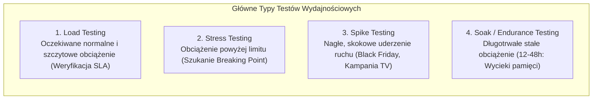
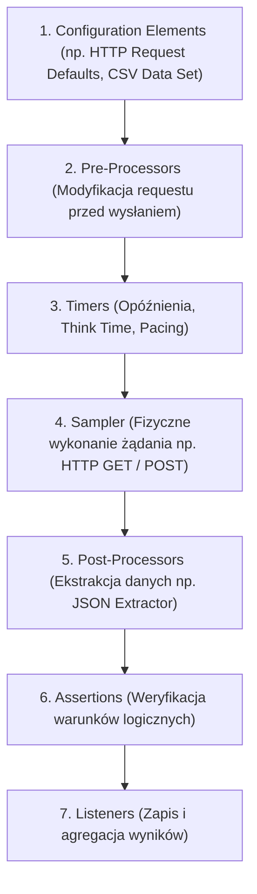
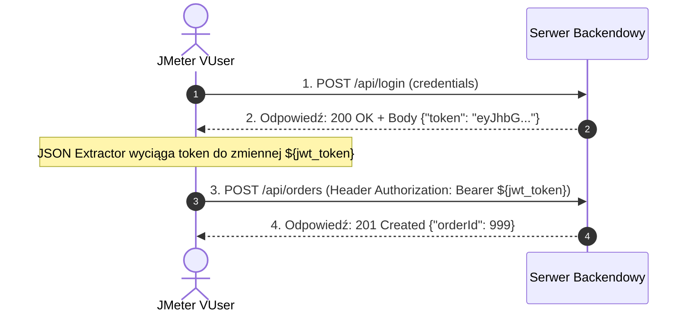

# Apache JMeter: Testy Wydajnościowe, Skalowanie i Pytania Rekrutacyjne

Kompleksowy przewodnik inżynierski po testowaniu wydajnościowym, obciążeniowym i odpornościowym za pomocą narzędzia **Apache JMeter**. Obejmuje metodologię inżynierii wydajności (SLA, percentyle, Coordinated Omission), architekturę planu testów, niskopoziomowe skryptowanie z silnikiem JSR223 i językiem Groovy, konfigurację środowisk rozproszonych (**Distributed / Master-Slave Testing**), strojenie maszyny wirtualnej JVM oraz zestaw zaawansowanych pytań rekrutacyjnych i scenariuszy awaryjnych (od poziomu Mid do Performance Test Lead / Architect).

---

## Spis Treści
1. [Metodologia Testowania Wydajnościowego](#1-metodologia-testowania-wydajnościowego)
   - Rodzaje testów: Load, Stress, Spike, Soak (Endurance), Scalability
   - Kluczowe metryki: Latency, Response Time, Throughput (RPS/TPS), Error Rate
   - Pułapka statystyczna: Dlaczego średnia kłamie? (Percentyle p90, p95, p99)
   - Zjawisko Pominięcia Koordynowanego (Coordinated Omission)
2. [Architektura i Hierarchia Elementów w Apache JMeter](#2-architektura-i-hierarchia-elementów-w-apache-jmeter)
   - Kolejność wykonywania elementów (Scoping Rules)
   - Thread Groups: Threads, Ramp-Up Period, Loop Count
   - Samplers, Configuration Elements, Timers (Think Time & Pacing)
   - Pre-Processors, Post-Processors (Extractors) i Assertions
   - Listeners i ich destrukcyjny wpływ na pamięć RAM
3. [Zaawansowane Skryptowanie: JSR223 i Język Groovy](#3-zaawansowane-skryptowanie-jsr223-i-język-groovy)
   - Dlaczego BeanShell to antywzorzec wydajnościowy?
   - Obiekty wbudowane w Groovy (`vars`, `props`, `prev`, `ctx`)
   - Korelacja danych w czasie rzeczywistym (Tokeny JWT, sesje, CSRF)
4. [Dobre Praktyki Uruchomieniowe i Strojenie JVM](#4-dobre-praktyki-uruchomieniowe-i-strojenie-jvm)
   - Żelazna zasada: Tylko tryb wiersza poleceń (**Non-GUI Mode / CLI**)
   - Strojenie sterty Java (`-Xms`, `-Xmx`) i Garbage Collectora (G1GC)
   - Generowanie interaktywnych dashboardów HTML w locie
5. [Testy Rozproszone (Distributed / Master-Slave Testing)](#5-testy-rozproszone-distributed--master-slave-testing)
   - Kiedy jedna maszyna generatora nie wystarcza?
   - Architektura Master-Slave przez protokół RMI
   - Dystrybucja danych testowych (CSV) pomiędzy węzłami wstrzykującymi
6. [Pytania Rekrutacyjne z Odpowiedziami (FAQ Interview)](#6-pytania-rekrutacyjne-z-odpowiedziami-faq-interview)
   - Pytania Podstawowe i Średniozaawansowane (Mid)
   - Pytania Zaawansowane i Architektoniczne (Senior / Performance Lead)
   - Scenariusze Awaryjne i Live-fire Troubleshooting
7. [Tablica Szybkiej Powtórki (Cheat-Sheet)](#7-tablica-szybkiej-powtórki-cheat-sheet)

---

## 1. Metodologia Testowania Wydajnościowego

Testy wydajnościowe nie służą do weryfikacji poprawności pojedynczych funkcji biznesowych, lecz do zbadania zachowania systemu pod kątem **szybkości, skalowalności, stabilności i zużycia zasobów** (CPU, RAM, sieć, I/O bazy danych).



### 1. Podstawowe profile obciążenia:
* **Load Testing:** Weryfikuje, czy system spełnia założenia **SLA (Service Level Agreement)** przy typowym i szczytowym obciążeniu produkcyjnym (np. 1500 równoległych użytkowników).
* **Stress Testing:** Systematyczne zwiększanie obciążenia aż do wystąpienia awarii (**Breaking Point**). Pozwala sprawdzić, jak system się zachowuje w warunkach przeciążenia (czy ulega graceful degradation, czy bezwzględnemu crashowi) oraz jak szybko wraca do zdrowia po ustąpieniu szczytu.
* **Spike Testing:** Bada odporność na nagłe, kilkukrotne skoki ruchu w ułamku sekundy i sprawdza, czy auto-skalowanie (np. HPA w Kubernetes) nadąża za przyrostem zapytań.
* **Soak Testing (Endurance):** Wykonywany przez kilkanaście lub kilkadziesiąt godzin. Kluczowy do wykrywania **wycieków pamięci (Memory Leaks)**, wyczerpywania puli połączeń do bazy danych, czy zapełniania buforów dyskowych.

---

### Metryki Wydajnościowe i Pułapka Średniej
* **Latency (Opóźnienie sieciowe):** Czas od wysłania żądania do odebrania pierwszego bajtu odpowiedzi (**TTFB — Time to First Byte**).
* **Response Time (Czas odpowiedzi):** Całkowity czas od rozpoczęcia wysyłania żądania do pełnego pobrania ostatniego bajtu odpowiedzi.
* **Throughput (Przepustowość):** Liczba operacji obsłużonych w jednostce czasu (**RPS — Requests Per Second** lub **TPS — Transactions Per Second**).

#### Dlaczego średnia arytmetyczna (Average) jest kłamstwem statystycznym?
Jeśli 95 użytkowników otrzymało odpowiedź w 100 ms, a 5 użytkowników czekało 10 sekund (np. z powodu pauzy Garbage Collectora lub locka w bazie danych):
$$\text{Średnia} = \frac{95 \times 0.1\text{ s} + 5 \times 10\text{ s}}{100} = 0.595\text{ s} \approx 600\text{ ms}$$
Raport ze średnią 600 ms sugeruje poprawny stan systemu, podczas gdy **5% klientów doświadczyło dramatycznego 10-sekundowego zawieszenia!**
* **Złoty standard:** Zawsze analizuj **Percentyle (Percentiles)**:
  - **p90 / p95:** 90% lub 95% użytkowników otrzymało odpowiedź w czasie krótszym lub równym tej wartości.
  - **p99 / p99.9:** Wskaźnik dla najbardziej pechowych transakcji (wykrywa mikro-przestoje, zacięcia I/O i blokady).

---

### Zjawisko Pominięcia Koordynowanego (Coordinated Omission)
Pojęcie ukute przez Gila Tene. Występuje, gdy narzędzie testujące (generator obciążenia) generuje ruch w sposób synchroniczny i blokujący:
* Jeśli serwer nagle zwolni i zamiast odpowiadać w 100 ms, odpowiada przez 10 sekund, wątki JMeter zawieszają się na oczekiwaniu na odpowiedź.
* W tym czasie JMeter **nie wysyła kolejnych zaplanowanych żądań**, sztucznie odciążając badany serwer!
* W rezultacie raport testowy rejestruje zaledwie jedno długie żądanie zamiast setek żądań, które w realnym świecie utworzyłyby gigantyczną kolejkę i doprowadziły do lawinowej awarii.

---

## 2. Architektura i Hierarchia Elementów w Apache JMeter

Plan testów w JMeterze (**Test Plan**) ma strukturę drzewiastą. Kolejność wykonywania elementów nie zależy wyłącznie od ich ułożenia na ekranie, lecz od ich **roli w hierarchii (Scoping Rules)**:



### Podstawowe Komponenty Planu Testów:
1. **Thread Group (Grupa Wątków):**
   - Reprezentuje pulę wirtualnych użytkowników (Virtual Users).
   - **Number of Threads (Users):** Liczba równoległych wątków.
   - **Ramp-Up Period (seconds):** Czas, w jakim JMeter ma stopniowo uruchomić wszystkie wątki (np. 100 wątków w Ramp-Up 50s oznacza uruchamianie 2 wątków na sekundę). Zapobiega nienaturalnemu uderzeniu całego ruchu w milisekundzie zero.
   - **Loop Count:** Liczba powtórzeń pętli lub czas trwania testu (**Duration**).
2. **Samplers:** Elementy generujące rzeczywisty ruch sieciowy (np. `HTTP Request`, `JDBC Request`, `JMS Publisher`, `TCP Sampler`).
3. **Timers (Pacing & Think Time):**
   - **Think Time:** Czas, w którym człowiek czyta stronę przed kolejnym kliknięciem (`Gaussian Random Timer` / `Uniform Random Timer`).
   - **Pacing:** Kontrola częstotliwości uderzeń na sekundę na poziomie wątku (`Constant Throughput Timer` lub nowoczesny `Precise Throughput Timer`).
4. **Post-Processors (Ekstraktory):** Pobierają dane z odpowiedzi i zapisują je do zmiennych:
   - `JSON Extractor`: Pobiera wartości ścieżkami JSONPath (np. `$.data.token`).
   - `Boundary Extractor`: Ekstremalnie szybki ekstraktor operujący na znakach lewych i prawych (dużo szybszy niż Regex).
5. **Listeners (Odbiorniki Wyników):**
   - Komponenty zbierające metryki (`View Results Tree`, `Aggregate Report`).
   - > [!CAUTION]
     > **Listeners generują ogromny narzut pamięciowy.** Trzymanie `View Results Tree` podczas testu obciążeniowego natychmiast doprowadzi do błędu `OutOfMemoryError: Java heap space`.

---

## 3. Zaawansowane Skryptowanie: JSR223 i Język Groovy

Gdy standardowe elementy JMeter nie wystarczają do obsłużenia skomplikowanej logiki biznesowej (np. szyfrowanie HMAC payloadu, generowanie unikalnych danych per wątek, podpisywanie zapytań), stosuje się komponenty skryptowe **JSR223**.

### Dlaczego BeanShell jest antywzorcem?
W starszych poradnikach często spotyka się `BeanShell Sampler / PreProcessor`.
* **BeanShell:** Jest archaicznym interpreterem Javy. Każde wywołanie wymaga ponownego parsowania kodu, co pożera 90% CPU maszyny testującej, zniekształcając wyniki testu.
* **JSR223 z silnikiem Groovy:** Kompiluje kod do natywnego bajtkodu JVM i zachowuje go w pamięci podręcznej (**Compilation Cache**). Działa z prędkością zbliżoną do czystej skompilowanej Javy!

---

### Wbudowane Obiekty w Skryptach Groovy:
W skryptach JSR223 dostępne są predefiniowane zmienne systemowe:

```groovy
// 1. 'vars' (JMeterVariables): Dostęp do zmiennych lokalnych bieżącego wątku
String userToken = vars.get("authToken")
vars.put("orderId", "12345")

// 2. 'props' (JMeterProperties): Zmienne globalne współdzielone przez WSZYSTKIE wątki i grupy wątków
props.put("GLOBAL_SESSION_ID", "session-xyz")

// 3. 'prev' (SampleResult): Dostęp do wyników ostatniego Samplera
if (prev.getResponseCode() == "200") {
    long latency = prev.getLatency()
    prev.setResponseData("Zmodyfikowana odpowiedź", "UTF-8")
}

// 4. 'log': Rejestrowanie wpisów w pliku jmeter.log
log.info("Wątek ${ctx.getThreadNum()} zakończył krok autoryzacji.")
```

---

### Korelacja Danych w Praktyce (Dynamiczne Tokeny)



Brak korelacji danych to najczęstszy błąd początkujących: odtworzenie nagranego wcześniej scenariusza z zahardcodowanym starym tokenem sesyjnym kończy się masowymi błędami `401 Unauthorized` lub `403 Forbidden`.

---

## 4. Dobre Praktyki Uruchomieniowe i Strojenie JVM

### Żelazna Zasada: Wyłącznie Tryb Wiersza Poleceń (CLI / Non-GUI)
Interfejs graficzny JMeter (GUI) służy **wyłącznie do tworzenia, nagrywania i debugowania skryptu `.jmx`**.
Uruchomienie testu obciążeniowego w trybie GUI powoduje, że silnik graficzny Java Swing konsumuje zasoby procesora i pamięci na renderowanie wykresów, zamiast generować ruch sieciowy.

#### Prawidłowe polecenie uruchomienia testu produkcyjnego:
```bash
jmeter -n -t /sciezka/do/test_plan.jmx -l /sciezka/do/results.jtl -e -o /sciezka/do/raport_html/
```
* `-n`: Uruchomienie w trybie Non-GUI.
* `-t`: Ścieżka do pliku Test Planu (`.jmx`).
* `-l`: Ścieżka do pliku surowych wyników (**JTL — JMeter Text Log / CSV**).
* `-e -o`: Automatyczne wygenerowanie bogatego, interaktywnego **raportu HTML Dashboard** po zakończeniu testu.

---

### Strojenie Pamięci Maszyny JVM
Domyślna konfiguracja JMeter w pliku `jmeter.bat` lub `jmeter.sh` przydziela zaledwie **1 GB sterty** (`-Xmx1g`). Przy teście na 5000 wątków prowadzi to do natychmiastowego OOM.

Przed testem należy wyeksportować zmienną środowiskową dopasowaną do pamięci RAM maszyny generatora:
```bash
# Ustawienie minimalnej i maksymalnej sterty na identyczną wartość (zapobiega alokacjom w locie):
export HEAP="-Xms4g -Xmx4g -XX:MaxMetaspaceSize=512m"

# Nowoczesny Garbage Collector redukujący pauzy STW:
export GC_ALGO="-XX:+UseG1GC -XX:MaxGCPauseMillis=100 -XX:G1ReservePercent=20"
```

---

## 5. Testy Rozproszone (Distributed / Master-Slave Testing)

Gdy docelowe obciążenie wymaga wygenerowania np. 50 000 zapytań na sekundę, pojedyncza maszyna uderza w limity systemowe:
* Wyczerpanie procesora lub pamięci RAM generatora.
* Wyczerpanie puli tymczasowych portów TCP (**Ephemeral Ports limit** $\approx 65535$).
* Zniekształcenie wyników (opóźnienia wynikające z kolejkowania w stosie sieciowym generatora, a nie z serwera).

```mermaid
flowchart TD
    Master["JMeter Master (Koordynator)\nUruchamiany poleceniem CLI\nNie generuje ruchu, tylko zbiera metryki"]
    
    subgraph Slaves["JMeter Server (Slaves / Injectors)"]
        Slave1["Slave Node 1 (IP: 10.0.1.1)\nGeneruje 10 000 VUsers"]
        Slave2["Slave Node 2 (IP: 10.0.1.2)\nGeneruje 10 000 VUsers"]
        Slave3["Slave Node 3 (IP: 10.0.1.3)\nGeneruje 10 000 VUsers"]
    end

    Master -->|Protokół RMI (wysyła skrypt .jmx)| Slave1
    Master -->|Protokół RMI (wysyła skrypt .jmx)| Slave2
    Master -->|Protokół RMI (wysyła skrypt .jmx)| Slave3
    
    Slave1 & Slave2 & Slave3 -->|Rzeczywiste uderzenie ruchem HTTP/S| Target["Aplikacja Testowana (SUT)"]
    Slave1 & Slave2 & Slave3 -.->|Zwracanie próbek wyników| Master
```

### Konfiguracja i Dobre Praktyki:
1. **Synchronizacja plików CSV:** Master wysyła przez RMI wyłącznie kod skryptu `.jmx`. Pliki z danymi testowymi (`users.csv`) **muszą zostać wcześniej fizycznie skopiowane na każdy węzeł Slave** w identycznej ścieżce dyskowej!
2. **Identyczna wersja Javy i JMetera:** Wszystkie węzły muszą działać pod kontrolą dokładnie tej samej wersji JVM oraz Apache JMeter.
3. **Uruchomienie:**
   - Na węzłach Slave: `jmeter-server`.
   - Na Masterze: `jmeter -n -t test.jmx -R 10.0.1.1,10.0.1.2,10.0.1.3 -l results.jtl`.

---

## 6. Pytania Rekrutacyjne z Odpowiedziami (FAQ Interview)

### Pytania Podstawowe i Średniozaawansowane (Mid)

#### P1: Czym różni się Load Testing od Stress Testingu?
**Odpowiedź:**
* **Load Testing (Testy Obciążeniowe):** Symulują oczekiwane, produkcyjne natężenie ruchu (zarówno średnie, jak i szczytowe, np. ruch w godzinach 12:00-14:00). Celem jest weryfikacja, czy system spełnia wymagania biznesowe i czasy odpowiedzi zdefiniowane w umowie **SLA** (np. 95% zapytań poniżej 500 ms).
* **Stress Testing (Testy Przeciążeniowe / Stresowe):** Polegają na ciągłym zwiększaniu obciążenia daleko poza granice założeń projektowych. Celem jest znalezienie wąskiego gardła (**Bottleneck**) oraz punktu załamania systemu (**Breaking Point**), a także weryfikacja stabilności — czy system po przekroczeniu limitu zwraca błędy `429` / `503`, czy ulega całkowitej awarii z uszkodzeniem danych.

---

#### P2: Dlaczego w testach wydajnościowych percentyle (p90, p95, p99) są ważniejszą metryką niż średni czas odpowiedzi (Average)?
**Odpowiedź:**
Średnia arytmetyczna jest podatna na zniekształcenia statystyczne. Jeśli większość zapytań wykonuje się błyskawicznie, a niewielki procent (np. 3%) doświadcza ogromnych opóźnień (np. 15 sekund z powodu blokady w bazie danych), średnia nadal może wyglądać akceptowalnie.
Percentyl **p95** oznacza, że dokładnie 95% wszystkich zapytań wykonało się w czasie równym lub krótszym niż wskazana wartość. Daje to precyzyjną informację o realnym doświadczeniu użytkowników końcowych i pozwala wyłapać anomalie i mikro-przestoje ukrywane przez średnią.

---

#### P3: Co to jest Ramp-Up Period i dlaczego nie należy ustawiać go na 0 w dużych testach?
**Odpowiedź:**
* **Ramp-Up Period:** To czas w sekundach, w którym JMeter ma stopniowo zainicjalizować i uruchomić wszystkie zadeklarowane wątki (Virtual Users).
* Ustawienie Ramp-Up na 0 przy 2000 wątków oznacza, że w pierwszej milisekundzie testu JMeter spróbuje otworzyć 2000 jednoczesnych połączeń TCP. Taki impuls wywoła sztuczny szok w infrastrukturze (odrzucenie połączeń przez systemowy bufor SYN flood, timeouty połączenia), który nie odzwierciedla realnego ruchu ludzkiego. Właściwy Ramp-Up pozwala na rozgrzanie pamięci podręcznej i stopniowe wejście systemu w stan stabilnego obciążenia.

---

### Pytania Zaawansowane i Architektoniczne (Senior / Performance Lead)

#### P4: Czym jest zjawisko Coordinated Omission i w jaki sposób może sfałszować wyniki testu obciążeniowego w JMeterze?
**Odpowiedź:**
Zjawisko Pominięcia Koordynowanego występuje, gdy generator obciążenia czeka na zakończenie bieżącego żądania przed wysłaniem kolejnego (model synchroniczny / zamknięty):
1. Załóżmy, że test planuje wysyłać zapytanie co 100 ms.
2. Nagle serwer zawiesza się na 10 sekund (np. Full GC pause).
3. Wątek w JMeterze blokuje się na 10 sekund. W tym czasie powinien był wysłać 100 kolejnych zapytań, ale **żadnego z nich nie wysłał**.
4. W raporcie testowym odnotowana zostaje tylko jedna próbka o czasie 10 sekund. Setki próbek, które w realnym świecie czekałyby w kolejce z czasami 9.9s, 9.8s itd., w ogóle nie trafiają do statystyk.
5. W efekcie raport drastycznie zaniża rzeczywiste opóźnienia i zawyża postrzeganą przepustowość systemu.

---

#### P5: Dlaczego w skryptach JMeter należy bezwzględnie unikać BeanShella na rzecz JSR223 z silnikiem Groovy?
**Odpowiedź:**
* **BeanShell:** Jest starym interpreterem, który interpretuje kod Java-podobny linijka po linijce przy każdym wykonaniu próbki. Przy obciążeniu rzędu tysięcy próbek na sekundę BeanShell alokuje gigabajty obiektów na stercie i zużywa 80-90% CPU maszyny testującej, stając się wąskim gardłem testu.
* **JSR223 z Groovy:** Groovy kompiluje skrypt bezpośrednio do natywnego bajtkodu maszyny JVM. Przy zaznaczonej opcji **`Cache compiled script if available`**, skrypt jest kompilowany raz podczas pierwszego uruchomienia i wielokrotnie wykonywany z prędkością kodu natywnego, nie obciążając procesora generatora.

---

#### P6: Jak zasymulować realistyczne zachowanie użytkowników za pomocą mechanizmów Pacing i Think Time?
**Odpowiedź:**
* **Think Time (Czas myślenia):** Symuluje czas, jaki człowiek spędza na zapoznaniu się z treścią ekranu przed kliknięciem w kolejny link (np. czytanie opisu produktu). Realizuje się go za pomocą `Gaussian Random Timer` lub `Uniform Random Timer` wstawianego pomiędzy Samplerami.
* **Pacing (Tempo transakcji):** Kontroluje całkowity czas trwania pełnej iteracji biznesowej (np. jedna transakcja zakupu na 60 sekund). Jeśli kroki transakcji wykonają się w 15 sekund, mechanizm Pacing uśpi wątek na pozostałe 45 sekund przed rozpoczęciem kolejnej pętli. Gwarantuje to stałą, przewidywalną liczbę operacji na minutę (**RPS/TPS**) niezależnie od tego, czy system odpowiada szybciej, czy wolniej. W nowoczesnym JMeterze realizuje to m.in. **Precise Throughput Timer**.

---

### Scenariusze Awaryjne i Live-fire Troubleshooting

#### Scenariusz 1: Podczas testu obciążeniowego czasy odpowiedzi w raporcie JMeter gwałtownie rosną z 200 ms do 15 sekund, ale monitoring serwera backendowego pokazuje użycie CPU na poziomie zaledwie 8% i brak kolejek w bazie danych. Gdzie leży problem?
**Diagnoza i Plan Naprawczy:**
1. **Lokalizacja wąskiego gardła:** Niski stan zużycia zasobów na serwerze i wysokie czasy na kliencie wskazują, że **wąskim gardłem jest sama maszyna generatora obciążenia (JMeter)!**
2. **Weryfikacja generatora:**
   - Sprawdzenie CPU maszyny z JMeterem: czy proces Java zużywa 100% CPU (np. przez skrypty BeanShell lub parsowanie ciężkich wyrażeń regularnych)?
   - Sprawdzenie pamięci: czy JVM nie wpadł w pętlę ciągłego czyszczenia pamięci (**GC Thrashing**)?
   - Weryfikacja gniazd sieciowych: wyczerpanie portów tymczasowych (**Socket Exhaustion / TIME_WAIT**).
3. **Kroki naprawcze:**
   - Wyłączenie wszystkich listenerów GUI.
   - Włączenie mechanizmu HTTP Keep-Alive w samplerach (ponowne wykorzystywanie połączeń TCP).
   - Przeniesienie testu na architekturę rozproszoną (Distributed Master-Slave) w celu podziału generowania ruchu na kilka mniejszych maszyn.

---

#### Scenariusz 2: Długo działający test typu Soak Test (24h) przerywa działanie po 4 godzinach z błędem `java.lang.OutOfMemoryError: Java heap space`.
**Diagnoza i Rozwiązanie:**
1. **Analiza przyczyny:** W skrypcie pozostawiono włączony listener zapisujący pełne odpowiedzi do pamięci RAM (np. `View Results Tree` lub `Simple Data Writer` logujący wszystkie nagłówki i body).
2. **Kroki naprawcze:**
   - Bezwzględne wyłączenie lub usunięcie komponentu `View Results Tree` z planu testów.
   - Ograniczenie zapisywanych danych w pliku JTL: zmiana konfiguracji w `jmeter.properties`:
     ```properties
     jmeter.save.saveservice.response_data=false
     jmeter.save.saveservice.samplerData=false
     jmeter.save.saveservice.responseHeaders=false
     ```
   - Zwiększenie sterty JVM przed uruchomieniem: `export HEAP="-Xms8g -Xmx8g"`.

---

## 7. Tablica Szybkiej Powtórki (Cheat-Sheet)

| Zagadnienie | Słowa Kluczowe i Niskopoziomowe Koncepcje |
| :--- | :--- |
| **Typy Testów** | Load (SLA), Stress (Breaking Point), Spike (skoki ruchu), Soak (długodystansowy, memory leaks) |
| **Metryki** | Response Time, Latency (TTFB), Throughput (RPS/TPS), Percentyle (p90, p95, p99 vs kłamstwo średniej) |
| **Błędy Pomiaru** | Coordinated Omission (blokowanie wątków ukrywające opóźnienia), Socket Exhaustion |
| **Hierarchia Testu** | Thread Group $\rightarrow$ Config $\rightarrow$ Pre-Proc $\rightarrow$ Timers $\rightarrow$ Sampler $\rightarrow$ Post-Proc $\rightarrow$ Assertions $\rightarrow$ Listeners |
| **Uruchamianie** | **Tylko tryb CLI**: `jmeter -n -t test.jmx -l results.jtl -e -o /raport_html` |
| **Skryptowanie** | **Tylko JSR223 + Groovy** (kompilacja do bajtkodu), obiekty `vars`, `props`, `prev`, `ctx` (unikać BeanShella) |
| **Zrównoleglenie** | Distributed Testing: 1 Master (koordynacja RMI) + $N$ Slaves (generatory ruchu), synchronizacja CSV |
| **Strojenie JVM** | Zwiększenie sterty (`-Xms4g -Xmx4g`), Garbage Collector G1GC (`-XX:+UseG1GC`) |
