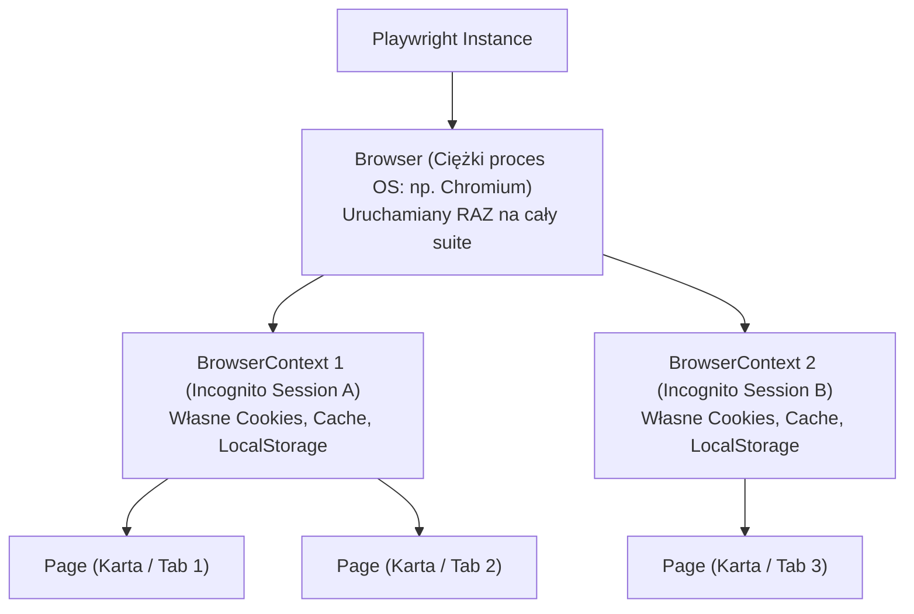
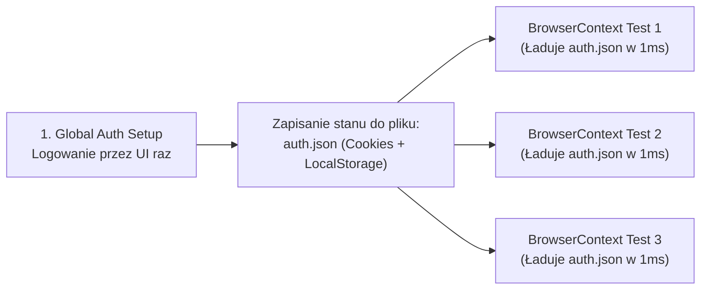

# Playwright w C# i Java: Architektura, Wzorce E2E i Pytania Rekrutacyjne

Kompleksowe kompendium inżynierskie poświęcone frameworkowi **Microsoft Playwright** — wiodącemu narzędziu nowej generacji do automatyzacji testów przeglądarkowych End-to-End (E2E) oraz testów API. Artykuł szczegółowo omawia implementację w językach **C# (.NET)** oraz **Java**, architekturę komunikacji przez WebSocket/CDP, hierarchię BrowserContext, mechanikę Auto-waiting, Page Object Model, mockowanie sieci, narzędzie Trace Viewer oraz zestaw zaawansowanych pytań rekrutacyjnych i scenariuszy awaryjnych (od poziomu Mid do Lead / QA Automation Architect).

---

## Spis Treści
1. [Ewolucja Automatyzacji: Dlaczego Playwright Zastąpił Selenium?](#1-ewolucja-automatyzacji-dlaczego-playwright-zastąpił-selenium)
   - Ograniczenia architektury W3C WebDriver (HTTP Polling)
   - Architektura Playwright: Pojedyncze, dwukierunkowe połączenie WebSocket / CDP
   - Wsparcie dla trzech silników: Chromium, Firefox, WebKit
2. [Niskopoziomowa Architektura: Browser, BrowserContext i Page](#2-niskopoziomowa-architektura-browser-browsercontext-i-page)
   - Hierarchia obiektowa
   - `BrowserContext` jako fundament błyskawicznej izolacji (Multi-tenancy w milisekundy)
   - Komunikacja międzyjęzykowa: Jak C# i Java sterują driverem Node.js (JSON-RPC)
3. [Mechanika Niezawodności: Auto-Waiting i Web-First Assertions](#3-mechanika-niezawodności-auto-waiting-i-web-first-assertions)
   - Koniec z `Thread.sleep()`: Wewnętrzne testy gotowości akcji (Actionability Checks)
   - Nowoczesne lokatory zorientowane na użytkownika (User-Facing / a11y Locators)
   - Asynchroniczne asercje z automatycznym ponawianiem (Web-First Assertions)
4. [Playwright w Ekosystemie C# (.NET)](#4-playwright-w-ekosystemie-c-net)
   - Instalacja i konfiguracja z NUnit / xUnit
   - Bazowa klasa `PageTest` i natywny `async/await`
   - Implementacja Page Object Model (POM) w C#
   - Nagrywanie śladów awarii za pomocą Trace Viewera
5. [Playwright w Ekosystemie Java](#5-playwright-w-ekosystemie-java)
   - Model synchroniczny Playwright Java
   - Integracja z TestNG i bezpieczne zrównoleglenie (`ThreadLocal`)
   - Page Object Model z Fluent Interface w Java
6. [Zaawansowane Techniki: Sieć, Storage State i API Testing](#6-zaawansowane-techniki-sieć-storage-state-i-api-testing)
   - Przechwytywanie i mockowanie ruchu sieciowego (Network Interception / Routing)
   - Autoryzacja bez logowania w UI (Wzorzec Storage State)
   - Testowanie API bez przeglądarki (`APIRequestContext`)
7. [Pytania Rekrutacyjne z Odpowiedziami (FAQ Interview)](#7-pytania-rekrutacyjne-z-odpowiedziami-faq-interview)
   - Pytania Podstawowe i Średniozaawansowane (Mid)
   - Pytania Zaawansowane i Architektoniczne (Senior / Automation Lead)
   - Scenariusze Awaryjne i Live-fire Troubleshooting
8. [Tablica Szybkiej Powtórki (Cheat-Sheet)](#8-tablica-szybkiej-powtórki-cheat-sheet)

---

## 1. Ewolucja Automatyzacji: Dlaczego Playwright Zastąpił Selenium?

Przez ponad 15 lat standardem automatyzacji było **Selenium WebDriver**. Wraz z nadejściem dynamicznych aplikacji Single Page Applications (React, Angular, Vue), architektura Selenium ujawniła fundamentalne ograniczenia wydajnościowe i stabilnościowe.

```mermaid
flowchart TD
    subgraph SeleniumArch["Architektura Selenium WebDriver (Tradycyjna)"]
        direction TB
        SelCode["Kod Testu (C# / Java)"] -->|Każde polecenie to osobne HTTP POST| Driver["ChromeDriver / GeckoDriver\n(HTTP Server)"]
        Driver -->|Translacja W3C| Browser1["Przeglądarka\n(DOM)"]
        Browser1 -.->|Odpowiedź JSON HTTP| Driver
        Driver -.->|Status HTTP 200| SelCode
    end

    subgraph PlaywrightArch["Architektura Playwright (Nowoczesna)"]
        direction TB
        PlayCode["Kod Testu (C# / Java)"] -->|JSON-RPC via Stdin/Stdout| DriverNode["Playwright Driver (Node.js)"]
        DriverNode <-->|Jedno ciągłe, dwukierunkowe połączenie\nWEBSOCKET (CDP / BiDi)| Browser2["Silnik Przeglądarki\n(Chromium / Firefox / WebKit)"]
    end
```

### Porównanie Architektoniczne
| Cecha | Selenium WebDriver | Microsoft Playwright |
| :--- | :--- | :--- |
| **Protokół komunikacji** | Bezstanowy protokół HTTP (W3C WebDriver) | **Dwukierunkowy WebSocket (CDP / BiDi Protocol)** |
| **Zarządzanie czasem** | Konieczność ręcznych `WebDriverWait` | **Natywne Auto-waiting przed każdą akcją** |
| **Izolacja testów** | Uruchomienie nowej instancji przeglądarki (sekundy) | **Lekki `BrowserContext` (milisekundy)** |
| **Śledzenie zdarzeń przeglądarki**| Ograniczone (wymaga zewnętrznych proxy jak BrowserMob)| **Natywne przechwytywanie sieci, konsoli, workerów** |
| **Narzędzia diagnostyczne** | Podstawowe zrzuty ekranu i logi | **Interaktywny Trace Viewer (nagranie DOM + Network + Video)** |
| **Wsparcie dla silników** | Zależne od zainstalowanych przeglądarek w systemie | **Wbudowane silniki: Chromium, Firefox i WebKit** |

---

## 2. Niskopoziomowa Architektura: Browser, BrowserContext i Page

Hierarchia obiektowa Playwright została zaprojektowana z myślą o maksymalnej wydajności i bezkompromisowej izolacji:



1. **`Browser`:** Fizyczny proces przeglądarki uruchomiony w systemie operacyjnym. Jego uruchomienie jest kosztowne (zajmuje 1-3 sekundy i wymaga pamięci RAM).
2. **`BrowserContext` (Game Changer):**
   - Całkowicie odizolowana sesja incognito wewnątrz uruchomionego już procesu `Browser`.
   - Utworzenie nowego `BrowserContext` trwa **ułamki milisekund** i zużywa znikome ilości pamięci.
   - Posiada własne ciasteczka, `localStorage`, `sessionStorage` oraz cache. Dwa konteksty nie mają ze sobą żadnego punktu styku.
   - Umożliwia testowanie scenariuszy wieloużytkownikowych (np. czat w czasie rzeczywistym między Użytkownikiem A i Użytkownikiem B na dwóch kartach w osobnych kontekstach w jednym teście).
3. **`Page`:** Pojedyncza karta lub okno przeglądarki w ramach danego kontekstu.

### Komunikacja Międzyjęzykowa (Jak C# i Java sterują Playwrightem?)
Oficjalny silnik Playwright jest napisany w języku TypeScript i działa w środowisku Node.js.
Gdy korzystasz z biblioteki Playwright w **C# (.NET)** lub **Java**:
* Podczas pierwszego uruchomienia biblioteka uruchamia w tle lekki proces binarny sterownika Playwright.
* Kod w C# lub Javie komunikuje się ze sterownikiem za pomocą wewnętrznego protokołu **JSON-RPC** przesyłanego przez standardowe strumienie wejścia/wyjścia (`stdin`/`stdout`).
* Gwarantuje to identyczne zachowanie API, natychmiastowy dostęp do nowych funkcji i stuprocentową niezawodność niezależnie od języka programowania.

---

## 3. Mechanika Niezawodności: Auto-Waiting i Web-First Assertions

Głównym źródłem "migoczących testów" (**Flaky Tests**) w starych frameworkach były błędy typu `ElementNotInteractableException` lub `StaleElementReferenceException`.

### Badanie Zdolności do Działania (Actionability Checks)
W Playwright przed wykonaniem jakiejkolwiek akcji (np. `click()`, `fill()`, `check()`), framework automatycznie przeprowadza serię weryfikacji w pętli zdarzeń przeglądarki:

```mermaid
flowchart TD
    Action["Wywołanie: locator.ClickAsync()"] --> C1{"1. Czy element jest w DOM?\n(Attached)"}
    C1 -->|TAK| C2{"2. Czy element jest widoczny?\n(Visible: nie-ukryty, >0px)"}
    C2 -->|TAK| C3{"3. Czy element jest stabilny?\n(Stable: brak animacji CSS/JS)"}
    C3 -->|TAK| C4{"4. Czy odbiera zdarzenia?\n(Receives Events: nieprzykryty)"}
    C4 -->|TAK| C5{"5. Czy jest aktywny?\n(Enabled: brak atrybutu disabled)"}
    C5 -->|TAK| ExecClick["FIZYCZNE KLIKNIĘCIE W ELEMENT\n(Wygenerowanie zdarzenia PointerEvent)"]
    
    C1 & C2 & C3 & C4 & C5 -.->|NIE (Czekaj do 30s)| Action
```

Dopiero gdy wszystkie warunki zostaną spełnione w tym samym ułamku sekundy, Playwright generuje fizyczne zdarzenie. Eliminuje to 99% konieczności stosowania jawnych oczekiwań.

---

### Lokatory Zorientowane na Użytkownika (User-Facing Locators)
Playwright odradza używanie kruchych selektorów CSS i XPath (podatnych na zmiany w kodzie frontendowym). Zamiast tego promuje lokatory oparte na dostępności cyfrowej (**a11y**):

```csharp
// ❌ KIEPSKA PRAKTYKA (Podatne na zmiany w HTML/CSS):
await Page.Locator("div.btn-wrapper > button.submit-btn").ClickAsync();
await Page.Locator("//*[@id='app']/div[2]/form/input[1]").FillAsync("admin");

// ✅ NAJLEPSZA PRAKTYKA (Zgodna ze standardami WCAG i a11y):
// Szuka przycisku o widocznej dla człowieka roli i nazwie:
await Page.GetByRole(AriaRole.Button, new() { Name = "Zaloguj się" }).ClickAsync();

// Szuka pola skojarzonego z etykietą tekstową:
await Page.GetByLabel("Adres e-mail").FillAsync("admin@example.com");

// Szuka po tekście zastępczym (placeholder):
await Page.GetByPlaceholder("Wprowadź hasło").FillAsync("TajneHaslo123");

// Identyfikatory testowe dedykowane dla QA (gdy brak roli a11y):
await Page.GetByTestId("shopping-cart-badge").ClickAsync();
```

---

## 4. Playwright w Ekosystemie C# (.NET)

W .NET Playwright jest w pełni asynchroniczny i zintegrowany ze środowiskiem **async/await**.

### Integracja z NUnit i Klasa Bazowa `PageTest`
Oficjalny pakiet `Microsoft.Playwright.NUnit` dostarcza klasę bazową `PageTest`, która automatycznie zarządza cyklem życia przeglądarki, kontekstu i strony:

```csharp
using Microsoft.Playwright;
using Microsoft.Playwright.NUnit;
using NUnit.Framework;

namespace AutomationTests.DotNet;

[Parallelizable(ParallelScope.Self)]
[TestFixture]
public class LoginTests : PageTest
{
    [Test]
    public async Task ValidUser_ShouldLoginSuccessfully()
    {
        // 'Page' jest wstrzykiwane i czyszczone automatycznie per test!
        await Page.GotoAsync("https://sklep-demo.pl/login");

        // Lokatory i akcje
        await Page.GetByLabel("Email").FillAsync("tester@company.com");
        await Page.GetByLabel("Hasło").FillAsync("SecureP@ss123");
        await Page.GetByRole(AriaRole.Button, new() { Name = "Zaloguj" }).ClickAsync();

        // Web-First Assertion z automatycznym ponawianiem (Auto-retry)
        var welcomeHeader = Page.GetByRole(AriaRole.Heading, new() { Name = "Witaj w panelu" });
        await Expect(welcomeHeader).ToBeVisibleAsync();
    }
}
```

---

### Implementacja Page Object Model (POM) w C#

```csharp
public class LoginPage
{
    private readonly IPage _page;
    private readonly ILocator _emailInput;
    private readonly ILocator _passwordInput;
    private readonly ILocator _submitButton;

    public LoginPage(IPage page)
    {
        _page = page;
        // Leniwa ewaluacja lokatorów (nie wyszukują w DOM dopóki nie wywołamy akcji)
        _emailInput = _page.GetByLabel("Email");
        _passwordInput = _page.GetByLabel("Hasło");
        _submitButton = _page.GetByRole(AriaRole.Button, new() { Name = "Zaloguj" });
    }

    public async Task NavigateAsync() => await _page.GotoAsync("/login");

    public async Task LoginAsync(string email, string password)
    {
        await _emailInput.FillAsync(email);
        await _passwordInput.FillAsync(password);
        await _submitButton.ClickAsync();
    }
}
```

---

### Diagnostyka: Narzędzie Trace Viewer
**Trace Viewer** to potężne narzędzie GUI pozwalające na inspekcję nagranego wykonania testu. Umożliwia przewijanie testu w czasie (Time-travel debugging), podgląd pełnego DOM w każdym kroku, zrzuty ekranu, ruch sieciowy oraz logi akcji:

```csharp
[SetUp]
public async Task SetupTracing()
{
    await Context.Tracing.StartAsync(new()
    {
        Screenshots = true,
        Snapshots = true,
        Sources = true
    });
}

[TearDown]
public async Task TearDownTracing()
{
    // Zapisujemy ślad TYLKO wtedy, gdy test zakończył się porażką!
    if (TestContext.CurrentContext.Result.Outcome.Status == NUnit.Framework.Interfaces.TestStatus.Failed)
    {
        var tracePath = $"traces/{TestContext.CurrentContext.Test.Name}.zip";
        await Context.Tracing.StopAsync(new() { Path = tracePath });
    }
}
```

---

## 5. Playwright w Ekosystemie Java

Podczas gdy C# wymusza `async/await`, API **Playwright Java** zostało zaprojektowane jako **synchroniczne i blokujące**. Wewnętrznie wywołania są asynchroniczne, lecz na poziomie kodu Java inżynier pisze czytelny, płaski kod sekwencyjny.

### Bezpieczne Zrównoleglenie w TestNG (`ThreadLocal`)
Ponieważ w TestNG testy mogą być uruchamiane równolegle na wielu wątkach, instancje `BrowserContext` i `Page` muszą być izolowane za pomocą **`ThreadLocal`**:

```java
package com.company.automation;

import com.microsoft.playwright.*;
import org.testng.annotations.*;

public class BaseTest {
    protected static Playwright playwright;
    protected static Browser browser;

    // ThreadLocal gwarantuje, że każdy wątek wykonawczy ma własną, odizolowaną sesję
    private static final ThreadLocal<BrowserContext> contextThreadLocal = new ThreadLocal<>();
    private static final ThreadLocal<Page> pageThreadLocal = new ThreadLocal<>();

    @BeforeSuite
    public void beforeAll() {
        playwright = Playwright.create();
        // Uruchamiamy proces przeglądarki RAZ na cały proces testowy
        browser = playwright.chromium().launch(new BrowserType.LaunchOptions().setHeadless(true));
    }

    @BeforeMethod
    public void createContextAndPage() {
        // Nowa, błyskawiczna sesja incognito per test!
        BrowserContext context = browser.newContext();
        Page page = context.newPage();
        
        contextThreadLocal.set(context);
        pageThreadLocal.set(page);
    }

    public Page getPage() {
        return pageThreadLocal.get();
    }

    @AfterMethod
    public void cleanup() {
        getPage().close();
        contextThreadLocal.get().close();
        pageThreadLocal.remove();
        contextThreadLocal.remove();
    }

    @AfterSuite
    public void tearDownAll() {
        browser.close();
        playwright.close();
    }
}
```

---

### Page Object Model z Fluent Interface w Java
Dzięki synchronicznemu API, w Javie wzorzec Page Object Model można elegancko zrealizować za pomocą łańcuchowania metod (Method Chaining):

```java
import com.microsoft.playwright.Page;
import com.microsoft.playwright.options.AriaRole;
import static com.microsoft.playwright.assertions.PlaywrightAssertions.assertThat;

public class InventoryPage {
    private final Page page;

    public InventoryPage(Page page) {
        this.page = page;
    }

    public InventoryPage addItemToCart(String itemName) {
        page.locator(".inventory-item")
            .filter(new Locator.FilterOptions().setHasText(itemName))
            .getByRole(AriaRole.BUTTON, new Locator.GetByRoleOptions().setName("Dodaj do koszyka"))
            .click();
        return this;
    }

    public InventoryPage verifyCartBadgeCount(int expectedCount) {
        assertThat(page.locator(".shopping-cart-badge"))
            .hasText(String.valueOf(expectedCount));
        return this;
    }
}
```

---

## 6. Zaawansowane Techniki: Sieć, Storage State i API Testing

### 1. Przechwytywanie i Mockowanie Ruchu Sieciowego (Network Interception)
Playwright pozwala na pełną kontrolę nad zapytaniami HTTP wychodzącymi z przeglądarki bez konieczności stawiania zewnętrznych serwerów mockujących:

```csharp
// Przykład C#: Wymuszenie błędu serwera 500 na konkretnym endpoincie API
await Page.RouteAsync("**/api/v1/payments", async route =>
{
    // Zamiast do prawdziwego backendu, zwracamy spreparowaną odpowiedź JSON:
    await route.FulfillAsync(new()
    {
        Status = 500,
        ContentType = "application/json",
        Body = "{\"error\": \"Bramka płatnicza niedostępna\"}"
    });
});

// Kliknięcie w UI wywoła mockowany błąd
await Page.GetByRole(AriaRole.Button, new() { Name = "Zapłać" }).ClickAsync();
await Expect(Page.GetByText("Bramka płatnicza niedostępna")).ToBeVisibleAsync();
```

---

### 2. Autoryzacja bez Logowania w UI (Wzorzec Storage State)
Logowanie przez formularz UI w każdym z 500 testów E2E marnuje godziny czasu pipeline'u CI/CD.
Playwright pozwala zalogować się raz, zapisać stan ciasteczek i pamięci podręcznej do pliku JSON, a następnie inicjalizować kolejne konteksty jako **natychmiast zalogowane**:



```csharp
// W teście przygotowawczym (Global Setup):
await Context.StorageStateAsync(new() { Path = "state/adminAuth.json" });

// W testach biznesowych (Inicjalizacja od razu zalogowanego kontekstu):
var loggedInContext = await Browser.NewContextAsync(new()
{
    StorageStatePath = "state/adminAuth.json"
});
var page = await loggedInContext.NewPageAsync();
await page.GotoAsync("/dashboard"); // Użytkownik jest natychmiast zalogowany!
```

---

### 3. Wbudowane Testy API (`APIRequestContext`)
Playwright umożliwia wykonywanie bezpośrednich zapytań HTTP REST bez konieczności uruchamiania przeglądarki (zastępując biblioteki takie jak RestSharp czy RestAssured):

```csharp
var apiContext = await Playwright.APIRequest.NewContextAsync(new()
{
    BaseURL = "https://api.sklep.pl"
});

var response = await apiContext.PostAsync("/api/users", new()
{
    DataObject = new { name = "Jan", role = "Admin" }
});

Assert.True(response.Ok);
var json = await response.JsonAsync();
```

---

## 7. Pytania Rekrutacyjne z Odpowiedziami (FAQ Interview)

### Pytania Podstawowe i Średniozaawansowane (Mid)

#### P1: Czym pod maską różni się architektura Playwright od Selenium WebDriver?
**Odpowiedź:**
* **Selenium WebDriver:** Wykorzystuje architekturę klient-serwer opartą na bezstanowym protokole HTTP (W3C WebDriver). Każda akcja testowa (kliknięcie, wpisanie tekstu) to osobny request HTTP POST do procesu sterownika (np. `chromedriver`), który tłumaczy go i przekazuje do przeglądarki. Wiąże się to ze znacznymi opóźnieniami sieciowymi i brakiem natywnego wglądu w asynchroniczne zdarzenia wewnątrz przeglądarki.
* **Playwright:** Komunikuje się z silnikiem przeglądarki za pośrednictwem **pojedynczego, dwukierunkowego połączenia WebSocket** przy użyciu niskopoziomowego protokołu Chrome DevTools Protocol (CDP w Chromium) lub natywnych protokołów w WebKit i Firefox. Pozwala to na natychmiastowe przesyłanie zdarzeń w czasie rzeczywistym, przechwytywanie ruchu sieciowego, sub-milisekundowe wykonywanie poleceń oraz wbudowany mechanizm Auto-waiting.

---

#### P2: Co to jest `BrowserContext` i dlaczego pozwala na drastyczne skrócenie czasu trwania testów E2E?
**Odpowiedź:**
* `BrowserContext` to odizolowany profil incognito działający wewnątrz pojedynczego procesu przeglądarki (`Browser`).
* W tradycyjnym podejściu (Selenium), aby zapewnić pełną czystość stanu między testami, należało zamknąć i uruchomić od nowa całą przeglądarkę, co trwało kilka sekund na każdy test.
* W Playwright proces przeglądarki uruchamia się raz na cały suite, a przed każdym testem tworzony jest nowy `BrowserContext`. Proces ten trwa **ułamki milisekund**, a gwarantuje w 100% czyste ciasteczka, pamięć `localStorage`, `sessionStorage` i cache.

---

#### P3: W jaki sposób mechanizm Auto-waiting zapobiega powstawaniu testów migoczących (Flaky Tests)?
**Odpowiedź:**
Zanim Playwright wywoła akcję na lokatorze (np. `locator.ClickAsync()`), automatycznie przeprowadza serię weryfikacji gotowości elementu (**Actionability Checks**):
1. Sprawdza, czy element jest dołączony do drzewa DOM (**Attached**).
2. Sprawdza, czy element jest widoczny na ekranie (**Visible** — nie ma `display: none`, ani wymiarów 0x0).
3. Sprawdza stabilność elementu (**Stable** — czy nie trwa animacja CSS lub przemieszczanie elementu).
4. Sprawdza, czy element przyjmuje zdarzenia wskaźnika (**Receives Events** — czy nie jest przysłonięty przez inny element, np. spinner ładowania).
5. Sprawdza, czy element nie jest zablokowany (**Enabled** — brak atrybutu `disabled`).
Dopiero po pomyślnym spełnieniu wszystkich warunków akcja zostaje fizycznie wykonana.

---

### Pytania Zaawansowane i Architektoniczne (Senior / Automation Lead)

#### P4: Jak zorganizować zrównoleglenie testów Playwright w języku Java przy użyciu TestNG, aby uniknąć wyścigów danych i mieszania sesji?
**Odpowiedź:**
* **Problem:** W TestNG zrównoleglenie metod (`parallel="methods" thread-count="5"`) powoduje, że testy wykonują się współbieżnie na wielu wątkach. Jeśli obiekty `BrowserContext` i `Page` byłyby współdzielone lub zdefiniowane jako zwykłe pola instancji, testy nadpisywałyby nawzajem stan przeglądarki.
* **Rozwiązanie architektoniczne:**
  1. Obiekt `Playwright` oraz `Browser` definiujemy jako statyczne zasoby o zasięgu `@BeforeSuite` (jeden proces przeglądarki na cały proces JVM).
  2. Obiekty `BrowserContext` oraz `Page` zamykamy w zmiennych typu **`ThreadLocal<BrowserContext>`** oraz **`ThreadLocal<Page>`** w metodzie `@BeforeMethod`.
  3. Gwarantuje to, że każdy wątek roboczy TestNG operuje wyłącznie na własnym, w pełni odizolowanym kontekście przeglądarki. W metodzie `@AfterMethod` zamykamy zasoby i bezwzględnie czyścimy pamięć za pomocą `threadLocal.remove()`, zapobiegając wyciekom pamięci w puli wątków.

---

#### P5: W jaki sposób wzorzec Storage State pozwala zaoszczędzić czas w rozbudowanych suitach testów E2E?
**Odpowiedź:**
W dużych systemach E2E logowanie przez formularz UI trwa od 3 do 7 sekund na test. Przy 1000 testów oznacza to ponad godzinę marnowaną na samo powtarzanie procedury logowania.
* **Rozwiązanie wzorca Storage State:**
  1. Test przygotowawczy (Global Setup) loguje się raz przez formularz UI z podaniem loginu, hasła i ewentualnego 2FA.
  2. Po poprawnym zalogowaniu stan autoryzacyjny kontekstu zostaje zrzucony do pliku JSON poleceniem:
     `await context.StorageStateAsync(new() { Path = "auth.json" })`. Plik zawiera tokeny JWT, ciasteczka sesyjne i klucze `localStorage`.
  3. Pozostałe 999 testów biznesowych startuje natychmiast z parametrem:
     `Browser.NewContextAsync(new() { StorageStatePath = "auth.json" })`.
  4. Nowo utworzone karty startują w stanie **w pełni zalogowanym w czasie 1 milisekundy**, co skraca całkowity czas wykonania suite'u nawet o 70-80%.

---

#### P6: Czym różnią się Web-First Assertions w Playwright od klasycznych asercji NUnit / JUnit?
**Odpowiedź:**
* **Klasyczne asercje (np. `Assert.IsTrue(element.IsDisplayed())`):** Ewaluują stan jednokrotnie w punkcie czasu $t_0$. Jeśli w tym milisekundowym momencie element jeszcze się nie wyrenderował (np. z powodu opóźnienia odpowiedzi API), asercja natychmiast rzuca błąd i przerywa test.
* **Web-First Assertions (np. `await Expect(locator).ToBeVisibleAsync()` w C# lub `assertThat(locator).isVisible()` w Java):**
  Działają asynchronicznie i **automatycznie ponawiają sprawdzanie warunku w pętli** (domyślnie przez 5 sekund), aż warunek zostanie spełniony lub minie limit czasu. Zapewniają odporność na opóźnienia renderowania DOM i asynchroniczność JavaScriptu.

---

### Scenariusze Awaryjne i Live-fire Troubleshooting

#### Scenariusz 1: Testy Playwright uruchomione w kontenerze Docker w pipeline CI/CD (Ubuntu/Linux) natychmiast padają z błędem: `Host system is missing dependencies to run browsers`.
**Diagnoza i Plan Naprawczy:**
1. **Przyczyna:** Silniki przeglądarek Playwright (Chromium, WebKit, Firefox) w systemie Linux wymagają natywnych bibliotek systemowych jądra i środowiska graficznego (np. biblioteki fontów, `libnss3`, `libasound2`, sterowniki GL/Vulkan), których brakuje w minimalnych obrazach Dockerowych.
2. **Kroki naprawcze:**
   - **Rozwiązanie zalecane:** Użycie oficjalnego obrazu bazowego Microsoftu: `mcr.microsoft.com/playwright/dotnet:v1.45.0-jammy` (lub odpowiednika dla Javy). Obrazy te mają preinstalowane wszystkie wymagane zależności i silniki.
   - **Jeśli budujesz na własnym obrazie:** Uruchomienie w pipeline polecenia instalującego brakujące biblioteki systemowe:
     ```bash
     pwsh bin/Debug/net8.0/playwright.ps1 install --with-deps
     # lub w Java:
     mvn exec:java -e -D exec.mainClass=com.microsoft.playwright.CLI -D exec.args="install --with-deps"
     ```

---

#### Scenariusz 2: Akcja `await button.ClickAsync()` rzuca wyjątek `TimeoutException: 30000ms exceeded`, chociaż element znajduje się w kodzie HTML strony.
**Diagnoza i Rozwiązanie:**
1. **Analiza przyczyny za pomocą Actionability Checks:** Playwright znalazł element w DOM, ale element nie przeszedł jednego z testów gotowości (np. jest przesłonięty przez półprzezroczysty overlay reklamowy, sticky header, lub modal cookie banner).
2. **Kroki naprawcze:**
   - Uruchomienie narzędzia **Trace Viewer** i sprawdzenie podglądu zrzutu akcji (Action Snapshot). Czerwona kropka wskaże, w który punkt Playwright próbował kliknąć i jaki element przechwycił zdarzenie (*Element intercepts pointer events*).
   - Zamknięcie banera przesłaniającego przed wykonaniem akcji.
   - Jeśli to celowy niestandardowy element UI: przewinięcie do widoku za pomocą `await button.ScrollIntoViewIfNeededAsync()` lub w ostateczności wymuszenie kliknięcia z pominięciem testów widoczności: `await button.ClickAsync(new() { Force = true })`.

---

## 8. Tablica Szybkiej Powtórki (Cheat-Sheet)

| Zagadnienie | Słowa Kluczowe i Niskopoziomowe Koncepcje |
| :--- | :--- |
| **Architektura** | WebSocket, Chrome DevTools Protocol (CDP), JSON-RPC do procesu Node.js, silniki: Chromium, Firefox, WebKit |
| **Hierarchia** | `Playwright` $\rightarrow$ `Browser` (proces OS) $\rightarrow$ `BrowserContext` (izolacja incognito) $\rightarrow$ `Page` (karta) |
| **Niezawodność** | **Auto-waiting** (Attached, Visible, Stable, Receives Events, Enabled), eliminacja `Thread.sleep` |
| **Lokatory** | User-Facing / a11y: `GetByRole`, `GetByLabel`, `GetByText`, `GetByPlaceholder`, `GetByTestId` |
| **Asercje** | **Web-First Assertions** z automatycznym retry (`Expect(locator).ToBeVisibleAsync()`, `assertThat().isVisible()`) |
| **C# .NET** | W pełni asynchroniczny `async/await`, pakiet `Microsoft.Playwright.NUnit`, klasa bazowa `PageTest` |
| **Java** | API synchroniczne/blokujące, integracja z TestNG, **`ThreadLocal<Page>`** dla bezpiecznego zrównoleglenia |
| **Optymalizacja** | **Storage State** (`auth.json` — pominięcie logowania w UI), mockowanie sieci z `RouteAsync` / `route` |
| **Diagnostyka** | **Trace Viewer** (nagranie DOM, Network, Screen, Video), uruchamianie: `npx playwright show-trace` |
| **CI/CD Awarie** | Brakujące zależności Linuksa (`--with-deps`), oficjalne kontenery Docker `mcr.microsoft.com/playwright` |
