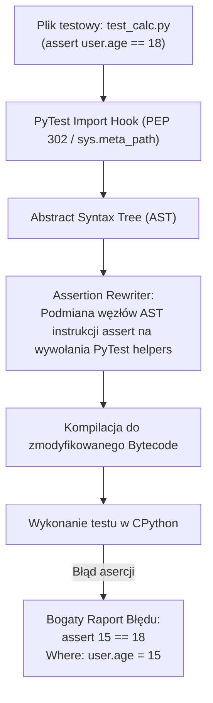

# PyTest: Zaawansowana Architektura, Fixtures i Pytania Rekrutacyjne

Kompleksowe kompendium inżynierskie poświęcone frameworkowi **PyTest** — najpopularniejszemu i najbardziej zaawansowanemu narzędziu do testowania jednostkowego, integracyjnego oraz automatyzacji w ekosystemie języka **Python**. Obejmuje mechanizmy przepisywania drzewa AST (Assertion Rewriting), architekturę wstrzykiwania zależności w fixtures, zaawansowaną parametryzację, orkiestrację z `conftest.py`, mockowanie, równoległe uruchamianie testów oraz zestaw pytań rekrutacyjnych i scenariuszy awaryjnych (od poziomu Mid do Lead / QA Automation Architect).

---

## Spis Treści
1. [Filozofia PyTest i Przełamanie Monolitu `unittest`](#1-filozofia-pytest-i-przełamanie-monolitu-unittest)
   - Dlaczego PyTest zdetronizował standardowy moduł `unittest`?
   - Reguły automatycznego wykrywania testów (Test Discovery)
   - Mechanika Assertion Rewriting (Modyfikacja AST w locie)
2. [Architektura Fixtures (Dependency Injection w PyTest)](#2-architektura-fixtures-dependency-injection-w-pytest)
   - Fixtures jako dostawcy zasobów i stanu
   - Cykl życia: Setup i Teardown za pomocą instrukcji `yield`
   - Hierarchia zasięgów (Scopes: `function`, `class`, `module`, `package`, `session`)
   - Flaga `autouse=True` i kompozycja fixtures
   - Rola i dziedziczenie plików `conftest.py`
3. [Zaawansowana Parametryzacja i Znaczniki (Markers)](#3-zaawansowana-parametryzacja-i-znaczniki-markers)
   - Parametryzacja testów: `@pytest.mark.parametrize` (Iloczyn kartezjański)
   - Parametryzacja na poziomie fixtures (`params` i obiekt `request`)
   - Wbudowane znaczniki: `skip`, `skipif` oraz `xfail(strict=True)`
   - Własne znaczniki biznesowe i rejestracja w `pytest.ini`
4. [Wbudowane Narzędzia, Izolacja i Mockowanie](#4-wbudowane-narzędzia-izolacja-i-mockowanie)
   - Wbudowane fixtures: `tmp_path`, `capsys`, `caplog`
   - Izolacja środowiska: `monkeypatch` (zmienne środowiskowe, atrybuty)
   - Mockowanie w PyTest: `unittest.mock` vs wtyczka `pytest-mock` (`mocker`)
   - Testowanie kodu asynchronicznego (`pytest-asyncio`)
5. [Architektura Wtyczek i System Hooków](#5-architektura-wtyczek-i-system-hooków)
   - Ekosystem wtyczek: `pytest-xdist` (zrównoleglenie procesowe) i `pytest-cov`
   - Silnik wtyczek `pluggy` oraz cykl życia hooków
   - Własne hooki w `conftest.py` (np. automatyczny zrzut ekranu po błędzie)
6. [Pytania Rekrutacyjne z Odpowiedziami (FAQ Interview)](#6-pytania-rekrutacyjne-z-odpowiedziami-faq-interview)
   - Pytania Podstawowe i Średniozaawansowane (Mid)
   - Pytania Zaawansowane i Architektoniczne (Senior / Automation Lead)
   - Scenariusze Awaryjne i Live-fire Troubleshooting
7. [Tablica Szybkiej Powtórki (Cheat-Sheet)](#7-tablica-szybkiej-powtórki-cheat-sheet)

---

## 1. Filozofia PyTest i Przełamanie Monolitu `unittest`

Standardowy moduł `unittest` w Pythonie był bezpośrednim klonem języka Java (JUnit 3). Wymagał dziedziczenia po klasie bazowej `unittest.TestCase`, stosowania metod typu `self.assertEqual()` oraz boilerplate'u programowania obiektowego nawet dla najprostszych weryfikacji.

**PyTest odrzucił ten model na rzecz idiomatycznego Pythona (Pythonic way):**
* Testy są **zwykłymi funkcjami** bez konieczności dziedziczenia po klasach bazowych.
* Zastąpienie dziesiątek metod asercji jednym, natywnym słowem kluczowym **`assert`**.
* Przejście z tradycyjnego dziedziczenia i metod `setUp`/`tearDown` na **funkcyjne wstrzykiwanie zależności (Fixtures)**.

### Reguły Automatycznego Wykrywania Testów (Test Discovery)
Uruchomienie polecenia `pytest` bez argumentów rekurencyjnie przeszukuje katalog roboczy:
1. Pliki o nazwach pasujących do wzorca: `test_*.py` lub `*_test.py`.
2. Wewnątrz tych plików:
   - Funkcje z prefiksem: `test_*()`.
   - Klasy z prefiksem: `Test*` (które **nie posiadają** konstruktora `__init__`) oraz ich metody `test_*()`.

---

### Mechanika Assertion Rewriting (Modyfikacja AST w locie)
W tradycyjnym Pythonie instrukcja `assert a == b` przy niespełnionym warunku rzuca generyczny błąd `AssertionError` bez żadnych dodatkowych informacji diagnostycznych.

**Jak PyTest generuje bogate raporty różnic (Diffs)?**



1. **Import Hook:** Podczas uruchamiania PyTest rejestruje niestandardowy loader modułów w `sys.meta_path`.
2. **Parsowanie AST:** Zanim plik testowy zostanie skompilowany do bajtkodu, PyTest parsuje go do drzewa składniowego (AST).
3. **Podmiana węzłów:** Przechodzi po drzewie AST i przekształca każdy węzeł `ast.Assert` w ciąg operacji pomocniczych przechwytujących wartości pośrednie wyrażeń (operandy lewe, prawe, wywołania funkcji).
4. **Transparentność:** Dzięki temu programista pisze czytelny kod `assert items == [1, 2, 3]`, a w razie błędu otrzymuje pełny kolorowy zrzut różnic w kolekcjach.

---

## 2. Architektura Fixtures (Dependency Injection w PyTest)

Fixtures w PyTest to nie tylko odpowiednik metod setup/teardown — to pełnoprawny kontener **Dependency Injection (DI)**. Test deklaruje, jakich zasobów potrzebuje, podając nazwy fixtures jako swoje argumenty wywołania.

### Cykl Życia z Instrukcją `yield`
Zamiast rozdzielać logikę na osobne funkcje setup i teardown, fixture w PyTest jest **generatorem** wykorzystującym słowo kluczowe `yield`:

```python
import pytest

@pytest.fixture
def database_connection():
    # KROK 1: SETUP (Przygotowanie zasobu)
    conn = create_test_db_connection()
    conn.begin_transaction()
    
    # KROK 2: YIELD (Przekazanie zasobu do testu)
    yield conn
    
    # KROK 3: TEARDOWN (Sprzątanie po zakończeniu testu)
    conn.rollback()
    conn.close()

def test_insert_user(database_connection):
    # Test otrzymuje obiekt 'conn' wygenerowany przez yield
    result = database_connection.execute("INSERT INTO users VALUES ('Jan')")
    assert result.rowcount == 1
```

---

### Hierarchia Zasięgów (Fixture Scopes)
Parametr `scope` decyduje o tym, jak często fixture jest niszczona i tworzona na nowo:

| Zasięg (`scope`) | Kiedy jest tworzona? | Kiedy następuje Teardown? | Typowe zastosowanie |
| :--- | :--- | :--- | :--- |
| **`function`** (Domyślny) | Przed każdym pojedynczym testem | Po zakończeniu danego testu | Czysty stan danych, mocki, obiekty w pamięci |
| **`class`** | Raz przed pierwszym testem w klasie | Po ostatnim teście w klasie | Współdzielenie przeglądarki w teście UI |
| **`module`** | Raz przed pierwszym testem w pliku `.py` | Po zakończeniu wszystkich testów w pliku | Połączenie do lokalnej bazy danych |
| **`package`** | Raz na cały pakiet katalogowy | Po wykonaniu testów w podkatalogu | Globalne serwisy pomocnicze |
| **`session`** | **Dokładnie raz** na całe uruchomienie `pytest` | Na samym końcu pracy test runnera | Kontener Testcontainers, migracje bazodanowe |

> [!WARNING]
> **Zasada Zgodności Zasięgów (Scope Mismatch):** Fixture o szerszym zasięgu (np. `session`) **nigdy nie może bezpośrednio zależeć od fixture o węższym zasięgu** (np. `function`). Próba takiego wstrzyknięcia kończy się błędem `ScopeMismatchError`.

---

### Flaga `autouse=True` i Kompozycja Fixtures
* **`autouse=True`:** Sprawia, że fixture wykonuje się automatycznie dla każdego testu w jej zasięgu, nawet jeśli test nie zadeklarował jej jawnie w liście argumentów (idealne do resetowania zmiennych środowiskowych lub czyszczenia bazy).
* **Kompozycja:** Fixtures mogą być wstrzykiwane do innych fixtures:
  ```python
  @pytest.fixture(scope="session")
  def docker_container():
      container = start_postgres_container()
      yield container
      container.stop()

  @pytest.fixture(scope="function")
  def db_session(docker_container):
      # Używa kontenera sesyjnego, ale tworzy świeżą transakcję per test
      session = create_session(docker_container.connection_url)
      yield session
      session.close()
  ```

---

### Rola Pliku `conftest.py`
Plik `conftest.py` to lokalny magazyn konfiguracyjny PyTest.
* **Brak konieczności importowania:** Fixtures i hooki zdefiniowane w `conftest.py` są **automatycznie dostępne** dla wszystkich plików testowych w tym samym katalogu oraz we wszystkich jego podkatalogach.
* **Hierarchiczne przesłanianie:** Podkatalogi mogą posiadać własne pliki `conftest.py`, które nadpisują lub rozszerzają fixtures zdefiniowane na poziomie głównym projektu.

---

## 3. Zaawansowana Parametryzacja i Znaczniki (Markers)

### Parametryzacja Testów: `@pytest.mark.parametrize`
Umożliwia uruchomienie tej samej logiki testowej dla wielu wariantów danych wejściowych:

```python
import pytest

@pytest.mark.parametrize("input_email, expected_valid", [
    ("test@example.com", True),
    ("invalid-email", False),
    ("user@domain.co.uk", True),
    ("", False),
], ids=["standard_email", "missing_at", "complex_tld", "empty_string"])
def test_email_validator(input_email, expected_valid):
    assert is_valid_email(input_email) == expected_valid
```

* **Iloczyn Kartezjański:** Zastosowanie wielu dekoratorów `@pytest.mark.parametrize` na jednej funkcji generuje kombinatoryczną macierz testów (każdy z każdym):
  ```python
  @pytest.mark.parametrize("role", ["admin", "user"])
  @pytest.mark.parametrize("env", ["staging", "prod"])
  def test_permissions(role, env):
      # Wykona się 2 x 2 = 4 razy!
      pass
  ```

---

### Wbudowane Znaczniki: `skip`, `skipif` i `xfail`
* **`@pytest.mark.skip(reason="Wycofane API")`:** Bezwarunkowe pominięcie testu.
* **`@pytest.mark.skipif(sys.platform == "win32", reason="Tylko Linux")`:** Warunkowe pominięcie testu.
* **`@pytest.mark.xfail(strict=True)` (Expected Failure):**
  - Oznacza, że test bada znany, nierozwiązany jeszcze błąd w aplikacji.
  - Jeśli test zawiedzie $\rightarrow$ raportuje `XFAIL` (build w CI/CD przechodzi na zielono).
  - Jeśli ktoś naprawi błąd i test nagle przejdzie na zielono $\rightarrow$ dzięki **`strict=True`** test raportuje **`XPASS (FAILED)`**, zmuszając programistę do usunięcia znacznika xfail!

---

## 4. Wbudowane Narzędzia, Izolacja i Mockowanie

### Wbudowane Fixtures PyTest
1. **`tmp_path` (oraz sesyjne `tmp_path_factory`):** Zwraca unikalny, odizolowany obiekt `pathlib.Path` wskazujący na katalog tymczasowy tworzony w systemowym folderze temp. Automatycznie czyszczony po testach:
   ```python
   def test_file_writer(tmp_path):
       target_file = tmp_path / "subfolder" / "data.txt"
       target_file.parent.mkdir()
       target_file.write_text("Witaj PyTest", encoding="utf-8")
       assert target_file.read_text(encoding="utf-8") == "Witaj PyTest"
   ```
2. **`monkeypatch`:** Bezpieczne modyfikowanie stanu środowiska uruchomieniowego z gwarancją cofnięcia zmian po zakończeniu testu:
   ```python
   def test_environment_variable(monkeypatch):
       monkeypatch.setenv("DATABASE_URL", "sqlite:///:memory:")
       monkeypatch.setattr("os.path.exists", lambda path: True)
       assert config.get_db_url() == "sqlite:///:memory:"
   ```
3. **`capsys`:** Przechwytuje strumienie `sys.stdout` oraz `sys.stderr` generowane przez testowany kod:
   ```python
   def test_cli_output(capsys):
       print("Operacja zakończona!")
       captured = capsys.readouterr()
       assert "Operacja zakończona!" in captured.out
   ```

---

### Mockowanie: `unittest.mock` vs `pytest-mock` (`mocker`)
Chociaż standardowy moduł `unittest.mock.patch` jest dostępny, w środowisku PyTest zaleca się korzystanie z wtyczki **`pytest-mock`** dostarczającej fixture **`mocker`**:

```python
# ❌ TRADYCYJNY UNITTEST (Wymaga zagnieżdżonych context managerów):
def test_payment_legacy():
    with patch("services.payment_gateway.charge") as mock_charge:
        mock_charge.return_value = True
        process_order()

# ✅ NOWOCZESNY PYTEST (Fixture 'mocker' automatycznie cofa patch po teście):
def test_payment_modern(mocker):
    mock_charge = mocker.patch("services.payment_gateway.charge", return_value=True)
    
    result = process_order(100)
    
    assert result.is_paid is True
    mock_charge.assert_called_once_with(100)
```

---

## 5. Architektura Wtyczek i System Hooków

PyTest jest zbudowany w całości na bazie modułowego silnika wtyczek **`pluggy`**. Nawet podstawowe funkcjonalności (takie jak zbieranie testów, obsługa asercji czy raportowanie) są wewnętrznymi pluginami PyTest.

### Zrównoleglenie Testów: `pytest-xdist`
Domyślnie PyTest wykonuje testy sekwencyjnie w pojedynczym procesie. Wtyczka `pytest-xdist` umożliwia zrównoleglenie na poziomie procesów systemu operacyjnego:
```bash
# Uruchom testy równolegle na wszystkich dostępnych rdzeniach CPU:
pytest -n auto

# Rozdzielenie testów według modułów (aby zapobiec konfliktom stanu):
pytest -n auto --dist loadscope
```

---

### Własne Hooki w `conftest.py`
Hooki pozwalają na wpięcie się w dowolny etap cyklu życia test runnera. Przykładowo, automatyczne wykonanie zrzutu ekranu w przeglądarce Selenium / Playwright po nieudanym teście:

```python
import pytest

@pytest.hookimpl(tryfirst=True, hookwrapper=True)
def pytest_runtest_makereport(item, call):
    # Wykonanie standardowego raportowania PyTest
    outcome = yield
    report = outcome.get_result()

    # Sprawdzenie, czy błąd wystąpił w fazie właściwego wywołania testu (call)
    if report.when == "call" and report.failed:
        driver = item.funcargs.get("browser_driver")
        if driver:
            screenshot_path = f"reports/screenshots/{item.name}.png"
            driver.save_screenshot(screenshot_path)
```

---

## 6. Pytania Rekrutacyjne z Odpowiedziami (FAQ Interview)

### Pytania Podstawowe i Średniozaawansowane (Mid)

#### P1: Jak pod maską działa mechanizm asercji w PyTest i dlaczego nie wymaga dedykowanych metod takich jak `self.assertEqual`?
**Odpowiedź:**
PyTest wykorzystuje technikę **Assertion Rewriting** (Przepisywanie asercji na poziomie AST).
Podczas importowania plików testowych za pomocą niestandardowego Import Hooka (`sys.meta_path`), PyTest parsuje kod źródłowy do Abstract Syntax Tree (AST). Każda instrukcja `assert` jest dynamicznie przekształcana w kod, który przechwytuje wartości wszystkich podwyrażeń po obu stronach operatora. Dzięki temu w momencie niespełnienia warunku PyTest generuje szczegółowy raport różnic (introspekcję zmiennych, porównanie zawartości słowników czy list), zachowując prostą i czystą składnię natywnego Pythona.

---

#### P2: Wyjaśnij różnicę między wszystkimi zasięgami (scopes) w fixtures. Kiedy użyć którego?
**Odpowiedź:**
* **`function` (domyślny):** Tworzy zasób od nowa dla każdego pojedynczego testu. Gwarantuje stuprocentową izolację stanu (Clean State). Używany dla obiektów biznesowych, mocków i transakcji bazodanowych.
* **`class`:** Wykonywana raz na klasę testową. Przydatna w testach integracyjnych grupujących powiązane scenariusze wokół jednego klienta HTTP.
* **`module`:** Tworzona raz na cały plik `.py`. Używana np. do inicjalizacji klienta API lub połączenia z bazą testową w ramach jednego modułu.
* **`package`:** Tworzona raz na pakiet katalogowy z testami.
* **`session`:** Tworzona dokładnie raz na całe uruchomienie procesu PyTest. Służy do alokacji najcięższych zasobów globalnych, takich jak uruchomienie kontenera Docker (Testcontainers) czy wykonanie migracji bazy danych.

---

#### P3: Do czego służy plik `conftest.py` i jak działa mechanizm jego wykrywania przez PyTest?
**Odpowiedź:**
* `conftest.py` to centralny moduł konfiguracyjny w PyTest. Służy do definiowania współdzielonych fixtures, niestandardowych hooków oraz rejestracji pluginów.
* **Zasada działania:** Fixtures zdefiniowane w `conftest.py` są wstrzykiwane do testów **bez konieczności stosowania jawnych instrukcji `import`**.
* **Hierarchia:** PyTest przeszukuje strukturę katalogów w górę — test widzi fixtures ze swojego lokalnego `conftest.py` oraz ze wszystkich plików `conftest.py` znajdujących się w katalogach nadrzędnych aż do katalogu głównego projektu.

---

### Pytania Zaawansowane i Architektoniczne (Senior / Automation Lead)

#### P4: Jak zorganizować testy integracyjne korzystające z bazy danych przy współbieżnym uruchomieniu wtyczką `pytest-xdist` (`-n auto`)?
**Odpowiedź:**
* **Problem:** Wtyczka `pytest-xdist` uruchamia testy w osobnych procesach roboczych (workerach). Jeśli wszystkie procesy zapisują dane do tej samej instancji bazy danych, dochodzi do wyścigów danych i losowych błędów (*Flaky Tests*).
* **Rozwiązania architektoniczne:**
  1. **Unikalna baza per worker:** Wykorzystanie wbudowanej zmiennej środowiskowej dostarczanej przez xdist: `worker_id` (np. `gw0`, `gw1`). W sesyjnym fixture tworzy się niezależną bazę danych dla każdego procesu roboczego:
     ```python
     @pytest.fixture(scope="session")
     def db_engine(worker_id):
         db_name = f"test_db_{worker_id}"
         create_database(db_name)
         yield get_engine(db_name)
     ```
  2. **Podział na poziomie schematów:** Tworzenie unikalnego schematu (`schema_UUID`) dla każdego testu i jego niszczenie po wykonaniu.
  3. **Transakcje z rollbackiem:** Każdy test owija swoje operacje w transakcję bazodanową i w fazie teardown fixture wykonuje bezwzględny `ROLLBACK`, uniemożliwiając zaśmiecenie bazy.

---

#### P5: Czym różni się fixture `tmp_path` od `tmp_path_factory`?
**Odpowiedź:**
* **`tmp_path`:** Posiada zasięg **`function`**. Zwraca obiekt `pathlib.Path` wskazujący na unikalny, świeży katalog tymczasowy dedykowany wyłącznie dla bieżącej funkcji testowej.
* **`tmp_path_factory`:** Posiada zasięg **`session`**. Służy do generowania katalogów tymczasowych w fixtures o szerszym zasięgu (`module`, `session`), np. gdy chcemy raz pobrać duży plik danych lub rozpakować archiwum i współdzielić je pomiędzy wszystkimi testami w sesji:
  ```python
  @pytest.fixture(scope="session")
  def shared_dataset(tmp_path_factory):
      dataset_dir = tmp_path_factory.mktemp("data_cache")
      download_and_extract_fixtures(dataset_dir)
      return dataset_dir
  ```

---

#### P6: Dlaczego w dekoratorze `@pytest.mark.xfail` należy zawsze rozważyć parametr `strict=True`?
**Odpowiedź:**
* Domyślnie (`strict=False`), jeśli test oznaczony jako `xfail` nieoczekiwanie zakończy się sukcesem, PyTest raportuje status `XPASS`, a cały pipeline CI/CD kończy się kodem sukcesu (0).
* Prowadzi to do sytuacji, w której zapomniane testy xfail latami wiszą w repozytorium, maskując stan kodu.
* Ustawienie **`strict=True`** sprawia, że niespodziewany sukces testu traktowany jest jako **błąd krytyczny (FAILED)**. Wymusza to na inżynierze natychmiastową decyzję: usunąć znacznik xfail (ponieważ błąd w aplikacji został naprawiony) lub zaktualizować kryteria testu.

---

### Scenariusze Awaryjne i Live-fire Troubleshooting

#### Scenariusz 1: PyTest przerywa wykonanie testów z błędem: `ScopeMismatch: You tried to access the function scoped fixture 'user_payload' with a session scoped fixture 'api_client'`.
**Diagnoza i Rozwiązanie:**
1. **Identyfikacja:** Fixture `api_client` ma zasięg `scope="session"`, a w parametrach próbuje przyjąć fixture `user_payload`, która ma domyślny zasięg `scope="function"`.
2. **Przyczyna:** Zasób żyjący przez całe uruchomienie programu (sesyjny) nie może zależeć od zasobu tworzonego i niszczonego co kilka milisekund dla każdego pojedynczego testu (łamanie zasad cyklu życia).
3. **Rozwiązanie:**
   - Zmiana zasięgu fixture zależnej na zgodny: podniesienie `user_payload` do `scope="session"` (jeśli dane są statyczne).
   - Lub obniżenie zasięgu fixture nadrzędnej: zmiana `api_client` na `scope="function"`.
   - Zastosowanie fabryki (Factory Pattern): fixture sesyjna zwraca funkcję generującą payloady w locie.

---

#### Scenariusz 2: Testy asynchroniczne (`async def test_*`) są pomijane, kończą się z ostrzeżeniem `coroutine was never awaited` lub rzucają błąd `RuntimeError: Task attached to a different loop`.
**Diagnoza i Rozwiązanie:**
1. **Przyczyna:** PyTest natywnie jest frameworkiem synchronicznym. Samodzielne zdefiniowanie `async def test_foo()` sprawia, że CPython tworzy obiekt coroutine, którego PyTest nie przekazuje do żadnej pętli zdarzeń (Event Loop).
2. **Rozwiązanie:**
   - Instalacja i konfiguracja wtyczki **`pytest-asyncio`**.
   - Oznaczenie testu dedykowanym markerem:
     ```python
     @pytest.mark.asyncio
     async def test_async_fetch():
         data = await fetch_data_from_redis()
         assert data is not None
     ```
   - Skonfigurowanie trybu automatycznego w `pytest.ini`:
     ```ini
     [pytest]
     asyncio_mode = auto
     ```

---

## 7. Tablica Szybkiej Powtórki (Cheat-Sheet)

| Zagadnienie | Słowa Kluczowe i Niskopoziomowe Koncepcje |
| :--- | :--- |
| **Filozofia** | Funkcyjne testy, brak klas bazowych, `assert` z **Assertion Rewriting** (modyfikacja AST) |
| **Discovery** | `test_*.py`, `*_test.py`, funkcje `test_*()`, klasy `Test*` (bez `__init__`) |
| **Fixtures Cykl** | `@pytest.fixture`, setup przed `yield`, teardown po `yield`, wstrzykiwanie zależności |
| **Scopes** | `function` (domyślny), `class`, `module`, `package`, `session` (zakaz Scope Mismatch) |
| **Konfiguracja** | `conftest.py` (automatyczne wstrzykiwanie bez importów, hierarchia przeszukiwania w górę) |
| **Parametryzacja** | `@pytest.mark.parametrize` (macierze danych, iloczyn kartezjański, czytelne identyfikatory `ids`) |
| **Znaczniki** | `@pytest.mark.skip`, `@pytest.mark.skipif`, `@pytest.mark.xfail(strict=True)` |
| **Wbudowane** | `tmp_path` (`pathlib.Path`), `monkeypatch` (`setenv`, `setattr`), `capsys` (stdout/stderr) |
| **Mockowanie** | Wtyczka `pytest-mock` (fixture `mocker` z automatycznym sprzątaniem patchów po teście) |
| **Współbieżność** | `pytest-xdist` (`-n auto`, wieloprocesowość, worker isolation), `pytest-asyncio` |
