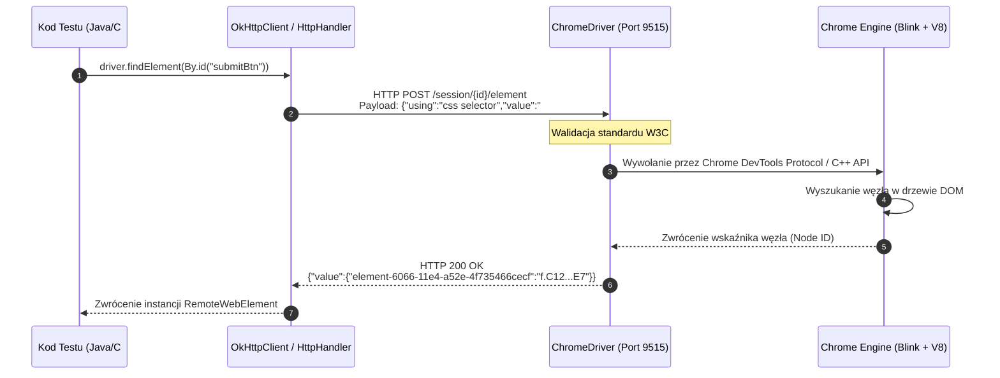
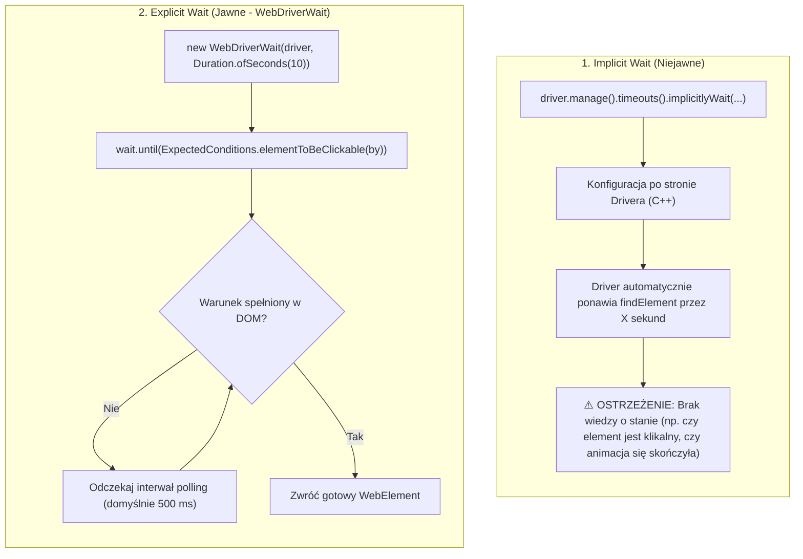
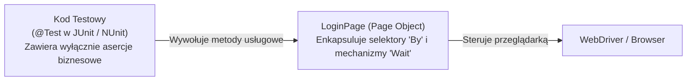
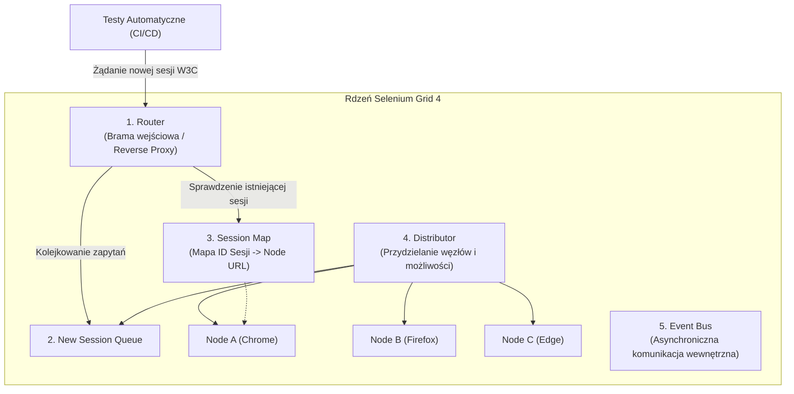

# Selenium WebDriver w Java i C#: Niskopoziomowa Architektura W3C, Wzorce Projektowe i Pytania Rekrutacyjne

Kompleksowe kompendium inżynierskie poświęcone frameworkowi **Selenium WebDriver** — historycznemu fundamentowi i wciąż jednemu z najszerzej stosowanych narzędzi do automatyzacji przeglądarek internetowych. Artykuł szczegółowo analizuje architekturę Selenium (od JSON Wire Protocol do pełnego standardu W3C oraz protokołu BiDi), anatomię wywołań niskopoziomowych, mechanikę zaawansowanych oczekiwań (Waits), architekturę Page Object Model, Selenium Manager, integrację z Chrome DevTools Protocol (CDP), skalowanie w Selenium Grid 4 oraz obszerny zestaw pytań rekrutacyjnych i scenariuszy awaryjnych (od poziomu Mid do Automation Architect).

---

## Spis Treści
1. [Ewolucja Architektury: Od Selenium RC do Standardu W3C i BiDi](#1-ewolucja-architektury-od-selenium-rc-do-standardu-w3c-i-bidi)
   - Ograniczenia Selenium 1 (RC) i wstrzykiwanie JavaScript
   - Selenium 2 i 3: JSON Wire Protocol i narzut translacyjny
   - Selenium 4: Czysty standard W3C WebDriver oraz protokół BiDi (Bidirectional)
2. [Niskopoziomowa Anatomia Wywołania WebDrivera](#2-niskopoziomowa-anatomia-wywołania-webdrivera)
   - Co dzieje się pod maską przy `driver.findElement()`?
   - Hierarchia interfejsów w Java i C# (`SearchContext`, `WebDriver`, `JavascriptExecutor`, `TakesScreenshot`)
   - Unikalny identyfikator elementu W3C (`element-6066-11e4-a52e-4f735466cecf`)
3. [Mechanika Oczekiwań: Implicit vs Explicit vs Fluent Wait](#3-mechanika-oczekiwań-implicit-vs-explicit-vs-fluent-wait)
   - Dlaczego mieszanie Implicit i Explicit Wait prowadzi do katastrofy (W3C Warning)
   - Architektura `WebDriverWait` i mechanizm cyklicznego odpytywania (Polling)
   - Implementacja własnych predykatów w `FluentWait`
4. [Wzorce Projektowe i Nowoczesna Architektura Testów](#4-wzorce-projektowe-i-nowoczesna-architektura-testów)
   - Czysty Page Object Model (POM) bez antywzorców
   - Dlaczego `PageFactory` i `@FindBy` są odradzane we współczesnej inżynierii testów?
   - Wzorzec Fluent Interface (Method Chaining)
   - Architektura Screenplay Pattern jako alternatywa dla dużych projektów
5. [Zaawansowane Możliwości Selenium 4](#5-zaawansowane-możliwości-selenium-4)
   - Relative Locators (Friendly Locators: `above`, `below`, `toLeftOf`, `toRightOf`, `near`)
   - Natywne zarządzanie nowymi kartami i oknami (`WindowType.TAB` / `WindowType.WINDOW`)
   - Narzędzie Selenium Manager (Koniec problemów z driverami i zmiennymi PATH)
   - Integracja z Chrome DevTools Protocol (CDP): Mockowanie sieci, emulacja geolokalizacji, nasłuchiwanie błędów konsoli
6. [Infrastruktura i Skalowanie: Selenium Grid 4](#6-infrastruktura-i-skalowanie-selenium-grid-4)
   - Architektura mikroserwisowa Grid 4 (Router, Distributor, Session Queue, Node, Session Map, Event Bus)
   - Wdrożenie w środowisku kontenerowym (Docker / Kubernetes)
7. [Pytania Rekrutacyjne z Odpowiedziami (FAQ Interview)](#7-pytania-rekrutacyjne-z-odpowiedziami-faq-interview)
   - Pytania Podstawowe i Średniozaawansowane (Mid)
   - Pytania Zaawansowane i Architektoniczne (Senior / Lead)
   - Scenariusze Awaryjne i Live-fire Troubleshooting
8. [Tablica Szybkiej Powtórki (Cheat-Sheet)](#8-tablica-szybkiej-powtórki-cheat-sheet)

---

## 1. Ewolucja Architektury: Od Selenium RC do Standardu W3C i BiDi

Selenium przeszło fundamentalną metamorfozę na przestrzeni dwóch dekad, ewoluując od biblioteki wstrzykującej skrypty JS do oficjalnego, międzynarodowego standardu przeglądarek internetowych **W3C Recommendation**.

```mermaid
flowchart TD
    subgraph Selenium3["Selenium 3 (Architektura JSON Wire Protocol)"]
        direction TB
        Client3["Selenium Client\n(Kod Java / C#)"] -->|HTTP REST z JSONWP| Driver3["Driver pośredniczący\n(ChromeDriver / GeckoDriver)"]
        Driver3 -->|Translacja JSONWP na W3C| Browser3["Przeglądarka\n(DOM)"]
        Browser3 -.->|Odpowiedź W3C| Driver3
        Driver3 -.->|Translacja na format JSONWP| Client3
    end

    subgraph Selenium4["Selenium 4 (Natywny Standard W3C + BiDi)"]
        direction TB
        Client4["Selenium Client\n(Kod Java / C#)"] -->|Czysty standard W3C WebDriver (Brak translacji)| Driver4["Driver W3C\n(ChromeDriver / GeckoDriver)"]
        Driver4 -->|Bezpośrednia komunikacja natywna| Browser4["Przeglądarka\n(DOM)"]
        
        Client4 <===>|Dwukierunkowy WebSocket (BiDi / CDP)| Browser4
    end
```

### 1. Selenium 1 (Remote Control - RC)
Selenium RC działało poprzez wstrzykiwanie biblioteki JavaScript (`Selenium Core`) bezpośrednio do renderowanej strony internetowej. 
- **Ograniczenia:** Ograniczenie zasadą *Same-Origin Policy* (przeglądarka blokowała dostęp JS do innych domen, iframes czy ciasteczek), brak możliwości symulacji natywnych zdarzeń systemu operacyjnego (np. upload plików, obsługa alertów systemowych OS).

### 2. Selenium 2 i 3 (WebDriver & JSON Wire Protocol)
Połączenie projektu WebDriver (stworzonego przez Simona Stewarta) z Selenium przyniosło bezpośrednią komunikację z przeglądarką poprzez natywne komponenty systemu operacyjnego.
- Komunikacja opierała się na **JSON Wire Protocol (JSONWP)** poprzez HTTP REST.
- Każda operacja (kliknięcie, wpisanie tekstu) była pakowana do formatu JSONWP, wysyłana do drivera przeglądarki, który musiał ją przetłumaczyć na wewnętrzne komendy danej przeglądarki.
- **Wada:** Duży narzut enkapsulacji/dekapsulacji, częste niespójności między implementacjami sterowników dla Chrome, Firefoxa i Safari.

### 3. Selenium 4 (Standard W3C i WebDriver BiDi)
W Selenium 4 wycofano całkowicie protokół JSON Wire Protocol:
- **Czysta zgodność z W3C:** Klient i sterowniki przeglądarek komunikują się bezpośrednio przy użyciu jednolitego standardu W3C WebDriver. Brak jakiejkolwiek warstwy translacyjnej gwarantuje wyższą stabilność, mniejsze opóźnienia i jednakowe zachowanie we wszystkich przeglądarkach.
- **WebDriver BiDi (Bidirectional):** Wprowadzenie dwukierunkowej komunikacji przez gniazda WebSocket. Umożliwia asynchroniczne nasłuchiwanie zdarzeń przeglądarki w czasie rzeczywistym (np. logi konsoli, błędy JavaScript, żądania sieciowe, mutacje DOM) bez konieczności ciągłego odpytywania (HTTP polling).

---

## 2. Niskopoziomowa Anatomia Wywołania WebDrivera

Aby zrozumieć naturę błędów takich jak `StaleElementReferenceException` czy timeouty, należy prześledzić drogę pojedynczego polecenia od kodu wysokopoziomowego aż do silnika renderowania przeglądarki.



### Unikalny Identyfikator Elementu W3C
Zgodnie ze specyfikacją W3C, element DOM w odpowiedzi JSON nie jest zwracany pod kluczem `"ELEMENT"`, lecz pod znormalizowanym, unikalnym identyfikatorem standardu W3C:
```json
{
  "value": {
    "element-6066-11e4-a52e-4f735466cecf": "f.E7B2D06900DF48B2B04E9C1D9A7C5F31_element_12"
  }
}
```
Obiekt `RemoteWebElement` po stronie klienta (Java/C#) przechowuje jedynie tę referencję tekstową (UUID). **Nie trzyma on fizycznego obiektu DOM w pamięci procesu testowego**. Gdy drzewo DOM w przeglądarce zostanie przeładowane (np. przez framework React/Angular) i stary węzeł zostanie usunięty ze struktury pamięci przeglądarki, próba ponownego użycia tego samego identyfikatora UUID skutkuje wyrzuceniem wyjątku `StaleElementReferenceException`.

### Hierarchia Interfejsów WebDriver
W architekturze Selenium interfejsy zostały precyzyjnie podzielone zgodnie z zasadą segregacji interfejsów (ISP z SOLID):

```
       SearchContext (findElement, findElements)
            ▲
            │
        WebDriver (get, getCurrentUrl, getTitle, quit, close, manage, navigate, switchTo)
            ▲
            │
     RemoteWebDriver (Implementuje WebDriver, JavascriptExecutor, TakesScreenshot, Interactive)
```

- **`SearchContext`**: Najbardziej bazowy interfejs, wspólny dla `WebDriver` oraz `WebElement`. Definiuje jedynie metody wyszukiwania elementów w bieżącym kontekście.
- **`JavascriptExecutor`**: Umożliwia bezpośrednie wykonywanie kodu JavaScript w oknie przeglądarki (`executeScript`, `executeAsyncScript`).
- **`TakesScreenshot`**: Pozwala na przechwytywanie zrzutu ekranu jako pliku, tablicy bajtów (`byte[]`) lub ciągu Base64.

---

## 3. Mechanika Oczekiwań: Implicit vs Explicit vs Fluent Wait

Problemy z niestabilnością testów (*Flaky Tests*) w 90% przypadków wynikają z nieprawidłowego zarządzania asynchronicznością i czasem renderowania aplikacji frontendowych.



### Porównanie Trzech Typów Oczekiwań

| Cecha | Implicit Wait | Explicit Wait (`WebDriverWait`) | Fluent Wait |
| :--- | :--- | :--- | :--- |
| **Gdzie działa?** | Po stronie sterownika (ChromeDriver/GeckoDriver) | Po stronie klienta (w kodzie Java/C#) | Po stronie klienta (w kodzie Java/C#) |
| **Zakres działania** | Globalny dla wszystkich wywołań `findElement` | Lokalny dla wybranego warunku | Lokalny, w pełni konfigurowalny |
| **Sprawdzany warunek** | Tylko obecność w DOM (`presence`) | Obecność, widoczność, klikalność, tekst, atrybuty | Dowolny predykat / funkcja lambda |
| **Interwał odpytywania**| Stały, zależny od implementacji przeglądarki | Domyślnie 500 ms | Dowolny (np. 100 ms, 1 s) |
| **Obsługa wyjątków** | Wyrzuca `NoSuchElementException` po timeout | Ignoruje `NotFoundException`, resztę rzuca | Dowolna lista ignorowanych wyjątków |

### Dlaczego mieszanie Implicit Wait z Explicit Wait jest antywzorcem?
Oficjalna dokumentacja Selenium oraz specyfikacja W3C wyraźnie przestrzegają przed jednoczesnym stosowaniem obu mechanizmów:
```java
// BŁĄD ARCHITEKTONICZNY!
driver.manage().timeouts().implicitlyWait(Duration.ofSeconds(10));
WebDriverWait wait = new WebDriverWait(driver, Duration.ofSeconds(10));
wait.until(ExpectedConditions.elementToBeClickable(By.id("btn")));
```
**Skutek:** Czas oczekiwania staje się nieprzewidywalny. W zależności od sterownika przeglądarki, czasy mogą się zsumować (test czeka 20 sekund przed rzuceniem błędu) lub sterownik wejdzie w stan zakleszczenia pętli odpytywania, powodując losowe przekroczenia limitu czasu (*Flaky Timeouts*).

### Prawidłowa Implementacja Fluent Wait (Java)
```java
package com.codeassure.selenium.waits;

import org.openqa.selenium.*;
import org.openqa.selenium.support.ui.FluentWait;
import org.openqa.selenium.support.ui.Wait;

import java.time.Duration;

public class WaitFactory {

    public static WebElement waitForStaleAndClickable(WebDriver driver, By locator, Duration timeout) {
        Wait<WebDriver> wait = new FluentWait<>(driver)
                .withTimeout(timeout)
                .pollingEvery(Duration.ofMillis(250))
                .ignoring(NoSuchElementException.class)
                .ignoring(StaleElementReferenceException.class)
                .ignoring(ElementClickInterceptedException.class)
                .withMessage("Element " + locator + " nie stał się klikalny w czasie " + timeout.getSeconds() + "s");

        return wait.until(d -> {
            WebElement element = d.findElement(locator);
            if (element.isDisplayed() && element.isEnabled()) {
                return element;
            }
            return null;
        });
    }
}
```

---

## 4. Wzorce Projektowe i Nowoczesna Architektura Testów

### Nowoczesny Page Object Model (POM)
Czysty wzorzec Page Object Model ma na celu oddzielenie struktury technicznej strony HTML od scenariuszy testowych. Strona powinna eksponować metody odpowiadające usługom biznesowym oferowanym użytkownikowi.



### Dlaczego `PageFactory` i adnotacja `@FindBy` są odradzane?
Przez lata biblioteka `org.openqa.selenium.support.PageFactory` była standardem nauczania Selenium. We współczesnej inżynierii automatyzacji jest ona uznawana za **przestarzałą i podatną na błędy**:
1. **Zafałszowana Leniwa Inicjalizacja (Lazy Initialization):** Obiekty `WebElement` wstrzykiwane przez `@FindBy` są w rzeczywistości dynamicznymi proxy. Każde odwołanie do pola wywołuje `findElement` pod spodem. Przy dynamicznych aplikacjach SPA (React, Vue) powoduje to gigantyczną liczbę wyjątków `StaleElementReferenceException`.
2. **Niemożność dynamicznego parametryzowania selektorów:** Adnotacja `@FindBy(xpath = "//div[text()='" + user + "']")` jest niemożliwa w Javie/C#, ponieważ parametry adnotacji muszą być stałymi kompilacji (`const / static final`).
3. **Ukryte mechanizmy oczekiwań:** Złożone mechanizmy `AjaxElementLocatorFactory` są trudne w debugowaniu i nie współpracują czysto z precyzyjnymi warunkami `WebDriverWait`.

### Rekomendowany Wzorzec POM w C# (.NET)

```csharp
using System;
using OpenQA.Selenium;
using OpenQA.Selenium.Support.UI;
using SeleniumExtras.WaitHelpers;

namespace CodeAssure.Selenium.Pages
{
    public class LoginPage
    {
        private readonly IWebDriver _driver;
        private readonly WebDriverWait _wait;

        // Czyste selektory By - w pełni bezpieczne i niepodatne na przedwczesne błędy proxy
        private readonly By _usernameInput = By.Id("username");
        private readonly By _passwordInput = By.Id("password");
        private readonly By _submitButton = By.CssSelector("button[type='submit']");
        private readonly By _errorMessage = By.CssSelector(".alert-danger");

        public LoginPage(IWebDriver driver)
        {
            _driver = driver ?? throw new ArgumentNullException(nameof(driver));
            _wait = new WebDriverWait(_driver, TimeSpan.FromSeconds(10));
        }

        public LoginPage EnterUsername(string username)
        {
            var element = _wait.Until(ExpectedConditions.ElementIsVisible(_usernameInput));
            element.Clear();
            element.SendKeys(username);
            return this; // Fluent Interface
        }

        public LoginPage EnterPassword(string password)
        {
            var element = _wait.Until(ExpectedConditions.ElementIsVisible(_passwordInput));
            element.Clear();
            element.SendKeys(password);
            return this;
        }

        public DashboardPage ClickLoginSuccess()
        {
            _wait.Until(ExpectedConditions.ElementToBeClickable(_submitButton)).Click();
            return new DashboardPage(_driver);
        }

        public string GetErrorMessage()
        {
            return _wait.Until(ExpectedConditions.ElementIsVisible(_errorMessage)).Text;
        }
    }
}
```

---

## 5. Zaawansowane Możliwości Selenium 4

### 1. Relative Locators (Friendly Locators)
Selenium 4 wprowadziło możliwość lokalizowania elementów w odniesieniu do innych elementów w oparciu o ich pozycję w renderowanym układzie graficznym (współrzędne na ekranie):

```java
import static org.openqa.selenium.support.locators.RelativeLocator.with;

WebElement emailInput = driver.findElement(By.id("email"));

// Znajdź przycisk submit znajdujący się PONIŻEJ pola hasła i POWYŻEJ stopki
WebElement passwordInput = driver.findElement(
    with(By.tagName("input"))
        .below(emailInput)
        .above(By.id("footer"))
);
```

### 2. Selenium Manager: Koniec Konfiguracji Sterowników
Od wersji Selenium **4.6+** zintegrowano natywne narzędzie napisane w języku Rust: **Selenium Manager**.
- Automatycznie wykrywa wersję zainstalowanej na maszynie przeglądarki (Chrome, Edge, Firefox).
- Weryfikuje i automatycznie pobiera z oficjalnych serwerów Google/Mozilla idealnie dopasowany plik binarny drivera (`chromedriver`, `geckodriver`).
- Zapisuje binarkę w lokalnym cache użytkownika (`~/.cache/selenium`).
- **Eliminuje potrzebę** stosowania biblioteki `WebDriverManager` (Boni Garcia) oraz ręcznego ustawiania `System.setProperty("webdriver.chrome.driver", ...)`.

### 3. Integracja z Chrome DevTools Protocol (CDP)
Selenium 4 pozwala na bezpośrednią manipulację silnikiem przeglądarki Chromium za pośrednictwem dedykowanych sesji DevTools:

```java
package com.codeassure.selenium.cdp;

import org.openqa.selenium.chrome.ChromeDriver;
import org.openqa.selenium.devtools.DevTools;
import org.openqa.selenium.devtools.v120.network.Network;
import org.openqa.selenium.devtools.v120.network.model.ConnectionType;

import java.util.Optional;

public class NetworkMockingExample {

    public void simulateSlowNetwork(ChromeDriver driver) {
        DevTools devTools = driver.getDevTools();
        devTools.createSession();

        // Włączenie monitorowania sieci i emulacja łącza 3G
        devTools.send(Network.enable(Optional.empty(), Optional.empty(), Optional.empty()));
        devTools.send(Network.emulateNetworkConditions(
                false,
                150,     // Latencja w ms
                750000,  // Download (bytes/s)
                250000,  // Upload (bytes/s)
                Optional.of(ConnectionType.CELLULAR3G),
                Optional.empty(),
                Optional.empty(),
                Optional.empty()
        ));
    }
}
```

---

## 6. Infrastruktura i Skalowanie: Selenium Grid 4

W wersji Selenium Grid 4 całkowicie przepisano architekturę klastra testowego, przechodząc z prostego modelu Hub-Node na architekturę w pełni reaktywną i mikroserwisową.



### Komponenty Siatki Selenium Grid 4:
1. **Router:** Pojedynczy punkt styku (Reverse Proxy), który kieruje żądania do odpowiednich komponentów wewnętrznych.
2. **New Session Queue:** Bezpieczna kolejka FIFO przechowująca żądania utworzenia nowej przeglądarki, gdy wszystkie węzły są zajęte.
3. **Distributor:** Monitoruje stan wszystkich zarejestrowanych węzłów (*Nodes*), odpytuje kolejkę sesji i przydziela wolny węzeł na podstawie żądanych możliwości (*Capabilities*).
4. **Node:** Maszyna lub kontener Docker, na którym fizycznie uruchamiane są przeglądarki.
5. **Session Map:** Rozproszona baza danych (np. Redis lub w pamięci) mapująca identyfikator sesji W3C na adres IP konkretnego węzła.
6. **Event Bus:** Wewnętrzna szyna zdarzeń oparta na ZeroMQ, służąca do asynchronicznej komunikacji między komponentami.

---

## 7. Pytania Rekrutacyjne z Odpowiedziami (FAQ Interview)

### Pytania Podstawowe i Średniozaawansowane (Mid)

#### Pytanie 1: Czym różni się `findElement()` od `findElements()` pod kątem obsługi błędów i zwracanego wyniku?
**Odpowiedź:**
- `findElement(By locator)`:
  - Przeszukuje bieżący kontekst i zwraca **pierwszy pasujący obiekt `WebElement`**.
  - Jeśli żaden element nie zostanie odnaleziony w zadanym czasie timeoutu, wyrzuca błąd `NoSuchElementException`.
- `findElements(By locator)`:
  - Zwraca **listę wszystkich pasujących elementów (`List<WebElement>`)**.
  - Jeśli żaden element nie pasuje do selektora, **nie wyrzuca wyjątku**, lecz zwraca pustą listę (`empty list`, rozmiar 0).
  - Jest to standardowa metoda sprawdzania braku obecności elementu na stronie bez konieczności obsługi bloków `try-catch`.

---

#### Pytanie 2: Czym różni się `driver.close()` od `driver.quit()` pod kątem zasobów systemowych?
**Odpowiedź:**
- `driver.close()`:
  - Zamyka **wyłącznie bieżące okno lub kartę przeglądarki**, na którą w danej chwili wskazuje fokus drivera.
  - Jeśli było to ostatnie otwarte okno, sesja może ulec zakończeniu, ale proces drivera w systemie (`chromedriver.exe`) może nadal pozostać w pamięci.
- `driver.quit()`:
  - Zamyka **wszystkie otwarte okna i karty przeglądarki**.
  - Bezpiecznie niszczy sesję W3C na serwerze drivera.
  - **Zabija proces binarny sterownika** (`chromedriver`, `geckodriver`) w systemie operacyjnym i zwalnia porty sieciowe. Powinien być bezwzględnie wywoływany w metodach sprzątających (`@AfterEach` / `[TearDown]`).

---

#### Pytanie 3: Dlaczego metoda `driver.navigate().to(url)` różni się od `driver.get(url)`?
**Odpowiedź:**
Na poziomie protokołu W3C obie metody wysyłają dokładnie to samo żądanie `POST /session/{id}/url`.
Różnica dotyczy warstwy abstrakcji programistycznej:
- `driver.get(url)` to metoda skrócona. Blokuje wykonanie kodu do momentu, aż strona wyśle zdarzenie `document.readyState === 'complete'` (zgodnie ze strategią *pageLoadStrategy*).
- `driver.navigate()` zwraca obiekt interfejsu `Navigation`, który dodatkowo udostępnia metody historii przeglądarki: `back()`, `forward()`, `refresh()` oraz `to(url)`.

---

#### Pytanie 4: Czym różni się warunek `presenceOfElementLocated` od `visibilityOfElementLocated`?
**Odpowiedź:**
- `presenceOfElementLocated(By locator)`:
  - Weryfikuje jedynie, czy węzeł o danym selektorze **istnieje w drzewie DOM**.
  - Element może być ukryty (`display: none`, `visibility: hidden`, `opacity: 0`) lub znajdować się poza ekranem o wymiarach 0x0 pikseli.
- `visibilityOfElementLocated(By locator)`:
  - Weryfikuje nie tylko obecność w DOM, ale również to, czy element jest **fizycznie widoczny dla użytkownika na ekranie**.
  - Sprawdza, czy element ma wysokość i szerokość większą niż 0 pikseli oraz czy jego style CSS nie ukrywają go przed wzrokiem użytkownika. Do interakcji takich jak kliknięcie lub wpisanie tekstu należy zawsze oczekiwać na widoczność lub klikalność (`elementToBeClickable`).

---

#### Pytanie 5: Jak obsłużyć okno dialogowe Alert (JavaScript Alert/Prompt/Confirm)?
**Odpowiedź:**
Standardowy DOM nie ma dostępu do natywnych okien dialogowych silnika przeglądarki. Do ich obsługi służy mechanizm `driver.switchTo().alert()`:
```java
// Oczekiwanie na pojawienie się alertu
Alert alert = wait.until(ExpectedConditions.alertIsPresent());

// Odczytanie treści
String alertText = alert.getText();

// Zaakceptowanie (kliknięcie OK)
alert.accept();

// Odrzucenie (kliknięcie Anuluj w Confirm)
// alert.dismiss();
```

---

### Pytania Zaawansowane i Architektoniczne (Senior / Lead)

#### Pytanie 6: Co dokładnie oznacza `StaleElementReferenceException`, jakie są jego niskopoziomowe przyczyny i jak mu architektonicznie zapobiegać?
**Odpowiedź:**
Wyjątek ten oznacza, że referencja do elementu (`WebElement`), którą dysponuje kod testowy, utraciła ważność w silniku przeglądarki. Zgodnie ze specyfikacją W3C dzieje się tak w dwóch przypadkach:
1. **Węzeł został usunięty z drzewa DOM:** W nowoczesnych aplikacjach SPA (React, Angular) komponent został przerysowany wirtualnym DOM-em i wstawiony jako nowy fizyczny węzeł, nawet jeśli ma identyczny selektor i wygląd.
2. **Element nie jest już dołączony do dokumentu (Document Unload):** Nastąpiło przeładowanie strony, nawigacja lub odświeżenie ramki `iframe`.

**Metody zapobiegania:**
- **Unikanie przechowywania `WebElement` w polach klas:** Przechowujemy wyłącznie lokalizatory `By`.
- **Dynamiczne wyszukiwanie w locie:** Pobieramy element dokładnie w momencie wykonywania akcji (`wait.until(ExpectedConditions.elementToBeClickable(locator)).click()`).
- **Wzorzec ponawiania (Retry Wrapper):** Implementacja pomocniczej metody powtarzającej odpytanie w przypadku napotkania tego konkretnego wyjątku.

---

#### Pytanie 7: W jaki sposób zaimplementować bezpieczne zrównoleglenie testów w Selenium w środowisku wielowątkowym?
**Odpowiedź:**
Instancja `WebDriver` **nie jest bezpieczna wątkowo (not thread-safe)**. Jeśli dwa wątki spróbują wysłać komendy do tej samej sesji przeglądarki, nastąpi zablokowanie sesji lub nieprzewidywalne błędy protokołu.

**Wzorzec architektoniczny: `ThreadLocal<WebDriver>`:**
```java
public class DriverFactory {
    private static final ThreadLocal<WebDriver> DRIVER_THREAD_LOCAL = new ThreadLocal<>();

    public static void setDriver(WebDriver driver) {
        DRIVER_THREAD_LOCAL.set(driver);
    }

    public static WebDriver getDriver() {
        WebDriver driver = DRIVER_THREAD_LOCAL.get();
        if (driver == null) {
            throw new IllegalStateException("Kierowca nie został zainicjalizowany dla tego wątku!");
        }
        return driver;
    }

    public static void quitDriver() {
        WebDriver driver = DRIVER_THREAD_LOCAL.get();
        if (driver != null) {
            driver.quit();
            DRIVER_THREAD_LOCAL.remove(); // BEZWZGLĘDNIE zapobiegamy wyciekom pamięci w pulach wątków!
        }
    }
}
```

---

#### Pytanie 8: Jak obsłużyć elementy znajdujące się wewnątrz zagnieżdżonych struktur Shadow DOM i `iframe`?
**Odpowiedź:**
Zwykłe wywołanie `driver.findElement()` nie przeszukuje wnętrza ramek `iframe` ani zamkniętych drzew `Shadow DOM`.

1. **Obsługa `iframe`:**
   Należy jawnie przełączyć kontekst WebDrivera na daną ramkę:
   ```java
   wait.until(ExpectedConditions.frameToBeAvailableAndSwitchToIt(By.id("paymentIframe")));
   driver.findElement(By.id("cardNumber")).sendKeys("4111...");
   // Powrót do głównego drzewa dokumentu
   driver.switchTo().defaultContent();
   ```

2. **Obsługa Shadow DOM (Selenium 4):**
   W Selenium 4 wprowadzono bezpośrednie wsparcie dla `getShadowRoot()`:
   ```java
   WebElement shadowHost = driver.findElement(By.cssSelector("custom-component-host"));
   SearchContext shadowRoot = shadowHost.getShadowRoot();
   WebElement internalButton = shadowRoot.findElement(By.cssSelector(".internal-btn"));
   internalButton.click();
   ```

---

#### Pytanie 9: Czym różnią się strategie ładowania strony (*Page Load Strategies*) w Selenium?
**Odpowiedź:**
Konfiguracja `PageLoadStrategy` w `ChromeOptions` / `FirefoxOptions` decyduje o tym, kiedy polecenie `driver.get()` uznaje nawigację za zakończoną:
- **`NORMAL` (Domyślna):** Czeka na zdarzenie `load` ze strony przeglądarki (`document.readyState === 'complete'`). Wszystkie skrypty, arkusze stylów i obrazy muszą zostać załadowane.
- **`EAGER`:** Czeka na zdarzenie `DOMContentLoaded` (`document.readyState === 'interactive'`). Drzewo DOM jest gotowe, ale obrazy i asynchroniczne style mogą się wciąż pobierać. Drastycznie przyspiesza testy aplikacji SPA.
- **`NONE`:** Driver nie czeka na żaden sygnał ze strony przeglądarki — zwraca kontrolę do kodu testowego natychmiast po wysłaniu żądania URL. Wymaga rygorystycznego stosowania `WebDriverWait` dla każdego pojedynczego elementu.

---

#### Pytanie 10: Jak radzić sobie z plikami do pobrania (Downloads) w testach Selenium bez używania narzędzi zewnętrznych typu Robot/AutoIt?
**Odpowiedź:**
Narzędzia typu Robot lub AutoIt operują na poziomie systemu operacyjnego, co uniemożliwia ich uruchomienie w kontenerach Docker (headless) oraz na klastrach Selenium Grid.

**Prawidłowe podejście architektoniczne:**
Konfiguracja możliwości przeglądarki (*Browser Capabilities*) w celu wyłączenia systemowych okien dialogowych i zdefiniowania docelowego folderu pobierania:
```java
ChromeOptions options = new ChromeOptions();
Map<String, Object> prefs = new HashMap<>();
prefs.put("download.default_directory", Paths.get("target/downloads").toAbsolutePath().toString());
prefs.put("download.prompt_for_download", false);
prefs.put("download.directory_upgrade", true);
prefs.put("safebrowsing.enabled", true);
options.setExperimentalOption("prefs", prefs);

WebDriver driver = new ChromeDriver(options);
```
Po kliknięciu przycisku w teście monitorujemy zawartość lokalnego katalogu na dysku, weryfikując pojawienie się pliku oraz brak tymczasowego rozszerzenia `.crdownload`.

---

### Scenariusze Awaryjne i Live-fire Troubleshooting

#### Scenariusz 1: ElementClickInterceptedException z powodu pływającego bannera lub animacji CSS
* **Objaw produkcyjny:** Test lokalnie przechodzi, ale na maszynie CI wyrzuca wyjątek `ElementClickInterceptedException: element click intercepted: Element <button id="submit"> is not clickable at point (X, Y). Other element would receive the click: <div class="cookie-banner">`.
* **Analiza Root Cause:**
  Inny element DOM (np. banner zgody na cookies, animowany nagłówek *sticky* lub nakładka *loader overlay*) zasłania docelowy element w momencie wysyłania komendy `click()`.
* **Rozwiązanie i Naprawa:**
  1. Obsłużenie zamykania nakładek w krokach przygotowawczych (`@BeforeEach`).
  2. Użycie `WebDriverWait` do upewnienia się, że nakładka zasłaniająca zniknęła z DOM (`invisibilityOfElementLocated`):
     ```java
     wait.until(ExpectedConditions.invisibilityOfElementLocated(By.className("loading-overlay")));
     wait.until(ExpectedConditions.elementToBeClickable(submitButton)).click();
     ```
  3. Przewinięcie ekranu bezpośrednio do elementu z użyciem `Actions` lub `JavascriptExecutor`:
     ```java
     ((JavascriptExecutor) driver).executeScript("arguments[0].scrollIntoView({block: 'center'});", element);
     ```

---

#### Scenariusz 2: Wyciek procesów `chromedriver.exe` i brak pamięci RAM na serwerze CI
* **Objaw produkcyjny:** Po kilkunastu uruchomieniach pipeline'u na agentach Jenkins/GitLab kończy się pamięć RAM. Menedżer zadań wykazuje dziesiątki wiszących procesów `chromedriver.exe` oraz `chrome.exe`.
* **Analiza Root Cause:**
  1. Testy kończyły się błędem asercji przed dotarciem do linijki `driver.quit()`.
  2. Użycie `driver.close()` zamiast `driver.quit()`.
* **Rozwiązanie i Naprawa:**
  Nigdy nie wywołujemy `quit()` na końcu metody `@Test`. Należy przenieść sprzątanie do metody `@AfterEach` (JUnit 5) lub `[TearDown]` (NUnit), umieszczonej w bloku `finally`:
  ```java
  @AfterEach
  void tearDown() {
      DriverFactory.quitDriver(); // Gwarantuje wywołanie quit() i ThreadLocal.remove()
  }
  ```

---

#### Scenariusz 3: Błąd "SessionNotCreatedException: This version of ChromeDriver only supports Chrome version X"
* **Objaw produkcyjny:** W nocy przeglądarka Chrome na maszynach CI zaktualizowała się automatycznie do nowej wersji głównej (np. z v128 do v129). O 8:00 rano wszystkie testy automatyczne upadły z błędem niezgodności wersji sterownika.
* **Analiza Root Cause:**
  Projekt używał przestarzałej metody manualnego pobierania binarek lub sztywnej ścieżki do `chromedriver.exe`.
* **Rozwiązanie i Naprawa:**
  1. Usunięcie ręcznych sterowników i aktualizacja do **Selenium 4.6+**, aby pozwolić **Selenium Manager** na automatyczną detekcję wersji i pobranie odpowiedniego sterownika w czasie rzeczywistym.
  2. W środowiskach odciętych od internetu (Corporate Offline Proxy) skonfigurowanie zmiennej środowiskowej wskazującej na wewnętrzne repozytorium Nexus/Artifactory:
     ```bash
     SE_DRIVER_MIRROR_URL=https://artifactory.mycorp.com/selenium-drivers
     ```

---

## 8. Tablica Szybkiej Powtórki (Cheat-Sheet)

| Zagadnienie | Kod / Składnia | Opis działania |
| :--- | :--- | :--- |
| **Inicjalizacja W3C** | `WebDriver driver = new ChromeDriver();` | Natywny start z automatycznym Selenium Managerem |
| **Oczekiwanie Jawne** | `new WebDriverWait(driver, Duration.ofSeconds(10))` | Podstawa stabilnych testów (Explicit Wait) |
| **Czekaj na klikalność**| `wait.until(ExpectedConditions.elementToBeClickable(by))` | Widoczny + włączony (`enabled`) |
| **Czekaj na zniknięcie**| `wait.until(ExpectedConditions.invisibilityOfElementLocated(by))` | Niezbędne przy loaderach i spinnerach |
| **Lokalizator Względny**| `with(By.tagName("a")).below(element)` | Relative Locator (Friendly Locator w Selenium 4) |
| **Nowa Karta** | `driver.switchTo().newWindow(WindowType.TAB)` | Otwiera nową kartę bez hacków JavaScript |
| **Nowe Okno** | `driver.switchTo().newWindow(WindowType.WINDOW)` | Otwiera nowe fizyczne okno przeglądarki |
| **Obsługa Shadow Root** | `element.getShadowRoot().findElement(...)` | Dostęp do komponentów Web Components |
| **Przełączenie Ramki** | `driver.switchTo().frame("frameName")` | Przełączenie kontekstu na `<iframe>` |
| **Wykonanie JS** | `((JavascriptExecutor)driver).executeScript(js, args)` | Uruchomienie kodu JS bezpośrednio w oknie |
| **Zrzut Ekranu** | `((TakesScreenshot)driver).getScreenshotAs(...)` | Zapis zrzutu ekranu jako plik lub Base64 |
| **Zabicie Sesji** | `driver.quit();` | Zamknięcie okien i zabicie procesu systemowego sterownika |
