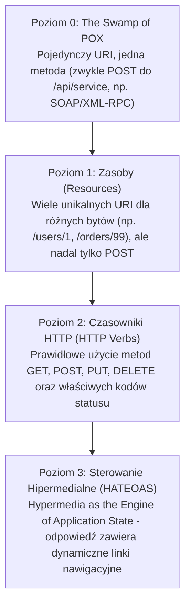
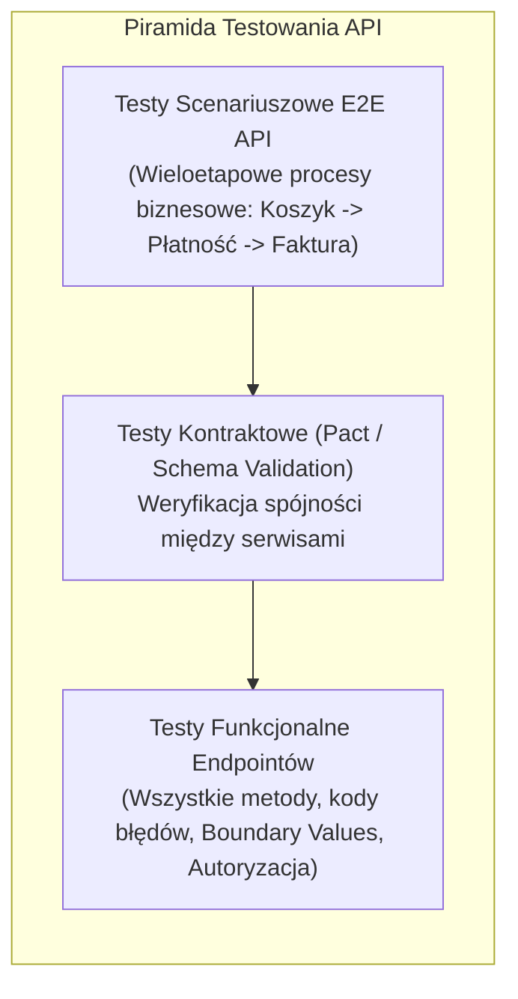
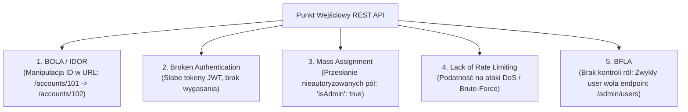

# Testowanie REST API: Architektura, Automatyzacja i Pytania Rekrutacyjne

Kompleksowy przewodnik inżynierski po testowaniu interfejsów programistycznych aplikacji w architekturze **REST (Representational State Transfer)** oraz protokole **HTTP**. Obejmuje analizę semantyki protokołu, idempotentność metod, walidację kontraktów (JSON Schema, OpenAPI, Pact), automatyzację testów w różnych ekosystemach (Java RestAssured, C# RestSharp, Postman/Newman), bezpieczeństwo według standardu **OWASP API Security Top 10** oraz zestaw zaawansowanych pytań rekrutacyjnych i scenariuszy awaryjnych (od poziomu Mid do Lead / QA Automation Architect).

---

## Spis Treści
1. [Fundamenty Architektury REST i Protokołu HTTP](#1-fundamenty-architektury-rest-i-protokołu-http)
   - 6 Zasad Architektonicznych REST (Roy Fielding)
   - Model Dojrzałości Richardsona (Levels 0 - 3: HATEOAS)
   - Metody HTTP: Semantyka, Bezpieczeństwo (Safe) i Idempotentność (Idempotent)
   - Kody Statusu HTTP i ich Prawidłowe Użycie
2. [Poziomy i Strategie Testowania API](#2-poziomy-i-strategie-testowania-api)
   - Testy Funkcjonalne (CRUD, Boundary Values, Negatywne)
   - Walidacja Schematów (JSON Schema / OpenAPI Spec)
   - Testy Kontraktowe sterowane przez konsumenta (Consumer-Driven Contract Testing z Pact)
   - Testy Wydajnościowe i Obciążeniowe (SLA, p95/p99 latency, Throughput RPS)
3. [Automatyzacja Testów API w Praktyce](#3-automatyzacja-testów-api-w-praktyce)
   - Ekosystem Java: **RestAssured** (BDD `given/when/then`, JSONPath, walidacja schematów)
   - Ekosystem .NET (C#): **RestSharp** i **HttpClient** z FluentAssertions
   - Narzędzia Low-Code: **Postman** & **Newman** w potokach CI/CD
4. [Wirtualizacja Usług i Mockowanie Zależności (Service Virtualization)](#4-wirtualizacja-usług-i-mockowanie-zależności-service-virtualization)
   - Kiedy mockować zewnętrzne API? (WireMock, MockServer)
   - Wstrzykiwanie opóźnień sieciowych (Latency Injection) i symulacja awarii
5. [Bezpieczeństwo REST API (OWASP API Security Top 10)](#5-bezpieczeństwo-rest-api-owasp-api-security-top-10)
   - BOLA / IDOR (Broken Object Level Authorization) — Zagrożenie nr 1
   - Bezpieczeństwo Tokenów JWT (Struktura, fałszowanie, weryfikacja algorytmu)
   - Mass Assignment, Broken Function Level Authorization i Rate Limiting
6. [Pytania Rekrutacyjne z Odpowiedziami (FAQ Interview)](#6-pytania-rekrutacyjne-z-odpowiedziami-faq-interview)
   - Pytania Podstawowe i Średniozaawansowane (Mid)
   - Pytania Zaawansowane i Architektoniczne (Senior / Automation Lead)
   - Scenariusze Awaryjne i Live-fire Troubleshooting
7. [Tablica Szybkiej Powtórki (Cheat-Sheet)](#7-tablica-szybkiej-powtórki-cheat-sheet)

---

## 1. Fundamenty Architektury REST i Protokołu HTTP

REST (**Representational State Transfer**) nie jest protokołem ani standardem, lecz stylem architektonicznym opisanym w 2000 roku przez Roya Fieldinga w jego pracy doktorskiej.

### 6 Zasad Architektonicznych REST:
1. **Klient-Serwer (Client-Server):** Separacja interfejsu użytkownika od logiki biznesowej i przechowywania danych.
2. **Bezstanowość (Stateless):** Każde żądanie od klienta do serwera musi zawierać **wszystkie informacje niezbędne do jego obsłużenia**. Serwer nie przechowuje kontekstu sesji klienta w pamięci.
3. **Pamięć Podręczna (Cacheable):** Odpowiedzi muszą jednoznacznie deklarować, czy mogą być buforowane (nagłówki `Cache-Control`, `ETag`, `Expires`).
4. **Jednolity Interfejs (Uniform Interface):** Identyfikacja zasobów za pomocą URI, manipulacja zasobami przez reprezentacje (JSON/XML), wiadomości samoopisujące się (`Content-Type`) oraz HATEOAS.
5. **System Warstwowy (Layered System):** Klient nie wie (i nie musi wiedzieć), czy łączy się bezpośrednio z serwerem końcowym, czy z węzłem pośredniczącym (Load Balancer, API Gateway, CDN).
6. **Kod na Żądanie (Code on Demand — opcjonalne):** Serwer może tymczasowo rozszerzyć funkcjonalność klienta, przesyłając kod wykonywalny (np. JavaScript).

---

### Model Dojrzałości Richardsona (Richardson Maturity Model)
Klasyfikacja dojrzałości implementacji usług sieciowych w drodze do prawdziwego REST:



---

### Metody HTTP: Semantyka, Bezpieczeństwo i Idempotentność

* **Bezpieczna (Safe):** Metoda jest bezpieczna, jeśli jej wywołanie **nie powoduje żadnych efektów ubocznych (Side Effects)** na serwerze (nie zmienia stanu zasobu). Służy wyłącznie do odczytu danych.
* **Idempotentna (Idempotent):** Metoda jest idempotentna, jeśli jej **wielokrotne wywołanie z tymi samymi parametrami daje dokładnie taki sam stan serwera**, jak wywołanie jej jednokrotnie:
  $$f(f(x)) = f(x)$$

| Metoda HTTP | Bezpieczna (Safe)? | Idempotentna? | CRUD | Zastosowanie |
| :--- | :---: | :---: | :---: | :--- |
| **`GET`** | **TAK** | **TAK** | Read | Pobranie reprezentacji zasobu |
| **`HEAD`** | **TAK** | **TAK** | Read | To samo co GET, ale zwraca wyłącznie nagłówki (bez body) |
| **`OPTIONS`**| **TAK** | **TAK** | - | Sprawdzenie dozwolonych metod i polityki CORS |
| **`POST`** | NIE | **NIE** | Create | Utworzenie nowego podrzędnego zasobu (każdy request tworzy nowy rekord) |
| **`PUT`** | NIE | **TAK** | Update/Replace | Całkowite zastąpienie zasobu pod wskazanym adresem URI |
| **`PATCH`** | NIE | **NIE\*** | Partial Update | Częściowa aktualizacja zasobu (modyfikacja tylko wskazanych pól) |
| **`DELETE`** | NIE | **TAK** | Delete | Usunięcie zasobu pod wskazanym adresem URI |

*\*Standard RFC 5789 definiuje PATCH jako metodę nieidempotentną, chociaż w praktyce często implementuje się ją w sposób idempotentny.*

---

### Kody Statusu HTTP (Kategorie Inżynierskie)
* **`2xx` (Sukces):**
  - `200 OK`: Standardowy sukces operacji (odczyt, aktualizacja).
  - `201 Created`: Zasób został pomyślnie utworzony (musi zawierać nagłówek `Location` ze ścieżką do nowego zasobu).
  - `204 No Content`: Sukces, ale odpowiedź celowo nie zawiera ciała (częste przy `DELETE` lub pustym `PUT`).
* **`3xx` (Przekierowania):**
  - `301 Moved Permanently`: Trwałe przekierowanie (SEO friendly).
  - `304 Not Modified`: Klient ma aktualną wersję w pamięci podręcznej (nagłówek `If-None-Match` / `ETag`).
* **`4xx` (Błędy Klienta):**
  - `400 Bad Request`: Niepoprawna składnia JSON, błąd walidacji danych.
  - `401 Unauthorized`: **Brak uwierzytelnienia** (brak tokenu lub token niepoprawny).
  - `403 Forbidden`: Użytkownik jest uwierzytelniony, ale **nie posiada uprawnień** do tego zasobu.
  - `404 Not Found`: Zasób pod danym URI nie istnieje.
  - `405 Method Not Allowed`: Metoda (np. `DELETE`) nie jest wspierana dla tego zasobu (musi zwrócić nagłówek `Allow`).
  - `409 Conflict`: Konflikt stanu (np. próba rejestracji na zajęty adres e-mail).
  - `415 Unsupported Media Type`: Serwer nie akceptuje formatu przesłanego w `Content-Type` (np. przesłano XML zamiast JSON).
  - `422 Unprocessable Entity`: Składnia JSON jest poprawna, ale dane naruszają reguły domenowe/semantyczne.
  - `429 Too Many Requests`: Przekroczono limit zapytań (Rate Limiting).
* **`5xx` (Błędy Serwera):**
  - `500 Internal Server Error`: Niezłapany wyjątek w kodzie backendu (`NullPointerException`).
  - `502 Bad Gateway`: Węzeł pośredniczący (Reverse Proxy, API Gateway) otrzymał niepoprawną odpowiedź od serwera nadrzędnego.
  - `503 Service Unavailable`: Serwer jest przeciążony lub wyłączony na czas prac serwisowych.
  - `504 Gateway Timeout`: Serwer pośredniczący nie doczekał się odpowiedzi od mikroserwisu w wyznaczonym czasie.

---

## 2. Poziomy i Strategie Testowania API



### 1. Walidacja Schematów (JSON Schema)
Weryfikacja pojedynczego pola (np. `assert body.id == 10`) nie gwarantuje, że backend nie usunął kluczowej właściwości lub nie zmienił typu z `number` na `string`.
* **JSON Schema:** Standard definiujący dokładną strukturę odpowiedzi JSON (wymagane pola, formaty e-mail, wzorce regex, typy danych, limity min/max).
* Testy automatyczne powinny weryfikować zgodność odpowiedzi ze schematem przy każdym zapytaniu.

### 2. Testy Kontraktowe sterowane przez konsumenta (Consumer-Driven Contract Testing z Pact)
W architekturze mikrousług tradycyjne testy end-to-end są powolne i zawodne.
* **Zasada działania Pact:**
  1. **Konsument (np. Frontend lub Serwis B):** Definiuje kontrakt — czego dokładnie oczekuje od dostawcy (Providera) i generuje plik kontraktu (Pact JSON file).
  2. **Dostawca (Provider - Serwis A):** W swoim pipeline CI/CD pobiera kontrakt i uruchamia test weryfikujący, czy jego endpointy spełniają wymagania konsumenta bez konieczności uruchamiania konsumenta.
  3. **Rezultat:** Wykrycie niekompatybilności API przed wdrożeniem do środowiska integracyjnego!

---

## 3. Automatyzacja Testów API w Praktyce

### Ekosystem Java: REST Assured
REST Assured to najpopularniejsza biblioteka w Javie oparta na składni **BDD (Behavior-Driven Development)**:

```java
import org.testng.annotations.Test;
import static io.restassured.RestAssured.*;
import static org.hamcrest.Matchers.*;
import static io.restassured.module.jsv.JsonSchemaValidator.matchesJsonSchemaInClasspath;

public class UserApiTests {

    @Test
    public void shouldCreateUserAndValidateContract() {
        baseURI = "https://api.sklep.pl/v1";

        String userPayload = """
            {
                "email": "jan.kowalski@test.pl",
                "name": "Jan Kowalski",
                "role": "CUSTOMER"
            }
            """;

        given()
            .header("Content-Type", "application/json")
            .header("Authorization", "Bearer eyJhbGciOi...")
            .body(userPayload)
        .when()
            .post("/users")
        .then()
            .statusCode(201)
            .header("Location", containsString("/users/"))
            .body("id", notNullValue())
            .body("email", equalTo("jan.kowalski@test.pl"))
            .body("role", equalTo("CUSTOMER"))
            // Pełna walidacja zgodności z JSON Schema
            .assertThat().body(matchesJsonSchemaInClasspath("schemas/user-schema.json"));
    }
}
```

---

### Ekosystem .NET (C#): RestSharp i FluentAssertions

```csharp
using RestSharp;
using FluentAssertions;
using NUnit.Framework;
using System.Net;

[TestFixture]
public class ProductApiTests
{
    private RestClient _client;

    [SetUp]
    public void Setup()
    {
        _client = new RestClient("https://api.sklep.pl/v1");
    }

    [Test]
    public async Task GetProduct_ShouldReturnSuccess_WhenProductExists()
    {
        var request = new RestRequest("/products/101", Method.Get);
        request.AddHeader("Accept", "application/json");

        var response = await _client.ExecuteAsync<ProductDto>(request);

        response.StatusCode.Should().Be(HttpStatusCode.OK);
        response.Data.Should().NotBeNull();
        response.Data.Id.Should().Be(101);
        response.Data.Price.Should().BeGreaterThan(0);
        response.ContentType.Should().Contain("application/json");
    }
}
```

---

### Postman i Automatyzacja z Newman w CI/CD
Postman to środowisko do projektowania i eksploracji API, a **Newman** to jego oficjalny runner konsolowy (CLI):
* W Postmanie testy pisze się w języku JavaScript w zakładce **Scripts -> Post-response**:
  ```javascript
  pm.test("Status code is 200", function () {
      pm.response.to.have.status(200);
  });

  pm.test("Token is present and valid", function () {
      var jsonData = pm.response.json();
      pm.expect(jsonData.token).to.be.a("string");
      // Przekazanie tokenu do zmiennej środowiskowej dla kolejnych zapytań
      pm.environment.set("jwt_token", jsonData.token);
  });
  ```
* Uruchomienie kolekcji w potoku CI/CD:
  ```bash
  newman run EcommerceCollection.json -e StagingEnv.json --reporters cli,junit --reporter-junit-export report.xml
  ```

---

## 4. Wirtualizacja Usług i Mockowanie Zależności (Service Virtualization)

Podczas testowania mikroserwisu integracja z zewnętrznymi API (np. bramka płatności Stripe, serwis SMS, systemy bankowe) rodzi problemy:
* Zewnętrzne serwisy naliczają opłaty za każde wywołanie.
* Środowiska testowe podmiotów trzecich są często niestabilne.
* Niemożliwe jest łatwe wygenerowanie rzadkich błędów produkcyjnych (np. timeout po 30 sekundach lub błąd 503).

### Zastosowanie WireMock
**WireMock** to biblioteka do mockowania serwerów HTTP działająca jako lokalny serwer testowy:

```java
import static com.github.tomakehurst.wiremock.client.WireMock.*;

public class PaymentIntegrationTest {

    @Test
    public void testPaymentGatewayTimeout() {
        // Konfiguracja stuba WireMock: symulacja opóźnienia i błędu 504
        stubFor(post(urlEqualTo("/v1/charges"))
            .withHeader("Authorization", containing("Bearer"))
            .willReturn(aResponse()
                .withStatus(504)
                .withFixedDelay(2000) // 2 sekundy opóźnienia
                .withBody("{\"error\": \"Gateway Timeout\"}")));

        // Wykonanie testu aplikacji sprawdzającego zachowanie mechanizmu Circuit Breaker / Retry
    }
}
```

---

## 5. Bezpieczeństwo REST API (OWASP API Security Top 10)

Podczas testowania API weryfikacja logiki biznesowej to za mało. Kluczowe jest testowanie pod kątem wektorów ataku zdefiniowanych przez fundację **OWASP**:



### 1. BOLA / IDOR (Broken Object Level Authorization) — Zagrożenie #1
Najczęstsza i najbardziej krytyczna podatność w API:
* **Istota problemu:** Użytkownik A loguje się do systemu i odpytuje endpoint o swoje konto: `GET /api/documents/1001`. Następnie manualnie modyfikuje ID w zapytaniu na `GET /api/documents/1002` (dokument użytkownika B). Jeśli serwer weryfikuje jedynie, czy użytkownik jest zalogowany, ale **nie sprawdza, czy ma prawo dostępu do tego konkretnego obiektu biznesowego**, dochodzi do wycieku danych.
* **Testowanie:** Przygotowanie testu z dwoma tokenami autoryzacyjnymi (User A i User B) i próba odczytu/edycji zasobów Usera A przy użyciu poświadczeń Usera B (powinno bezwzględnie zwrócić **`403 Forbidden`** lub **`404 Not Found`**).

---

### 2. Anatomia i Bezpieczeństwo Tokenów JWT (JSON Web Token)
JWT składa się z trzech części zakodowanych w Base64Url i oddzielonych kropkami:
$$\text{Header} \,.\, \text{Payload} \,.\, \text{Signature}$$

```
eyJhbGciOiJIUzI1NiIsInR5cCI6IkpXVCJ9. (Header: Algorytm HS256)
eyJzdWIiOiIxMjM0NTYiLCJyb2xlIjoiVVNFUiIsImV4cCI6MTcxOTk5OTk5OX0. (Payload: Dane, Rola, Czas wygaśnięcia)
4b7b28... (Signature: Podpis kryptograficzny kluczem serwera)
```

* **Wektory ataków do przetestowania:**
  1. **Atak "None Algorithm":** Podmiana nagłówka na `{"alg": "none"}` i usunięcie podpisu (podatne serwery akceptują taki token jako poprawny).
  2. **Fałszowanie Payloadu:** Zmiana pola `"role": "USER"` na `"role": "ADMIN"`. Test musi zweryfikować, czy zmodyfikowany token zostaje natychmiast odrzucony błędem `401 Unauthorized`.
  3. **Weryfikacja wygasania (`exp`):** Wysłanie żądania z tokenem o dacie w przeszłości (musi zwrócić `401`).

---

## 6. Pytania Rekrutacyjne z Odpowiedziami (FAQ Interview)

### Pytania Podstawowe i Średniozaawansowane (Mid)

#### P1: Czym różni się metoda `PUT` od metody `PATCH`?
**Odpowiedź:**
* **`PUT` (Całkowite zastąpienie):** Służy do pełnej podmiany zasobu pod wskazanym adresem URI. Wymaga przesłania **pełnego stanu obiektu**. Jeśli prześlemy obiekt zawierający tylko jedno pole (np. `{"name": "Nowa"}`), wszystkie pozostałe pola zasobu zostaną skasowane lub ustawione na wartości domyślne (`null`). Metoda `PUT` jest **idempotentna**.
* **`PATCH` (Częściowa aktualizacja):** Służy do modyfikacji wyłącznie wybranych atrybutów zasobu bez naruszania pozostałych. Przesłanie `{"name": "Nowa"}` zaktualizuje wyłącznie imię, pozostawiając resztę danych bez zmian.

---

#### P2: Co oznacza, że metoda HTTP jest idempotentna? Czy metoda `DELETE` jest idempotentna?
**Odpowiedź:**
* Metoda jest idempotentna, jeśli jej jednokrotne wykonanie wywołuje dokładnie taki sam stan na serwerze, jak jej wielokrotne wykonanie z tymi samymi danymi: $f(f(x)) = f(x)$.
* **Czy `DELETE` jest idempotentny? TAK.**
  - Pierwsze wywołanie `DELETE /users/10` usuwa użytkownika z bazy danych (stan serwera: użytkownik nie istnieje). Zwraca status `200 OK` lub `204 No Content`.
  - Drugie wywołanie `DELETE /users/10` nie znajduje już użytkownika i może zwrócić kod `404 Not Found`, ale **stan danych na serwerze nie ulega zmianie** (użytkownik nadal nie istnieje).
  - *Ważna uwaga:* Idempotentność dotyczy **stanu danych na serwerze**, a nie kodu statusu HTTP zwracanego w odpowiedzi!

---

#### P3: Jaka jest różnica między kodem statusu `401 Unauthorized` a `403 Forbidden`?
**Odpowiedź:**
* **`401 Unauthorized` (Brak Uwierzytelnienia):** Serwer nie wie, kim jest użytkownik. Żądanie nie zawiera nagłówka `Authorization`, token wygasł lub podpis jest nieprawidłowy. Klient może ponowić żądanie po zalogowaniu.
* **`403 Forbidden` (Brak Autoryzacji):** Serwer doskonale wie, kim jest użytkownik (został pomyślnie uwierzytelniony), ale po weryfikacji uprawnień biznesowych (RBAC) stwierdza, że użytkownik **nie ma prawa dostępu do tego zasobu** (np. zwykły użytkownik próbuje usunąć konto administratora). Ponowienie żądania z tymi samymi poświadczeniami nic nie zmieni.

---

### Pytania Zaawansowane i Architektoniczne (Senior / Automation Lead)

#### P4: Jak zaprojektować automatyczny test weryfikujący podatność BOLA (Broken Object Level Authorization)?
**Odpowiedź:**
Test BOLA wymaga architektury opartej na dwóch niezależnych kontekstach użytkowników:
1. W fazie przygotowawczej (Setup) tworzymy dwa odrębne konta: Użytkownik A (ofiara) oraz Użytkownik B (napastnik).
2. Jako Użytkownik A tworzymy prywatny zasób: `POST /api/orders` $\rightarrow$ otrzymujemy `orderId = 555`.
3. Przechodzimy do kontekstu Użytkownika B (z jego własnym, w pełni legalnym tokenem JWT).
4. Wykonujemy operację na zasobie Użytkownika A za pomocą tożsamości Użytkownika B:
   `GET /api/orders/555` lub `DELETE /api/orders/555`.
5. **Asercja bezpieczeństwa:**
   - Jeśli serwer zwróci `200 OK` lub zmodyfikuje zasób $\rightarrow$ **KRYTYCZNA PODATNOŚĆ BOLA!**
   - Poprawne zachowanie serwera: Zwrócenie kodu **`403 Forbidden`** (lub `404 Not Found`, aby nie ujawniać faktu istnienia zasobu).

---

#### P5: W jaki sposób przetestować asynchroniczny endpoint REST API, który zwraca kod statusu `202 Accepted`?
**Odpowiedź:**
Wiele operacji biznesowych (np. generowanie raportu finansowego, przetwarzanie wideo) trwa zbyt długo, by blokować połączenie HTTP:
1. Serwer przyjmuje żądanie `POST /api/reports` i natychmiast zwraca kod **`202 Accepted`**.
2. W nagłówku odpowiedzi serwer musi zwrócić nagłówek **`Location: /api/reports/queue/task-99`** oraz opcjonalny nagłówek `Retry-After: 5`.
3. **Wzorzec testowy (Polling / Awaiting Pattern):**
   - Test asercją weryfikuje kod `202` oraz obecność nagłówka `Location`.
   - Następnie test w pętli z limitem czasu (np. używając biblioteki `Awaitility` w Javie lub `Polly` w C#) odpytuje adres z nagłówka `Location` metodą `GET`:
     - Dopóki serwer zwraca `{ "status": "PROCESSING" }`, test czeka zgodnie z interwałem.
     - Gdy serwer zwróci `{ "status": "COMPLETED", "resultUrl": "..." }`, test przerywa pętlę i asercją weryfikuje końcowy wynik.
   - W teście należy bezwzględnie zdefiniować sztywny timeout (np. 30 sekund), aby zapobiec zawieszeniu pipeline'u CI/CD w przypadku awarii wątku w tle.

---

#### P6: Czym różni się Consumer-Driven Contract Testing (np. z użyciem frameworka Pact) od tradycyjnych testów integracyjnych End-to-End?
**Odpowiedź:**
* **Testy E2E:** Wymagają uruchomienia wszystkich powiązanych mikroserwisów w jednym środowisku sieciowym. Są bardzo wolne, podatne na awarie środowiskowe (*Flaky*), trudne w utrzymaniu i nie wskazują bezpośrednio, który serwis złamał kontrakt.
* **Consumer-Driven Contract Testing (Pact):**
  - Rozbija testy integracyjne na dwa w pełni niezależne, szybkie etapy jednostkowe.
  - **Po stronie konsumenta:** Test mockuje providera, weryfikuje zachowanie klienta i generuje plik kontraktu (Pact file) zawierający minimalny zestaw pól wymaganych przez konsumenta.
  - **Po stronie providera:** Provider w izolacji (bez uruchamiania konsumentów) odpala framework Pact, który symuluje żądania z pliku kontraktu i sprawdza, czy odpowiedzi backendu spełniają zadeklarowane reguły.
  - Eliminuje problem niekompatybilności API przy wdrożeniach mikroserwisów bez narzutu na ciężkie środowiska stagingowe.

---

### Scenariusze Awaryjne i Live-fire Troubleshooting

#### Scenariusz 1: Testy automatyczne API w pipeline CI/CD losowo padają z kodem statusu `429 Too Many Requests`.
**Diagnoza i Plan Naprawczy:**
1. **Identyfikacja przyczyny:** W środowisku testowym uruchomiono testy równoległe na wielu wątkach/procesach. Wszystkie testy korzystały z tego samego klucza API lub współdzieliły ten sam publiczny adres IP runnera CI/CD, przekraczając zdefiniowany próg **Rate Limitingu** na API Gateway (np. Nginx / Kong).
2. **Kroki naprawcze:**
   - W środowisku testowym (Staging/Test): wyłączenie lub podniesienie limitów rate-limiterów dla IP runnerów CI/CD.
   - W kodzie testów: wdrożenie mechanizmu **Exponential Backoff with Jitter** — ponawianie zapytań z rosnącym opóźnieniem w przypadku napotkania kodu `429` (respektując nagłówek `Retry-After`).
   - Prawidłowa parametryzacja kluczy API per wątek wykonawczy.

---

#### Scenariusz 2: Endpoint zwraca kod `200 OK`, ale w ciele odpowiedzi znajduje się `{ "status": "ERROR", "message": "Database connection failed" }`. Dlaczego jest to antywzorzec i jak go obsłużyć?
**Diagnoza i Rozwiązanie:**
1. **Dlaczego to antywzorzec?** Narusza fundamentalną regułę HTTP i REST (Model Richardsona Poziom 2). Narzędzia sieciowe (Load Balancery, Proxy, systemy monitoringu APM jak Datadog/Dynatrace) monitorują stan usług na podstawie kodów statusu HTTP. Zwrócenie `200 OK` sprawia, że systemy telemetryczne uznają awarię za sukces, ukrywając błąd przed inżynierami.
2. **Postępowanie w testach:**
   - Zgłoszenie błędu architektonicznego do zespołu backendu (endpoint powinien zwrócić kod z rodziny `5xx`).
   - W testach automatycznych: asercja sprawdzająca wyłącznie `statusCode == 200` fałszywie zaliczy test. Do momentu poprawy backendu, test musi weryfikować zarówno kod HTTP, jak i strukturę wewnętrzną ciała odpowiedzi (`body.status != "ERROR"`).

---

## 7. Tablica Szybkiej Powtórki (Cheat-Sheet)

| Zagadnienie | Słowa Kluczowe i Niskopoziomowe Koncepcje |
| :--- | :--- |
| **Zasady REST** | Stateless (bezstanowość), Client-Server, Cacheable, Uniform Interface, Layered System, HATEOAS |
| **Richardson Model** | Level 0 (The Swamp/RPC), Level 1 (Resources), Level 2 (HTTP Verbs), Level 3 (HATEOAS) |
| **Metody HTTP** | Safe (GET, HEAD, OPTIONS), Idempotent (GET, PUT, DELETE, HEAD), Non-idempotent (POST, PATCH) |
| **Kluczowe Kody** | 201 (Created + Location), 204 (No Content), 401 (Unauth), 403 (Forbidden), 422 (Semantics), 429 (Rate Limit) |
| **Walidacja** | JSON Schema (typy, regex, required), OpenAPI / Swagger, Pact (Consumer-Driven Contract Testing) |
| **Narzędzia** | RestAssured (Java BDD), RestSharp (C# .NET), Postman/Newman (CLI CI/CD), WireMock (wirtualizacja) |
| **Bezpieczeństwo** | OWASP API Top 10, BOLA/IDOR (test 2 tokenów), Mass Assignment, JWT (None alg, exp, fałszowanie) |
| **Asynchroniczność** | Kod `202 Accepted` + nagłówek `Location`, polling z biblioteką `Awaitility` / `Polly` |
